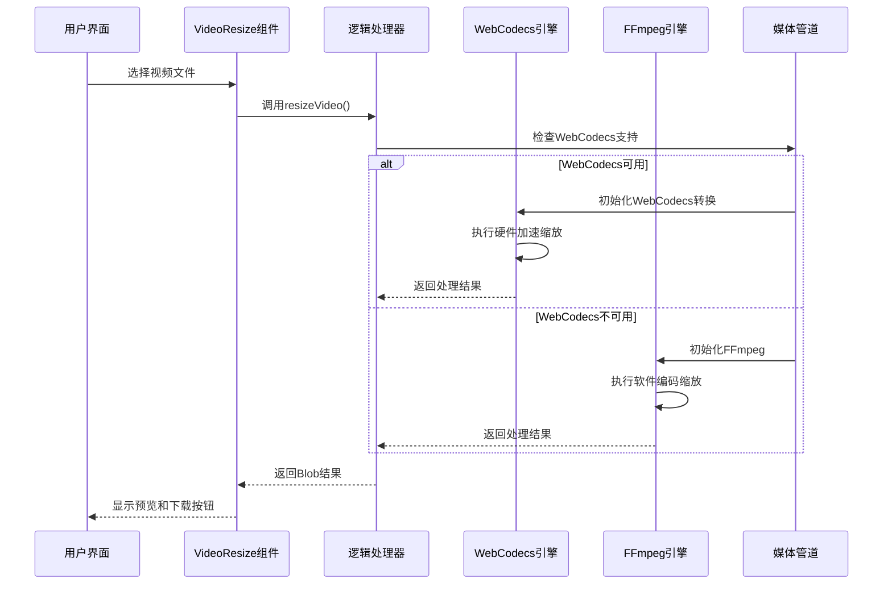
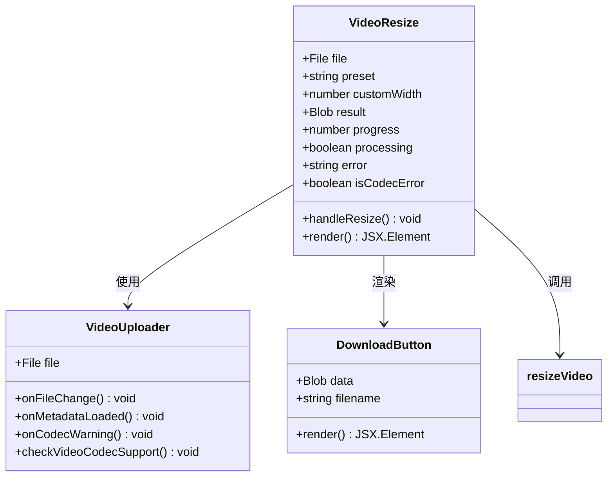
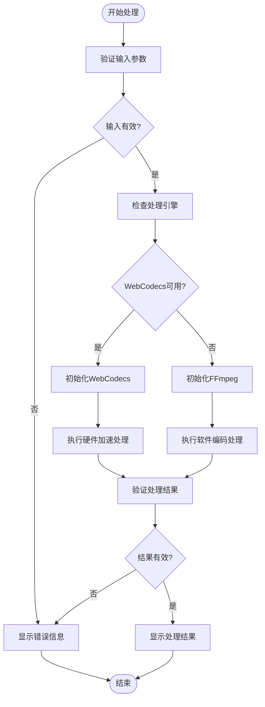
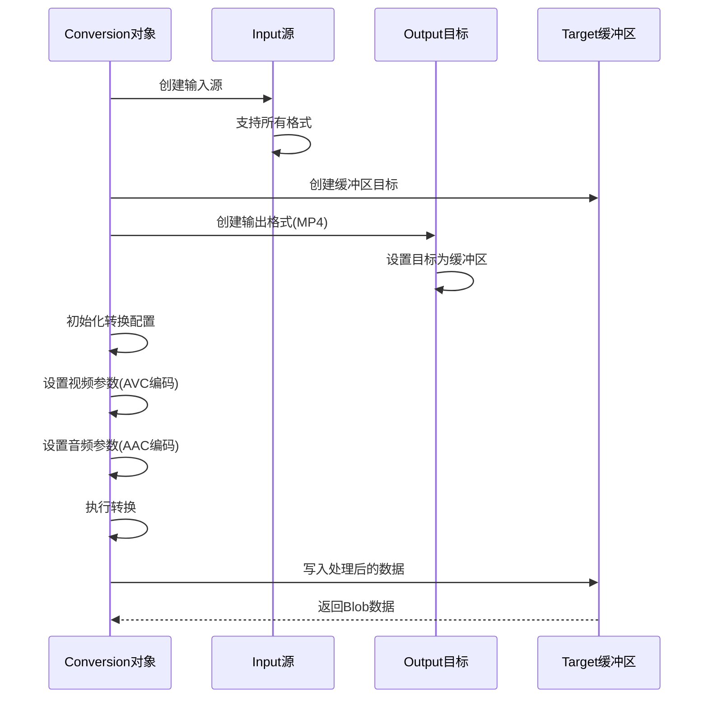
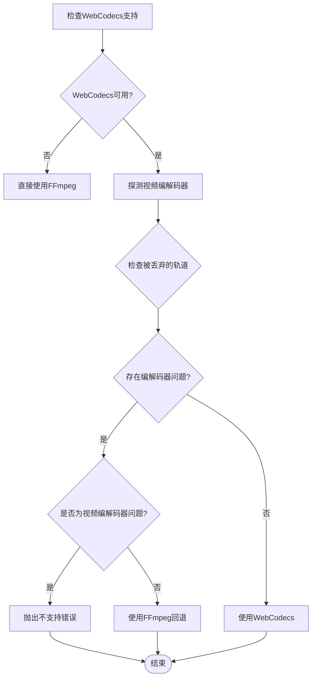
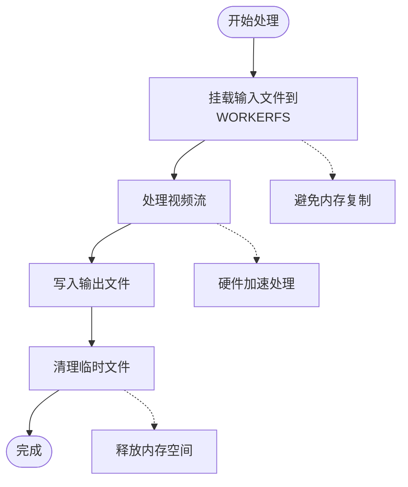
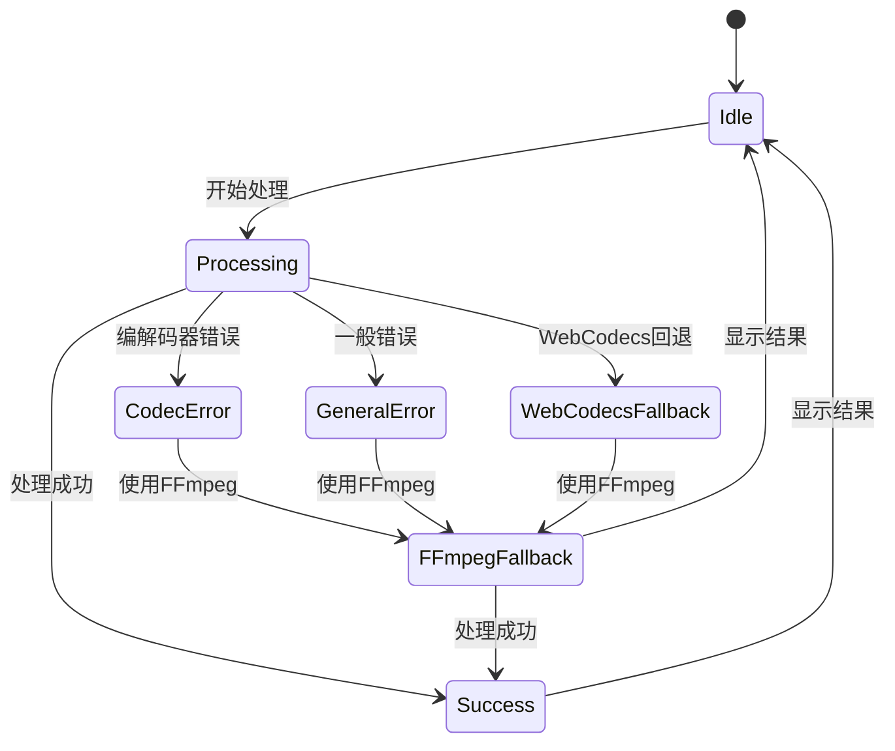

# 视频尺寸调整工具

<cite>
**本文档引用的文件**
- [VideoResize.tsx](file://src/tools/video/resize/VideoResize.tsx)
- [logic.ts](file://src/tools/video/resize/logic.ts)
- [media-pipeline.ts](file://src/lib/media-pipeline.ts)
- [ffmpeg.ts](file://src/lib/ffmpeg.ts)
- [VideoUploader.tsx](file://src/components/shared/VideoUploader.tsx)
- [useObjectUrl.ts](file://src/lib/hooks/useObjectUrl.ts)
- [tools-video.json](file://messages/en/tools-video.json)
- [package.json](file://package.json)
</cite>

## 目录
1. [简介](#简介)
2. [项目结构](#项目结构)
3. [核心组件](#核心组件)
4. [架构概览](#架构概览)
5. [详细组件分析](#详细组件分析)
6. [依赖关系分析](#依赖关系分析)
7. [性能考虑](#性能考虑)
8. [故障排除指南](#故障排除指南)
9. [结论](#结论)

## 简介

视频尺寸调整工具是一个基于浏览器的视频处理工具，允许用户在不上传文件到服务器的情况下调整视频分辨率。该工具提供了多种尺寸调整模式，包括预设分辨率（720p、480p、360p）和自定义尺寸输入，支持等比例缩放以保持视频的原始宽高比。

该工具采用双引擎架构，优先使用WebCodecs API进行硬件加速处理，当遇到不支持的编解码器时自动回退到FFmpeg.wasm进行处理。这种设计确保了最佳的性能和兼容性。

## 项目结构

视频尺寸调整功能位于以下目录结构中：

```mermaid
graph TB
subgraph "视频工具模块"
A[src/tools/video/resize/] --> B[VideoResize.tsx]
A --> C[logic.ts]
D[src/lib/] --> E[media-pipeline.ts]
D --> F[ffmpeg.ts]
G[src/components/shared/] --> H[VideoUploader.tsx]
D --> I[useObjectUrl.ts]
end
subgraph "国际化资源"
J[messages/en/tools-video.json]
end
subgraph "依赖管理"
K[package.json]
end
B --> C
B --> H
C --> E
C --> F
H --> I
B --> J
K --> L[mediabunny]
K --> M[@ffmpeg/ffmpeg]
```

**图表来源**
- [VideoResize.tsx:1-173](file://src/tools/video/resize/VideoResize.tsx#L1-L173)
- [logic.ts:1-117](file://src/tools/video/resize/logic.ts#L1-L117)
- [media-pipeline.ts:1-105](file://src/lib/media-pipeline.ts#L1-L105)
- [ffmpeg.ts:1-144](file://src/lib/ffmpeg.ts#L1-L144)

**章节来源**
- [VideoResize.tsx:1-173](file://src/tools/video/resize/VideoResize.tsx#L1-L173)
- [logic.ts:1-117](file://src/tools/video/resize/logic.ts#L1-L117)
- [package.json:1-45](file://package.json#L1-L45)

## 核心组件

### 主要功能组件

视频尺寸调整工具由以下核心组件构成：

1. **VideoResize 组件** - 用户界面和交互逻辑
2. **resizeVideo 函数** - 主要处理逻辑
3. **WebCodecs 处理器** - 硬件加速视频处理
4. **FFmpeg 处理器** - 软件编码回退方案
5. **VideoUploader 组件** - 文件上传和元数据显示
6. **媒体管道** - 编解码器支持检测

### 预设尺寸配置

系统提供三种预设分辨率选项：

| 预设名称 | 宽度像素 | FFmpeg 缩放参数 | 用途场景 |
|---------|---------|----------------|----------|
| 720p | 1280 | 1280:-2 | 标准高清，社交媒体分享 |
| 480p | 854 | 854:-2 | 移动设备优化，带宽节省 |
| 360p | 640 | 640:-2 | 最小文件大小，快速传输 |

**章节来源**
- [VideoResize.tsx:14-19](file://src/tools/video/resize/VideoResize.tsx#L14-L19)
- [logic.ts:6-10](file://src/tools/video/resize/logic.ts#L6-L10)

## 架构概览

视频尺寸调整工具采用双引擎架构，结合硬件加速和软件编码的优势：



**图表来源**
- [VideoResize.tsx:42-71](file://src/tools/video/resize/VideoResize.tsx#L42-L71)
- [logic.ts:12-36](file://src/tools/video/resize/logic.ts#L12-L36)
- [media-pipeline.ts:7-14](file://src/lib/media-pipeline.ts#L7-L14)

## 详细组件分析

### VideoResize 组件分析

VideoResize 组件是用户界面的核心，负责处理用户交互和状态管理：



**图表来源**
- [VideoResize.tsx:21-173](file://src/tools/video/resize/VideoResize.tsx#L21-L173)
- [VideoUploader.tsx:66-382](file://src/components/shared/VideoUploader.tsx#L66-L382)

#### 尺寸调整算法流程



**图表来源**
- [logic.ts:12-36](file://src/tools/video/resize/logic.ts#L12-L36)
- [VideoResize.tsx:42-71](file://src/tools/video/resize/VideoResize.tsx#L42-L71)

**章节来源**
- [VideoResize.tsx:21-173](file://src/tools/video/resize/VideoResize.tsx#L21-L173)

### WebCodecs 处理器

WebCodecs 处理器利用现代浏览器的硬件加速能力：

#### WebCodecs 处理流程



**图表来源**
- [logic.ts:38-92](file://src/tools/video/resize/logic.ts#L38-L92)

#### WebCodecs 参数配置

| 参数 | 值 | 说明 |
|------|-----|------|
| 视频编解码器 | AVC/H.264 | 最广泛的播放兼容性 |
| 音频编解码器 | AAC | 标准音频编码格式 |
| 硬件加速 | 首选硬件 | 利用GPU加速处理 |
| 输出格式 | MP4 | 跨平台兼容性最佳 |
| 宽度计算 | 自动偶数对齐 | 确保编码器兼容性 |

**章节来源**
- [logic.ts:38-92](file://src/tools/video/resize/logic.ts#L38-L92)

### FFmpeg 处理器

FFmpeg 处理器作为回退方案，确保在所有情况下都能正常工作：

#### FFmpeg 处理参数

| 参数 | 值 | 说明 |
|------|-----|------|
| 输入文件 | 自动挂载 | 使用WORKERFS避免内存复制 |
| 视频滤镜 | scale | 应用缩放算法 |
| 输出编解码器 | libx264 | H.264编码器 |
| 音频编解码器 | aac | AAC音频编码 |
| 进度回调 | 可选 | 实时进度反馈 |

**章节来源**
- [logic.ts:94-117](file://src/tools/video/resize/logic.ts#L94-L117)

### 编解码器支持检测

媒体管道模块负责检测浏览器对不同编解码器的支持情况：



**图表来源**
- [media-pipeline.ts:59-91](file://src/lib/media-pipeline.ts#L59-L91)

**章节来源**
- [media-pipeline.ts:1-105](file://src/lib/media-pipeline.ts#L1-L105)

## 依赖关系分析

### 核心依赖关系

```mermaid
graph TB
subgraph "应用层"
A[VideoResize.tsx]
B[VideoUploader.tsx]
end
subgraph "逻辑层"
C[resizeVideo函数]
D[WebCodecs处理器]
E[FFmpeg处理器]
end
subgraph "基础设施层"
F[media-pipeline.ts]
G[ffmpeg.ts]
H[useObjectUrl.ts]
end
subgraph "外部库"
I[mediabunny]
J[@ffmpeg/ffmpeg]
K[lucide-react]
end
A --> C
A --> B
B --> H
C --> D
C --> E
D --> F
E --> G
D --> I
E --> J
A --> K
```

**图表来源**
- [VideoResize.tsx:1-12](file://src/tools/video/resize/VideoResize.tsx#L1-L12)
- [logic.ts:1-2](file://src/tools/video/resize/logic.ts#L1-L2)
- [package.json:21](file://package.json#L21)

### 关键依赖特性

| 依赖包 | 版本 | 功能描述 | 用途 |
|--------|------|----------|------|
| mediabunny | ^1.40.1 | WebCodecs封装库 | 硬件加速视频处理 |
| @ffmpeg/ffmpeg | ^0.12.15 | FFmpeg WebAssembly版本 | 软件编码回退 |
| @ffmpeg/util | ^0.12.2 | FFmpeg工具函数 | 文件URL处理 |
| lucide-react | ^0.577.0 | 图标库 | 用户界面图标 |

**章节来源**
- [package.json:11-32](file://package.json#L11-L32)

## 性能考虑

### 处理引擎选择策略

系统采用智能引擎选择策略，优先使用性能最优的处理方式：

1. **WebCodecs 优势**
   - 硬件加速处理
   - 更低的CPU占用
   - 更快的处理速度
   - 更好的电池续航

2. **FFmpeg 回退机制**
   - 兼容所有编解码器
   - 稳定的处理结果
   - 广泛的格式支持
   - 可靠的错误处理

### 内存管理优化



**图表来源**
- [ffmpeg.ts:99-144](file://src/lib/ffmpeg.ts#L99-L144)

### 性能基准对比

| 处理方式 | 处理速度 | 内存占用 | 兼容性 |
|----------|----------|----------|--------|
| WebCodecs | 最快 | 最低 | 有限制 |
| FFmpeg | 中等 | 中等 | 最佳 |
| 软件回退 | 最慢 | 最高 | 最佳 |

## 故障排除指南

### 常见问题及解决方案

#### WebCodecs 不支持

**症状**: 工具提示需要 SharedArrayBuffer 支持

**原因**: 浏览器不支持 WebCodecs API 或安全限制

**解决方案**:
1. 更新到最新版本的浏览器
2. 确保使用 HTTPS 协议
3. 检查浏览器扩展是否阻止了 WebCodecs

#### 编解码器不支持

**症状**: 显示 "视频编解码器不受支持" 错误

**原因**: 视频使用了不支持的编解码器（如 H.265/HEVC、VP9、AV1）

**解决方案**:
1. 安装 HEVC 视频扩展（Windows + Chrome/Edge）
2. 使用其他浏览器（Firefox、Safari）
3. 先转换视频格式再进行尺寸调整

#### 处理失败

**症状**: 处理过程中出现错误

**排查步骤**:
1. 检查文件格式是否受支持
2. 确认文件未损坏
3. 尝试较小的文件
4. 清除浏览器缓存后重试

**章节来源**
- [VideoResize.tsx:34-40](file://src/tools/video/resize/VideoResize.tsx#L34-L40)
- [media-pipeline.ts:48-53](file://src/lib/media-pipeline.ts#L48-L53)

### 错误处理机制



**图表来源**
- [logic.ts:18-35](file://src/tools/video/resize/logic.ts#L18-L35)
- [VideoResize.tsx:60-71](file://src/tools/video/resize/VideoResize.tsx#L60-L71)

## 结论

视频尺寸调整工具通过创新的双引擎架构，在保证兼容性的前提下实现了最佳的处理性能。该工具的主要优势包括：

1. **隐私保护**: 所有处理都在本地浏览器中完成，无需上传文件
2. **性能优化**: 优先使用硬件加速的 WebCodecs 引擎
3. **兼容性强**: 自动回退到 FFmpeg 确保各种编解码器的支持
4. **用户体验**: 提供实时预览、进度反馈和批量处理能力

该工具为用户提供了灵活的尺寸调整选项，从简单的预设分辨率到精确的自定义尺寸，满足不同场景的需求。通过合理的算法设计和性能优化，用户可以在保持视频质量的同时显著减小文件大小。