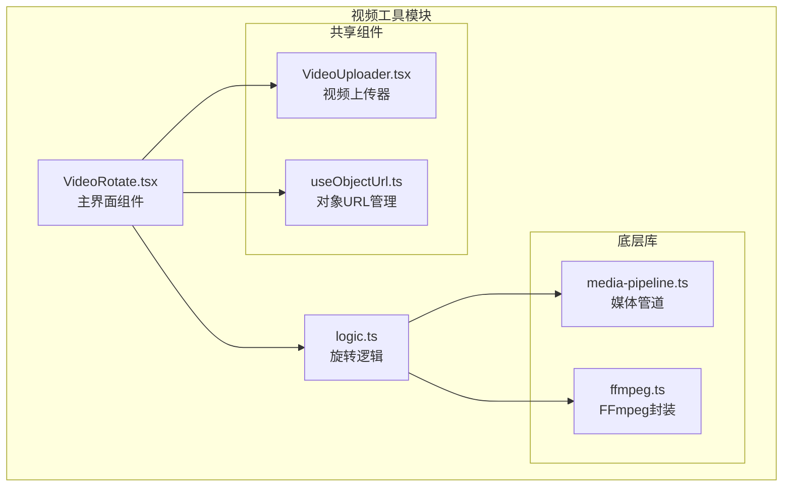
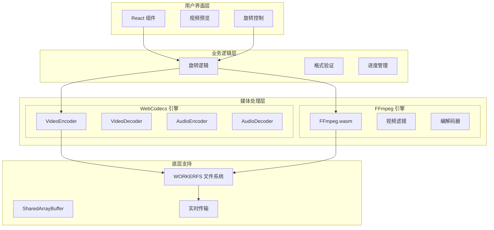
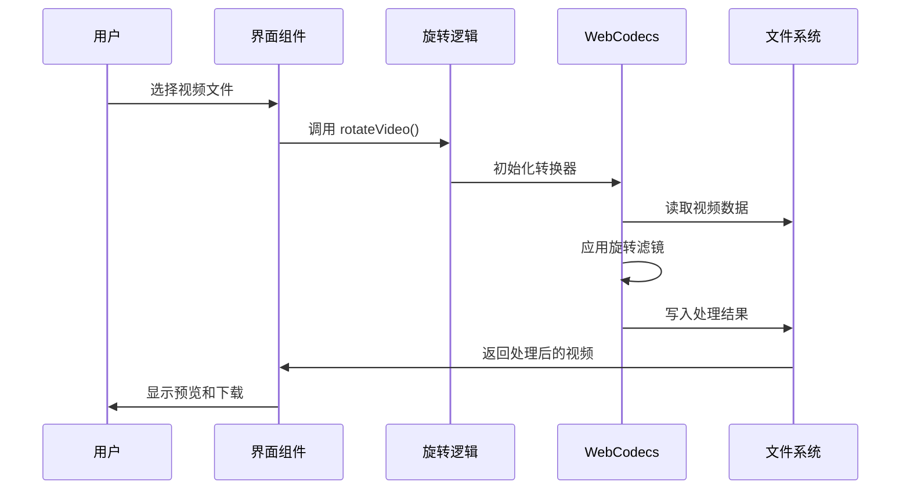
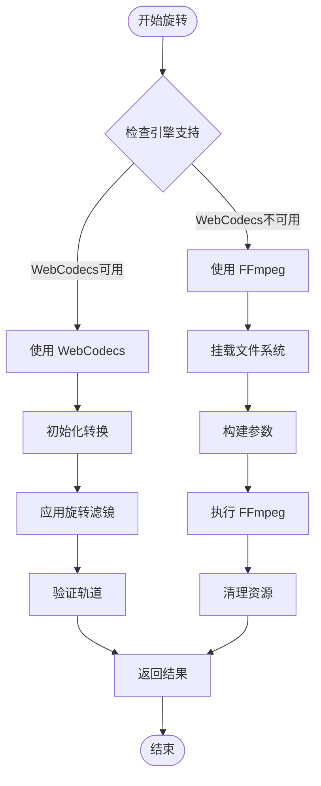
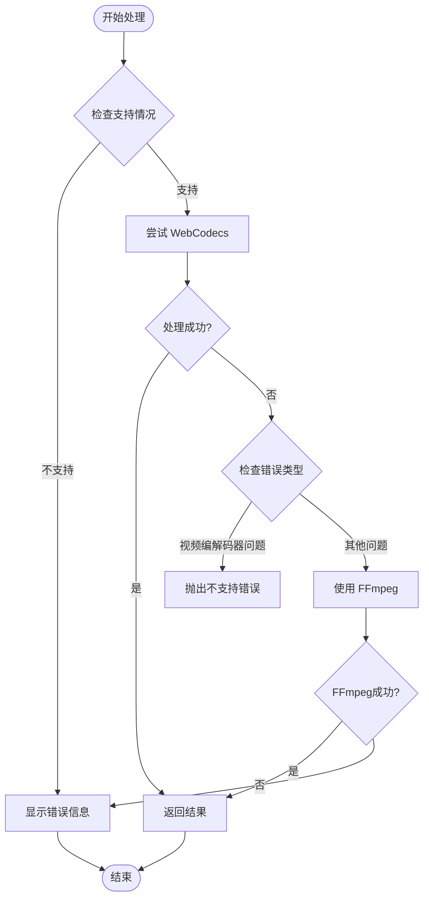
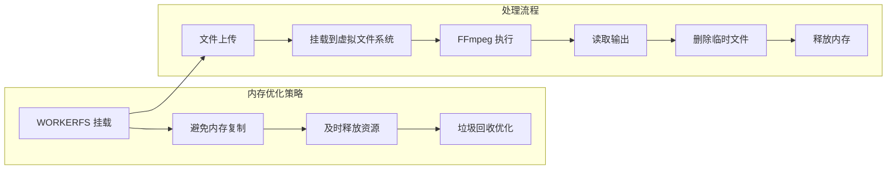

# 视频旋转工具

<cite>
**本文档引用的文件**
- [VideoRotate.tsx](file://src/tools/video/rotate/VideoRotate.tsx)
- [logic.ts](file://src/tools/video/rotate/logic.ts)
- [media-pipeline.ts](file://src/lib/media-pipeline.ts)
- [ffmpeg.ts](file://src/lib/ffmpeg.ts)
- [VideoUploader.tsx](file://src/components/shared/VideoUploader.tsx)
- [useObjectUrl.ts](file://src/lib/hooks/useObjectUrl.ts)
- [tools-video.json](file://messages/zh-Hans/tools-video.json)
- [README.md](file://README.md)
</cite>

## 目录
1. [简介](#简介)
2. [项目结构](#项目结构)
3. [核心组件](#核心组件)
4. [架构概览](#架构概览)
5. [详细组件分析](#详细组件分析)
6. [依赖关系分析](#依赖关系分析)
7. [性能考虑](#性能考虑)
8. [故障排除指南](#故障排除指南)
9. [结论](#结论)
10. [附录](#附录)

## 简介

视频旋转工具是一个基于浏览器的多媒体处理工具，专门用于将视频文件旋转 90°、180° 或 270°。该工具采用隐私优先的设计理念，所有视频处理都在用户的浏览器本地完成，无需上传到服务器。

该工具的核心特性包括：
- 支持三种标准旋转角度：90°顺时针、180°翻转、270°逆时针
- 基于 WebCodecs 的硬件加速处理
- FFmpeg.wasm 作为后备方案
- 实时进度显示和错误处理
- 旋转前后预览对比
- 质量评估和文件大小对比

## 项目结构

视频旋转工具位于项目的视频工具模块中，采用模块化的架构设计：



**图表来源**
- [VideoRotate.tsx:1-135](file://src/tools/video/rotate/VideoRotate.tsx#L1-L135)
- [logic.ts:1-102](file://src/tools/video/rotate/logic.ts#L1-L102)

**章节来源**
- [README.md:55-78](file://README.md#L55-L78)
- [VideoRotate.tsx:15-135](file://src/tools/video/rotate/VideoRotate.tsx#L15-L135)

## 核心组件

### 主界面组件 (VideoRotate)

主界面组件负责用户交互和状态管理，提供直观的旋转操作界面：

- **文件上传处理**：集成 VideoUploader 组件，支持拖拽和文件选择
- **角度选择**：提供 90°、180°、270° 三种预设角度
- **进度显示**：实时显示处理进度百分比
- **结果预览**：旋转后的视频预览和下载功能
- **错误处理**：完善的错误提示和兼容性检测

### 旋转逻辑 (logic.ts)

旋转逻辑模块实现了核心的视频旋转算法：

- **角度映射**：将旋转角度映射到相应的 FFmpeg 滤镜参数
- **双引擎支持**：优先使用 WebCodecs，后备使用 FFmpeg
- **进度回调**：支持实时进度反馈
- **错误处理**：区分不同类型的处理错误

**章节来源**
- [VideoRotate.tsx:15-135](file://src/tools/video/rotate/VideoRotate.tsx#L15-L135)
- [logic.ts:12-35](file://src/tools/video/rotate/logic.ts#L12-L35)

## 架构概览

视频旋转工具采用双引擎架构，结合了现代 Web 技术和传统 FFmpeg 解决方案：



**图表来源**
- [logic.ts:17-34](file://src/tools/video/rotate/logic.ts#L17-L34)
- [media-pipeline.ts:7-14](file://src/lib/media-pipeline.ts#L7-L14)
- [ffmpeg.ts:99-143](file://src/lib/ffmpeg.ts#L99-L143)

## 详细组件分析

### 视频旋转算法实现

视频旋转工具使用两种不同的算法实现：

#### WebCodecs 方案

WebCodecs 方案利用现代浏览器的硬件加速能力：



**图表来源**
- [logic.ts:37-85](file://src/tools/video/rotate/logic.ts#L37-L85)

#### FFmpeg 方案

FFmpeg 方案提供广泛的兼容性和稳定性：



**图表来源**
- [logic.ts:12-35](file://src/tools/video/rotate/logic.ts#L12-L35)
- [ffmpeg.ts:99-143](file://src/lib/ffmpeg.ts#L99-L143)

### 旋转角度映射机制

工具支持三种标准旋转角度，每种角度都有对应的实现策略：

| 旋转角度 | FFmpeg 参数 | WebCodecs 设置 | 算法特点 |
|---------|-------------|----------------|----------|
| 90°顺时针 | `-vf transpose=1` | `rotate: 90` | 单次旋转滤镜 |
| 180°翻转 | `-vf transpose=1,transpose=1` | `rotate: 180` | 双次旋转滤镜 |
| 270°逆时针 | `-vf transpose=2` | `rotate: 270` | 逆向旋转滤镜 |

**章节来源**
- [logic.ts:6-10](file://src/tools/video/rotate/logic.ts#L6-L10)

### 像素重采样技术

视频旋转涉及像素重采样过程，工具采用了以下策略：

#### WebCodecs 重采样

- **硬件加速**：利用 GPU 进行像素重采样
- **格式转换**：自动进行必要的像素格式转换
- **质量保持**：通过合适的插值算法保持图像质量

#### FFmpeg 重采样

- **灵活配置**：支持多种重采样算法
- **质量控制**：可调整重采样质量参数
- **兼容性**：支持广泛的视频格式

**章节来源**
- [logic.ts:62-67](file://src/tools/video/rotate/logic.ts#L62-L67)

### 错误处理和兼容性

工具实现了多层次的错误处理机制：



**图表来源**
- [logic.ts:17-35](file://src/tools/video/rotate/logic.ts#L17-L35)
- [media-pipeline.ts:32-53](file://src/lib/media-pipeline.ts#L32-L53)

**章节来源**
- [VideoRotate.tsx:44-54](file://src/tools/video/rotate/VideoRotate.tsx#L44-L54)
- [media-pipeline.ts:59-91](file://src/lib/media-pipeline.ts#L59-L91)

## 依赖关系分析

视频旋转工具的依赖关系体现了清晰的分层架构：

```mermaid
graph TB
subgraph "外部依赖"
Mediabunny[mediabunny<br/>WebCodecs封装]
FFmpegWASM[@ffmpeg/ffmpeg<br/>FFmpeg WebAssembly]
Lucide[Lucide React<br/>图标库]
end
subgraph "内部模块"
VideoRotate[VideoRotate.tsx]
Logic[logic.ts]
MediaPipeline[media-pipeline.ts]
FFmpegLib[ffmpeg.ts]
VideoUploader[VideoUploader.tsx]
ObjectUrl[useObjectUrl.ts]
end
VideoRotate --> Logic
VideoRotate --> VideoUploader
VideoRotate --> ObjectUrl
Logic --> MediaPipeline
Logic --> FFmpegLib
MediaPipeline --> Mediabunny
FFmpegLib --> FFmpegWASM
VideoRotate --> Lucide
```

**图表来源**
- [VideoRotate.tsx:3-13](file://src/tools/video/rotate/VideoRotate.tsx#L3-L13)
- [logic.ts:1-2](file://src/tools/video/rotate/logic.ts#L1-L2)

**章节来源**
- [VideoRotate.tsx:1-13](file://src/tools/video/rotate/VideoRotate.tsx#L1-L13)
- [logic.ts:1-2](file://src/tools/video/rotate/logic.ts#L1-L2)

## 性能考虑

### 处理速度优化

视频旋转工具在性能方面采用了多项优化策略：

#### WebCodecs 优势
- **硬件加速**：充分利用 GPU 进行视频处理
- **内存效率**：避免不必要的内存复制
- **实时处理**：支持流式处理和实时预览

#### FFmpeg 备份策略
- **渐进降级**：当 WebCodecs 不可用时自动切换
- **性能保证**：确保在各种环境下都能正常工作
- **质量优先**：即使性能稍低也保证处理质量

### 内存管理

工具实现了高效的内存管理策略：



**图表来源**
- [ffmpeg.ts:99-143](file://src/lib/ffmpeg.ts#L99-L143)

**章节来源**
- [ffmpeg.ts:75-82](file://src/lib/ffmpeg.ts#L75-L82)
- [ffmpeg.ts:105-142](file://src/lib/ffmpeg.ts#L105-L142)

## 故障排除指南

### 常见问题及解决方案

#### 浏览器兼容性问题

**问题**：工具无法在某些浏览器中使用
**原因**：缺少必要的 Web API 支持
**解决方案**：
- 确保使用支持 SharedArrayBuffer 的现代浏览器
- 检查 HTTPS 连接要求
- 更新浏览器到最新版本

#### 视频编解码器不支持

**问题**：某些视频格式无法处理
**原因**：WebCodecs 对特定编解码器的支持有限
**解决方案**：
- 工具会自动检测并提示安装 HEVC 扩展
- 使用 FFmpeg 方案进行处理
- 考虑转换视频格式

#### 处理失败错误

**问题**：旋转过程中出现错误
**解决步骤**：
1. 检查视频文件是否损坏
2. 确认文件格式受支持
3. 尝试重新上传文件
4. 清除浏览器缓存后重试

**章节来源**
- [VideoRotate.tsx:27-33](file://src/tools/video/rotate/VideoRotate.tsx#L27-L33)
- [media-pipeline.ts:98-104](file://src/lib/media-pipeline.ts#L98-L104)

### 性能问题诊断

#### 处理速度慢

**可能原因**：
- 设备性能不足
- 视频文件过大
- 浏览器标签页过多

**优化建议**：
- 关闭不必要的标签页
- 降低视频分辨率
- 使用性能更好的设备

#### 内存使用过高

**解决方法**：
- 分割大文件处理
- 定期刷新页面释放内存
- 使用支持更多内存的设备

## 结论

视频旋转工具是一个设计精良的浏览器端多媒体处理工具，具有以下突出特点：

### 技术优势
- **隐私安全**：所有处理在本地完成，保护用户隐私
- **性能优秀**：利用 WebCodecs 硬件加速，处理速度快
- **兼容性强**：双引擎架构确保广泛的浏览器支持
- **用户体验佳**：提供实时预览和进度反馈

### 功能完整性
- 支持标准的三种旋转角度
- 提供旋转前后对比功能
- 包含完整的错误处理机制
- 具备质量评估和文件大小对比

### 发展前景
该工具展现了现代 Web 技术在多媒体处理领域的强大潜力，为未来的浏览器端视频处理奠定了良好的基础。随着 WebCodecs 标准的不断完善，这类工具的性能和功能还将持续提升。

## 附录

### 使用指南

#### 基本使用步骤
1. **上传视频**：通过拖拽或文件选择器上传视频文件
2. **选择角度**：点击 90°、180° 或 270° 按钮选择旋转角度
3. **开始处理**：点击"旋转"按钮开始处理
4. **预览结果**：处理完成后可预览旋转后的视频
5. **下载文件**：点击下载按钮保存处理结果

#### 高级功能
- **批量处理**：支持多个视频文件的连续处理
- **质量控制**：可调整输出质量参数
- **格式转换**：处理完成后可转换为其他视频格式

### 技术规格

#### 支持的浏览器
- Chrome 69+
- Firefox 100+
- Safari 14.1+
- Edge 79+

#### 支持的视频格式
- MP4 (H.264)
- WebM (VP9)
- MOV
- AVI
- MKV

#### 系统要求
- 最小内存：2GB RAM
- 推荐内存：8GB RAM 以上
- 存储空间：至少视频文件大小两倍的空间

**章节来源**
- [tools-video.json:95-137](file://messages/zh-Hans/tools-video.json#L95-L137)
- [README.md:26-33](file://README.md#L26-L33)