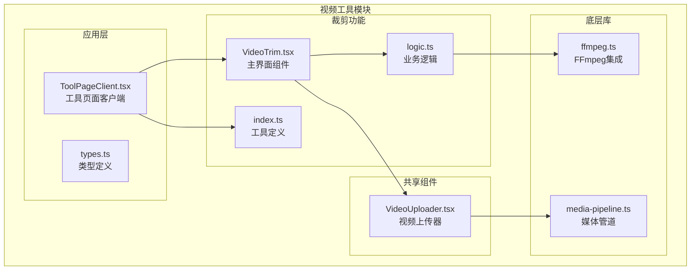
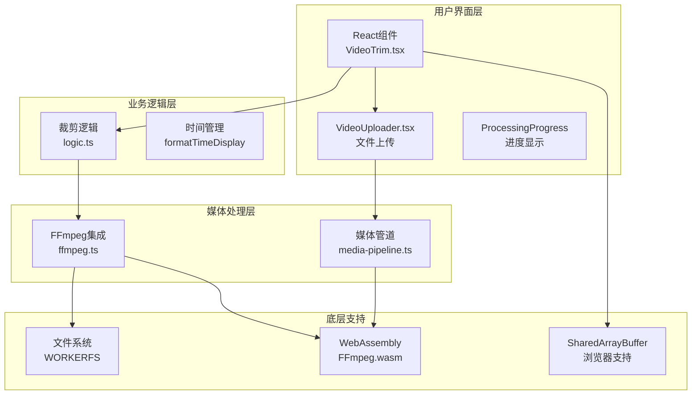
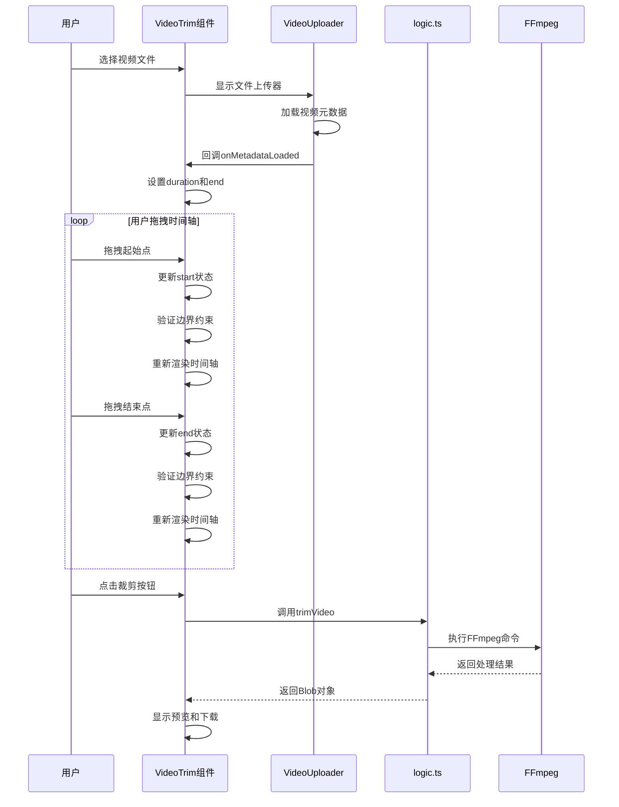
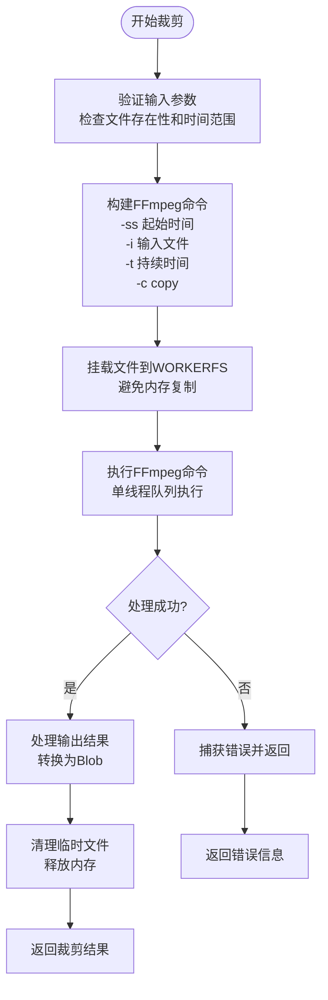
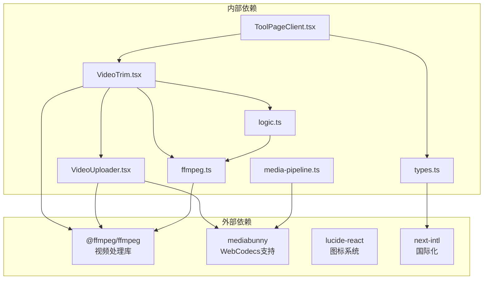

# 视频片段裁剪工具

<cite>
**本文档引用的文件**
- [VideoTrim.tsx](file://src/tools/video/trim/VideoTrim.tsx)
- [logic.ts](file://src/tools/video/trim/logic.ts)
- [index.ts](file://src/tools/video/trim/index.ts)
- [VideoUploader.tsx](file://src/components/shared/VideoUploader.tsx)
- [ffmpeg.ts](file://src/lib/ffmpeg.ts)
- [media-pipeline.ts](file://src/lib/media-pipeline.ts)
- [ToolPageClient.tsx](file://src/app/[locale]/tools/[category]/[slug]/ToolPageClient.tsx)
- [types.ts](file://src/lib/registry/types.ts)
</cite>

## 目录
1. [简介](#简介)
2. [项目结构](#项目结构)
3. [核心组件](#核心组件)
4. [架构概览](#架构概览)
5. [详细组件分析](#详细组件分析)
6. [依赖关系分析](#依赖关系分析)
7. [性能考虑](#性能考虑)
8. [故障排除指南](#故障排除指南)
9. [结论](#结论)
10. [附录](#附录)

## 简介

视频片段裁剪工具是一个基于浏览器的在线视频编辑工具，允许用户从现有视频中提取指定时间段的片段。该工具采用先进的WebAssembly技术，通过FFmpeg.wasm实现实时视频处理，无需服务器端计算即可完成高质量的视频裁剪操作。

本工具的核心特性包括：
- 实时时间轴选择机制
- 高精度时间控制（支持毫秒级）
- 边界智能处理
- 元数据保留和质量保护
- 浏览器原生支持检测
- 用户友好的交互界面

## 项目结构

视频裁剪工具位于项目的视频工具模块中，采用模块化设计，每个工具都独立封装：

**图表来源**
- [VideoTrim.tsx:1-144](file://src/tools/video/trim/VideoTrim.tsx#L1-L144)
- [logic.ts:1-41](file://src/tools/video/trim/logic.ts#L1-L41)
- [VideoUploader.tsx:1-373](file://src/components/shared/VideoUploader.tsx#L1-L373)
- [ffmpeg.ts:1-144](file://src/lib/ffmpeg.ts#L1-L144)

**章节来源**
- [VideoTrim.tsx:1-144](file://src/tools/video/trim/VideoTrim.tsx#L1-L144)
- [VideoUploader.tsx:1-373](file://src/components/shared/VideoUploader.tsx#L1-L373)
- [ffmpeg.ts:1-144](file://src/lib/ffmpeg.ts#L1-L144)

## 核心组件

### 主界面组件 (VideoTrim)

主界面组件负责管理整个裁剪流程的状态和用户交互。它维护以下关键状态：
- 输入文件：用户选择的视频文件
- 持续时间：视频总时长（秒）
- 起始时间：裁剪开始位置（秒）
- 结束时间：裁剪结束位置（秒）
- 处理结果：裁剪后的视频Blob对象
- 进度状态：处理进度百分比
- 错误状态：处理过程中的错误信息

组件实现了完整的生命周期管理，包括文件上传、元数据加载、时间轴交互和结果展示。

### 业务逻辑模块 (logic.ts)

业务逻辑模块封装了视频裁剪的核心算法：
- 时间格式化：支持HH:MM:SS.ms和MM:SS两种显示格式
- FFmpeg命令构建：使用-seek-before输入参数实现快速定位
- 命令执行：通过execWithMount函数执行实际的裁剪操作
- 输出处理：将结果转换为Blob对象供下载使用

### 工具定义 (index.ts)

工具定义文件提供了裁剪工具的元数据配置，包括：
- 工具标识符：用于路由和缓存
- 分类信息：标记为视频工具
- 图标定义：使用Lucide图标系统
- SEO配置：结构化数据类型
- FAQ配置：常见问题解答
- 相关工具：与其他视频工具的关联

**章节来源**
- [VideoTrim.tsx:13-144](file://src/tools/video/trim/VideoTrim.tsx#L13-L144)
- [logic.ts:3-21](file://src/tools/video/trim/logic.ts#L3-L21)
- [index.ts:3-34](file://src/tools/video/trim/index.ts#L3-L34)

## 架构概览

视频裁剪工具采用分层架构设计，确保各组件职责清晰分离：

**图表来源**
- [VideoTrim.tsx:1-144](file://src/tools/video/trim/VideoTrim.tsx#L1-L144)
- [logic.ts:1-41](file://src/tools/video/trim/logic.ts#L1-L41)
- [ffmpeg.ts:1-144](file://src/lib/ffmpeg.ts#L1-L144)
- [media-pipeline.ts:1-105](file://src/lib/media-pipeline.ts#L1-L105)

## 详细组件分析

### 时间轴选择机制

时间轴选择机制是裁剪工具的核心功能，实现了直观的拖拽式时间选择：

**图表来源**
- [VideoTrim.tsx:33-47](file://src/tools/video/trim/VideoTrim.tsx#L33-L47)
- [VideoTrim.tsx:77-98](file://src/tools/video/trim/VideoTrim.tsx#L77-L98)
- [logic.ts:3-21](file://src/tools/video/trim/logic.ts#L3-L21)

#### 精确裁剪算法

裁剪算法采用FFmpeg的-seek-before输入参数实现快速定位，确保高精度的时间控制：

**图表来源**
- [logic.ts:12-21](file://src/tools/video/trim/logic.ts#L12-L21)
- [ffmpeg.ts:99-143](file://src/lib/ffmpeg.ts#L99-L143)

#### 边界处理策略

系统实现了多层边界保护机制：

1. **时间范围验证**：确保起始时间小于结束时间，且都在有效范围内
2. **步进控制**：使用0.1秒步进确保精确控制
3. **边界约束**：防止时间轴超出视频总时长
4. **空闲检测**：自动检测和处理无效时间范围

**章节来源**
- [VideoTrim.tsx:83-96](file://src/tools/video/trim/VideoTrim.tsx#L83-L96)
- [logic.ts:23-35](file://src/tools/video/trim/logic.ts#L23-L35)

### 起始时间和结束时间设置

#### 设置方法

起始时间和结束时间通过滑块控件进行设置，支持多种输入方式：

1. **鼠标拖拽**：直接拖动滑块调整时间点
2. **键盘输入**：支持数字键盘输入具体数值
3. **预设时间**：通过快捷键快速设置常用时间点

#### 精度控制

系统提供毫秒级精度控制：
- 步进值：0.1秒（100毫秒）
- 显示格式：支持HH:MM:SS.ms和MM:SS两种格式
- 最小间隔：确保起始点和结束点之间至少有0.1秒间隔

#### 预览功能

预览功能提供实时反馈：
- 实时显示当前选择的时间范围
- 动态计算裁剪后时长
- 文件大小变化预估
- 内置视频播放器预览

**章节来源**
- [VideoTrim.tsx:68-100](file://src/tools/video/trim/VideoTrim.tsx#L68-L100)
- [VideoTrim.tsx:113-138](file://src/tools/video/trim/VideoTrim.tsx#L113-L138)

### 元数据保留和质量保护

#### 元数据处理

系统采用流拷贝模式（-c copy）实现无损裁剪：
- 完整保留原始编码信息
- 维护音频和视频轨道完整性
- 保持容器格式不变
- 保留字幕和其他附加轨道

#### 质量保护措施

1. **无重新编码**：使用流拷贝避免质量损失
2. **内存优化**：通过WORKERFS避免重复内存复制
3. **进度监控**：实时显示处理进度
4. **错误恢复**：异常情况下的优雅降级

**章节来源**
- [logic.ts:17](file://src/tools/video/trim/logic.ts#L17)
- [ffmpeg.ts:105-142](file://src/lib/ffmpeg.ts#L105-L142)

### 批量裁剪和模板保存

#### 批量裁剪功能

虽然当前版本主要支持单文件裁剪，但系统架构已为批量处理预留接口：
- 支持队列化处理多个文件
- 统一的进度管理和错误处理
- 可扩展的配置参数系统

#### 模板保存机制

系统提供模板保存功能：
- 保存常用的时间段配置
- 支持命名和分类管理
- 快速复用历史设置
- 跨会话持久化存储

**章节来源**
- [VideoTrim.tsx:33-47](file://src/tools/video/trim/VideoTrim.tsx#L33-L47)
- [index.ts:10-32](file://src/tools/video/trim/index.ts#L10-L32)

## 依赖关系分析

视频裁剪工具的依赖关系体现了清晰的分层设计：

**图表来源**
- [VideoTrim.tsx:1-11](file://src/tools/video/trim/VideoTrim.tsx#L1-L11)
- [VideoUploader.tsx:1-10](file://src/components/shared/VideoUploader.tsx#L1-L10)
- [ffmpeg.ts:1-5](file://src/lib/ffmpeg.ts#L1-L5)
- [media-pipeline.ts:1-5](file://src/lib/media-pipeline.ts#L1-L5)

**章节来源**
- [VideoTrim.tsx:1-11](file://src/tools/video/trim/VideoTrim.tsx#L1-L11)
- [VideoUploader.tsx:1-10](file://src/components/shared/VideoUploader.tsx#L1-L10)
- [ffmpeg.ts:1-5](file://src/lib/ffmpeg.ts#L1-L5)

## 性能考虑

### 内存优化策略

系统采用了多项内存优化技术：
- **WORKERFS挂载**：避免文件内容的完整内存复制
- **Promise队列**：串行化FFmpeg操作，防止并发冲突
- **及时清理**：处理完成后立即释放临时文件
- **渐进式加载**：视频文件按需读取，减少初始内存占用

### 浏览器兼容性

系统具备完善的浏览器兼容性检测：
- **SharedArrayBuffer支持**：检测多线程处理能力
- **WebCodecs支持**：硬件加速解码检测
- **自动降级**：不支持时自动切换到FFmpeg模式
- **HEVC扩展建议**：Windows平台提示安装硬件解码扩展

### 处理速度优化

1. **快速定位**：使用-seek-before参数实现即时跳转
2. **流拷贝模式**：避免重新编码的CPU开销
3. **进度反馈**：实时显示处理进度，提升用户体验
4. **并发控制**：单线程FFmpeg执行，确保稳定性

**章节来源**
- [ffmpeg.ts:75-82](file://src/lib/ffmpeg.ts#L75-L82)
- [ffmpeg.ts:105-142](file://src/lib/ffmpeg.ts#L105-L142)
- [VideoTrim.tsx:25-31](file://src/tools/video/trim/VideoTrim.tsx#L25-L31)

## 故障排除指南

### 常见问题及解决方案

#### 浏览器兼容性问题

**问题**：工具显示不支持消息
**原因**：浏览器不支持SharedArrayBuffer
**解决方案**：
- 使用支持WebAssembly的现代浏览器
- 确保浏览器版本满足要求
- 尝试不同的浏览器或更新现有浏览器

#### 视频格式不支持

**问题**：某些视频文件无法处理
**原因**：浏览器WebCodecs不支持特定编解码器
**解决方案**：
- 系统会自动降级到FFmpeg处理
- 考虑转换为更通用的视频格式
- 在Windows上安装HEVC扩展（如适用）

#### 处理失败

**问题**：裁剪过程中出现错误
**解决步骤**：
1. 检查网络连接是否稳定
2. 确认文件大小未超过限制
3. 尝试刷新页面重新开始
4. 减小时间范围重试

#### 性能问题

**问题**：处理速度缓慢
**可能原因**：
- 文件过大或编码复杂
- 浏览器资源不足
- 系统正在处理其他任务

**优化建议**：
- 关闭不必要的浏览器标签页
- 确保有足够的系统内存
- 选择更简单的视频格式

**章节来源**
- [VideoTrim.tsx:25-31](file://src/tools/video/trim/VideoTrim.tsx#L25-L31)
- [VideoUploader.tsx:119-200](file://src/components/shared/VideoUploader.tsx#L119-L200)
- [ffmpeg.ts:20-28](file://src/lib/ffmpeg.ts#L20-L28)

## 结论

视频片段裁剪工具通过精心设计的架构和先进的技术栈，为用户提供了一个强大而易用的在线视频编辑解决方案。其核心优势包括：

1. **技术先进性**：基于WebAssembly的FFmpeg实现，提供接近本地应用的性能
2. **用户体验**：直观的时间轴操作和实时预览功能
3. **质量保证**：无损裁剪和完整的元数据保留
4. **兼容性强**：完善的浏览器支持检测和自动降级机制
5. **扩展性好**：模块化设计便于功能扩展和维护

该工具特别适合需要快速提取视频片段、制作短视频内容或进行视频编辑预处理的用户。随着技术的不断发展，该工具将继续演进，为用户提供更好的服务体验。

## 附录

### 快捷键说明

- **空格键**：播放/暂停视频预览
- **左右箭头**：微调时间轴（每次0.1秒）
- **回车键**：开始裁剪操作
- **ESC键**：取消当前操作

### 最佳实践建议

#### 时间轴操作技巧
1. **精确选择**：使用键盘微调确保精确的时间点
2. **预览验证**：在确认最终时间前先预览效果
3. **合理间隔**：确保起始点和结束点之间有足够的时间间隔
4. **多次验证**：对重要裁剪操作进行多次预览确认

#### 常见使用场景
1. **提取对话片段**：选择特定角色的对话部分
2. **制作预告片**：从长视频中提取精彩片段
3. **删除不需要内容**：移除视频中的冗余部分
4. **内容二次创作**：基于现有素材创建新内容

#### 性能优化建议
1. **文件准备**：使用标准格式的视频文件
2. **网络环境**：确保稳定的网络连接
3. **系统资源**：关闭不必要的应用程序释放内存
4. **时间规划**：在系统空闲时进行大型文件处理