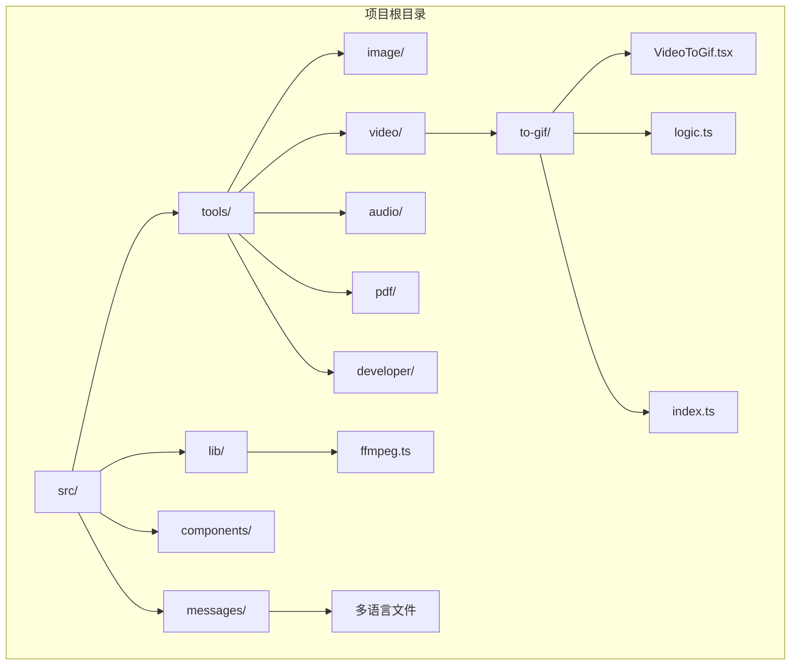
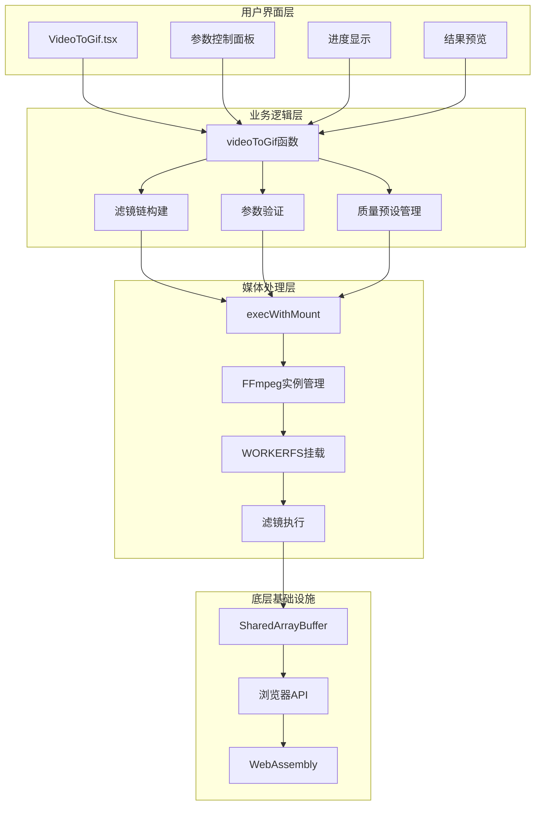
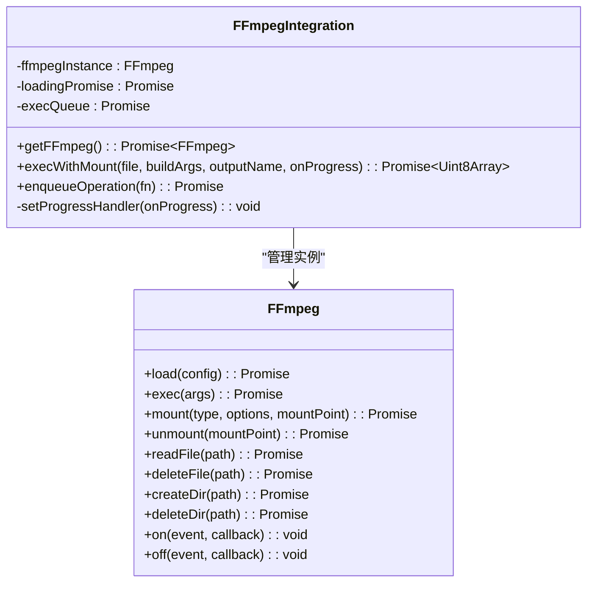
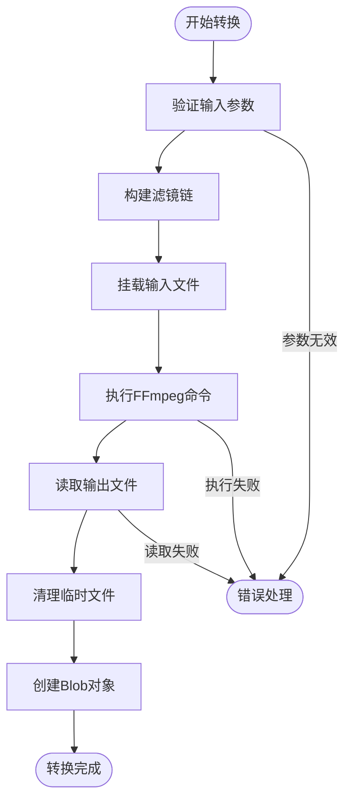
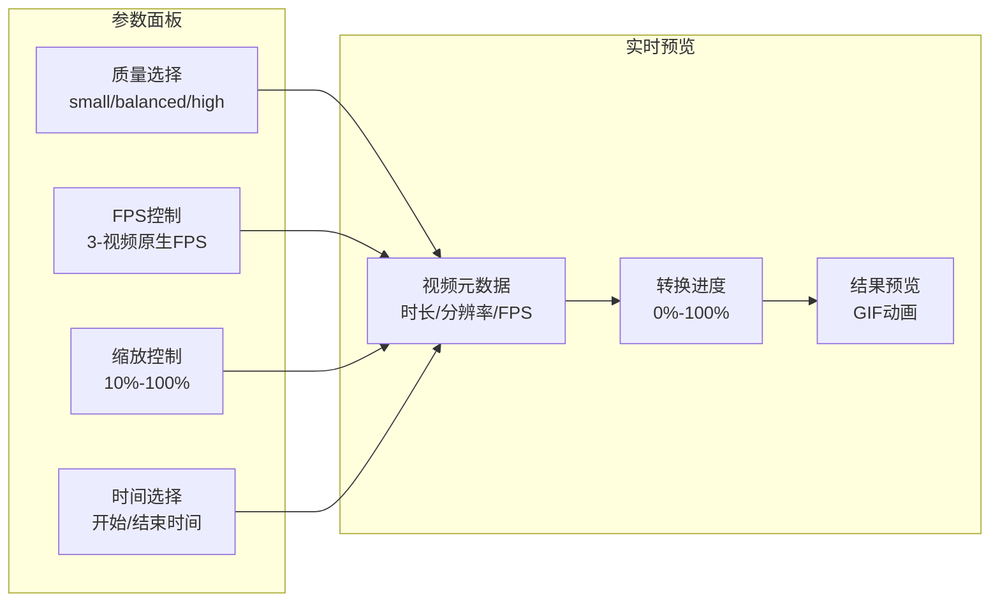
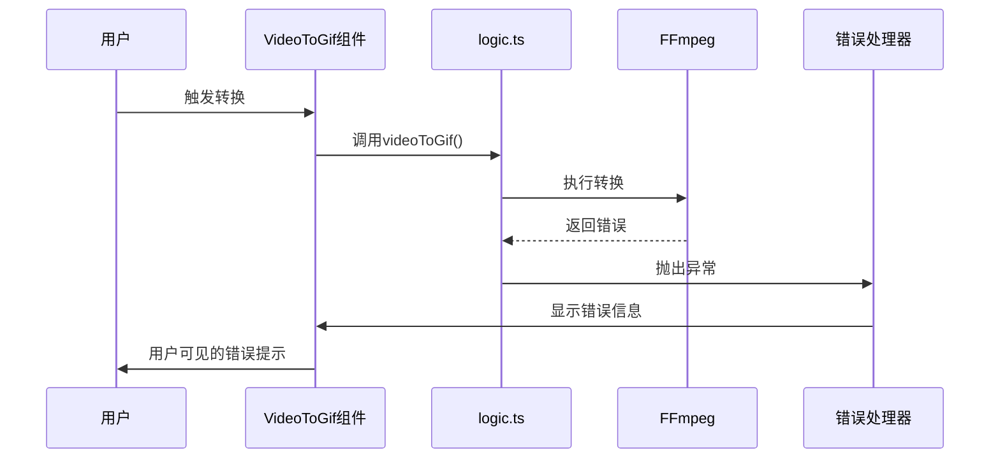

# 视频转GIF工具

<cite>
**本文档引用的文件**
- [README.md](file://README.md)
- [ffmpeg.ts](file://src/lib/ffmpeg.ts)
- [VideoToGif.tsx](file://src/tools/video/to-gif/VideoToGif.tsx)
- [logic.ts](file://src/tools/video/to-gif/logic.ts)
- [index.ts](file://src/tools/video/to-gif/index.ts)
- [tools-video.json](file://messages/zh-Hans/tools-video.json)
- [tools-video.json](file://messages/en/tools-video.json)
</cite>

## 目录
1. [简介](#简介)
2. [项目结构](#项目结构)
3. [核心组件](#核心组件)
4. [架构概览](#架构概览)
5. [详细组件分析](#详细组件分析)
6. [依赖关系分析](#依赖关系分析)
7. [性能考虑](#性能考虑)
8. [故障排除指南](#故障排除指南)
9. [结论](#结论)

## 简介

视频转GIF工具是一个基于浏览器的多媒体处理工具，专门用于将视频片段转换为GIF动画格式。该工具采用FFmpeg.wasm技术，在用户的本地浏览器中完成所有处理操作，确保数据隐私和安全。

### 主要特性

- **隐私优先**：所有处理在浏览器本地完成，文件绝不离开设备
- **高质量转换**：使用优化的调色板生成算法，确保最佳的视觉质量
- **灵活配置**：支持帧率、尺寸、时长等参数的精细控制
- **多格式支持**：支持MP4、WebM、MKV、AVI等多种视频格式
- **批量处理**：支持连续转换多个视频片段
- **实时预览**：转换过程中提供进度反馈和预览功能

## 项目结构

该项目采用Next.js 16框架构建，遵循模块化设计原则，将不同类型的工具分离到独立的目录中。



**图表来源**
- [README.md:55-78](file://README.md#L55-L78)
- [index.ts:1-37](file://src/tools/video/to-gif/index.ts#L1-L37)

**章节来源**
- [README.md:1-89](file://README.md#L1-L89)
- [index.ts:1-37](file://src/tools/video/to-gif/index.ts#L1-L37)

## 核心组件

### FFmpeg.wasm集成层

FFmpeg.wasm是整个工具链的核心，提供了在浏览器中执行视频处理的能力。该组件负责：

- **单实例管理**：确保FFmpeg实例的唯一性和资源的有效利用
- **进度回调**：提供实时的处理进度反馈
- **内存优化**：通过WORKERFS避免不必要的内存拷贝
- **错误处理**：统一的异常捕获和错误传播机制

### 视频转GIF核心逻辑

视频转GIF功能的核心实现包含以下关键组件：

- **参数配置系统**：支持质量预设、帧率、尺寸等参数的动态调整
- **滤镜链构建**：根据用户配置动态生成FFmpeg滤镜参数
- **进度监控**：实时跟踪转换进度并更新UI状态
- **结果预览**：提供转换后的GIF动画预览功能

**章节来源**
- [ffmpeg.ts:1-144](file://src/lib/ffmpeg.ts#L1-L144)
- [VideoToGif.tsx:13-40](file://src/tools/video/to-gif/VideoToGif.tsx#L13-L40)
- [logic.ts:3-17](file://src/tools/video/to-gif/logic.ts#L3-L17)

## 架构概览

该工具采用分层架构设计，从底层的媒体处理到底层的用户界面，各层职责明确且松耦合。



**图表来源**
- [VideoToGif.tsx:19-68](file://src/tools/video/to-gif/VideoToGif.tsx#L19-L68)
- [logic.ts:13-42](file://src/tools/video/to-gif/logic.ts#L13-L42)
- [ffmpeg.ts:99-143](file://src/lib/ffmpeg.ts#L99-L143)

## 详细组件分析

### FFmpeg.wasm集成组件

FFmpeg.wasm集成组件是整个工具的基础支撑，提供了在浏览器中执行视频处理的核心能力。

#### 关键特性

- **单例模式**：确保FFmpeg实例的唯一性，避免资源浪费
- **Promise队列**：序列化所有FFmpeg操作，防止并发冲突
- **内存优化**：使用WORKERFS避免文件的完整内存拷贝
- **进度监控**：提供精确的处理进度反馈



**图表来源**
- [ffmpeg.ts:3-39](file://src/lib/ffmpeg.ts#L3-L39)
- [ffmpeg.ts:75-82](file://src/lib/ffmpeg.ts#L75-L82)

**章节来源**
- [ffmpeg.ts:1-144](file://src/lib/ffmpeg.ts#L1-L144)

### 视频转GIF核心逻辑组件

视频转GIF的核心逻辑组件实现了完整的转换流程，从参数解析到最终输出。

#### 转换算法流程



**图表来源**
- [logic.ts:13-42](file://src/tools/video/to-gif/logic.ts#L13-L42)
- [ffmpeg.ts:99-143](file://src/lib/ffmpeg.ts#L99-L143)

#### 质量预设系统

工具提供了三种质量预设，每种预设都有其特定的调色板生成和使用参数：

| 预设类型 | 帧率(FPS) | 缩放比例 | 调色板生成参数 | 调色板使用参数 |
|---------|----------|----------|---------------|---------------|
| small   | 8        | 50%      | stats_mode=diff | dither=bayer:bayer_scale=5:diff_mode=rectangle |
| balanced| 10       | 75%      | stats_mode=diff | dither=bayer:bayer_scale=3:diff_mode=rectangle |
| high    | 15       | 100%     | 无参数        | 无参数        |

**章节来源**
- [VideoToGif.tsx:13-17](file://src/tools/video/to-gif/VideoToGif.tsx#L13-L17)
- [logic.ts:44-48](file://src/tools/video/to-gif/logic.ts#L44-L48)

### 用户界面组件

用户界面组件提供了直观易用的操作界面，支持实时参数调整和结果预览。

#### 参数控制系统



**图表来源**
- [VideoToGif.tsx:92-172](file://src/tools/video/to-gif/VideoToGif.tsx#L92-L172)

**章节来源**
- [VideoToGif.tsx:19-175](file://src/tools/video/to-gif/VideoToGif.tsx#L19-L175)

## 依赖关系分析

该工具的依赖关系相对简洁，主要依赖于FFmpeg.wasm和浏览器API。

```mermaid
graph TB
subgraph "外部依赖"
A[@ffmpeg/ffmpeg]
B[@ffmpeg/util]
C[浏览器API]
end
subgraph "内部模块"
D[ffmpeg.ts]
E[VideoToGif.tsx]
F[logic.ts]
G[index.ts]
end
subgraph "多语言支持"
H[tools-video.json]
I[多语言文件]
end
A --> D
B --> D
C --> D
D --> E
D --> F
E --> F
F --> G
H --> E
I --> E
```

**图表来源**
- [ffmpeg.ts:15-24](file://src/lib/ffmpeg.ts#L15-L24)
- [VideoToGif.tsx:10-11](file://src/tools/video/to-gif/VideoToGif.tsx#L10-L11)

**章节来源**
- [ffmpeg.ts:1-144](file://src/lib/ffmpeg.ts#L1-L144)
- [index.ts:1-37](file://src/tools/video/to-gif/index.ts#L1-L37)

## 性能考虑

### 内存管理策略

视频转GIF工具采用了多项内存优化策略来确保在浏览器环境中的高效运行：

- **WORKERFS挂载**：避免将整个文件加载到内存中，而是通过文件系统接口按需读取
- **及时清理**：转换完成后立即删除内存中的输出文件，释放内存空间
- **Promise队列**：串行化所有FFmpeg操作，避免并发导致的内存峰值

### 处理速度优化

- **输入定位**：使用`-ss`参数进行快速输入定位，避免全文件扫描
- **滤镜链优化**：动态构建最短的必要滤镜链，减少不必要的处理步骤
- **质量预设**：提供多种质量预设，让用户根据需要平衡质量和性能

### 浏览器兼容性

- **SharedArrayBuffer检查**：在转换前检查浏览器对SharedArrayBuffer的支持
- **渐进增强**：根据浏览器能力提供不同的功能特性
- **错误降级**：在不支持的环境中提供清晰的错误提示

**章节来源**
- [ffmpeg.ts:99-143](file://src/lib/ffmpeg.ts#L99-L143)
- [VideoToGif.tsx:42-48](file://src/tools/video/to-gif/VideoToGif.tsx#L42-L48)

## 故障排除指南

### 常见问题及解决方案

#### SharedArrayBuffer不支持

**问题描述**：工具提示需要SharedArrayBuffer支持

**解决方案**：
- 确保使用支持HTTPS的安全浏览器
- 更新到最新版本的浏览器
- 在某些浏览器中启用相关实验性功能

#### 转换失败

**问题描述**：转换过程中出现错误

**排查步骤**：
1. 检查视频文件格式是否受支持
2. 验证文件大小是否超出浏览器限制
3. 确认有足够的系统内存
4. 尝试降低质量设置或缩短视频时长

#### 性能问题

**问题描述**：转换速度过慢

**优化建议**：
- 减少输出尺寸和帧率
- 选择较低的质量预设
- 关闭其他占用CPU的程序
- 使用性能更好的设备

### 错误处理机制

工具实现了完善的错误处理机制：



**图表来源**
- [VideoToGif.tsx:62-67](file://src/tools/video/to-gif/VideoToGif.tsx#L62-L67)
- [logic.ts:13-42](file://src/tools/video/to-gif/logic.ts#L13-L42)

**章节来源**
- [VideoToGif.tsx:62-67](file://src/tools/video/to-gif/VideoToGif.tsx#L62-L67)
- [logic.ts:13-42](file://src/tools/video/to-gif/logic.ts#L13-L42)

## 结论

视频转GIF工具是一个功能完善、性能优秀的浏览器端多媒体处理工具。通过采用FFmpeg.wasm技术，该工具实现了真正的本地处理，确保了用户数据的隐私和安全。

### 技术优势

- **隐私保护**：所有处理都在本地完成，无数据上传风险
- **高质量输出**：使用优化的调色板生成算法，确保最佳视觉质量
- **灵活配置**：提供多种参数控制选项，满足不同用户需求
- **性能优化**：采用多项内存和处理优化策略，确保流畅体验

### 应用场景

该工具适用于多种应用场景：
- 社交媒体内容创作
- 技术文档制作
- 教育培训材料
- 软件bug报告
- 个人娱乐内容

通过持续的优化和改进，该工具将继续为用户提供优质的视频转GIF服务。