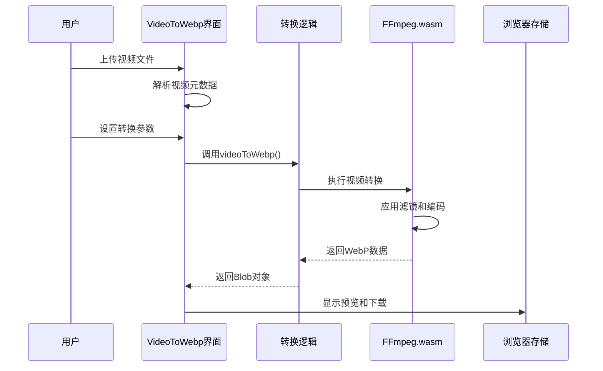
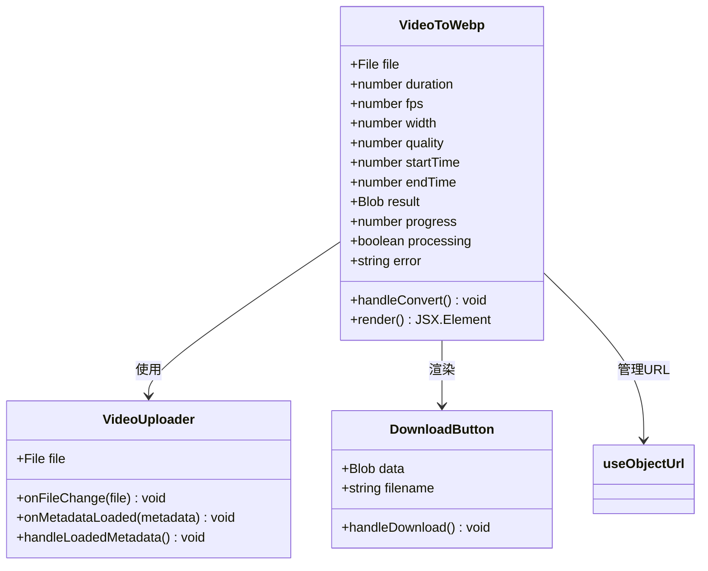
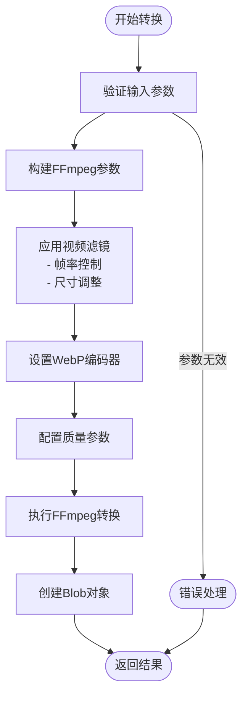
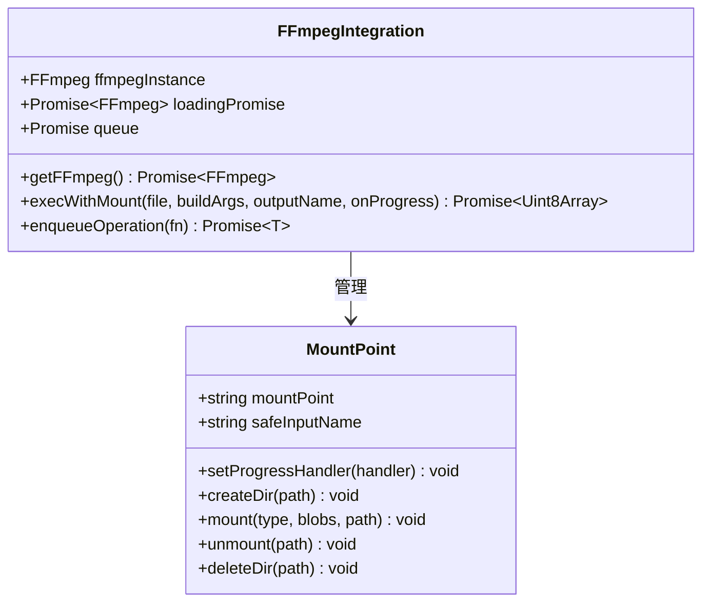
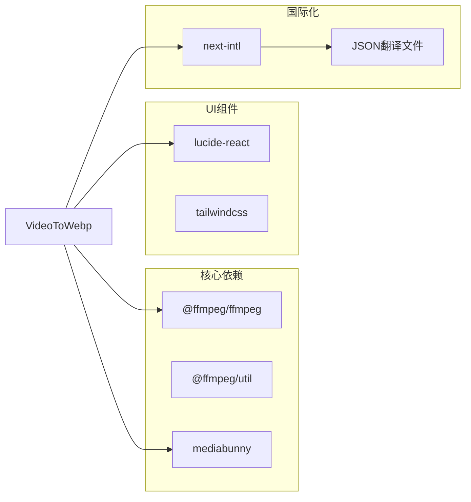
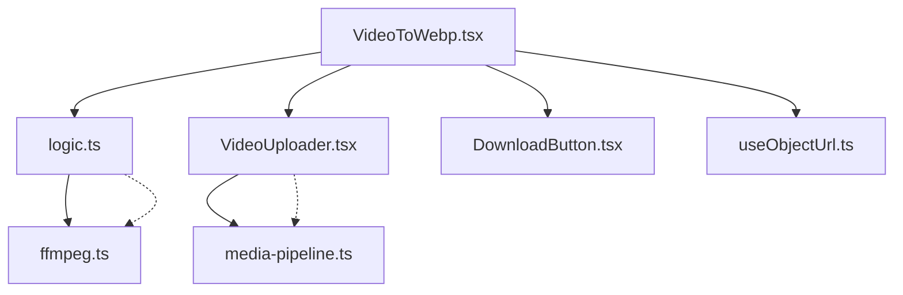
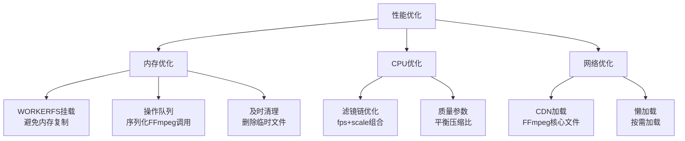
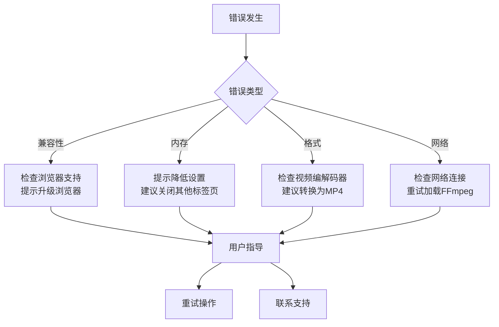

# 视频转WebP工具

<cite>
**本文档引用的文件**
- [VideoToWebp.tsx](file://src/tools/video/to-webp/VideoToWebp.tsx)
- [logic.ts](file://src/tools/video/to-webp/logic.ts)
- [ffmpeg.ts](file://src/lib/ffmpeg.ts)
- [media-pipeline.ts](file://src/lib/media-pipeline.ts)
- [VideoUploader.tsx](file://src/components/shared/VideoUploader.tsx)
- [DownloadButton.tsx](file://src/components/shared/DownloadButton.tsx)
- [useObjectUrl.ts](file://src/lib/hooks/useObjectUrl.ts)
- [tools-video.json](file://messages/zh-Hans/tools-video.json)
- [@ffmpeg__ffmpeg@0.12.15.patch](file://patches/@ffmpeg__ffmpeg@0.12.15.patch)
- [README.md](file://README.md)
</cite>

## 目录
1. [简介](#简介)
2. [项目结构](#项目结构)
3. [核心组件](#核心组件)
4. [架构概览](#架构概览)
5. [详细组件分析](#详细组件分析)
6. [依赖关系分析](#依赖关系分析)
7. [性能考虑](#性能考虑)
8. [故障排除指南](#故障排除指南)
9. [结论](#结论)
10. [附录](#附录)

## 简介

视频转WebP工具是一个基于浏览器的多媒体处理工具，专门用于将视频片段转换为WebP动画格式。该工具采用FFmpeg.wasm技术，在用户的本地浏览器中完成所有处理操作，确保数据隐私和安全。

WebP是一种由Google开发的现代图像格式，特别适用于动画内容。相比传统的GIF格式，WebP动画通常具有更小的文件体积（通常减少25-35%），同时支持更好的色彩深度和透明度特性。该工具提供了直观的用户界面，允许用户精确控制转换参数，包括帧率、尺寸和质量设置。

## 项目结构

该项目采用模块化的Next.js架构，视频转WebP工具位于视频处理工具集合中。整体项目结构如下：

```mermaid
graph TB
subgraph "应用层"
UI[VideoToWebp.tsx]
Uploader[VideoUploader.tsx]
Downloader[DownloadButton.tsx]
end
subgraph "逻辑层"
Logic[logic.ts]
Hooks[useObjectUrl.ts]
end
subgraph "基础设施层"
FFmpeg[ffmpeg.ts]
MediaPipeline[media-pipeline.ts]
Patch[@ffmpeg__ffmpeg@0.12.15.patch]
end
subgraph "国际化"
Translations[tools-video.json]
end
UI --> Logic
UI --> Uploader
UI --> Downloader
Logic --> FFmpeg
UI --> Hooks
FFmpeg --> MediaPipeline
UI --> Translations
```

**图表来源**
- [VideoToWebp.tsx:1-140](file://src/tools/video/to-webp/VideoToWebp.tsx#L1-L140)
- [logic.ts:1-43](file://src/tools/video/to-webp/logic.ts#L1-L43)
- [ffmpeg.ts:1-144](file://src/lib/ffmpeg.ts#L1-L144)

**章节来源**
- [README.md:55-78](file://README.md#L55-L78)

## 核心组件

### 主要功能组件

视频转WebP工具的核心由以下几个关键组件构成：

1. **VideoToWebp组件** - 用户界面和状态管理
2. **videoToWebp函数** - 核心转换逻辑
3. **FFmpeg集成** - 浏览器端视频处理
4. **文件上传组件** - 视频文件处理
5. **下载组件** - 结果文件导出

### 转换参数配置

工具提供了灵活的参数配置选项：

- **帧率控制** (5-30 fps) - 控制动画流畅度和文件大小
- **尺寸调整** (120-1280像素宽度) - 控制输出分辨率
- **质量设置** (10-100) - 控制压缩质量
- **时间范围** - 选择视频片段进行转换

**章节来源**
- [VideoToWebp.tsx:13-54](file://src/tools/video/to-webp/VideoToWebp.tsx#L13-L54)
- [logic.ts:3-9](file://src/tools/video/to-webp/logic.ts#L3-L9)

## 架构概览

该工具采用分层架构设计，确保了良好的可维护性和扩展性：



**图表来源**
- [VideoToWebp.tsx:36-54](file://src/tools/video/to-webp/VideoToWebp.tsx#L36-L54)
- [logic.ts:11-42](file://src/tools/video/to-webp/logic.ts#L11-L42)
- [ffmpeg.ts:99-143](file://src/lib/ffmpeg.ts#L99-L143)

## 详细组件分析

### VideoToWebp界面组件

VideoToWebp组件负责用户交互和状态管理：



**图表来源**
- [VideoToWebp.tsx:13-139](file://src/tools/video/to-webp/VideoToWebp.tsx#L13-L139)
- [VideoUploader.tsx:66-382](file://src/components/shared/VideoUploader.tsx#L66-L382)
- [DownloadButton.tsx:18-53](file://src/components/shared/DownloadButton.tsx#L18-L53)

### 核心转换逻辑

videoToWebp函数实现了视频到WebP的转换流程：



**图表来源**
- [logic.ts:11-42](file://src/tools/video/to-webp/logic.ts#L11-L42)

### FFmpeg集成架构

工具通过execWithMount函数实现高效的文件处理：



**图表来源**
- [ffmpeg.ts:10-143](file://src/lib/ffmpeg.ts#L10-L143)

**章节来源**
- [logic.ts:11-42](file://src/tools/video/to-webp/logic.ts#L11-L42)
- [ffmpeg.ts:99-143](file://src/lib/ffmpeg.ts#L99-L143)

## 依赖关系分析

### 外部依赖

该工具主要依赖以下外部库和服务：



**图表来源**
- [ffmpeg.ts:15-28](file://src/lib/ffmpeg.ts#L15-L28)
- [VideoUploader.tsx:132](file://src/components/shared/VideoUploader.tsx#L132)

### 内部模块依赖



**图表来源**
- [VideoToWebp.tsx:1-11](file://src/tools/video/to-webp/VideoToWebp.tsx#L1-L11)
- [logic.ts:1](file://src/tools/video/to-webp/logic.ts#L1)

**章节来源**
- [README.md:32](file://README.md#L32)

## 性能考虑

### 内存管理策略

工具采用了多项内存优化措施：

1. **WORKERFS挂载** - 避免文件复制到内存中
2. **序列化操作队列** - 防止并发挂载点冲突
3. **及时释放资源** - 转换完成后立即删除临时文件
4. **对象URL生命周期管理** - 自动清理不再使用的URL

### 性能优化技术



### 浏览器兼容性

工具通过以下机制确保浏览器兼容性：

- **SharedArrayBuffer检测** - 检查多线程支持
- **WebCodecs回退** - 当WebCodecs不可用时使用FFmpeg
- **HEVC扩展建议** - 在Windows Chromium浏览器中建议安装HEVC扩展

**章节来源**
- [ffmpeg.ts:75-82](file://src/lib/ffmpeg.ts#L75-L82)
- [ffmpeg.ts:105-142](file://src/lib/ffmpeg.ts#L105-L142)
- [media-pipeline.ts:7-14](file://src/lib/media-pipeline.ts#L7-L14)

## 故障排除指南

### 常见问题及解决方案

| 问题类型 | 症状 | 解决方案 |
|---------|------|----------|
| 兼容性问题 | 工具无法加载 | 检查浏览器是否支持SharedArrayBuffer |
| 内存不足 | 转换失败或卡顿 | 减少视频时长或降低质量设置 |
| 性能问题 | 转换速度慢 | 降低帧率或分辨率设置 |
| 格式不支持 | 无法处理某些视频 | 确认视频编解码器受支持 |

### 错误处理机制



**章节来源**
- [VideoToWebp.tsx:28-34](file://src/tools/video/to-webp/VideoToWebp.tsx#L28-L34)
- [VideoUploader.tsx:292-304](file://src/components/shared/VideoUploader.tsx#L292-L304)

## 结论

视频转WebP工具是一个功能完整、性能优异的浏览器端多媒体处理工具。通过采用FFmpeg.wasm技术，该工具实现了真正的本地处理，确保了用户数据的隐私和安全。

### 主要优势

1. **隐私保护** - 所有处理都在本地浏览器中完成
2. **高性能** - 优化的内存管理和并发控制
3. **易用性** - 直观的用户界面和灵活的参数控制
4. **兼容性** - 支持多种视频格式和现代浏览器

### 技术特色

- 基于WebAssembly的FFmpeg集成
- 智能的内存管理和资源清理
- 浏览器原生的文件处理能力
- 完善的错误处理和用户反馈机制

该工具为用户提供了一个强大而便捷的视频转WebP解决方案，特别适合需要高质量动画内容但又希望保持较小文件体积的场景。

## 附录

### 使用示例

#### 基本转换流程
1. 上传视频文件
2. 设置转换参数（帧率、尺寸、质量）
3. 选择视频片段
4. 点击转换按钮
5. 下载生成的WebP动画

#### 参数配置建议

| 场景 | 帧率 | 宽度 | 质量 |
|------|------|------|------|
| 社交媒体 | 15-20 fps | 480-720px | 70-85 |
| 网页展示 | 12-18 fps | 360-480px | 60-80 |
| 高质量需求 | 24-30 fps | 720-1080px | 85-95 |

### WebP格式优势

1. **文件体积** - 比GIF小25-35%
2. **色彩支持** - 24位色彩深度
3. **透明度** - 支持Alpha通道
4. **兼容性** - 现代浏览器全面支持
5. **性能** - 更好的解码性能

**章节来源**
- [tools-video.json:191-236](file://messages/zh-Hans/tools-video.json#L191-L236)