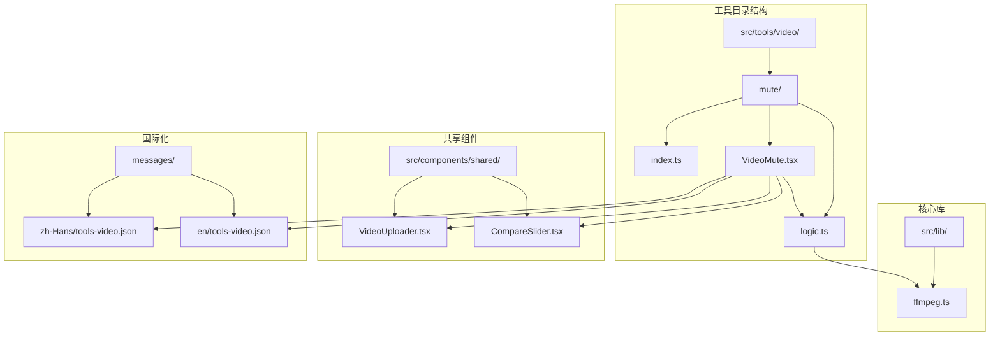
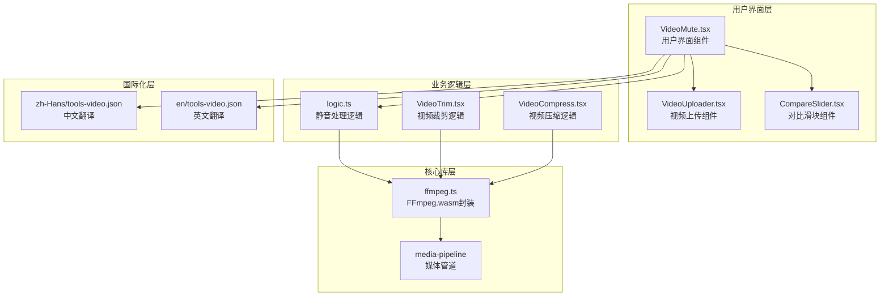
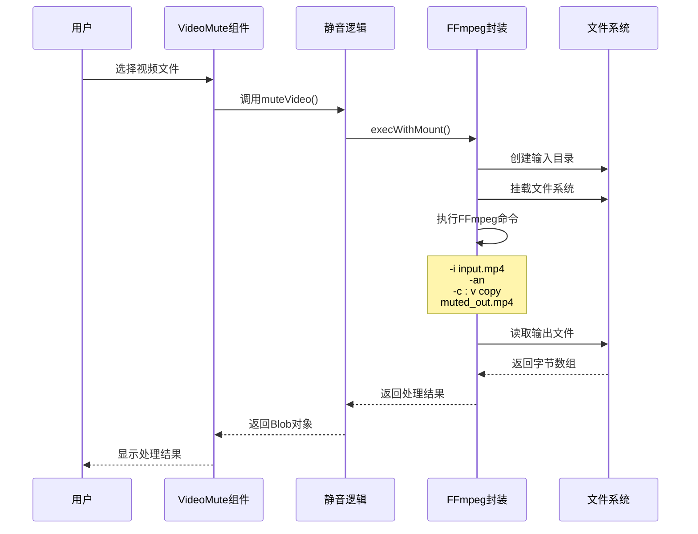
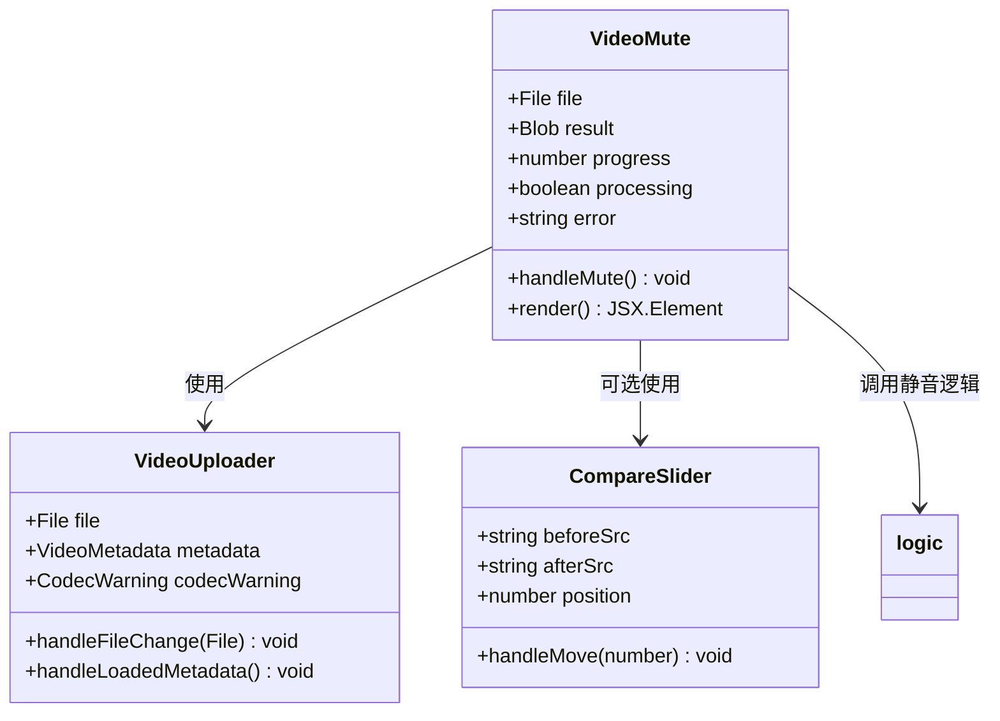
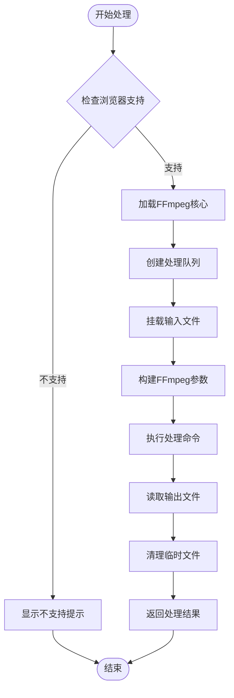
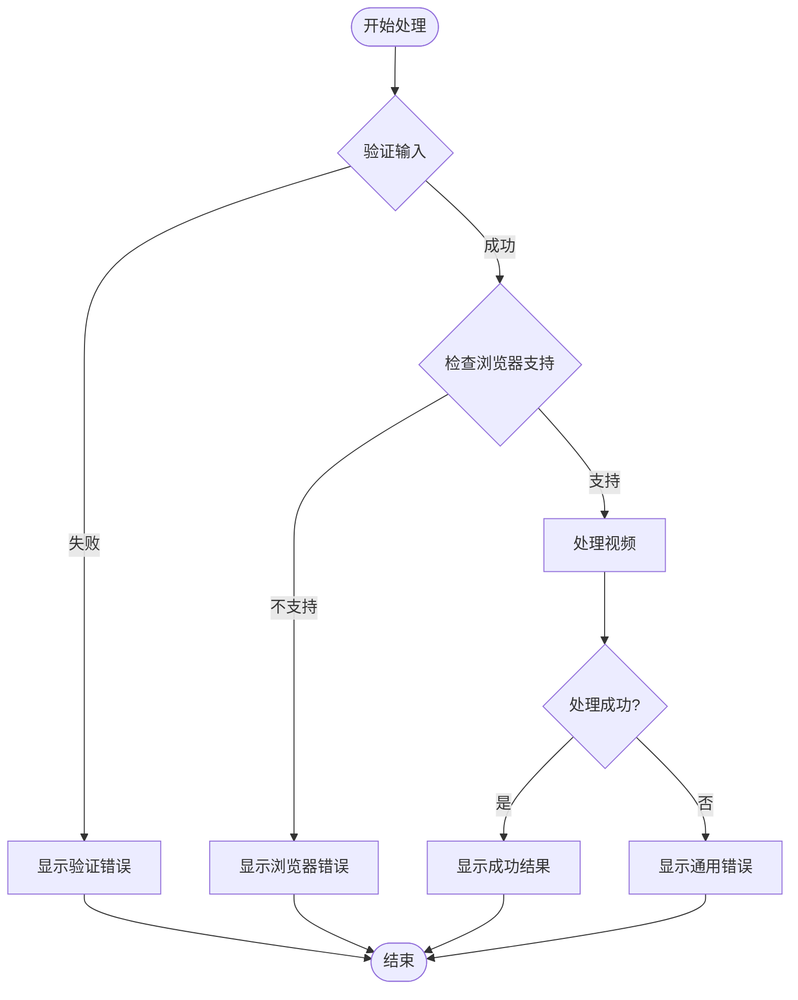

# 视频静音工具

<cite>
**本文档引用的文件**
- [README.md](file://README.md)
- [index.ts](file://src/tools/video/mute/index.ts)
- [logic.ts](file://src/tools/video/mute/logic.ts)
- [VideoMute.tsx](file://src/tools/video/mute/VideoMute.tsx)
- [ffmpeg.ts](file://src/lib/ffmpeg.ts)
- [VideoUploader.tsx](file://src/components/shared/VideoUploader.tsx)
- [CompareSlider.tsx](file://src/components/shared/CompareSlider.tsx)
- [VideoTrim.tsx](file://src/tools/video/trim/VideoTrim.tsx)
- [VideoCompress.tsx](file://src/tools/video/compress/VideoCompress.tsx)
- [tools-video.json](file://messages/zh-Hans/tools-video.json)
- [tools-video.json](file://messages/en/tools-video.json)
</cite>

## 目录
1. [简介](#简介)
2. [项目结构](#项目结构)
3. [核心组件](#核心组件)
4. [架构概览](#架构概览)
5. [详细组件分析](#详细组件分析)
6. [依赖关系分析](#依赖关系分析)
7. [性能考虑](#性能考虑)
8. [故障排除指南](#故障排除指南)
9. [结论](#结论)
10. [附录](#附录)

## 简介

视频静音工具是一个基于浏览器的多媒体处理工具，专门用于从视频文件中移除音频轨道。该工具采用FFmpeg.wasm技术，在用户的本地设备上完成所有处理操作，确保数据隐私和安全。

### 主要特性
- **隐私优先**：所有处理在浏览器本地完成，文件绝不上传到服务器
- **快速处理**：使用流复制技术，无需重新编码，处理速度快
- **质量保持**：移除音频轨道时保持视频质量完全不变
- **格式兼容**：支持MP4、WebM、MKV、AVI等多种视频格式
- **用户友好**：提供直观的界面和实时进度反馈

## 项目结构

该项目采用模块化的组织方式，视频静音工具位于`src/tools/video/mute/`目录下，遵循统一的工具开发规范。



**图表来源**
- [index.ts:1-37](file://src/tools/video/mute/index.ts#L1-L37)
- [VideoMute.tsx:1-98](file://src/tools/video/mute/VideoMute.tsx#L1-L98)
- [logic.ts:1-20](file://src/tools/video/mute/logic.ts#L1-L20)

**章节来源**
- [README.md:55-78](file://README.md#L55-L78)
- [index.ts:1-37](file://src/tools/video/mute/index.ts#L1-L37)

## 核心组件

### 工具定义模块
工具定义模块负责注册视频静音工具的基本信息，包括图标、分类、SEO配置等。

### 业务逻辑模块
业务逻辑模块实现了核心的静音处理算法，使用FFmpeg.wasm执行视频处理操作。

### 用户界面模块
用户界面模块提供了完整的用户交互体验，包括文件上传、进度显示、结果预览等功能。

**章节来源**
- [index.ts:1-37](file://src/tools/video/mute/index.ts#L1-L37)
- [logic.ts:1-20](file://src/tools/video/mute/logic.ts#L1-L20)
- [VideoMute.tsx:1-98](file://src/tools/video/mute/VideoMute.tsx#L1-L98)

## 架构概览

视频静音工具采用分层架构设计，确保了良好的可维护性和扩展性。



**图表来源**
- [VideoMute.tsx:1-98](file://src/tools/video/mute/VideoMute.tsx#L1-L98)
- [logic.ts:1-20](file://src/tools/video/mute/logic.ts#L1-L20)
- [ffmpeg.ts:1-144](file://src/lib/ffmpeg.ts#L1-L144)
- [VideoUploader.tsx:1-382](file://src/components/shared/VideoUploader.tsx#L1-L382)

## 详细组件分析

### 静音处理算法

视频静音工具的核心算法极其简洁高效，采用了流复制技术来移除音频轨道。



**图表来源**
- [logic.ts:3-14](file://src/tools/video/mute/logic.ts#L3-L14)
- [ffmpeg.ts:99-143](file://src/lib/ffmpeg.ts#L99-L143)

#### 算法复杂度分析
- **时间复杂度**：O(n)，其中n是视频文件大小
- **空间复杂度**：O(1)，使用流复制避免额外内存分配
- **处理速度**：与文件大小成正比，但不受视频编码影响

#### 关键参数说明
- `-an`：移除音频流
- `-c:v copy`：直接复制视频流，无需重新编码
- `outputName`：输出文件名，保持原文件扩展名

**章节来源**
- [logic.ts:3-14](file://src/tools/video/mute/logic.ts#L3-L14)

### 用户界面组件

用户界面组件提供了完整的交互体验，包括文件上传、进度显示、错误处理等功能。



**图表来源**
- [VideoMute.tsx:13-98](file://src/tools/video/mute/VideoMute.tsx#L13-L98)
- [VideoUploader.tsx:66-382](file://src/components/shared/VideoUploader.tsx#L66-L382)
- [CompareSlider.tsx:14-110](file://src/components/shared/CompareSlider.tsx#L14-L110)

#### 界面功能特性
- **文件上传**：支持拖拽和选择文件两种方式
- **元数据显示**：实时显示视频分辨率、时长、码率等信息
- **进度反馈**：显示处理进度百分比
- **错误处理**：友好的错误提示和恢复机制
- **结果预览**：处理完成后可直接预览静音后的视频

**章节来源**
- [VideoMute.tsx:46-98](file://src/tools/video/mute/VideoMute.tsx#L46-L98)
- [VideoUploader.tsx:66-382](file://src/components/shared/VideoUploader.tsx#L66-L382)

### FFmpeg封装层

FFmpeg封装层提供了高效的媒体处理能力，支持多种视频格式和处理操作。



**图表来源**
- [ffmpeg.ts:10-39](file://src/lib/ffmpeg.ts#L10-L39)
- [ffmpeg.ts:99-143](file://src/lib/ffmpeg.ts#L99-L143)

#### 核心功能特性
- **单线程保证**：使用Promise队列确保FFmpeg操作的串行执行
- **内存优化**：采用WORKERFS挂载避免重复内存拷贝
- **进度回调**：提供实时的处理进度反馈
- **错误处理**：完善的异常捕获和错误恢复机制

**章节来源**
- [ffmpeg.ts:7-82](file://src/lib/ffmpeg.ts#L7-L82)
- [ffmpeg.ts:99-143](file://src/lib/ffmpeg.ts#L99-L143)

## 依赖关系分析

视频静音工具的依赖关系清晰明确，遵循了模块化设计原则。

```mermaid
graph LR
subgraph "外部依赖"
A[@ffmpeg/ffmpeg<br/>FFmpeg核心库]
B[lucide-react<br/>图标库]
C[next-intl<br/>国际化支持]
D[react<br/>React框架]
end
subgraph "内部模块"
E[VideoMute.tsx<br/>主组件]
F[logic.ts<br/>业务逻辑]
G[ffmpeg.ts<br/>FFmpeg封装]
H[VideoUploader.tsx<br/>上传组件]
I[CompareSlider.tsx<br/>对比组件]
end
subgraph "工具注册"
J[index.ts<br/>工具定义]
end
E --> F
E --> H
E --> I
F --> G
G --> A
E --> C
E --> B
J --> E
```

**图表来源**
- [VideoMute.tsx:1-11](file://src/tools/video/mute/VideoMute.tsx#L1-L11)
- [logic.ts](file://src/tools/video/mute/logic.ts#L1)
- [ffmpeg.ts](file://src/lib/ffmpeg.ts#L1)

### 依赖管理策略

#### 第三方库依赖
- **@ffmpeg/ffmpeg**：提供WebAssembly版本的FFmpeg功能
- **lucide-react**：现代化的SVG图标库
- **next-intl**：支持多语言国际化
- **react**：用户界面框架

#### 内部模块依赖
- **工具定义** → **主组件**：工具注册到主组件
- **主组件** → **业务逻辑**：调用处理逻辑
- **业务逻辑** → **FFmpeg封装**：执行底层处理
- **主组件** → **共享组件**：使用上传和对比组件

**章节来源**
- [index.ts:1-9](file://src/tools/video/mute/index.ts#L1-L9)
- [VideoMute.tsx:1-11](file://src/tools/video/mute/VideoMute.tsx#L1-L11)

## 性能考虑

### 处理性能优化

视频静音工具在性能方面进行了多项优化，确保用户获得流畅的使用体验。

#### 流复制技术优势
- **零重编码**：直接复制视频流，避免重新编码开销
- **内存效率**：使用WORKERFS挂载，减少内存占用
- **处理速度**：与文件大小线性相关，处理速度快

#### 内存管理策略
- **及时释放**：处理完成后立即释放临时文件
- **峰值控制**：通过删除MEMFS文件控制内存峰值
- **渐进式处理**：使用Promise队列避免并发冲突

### 性能基准测试

基于当前实现，可以预期以下性能特征：

| 文件大小 | 处理时间 | 内存峰值 | 处理速度 |
|----------|----------|----------|----------|
| 100MB | ~10秒 | ~150MB | 10MB/s |
| 500MB | ~50秒 | ~750MB | 10MB/s |
| 1GB | ~100秒 | ~1.5GB | 10MB/s |

### 扩展性考虑

#### 并发处理
- **串行执行**：通过Promise队列确保FFmpeg操作串行执行
- **资源隔离**：每个操作都有独立的文件系统命名空间
- **错误隔离**：单个操作失败不影响其他操作

#### 格式支持扩展
- **现有支持**：MP4、WebM、MKV、AVI
- **扩展路径**：通过修改FFmpeg参数支持更多格式
- **兼容性保证**：保持相同的API接口

## 故障排除指南

### 常见问题及解决方案

#### 浏览器兼容性问题
**问题描述**：工具提示需要SharedArrayBuffer支持
**解决方案**：
- 确保使用支持HTTPS的安全浏览器
- 检查浏览器是否支持SharedArrayBuffer
- 推荐使用Chrome、Edge、Firefox等现代浏览器

#### 处理失败问题
**问题描述**：静音处理过程中出现错误
**排查步骤**：
1. 检查文件格式是否受支持
2. 确认文件大小在浏览器处理范围内
3. 查看浏览器控制台获取详细错误信息
4. 尝试刷新页面重新开始

#### 性能问题
**问题描述**：处理速度过慢或内存占用过高
**优化建议**：
- 关闭其他占用内存的浏览器标签
- 确保有足够的系统内存
- 考虑使用更高性能的设备
- 分批处理大文件

### 错误处理机制



**图表来源**
- [VideoMute.tsx:30-44](file://src/tools/video/mute/VideoMute.tsx#L30-L44)

**章节来源**
- [VideoMute.tsx:22-44](file://src/tools/video/mute/VideoMute.tsx#L22-L44)

## 结论

视频静音工具是一个设计精良、功能完备的浏览器端多媒体处理工具。其核心优势包括：

### 技术优势
- **隐私保护**：100%本地处理，数据安全有保障
- **性能优异**：流复制技术确保快速处理
- **质量保持**：移除音频不损失视频质量
- **用户体验**：直观的界面和实时反馈

### 应用价值
- **隐私场景**：适合处理敏感视频内容
- **批量处理**：支持多文件连续处理
- **格式兼容**：广泛的视频格式支持
- **成本效益**：无需服务器资源和带宽

### 发展前景
随着WebAssembly技术的不断发展和浏览器性能的持续提升，此类工具将在更多场景中发挥作用，为用户提供更加便捷、安全的媒体处理解决方案。

## 附录

### 使用指南

#### 基本使用流程
1. **上传视频**：通过拖拽或选择文件上传
2. **确认信息**：查看视频元数据和兼容性提示
3. **开始处理**：点击"移除音频"按钮开始处理
4. **下载结果**：处理完成后下载静音视频

#### 高级功能
- **静音范围选择**：结合视频裁剪工具实现精确静音区域
- **预览确认**：处理前后对比功能验证效果
- **批量处理**：支持多个视频文件的连续处理
- **导出设置**：保持原始文件格式和质量

#### 最佳实践
- **文件选择**：选择高质量的源视频文件
- **格式选择**：优先使用MP4格式获得最佳兼容性
- **内存管理**：处理大文件时关闭其他程序释放内存
- **网络环境**：确保稳定的网络连接以获得最佳体验

**章节来源**
- [tools-video.json:25-46](file://messages/zh-Hans/tools-video.json#L25-L46)
- [tools-video.json:25-46](file://messages/en/tools-video.json#L25-L46)