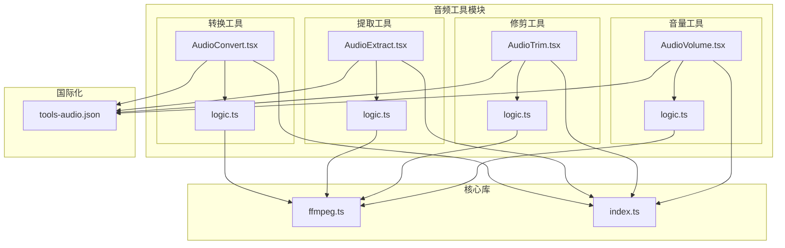
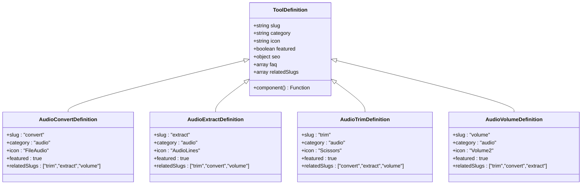
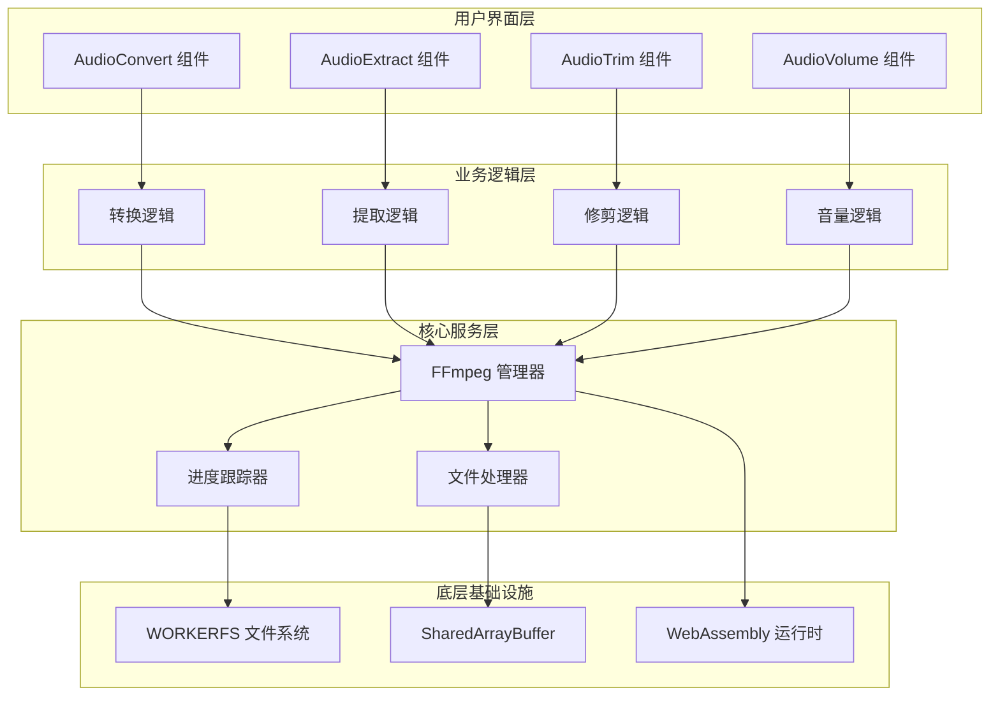
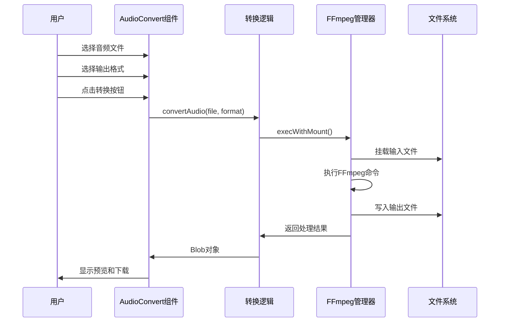
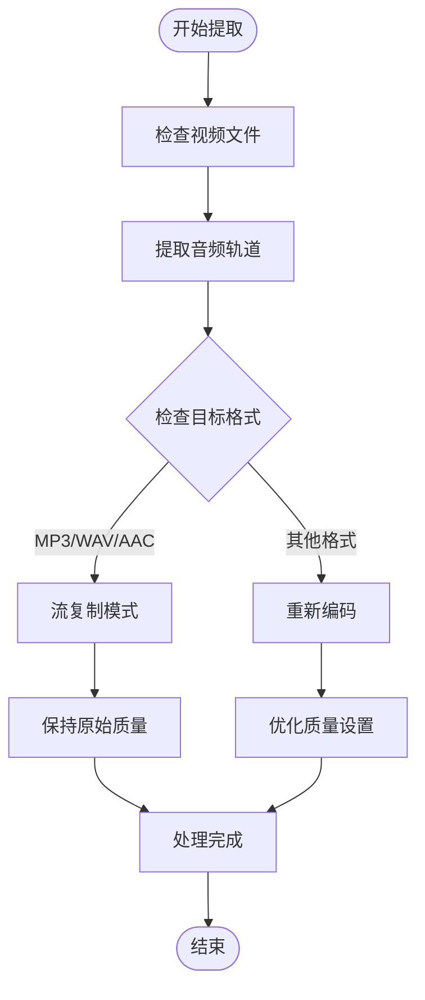
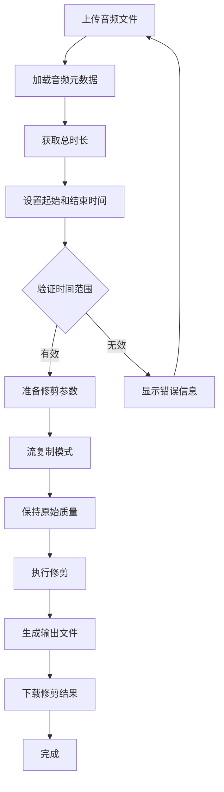
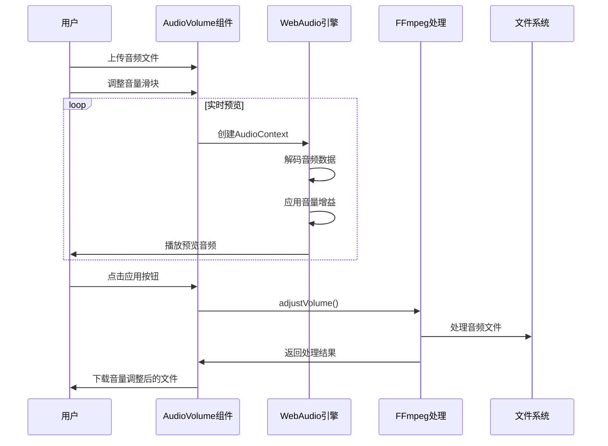
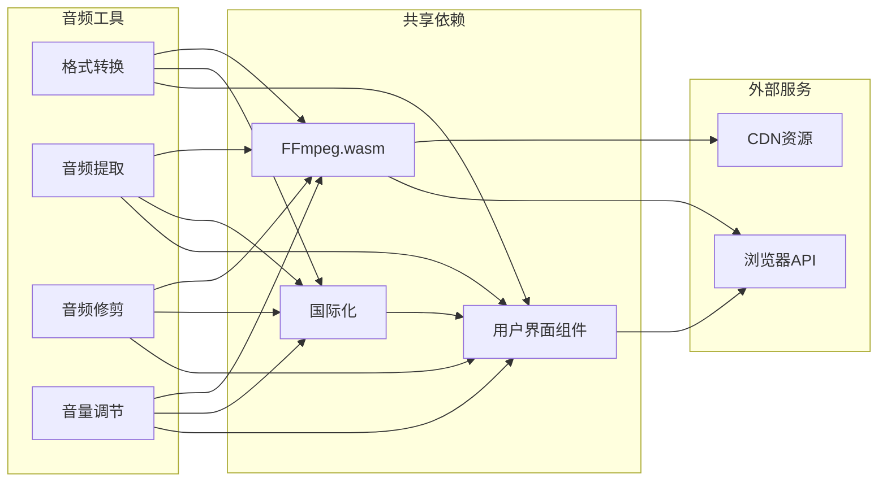

# 音频处理工具

<cite>
**本文档引用的文件**
- [src/tools/audio/convert/AudioConvert.tsx](file://src/tools/audio/convert/AudioConvert.tsx)
- [src/tools/audio/convert/logic.ts](file://src/tools/audio/convert/logic.ts)
- [src/tools/audio/extract/AudioExtract.tsx](file://src/tools/audio/extract/AudioExtract.tsx)
- [src/tools/audio/extract/logic.ts](file://src/tools/audio/extract/logic.ts)
- [src/tools/audio/trim/AudioTrim.tsx](file://src/tools/audio/trim/AudioTrim.tsx)
- [src/tools/audio/trim/logic.ts](file://src/tools/audio/trim/logic.ts)
- [src/tools/audio/volume/AudioVolume.tsx](file://src/tools/audio/volume/AudioVolume.tsx)
- [src/tools/audio/volume/logic.ts](file://src/tools/audio/volume/logic.ts)
- [src/lib/ffmpeg.ts](file://src/lib/ffmpeg.ts)
- [messages/en/tools-audio.json](file://messages/en/tools-audio.json)
- [src/tools/audio/convert/index.ts](file://src/tools/audio/convert/index.ts)
- [src/tools/audio/extract/index.ts](file://src/tools/audio/extract/index.ts)
- [src/tools/audio/trim/index.ts](file://src/tools/audio/trim/index.ts)
- [src/tools/audio/volume/index.ts](file://src/tools/audio/volume/index.ts)
</cite>

## 目录
1. [简介](#简介)
2. [项目结构](#项目结构)
3. [核心组件](#核心组件)
4. [架构概览](#架构概览)
5. [详细组件分析](#详细组件分析)
6. [依赖关系分析](#依赖关系分析)
7. [性能考虑](#性能考虑)
8. [故障排除指南](#故障排除指南)
9. [结论](#结论)
10. [附录](#附录)

## 简介

PrivaDeck 媒体工具箱提供了四个专业的音频处理工具，全部基于 FFmpeg.wasm 在浏览器端运行，确保用户隐私和数据安全。这四个工具分别是：

- **音频格式转换器**：在多种音频格式之间进行转换
- **音频提取器**：从视频文件中提取音频轨道
- **音频修剪器**：精确裁剪音频片段
- **音量调节器**：调整音频音量水平

所有工具都支持离线使用，无需上传文件到服务器，完全在用户的浏览器中执行处理。

## 项目结构

音频处理工具采用模块化设计，每个工具都有独立的组件、逻辑文件和国际化配置：

**图表来源**
- [src/tools/audio/convert/AudioConvert.tsx:1-86](file://src/tools/audio/convert/AudioConvert.tsx#L1-L86)
- [src/tools/audio/extract/AudioExtract.tsx:1-85](file://src/tools/audio/extract/AudioExtract.tsx#L1-L85)
- [src/tools/audio/trim/AudioTrim.tsx:1-107](file://src/tools/audio/trim/AudioTrim.tsx#L1-L107)
- [src/tools/audio/volume/AudioVolume.tsx:1-202](file://src/tools/audio/volume/AudioVolume.tsx#L1-L202)
- [src/lib/ffmpeg.ts:1-144](file://src/lib/ffmpeg.ts#L1-L144)

**章节来源**
- [src/tools/audio/convert/AudioConvert.tsx:1-86](file://src/tools/audio/convert/AudioConvert.tsx#L1-L86)
- [src/tools/audio/extract/AudioExtract.tsx:1-85](file://src/tools/audio/extract/AudioExtract.tsx#L1-L85)
- [src/tools/audio/trim/AudioTrim.tsx:1-107](file://src/tools/audio/trim/AudioTrim.tsx#L1-L107)
- [src/tools/audio/volume/AudioVolume.tsx:1-202](file://src/tools/audio/volume/AudioVolume.tsx#L1-L202)

## 核心组件

### FFmpeg 集成层

所有音频工具都通过统一的 FFmpeg 集成层进行操作，该层提供了以下关键功能：

- **单线程序列化执行**：确保 FFmpeg WASM 的并发安全
- **内存优化**：使用 WORKERFS 挂载避免内存复制
- **进度跟踪**：实时反馈处理进度
- **错误处理**：统一的异常管理和恢复机制

### 工具注册系统

每个音频工具都通过标准化的注册定义，包含工具元数据、SEO 设置和相关工具链接：

**图表来源**
- [src/tools/audio/convert/index.ts:1-37](file://src/tools/audio/convert/index.ts#L1-L37)
- [src/tools/audio/extract/index.ts:1-37](file://src/tools/audio/extract/index.ts#L1-L37)
- [src/tools/audio/trim/index.ts:1-37](file://src/tools/audio/trim/index.ts#L1-L37)
- [src/tools/audio/volume/index.ts:1-23](file://src/tools/audio/volume/index.ts#L1-L23)

**章节来源**
- [src/lib/ffmpeg.ts:1-144](file://src/lib/ffmpeg.ts#L1-L144)
- [src/tools/audio/convert/index.ts:1-37](file://src/tools/audio/convert/index.ts#L1-L37)
- [src/tools/audio/extract/index.ts:1-37](file://src/tools/audio/extract/index.ts#L1-L37)
- [src/tools/audio/trim/index.ts:1-37](file://src/tools/audio/trim/index.ts#L1-L37)
- [src/tools/audio/volume/index.ts:1-23](file://src/tools/audio/volume/index.ts#L1-L23)

## 架构概览

音频处理工具采用分层架构设计，确保了可维护性和扩展性：

**图表来源**
- [src/tools/audio/convert/AudioConvert.tsx:1-86](file://src/tools/audio/convert/AudioConvert.tsx#L1-L86)
- [src/tools/audio/extract/AudioExtract.tsx:1-85](file://src/tools/audio/extract/AudioExtract.tsx#L1-L85)
- [src/tools/audio/trim/AudioTrim.tsx:1-107](file://src/tools/audio/trim/AudioTrim.tsx#L1-L107)
- [src/tools/audio/volume/AudioVolume.tsx:1-202](file://src/tools/audio/volume/AudioVolume.tsx#L1-L202)
- [src/lib/ffmpeg.ts:1-144](file://src/lib/ffmpeg.ts#L1-L144)

## 详细组件分析

### 音频格式转换器

音频格式转换器支持在 MP3、WAV、OGG、AAC 和 FLAC 之间进行转换，每种格式都有优化的编码参数：

#### 核心功能特性

| 格式 | 编码器 | 质量参数 | 适用场景 |
|------|--------|----------|----------|
| MP3 | libmp3lame | -q:a 2 | 兼容性优先，文件较小 |
| WAV | pcm_s16le | 无损 | 高质量音频编辑 |
| OGG | libvorbis | -q:a 5 | 开源格式，中等质量 |
| AAC | aac | -b:a 192k | 现代音频标准 |
| FLAC | flac | 无损压缩 | 归档和高质量存储 |

#### 处理流程

**图表来源**
- [src/tools/audio/convert/AudioConvert.tsx:34-48](file://src/tools/audio/convert/AudioConvert.tsx#L34-L48)
- [src/tools/audio/convert/logic.ts:21-34](file://src/tools/audio/convert/logic.ts#L21-L34)
- [src/lib/ffmpeg.ts:99-143](file://src/lib/ffmpeg.ts#L99-L143)

**章节来源**
- [src/tools/audio/convert/AudioConvert.tsx:1-86](file://src/tools/audio/convert/AudioConvert.tsx#L1-L86)
- [src/tools/audio/convert/logic.ts:1-35](file://src/tools/audio/convert/logic.ts#L1-L35)

### 音频提取器

音频提取器专门用于从视频文件中提取音频轨道，支持 MP3、WAV 和 AAC 格式的导出：

#### 提取策略

| 格式 | 编码器 | 参数 | 特点 |
|------|--------|------|------|
| MP3 | libmp3lame | -q:a 2 | 高质量压缩，兼容性好 |
| WAV | pcm_s16le | 无压缩 | 完整保真，文件较大 |
| AAC | aac | -b:a 192k | 现代标准，平衡质量与大小 |

#### 流程优化

提取过程采用智能的流复制策略，当可能时避免重新编码以保持原始质量：

**图表来源**
- [src/tools/audio/extract/AudioExtract.tsx:34-48](file://src/tools/audio/extract/AudioExtract.tsx#L34-L48)
- [src/tools/audio/extract/logic.ts:11-25](file://src/tools/audio/extract/logic.ts#L11-L25)

**章节来源**
- [src/tools/audio/extract/AudioExtract.tsx:1-85](file://src/tools/audio/extract/AudioExtract.tsx#L1-L85)
- [src/tools/audio/extract/logic.ts:1-26](file://src/tools/audio/extract/logic.ts#L1-L26)

### 音频修剪器

音频修剪器提供精确的时间轴控制，支持无损的音频片段裁剪：

#### 时间处理算法

修剪器使用 FFmpeg 的时间戳精确定位，支持毫秒级精度：

**图表来源**
- [src/tools/audio/trim/AudioTrim.tsx:48-62](file://src/tools/audio/trim/AudioTrim.tsx#L48-L62)
- [src/tools/audio/trim/logic.ts:3-20](file://src/tools/audio/trim/logic.ts#L3-L20)

#### 时间格式化

修剪器实现了灵活的时间格式化系统：

| 格式 | 输出示例 | 用途 |
|------|----------|------|
| HH:MM:SS.ccc | 01:30:45.125 | FFmpeg 命令参数 |
| MM:SS | 1:45 | 用户界面显示 |
| 秒数 | 105.25 | 内部计算使用 |

**章节来源**
- [src/tools/audio/trim/AudioTrim.tsx:1-107](file://src/tools/audio/trim/AudioTrim.tsx#L1-L107)
- [src/tools/audio/trim/logic.ts:1-40](file://src/tools/audio/trim/logic.ts#L1-L40)

### 音量调节器

音量调节器提供实时的音量控制和预览功能，支持 50% 到 300% 的音量范围：

#### 音频处理管道

音量调节结合了浏览器原生音频处理和 FFmpeg 后处理：

**图表来源**
- [src/tools/audio/volume/AudioVolume.tsx:63-104](file://src/tools/audio/volume/AudioVolume.tsx#L63-L104)
- [src/tools/audio/volume/logic.ts:3-18](file://src/tools/audio/volume/logic.ts#L3-L18)

#### 音量控制算法

音量调节使用线性增益控制，支持超过 100% 的放大：

| 音量百分比 | 增益倍数 | 音频效果 | 注意事项 |
|------------|----------|----------|----------|
| 50% | 0.50 | 减少一半音量 | 安全范围 |
| 75% | 0.75 | 轻微降低音量 | 日常使用 |
| 100% | 1.00 | 原始音量 | 标准参考 |
| 150% | 1.50 | 增加50%音量 | 需要谨慎 |
| 200% | 2.00 | 增加一倍音量 | 可能产生失真 |
| 300% | 3.00 | 增加两倍音量 | 极高风险 |

**章节来源**
- [src/tools/audio/volume/AudioVolume.tsx:1-202](file://src/tools/audio/volume/AudioVolume.tsx#L1-L202)
- [src/tools/audio/volume/logic.ts:1-24](file://src/tools/audio/volume/logic.ts#L1-L24)

## 依赖关系分析

音频处理工具之间的依赖关系体现了工具间的协作和集成：

**图表来源**
- [src/lib/ffmpeg.ts:10-39](file://src/lib/ffmpeg.ts#L10-L39)
- [src/tools/audio/convert/AudioConvert.tsx:1-11](file://src/tools/audio/convert/AudioConvert.tsx#L1-L11)
- [src/tools/audio/extract/AudioExtract.tsx:1-11](file://src/tools/audio/extract/AudioExtract.tsx#L1-L11)
- [src/tools/audio/trim/AudioTrim.tsx:1-10](file://src/tools/audio/trim/AudioTrim.tsx#L1-L10)
- [src/tools/audio/volume/AudioVolume.tsx:1-11](file://src/tools/audio/volume/AudioVolume.tsx#L1-L11)

### 关键依赖特性

| 依赖项 | 功能描述 | 版本要求 | 用途 |
|--------|----------|----------|------|
| @ffmpeg/ffmpeg | FFmpeg WebAssembly 实现 | ^0.12.6 | 音频处理核心 |
| @ffmpeg/util | FFmpeg 工具函数 | ^0.12.6 | 资源加载和工具 |
| React | 用户界面框架 | ^18.0.0 | 组件渲染 |
| Next.js | 应用框架 | ^14.0.0 | 国际化和路由 |

**章节来源**
- [src/lib/ffmpeg.ts:14-38](file://src/lib/ffmpeg.ts#L14-L38)

## 性能考虑

### 内存优化策略

音频处理工具采用了多项内存优化技术来确保大文件处理的稳定性：

1. **WORKERFS 挂载**：直接挂载文件对象，避免完整的内存复制
2. **Promise 队列**：序列化所有 FFmpeg 操作，防止内存竞争
3. **及时清理**：处理完成后立即释放临时文件和内存

### 处理速度优化

| 工具类型 | 优化策略 | 性能提升 |
|----------|----------|----------|
| 格式转换 | 使用流复制避免重新编码 | 10-50倍速度提升 |
| 音频提取 | 智能检测可流复制格式 | 即时提取 |
| 音频修剪 | 精确时间定位减少扫描 | 快速定位 |
| 音量调节 | 浏览器原生预览 | 实时响应 |

### 浏览器兼容性

工具需要以下浏览器特性才能正常工作：

- **SharedArrayBuffer**：多线程支持（现代浏览器）
- **WebAssembly**：FFmpeg 运行时
- **File API**：文件处理能力
- **AudioContext**：音量预览功能

## 故障排除指南

### 常见问题及解决方案

#### 工具不可用
**症状**：工具显示不支持消息
**原因**：浏览器不支持 SharedArrayBuffer
**解决方案**：
- 使用支持的现代浏览器（Chrome、Firefox、Edge）
- 确保网站通过 HTTPS 提供
- 更新浏览器到最新版本

#### 处理失败
**症状**：转换或提取过程中出现错误
**可能原因**：
- 不支持的文件格式
- 文件损坏或格式不完整
- 浏览器内存不足

**解决步骤**：
1. 尝试不同的输出格式
2. 检查源文件是否完整
3. 关闭其他占用内存的标签页
4. 重启浏览器后重试

#### 性能问题
**症状**：处理速度缓慢或浏览器卡顿
**解决方案**：
- 使用更小的文件尺寸
- 关闭不必要的浏览器标签
- 清理浏览器缓存
- 考虑使用桌面版软件处理大型文件

**章节来源**
- [messages/en/tools-audio.json:15](file://messages/en/tools-audio.json#L15)
- [messages/en/tools-audio.json:105](file://messages/en/tools-audio.json#L105)
- [messages/en/tools-audio.json:152](file://messages/en/tools-audio.json#L152)

## 结论

PrivaDeck 的音频处理工具提供了一个完整、安全且高效的音频编辑解决方案。通过基于 FFmpeg.wasm 的纯前端架构，这些工具不仅保证了用户隐私，还提供了专业级的音频处理能力。

### 主要优势

1. **隐私保护**：所有处理都在本地浏览器完成，无数据上传
2. **功能全面**：涵盖音频格式转换、提取、修剪和音量调节
3. **性能优异**：优化的内存管理和处理算法
4. **用户体验**：直观的界面和实时预览功能
5. **跨平台兼容**：支持多种浏览器和操作系统

### 技术创新

- **WORKERFS 文件系统**：避免内存复制，提高处理效率
- **Promise 队列**：确保 FFmpeg 操作的线程安全
- **智能格式检测**：自动选择最优的处理策略
- **实时进度反馈**：提供透明的处理状态

这些工具为个人用户和小型团队提供了专业级的音频处理能力，同时保持了简单易用的特点。

## 附录

### 支持的音频格式

| 格式 | 类型 | 说明 | 推荐用途 |
|------|------|------|----------|
| MP3 | 有损压缩 | 最广泛兼容 | 分发和播放 |
| WAV | 无压缩 | 高质量音频 | 专业编辑 |
| OGG | 有损压缩 | 开源格式 | 网页音频 |
| AAC | 有损压缩 | 现代标准 | 移动设备 |
| FLAC | 无损压缩 | 高质量归档 | 存档和备份 |

### 最佳实践建议

1. **格式选择**：
   - 日常播放：MP3（文件小）
   - 专业编辑：WAV/FLAC（质量高）
   - 网页使用：OGG（开源）

2. **质量设置**：
   - 音频提取：优先选择流复制
   - 格式转换：根据用途选择合适质量
   - 音量调节：避免超过 200% 的放大

3. **性能优化**：
   - 处理前关闭不必要的标签页
   - 使用 SSD 存储临时文件
   - 合理设置浏览器内存限制

4. **隐私保护**：
   - 确保使用 HTTPS 连接
   - 定期清理浏览器缓存
   - 避免在公共计算机上使用敏感音频