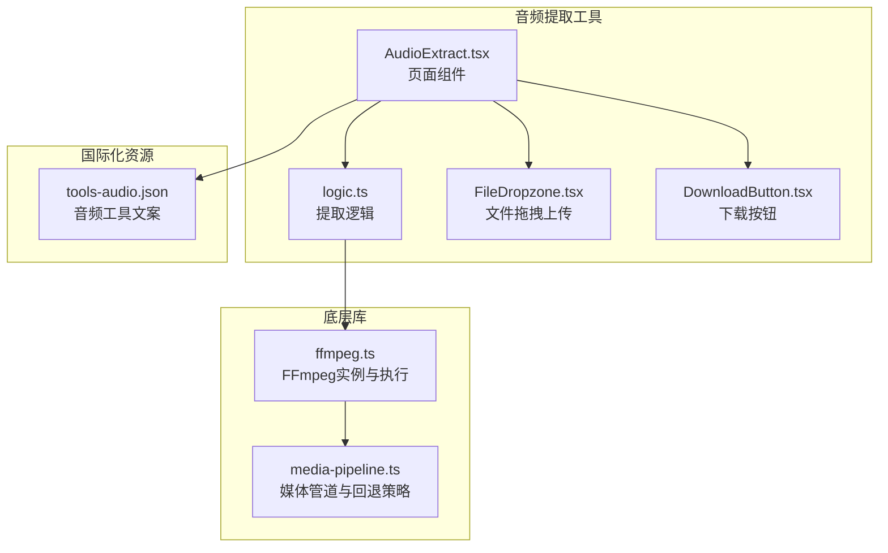
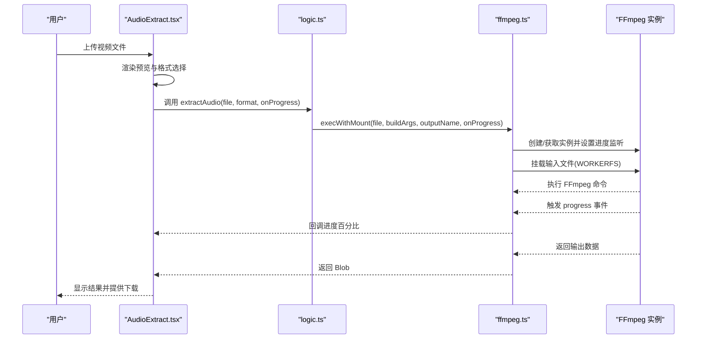
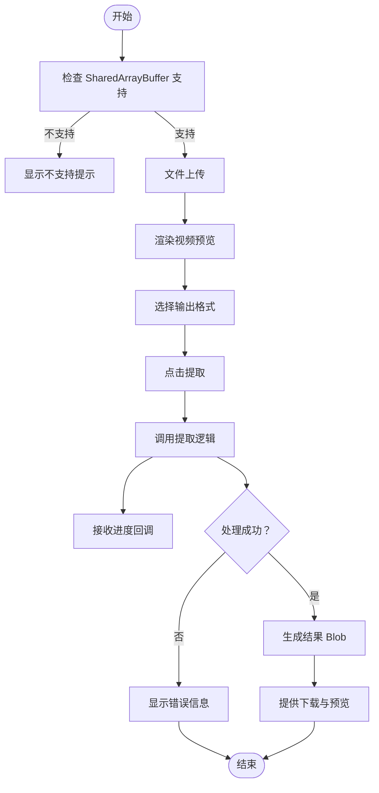
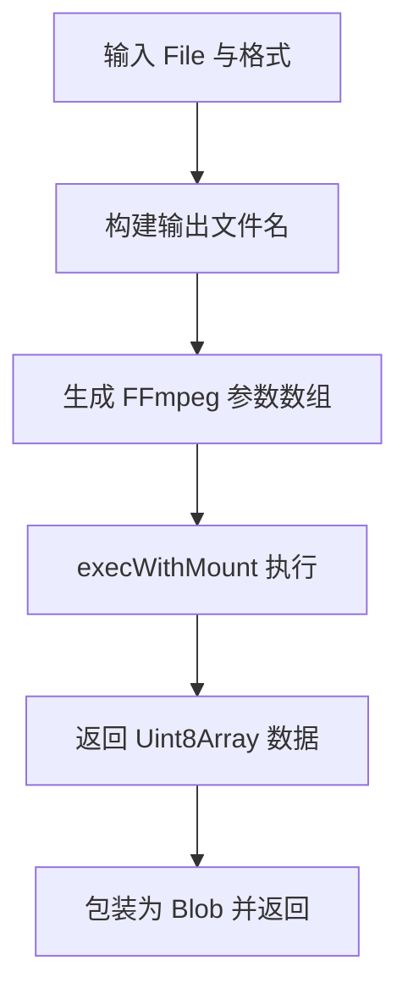
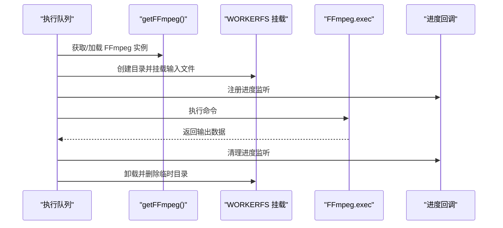
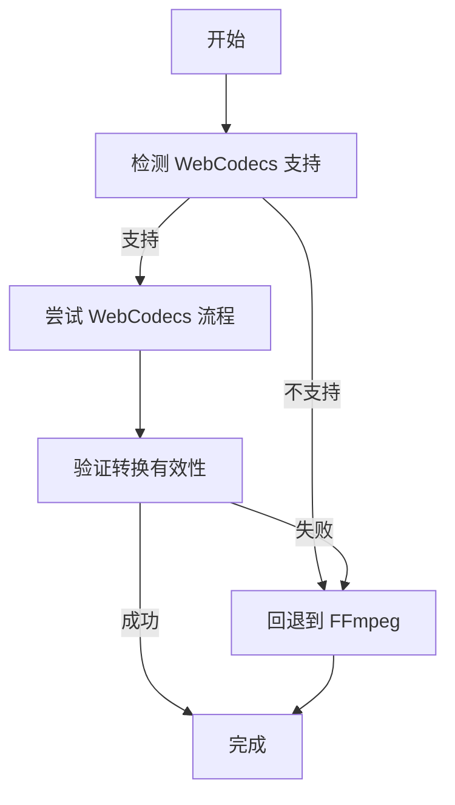
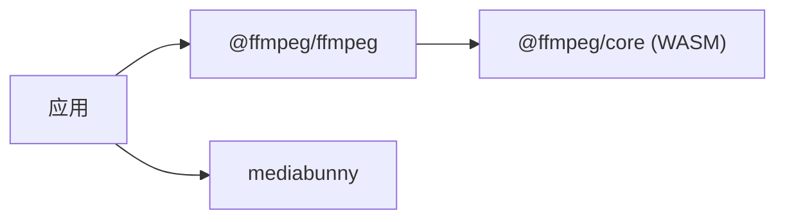

# 音频提取

<cite>
**本文引用的文件**
- [AudioExtract.tsx](file://src/tools/audio/extract/AudioExtract.tsx)
- [logic.ts](file://src/tools/audio/extract/logic.ts)
- [ffmpeg.ts](file://src/lib/ffmpeg.ts)
- [media-pipeline.ts](file://src/lib/media-pipeline.ts)
- [FileDropzone.tsx](file://src/components/shared/FileDropzone.tsx)
- [DownloadButton.tsx](file://src/components/shared/DownloadButton.tsx)
- [tools-audio.json](file://messages/en/tools-audio.json)
- [package.json](file://package.json)
</cite>

## 目录
1. [简介](#简介)
2. [项目结构](#项目结构)
3. [核心组件](#核心组件)
4. [架构总览](#架构总览)
5. [详细组件分析](#详细组件分析)
6. [依赖关系分析](#依赖关系分析)
7. [性能考虑](#性能考虑)
8. [故障排除指南](#故障排除指南)
9. [结论](#结论)
10. [附录](#附录)

## 简介
本功能文档聚焦于音频提取工具，详细阐述如何在浏览器端从视频文件中提取音频，涵盖支持的视频格式、音频轨道分离、多语言音轨选择与音频质量保持等核心能力。文档解释了提取过程中的关键技术点，包括容器格式解析、音频编解码器识别、同步处理与元数据保留；并提供具体使用示例、进度监控、错误恢复与性能优化策略，以及不同视频格式的提取特点与最佳实践。

## 项目结构
音频提取工具位于工具模块的音频子目录下，采用“页面组件 + 业务逻辑 + 底层库”的分层设计：
- 页面组件负责用户交互与结果展示
- 业务逻辑封装 FFmpeg 命令构建与执行
- 底层库提供 FFmpeg 实例管理、进度回调与文件系统挂载

**图表来源**
- [AudioExtract.tsx:1-85](file://src/tools/audio/extract/AudioExtract.tsx#L1-L85)
- [logic.ts:1-26](file://src/tools/audio/extract/logic.ts#L1-L26)
- [ffmpeg.ts:1-144](file://src/lib/ffmpeg.ts#L1-L144)
- [media-pipeline.ts:1-105](file://src/lib/media-pipeline.ts#L1-L105)
- [FileDropzone.tsx:1-144](file://src/components/shared/FileDropzone.tsx#L1-L144)
- [DownloadButton.tsx:1-54](file://src/components/shared/DownloadButton.tsx#L1-L54)
- [tools-audio.json:96-139](file://messages/en/tools-audio.json#L96-L139)

**章节来源**
- [AudioExtract.tsx:1-85](file://src/tools/audio/extract/AudioExtract.tsx#L1-L85)
- [logic.ts:1-26](file://src/tools/audio/extract/logic.ts#L1-L26)
- [ffmpeg.ts:1-144](file://src/lib/ffmpeg.ts#L1-L144)
- [media-pipeline.ts:1-105](file://src/lib/media-pipeline.ts#L1-L105)
- [FileDropzone.tsx:1-144](file://src/components/shared/FileDropzone.tsx#L1-L144)
- [DownloadButton.tsx:1-54](file://src/components/shared/DownloadButton.tsx#L1-L54)
- [tools-audio.json:96-139](file://messages/en/tools-audio.json#L96-L139)

## 核心组件
- 页面组件：负责文件上传、格式选择、进度显示、结果预览与下载。
- 提取逻辑：根据所选输出格式生成 FFmpeg 参数，调用底层执行函数完成提取。
- FFmpeg 执行：通过 WORKERFS 挂载输入文件，避免内存拷贝，串行化执行以保证稳定性。
- 媒体管道：提供 WebCodecs 能力检测与回退策略，保障在不支持的浏览器上仍可工作。
- 文件上传与下载：提供拖拽上传、隐私提示与安全下载。

**章节来源**
- [AudioExtract.tsx:15-85](file://src/tools/audio/extract/AudioExtract.tsx#L15-L85)
- [logic.ts:11-26](file://src/tools/audio/extract/logic.ts#L11-L26)
- [ffmpeg.ts:99-144](file://src/lib/ffmpeg.ts#L99-L144)
- [media-pipeline.ts:7-14](file://src/lib/media-pipeline.ts#L7-L14)
- [FileDropzone.tsx:42-144](file://src/components/shared/FileDropzone.tsx#L42-L144)
- [DownloadButton.tsx:18-54](file://src/components/shared/DownloadButton.tsx#L18-L54)

## 架构总览
音频提取的端到端流程如下：
- 用户上传视频文件
- 页面组件渲染预览与格式选项
- 业务逻辑构建 FFmpeg 命令
- 底层库通过 WORKERFS 挂载文件并执行命令
- 进度事件通过回调返回给页面组件
- 成功后生成 Blob 并提供下载

**图表来源**
- [AudioExtract.tsx:34-48](file://src/tools/audio/extract/AudioExtract.tsx#L34-L48)
- [logic.ts:11-26](file://src/tools/audio/extract/logic.ts#L11-L26)
- [ffmpeg.ts:99-144](file://src/lib/ffmpeg.ts#L99-L144)

## 详细组件分析

### 页面组件：AudioExtract
- 功能要点
  - 支持视频文件上传（拖拽或点击）
  - 输出格式选择（MP3、WAV、AAC）
  - 进度条显示与错误提示
  - 结果预览与下载
  - 浏览器兼容性检查（SharedArrayBuffer）
- 关键交互
  - 上传成功后展示视频预览
  - 点击“提取”触发异步处理
  - 处理过程中禁用按钮并显示进度百分比
  - 出错时捕获异常并显示错误信息
  - 成功后生成可播放的音频预览与下载链接

**图表来源**
- [AudioExtract.tsx:26-85](file://src/tools/audio/extract/AudioExtract.tsx#L26-L85)

**章节来源**
- [AudioExtract.tsx:15-85](file://src/tools/audio/extract/AudioExtract.tsx#L15-L85)

### 提取逻辑：extractAudio
- 功能要点
  - 定义三种输出格式及其对应 FFmpeg 参数与 MIME 类型
  - 通过 execWithMount 执行 FFmpeg 命令，仅提取音频流
  - 将输出数据包装为 Blob 并返回
- 关键参数
  - MP3：使用 libmp3lame 编码，质量参数适中
  - WAV：无损 PCM 16-bit
  - AAC：使用 AAC 编码，设定音频比特率

**图表来源**
- [logic.ts:5-26](file://src/tools/audio/extract/logic.ts#L5-L26)

**章节来源**
- [logic.ts:1-26](file://src/tools/audio/extract/logic.ts#L1-L26)

### FFmpeg 执行：execWithMount
- 功能要点
  - 单例化 FFmpeg 实例加载与缓存
  - 使用 Promise 队列串行化所有操作，避免并发冲突
  - 通过 WORKERFS 挂载输入文件，避免内存复制
  - 设置/清理进度事件监听，确保原子性
  - 执行完成后清理 MEMFS 中的输出文件
- 性能优势
  - 避免 fetchFile + writeFile 的两次内存拷贝
  - 通过队列控制单线程执行，稳定可靠

**图表来源**
- [ffmpeg.ts:99-144](file://src/lib/ffmpeg.ts#L99-L144)

**章节来源**
- [ffmpeg.ts:1-144](file://src/lib/ffmpeg.ts#L1-L144)

### 媒体管道与回退策略：WebCodecs
- 能力检测
  - 检测浏览器是否支持 WebCodecs 的编解码器接口
- 回退机制
  - 当 WebCodecs 不可用或检测到不支持的编解码器时，自动回退至 FFmpeg
  - 对于某些硬件编解码器（如 HEVC），建议安装扩展以提升性能

**图表来源**
- [media-pipeline.ts:7-105](file://src/lib/media-pipeline.ts#L7-L105)

**章节来源**
- [media-pipeline.ts:1-105](file://src/lib/media-pipeline.ts#L1-L105)

### 组件与资源
- 文件上传组件：提供拖拽上传、最大文件大小限制、隐私提示与分析事件上报
- 下载组件：安全创建对象 URL、品牌化文件名、分析事件上报
- 国际化文案：包含音频提取工具的名称、描述、FAQ、SEO 内容等

**章节来源**
- [FileDropzone.tsx:42-144](file://src/components/shared/FileDropzone.tsx#L42-L144)
- [DownloadButton.tsx:18-54](file://src/components/shared/DownloadButton.tsx#L18-L54)
- [tools-audio.json:96-139](file://messages/en/tools-audio.json#L96-L139)

## 依赖关系分析
- 工具依赖
  - @ffmpeg/ffmpeg：WebAssembly 版本的 FFmpeg，提供本地视频/音频处理能力
  - mediabunny：提供基于 WebCodecs 的媒体管道，作为 FFmpeg 的备选方案
- 工具链版本
  - @ffmpeg/ffmpeg@0.12.15
  - @ffmpeg/core@0.12.6（通过 CDN 加载）

**图表来源**
- [package.json:11-32](file://package.json#L11-L32)

**章节来源**
- [package.json:1-45](file://package.json#L1-L45)

## 性能考虑
- 内存优化
  - 使用 WORKERFS 挂载输入文件，避免将 File 对象完整复制到内存
  - 在读取输出数据后立即删除 MEMFS 中的临时文件，降低峰值内存占用
- 并发控制
  - 通过 Promise 队列串行化所有 FFmpeg 操作，避免并发挂载点冲突
- 兼容性与回退
  - 在不支持 SharedArrayBuffer 或特定编解码器的环境下，自动回退到 FFmpeg
  - 对 HEVC 等硬件编解码器，建议安装系统扩展以获得更好的性能

**章节来源**
- [ffmpeg.ts:99-144](file://src/lib/ffmpeg.ts#L99-L144)
- [media-pipeline.ts:98-105](file://src/lib/media-pipeline.ts#L98-L105)

## 故障排除指南
- SharedArrayBuffer 不支持
  - 现象：页面提示不支持
  - 处理：升级浏览器、使用 HTTPS、确保现代浏览器
- FFmpeg 加载失败
  - 现象：初始化异常或无法执行命令
  - 处理：检查网络连通性、CDN 可达性；重试加载
- 进度回调异常
  - 现象：进度未更新或异常跳变
  - 处理：确认回调注册与清理逻辑正确；避免重复监听
- 输出为空或格式错误
  - 现象：生成的音频无法播放或格式不符
  - 处理：确认输入视频包含音频轨；检查输出格式参数；尝试其他格式

**章节来源**
- [AudioExtract.tsx:26-32](file://src/tools/audio/extract/AudioExtract.tsx#L26-L32)
- [ffmpeg.ts:14-39](file://src/lib/ffmpeg.ts#L14-L39)
- [logic.ts:5-9](file://src/tools/audio/extract/logic.ts#L5-L9)

## 结论
音频提取工具通过浏览器端的 FFmpeg.wasm 实现，无需上传即可完成从视频中提取音频的任务。其设计强调性能（避免内存拷贝、串行化执行）与兼容性（WebCodecs 回退、编解码器检测）。用户可通过直观的界面选择输出格式并实时查看进度，最终获得高质量的音频文件。

## 附录

### 支持的视频格式与音频输出
- 输入视频格式：MP4、WebM、MKV、AVI 等常见容器
- 输出音频格式：MP3、WAV、AAC
- 关键参数
  - MP3：高质量有损压缩，适合广泛兼容
  - WAV：无损 PCM，适合高质量编辑
  - AAC：高效有损压缩，适合移动设备与流媒体

**章节来源**
- [tools-audio.json:107-116](file://messages/en/tools-audio.json#L107-L116)
- [logic.ts:5-9](file://src/tools/audio/extract/logic.ts#L5-L9)

### 使用示例与最佳实践
- 上传视频文件（支持拖拽或点击）
- 选择输出音频格式（MP3/WAV/AAC）
- 点击“提取”，观察进度条
- 下载并预览提取结果
- 最佳实践
  - 优先使用 MP3 以获得更广的播放兼容性
  - 需要高质量编辑时选择 WAV
  - 对移动设备或流媒体场景选择 AAC

**章节来源**
- [AudioExtract.tsx:50-85](file://src/tools/audio/extract/AudioExtract.tsx#L50-L85)
- [tools-audio.json:123-129](file://messages/en/tools-audio.json#L123-L129)