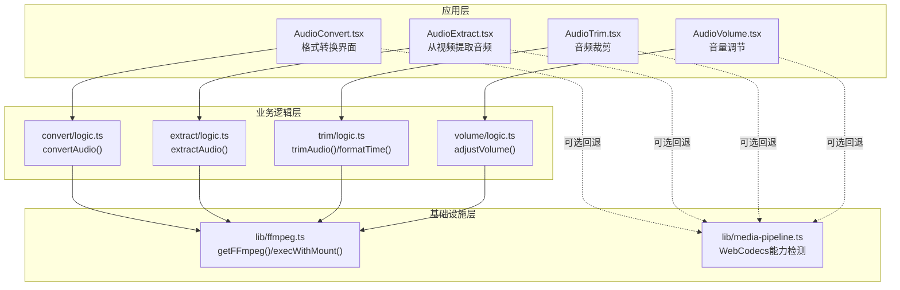
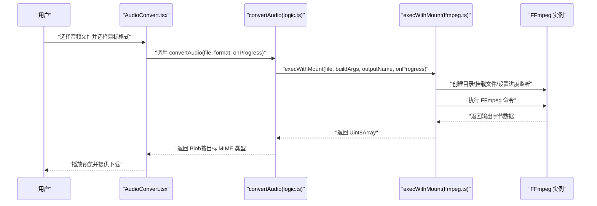
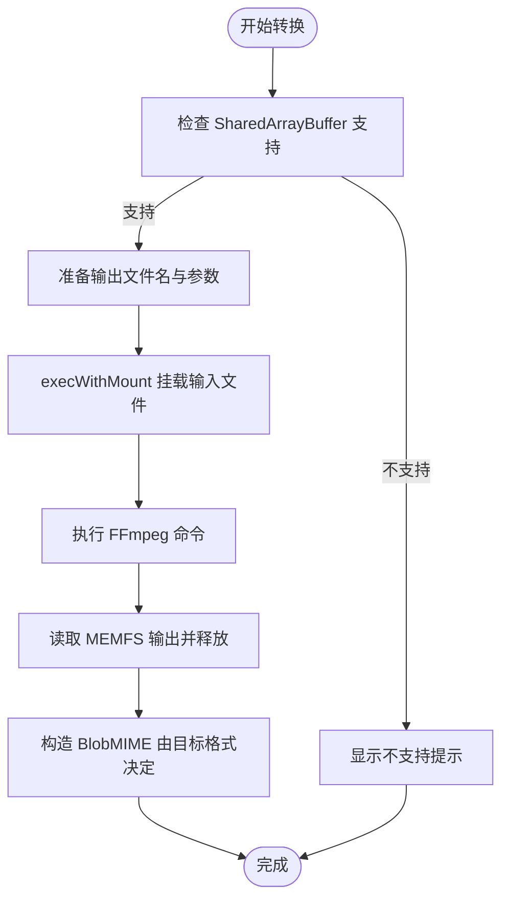
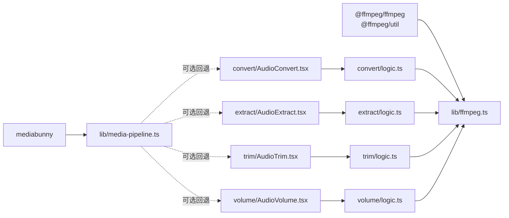

# 音频格式转换

<cite>
**本文引用的文件**
- [README.md](file://README.md)
- [package.json](file://package.json)
- [src/lib/ffmpeg.ts](file://src/lib/ffmpeg.ts)
- [src/lib/media-pipeline.ts](file://src/lib/media-pipeline.ts)
- [src/tools/audio/convert/AudioConvert.tsx](file://src/tools/audio/convert/AudioConvert.tsx)
- [src/tools/audio/convert/logic.ts](file://src/tools/audio/convert/logic.ts)
- [src/tools/audio/extract/AudioExtract.tsx](file://src/tools/audio/extract/AudioExtract.tsx)
- [src/tools/audio/extract/logic.ts](file://src/tools/audio/extract/logic.ts)
- [src/tools/audio/trim/AudioTrim.tsx](file://src/tools/audio/trim/AudioTrim.tsx)
- [src/tools/audio/trim/logic.ts](file://src/tools/audio/trim/logic.ts)
- [src/tools/audio/volume/AudioVolume.tsx](file://src/tools/audio/volume/AudioVolume.tsx)
- [src/tools/audio/volume/logic.ts](file://src/tools/audio/volume/logic.ts)
</cite>

## 目录
1. [简介](#简介)
2. [项目结构](#项目结构)
3. [核心组件](#核心组件)
4. [架构总览](#架构总览)
5. [详细组件分析](#详细组件分析)
6. [依赖关系分析](#依赖关系分析)
7. [性能考量](#性能考量)
8. [故障排查指南](#故障排查指南)
9. [结论](#结论)
10. [附录](#附录)

## 简介
本文件面向“音频格式转换工具”的功能与技术实现，系统阐述浏览器端音频处理能力、FFmpeg.wasm 的集成方式、以及音频格式转换的关键技术点（编解码器选择、采样率与比特率控制、质量与体积平衡、兼容性与进度反馈）。同时提供使用示例、错误处理策略与性能优化建议，并对主流音频格式进行特性对比与转换建议。

## 项目结构
该工具箱采用 Next.js App Router 组织页面与工具模块，音频工具位于 src/tools/audio 下，核心处理逻辑通过 FFmpeg.wasm 在浏览器内执行，避免上传文件到服务器，确保隐私与离线可用。

图表来源
- [src/tools/audio/convert/AudioConvert.tsx:15-85](file://src/tools/audio/convert/AudioConvert.tsx#L15-L85)
- [src/tools/audio/convert/logic.ts:21-34](file://src/tools/audio/convert/logic.ts#L21-L34)
- [src/tools/audio/extract/AudioExtract.tsx:15-84](file://src/tools/audio/extract/AudioExtract.tsx#L15-L84)
- [src/tools/audio/extract/logic.ts:11-25](file://src/tools/audio/extract/logic.ts#L11-L25)
- [src/tools/audio/trim/AudioTrim.tsx:12-106](file://src/tools/audio/trim/AudioTrim.tsx#L12-L106)
- [src/tools/audio/trim/logic.ts:3-19](file://src/tools/audio/trim/logic.ts#L3-L19)
- [src/tools/audio/volume/AudioVolume.tsx:15-201](file://src/tools/audio/volume/AudioVolume.tsx#L15-L201)
- [src/tools/audio/volume/logic.ts:3-17](file://src/tools/audio/volume/logic.ts#L3-L17)
- [src/lib/ffmpeg.ts:10-143](file://src/lib/ffmpeg.ts#L10-L143)
- [src/lib/media-pipeline.ts:7-104](file://src/lib/media-pipeline.ts#L7-L104)

章节来源
- [README.md: 55-78:55-78](file://README.md#L55-L78)
- [package.json: 11-32:11-32](file://package.json#L11-L32)

## 核心组件
- 音频格式转换（convert）：支持 MP3、WAV、AAC、FLAC、OGG；通过编解码器参数与质量/比特率控制实现体积与质量平衡。
- 音频提取（extract）：从视频文件中提取音频轨，输出为 MP3、WAV、AAC。
- 音频裁剪（trim）：基于时间范围无损复制（流拷贝）实现快速裁剪。
- 音量调节（volume）：实时预览与应用音量增益，支持 0%-300% 调整。
- 基础设施（FFmpeg.wasm）：单实例加载、串行队列执行、WORKERFS 挂载避免内存拷贝、进度事件回调。
- 可选回退（WebCodecs）：在浏览器支持时优先使用 WebCodecs，不支持或不兼容时回退至 FFmpeg。

章节来源
- [src/tools/audio/convert/AudioConvert.tsx: 13-13:13-13](file://src/tools/audio/convert/AudioConvert.tsx#L13-L13)
- [src/tools/audio/convert/logic.ts: 5-11:5-11](file://src/tools/audio/convert/logic.ts#L5-L11)
- [src/lib/ffmpeg.ts: 10-39:10-39](file://src/lib/ffmpeg.ts#L10-L39)
- [src/lib/media-pipeline.ts: 7-14:7-14](file://src/lib/media-pipeline.ts#L7-L14)

## 架构总览
浏览器端音频处理采用“界面组件 + 业务逻辑 + FFmpeg.wasm 执行器”的分层设计。界面组件负责用户交互与状态管理，业务逻辑封装 FFmpeg 参数与输出类型，执行器通过 WORKERFS 将 File 对象挂载到虚拟文件系统，避免全量内存拷贝，提升大文件处理效率。

图表来源
- [src/tools/audio/convert/AudioConvert.tsx: 34-48:34-48](file://src/tools/audio/convert/AudioConvert.tsx#L34-L48)
- [src/tools/audio/convert/logic.ts: 21-34:21-34](file://src/tools/audio/convert/logic.ts#L21-L34)
- [src/lib/ffmpeg.ts: 99-143:99-143](file://src/lib/ffmpeg.ts#L99-L143)

## 详细组件分析

### 音频格式转换（convert）
- 支持格式与默认参数
  - MP3：使用 libmp3lame，质量等级约 2，兼顾体积与清晰度。
  - WAV：PCM 16-bit 无损，文件较大但兼容性最佳。
  - OGG：Vorbis 编码，质量等级约 5，适合网络传输。
  - AAC：AAC 编码，比特率 192k，适配移动设备与流媒体。
  - FLAC：无损压缩，文件最小但仍大于 WAV。
- 关键实现要点
  - 使用 execWithMount 将输入文件以只读方式挂载至 /input，避免内存复制。
  - 通过 FORMAT_OPTIONS 动态拼接 FFmpeg 参数，输出到 MEMFS 并立即释放。
  - 输出 Blob 的 MIME 类型由 FORMAT_MIME 映射决定，确保浏览器正确识别。
- 进度与错误处理
  - 通过 setProgressHandler 将 FFmpeg 进度事件映射到 0-100 的百分比。
  - UI 层显示当前进度与错误信息，失败时捕获异常并提示。

图表来源
- [src/tools/audio/convert/AudioConvert.tsx: 26-32:26-32](file://src/tools/audio/convert/AudioConvert.tsx#L26-L32)
- [src/tools/audio/convert/logic.ts: 21-34:21-34](file://src/tools/audio/convert/logic.ts#L21-L34)
- [src/lib/ffmpeg.ts: 99-143:99-143](file://src/lib/ffmpeg.ts#L99-L143)

章节来源
- [src/tools/audio/convert/AudioConvert.tsx: 15-85:15-85](file://src/tools/audio/convert/AudioConvert.tsx#L15-L85)
- [src/tools/audio/convert/logic.ts: 3-19:3-19](file://src/tools/audio/convert/logic.ts#L3-L19)
- [src/lib/ffmpeg.ts: 99-143:99-143](file://src/lib/ffmpeg.ts#L99-L143)

### 音频提取（extract）
- 功能概述：从视频文件中提取音频轨，输出为 MP3、WAV、AAC。
- 关键参数：-vn 排除视频轨，仅处理音频；随后按目标格式编码。
- 输出类型：根据 FORMAT_OPTIONS.mime 设置 Blob 类型。

章节来源
- [src/tools/audio/extract/AudioExtract.tsx: 15-84:15-84](file://src/tools/audio/extract/AudioExtract.tsx#L15-L84)
- [src/tools/audio/extract/logic.ts: 5-9:5-9](file://src/tools/audio/extract/logic.ts#L5-L9)

### 音频裁剪（trim）
- 技术实现：使用 -ss 指定起始位置，-t 指定时长，-c copy 以流拷贝方式快速裁剪，不重新编码。
- 时间格式：内部使用 HH:mm:ss.SSS 格式字符串传递给 FFmpeg。
- 输出类型：沿用原文件类型或默认为 audio/mpeg。

章节来源
- [src/tools/audio/trim/AudioTrim.tsx: 12-106:12-106](file://src/tools/audio/trim/AudioTrim.tsx#L12-L106)
- [src/tools/audio/trim/logic.ts: 3-28:3-28](file://src/tools/audio/trim/logic.ts#L3-L28)

### 音量调节（volume）
- 实时预览：利用 Web Audio API 解码并播放当前音量效果，便于即时确认。
- 应用调整：通过 volume= 增益滤镜调整音量，支持 0%-300%。
- 输出类型：沿用原文件类型或默认为 audio/mpeg。

章节来源
- [src/tools/audio/volume/AudioVolume.tsx: 15-201:15-201](file://src/tools/audio/volume/AudioVolume.tsx#L15-L201)
- [src/tools/audio/volume/logic.ts: 3-17:3-17](file://src/tools/audio/volume/logic.ts#L3-L17)

### FFmpeg.wasm 执行器（ffmpeg.ts）
- 单实例加载：懒加载 FFmpeg 核心与 WASM，避免重复初始化。
- 串行队列：通过 Promise 队列保证 FFmpeg 操作串行执行，避免并发冲突。
- WORKERFS 挂载：将 File 对象以只读方式挂载到 /input，FFmpeg 按需读取，减少内存峰值。
- 进度事件：统一设置/移除 progress 监听，将事件映射到 0-100 的百分比。

章节来源
- [src/lib/ffmpeg.ts: 10-39:10-39](file://src/lib/ffmpeg.ts#L10-L39)
- [src/lib/ffmpeg.ts: 75-82:75-82](file://src/lib/ffmpeg.ts#L75-L82)
- [src/lib/ffmpeg.ts: 99-143:99-143](file://src/lib/ffmpeg.ts#L99-L143)

### 可选回退（WebCodecs）
- 能力检测：VideoEncoder/Decoder 与 AudioEncoder/Decoder 是否可用。
- 转换验证：若出现不可解码/不可编码等丢轨情况，抛出回退错误，提示改用 FFmpeg。
- 建议场景：在浏览器支持且格式受支持时优先使用 WebCodecs，否则回退至 FFmpeg。

章节来源
- [src/lib/media-pipeline.ts: 7-14:7-14](file://src/lib/media-pipeline.ts#L7-L14)
- [src/lib/media-pipeline.ts: 59-91:59-91](file://src/lib/media-pipeline.ts#L59-L91)

## 依赖关系分析
- 工具依赖
  - @ffmpeg/ffmpeg 与 @ffmpeg/util：提供 FFmpeg.wasm 的加载与工具函数。
  - mediabunny：提供 WebCodecs 媒体处理能力（音频/视频编解码器）。
- 工具模块
  - convert/extract/trim/volume：均依赖 ffmpeg.ts 提供的 execWithMount 与 getFFmpeg。
- 项目特性
  - 隐私优先：所有处理在浏览器端完成，零上传。
  - 多语言：next-intl 提供 21 种语言支持。
  - PWA：支持安装与离线使用。

图表来源
- [package.json: 11-32:11-32](file://package.json#L11-L32)
- [src/lib/ffmpeg.ts:1-144](file://src/lib/ffmpeg.ts#L1-L144)
- [src/lib/media-pipeline.ts:1-105](file://src/lib/media-pipeline.ts#L1-L105)
- [src/tools/audio/convert/AudioConvert.tsx:1-11](file://src/tools/audio/convert/AudioConvert.tsx#L1-L11)
- [src/tools/audio/extract/AudioExtract.tsx:1-11](file://src/tools/audio/extract/AudioExtract.tsx#L1-L11)
- [src/tools/audio/trim/AudioTrim.tsx:1-10](file://src/tools/audio/trim/AudioTrim.tsx#L1-L10)
- [src/tools/audio/volume/AudioVolume.tsx:1-11](file://src/tools/audio/volume/AudioVolume.tsx#L1-L11)

章节来源
- [package.json: 11-32:11-32](file://package.json#L11-L32)
- [README.md: 26-33:26-33](file://README.md#L26-L33)

## 性能考量
- 内存优化
  - 使用 WORKERFS 挂载避免将 File 全量复制进内存，降低峰值内存占用。
  - 输出读取后立即删除 MEMFS 文件，减少内存滞留。
- 并发控制
  - 通过 Promise 队列串行执行 FFmpeg 操作，避免多任务竞争导致的不稳定。
- 转换策略
  - 裁剪使用 -c copy 流拷贝，避免重编码带来的 CPU 开销与时间成本。
  - 音量调节同样采用滤镜处理，避免完整重编码。
- 回退策略
  - 在浏览器支持 WebCodecs 且格式兼容时优先使用，否则回退至 FFmpeg，确保稳定性。

章节来源
- [src/lib/ffmpeg.ts: 99-143:99-143](file://src/lib/ffmpeg.ts#L99-L143)
- [src/lib/media-pipeline.ts: 7-14:7-14](file://src/lib/media-pipeline.ts#L7-L14)
- [src/tools/audio/trim/logic.ts: 12-18:12-18](file://src/tools/audio/trim/logic.ts#L12-L18)
- [src/tools/audio/volume/logic.ts: 12-16:12-16](file://src/tools/audio/volume/logic.ts#L12-L16)

## 故障排查指南
- 不支持 SharedArrayBuffer
  - 现象：界面提示不支持。
  - 处理：升级浏览器或更换支持的环境。
  - 参考：界面组件在加载时检查支持性。
- FFmpeg 加载失败
  - 现象：初始化失败或无法执行命令。
  - 处理：检查网络连通性与 CDN 可达性；重试加载。
  - 参考：getFFmpeg() 中的加载流程与错误处理。
- 进度未更新
  - 现象：进度条不动。
  - 处理：确认 onProgress 回调已传入；检查 setProgressHandler 是否被正确设置/清理。
- 输出为空或类型错误
  - 现象：下载文件无法播放或类型不匹配。
  - 处理：确认 FORMAT_MIME 或文件类型推断是否正确；检查 FFmpeg 输出文件名与读取路径。
- WebCodecs 回退
  - 现象：某些格式或编解码器不被支持。
  - 处理：捕获 WebCodecsFallbackError 并提示改用 FFmpeg。

章节来源
- [src/tools/audio/convert/AudioConvert.tsx: 26-32:26-32](file://src/tools/audio/convert/AudioConvert.tsx#L26-L32)
- [src/lib/ffmpeg.ts: 14-39:14-39](file://src/lib/ffmpeg.ts#L14-L39)
- [src/lib/ffmpeg.ts: 41-58:41-58](file://src/lib/ffmpeg.ts#L41-L58)
- [src/lib/media-pipeline.ts: 32-53:32-53](file://src/lib/media-pipeline.ts#L32-L53)

## 结论
本音频工具箱以 FFmpeg.wasm 为核心，在浏览器端实现了格式转换、音频提取、裁剪与音量调节等常用功能。通过 WORKERFS 挂载与串行队列执行，兼顾性能与稳定性；通过可选的 WebCodecs 回退策略，进一步提升兼容性与用户体验。针对不同应用场景，推荐合理选择编解码器与质量/比特率参数，在保证质量的同时优化文件体积与兼容性。

## 附录

### 常见音频格式特点与转换建议
- MP3
  - 特点：兼容性极佳，文件适中，适合广泛播放设备。
  - 建议：作为通用输出格式；质量等级约 2 时兼顾体积与音质。
- WAV
  - 特点：无损 PCM，音质最佳，文件最大。
  - 建议：用于后期制作或对音质要求极高的场景。
- AAC
  - 特点：现代音频标准，压缩效率高，适合移动设备与流媒体。
  - 建议：比特率 192k 适合大多数场景；提取音频时亦可选用。
- FLAC
  - 特点：无损压缩，文件小于 WAV，压缩率较高。
  - 建议：追求无损又希望更小体积时使用。
- OGG/Vorbis
  - 特点：开源格式，压缩效率高，网络传输友好。
  - 建议：网页与网络场景优先考虑；质量等级约 5 可获得良好折中。

章节来源
- [src/tools/audio/convert/logic.ts: 5-11:5-11](file://src/tools/audio/convert/logic.ts#L5-L11)
- [src/tools/audio/extract/logic.ts: 5-9:5-9](file://src/tools/audio/extract/logic.ts#L5-L9)

### 使用示例（步骤说明）
- 输入文件准备
  - 选择音频文件（支持多种容器内的音频轨）。
- 格式选择
  - 在界面中选择目标格式（MP3/WAV/AAC/FLAC/OGG）。
- 质量参数设置
  - 转换时已内置推荐参数（如 MP3 质量等级、AAC 比特率、OGG 质量等级），可根据需要微调。
- 输出配置
  - 转换完成后可在线预览并下载；文件名会自动替换扩展名为所选格式。
- 进度与错误
  - 进度条实时显示；失败时会弹出错误信息，可刷新重试。

章节来源
- [src/tools/audio/convert/AudioConvert.tsx: 50-82:50-82](file://src/tools/audio/convert/AudioConvert.tsx#L50-L82)
- [src/tools/audio/convert/logic.ts: 21-34:21-34](file://src/tools/audio/convert/logic.ts#L21-L34)