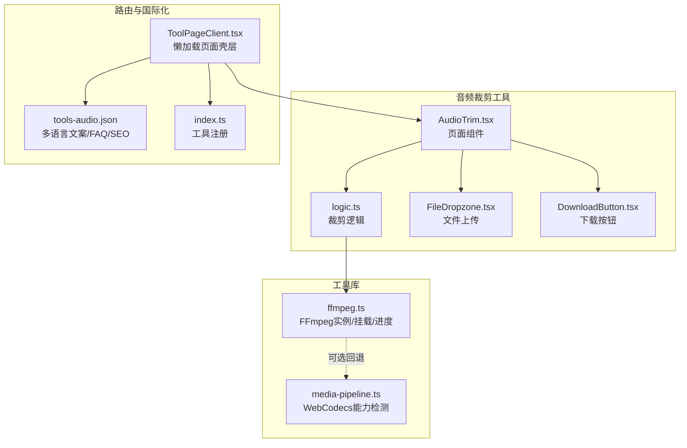
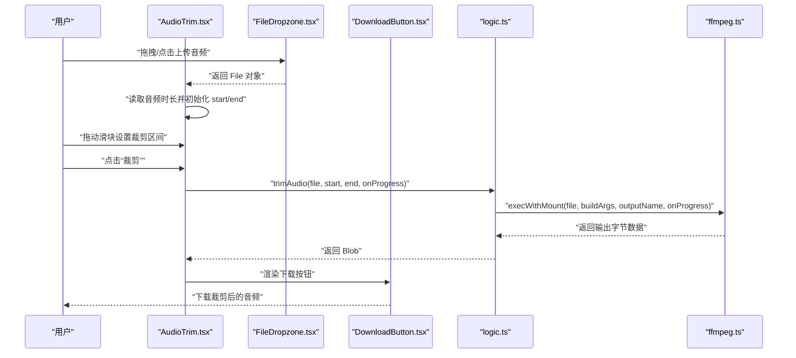
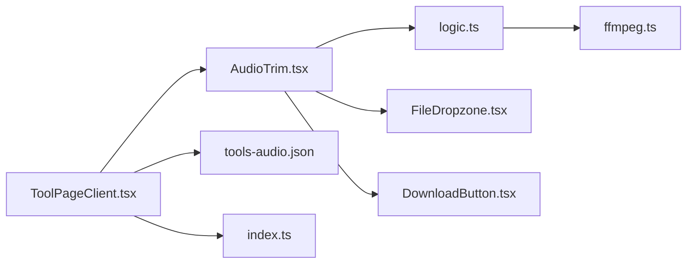

# 音频片段裁剪

<cite>
**本文引用的文件**
- [AudioTrim.tsx](file://src/tools/audio/trim/AudioTrim.tsx)
- [logic.ts](file://src/tools/audio/trim/logic.ts)
- [ffmpeg.ts](file://src/lib/ffmpeg.ts)
- [media-pipeline.ts](file://src/lib/media-pipeline.ts)
- [FileDropzone.tsx](file://src/components/shared/FileDropzone.tsx)
- [DownloadButton.tsx](file://src/components/shared/DownloadButton.tsx)
- [ToolPageClient.tsx](file://src/app/[locale]/tools/[category]/[slug]/ToolPageClient.tsx)
- [tools-audio.json](file://messages/en/tools-audio.json)
- [index.ts](file://src/tools/audio/trim/index.ts)
</cite>

## 目录
1. [简介](#简介)
2. [项目结构](#项目结构)
3. [核心组件](#核心组件)
4. [架构总览](#架构总览)
5. [详细组件分析](#详细组件分析)
6. [依赖关系分析](#依赖关系分析)
7. [性能考量](#性能考量)
8. [故障排查指南](#故障排查指南)
9. [结论](#结论)
10. [附录](#附录)

## 简介
本文件面向“音频片段裁剪”工具，系统性阐述其技术实现与使用方法。该工具允许用户在浏览器中对音频文件进行无损裁剪：通过时间轴选择起始与结束点，生成目标片段并支持预览与下载。核心技术包括基于 FFmpeg.wasm 的流复制（stream copy）以保证音质不变、WORKERFS 挂载避免内存拷贝、进度回调与错误处理、以及 React 客户端交互界面。

## 项目结构
音频裁剪工具位于工具目录的音频子模块下，采用“页面组件 + 业务逻辑 + 工具库”的分层组织方式：
- 页面组件负责用户交互与状态管理
- 业务逻辑封装 FFmpeg 命令构建与执行
- 工具库提供 FFmpeg 实例化、挂载与进度监听能力
- 共享组件提供文件拖拽上传与下载按钮
- 国际化资源提供文案与 SEO 内容
- 路由侧懒加载与页面壳层承载工具页面

图表来源
- [AudioTrim.tsx:1-107](file://src/tools/audio/trim/AudioTrim.tsx#L1-L107)
- [logic.ts:1-40](file://src/tools/audio/trim/logic.ts#L1-L40)
- [ffmpeg.ts:1-144](file://src/lib/ffmpeg.ts#L1-L144)
- [media-pipeline.ts:1-105](file://src/lib/media-pipeline.ts#L1-L105)
- [FileDropzone.tsx:1-144](file://src/components/shared/FileDropzone.tsx#L1-L144)
- [DownloadButton.tsx:1-54](file://src/components/shared/DownloadButton.tsx#L1-L54)
- [ToolPageClient.tsx:1-59](file://src/app/[locale]/tools/[category]/[slug]/ToolPageClient.tsx#L1-L59)
- [tools-audio.json:1-191](file://messages/en/tools-audio.json#L1-L191)
- [index.ts:1-37](file://src/tools/audio/trim/index.ts#L1-L37)

章节来源
- [AudioTrim.tsx:1-107](file://src/tools/audio/trim/AudioTrim.tsx#L1-L107)
- [logic.ts:1-40](file://src/tools/audio/trim/logic.ts#L1-L40)
- [ffmpeg.ts:1-144](file://src/lib/ffmpeg.ts#L1-L144)
- [media-pipeline.ts:1-105](file://src/lib/media-pipeline.ts#L1-L105)
- [FileDropzone.tsx:1-144](file://src/components/shared/FileDropzone.tsx#L1-L144)
- [DownloadButton.tsx:1-54](file://src/components/shared/DownloadButton.tsx#L1-L54)
- [ToolPageClient.tsx:1-59](file://src/app/[locale]/tools/[category]/[slug]/ToolPageClient.tsx#L1-L59)
- [tools-audio.json:1-191](file://messages/en/tools-audio.json#L1-L191)
- [index.ts:1-37](file://src/tools/audio/trim/index.ts#L1-L37)

## 核心组件
- 页面组件（AudioTrim）
  - 负责文件上传、时长读取、起止时间滑块、预览播放、进度显示、错误提示与结果下载
  - 使用对象 URL 播放本地音频，确保浏览器兼容性
- 业务逻辑（trimAudio）
  - 构建 FFmpeg 参数：-ss 起始时间、-t 持续时长、-c copy 流复制
  - 通过挂载输入文件到虚拟文件系统执行命令，输出到内存文件系统后读取
- 工具库（ffmpeg.ts）
  - 单例化 FFmpeg 实例，按队列串行执行，避免并发冲突
  - 支持 WORKERFS 挂载与进度事件监听
- 共享组件
  - 文件拖拽上传：限制格式、大小与多文件
  - 下载按钮：生成临时 URL 并触发下载，支持品牌化文件名
- 路由与注册
  - 懒加载页面壳层承载工具组件
  - 工具注册定义分类、图标、相关工具与 FAQ 键值

章节来源
- [AudioTrim.tsx:12-107](file://src/tools/audio/trim/AudioTrim.tsx#L12-L107)
- [logic.ts:3-20](file://src/tools/audio/trim/logic.ts#L3-L20)
- [ffmpeg.ts:99-144](file://src/lib/ffmpeg.ts#L99-L144)
- [FileDropzone.tsx:42-144](file://src/components/shared/FileDropzone.tsx#L42-L144)
- [DownloadButton.tsx:18-54](file://src/components/shared/DownloadButton.tsx#L18-L54)
- [ToolPageClient.tsx:29-59](file://src/app/[locale]/tools/[category]/[slug]/ToolPageClient.tsx#L29-L59)
- [index.ts:3-37](file://src/tools/audio/trim/index.ts#L3-L37)

## 架构总览
音频裁剪的端到端流程如下：
- 用户上传音频文件
- 页面读取音频时长并初始化起止时间
- 用户拖动滑块设置裁剪区间
- 点击“裁剪”触发业务逻辑
- 业务逻辑调用工具库执行 FFmpeg 命令（流复制）
- 进度回调更新 UI，完成后生成 Blob 并提供下载

图表来源
- [AudioTrim.tsx:33-62](file://src/tools/audio/trim/AudioTrim.tsx#L33-L62)
- [logic.ts:3-20](file://src/tools/audio/trim/logic.ts#L3-L20)
- [ffmpeg.ts:99-144](file://src/lib/ffmpeg.ts#L99-L144)
- [FileDropzone.tsx:55-76](file://src/components/shared/FileDropzone.tsx#L55-L76)
- [DownloadButton.tsx:27-45](file://src/components/shared/DownloadButton.tsx#L27-L45)

## 详细组件分析

### 页面组件：AudioTrim
- 功能要点
  - 文件上传：接受音频类型，清空上次结果与时间范围
  - 音频元数据：加载成功后读取时长并初始化结束时间为总时长
  - 时间轴：双滑块分别控制起始与结束，步进 0.1 秒，约束起始终小于等于结束-0.1
  - 预览播放：使用对象 URL 播放当前文件，支持用户确认裁剪区间
  - 裁剪执行：调用业务逻辑，传入进度回调，捕获异常并展示错误
  - 结果下载：生成 Blob 后提供下载按钮
- 关键交互
  - 仅在支持 SharedArrayBuffer 的现代浏览器运行
  - 多语言文案来自国际化资源

章节来源
- [AudioTrim.tsx:12-107](file://src/tools/audio/trim/AudioTrim.tsx#L12-L107)
- [tools-audio.json:4-27](file://messages/en/tools-audio.json#L4-L27)

### 业务逻辑：trimAudio
- 技术实现
  - 基于 FFmpeg 流复制（-c copy），不重新编码，保证音质与速度
  - 计算输出文件扩展名与输出文件名
  - 通过工具库的挂载函数执行命令，返回内存中的输出数据
- 时间格式化
  - 将秒数格式化为时:分:秒.毫秒字符串用于 FFmpeg 参数
  - 将秒数格式化为分:秒用于 UI 显示

章节来源
- [logic.ts:3-20](file://src/tools/audio/trim/logic.ts#L3-L20)
- [logic.ts:22-34](file://src/tools/audio/trim/logic.ts#L22-L34)

### 工具库：ffmpeg.ts
- FFmpeg 实例化
  - 按需加载核心脚本与 WASM，失败时终止实例并抛错
  - 单例模式，避免重复初始化
- 操作队列
  - 串行化所有 FFmpeg 操作，防止并发挂载点冲突
- WORKERFS 挂载
  - 将 File 对象直接挂载到虚拟文件系统，避免内存拷贝
  - 输出文件写入 MEMFS，读取后立即删除以降低峰值内存
- 进度监听
  - 注册/注销 progress 事件，将事件转换为 0-100 的整数进度

章节来源
- [ffmpeg.ts:10-39](file://src/lib/ffmpeg.ts#L10-L39)
- [ffmpeg.ts:75-82](file://src/lib/ffmpeg.ts#L75-L82)
- [ffmpeg.ts:99-144](file://src/lib/ffmpeg.ts#L99-L144)

### 共享组件：FileDropzone 与 DownloadButton
- FileDropzone
  - 支持 accept 与 maxSize 限制，过滤无效文件
  - 提供拖拽高亮与隐私提示，统计上传事件
- DownloadButton
  - 生成对象 URL 或直接使用字符串数据
  - 触发下载并清理临时 URL，统计下载事件

章节来源
- [FileDropzone.tsx:42-144](file://src/components/shared/FileDropzone.tsx#L42-L144)
- [DownloadButton.tsx:18-54](file://src/components/shared/DownloadButton.tsx#L18-L54)

### 路由与注册：ToolPageClient 与工具定义
- ToolPageClient
  - 懒加载工具组件，使用缓存避免重复加载
  - 包裹页面壳层、面包屑、相关工具与 FAQ
- 工具定义
  - 指定分类、图标、是否置顶、组件异步加载、FAQ 键值与关联工具

章节来源
- [ToolPageClient.tsx:29-59](file://src/app/[locale]/tools/[category]/[slug]/ToolPageClient.tsx#L29-L59)
- [index.ts:3-37](file://src/tools/audio/trim/index.ts#L3-L37)

## 依赖关系分析
- 组件耦合
  - AudioTrim 依赖 logic.ts 与 ffmpeg.ts；logic.ts 仅依赖 ffmpeg.ts
  - 共享组件独立，可复用到其他工具
- 外部依赖
  - FFmpeg.wasm 核心与 WASM 文件通过 CDN 加载
  - WORKERFS 与进度事件监听由 @ffmpeg/ffmpeg 提供
- 可能的循环依赖
  - 当前结构清晰，未见循环导入

图表来源
- [AudioTrim.tsx:1-107](file://src/tools/audio/trim/AudioTrim.tsx#L1-L107)
- [logic.ts:1-40](file://src/tools/audio/trim/logic.ts#L1-L40)
- [ffmpeg.ts:1-144](file://src/lib/ffmpeg.ts#L1-L144)
- [FileDropzone.tsx:1-144](file://src/components/shared/FileDropzone.tsx#L1-L144)
- [DownloadButton.tsx:1-54](file://src/components/shared/DownloadButton.tsx#L1-L54)
- [ToolPageClient.tsx:1-59](file://src/app/[locale]/tools/[category]/[slug]/ToolPageClient.tsx#L1-L59)
- [tools-audio.json:1-191](file://messages/en/tools-audio.json#L1-L191)
- [index.ts:1-37](file://src/tools/audio/trim/index.ts#L1-L37)

## 性能考量
- 流复制优先
  - 使用 -c copy 执行流复制，避免解码/编码开销，显著提升速度并保持音质
- 内存优化
  - WORKERFS 挂载直接从磁盘按需读取，避免全量内存拷贝
  - 输出读取后立即删除 MEMFS 文件，降低峰值内存占用
- 并发控制
  - 通过 Promise 队列串行化 FFmpeg 操作，避免挂载点冲突与竞态
- 进度反馈
  - 基于 FFmpeg 进度事件映射到百分比，提供即时反馈
- 浏览器兼容
  - 仅在支持 SharedArrayBuffer 的现代浏览器运行，HTTPS 环境更佳

章节来源
- [logic.ts:12-18](file://src/tools/audio/trim/logic.ts#L12-L18)
- [ffmpeg.ts:99-144](file://src/lib/ffmpeg.ts#L99-L144)
- [ffmpeg.ts:75-82](file://src/lib/ffmpeg.ts#L75-L82)
- [AudioTrim.tsx:25-31](file://src/tools/audio/trim/AudioTrim.tsx#L25-L31)

## 故障排查指南
- 工具不可用（提示需要 SharedArrayBuffer）
  - 确认使用现代浏览器且启用 HTTPS
  - 检查浏览器安全策略与跨域设置
- 裁剪失败或报错
  - 查看错误提示，确认文件格式受支持
  - 减小文件体积或关闭其他内存占用较大的标签页
- 进度不更新
  - 确认已正确传入进度回调
  - 检查 FFmpeg 进度事件是否被注册/注销
- 预览无法播放
  - 确认对象 URL 正确生成且未被 revoke
  - 检查音频格式是否被浏览器支持

章节来源
- [AudioTrim.tsx:25-31](file://src/tools/audio/trim/AudioTrim.tsx#L25-L31)
- [ffmpeg.ts:41-58](file://src/lib/ffmpeg.ts#L41-L58)
- [tools-audio.json:15-26](file://messages/en/tools-audio.json#L15-L26)

## 结论
音频片段裁剪工具通过“页面组件 + 业务逻辑 + 工具库”的清晰分层，结合 FFmpeg.wasm 的流复制与 WORKERFS 挂载，在浏览器内实现了高性能、无损的音频裁剪体验。配合进度反馈与下载集成，用户可在本地完成从导入、裁剪到导出的完整流程，无需上传文件至服务器，保障隐私与离线可用性。

## 附录

### 使用示例（步骤说明）
- 导入音频文件
  - 在页面中拖拽或点击上传音频文件
- 设置时间轴
  - 使用起始与结束滑块设定裁剪区间，步进为 0.1 秒
- 预览播放
  - 点击播放按钮预览选定片段，确认裁剪范围
- 执行裁剪
  - 点击“裁剪”按钮，等待进度条完成
- 导出结果
  - 点击下载按钮保存裁剪后的音频文件

章节来源
- [AudioTrim.tsx:64-107](file://src/tools/audio/trim/AudioTrim.tsx#L64-L107)
- [tools-audio.json:33-36](file://messages/en/tools-audio.json#L33-L36)

### 技术要点与最佳实践
- 精度控制
  - 使用 0.1 秒步进，满足大多数场景的时间精度需求
  - UI 展示分钟:秒格式，便于快速定位
- 无损裁剪
  - 采用流复制模式，避免重编码导致的质量损失
- 性能优化
  - 串行化 FFmpeg 操作，减少并发风险
  - 挂载输入文件，避免内存拷贝
- 用户体验
  - 提供进度反馈与错误提示
  - 支持隐私提示与离线工作

章节来源
- [logic.ts:12-18](file://src/tools/audio/trim/logic.ts#L12-L18)
- [ffmpeg.ts:99-144](file://src/lib/ffmpeg.ts#L99-L144)
- [tools-audio.json:19-20](file://messages/en/tools-audio.json#L19-L20)