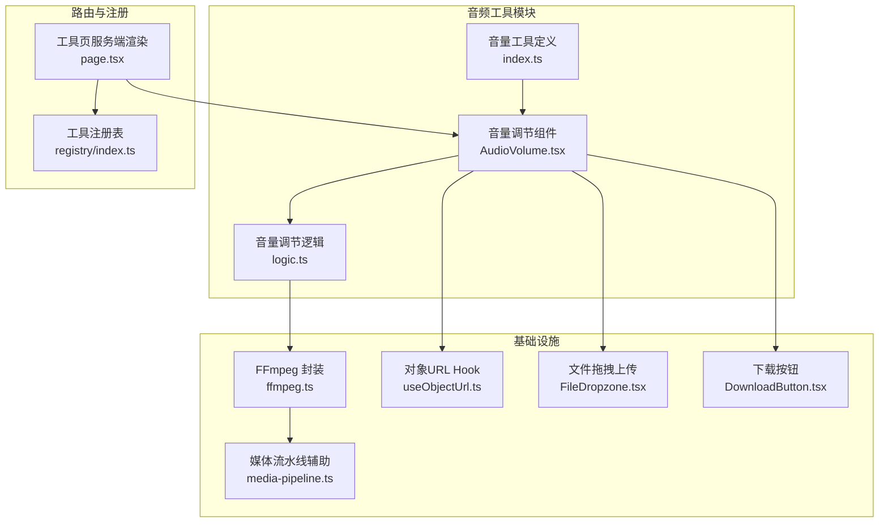
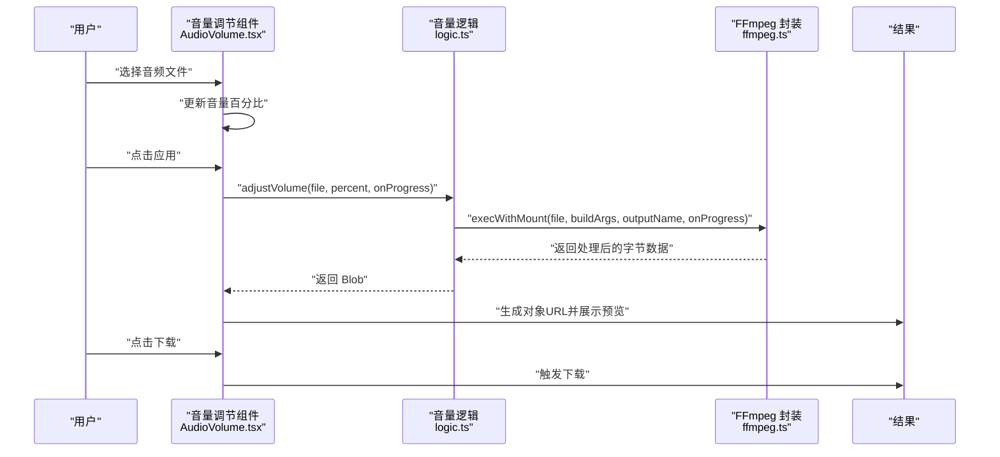
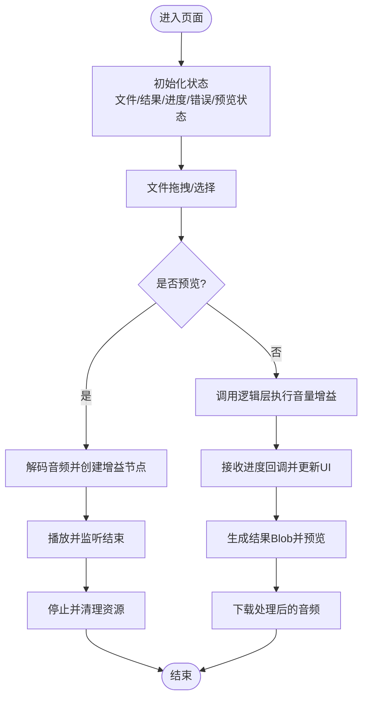
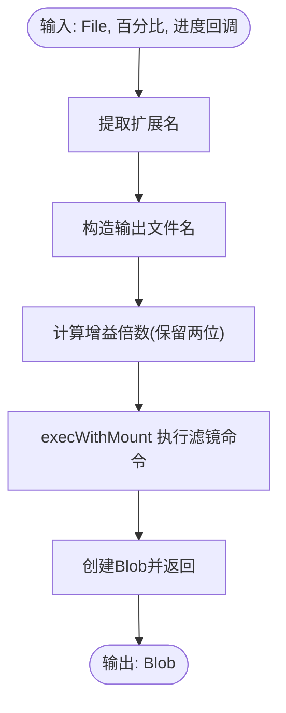
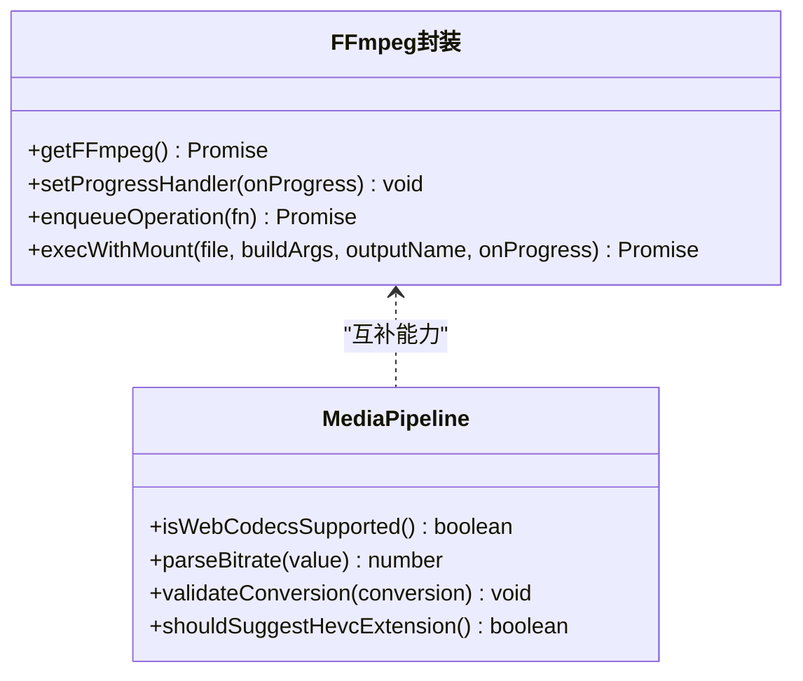
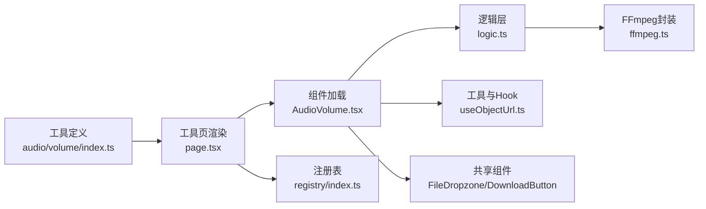

# 音频音量调节

<cite>
**本文引用的文件**
- [AudioVolume.tsx](file://src/tools/audio/volume/AudioVolume.tsx)
- [logic.ts](file://src/tools/audio/volume/logic.ts)
- [ffmpeg.ts](file://src/lib/ffmpeg.ts)
- [media-pipeline.ts](file://src/lib/media-pipeline.ts)
- [useObjectUrl.ts](file://src/lib/hooks/useObjectUrl.ts)
- [FileDropzone.tsx](file://src/components/shared/FileDropzone.tsx)
- [DownloadButton.tsx](file://src/components/shared/DownloadButton.tsx)
- [tools-audio.json](file://messages/zh-Hans/tools-audio.json)
- [index.ts](file://src/tools/audio/volume/index.ts)
- [index.ts](file://src/lib/registry/index.ts)
- [page.tsx](file://src/app/[locale]/tools/[category]/[slug]/page.tsx)
- [README.md](file://README.md)
</cite>

## 目录
1. [简介](#简介)
2. [项目结构](#项目结构)
3. [核心组件](#核心组件)
4. [架构总览](#架构总览)
5. [详细组件分析](#详细组件分析)
6. [依赖关系分析](#依赖关系分析)
7. [性能考量](#性能考量)
8. [故障排查指南](#故障排查指南)
9. [结论](#结论)
10. [附录](#附录)

## 简介
本文件面向“音频音量调节”工具，系统阐述其技术实现原理与使用方法。该工具允许用户在浏览器内调整音频文件的音量，支持实时试听与批量处理，最终导出调整后的音频。核心技术基于 FFmpeg.wasm 的音频滤镜处理，前端通过 Web Audio API 实现预览，确保数据不离开本地设备。

## 项目结构
音频音量调节工具位于音频工具模块下，采用“定义 + 组件 + 逻辑”的分层组织方式：
- 工具定义：在注册表中声明工具元信息与 SEO 结构化数据
- 客户端组件：负责 UI、状态管理、实时预览与导出
- 业务逻辑：封装 FFmpeg 调用，执行音量增益处理
- 基础设施：FFmpeg 单例加载、进度回调、对象 URL 生命周期管理

图表来源
- [index.ts:1-23](file://src/tools/audio/volume/index.ts#L1-L23)
- [AudioVolume.tsx:1-202](file://src/tools/audio/volume/AudioVolume.tsx#L1-L202)
- [logic.ts:1-24](file://src/tools/audio/volume/logic.ts#L1-L24)
- [ffmpeg.ts:1-144](file://src/lib/ffmpeg.ts#L1-L144)
- [media-pipeline.ts:1-105](file://src/lib/media-pipeline.ts#L1-L105)
- [useObjectUrl.ts:1-21](file://src/lib/hooks/useObjectUrl.ts#L1-L21)
- [FileDropzone.tsx:1-144](file://src/components/shared/FileDropzone.tsx#L1-L144)
- [DownloadButton.tsx:1-54](file://src/components/shared/DownloadButton.tsx#L1-L54)
- [page.tsx:1-109](file://src/app/[locale]/tools/[category]/[slug]/page.tsx#L1-L109)
- [index.ts:1-164](file://src/lib/registry/index.ts#L1-L164)

章节来源
- [README.md:55-78](file://README.md#L55-L78)
- [page.tsx:33-108](file://src/app/[locale]/tools/[category]/[slug]/page.tsx#L33-L108)
- [index.ts:95-99](file://src/lib/registry/index.ts#L95-L99)

## 核心组件
- 音量调节组件：负责文件上传、音量滑块、实时预览、处理流程与结果导出
- 音量调节逻辑：封装 FFmpeg 音频滤镜调用，返回处理后的二进制数据
- FFmpeg 封装：提供单例加载、进度回调、挂载输入文件、序列化执行队列
- 对象 URL Hook：安全地创建与回收 Blob/文件的内存 URL
- 文件拖拽上传与下载按钮：提供用户交互与隐私提示

章节来源
- [AudioVolume.tsx:15-202](file://src/tools/audio/volume/AudioVolume.tsx#L15-L202)
- [logic.ts:3-18](file://src/tools/audio/volume/logic.ts#L3-L18)
- [ffmpeg.ts:10-39](file://src/lib/ffmpeg.ts#L10-L39)
- [useObjectUrl.ts:7-20](file://src/lib/hooks/useObjectUrl.ts#L7-L20)
- [FileDropzone.tsx:42-143](file://src/components/shared/FileDropzone.tsx#L42-L143)
- [DownloadButton.tsx:18-53](file://src/components/shared/DownloadButton.tsx#L18-L53)

## 架构总览
音频音量调节的端到端流程如下：
- 用户上传音频文件
- 组件根据滑块值计算倍数，调用 FFmpeg 音频滤镜执行音量增益
- 处理进度通过回调更新 UI
- 成功后生成结果 Blob，提供预览与下载

图表来源
- [AudioVolume.tsx:113-132](file://src/tools/audio/volume/AudioVolume.tsx#L113-L132)
- [logic.ts:3-18](file://src/tools/audio/volume/logic.ts#L3-L18)
- [ffmpeg.ts:99-143](file://src/lib/ffmpeg.ts#L99-L143)

## 详细组件分析

### 音量调节组件（AudioVolume）
职责与关键点：
- 文件管理：接收单文件，清空上一次结果与错误
- 实时预览：使用 Web Audio API 创建上下文、解码音频、连接增益节点并播放；支持停止与重置
- 参数控制：音量滑块映射到 0%-300%，动态更新增益节点值
- 处理流程：调用逻辑层执行音量增益，显示进度百分比，记录处理耗时与错误
- 结果导出：生成对象 URL 供预览，下载按钮触发浏览器下载

图表来源
- [AudioVolume.tsx:55-132](file://src/tools/audio/volume/AudioVolume.tsx#L55-L132)

章节来源
- [AudioVolume.tsx:15-202](file://src/tools/audio/volume/AudioVolume.tsx#L15-L202)

### 音量调节逻辑（logic）
职责与关键点：
- 输入解析：从文件名提取扩展名，构造输出文件名
- 倍数计算：将百分比转换为两位小数的倍数字符串
- FFmpeg 调用：通过挂载输入文件的方式执行音频滤镜，避免内存拷贝
- 输出封装：以原文件类型作为结果类型创建 Blob 返回

图表来源
- [logic.ts:3-18](file://src/tools/audio/volume/logic.ts#L3-L18)
- [ffmpeg.ts:99-143](file://src/lib/ffmpeg.ts#L99-L143)

章节来源
- [logic.ts:1-24](file://src/tools/audio/volume/logic.ts#L1-L24)

### FFmpeg 封装（ffmpeg）
职责与关键点：
- 单例加载：延迟加载 FFmpeg 核心，避免重复初始化
- 进度回调：统一设置/移除进度事件，将进度归一化到 0-100
- 挂载执行：通过 WORKERFS 挂载文件，避免全量内存拷贝；序列化执行队列防止并发冲突
- 资源清理：读取输出后立即删除内存文件系统中的临时文件

图表来源
- [ffmpeg.ts:10-39](file://src/lib/ffmpeg.ts#L10-L39)
- [ffmpeg.ts:41-58](file://src/lib/ffmpeg.ts#L41-L58)
- [ffmpeg.ts:75-82](file://src/lib/ffmpeg.ts#L75-L82)
- [ffmpeg.ts:99-143](file://src/lib/ffmpeg.ts#L99-L143)
- [media-pipeline.ts:7-14](file://src/lib/media-pipeline.ts#L7-L14)
- [media-pipeline.ts:59-91](file://src/lib/media-pipeline.ts#L59-L91)

章节来源
- [ffmpeg.ts:1-144](file://src/lib/ffmpeg.ts#L1-L144)
- [media-pipeline.ts:1-105](file://src/lib/media-pipeline.ts#L1-L105)

### 对象 URL Hook（useObjectUrl）
职责与关键点：
- 自动生命周期管理：创建、缓存并在变更或卸载时回收
- 与组件配合：为音频预览与下载提供安全的内存 URL

章节来源
- [useObjectUrl.ts:1-21](file://src/lib/hooks/useObjectUrl.ts#L1-L21)

### 文件拖拽上传与下载按钮
职责与关键点：
- FileDropzone：支持拖拽/点击选择、格式与大小提示、隐私提示
- DownloadButton：统一下载行为，自动处理 Blob URL 与回收

章节来源
- [FileDropzone.tsx:42-143](file://src/components/shared/FileDropzone.tsx#L42-L143)
- [DownloadButton.tsx:18-53](file://src/components/shared/DownloadButton.tsx#L18-L53)

## 依赖关系分析
- 工具注册与页面渲染：工具定义在注册表中声明，页面服务端渲染时按语言与路径参数加载对应翻译与组件
- 组件耦合：音量组件依赖逻辑层与基础设施；逻辑层仅依赖 FFmpeg 封装
- 外部依赖：FFmpeg.wasm 核心通过 CDN 预取，保证首次使用性能

图表来源
- [index.ts:1-23](file://src/tools/audio/volume/index.ts#L1-L23)
- [page.tsx:33-108](file://src/app/[locale]/tools/[category]/[slug]/page.tsx#L33-L108)
- [index.ts:95-99](file://src/lib/registry/index.ts#L95-L99)
- [AudioVolume.tsx:1-13](file://src/tools/audio/volume/AudioVolume.tsx#L1-L13)
- [logic.ts:1-1](file://src/tools/audio/volume/logic.ts#L1-L1)
- [ffmpeg.ts:96-98](file://src/lib/ffmpeg.ts#L96-L98)

章节来源
- [index.ts:95-99](file://src/lib/registry/index.ts#L95-L99)
- [page.tsx:94-99](file://src/app/[locale]/tools/[category]/[slug]/page.tsx#L94-L99)

## 性能考量
- 流水线执行：通过序列化队列串行化 FFmpeg 操作，避免并发冲突与资源竞争
- 内存优化：WORKERFS 挂载避免将 File 全量复制到内存；处理完成后立即删除 MEMFS 中的输出文件
- 进度反馈：将 FFmpeg 进度事件映射到 0-100 的 UI 百分比，提升感知性能
- 预览优化：实时预览使用浏览器解码与播放，避免额外编码开销
- WebCodecs 辅助：媒体流水线提供硬件加速与回退策略，为未来扩展提供基础

章节来源
- [ffmpeg.ts:7-8](file://src/lib/ffmpeg.ts#L7-L8)
- [ffmpeg.ts:99-143](file://src/lib/ffmpeg.ts#L99-L143)
- [media-pipeline.ts:1-105](file://src/lib/media-pipeline.ts#L1-L105)

## 故障排查指南
- 不支持 SharedArrayBuffer
  - 现象：界面提示不支持
  - 原因：浏览器安全策略限制
  - 处理：使用支持 HTTPS 且启用 SharedArrayBuffer 的现代浏览器
- 预览失败
  - 现象：点击试听报错
  - 排查：确认文件可被浏览器解码；检查音频上下文状态与异常捕获
- 处理失败
  - 现象：应用按钮报错
  - 排查：查看错误消息；确认 FFmpeg 核心已加载；检查输入文件格式与大小
- 下载失败
  - 现象：无法下载结果
  - 排查：确认结果 Blob 存在；检查对象 URL 是否有效；尝试刷新页面

章节来源
- [AudioVolume.tsx:134-142](file://src/tools/audio/volume/AudioVolume.tsx#L134-L142)
- [AudioVolume.tsx:99-103](file://src/tools/audio/volume/AudioVolume.tsx#L99-L103)
- [AudioVolume.tsx:124-128](file://src/tools/audio/volume/AudioVolume.tsx#L124-L128)

## 结论
音频音量调节工具以“本地处理、隐私优先”为核心，结合 FFmpeg.wasm 的高效音频滤镜与浏览器 Web Audio API 的实时预览，提供了直观易用的音量调节体验。通过对象 URL 生命周期管理与进度回调机制，兼顾了性能与用户体验。未来可在 WebCodecs 基础上进一步探索硬件加速与更多动态处理能力。

## 附录

### 使用示例与操作步骤
- 导入音频文件：通过拖拽或点击选择支持的音频格式
- 设置音量参数：使用滑块在 0%-300% 范围内调整
- 实时预览：点击“试听”，在浏览器中播放当前音量效果
- 批量调节：重复上述步骤，逐个文件应用不同音量
- 导出配置：处理完成后预览结果并下载

章节来源
- [tools-audio.json:141-186](file://messages/zh-Hans/tools-audio.json#L141-L186)
- [AudioVolume.tsx:156-171](file://src/tools/audio/volume/AudioVolume.tsx#L156-L171)
- [AudioVolume.tsx:180-194](file://src/tools/audio/volume/AudioVolume.tsx#L180-L194)

### 专业术语解释
- 音量增益（Volume Gain）：以倍数形式对音频幅度进行放大或缩小
- 响度（Loudness）：人耳感知的相对强度，常以 LUFS 衡量
- 动态范围（Dynamic Range）：音频最强与最弱部分的幅度差
- 音量曲线（Volume Curve）：非线性增益曲线，用于改善听感与避免削波
- 失真（Distortion）：过度放大导致的波形削波与谐波失真
- 多声道平衡（Stereo/LFE Balance）：左右声道与低音炮的相对幅度关系

### 算法选择与实现要点
- 音量增益计算：将百分比转换为浮点倍数，作为 FFmpeg 音频滤镜参数
- 动态处理：实时预览使用 Web Audio API 的增益节点；批量处理使用 FFmpeg 音频滤镜
- 失真避免：建议在 200% 以内使用；超过阈值时注意削波风险
- 质量保护：默认保持音频编码不变，避免二次编码带来的质量损失

章节来源
- [logic.ts:10-16](file://src/tools/audio/volume/logic.ts#L10-L16)
- [tools-audio.json:156-157](file://messages/zh-Hans/tools-audio.json#L156-L157)