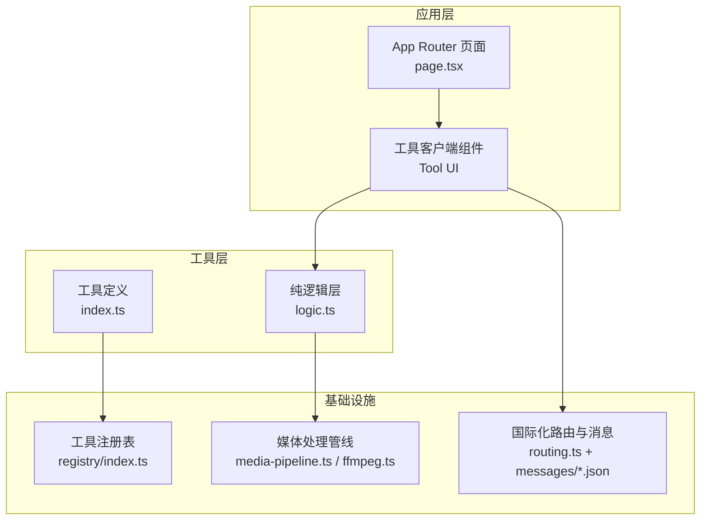
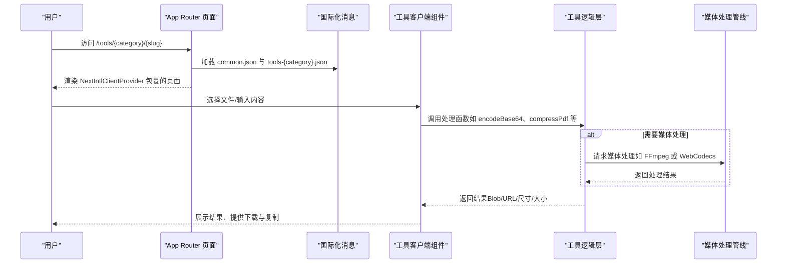
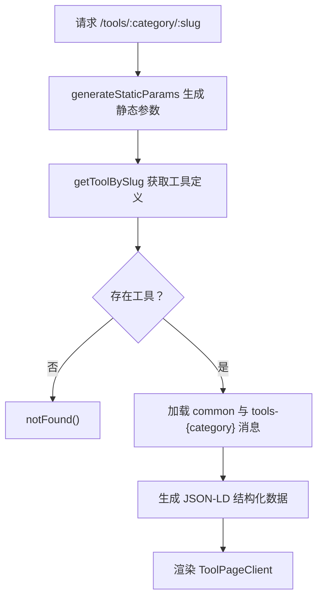
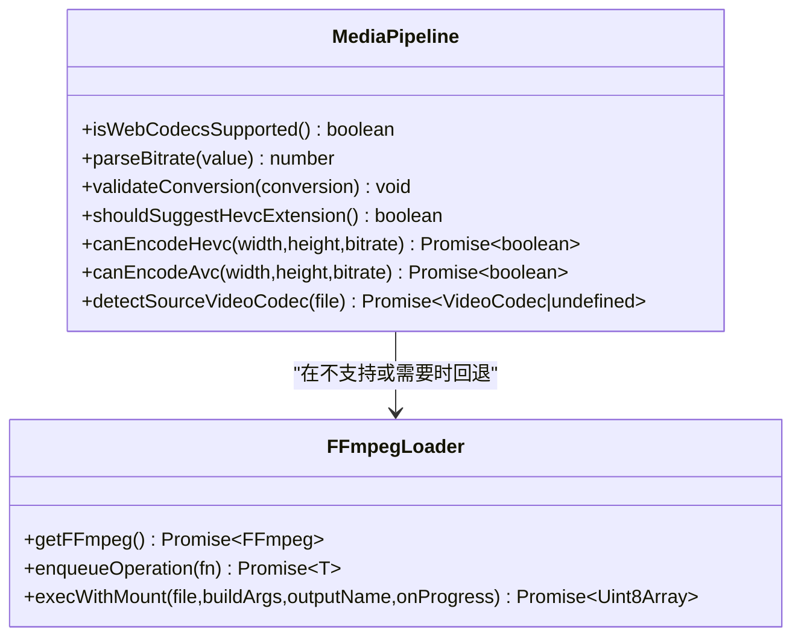
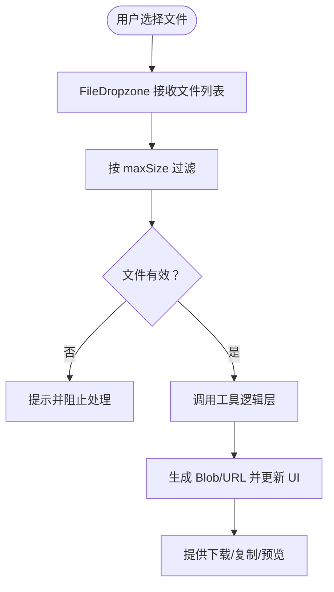
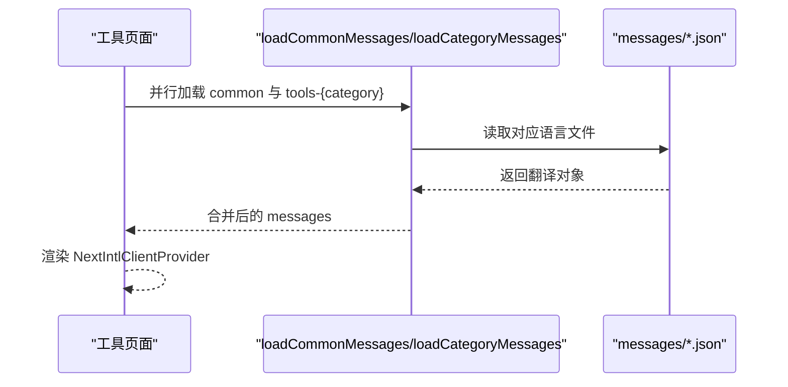
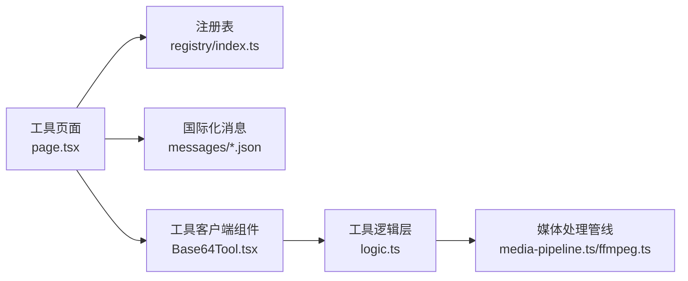

# 工具开发指南

<cite>
**本文档引用的文件**
- [README.md](file://README.md)
- [package.json](file://package.json)
- [src/app/[locale]/tools/[category]/[slug]/page.tsx](file://src/app/[locale]/tools/[category]/[slug]/page.tsx)
- [src/lib/registry/index.ts](file://src/lib/registry/index.ts)
- [src/lib/media-pipeline.ts](file://src/lib/media-pipeline.ts)
- [src/lib/ffmpeg.ts](file://src/lib/ffmpeg.ts)
- [src/components/shared/FileDropzone.tsx](file://src/components/shared/FileDropzone.tsx)
- [src/components/shared/ProcessingProgress.tsx](file://src/components/shared/ProcessingProgress.tsx)
- [src/tools/developer/base64/Base64Tool.tsx](file://src/tools/developer/base64/Base64Tool.tsx)
- [src/tools/developer/base64/logic.ts](file://src/tools/developer/base64/logic.ts)
- [src/tools/image/format-converter/logic.ts](file://src/tools/image/format-converter/logic.ts)
- [src/tools/pdf/compress/logic.ts](file://src/tools/pdf/compress/logic.ts)
- [src/i18n/routing.ts](file://src/i18n/routing.ts)
- [messages/en/common.json](file://messages/en/common.json)
</cite>

## 目录
1. [简介](#简介)
2. [项目结构](#项目结构)
3. [核心组件](#核心组件)
4. [架构总览](#架构总览)
5. [详细组件分析](#详细组件分析)
6. [依赖关系分析](#依赖关系分析)
7. [性能考虑](#性能考虑)
8. [故障排除指南](#故障排除指南)
9. [结论](#结论)
10. [附录](#附录)

## 简介
本指南面向希望在浏览器端开发隐私优先工具的工程师与产品团队。项目采用全前端架构，所有媒体处理在本地完成，不涉及任何上传或服务器参与。工具覆盖图片、视频、音频、PDF 和开发者工具五大类别，支持 21 种语言，基于 Next.js App Router、TypeScript、Tailwind CSS 以及 FFmpeg.wasm、pdf-lib、pdfjs-dist、browser-image-compression 等技术栈。

## 项目结构
项目采用“按功能域分层 + 按类型分包”的组织方式：
- src/app：Next.js App Router 页面与路由参数生成
- src/components：布局、共享组件与基础 UI 组件
- src/tools：各工具的实现，按类别划分，每个工具包含 index.ts（工具元数据）、{Name}.tsx（客户端 UI）、logic.ts（纯处理逻辑）
- src/lib：通用库，如媒体管道、FFmpeg 加载器、国际化工具、SEO 元数据生成等
- messages：多语言翻译文件，按语言与工具分类组织

图表来源
- [src/app/[locale]/tools/[category]/[slug]/page.tsx](file://src/app/[locale]/tools/[category]/[slug]/page.tsx#L1-L109)
- [src/lib/registry/index.ts:1-164](file://src/lib/registry/index.ts#L1-L164)
- [src/lib/media-pipeline.ts:1-175](file://src/lib/media-pipeline.ts#L1-L175)
- [src/lib/ffmpeg.ts:1-144](file://src/lib/ffmpeg.ts#L1-L144)
- [src/i18n/routing.ts:1-18](file://src/i18n/routing.ts#L1-L18)

章节来源
- [README.md:55-78](file://README.md#L55-L78)
- [package.json:11-32](file://package.json#L11-L32)

## 核心组件
- 工具注册表：集中管理所有工具的元数据与分类，提供查询与筛选能力
- 媒体处理管线：统一抽象图片、视频、音频的处理流程，支持 WebCodecs 与 FFmpeg.wasm 双引擎
- FFmpeg 加载器：懒加载与单实例管理，序列化执行避免并发冲突
- 国际化系统：基于 next-intl，支持 21 种语言，页面级静态生成与运行时消息合并
- 共享组件：文件拖拽上传、进度条、下载按钮等复用 UI

章节来源
- [src/lib/registry/index.ts:66-133](file://src/lib/registry/index.ts#L66-L133)
- [src/lib/media-pipeline.ts:1-175](file://src/lib/media-pipeline.ts#L1-L175)
- [src/lib/ffmpeg.ts:10-82](file://src/lib/ffmpeg.ts#L10-L82)
- [src/app/[locale]/tools/[category]/[slug]/page.tsx:46-L54](file://src/app/[locale]/tools/[category]/[slug]/page.tsx#L46-L54)

## 架构总览
工具页面通过 App Router 动态路由加载，结合国际化与 SEO 元数据生成，最终渲染工具客户端组件。客户端组件调用工具逻辑层进行处理，必要时通过媒体管线与 FFmpeg 执行底层操作。

图表来源
- [src/app/[locale]/tools/[category]/[slug]/page.tsx:33-L108](file://src/app/[locale]/tools/[category]/[slug]/page.tsx#L33-L108)
- [src/tools/developer/base64/Base64Tool.tsx:11-51](file://src/tools/developer/base64/Base64Tool.tsx#L11-L51)
- [src/tools/developer/base64/logic.ts:1-24](file://src/tools/developer/base64/logic.ts#L1-L24)
- [src/lib/ffmpeg.ts:99-143](file://src/lib/ffmpeg.ts#L99-L143)

## 详细组件分析

### 工具注册表与路由
- 注册表集中导入并登记所有工具，提供按分类、是否精选、按 slug 查询的能力
- App Router 页面根据路由参数动态加载工具定义、生成 SEO 元数据与结构化数据

图表来源
- [src/app/[locale]/tools/[category]/[slug]/page.tsx:13-L31](file://src/app/[locale]/tools/[category]/[slug]/page.tsx#L13-L31)
- [src/lib/registry/index.ts:139-147](file://src/lib/registry/index.ts#L139-L147)

章节来源
- [src/lib/registry/index.ts:135-164](file://src/lib/registry/index.ts#L135-L164)
- [src/app/[locale]/tools/[category]/[slug]/page.tsx:33-L108](file://src/app/[locale]/tools/[category]/[slug]/page.tsx#L33-L108)

### 媒体处理管线与 FFmpeg
- 媒体管线提供 WebCodecs 支持检测、编解码器能力探测、错误分类与回退策略
- FFmpeg 加载器负责懒加载、单实例、进度监听与任务队列，避免并发冲突与内存峰值

图表来源
- [src/lib/media-pipeline.ts:7-174](file://src/lib/media-pipeline.ts#L7-L174)
- [src/lib/ffmpeg.ts:10-143](file://src/lib/ffmpeg.ts#L10-L143)

章节来源
- [src/lib/media-pipeline.ts:1-175](file://src/lib/media-pipeline.ts#L1-L175)
- [src/lib/ffmpeg.ts:1-144](file://src/lib/ffmpeg.ts#L1-L144)

### 工具逻辑层设计模式
- 输入处理：统一接收 File 或字符串输入，进行格式校验与参数归一化
- 媒体处理流程：优先使用浏览器原生 API（Canvas、Web APIs），必要时通过 FFmpeg 或 WebCodecs 执行
- 输出生成：返回 Blob、URL、尺寸与文件名等信息，便于 UI 展示与下载

示例：Base64 编解码
- UI 组件负责交互与状态管理
- logic 层提供纯函数，确保可测试与可复用

章节来源
- [src/tools/developer/base64/Base64Tool.tsx:11-51](file://src/tools/developer/base64/Base64Tool.tsx#L11-L51)
- [src/tools/developer/base64/logic.ts:1-24](file://src/tools/developer/base64/logic.ts#L1-L24)

示例：图片格式转换
- logic 层封装 Canvas 绘制、AVIF 编码与 MIME 映射
- 返回包含尺寸、原始/转换后大小与文件名的结果对象

章节来源
- [src/tools/image/format-converter/logic.ts:75-158](file://src/tools/image/format-converter/logic.ts#L75-L158)

示例：PDF 压缩
- 使用 pdf-lib 与 pdfjs-dist 进行页面渲染与嵌入
- 提供进度回调，逐页处理并释放 GPU 内存

章节来源
- [src/tools/pdf/compress/logic.ts:12-66](file://src/tools/pdf/compress/logic.ts#L12-L66)

### UI 组件开发
- 文件拖拽上传：FileDropzone 支持 accept、maxSize、拖拽高亮与隐私提示
- 进度显示：ProcessingProgress 支持确定/不确定进度条与本地化文案
- 结果预览：通过 Blob URL 与下载按钮提供即时结果

图表来源
- [src/components/shared/FileDropzone.tsx:55-76](file://src/components/shared/FileDropzone.tsx#L55-L76)
- [src/components/shared/ProcessingProgress.tsx:14-46](file://src/components/shared/ProcessingProgress.tsx#L14-L46)

章节来源
- [src/components/shared/FileDropzone.tsx:1-144](file://src/components/shared/FileDropzone.tsx#L1-L144)
- [src/components/shared/ProcessingProgress.tsx:1-47](file://src/components/shared/ProcessingProgress.tsx#L1-L47)

### 国际化集成流程
- 路由配置：定义支持的语言列表与默认语言
- 页面级消息：在工具页面中加载 common.json 与 tools-{category}.json，并合并当前工具的翻译
- 键值管理：工具名称、描述、FAQ、操作文案等统一维护在 messages/{locale}/ 下

图表来源
- [src/app/[locale]/tools/[category]/[slug]/page.tsx:46-L54](file://src/app/[locale]/tools/[category]/[slug]/page.tsx#L46-L54)
- [src/i18n/routing.ts:3-12](file://src/i18n/routing.ts#L3-L12)
- [messages/en/common.json:243-497](file://messages/en/common.json#L243-L497)

章节来源
- [src/i18n/routing.ts:1-18](file://src/i18n/routing.ts#L1-L18)
- [src/app/[locale]/tools/[category]/[slug]/page.tsx:46-L76](file://src/app/[locale]/tools/[category]/[slug]/page.tsx#L46-L76)

### 错误处理与边界情况
- WebCodecs 回退：当检测到不支持的编解码器或转换无效时抛出自定义错误，触发 FFmpeg 回退
- FFmpeg 加载失败：捕获异常并清理实例，避免后续重复加载
- 文件格式与大小：在 UI 层过滤无效文件，在逻辑层对特殊格式（如 ICO）进行尺寸约束
- 进度与内存：通过进度回调与及时释放资源降低峰值内存占用

章节来源
- [src/lib/media-pipeline.ts:28-91](file://src/lib/media-pipeline.ts#L28-L91)
- [src/lib/ffmpeg.ts:20-28](file://src/lib/ffmpeg.ts#L20-L28)
- [src/tools/image/format-converter/logic.ts:105-113](file://src/tools/image/format-converter/logic.ts#L105-L113)

### 调试技巧与性能优化
- 调试：利用浏览器开发者工具观察网络、内存与主线程阻塞；在逻辑层添加最小化日志
- 性能：优先使用 Canvas/Web APIs；对大文件采用分页处理（PDF）；及时释放 Blob URL 与 GPU 资源；序列化 FFmpeg 任务避免并发
- 内存监控：关注峰值内存与垃圾回收频率，避免重复拷贝与长时间持有大对象

章节来源
- [src/lib/ffmpeg.ts:75-82](file://src/lib/ffmpeg.ts#L75-L82)
- [src/tools/pdf/compress/logic.ts:45-48](file://src/tools/pdf/compress/logic.ts#L45-L48)

### 测试策略与质量保证
- 单元测试：针对 logic 层纯函数进行断言，覆盖正常路径与错误分支
- 集成测试：模拟 UI 交互与媒体处理流程，验证端到端结果
- 质量保障：ESLint/Tailwind CSS 规范约束；静态生成页面的 SEO 与结构化数据校验；多语言文案一致性检查

章节来源
- [package.json:39-42](file://package.json#L39-L42)

## 依赖关系分析
- 工具页面依赖注册表与国际化消息，渲染工具客户端组件
- 工具客户端组件依赖工具逻辑层，逻辑层可能依赖媒体处理管线
- 媒体处理管线与 FFmpeg 加载器为工具逻辑层提供底层能力

图表来源
- [src/app/[locale]/tools/[category]/[slug]/page.tsx:33-L108](file://src/app/[locale]/tools/[category]/[slug]/page.tsx#L33-L108)
- [src/lib/registry/index.ts:1-65](file://src/lib/registry/index.ts#L1-L65)
- [src/tools/developer/base64/Base64Tool.tsx:1-52](file://src/tools/developer/base64/Base64Tool.tsx#L1-L52)
- [src/lib/media-pipeline.ts:1-175](file://src/lib/media-pipeline.ts#L1-L175)
- [src/lib/ffmpeg.ts:1-144](file://src/lib/ffmpeg.ts#L1-L144)

章节来源
- [src/lib/registry/index.ts:1-65](file://src/lib/registry/index.ts#L1-L65)

## 性能考虑
- 优先使用浏览器原生 API（Canvas、Web APIs）以获得更好的性能与更低的内存占用
- 对于视频/音频处理，利用 WebCodecs 与 FFmpeg.wasm 的双引擎策略，自动回退至更稳定的方案
- 序列化媒体任务，避免并发导致的内存峰值与性能抖动
- 及时释放 Blob URL 与 GPU 资源，减少内存压力

## 故障排除指南
- FFmpeg 加载失败：检查 CDN 可达性与浏览器安全策略，确认已正确设置跨域头
- WebCodecs 不支持：引导用户升级浏览器或安装硬件扩展（如 HEVC）
- 编解码器不受支持：提示用户转换为受支持的格式（如 H.264）
- 进度异常：确认进度回调在任务队列内原子设置与清除

章节来源
- [src/lib/ffmpeg.ts:19-28](file://src/lib/ffmpeg.ts#L19-L28)
- [src/lib/media-pipeline.ts:98-104](file://src/lib/media-pipeline.ts#L98-L104)
- [src/lib/media-pipeline.ts:48-53](file://src/lib/media-pipeline.ts#L48-L53)

## 结论
本指南总结了在浏览器端开发隐私优先工具的完整流程与最佳实践。通过清晰的工具注册表、统一的媒体处理管线、严谨的国际化与错误处理机制，以及完善的 UI 组件与性能优化策略，可以高效地交付高质量的本地处理工具。

## 附录

### 新工具开发标准流程
- 创建目录与文件：在对应分类下创建 {slug}/ 目录，包含 index.ts、{Name}.tsx、logic.ts
- 注册工具：在注册表中导入并登记工具
- 国际化：在全部 21 个语言的消息文件中添加键值
- 页面生成：确保静态参数生成与 SEO 元数据正确

章节来源
- [README.md:80-84](file://README.md#L80-L84)
- [src/lib/registry/index.ts:4-63](file://src/lib/registry/index.ts#L4-L63)