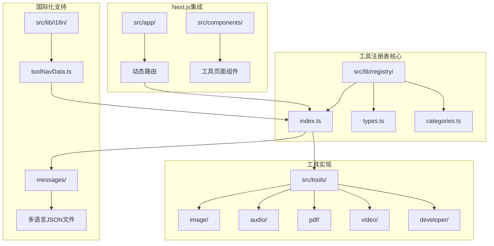
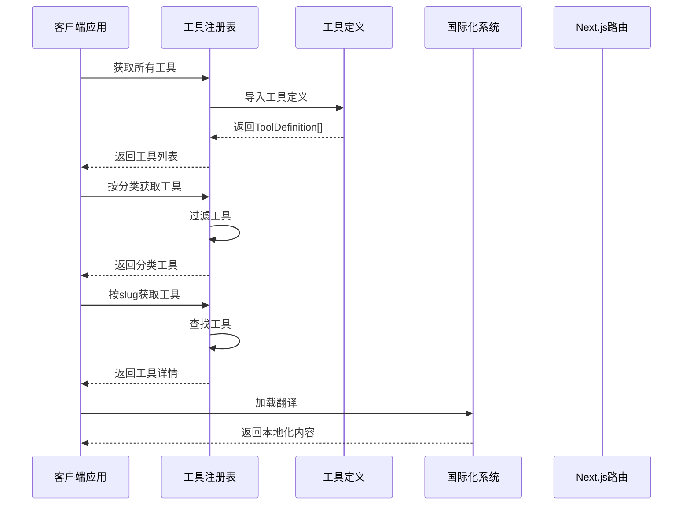
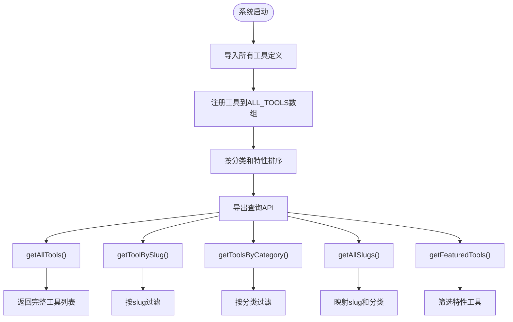
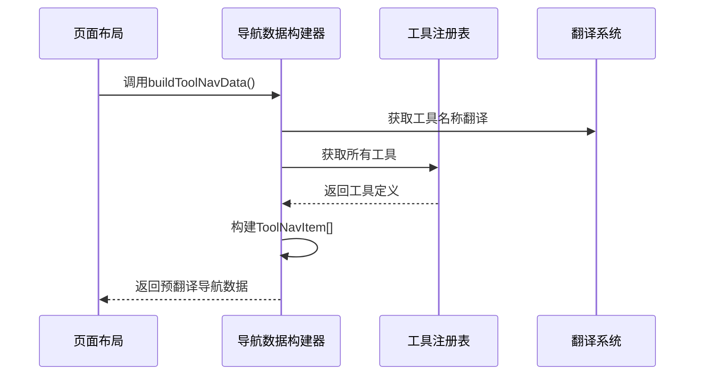
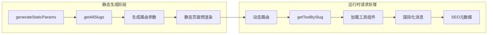
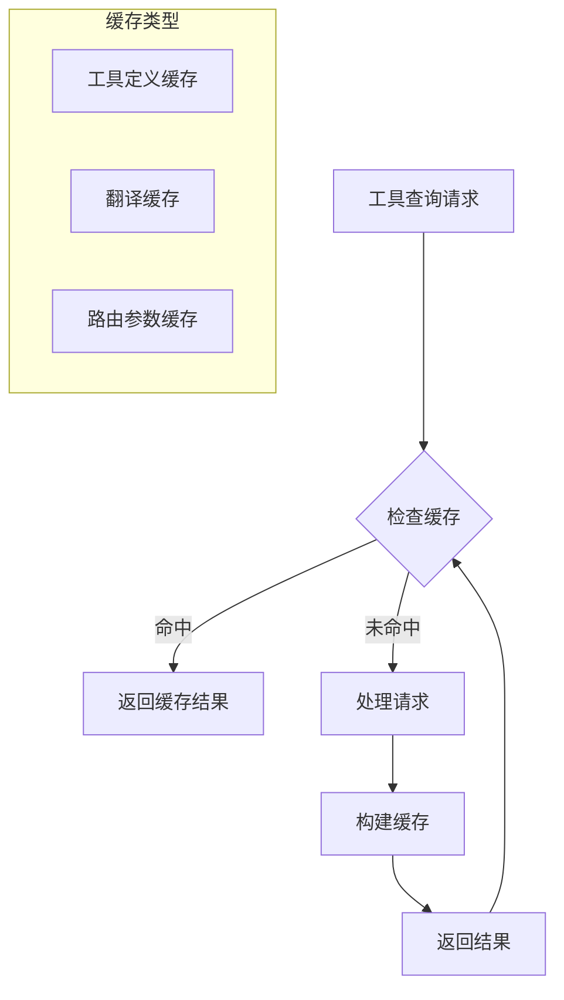

# 工具注册表系统

<cite>
**本文档引用的文件**
- [README.md](file://README.md)
- [registry/index.ts](file://src/lib/registry/index.ts)
- [registry/types.ts](file://src/lib/registry/types.ts)
- [registry/categories.ts](file://src/lib/registry/categories.ts)
- [i18n/toolNavData.ts](file://src/lib/i18n/toolNavData.ts)
- [tools/image/compress/index.ts](file://src/tools/image/compress/index.ts)
- [tools/developer/json-formatter/index.ts](file://src/tools/developer/json-formatter/index.ts)
- [app/[locale]/tools/[category]/[slug]/page.tsx](file://src/app/[locale]/tools/[category]/[slug]/page.tsx)
- [app/[locale]/tools/page.tsx](file://src/app/[locale]/tools/page.tsx)
- [messages/en/common.json](file://messages/en/common.json)
- [messages/en/tools-image.json](file://messages/en/tools-image.json)
</cite>

## 目录
1. [简介](#简介)
2. [项目结构](#项目结构)
3. [核心组件](#核心组件)
4. [架构概览](#架构概览)
5. [详细组件分析](#详细组件分析)
6. [依赖关系分析](#依赖关系分析)
7. [性能考虑](#性能考虑)
8. [故障排除指南](#故障排除指南)
9. [结论](#结论)
10. [附录](#附录)

## 简介

工具注册表系统是 PrivaDeck 项目的核心基础设施，负责管理所有浏览器端多媒体工具的元数据和路由信息。该系统确保了工具的统一管理、快速检索和国际化支持，为用户提供无缝的工具发现和使用体验。

该项目采用完全隐私优先的设计理念，所有文件处理都在浏览器本地完成，实现了真正的零上传、零服务器架构。系统支持 60+ 个工具，覆盖图片、视频、音频、PDF、开发者五大分类，支持 21 种语言。

## 项目结构

工具注册表系统主要分布在以下关键目录中：



**图表来源**
- [registry/index.ts:1-164](file://src/lib/registry/index.ts#L1-L164)
- [registry/types.ts:1-22](file://src/lib/registry/types.ts#L1-L22)
- [registry/categories.ts:1-10](file://src/lib/registry/categories.ts#L1-L10)

**章节来源**
- [README.md:55-78](file://README.md#L55-L78)

## 核心组件

### 工具定义接口 (ToolDefinition)

ToolDefinition 接口是工具注册表的核心数据结构，定义了每个工具的完整元数据：

```mermaid
classDiagram
class ToolDefinition {
+string slug
+ToolCategory category
+string icon
+boolean featured
+ComponentLoader component
+SEOConfig seo
+FAQItem[] faq
+string[] relatedSlugs
}
class ToolCategory {
<<enumeration>>
"developer"
"image"
"pdf"
"video"
"audio"
}
class SEOConfig {
+StructuredDataType structuredDataType
}
class FAQItem {
+string questionKey
+string answerKey
}
ToolDefinition --> ToolCategory
ToolDefinition --> SEOConfig
ToolDefinition --> FAQItem
```

**图表来源**
- [registry/types.ts:5-16](file://src/lib/registry/types.ts#L5-L16)

### 工具分类体系

系统支持五种核心分类，每种分类都有特定的图标和功能定位：

| 分类 | 关键字 | 图标 | 工具数量 |
|------|--------|------|----------|
| 图片 | image | Image | 17+ |
| 视频 | video | Video | 8+ |
| 音频 | audio | Music | 4+ |
| PDF | pdf | FileText | 14+ |
| 开发者 | developer | Code | 17+ |

**章节来源**
- [registry/types.ts:3-3](file://src/lib/registry/types.ts#L3-L3)
- [registry/categories.ts:3-9](file://src/lib/registry/categories.ts#L3-L9)

## 架构概览

工具注册表系统采用模块化设计，通过集中式的注册中心管理所有工具元数据：



**图表来源**
- [registry/index.ts:135-163](file://src/lib/registry/index.ts#L135-L163)
- [app/[locale]/tools/[category]/[slug]/page.tsx](file://src/app/[locale]/tools/[category]/[slug]/page.tsx#L41-L44)

## 详细组件分析

### 工具注册表核心实现

工具注册表通过集中式导入和管理所有工具定义，提供了高效的查询接口：



**图表来源**
- [registry/index.ts:66-133](file://src/lib/registry/index.ts#L66-L133)

### 工具定义示例分析

以图片压缩工具为例，展示完整的工具定义结构：

```mermaid
classDiagram
class ImageCompressDefinition {
+slug : "compress"
+category : "image"
+icon : "ImageDown"
+featured : true
+component : () => import("./ImageCompress")
+seo : {
+structuredDataType : "WebApplication"
}
+faq : FAQItem[]
+relatedSlugs : ["format-converter", "resize", "crop"]
}
class FAQItem {
+questionKey : string
+answerKey : string
}
ImageCompressDefinition --> FAQItem
```

**图表来源**
- [tools/image/compress/index.ts:3-36](file://src/tools/image/compress/index.ts#L3-L36)

**章节来源**
- [tools/image/compress/index.ts:1-37](file://src/tools/image/compress/index.ts#L1-L37)
- [tools/developer/json-formatter/index.ts:1-37](file://src/tools/developer/json-formatter/index.ts#L1-L37)

### 国际化集成机制

工具注册表与国际化系统深度集成，通过预翻译机制优化性能：



**图表来源**
- [i18n/toolNavData.ts:16-41](file://src/lib/i18n/toolNavData.ts#L16-L41)

**章节来源**
- [i18n/toolNavData.ts:1-42](file://src/lib/i18n/toolNavData.ts#L1-L42)

### Next.js App Router 集成

工具注册表与 Next.js App Router 无缝集成，支持静态生成和动态路由：



**图表来源**
- [app/[locale]/tools/[category]/[slug]/page.tsx](file://src/app/[locale]/tools/[category]/[slug]/page.tsx#L13-L22)
- [app/[locale]/tools/[category]/[slug]/page.tsx](file://src/app/[locale]/tools/[category]/[slug]/page.tsx#L41-L44)

**章节来源**
- [app/[locale]/tools/[category]/[slug]/page.tsx](file://src/app/[locale]/tools/[category]/[slug]/page.tsx#L1-L109)

## 依赖关系分析

工具注册表系统展现了清晰的依赖层次结构：

```mermaid
graph TB
subgraph "外部依赖"
A[React]
B[Next.js]
C[next-intl]
D[Lucide Icons]
end
subgraph "内部模块"
E[registry/index.ts]
F[registry/types.ts]
G[registry/categories.ts]
H[i18n/toolNavData.ts]
I[tools/*]
end
subgraph "应用层"
J[app/[locale]/tools/...]
K[components/]
L[lib/]
end
A --> E
B --> J
C --> H
D --> F
E --> I
F --> E
G --> E
H --> E
E --> J
E --> K
E --> L
```

**图表来源**
- [registry/index.ts:1-3](file://src/lib/registry/index.ts#L1-L3)
- [app/[locale]/tools/[category]/[slug]/page.tsx](file://src/app/[locale]/tools/[category]/[slug]/page.tsx#L5-L10)

**章节来源**
- [registry/index.ts:1-164](file://src/lib/registry/index.ts#L1-L164)

## 性能考虑

### 查询性能优化

工具注册表采用内存中的数组存储和缓存策略：

- **时间复杂度**: 
  - getAllTools(): O(n)
  - getToolBySlug(): O(n)
  - getToolsByCategory(): O(n)
  - getAllSlugs(): O(n)

- **空间复杂度**: O(n) 存储所有工具定义

### 缓存策略



### 预加载优化

系统通过预加载机制优化首屏性能：

- **静态参数预生成**: 使用 generateStaticParams() 预生成所有工具路由
- **组件懒加载**: 工具组件采用动态导入实现按需加载
- **国际化预处理**: 通过 buildToolNavData() 预翻译导航数据

## 故障排除指南

### 常见问题及解决方案

#### 工具找不到问题
**症状**: 访问工具页面返回 404
**原因**: 工具未在注册表中注册或 slug 错误
**解决**: 检查工具 index.ts 文件是否正确导出到 registry/index.ts

#### 国际化显示问题
**症状**: 工具名称或描述显示为键名而非实际内容
**原因**: 翻译文件缺失或键名不匹配
**解决**: 确保 messages/{locale}/tools-{category}.json 包含完整的翻译键

#### 路由生成错误
**症状**: 静态页面生成失败
**原因**: generateStaticParams() 返回无效参数
**解决**: 检查 getAllSlugs() 返回的 slug 和分类组合

**章节来源**
- [app/[locale]/tools/[category]/[slug]/page.tsx](file://src/app/[locale]/tools/[category]/[slug]/page.tsx#L42-L44)

## 结论

工具注册表系统成功实现了以下目标：

1. **统一管理**: 集中式管理所有工具元数据，便于维护和扩展
2. **高效查询**: 提供多种查询接口满足不同场景需求
3. **国际化支持**: 深度集成国际化系统，支持 21 种语言
4. **性能优化**: 通过缓存和预加载策略确保快速响应
5. **隐私优先**: 完全在客户端运行，符合项目核心理念

该系统为 PrivaDeck 项目提供了坚实的基础，支持其 60+ 工具的稳定运行和持续扩展。

## 附录

### 最佳实践指南

#### 工具注册最佳实践
1. **文件组织**: 每个工具创建独立目录，包含 index.ts、组件文件和逻辑文件
2. **命名约定**: slug 使用短横线分隔的小写形式，如 "image-compressor"
3. **元数据配置**: 确保 icon 字段使用有效的 Lucide 图标名称
4. **特性标记**: 将最常用和最重要的工具标记为 featured

#### 版本管理建议
1. **向后兼容**: 修改工具定义时保持接口稳定性
2. **渐进式更新**: 通过 featured 标记引导用户使用新工具
3. **迁移策略**: 为废弃工具提供替代方案和迁移指导

#### 性能优化策略
1. **懒加载**: 利用 React.lazy 和动态导入减少初始包大小
2. **缓存利用**: 合理使用浏览器缓存和 CDN 加速
3. **资源预加载**: 对常用工具的组件和资源进行预加载