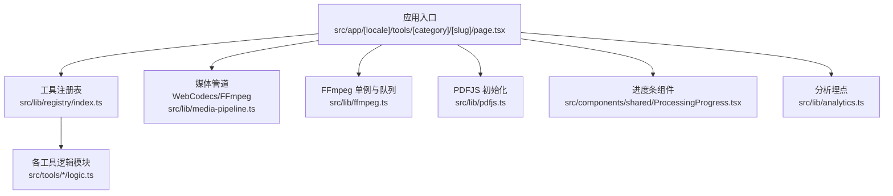
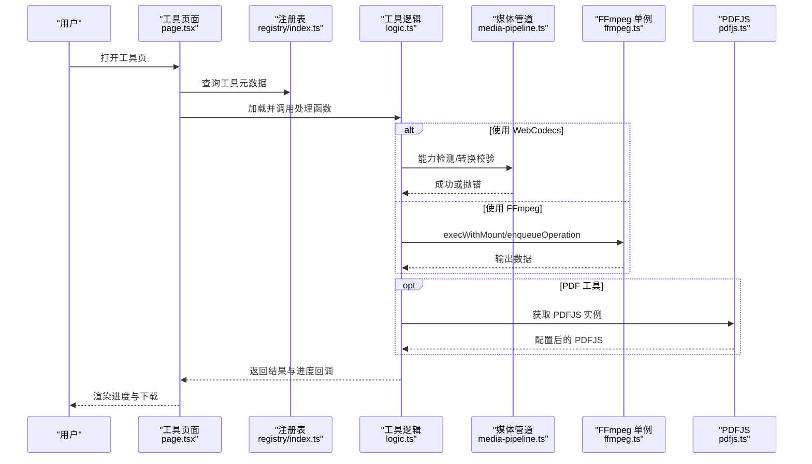
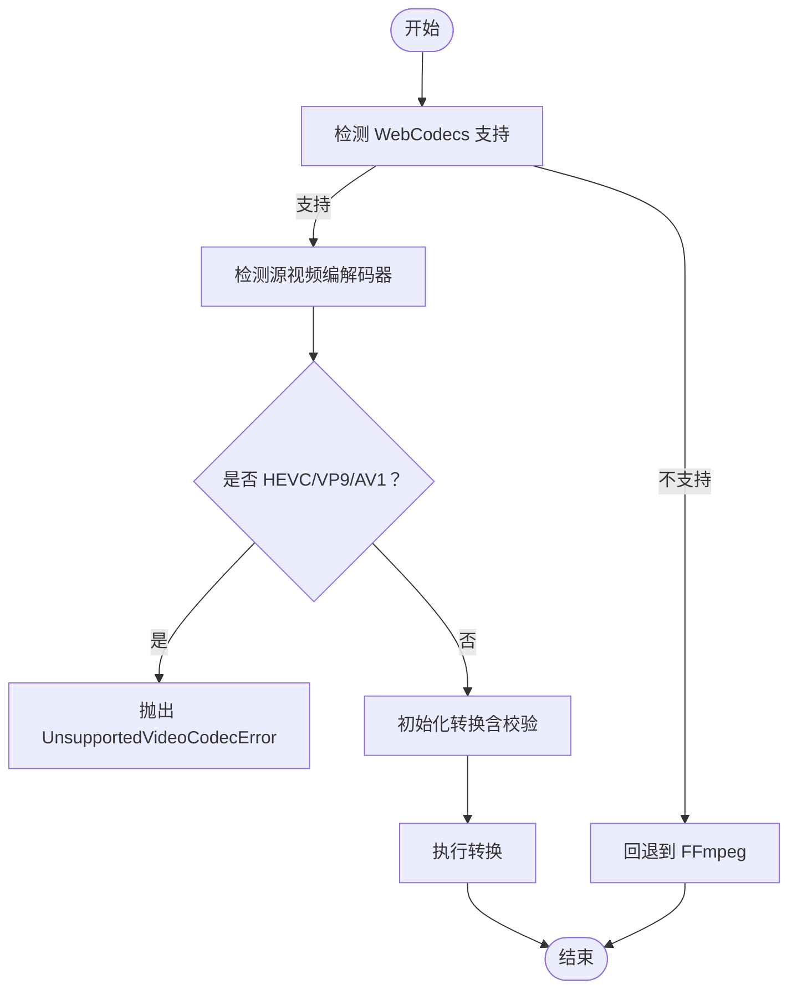
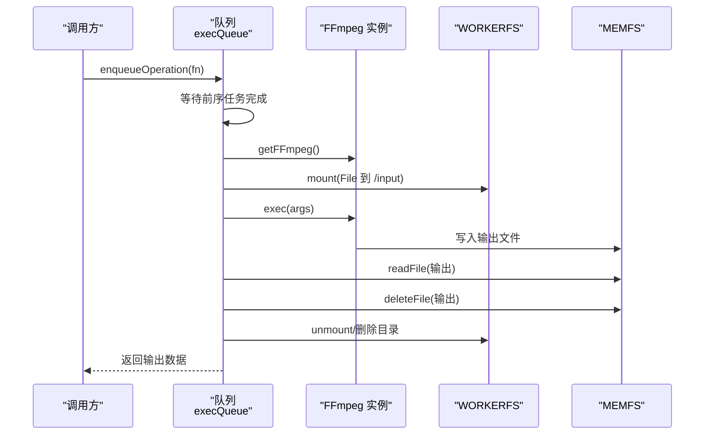
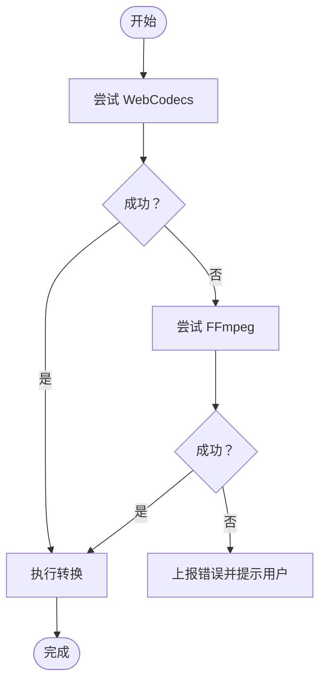
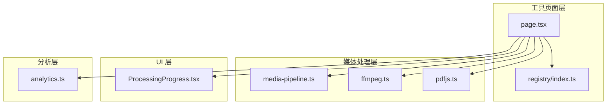

# 工具生命周期管理

<cite>
**本文引用的文件**
- [README.md](file://README.md)
- [package.json](file://package.json)
- [src/lib/media-pipeline.ts](file://src/lib/media-pipeline.ts)
- [src/lib/ffmpeg.ts](file://src/lib/ffmpeg.ts)
- [src/lib/pdfjs.ts](file://src/lib/pdfjs.ts)
- [src/lib/registry/index.ts](file://src/lib/registry/index.ts)
- [src/app/[locale]/tools/[category]/[slug]/page.tsx](file://src/app/[locale]/tools/[category]/[slug]/page.tsx)
- [src/components/shared/ProcessingProgress.tsx](file://src/components/shared/ProcessingProgress.tsx)
- [src/lib/analytics.ts](file://src/lib/analytics.ts)
- [src/tools/image/compress/logic.ts](file://src/tools/image/compress/logic.ts)
- [src/tools/video/compress/logic.ts](file://src/tools/video/compress/logic.ts)
- [src/tools/pdf/compress/logic.ts](file://src/tools/pdf/compress/logic.ts)
</cite>

## 目录
1. [引言](#引言)
2. [项目结构](#项目结构)
3. [核心组件](#核心组件)
4. [架构总览](#架构总览)
5. [详细组件分析](#详细组件分析)
6. [依赖关系分析](#依赖关系分析)
7. [性能考虑](#性能考虑)
8. [故障排查指南](#故障排查指南)
9. [结论](#结论)
10. [附录](#附录)

## 引言
本文件围绕“工具生命周期管理”主题，系统阐述本项目中工具从创建到销毁的完整生命周期，覆盖初始化、运行时管理与资源清理；解释异步处理机制（Promise 链式调用、并发控制与队列管理）；总结状态管理（同步、持久化与恢复）的实现模式；说明工具间数据传递与通信（事件驱动与消息传递）；给出错误处理与异常恢复策略（重试、降级与用户通知）；并提供性能监控与优化方法（内存、CPU、I/O），最后讨论扩展性设计（插件化与可配置参数系统）。为便于读者快速定位实现细节，文中所有技术要点均标注具体文件路径与行号。

## 项目结构
项目采用 Next.js App Router + TypeScript + Tailwind CSS 的前端架构，媒体处理能力由浏览器端库提供：FFmpeg.wasm（视频/音频）、pdf-lib + pdfjs-dist（PDF）、browser-image-compression（图片）、Mediabunny + WebCodecs（硬件加速视频编解码）。工具以模块化方式组织在 src/tools 下，通过工具注册表集中管理与路由层动态渲染。

图表来源
- [src/app/[locale]/tools/[category]/[slug]/page.tsx:1-109](file://src/app/[locale]/tools/[category]/[slug]/page.tsx#L1-L109)
- [src/lib/registry/index.ts:1-164](file://src/lib/registry/index.ts#L1-L164)
- [src/lib/media-pipeline.ts:1-175](file://src/lib/media-pipeline.ts#L1-L175)
- [src/lib/ffmpeg.ts:1-144](file://src/lib/ffmpeg.ts#L1-L144)
- [src/lib/pdfjs.ts:1-16](file://src/lib/pdfjs.ts#L1-L16)
- [src/components/shared/ProcessingProgress.tsx:1-47](file://src/components/shared/ProcessingProgress.tsx#L1-L47)
- [src/lib/analytics.ts:1-138](file://src/lib/analytics.ts#L1-L138)

章节来源
- [README.md:55-78](file://README.md#L55-L78)
- [package.json:11-32](file://package.json#L11-L32)

## 核心组件
- 工具注册表：集中声明与导出所有工具元数据，提供按分类、slug 查询与特性筛选能力，是工具生命周期的“入口清单”。
- 媒体管道（Media Pipeline）：封装 WebCodecs 能力检测、编码器能力探测、错误类型定义与转换校验，作为视频/音频处理的首选路径，并在不兼容时触发降级。
- FFmpeg 单例与队列：提供单实例懒加载、全局进度监听、串行化执行队列，避免并发冲突与内存拷贝，确保操作安全与可预测。
- PDFJS 初始化：统一配置 worker 源，保证 PDF 处理的可复用性。
- 进度条组件：提供确定/不确定进度 UI，贯穿各类工具的运行时反馈。
- 分析埋点：提供工具处理完成/错误事件的标准化上报接口，用于性能与质量监控。

章节来源
- [src/lib/registry/index.ts:66-137](file://src/lib/registry/index.ts#L66-L137)
- [src/lib/media-pipeline.ts:7-175](file://src/lib/media-pipeline.ts#L7-L175)
- [src/lib/ffmpeg.ts:10-144](file://src/lib/ffmpeg.ts#L10-L144)
- [src/lib/pdfjs.ts:3-13](file://src/lib/pdfjs.ts#L3-L13)
- [src/components/shared/ProcessingProgress.tsx:14-46](file://src/components/shared/ProcessingProgress.tsx#L14-L46)
- [src/lib/analytics.ts:106-137](file://src/lib/analytics.ts#L106-L137)

## 架构总览
下图展示了工具页面到具体处理逻辑的调用链路，以及媒体处理能力的选择与降级策略。

图表来源
- [src/app/[locale]/tools/[category]/[slug]/page.tsx:33-108](file://src/app/[locale]/tools/[category]/[slug]/page.tsx#L33-L108)
- [src/lib/registry/index.ts:139-147](file://src/lib/registry/index.ts#L139-L147)
- [src/lib/media-pipeline.ts:93-175](file://src/lib/media-pipeline.ts#L93-L175)
- [src/lib/ffmpeg.ts:99-143](file://src/lib/ffmpeg.ts#L99-L143)
- [src/lib/pdfjs.ts:3-13](file://src/lib/pdfjs.ts#L3-L13)

## 详细组件分析

### 工具注册表与生命周期入口
- 注册表负责集中导入与导出工具定义，提供查询、筛选与枚举能力，是工具生命周期的“入口清单”。页面层通过 slug/category 查询工具定义，再将工具名称、描述、FAQ 等信息注入到客户端组件，形成完整的工具上下文。
- 生命周期要点：
  - 创建：页面加载时解析路由参数，查询工具定义，准备多语言消息与 SEO 数据。
  - 运行时：将工具定义与处理函数暴露给客户端组件，组件内部根据用户交互触发处理流程。
  - 销毁：页面卸载时，组件内的副作用（如定时器、事件监听）应在组件卸载钩子中清理，避免内存泄漏。

章节来源
- [src/lib/registry/index.ts:66-164](file://src/lib/registry/index.ts#L66-L164)
- [src/app/[locale]/tools/[category]/[slug]/page.tsx:33-108](file://src/app/[locale]/tools/[category]/[slug]/page.tsx#L33-L108)

### 媒体管道（WebCodecs 优先）
- 能力检测：判断浏览器是否支持 Video/Audio 编解码器，决定是否启用硬件加速路径。
- 错误模型：定义 WebCodecsFallbackError 与 UnsupportedVideoCodecError，前者用于可降级场景（如音频不支持），后者用于不可降级场景（如 H.265/HEVC 解码）。
- 转换校验：validateConversion 会检查转换过程中是否丢弃关键轨道（音视频），若发现编解码器相关丢弃则抛错，确保输出质量。
- 编码器能力探测：canEncodeHevc/canEncodeAvc 用于预检目标编码器能力，避免无效尝试。
- 视频编解码器检测：detectSourceVideoCodec 用于识别源文件的视频编解码器，辅助后续策略选择。

图表来源
- [src/lib/media-pipeline.ts:7-175](file://src/lib/media-pipeline.ts#L7-L175)

章节来源
- [src/lib/media-pipeline.ts:7-175](file://src/lib/media-pipeline.ts#L7-L175)

### FFmpeg 单例与队列（串行化执行）
- 单例懒加载：getFFmpeg 首次调用时异步加载核心与 wasm 资源，成功后缓存实例，后续直接返回。
- 进度监听：setProgressHandler 动态绑定/解绑进度事件，确保在任务执行期间仅有一个处理器生效。
- 串行队列：enqueueOperation 将任意 FFmpeg 操作串接在 Promise 队列上，避免并发挂载点冲突与内存拷贝。
- 文件挂载：execWithMount 使用 WORKERFS 直接挂载 File 对象，避免两次全量内存复制；执行完成后立即释放 MEMFS 输出副本，降低峰值内存。
- 资源清理：任务 finally 中统一卸载挂载点与删除临时目录，防止残留。

图表来源
- [src/lib/ffmpeg.ts:75-143](file://src/lib/ffmpeg.ts#L75-L143)

章节来源
- [src/lib/ffmpeg.ts:10-39](file://src/lib/ffmpeg.ts#L10-L39)
- [src/lib/ffmpeg.ts:41-58](file://src/lib/ffmpeg.ts#L41-L58)
- [src/lib/ffmpeg.ts:75-82](file://src/lib/ffmpeg.ts#L75-L82)
- [src/lib/ffmpeg.ts:99-143](file://src/lib/ffmpeg.ts#L99-L143)

### PDFJS 初始化与生命周期
- 首次使用时配置 worker 源，标记已配置，避免重复设置。
- 工具侧通过 getPdfjs 获取实例后进行文档读取、渲染与保存，结束后销毁源文档对象，释放内存。

章节来源
- [src/lib/pdfjs.ts:3-13](file://src/lib/pdfjs.ts#L3-L13)
- [src/tools/pdf/compress/logic.ts:12-66](file://src/tools/pdf/compress/logic.ts#L12-L66)

### 进度反馈与状态同步
- ProcessingProgress 组件接收进度（0-100）或未定进度，渲染条形进度与百分比文本，支持自定义标签。
- 工具逻辑通过 onProgress 回调将进度回传至 UI，实现状态同步与用户感知。

章节来源
- [src/components/shared/ProcessingProgress.tsx:14-46](file://src/components/shared/ProcessingProgress.tsx#L14-L46)
- [src/tools/video/compress/logic.ts:90-112](file://src/tools/video/compress/logic.ts#L90-L112)
- [src/tools/pdf/compress/logic.ts:15-61](file://src/tools/pdf/compress/logic.ts#L15-L61)

### 工具状态管理与持久化
- 工具状态主要为运行时参数与中间结果（如压缩选项、进度、输出 Blob）。当前实现以函数参数与局部变量为主，未见跨会话持久化存储。
- 建议模式（概念性）：
  - 参数持久化：将用户选择的压缩质量、分辨率、帧率等序列化存储于 localStorage，页面加载时恢复。
  - 进度持久化：在长耗时任务中记录当前进度与输出文件名，刷新后可继续或重新开始。
  - 状态恢复：在页面卸载/重建时，依据持久化状态重建 UI 与处理流程。

[本节为通用设计建议，不直接分析具体文件，故无章节来源]

### 工具间数据传递与通信
- 事件驱动：通过组件树向下的 props 传递工具定义与处理函数；工具逻辑内部通过回调（onProgress、完成/失败）向上游组件推送状态。
- 消息传递：页面层聚合多语言消息与 SEO 数据，注入到客户端组件，形成“消息总线”式的上下文共享。
- 插件化扩展：注册表集中管理工具，新增工具只需在注册表中登记并提供逻辑模块，即可被路由层发现与渲染。

章节来源
- [src/lib/registry/index.ts:66-137](file://src/lib/registry/index.ts#L66-L137)
- [src/app/[locale]/tools/[category]/[slug]/page.tsx:46-54](file://src/app/[locale]/tools/[category]/[slug]/page.tsx#L46-L54)

### 错误处理与异常恢复
- WebCodecs 降级：当检测到不支持的编解码器（如 HEVC/VP9/AV1）且为视频轨道丢弃时，抛出 UnsupportedVideoCodecError，阻止回退到 FFmpeg；其他场景（如音频）仍可回退。
- FFmpeg 加载失败：getFFmpeg 在加载失败时终止实例并抛出异常，调用方可捕获并提示用户。
- 进度监听清理：setProgressHandler 在任务开始与结束时分别绑定/解绑，避免泄漏。
- 用户通知：结合进度组件与分析埋点，对错误事件进行上报，便于后续优化。

图表来源
- [src/lib/media-pipeline.ts:93-113](file://src/lib/media-pipeline.ts#L93-L113)
- [src/lib/ffmpeg.ts:20-28](file://src/lib/ffmpeg.ts#L20-L28)
- [src/lib/analytics.ts:130-137](file://src/lib/analytics.ts#L130-L137)

章节来源
- [src/lib/media-pipeline.ts:93-113](file://src/lib/media-pipeline.ts#L93-L113)
- [src/lib/ffmpeg.ts:20-28](file://src/lib/ffmpeg.ts#L20-L28)
- [src/lib/analytics.ts:130-137](file://src/lib/analytics.ts#L130-L137)

### 性能监控与优化
- 内存使用：FFmpeg 使用 WORKERFS 挂载避免内存拷贝；输出读取后立即删除 MEMFS 文件，降低峰值内存。
- CPU 占用：WebCodecs 优先使用硬件加速；在不支持时回退 FFmpeg 并通过串行队列减少竞争。
- I/O 优化：Prefetch FFmpeg 核心资源，缩短首次加载时间；PDF 工具在每页渲染后释放画布内存。
- 进度可视化：通过进度组件实时反馈，提升用户体验与可观测性。

章节来源
- [src/lib/ffmpeg.ts:105-143](file://src/lib/ffmpeg.ts#L105-L143)
- [src/app/[locale]/tools/[category]/[slug]/page.tsx:94-99](file://src/app/[locale]/tools/[category]/[slug]/page.tsx#L94-L99)
- [src/tools/pdf/compress/logic.ts:45-48](file://src/tools/pdf/compress/logic.ts#L45-L48)

### 扩展性设计
- 插件化：注册表集中管理工具，新增工具只需提供逻辑模块并在注册表中登记，即可被路由层自动发现。
- 可配置参数：工具逻辑模块内定义默认参数与预设，支持用户自定义；媒体管道提供能力探测与错误类型，便于扩展新的编解码策略。
- 多媒体库集成：通过统一的初始化与能力检测接口，抽象不同库的差异，降低耦合度。

章节来源
- [src/lib/registry/index.ts:66-137](file://src/lib/registry/index.ts#L66-L137)
- [src/lib/media-pipeline.ts:110-141](file://src/lib/media-pipeline.ts#L110-L141)

## 依赖关系分析

图表来源
- [src/app/[locale]/tools/[category]/[slug]/page.tsx:1-109](file://src/app/[locale]/tools/[category]/[slug]/page.tsx#L1-L109)
- [src/lib/registry/index.ts:1-164](file://src/lib/registry/index.ts#L1-164)
- [src/lib/media-pipeline.ts:1-175](file://src/lib/media-pipeline.ts#L1-175)
- [src/lib/ffmpeg.ts:1-144](file://src/lib/ffmpeg.ts#L1-144)
- [src/lib/pdfjs.ts:1-16](file://src/lib/pdfjs.ts#L1-16)
- [src/components/shared/ProcessingProgress.tsx:1-47](file://src/components/shared/ProcessingProgress.tsx#L1-47)
- [src/lib/analytics.ts:1-138](file://src/lib/analytics.ts#L1-138)

章节来源
- [package.json:11-32](file://package.json#L11-L32)

## 性能考虑
- WebCodecs 优先：在支持的环境下使用硬件加速，显著降低 CPU 占用与耗时。
- FFmpeg 串行化：通过 Promise 队列避免并发冲突，减少内存峰值与 I/O 抖动。
- 资源预取：在工具页面层对 FFmpeg 核心资源进行预取，缩短首次加载时间。
- PDF 处理：每页渲染后释放画布内存，避免长时间运行导致的内存累积。

[本节为通用性能建议，不直接分析具体文件，故无章节来源]

## 故障排查指南
- WebCodecs 不可用：检查浏览器支持情况与扩展安装（如 Windows + Chromium 的 HEVC 扩展），必要时引导用户安装。
- FFmpeg 加载失败：确认网络可达与 CDN 正常；查看加载异常堆栈并重试。
- 进度异常：确认 onProgress 回调在任务开始与结束时正确绑定/解绑；检查 UI 组件是否正确接收进度值。
- PDF 渲染失败：检查页面缩放与渲染参数，确保 Canvas 上下文有效；渲染完成后及时释放内存。

章节来源
- [src/lib/media-pipeline.ts:98-104](file://src/lib/media-pipeline.ts#L98-L104)
- [src/lib/ffmpeg.ts:20-28](file://src/lib/ffmpeg.ts#L20-L28)
- [src/lib/ffmpeg.ts:41-58](file://src/lib/ffmpeg.ts#L41-L58)
- [src/tools/pdf/compress/logic.ts:33-48](file://src/tools/pdf/compress/logic.ts#L33-L48)

## 结论
本项目通过“注册表 + 路由层 + 工具逻辑”的清晰分层，配合 WebCodecs 优先与 FFmpeg 回退的媒体处理策略，实现了稳定、可扩展的工具生命周期管理。借助串行化队列、能力检测与错误模型，系统在复杂媒体处理场景下保持了良好的性能与可靠性。建议在现有基础上进一步完善状态持久化与错误重试机制，以提升用户体验与系统韧性。

## 附录
- 工具页面加载与 SEO 数据生成：页面层负责生成结构化数据与面包屑，注入到客户端组件，确保 SEO 友好与导航清晰。
- 分析埋点：提供工具处理完成/错误事件的标准化上报，便于后续性能与质量监控。

章节来源
- [src/app/[locale]/tools/[category]/[slug]/page.tsx:24-77](file://src/app/[locale]/tools/[category]/[slug]/page.tsx#L24-L77)
- [src/lib/analytics.ts:106-137](file://src/lib/analytics.ts#L106-L137)