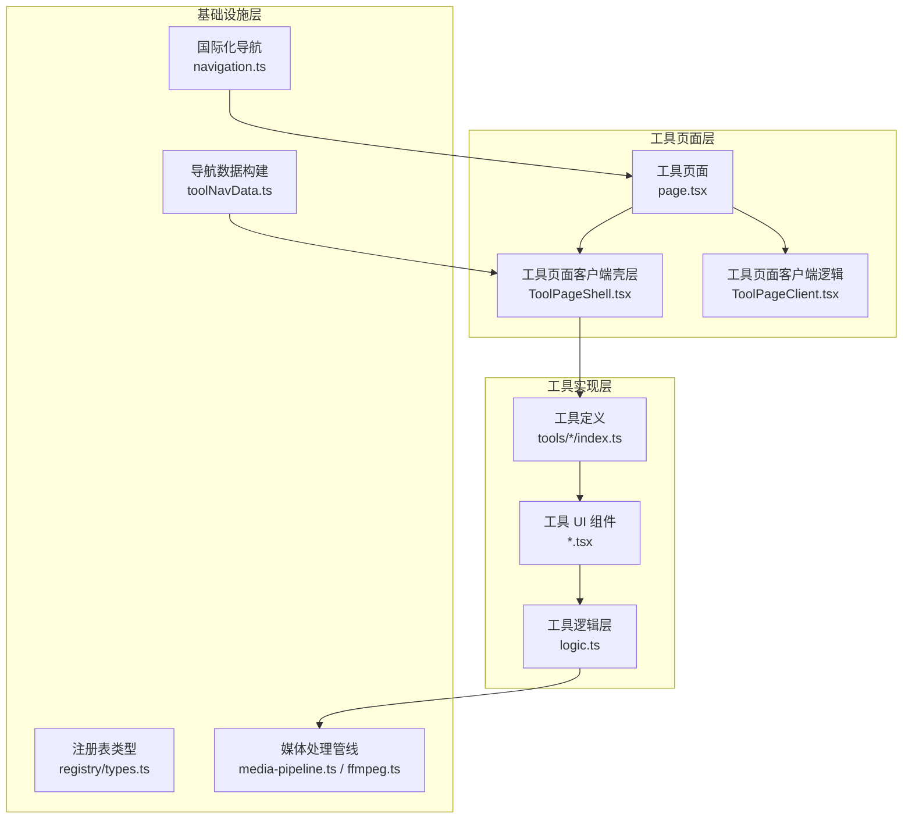
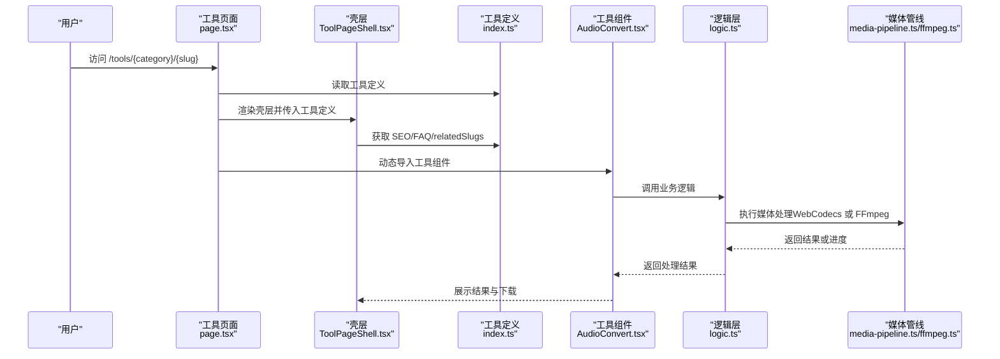
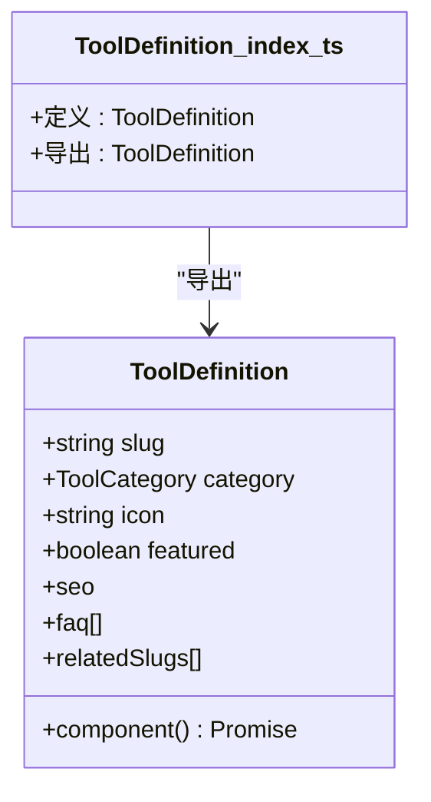
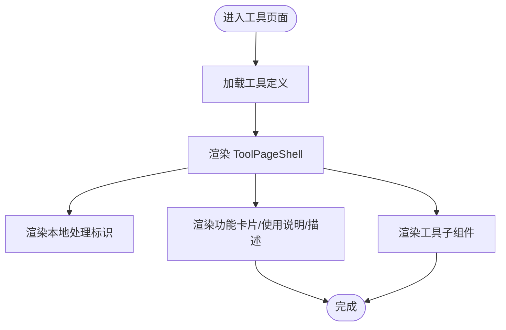
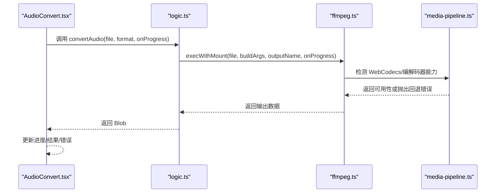
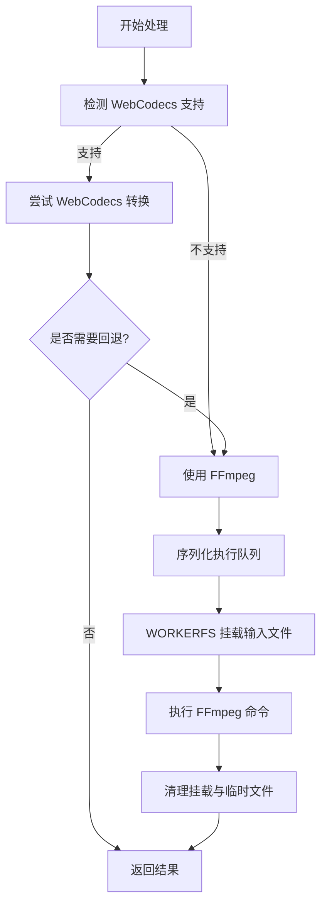
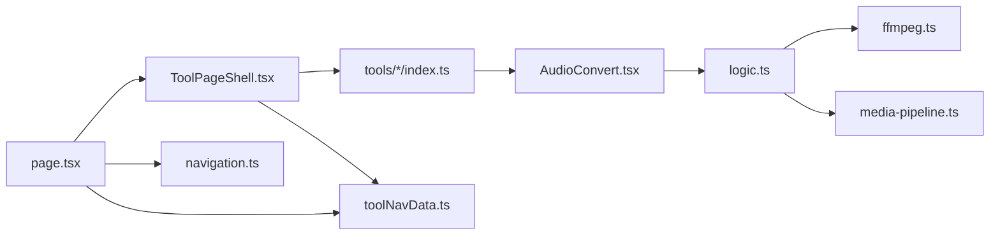

# 工具系统

<cite>
**本文引用的文件**
- [src/components/tool/ToolPageShell.tsx](file://src/components/tool/ToolPageShell.tsx)
- [src/lib/media-pipeline.ts](file://src/lib/media-pipeline.ts)
- [src/lib/ffmpeg.ts](file://src/lib/ffmpeg.ts)
- [src/tools/audio/convert/AudioConvert.tsx](file://src/tools/audio/convert/AudioConvert.tsx)
- [src/tools/audio/convert/logic.ts](file://src/tools/audio/convert/logic.ts)
- [src/tools/audio/convert/index.ts](file://src/tools/audio/convert/index.ts)
- [src/lib/i18n/toolNavData.ts](file://src/lib/i18n/toolNavData.ts)
- [src/lib/registry/types.ts](file://src/lib/registry/types.ts)
- [src/app/[locale]/tools/[category]/[slug]/ToolPageClient.tsx](file://src/app/[locale]/tools/[category]/[slug]/ToolPageClient.tsx)
- [src/app/[locale]/tools/[category]/[slug]/page.tsx](file://src/app/[locale]/tools/[category]/[slug]/page.tsx)
- [src/i18n/navigation.ts](file://src/i18n/navigation.ts)
</cite>

## 目录
1. [简介](#简介)
2. [项目结构](#项目结构)
3. [核心组件](#核心组件)
4. [架构总览](#架构总览)
5. [详细组件分析](#详细组件分析)
6. [依赖分析](#依赖分析)
7. [性能考虑](#性能考虑)
8. [故障排除指南](#故障排除指南)
9. [结论](#结论)
10. [附录](#附录)

## 简介
本文件面向工具开发者，系统性阐述媒体工具箱的工具系统：工具注册表与动态加载机制、工具页面标准结构（客户端组件、逻辑层、UI 组件）、工具分类与命名约定、生命周期与状态管理、错误处理策略、工具间依赖与通信、SEO 与路由配置，以及插件化扩展最佳实践。文档以音频转换工具为具体示例，展示从文件结构到国际化集成的完整开发流程。

## 项目结构
工具系统采用“按功能域分层 + 动态导入”的组织方式：
- 工具定义与注册：每个工具在独立目录下提供定义文件，声明分类、图标、SEO、FAQ、关联工具等元数据，并通过动态导入挂载前端组件。
- 客户端页面壳层：统一的工具页面外壳负责标题、描述、隐私提示、功能卡片、使用说明等通用 UI 结构。
- 业务逻辑层：将媒体处理逻辑与 UI 解耦，便于复用与测试。
- 媒体处理管线：提供 WebCodecs 优先的硬件加速路径与 FFmpeg 回退方案。
- 国际化与导航：通过命名空间与服务端预构建的导航数据，支持多语言工具名与描述渲染。

图表来源
- [src/app/[locale]/tools/[category]/[slug]/page.tsx](file://src/app/[locale]/tools/[category]/[slug]/page.tsx#L1-L200)
- [src/components/tool/ToolPageShell.tsx:1-54](file://src/components/tool/ToolPageShell.tsx#L1-L54)
- [src/app/[locale]/tools/[category]/[slug]/ToolPageClient.tsx](file://src/app/[locale]/tools/[category]/[slug]/ToolPageClient.tsx#L1-L200)
- [src/tools/audio/convert/index.ts:1-37](file://src/tools/audio/convert/index.ts#L1-L37)
- [src/lib/registry/types.ts:1-21](file://src/lib/registry/types.ts#L1-L21)
- [src/lib/media-pipeline.ts:1-175](file://src/lib/media-pipeline.ts#L1-L175)
- [src/lib/ffmpeg.ts:1-144](file://src/lib/ffmpeg.ts#L1-L144)
- [src/lib/i18n/toolNavData.ts:1-42](file://src/lib/i18n/toolNavData.ts#L1-L42)
- [src/i18n/navigation.ts:1-6](file://src/i18n/navigation.ts#L1-L6)

章节来源
- [src/app/[locale]/tools/[category]/[slug]/page.tsx](file://src/app/[locale]/tools/[category]/[slug]/page.tsx#L1-L200)
- [src/components/tool/ToolPageShell.tsx:1-54](file://src/components/tool/ToolPageShell.tsx#L1-L54)
- [src/lib/registry/types.ts:1-21](file://src/lib/registry/types.ts#L1-L21)

## 核心组件
- 工具注册表类型：定义工具分类、元数据、SEO、FAQ、相关工具等字段，以及动态导入的组件加载器。
- 工具页面壳层：统一渲染工具名称、描述、本地处理标识、功能卡片、使用说明与描述区域。
- 媒体处理管线：封装 WebCodecs 能力检测、编解码器能力探测、回退错误类型与进度回调；同时提供基于 FFmpeg 的序列化执行队列与 WORKERFS 挂载执行方案。
- 工具定义与动态加载：每个工具提供 index.ts 定义文件，声明分类、图标、SEO、FAQ、相关工具与异步组件加载器，由页面层按需加载。

章节来源
- [src/lib/registry/types.ts:1-21](file://src/lib/registry/types.ts#L1-L21)
- [src/components/tool/ToolPageShell.tsx:1-54](file://src/components/tool/ToolPageShell.tsx#L1-L54)
- [src/lib/media-pipeline.ts:1-175](file://src/lib/media-pipeline.ts#L1-L175)
- [src/lib/ffmpeg.ts:1-144](file://src/lib/ffmpeg.ts#L1-L144)
- [src/tools/audio/convert/index.ts:1-37](file://src/tools/audio/convert/index.ts#L1-L37)

## 架构总览
工具系统遵循“定义驱动 + 动态加载 + 统一壳层 + 可插拔处理管线”的架构：
- 定义驱动：工具通过 index.ts 提供元数据与组件加载器，注册表类型约束字段与取值范围。
- 动态加载：页面层根据路由参数解析工具定义，使用 React.lazy 的动态导入加载组件，避免首屏体积。
- 统一壳层：ToolPageShell 负责通用 UI 与国际化文案渲染，保证工具页面风格一致。
- 处理管线：优先使用 WebCodecs 硬件加速，不支持时自动回退至 FFmpeg；通过队列与挂载避免并发冲突与内存拷贝。

图表来源
- [src/app/[locale]/tools/[category]/[slug]/page.tsx](file://src/app/[locale]/tools/[category]/[slug]/page.tsx#L1-L200)
- [src/components/tool/ToolPageShell.tsx:1-54](file://src/components/tool/ToolPageShell.tsx#L1-L54)
- [src/tools/audio/convert/index.ts:1-37](file://src/tools/audio/convert/index.ts#L1-L37)
- [src/tools/audio/convert/AudioConvert.tsx:1-86](file://src/tools/audio/convert/AudioConvert.tsx#L1-L86)
- [src/tools/audio/convert/logic.ts:1-35](file://src/tools/audio/convert/logic.ts#L1-L35)
- [src/lib/media-pipeline.ts:1-175](file://src/lib/media-pipeline.ts#L1-L175)
- [src/lib/ffmpeg.ts:1-144](file://src/lib/ffmpeg.ts#L1-L144)

## 详细组件分析

### 工具注册表与动态加载
- 注册表类型：约束工具分类、图标、是否精选、SEO 类型、FAQ 列表、相关工具 slug 等字段。
- 工具定义：每个工具提供 index.ts，导出 ToolDefinition，其中 component 字段返回异步组件加载器，用于按需加载。
- 页面加载：工具页面根据路由参数定位工具定义，动态导入组件并在壳层中渲染。

图表来源
- [src/lib/registry/types.ts:1-21](file://src/lib/registry/types.ts#L1-L21)
- [src/tools/audio/convert/index.ts:1-37](file://src/tools/audio/convert/index.ts#L1-L37)

章节来源
- [src/lib/registry/types.ts:1-21](file://src/lib/registry/types.ts#L1-L21)
- [src/tools/audio/convert/index.ts:1-37](file://src/tools/audio/convert/index.ts#L1-L37)

### 工具页面壳层与标准结构
- 壳层职责：渲染工具标题、描述、本地处理标识、功能卡片、使用说明、为什么选择本工具、工具描述等模块化区域。
- 国际化：通过 next-intl 的 useTranslations 在工具命名空间下读取 name/description 等文案。
- 子组件组合：通过组合多个专用 UI 组件实现可复用的页面结构。

图表来源
- [src/components/tool/ToolPageShell.tsx:1-54](file://src/components/tool/ToolPageShell.tsx#L1-L54)

章节来源
- [src/components/tool/ToolPageShell.tsx:1-54](file://src/components/tool/ToolPageShell.tsx#L1-L54)

### 工具实现：音频转换
- 文件结构：AudioConvert.tsx（UI 与状态）、logic.ts（业务逻辑）、index.ts（工具定义）。
- 状态管理：文件选择、目标格式、处理进度、结果与错误状态。
- 错误处理：检测浏览器兼容性（SharedArrayBuffer），失败时显示错误信息。
- 进度反馈：通过 onProgress 回调更新 UI 百分比。
- 下载集成：生成对象 URL 并提供下载按钮。

图表来源
- [src/tools/audio/convert/AudioConvert.tsx:1-86](file://src/tools/audio/convert/AudioConvert.tsx#L1-L86)
- [src/tools/audio/convert/logic.ts:1-35](file://src/tools/audio/convert/logic.ts#L1-L35)
- [src/lib/ffmpeg.ts:1-144](file://src/lib/ffmpeg.ts#L1-L144)
- [src/lib/media-pipeline.ts:1-175](file://src/lib/media-pipeline.ts#L1-L175)

章节来源
- [src/tools/audio/convert/AudioConvert.tsx:1-86](file://src/tools/audio/convert/AudioConvert.tsx#L1-L86)
- [src/tools/audio/convert/logic.ts:1-35](file://src/tools/audio/convert/logic.ts#L1-L35)
- [src/lib/ffmpeg.ts:1-144](file://src/lib/ffmpeg.ts#L1-L144)
- [src/lib/media-pipeline.ts:1-175](file://src/lib/media-pipeline.ts#L1-L175)

### 媒体处理管线：WebCodecs 与 FFmpeg
- 能力检测：检测 WebCodecs 编解码器支持情况，必要时建议安装 HEVC 扩展。
- 回退策略：当 WebCodecs 无法处理源视频或不支持特定编解码器时，抛出自定义回退错误，转而使用 FFmpeg。
- 序列化执行：通过 Promise 队列串行执行 FFmpeg 操作，避免并发冲突；使用 WORKERFS 挂载输入文件，减少内存拷贝。
- 进度回调：统一监听 FFmpeg 进度事件，转换为 0-100 的整数进度。

图表来源
- [src/lib/media-pipeline.ts:1-175](file://src/lib/media-pipeline.ts#L1-L175)
- [src/lib/ffmpeg.ts:1-144](file://src/lib/ffmpeg.ts#L1-L144)

章节来源
- [src/lib/media-pipeline.ts:1-175](file://src/lib/media-pipeline.ts#L1-L175)
- [src/lib/ffmpeg.ts:1-144](file://src/lib/ffmpeg.ts#L1-L144)

### 工具分类体系与命名约定
- 分类枚举：开发者、图像、PDF、视频、音频五类，作为工具分类的唯一键。
- 命名约定：工具 slug 使用短横线连接的小写单词；工具定义文件命名为 index.ts；逻辑文件命名为 logic.ts；UI 组件命名为大驼峰命名的 *.tsx。
- 国际化命名：工具文案位于 messages/{lang}/tools-{category}.json 中，命名空间为 tools.{category}.{slug}。

章节来源
- [src/lib/registry/types.ts:1-21](file://src/lib/registry/types.ts#L1-L21)

### 工具生命周期与状态管理
- 生命周期阶段：初始化（加载定义与组件）、准备（校验环境与权限）、处理（调用逻辑层）、结果（展示与下载）、清理（释放对象 URL 与卸载挂载点）。
- 状态管理：UI 组件内部维护文件、格式、进度、结果与错误状态；逻辑层负责与媒体管线交互并上报进度；壳层负责统一渲染与 SEO 元数据注入。
- 错误处理：捕获异常并显示用户可读错误；对不可恢复错误（如不支持的编解码器）提供引导信息。

章节来源
- [src/tools/audio/convert/AudioConvert.tsx:1-86](file://src/tools/audio/convert/AudioConvert.tsx#L1-L86)
- [src/lib/ffmpeg.ts:1-144](file://src/lib/ffmpeg.ts#L1-L144)

### 工具间依赖与通信
- 关联工具：通过工具定义中的 relatedSlugs 声明相关工具，壳层可渲染“相关工具”模块进行跳转。
- SEO 与 FAQ：通过工具定义中的 faq 与 seo 字段注入结构化数据与常见问题，提升 SEO 与用户体验。
- 导航数据：服务端构建工具导航数据，包含翻译后的名称与描述，避免将大量文案序列化进 RSC 负载。

章节来源
- [src/tools/audio/convert/index.ts:1-37](file://src/tools/audio/convert/index.ts#L1-L37)
- [src/lib/i18n/toolNavData.ts:1-42](file://src/lib/i18n/toolNavData.ts#L1-L42)

### 插件化开发与扩展最佳实践
- 新增工具步骤
  1) 创建目录：src/tools/{category}/{slug}/
  2) 定义文件：在目录内创建 index.ts，导出 ToolDefinition（含分类、图标、SEO、FAQ、相关工具、异步组件加载器）。
  3) UI 组件：创建 UI 组件，负责文件选择、参数设置、进度与结果展示。
  4) 业务逻辑：创建 logic.ts，封装媒体处理调用，暴露 Promise 接口与进度回调。
  5) 国际化：在 messages/{lang}/tools-{category}.json 中添加对应命名空间的 name/description/faq 文案。
  6) 路由与页面：Next.js 路由已内置 [category]/[slug]，无需额外配置。
- 最佳实践
  - 将 UI、逻辑、定义分离，保持单一职责。
  - 使用动态导入与懒加载，控制首屏体积。
  - 优先使用 WebCodecs，必要时回退 FFmpeg，并明确区分“可回退”与“不可回退”错误。
  - 统一进度回调与错误处理，提供清晰的用户反馈。
  - 通过 relatedSlugs 与 FAQ 提升工具发现与信任度。

章节来源
- [src/tools/audio/convert/index.ts:1-37](file://src/tools/audio/convert/index.ts#L1-L37)
- [src/tools/audio/convert/AudioConvert.tsx:1-86](file://src/tools/audio/convert/AudioConvert.tsx#L1-L86)
- [src/tools/audio/convert/logic.ts:1-35](file://src/tools/audio/convert/logic.ts#L1-L35)
- [src/lib/registry/types.ts:1-21](file://src/lib/registry/types.ts#L1-L21)

### SEO 优化与路由配置
- 路由：工具页面路由为 /tools/[category]/[slug]，由 Next.js App Router 自动解析。
- SEO：工具定义中的 seo 字段用于注入结构化数据类型；FAQ 与描述来自国际化命名空间，提升搜索引擎理解。
- 国际化导航：通过 navigation.ts 与 routing.ts 实现多语言链接与重定向。
- 导航数据：服务端构建工具导航数据，包含翻译后的名称与描述，减少客户端负载。

章节来源
- [src/app/[locale]/tools/[category]/[slug]/page.tsx](file://src/app/[locale]/tools/[category]/[slug]/page.tsx#L1-L200)
- [src/tools/audio/convert/index.ts:1-37](file://src/tools/audio/convert/index.ts#L1-L37)
- [src/i18n/navigation.ts:1-6](file://src/i18n/navigation.ts#L1-L6)
- [src/lib/i18n/toolNavData.ts:1-42](file://src/lib/i18n/toolNavData.ts#L1-L42)

## 依赖分析
- 组件耦合
  - 工具页面壳层依赖工具定义与国际化资源，但不直接依赖具体工具实现，保持高内聚低耦合。
  - 工具 UI 组件依赖逻辑层，逻辑层依赖媒体处理管线，形成清晰的数据流。
- 外部依赖
  - FFmpeg：提供 wasm 版本与进度事件监听；通过队列与挂载避免并发与内存拷贝。
  - WebCodecs：优先硬件加速，不支持时抛出回退错误，触发 FFmpeg 路径。
  - 国际化：next-intl 提供命名空间翻译与导航工具。

图表来源
- [src/app/[locale]/tools/[category]/[slug]/page.tsx](file://src/app/[locale]/tools/[category]/[slug]/page.tsx#L1-L200)
- [src/components/tool/ToolPageShell.tsx:1-54](file://src/components/tool/ToolPageShell.tsx#L1-L54)
- [src/tools/audio/convert/index.ts:1-37](file://src/tools/audio/convert/index.ts#L1-L37)
- [src/tools/audio/convert/AudioConvert.tsx:1-86](file://src/tools/audio/convert/AudioConvert.tsx#L1-L86)
- [src/tools/audio/convert/logic.ts:1-35](file://src/tools/audio/convert/logic.ts#L1-L35)
- [src/lib/ffmpeg.ts:1-144](file://src/lib/ffmpeg.ts#L1-L144)
- [src/lib/media-pipeline.ts:1-175](file://src/lib/media-pipeline.ts#L1-L175)
- [src/lib/i18n/toolNavData.ts:1-42](file://src/lib/i18n/toolNavData.ts#L1-L42)
- [src/i18n/navigation.ts:1-6](file://src/i18n/navigation.ts#L1-L6)

章节来源
- [src/lib/registry/types.ts:1-21](file://src/lib/registry/types.ts#L1-L21)
- [src/lib/ffmpeg.ts:1-144](file://src/lib/ffmpeg.ts#L1-L144)
- [src/lib/media-pipeline.ts:1-175](file://src/lib/media-pipeline.ts#L1-L175)

## 性能考虑
- WebCodecs 优先：在支持的浏览器上启用硬件加速，降低 CPU 占用与耗时。
- FFmpeg 队列化：通过 Promise 队列串行执行，避免并发冲突与重复初始化。
- WORKERFS 挂载：直接挂载文件对象，避免内存拷贝，减少峰值内存占用。
- 懒加载与按需导入：工具组件通过异步导入，仅在访问时加载，缩短首屏时间。
- 进度回调：统一监听 FFmpeg 进度事件，转换为整数百分比，避免频繁重渲染。

## 故障排除指南
- 浏览器兼容性
  - SharedArrayBuffer 不可用：提示用户更换浏览器或调整设置。
  - WebCodecs 不支持：自动回退 FFmpeg，若仍失败检查网络与 CDN 可达性。
- 编解码器不支持
  - WebCodecsFallbackError：表示需要回退 FFmpeg；UnsupportedVideoCodecError：表示不可回退，需提示用户更换编码。
- FFmpeg 执行失败
  - 检查输入文件格式与参数；确认进度事件未被覆盖；确保挂载点清理成功。
- 国际化文案缺失
  - 确认 messages/{lang}/tools-{category}.json 中存在对应命名空间；检查命名空间拼写与工具 slug 对应关系。

章节来源
- [src/lib/media-pipeline.ts:1-175](file://src/lib/media-pipeline.ts#L1-L175)
- [src/lib/ffmpeg.ts:1-144](file://src/lib/ffmpeg.ts#L1-L144)
- [src/tools/audio/convert/AudioConvert.tsx:1-86](file://src/tools/audio/convert/AudioConvert.tsx#L1-L86)

## 结论
媒体工具箱的工具系统通过“定义驱动 + 动态加载 + 统一壳层 + 可插拔处理管线”的架构，实现了高扩展性与良好的用户体验。开发者只需遵循统一的文件结构、命名约定与国际化规范，即可快速创建符合标准的新工具，并在 WebCodecs 与 FFmpeg 之间无缝切换，获得最佳性能与兼容性。

## 附录
- 新工具创建清单
  - 创建目录与文件：index.ts、UI 组件、logic.ts
  - 在 index.ts 中导出 ToolDefinition，包含分类、图标、SEO、FAQ、相关工具与异步组件加载器
  - 在 messages/{lang}/tools-{category}.json 中添加 name/description/faq
  - 在 UI 组件中实现状态管理与错误处理
  - 在 logic.ts 中封装媒体处理调用，暴露 Promise 接口与进度回调
  - 在壳层中渲染工具页面，确保 SEO 与 FAQ 正常显示