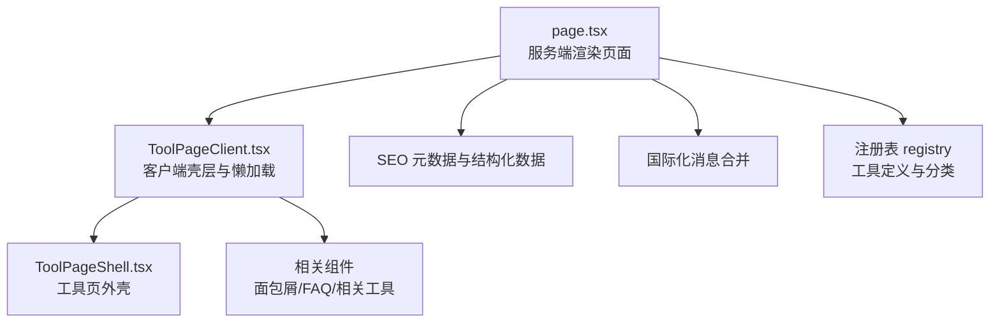
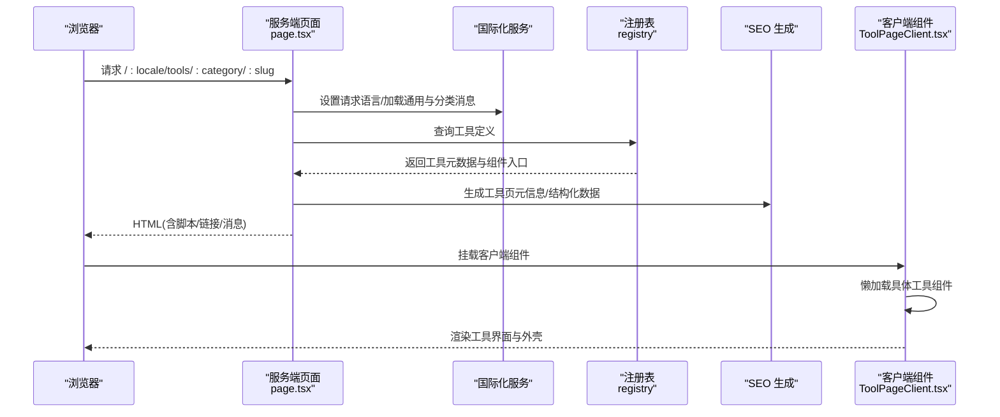
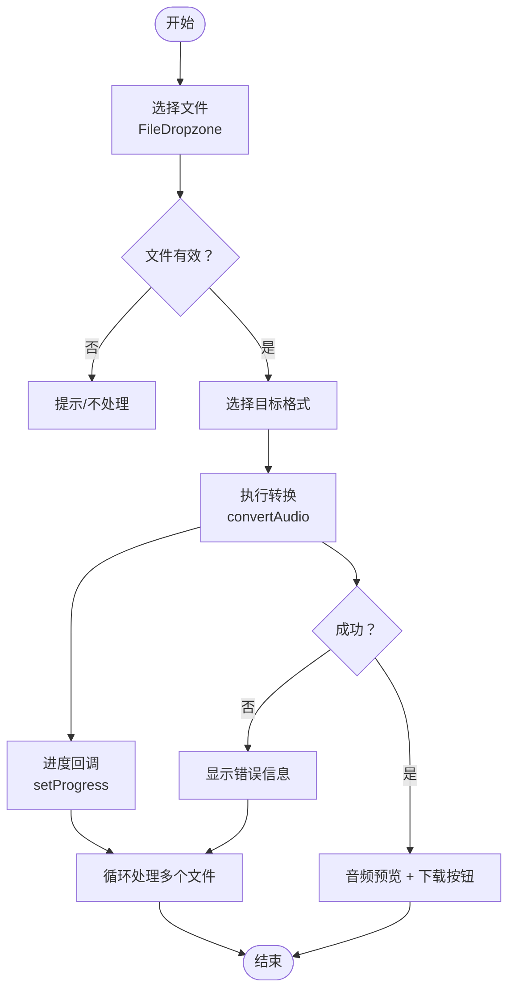
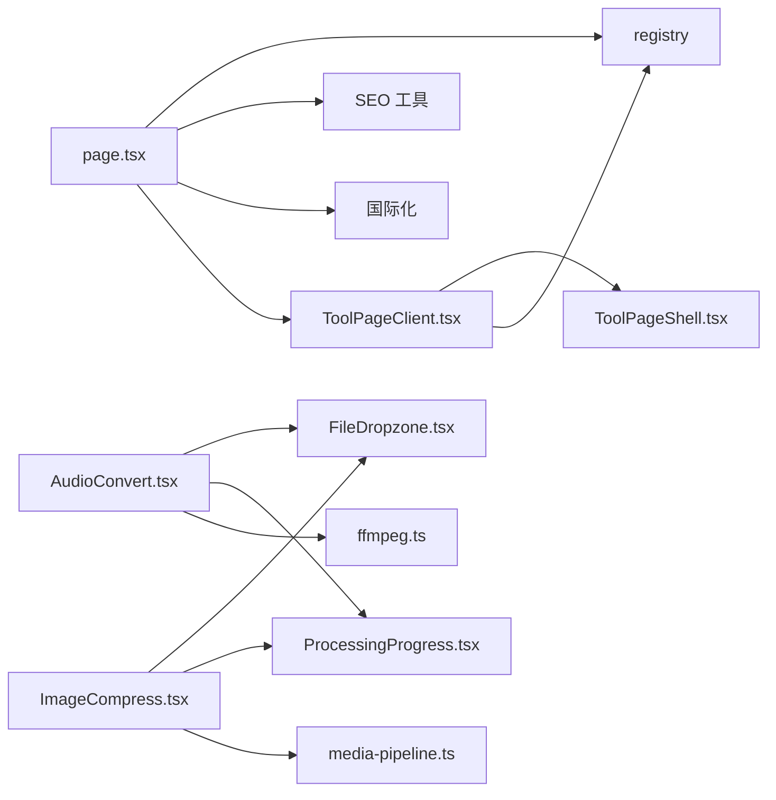

# 工具页面架构

<cite>
**本文引用的文件**
- [src/app/[locale]/tools/[category]/[slug]/page.tsx](file://src/app/[locale]/tools/[category]/[slug]/page.tsx)
- [src/app/[locale]/tools/[category]/[slug]/ToolPageClient.tsx](file://src/app/[locale]/tools/[category]/[slug]/ToolPageClient.tsx)
- [src/components/tool/ToolPageShell.tsx](file://src/components/tool/ToolPageShell.tsx)
- [src/lib/registry/index.ts](file://src/lib/registry/index.ts)
- [src/lib/seo/metadata.ts](file://src/lib/seo/metadata.ts)
- [src/lib/seo/jsonld.ts](file://src/lib/seo/jsonld.ts)
- [src/i18n/routing.ts](file://src/i18n/routing.ts)
- [src/components/shared/FileDropzone.tsx](file://src/components/shared/FileDropzone.tsx)
- [src/tools/audio/convert/AudioConvert.tsx](file://src/tools/audio/convert/AudioConvert.tsx)
- [src/tools/image/compress/ImageCompress.tsx](file://src/tools/image/compress/ImageCompress.tsx)
- [src/lib/media-pipeline.ts](file://src/lib/media-pipeline.ts)
- [src/lib/ffmpeg.ts](file://src/lib/ffmpeg.ts)
- [src/components/shared/ProcessingProgress.tsx](file://src/components/shared/ProcessingProgress.tsx)
- [src/app/layout.tsx](file://src/app/layout.tsx)
</cite>

## 目录
1. [简介](#简介)
2. [项目结构](#项目结构)
3. [核心组件](#核心组件)
4. [架构总览](#架构总览)
5. [详细组件分析](#详细组件分析)
6. [依赖关系分析](#依赖关系分析)
7. [性能考量](#性能考量)
8. [故障排查指南](#故障排查指南)
9. [结论](#结论)
10. [附录：最佳实践与示例路径](#附录最佳实践与示例路径)

## 简介
本文件系统性阐述媒体工具箱中“工具页面”的架构与实现模式，覆盖服务端渲染页面（page.tsx）与客户端组件（ToolPageClient.tsx）的职责划分与协作机制；梳理从路由匹配到组件渲染的完整生命周期；总结客户端状态管理策略（文件上传、进度跟踪、结果展示）；详解SEO优化（meta标签、Open Graph、结构化数据）；说明国际化集成（动态路由参数、多语言内容）；并提供错误处理、异常恢复与用户体验优化建议，最后给出性能监控、内存管理与开发最佳实践。

## 项目结构
工具页面位于多语言路由下，采用动态路由参数 [locale]/[category]/[slug]，每个工具页面由服务端页面组件负责国际化、元数据与结构化数据生成，并通过客户端组件按需懒加载具体工具界面。

图表来源
- [src/app/[locale]/tools/[category]/[slug]/page.tsx:1-109](file://src/app/[locale]/tools/[category]/[slug]/page.tsx#L1-L109)
- [src/app/[locale]/tools/[category]/[slug]/ToolPageClient.tsx:1-59](file://src/app/[locale]/tools/[category]/[slug]/ToolPageClient.tsx#L1-L59)
- [src/components/tool/ToolPageShell.tsx:1-54](file://src/components/tool/ToolPageShell.tsx#L1-L54)
- [src/lib/registry/index.ts:1-164](file://src/lib/registry/index.ts#L1-L164)

章节来源
- [src/app/[locale]/tools/[category]/[slug]/page.tsx:1-109](file://src/app/[locale]/tools/[category]/[slug]/page.tsx#L1-L109)
- [src/app/[locale]/tools/[category]/[slug]/ToolPageClient.tsx:1-59](file://src/app/[locale]/tools/[category]/[slug]/ToolPageClient.tsx#L1-L59)
- [src/lib/registry/index.ts:135-164](file://src/lib/registry/index.ts#L135-L164)

## 核心组件
- 服务端页面组件（page.tsx）
  - 负责：设置请求语言、校验工具存在性、生成静态参数、构建 SEO 元信息、注入结构化数据、按需预取 FFmpeg 资源、提供国际化消息给客户端。
  - 关键点：使用动态路由参数 locale/category/slug；调用注册表获取工具定义；生成工具页 JSON-LD、面包屑与 FAQ 结构化数据；根据类别决定是否预取 FFmpeg 资源。
- 客户端页面组件（ToolPageClient.tsx）
  - 负责：基于工具定义进行稳定缓存的懒加载；在 ToolPageShell 中渲染具体工具组件；提供骨架屏与错误兜底；渲染相关工具与 FAQ。
  - 关键点：使用 useMemo + Map 缓存懒加载组件；Suspense 提供加载态；工具外壳统一布局与隐私提示。
- 工具外壳（ToolPageShell.tsx）
  - 负责：统一标题、描述、隐私指示器、功能卡片、工作原理、为什么选择等模块化区域的容器。
- 注册表（registry）
  - 负责：集中声明所有工具的元数据与组件入口，提供查询工具、分类筛选、featured 工具等能力。

章节来源
- [src/app/[locale]/tools/[category]/[slug]/page.tsx:33-108](file://src/app/[locale]/tools/[category]/[slug]/page.tsx#L33-L108)
- [src/app/[locale]/tools/[category]/[slug]/ToolPageClient.tsx:29-58](file://src/app/[locale]/tools/[category]/[slug]/ToolPageClient.tsx#L29-L58)
- [src/components/tool/ToolPageShell.tsx:15-52](file://src/components/tool/ToolPageShell.tsx#L15-L52)
- [src/lib/registry/index.ts:135-164](file://src/lib/registry/index.ts#L135-L164)

## 架构总览
工具页面的生命周期从路由匹配开始，经由服务端渲染生成 SEO 与国际化上下文，再由客户端组件按需加载具体工具界面，最终形成完整的工具页体验。

图表来源
- [src/app/[locale]/tools/[category]/[slug]/page.tsx:13-108](file://src/app/[locale]/tools/[category]/[slug]/page.tsx#L13-L108)
- [src/lib/registry/index.ts:139-147](file://src/lib/registry/index.ts#L139-L147)
- [src/lib/seo/metadata.ts:14-57](file://src/lib/seo/metadata.ts#L14-L57)
- [src/lib/seo/jsonld.ts:5-32](file://src/lib/seo/jsonld.ts#L5-L32)

## 详细组件分析

### 服务端页面组件（page.tsx）
- 动态参数生成：generateStaticParams 遍历所有工具与语言，生成静态路由参数，用于 SSG。
- 国际化：加载通用消息与分类消息，合并为工具命名空间的消息对象；同时加载导航与分类翻译以生成面包屑与结构化数据。
- SEO：generateMetadata 使用工具命名空间下的 metaTitle/metaDescription/keywords，生成 canonical 与多语言 alternates、Open Graph 与 Twitter 卡片。
- 结构化数据：生成工具页 JSON-LD、面包屑 JSON-LD、可选的 FAQ JSON-LD。
- 资源预取：当工具属于 video/audio 时，预取 FFmpeg 的 core.js 与 wasm，提升首次处理性能。
- 渲染：包裹 NextIntlClientProvider 并传递合并后的消息，渲染 ToolPageClient。

章节来源
- [src/app/[locale]/tools/[category]/[slug]/page.tsx:13-108](file://src/app/[locale]/tools/[category]/[slug]/page.tsx#L13-L108)
- [src/lib/seo/metadata.ts:14-57](file://src/lib/seo/metadata.ts#L14-L57)
- [src/lib/seo/jsonld.ts:5-32](file://src/lib/seo/jsonld.ts#L5-L32)

### 客户端页面组件（ToolPageClient.tsx）
- 组件懒加载：基于 category/slug 组合作为缓存键，避免重复创建懒加载组件；首次加载后稳定缓存。
- 加载态：Suspense fallback 提供骨架屏，改善感知性能。
- 布局与模块：渲染 ToolBreadcrumb、ToolPageShell 包裹具体工具组件，随后渲染 RelatedTools 与 ToolFAQ。
- 错误兜底：当工具不存在或组件未就绪时返回空；外壳与面包屑保证基础结构可用。

章节来源
- [src/app/[locale]/tools/[category]/[slug]/ToolPageClient.tsx:29-58](file://src/app/[locale]/tools/[category]/[slug]/ToolPageClient.tsx#L29-L58)

### 工具外壳（ToolPageShell.tsx）
- 统一标题与描述：使用工具命名空间翻译。
- 隐私指示器：本地处理的隐私提示，增强用户信任。
- 内容区域：工具外壳容器内嵌入“如何工作”、“特性卡片”、“为什么选择”、“描述”等模块化区域。

章节来源
- [src/components/tool/ToolPageShell.tsx:15-52](file://src/components/tool/ToolPageShell.tsx#L15-L52)

### 注册表（registry）
- 工具注册：集中导入各工具的元数据与组件入口，按类别与使用频率排序。
- 查询接口：提供按 slug、category、featured 等多种查询方式，支撑服务端与客户端使用。

章节来源
- [src/lib/registry/index.ts:66-133](file://src/lib/registry/index.ts#L66-L133)
- [src/lib/registry/index.ts:139-164](file://src/lib/registry/index.ts#L139-L164)

### SEO 与结构化数据
- 元信息生成：根据工具命名空间生成 title/description/keywords，并输出 alternates 与 Open Graph/Twitter。
- 结构化数据：工具页 JSON-LD、面包屑列表、FAQPage（若存在）。

章节来源
- [src/lib/seo/metadata.ts:14-99](file://src/lib/seo/metadata.ts#L14-L99)
- [src/lib/seo/jsonld.ts:5-90](file://src/lib/seo/jsonld.ts#L5-L90)

### 国际化与动态路由
- 路由与语言：routing.ts 定义支持的语言列表与默认语言；page.tsx 使用 setRequestLocale 与 next-intl server API 加载翻译。
- 消息合并：将通用消息与工具分类消息合并，确保工具页命名空间下的名称、描述、FAQ 等可用。

章节来源
- [src/i18n/routing.ts:1-18](file://src/i18n/routing.ts#L1-L18)
- [src/app/[locale]/tools/[category]/[slug]/page.tsx:46-54](file://src/app/[locale]/tools/[category]/[slug]/page.tsx#L46-L54)

### 文件上传与处理流程（以音频转换为例）
- 文件选择：FileDropzone 支持拖拽/点击上传、格式与大小提示、隐私提示与埋点上报。
- 处理执行：AudioConvert 使用 convertAudio 执行转换，支持进度回调与错误捕获。
- 结果展示：生成结果 Blob，提供音频预览与下载按钮。

图表来源
- [src/components/shared/FileDropzone.tsx:55-76](file://src/components/shared/FileDropzone.tsx#L55-L76)
- [src/tools/audio/convert/AudioConvert.tsx:34-48](file://src/tools/audio/convert/AudioConvert.tsx#L34-L48)

章节来源
- [src/components/shared/FileDropzone.tsx:42-144](file://src/components/shared/FileDropzone.tsx#L42-L144)
- [src/tools/audio/convert/AudioConvert.tsx:15-86](file://src/tools/audio/convert/AudioConvert.tsx#L15-L86)

### 进度与结果展示（以图片压缩为例）
- 多文件处理：ImageCompress 支持批量文件，逐个压缩并累计进度。
- 进度条：ProcessingProgress 展示确定/不确定进度。
- 结果列表：ImageResultList 展示每个文件的压缩结果与元信息。

章节来源
- [src/tools/image/compress/ImageCompress.tsx:138-178](file://src/tools/image/compress/ImageCompress.tsx#L138-L178)
- [src/components/shared/ProcessingProgress.tsx:14-46](file://src/components/shared/ProcessingProgress.tsx#L14-L46)

### 媒体处理管线与 FFmpeg 集成
- WebCodecs 优先：优先使用 WebCodecs（mediabunny）进行硬件加速处理，自动回退至 FFmpeg。
- FFmpeg 管线：封装单实例、加载队列、进度事件、WORKERFS 挂载避免内存复制，序列化执行保障稳定性。
- 错误策略：对不支持的编解码器抛出明确错误类型，指导回退策略。

章节来源
- [src/lib/media-pipeline.ts:7-175](file://src/lib/media-pipeline.ts#L7-L175)
- [src/lib/ffmpeg.ts:10-144](file://src/lib/ffmpeg.ts#L10-L144)

## 依赖关系分析
- 页面层依赖：page.tsx 依赖注册表、SEO 工具、国际化服务；ToolPageClient 依赖注册表与外壳组件。
- 工具层依赖：具体工具组件依赖共享 UI（如 FileDropzone）、处理逻辑（logic）、下载组件等。
- 媒体处理依赖：工具逻辑可能依赖 FFmpeg 或 WebCodecs 管线。

图表来源
- [src/app/[locale]/tools/[category]/[slug]/page.tsx:1-L109](file://src/app/[locale]/tools/[category]/[slug]/page.tsx#L1-L109)
- [src/app/[locale]/tools/[category]/[slug]/ToolPageClient.tsx:1-L59](file://src/app/[locale]/tools/[category]/[slug]/ToolPageClient.tsx#L1-L59)
- [src/lib/registry/index.ts:1-164](file://src/lib/registry/index.ts#L1-L164)
- [src/lib/seo/metadata.ts:1-99](file://src/lib/seo/metadata.ts#L1-L99)
- [src/lib/seo/jsonld.ts:1-90](file://src/lib/seo/jsonld.ts#L1-L90)
- [src/components/shared/FileDropzone.tsx:1-144](file://src/components/shared/FileDropzone.tsx#L1-L144)
- [src/tools/audio/convert/AudioConvert.tsx:1-86](file://src/tools/audio/convert/AudioConvert.tsx#L1-L86)
- [src/tools/image/compress/ImageCompress.tsx:1-373](file://src/tools/image/compress/ImageCompress.tsx#L1-L373)
- [src/lib/ffmpeg.ts:1-144](file://src/lib/ffmpeg.ts#L1-L144)
- [src/lib/media-pipeline.ts:1-175](file://src/lib/media-pipeline.ts#L1-L175)
- [src/components/shared/ProcessingProgress.tsx:1-47](file://src/components/shared/ProcessingProgress.tsx#L1-L47)

## 性能考量
- 懒加载与缓存：ToolPageClient 使用 Map 缓存懒加载组件，避免重复创建；page.tsx 在需要时才预取 FFmpeg 资源。
- 进度与感知：ProcessingProgress 提供确定/不确定进度反馈；Skeleton 骨架屏减少白屏时间。
- 内存管理：FFmpeg 使用 WORKERFS 挂载避免全量内存复制；处理完成后及时释放 MEMFS 数据与挂载点。
- 浏览器能力检测：WebCodecs 优先，不支持时回退 FFmpeg；对不支持的视频编码直接报错，避免低效回退。
- 图片压缩批处理：逐个处理并累计进度，避免阻塞主线程。

章节来源
- [src/app/[locale]/tools/[category]/[slug]/ToolPageClient.tsx:27-42](file://src/app/[locale]/tools/[category]/[slug]/ToolPageClient.tsx#L27-L42)
- [src/lib/ffmpeg.ts:105-142](file://src/lib/ffmpeg.ts#L105-L142)
- [src/lib/media-pipeline.ts:59-91](file://src/lib/media-pipeline.ts#L59-L91)
- [src/tools/image/compress/ImageCompress.tsx:138-178](file://src/tools/image/compress/ImageCompress.tsx#L138-L178)

## 故障排查指南
- 工具不存在：page.tsx 通过 getToolBySlug 获取失败时触发 notFound，确保 404 正确响应。
- FFmpeg 加载失败：getFFmpeg 对加载异常进行捕获与清理，避免后续操作失败；建议在网络不佳时提供重试或降级方案。
- 编解码器不支持：WebCodecsFallbackError/UnsupportedVideoCodecError 明确错误原因，指导用户更换浏览器或格式。
- 用户环境限制：AudioConvert 在不支持 SharedArrayBuffer 的环境下提示不支持，引导用户升级浏览器或切换环境。
- 错误展示：工具组件内部使用错误状态与日志记录，便于定位问题。

章节来源
- [src/app/[locale]/tools/[category]/[slug]/page.tsx:42-44](file://src/app/[locale]/tools/[category]/[slug]/page.tsx#L42-L44)
- [src/lib/ffmpeg.ts:14-39](file://src/lib/ffmpeg.ts#L14-L39)
- [src/lib/media-pipeline.ts:32-53](file://src/lib/media-pipeline.ts#L32-L53)
- [src/tools/audio/convert/AudioConvert.tsx:26-32](file://src/tools/audio/convert/AudioConvert.tsx#L26-L32)

## 结论
该工具页面架构通过“服务端渲染 + 客户端懒加载”的组合，实现了高性能、可扩展且具备良好 SEO 与国际化支持的工具页面。服务端负责语言、元数据与结构化数据，客户端负责按需加载与交互体验；结合 WebCodecs/FFmpeg 的媒体处理管线与完善的错误处理策略，为用户提供流畅、可靠的本地处理体验。

## 附录：最佳实践与示例路径
- 标准工具页面实现模式
  - 服务端：使用动态参数与 generateStaticParams 生成静态路由；在 generateMetadata 中生成 SEO；在 page.tsx 中注入结构化数据与国际化消息；按需预取 FFmpeg。
  - 客户端：ToolPageClient 懒加载具体工具组件；使用 ToolPageShell 统一布局；在工具组件内使用 FileDropzone、ProcessingProgress 等共享组件。
- 自定义扩展方法
  - 新增工具：在注册表中添加工具定义与组件入口；在对应目录下实现 logic.ts 与 UI 组件；在翻译文件中补充命名空间内容。
  - 增强 SEO：在工具命名空间下新增 metaTitle/metaDescription/keywords 与 FAQ 条目；page.tsx 自动读取并生成结构化数据。
  - 性能优化：优先使用 WebCodecs；对大文件使用 WORKERFS 挂载；对批量任务分步处理并展示进度；合理使用缓存与骨架屏。
- 示例路径参考
  - 服务端页面：[src/app/[locale]/tools/[category]/[slug]/page.tsx](file://src/app/[locale]/tools/[category]/[slug]/page.tsx#L1-L109)
  - 客户端壳层：[src/app/[locale]/tools/[category]/[slug]/ToolPageClient.tsx](file://src/app/[locale]/tools/[category]/[slug]/ToolPageClient.tsx#L1-L59)
  - 工具外壳：[src/components/tool/ToolPageShell.tsx:1-54](file://src/components/tool/ToolPageShell.tsx#L1-L54)
  - 注册表：[src/lib/registry/index.ts:1-164](file://src/lib/registry/index.ts#L1-L164)
  - 音频转换组件：[src/tools/audio/convert/AudioConvert.tsx:1-86](file://src/tools/audio/convert/AudioConvert.tsx#L1-L86)
  - 图片压缩组件：[src/tools/image/compress/ImageCompress.tsx:1-373](file://src/tools/image/compress/ImageCompress.tsx#L1-L373)
  - FFmpeg 封装：[src/lib/ffmpeg.ts:1-144](file://src/lib/ffmpeg.ts#L1-L144)
  - 媒体处理管线：[src/lib/media-pipeline.ts:1-175](file://src/lib/media-pipeline.ts#L1-L175)
  - 进度组件：[src/components/shared/ProcessingProgress.tsx:1-47](file://src/components/shared/ProcessingProgress.tsx#L1-L47)
  - 根布局与全局元信息：[src/app/layout.tsx:1-48](file://src/app/layout.tsx#L1-L48)