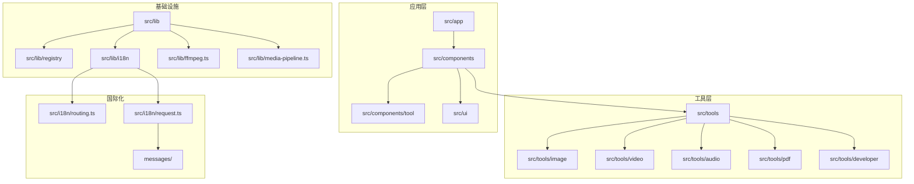
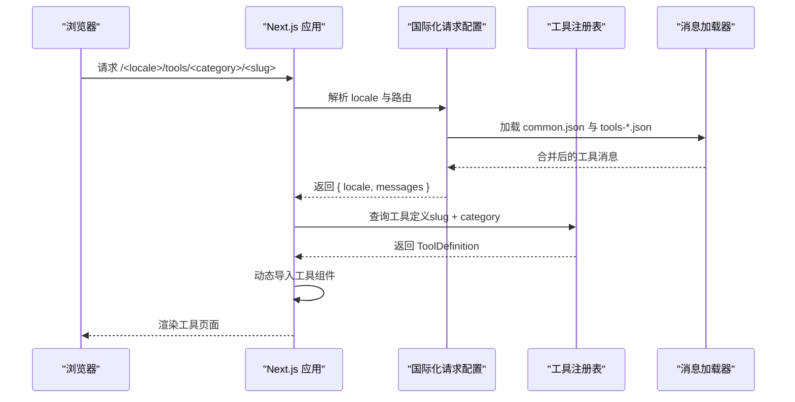
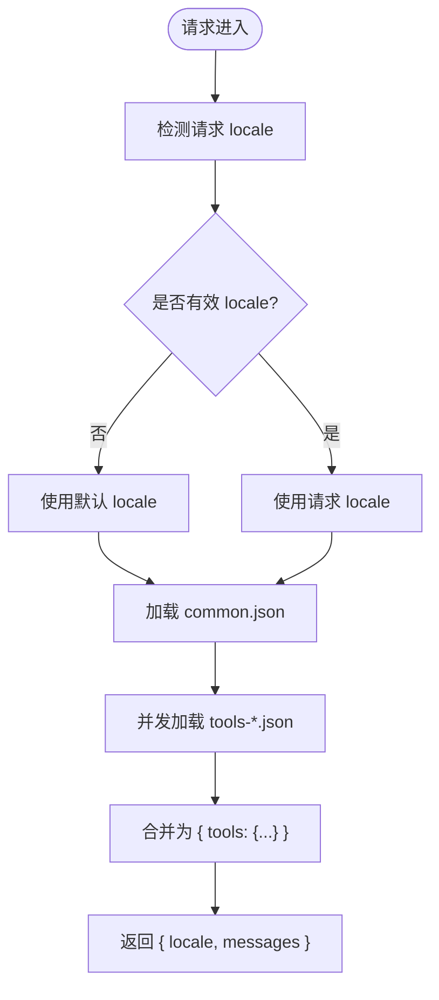
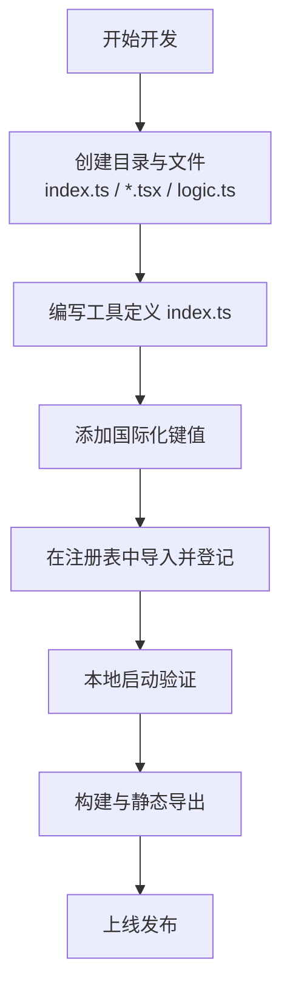
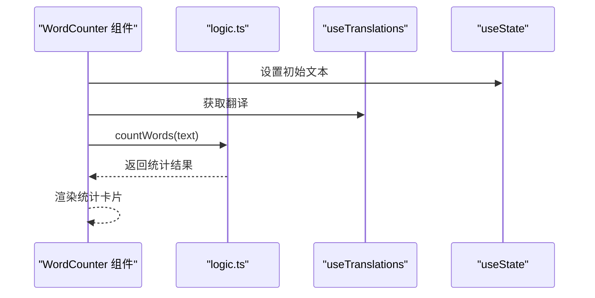
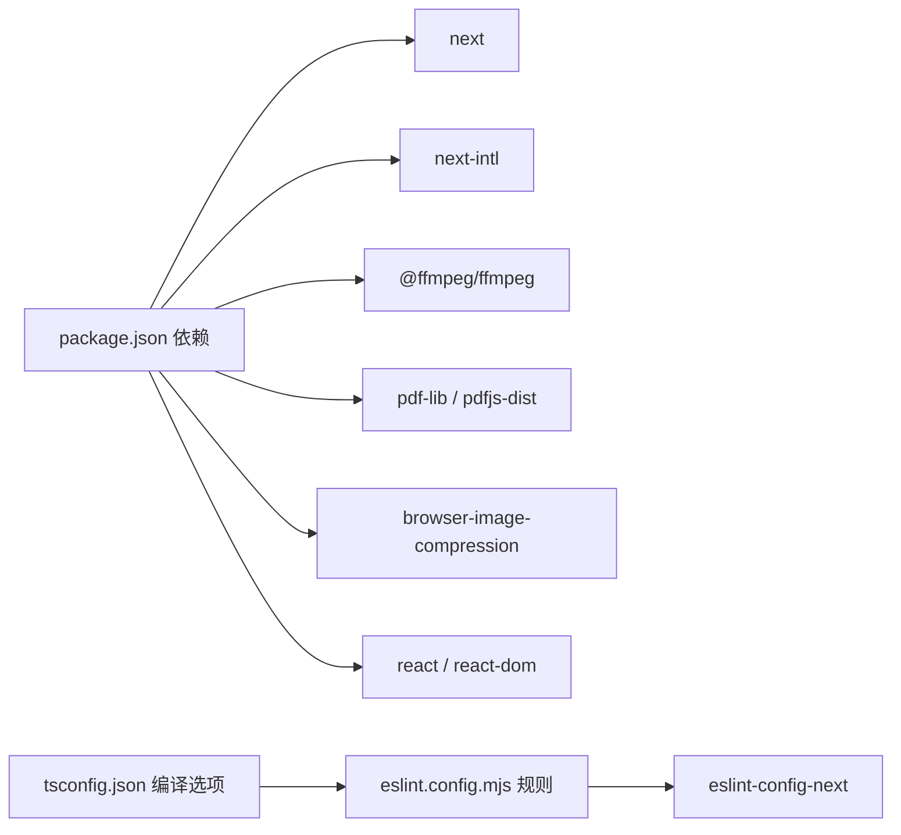

# 开发指南

<cite>
**本文引用的文件**
- [README.md](file://README.md)
- [package.json](file://package.json)
- [tsconfig.json](file://tsconfig.json)
- [eslint.config.mjs](file://eslint.config.mjs)
- [next.config.ts](file://next.config.ts)
- [.gitignore](file://.gitignore)
- [src/lib/registry/index.ts](file://src/lib/registry/index.ts)
- [src/lib/registry/types.ts](file://src/lib/registry/types.ts)
- [src/lib/i18n/loadMessages.ts](file://src/lib/i18n/loadMessages.ts)
- [src/i18n/request.ts](file://src/i18n/request.ts)
- [src/i18n/routing.ts](file://src/i18n/routing.ts)
- [src/i18n/navigation.ts](file://src/i18n/navigation.ts)
- [src/tools/developer/word-counter/index.ts](file://src/tools/developer/word-counter/index.ts)
- [src/tools/developer/word-counter/logic.ts](file://src/tools/developer/word-counter/logic.ts)
- [src/tools/developer/word-counter/WordCounter.tsx](file://src/tools/developer/word-counter/WordCounter.tsx)
- [patches/@ffmpeg__ffmpeg@0.12.15.patch](file://patches/@ffmpeg__ffmpeg@0.12.15.patch)
</cite>

## 目录
1. [简介](#简介)
2. [项目结构](#项目结构)
3. [核心组件](#核心组件)
4. [架构总览](#架构总览)
5. [详细组件分析](#详细组件分析)
6. [依赖分析](#依赖分析)
7. [性能考虑](#性能考虑)
8. [开发环境配置与HTTPS证书管理](#开发环境配置与https证书管理)
9. [故障排查指南](#故障排查指南)
10. [结论](#结论)
11. [附录](#附录)

## 简介
本指南面向新加入的开发者与项目维护者，提供媒体工具箱的完整开发规范与实践路径。内容覆盖新工具开发流程（文件结构、工具定义、国际化集成）、代码规范与最佳实践（TypeScript、ESLint、代码风格）、测试策略与质量保证（单元测试、集成测试、用户验收测试）、贡献流程与代码审查标准、开发环境设置与调试技巧、工具注册表扩展与插件模式、以及开发示例与模板。

## 项目结构
媒体工具箱采用 Next.js App Router + 静态导出（SSG）架构，核心目录组织如下：
- src/app：页面路由与布局
- src/components：共享组件与页面壳层
- src/tools：按类别划分的工具模块（image、video、audio、pdf、developer）
- src/lib：工具注册表、国际化加载器、FFmpeg 单例、媒体处理管线等
- src/i18n：国际化路由、请求配置与导航封装
- messages：多语言翻译文件（21 种语言）
- patches：第三方依赖补丁（如 FFmpeg）



**图表来源**
- [src/lib/registry/index.ts:1-164](file://src/lib/registry/index.ts#L1-L164)
- [src/lib/i18n/loadMessages.ts:1-56](file://src/lib/i18n/loadMessages.ts#L1-L56)
- [src/i18n/request.ts:1-20](file://src/i18n/request.ts#L1-L20)
- [src/i18n/routing.ts:1-18](file://src/i18n/routing.ts#L1-L18)

**章节来源**
- [README.md:55-78](file://README.md#L55-L78)

## 核心组件
- 工具注册表：集中管理工具元数据与分类，提供查询与筛选能力
- 国际化系统：基于 next-intl 的路由、请求配置与消息加载
- 媒体处理管线：FFmpeg.wasm、pdf-lib、pdfjs-dist、browser-image-compression 等
- 页面壳层与工具页面：ToolPageShell、RelatedTools、ToolFAQ 等

**章节来源**
- [src/lib/registry/index.ts:1-164](file://src/lib/registry/index.ts#L1-L164)
- [src/lib/i18n/loadMessages.ts:1-56](file://src/lib/i18n/loadMessages.ts#L1-L56)
- [src/i18n/request.ts:1-20](file://src/i18n/request.ts#L1-L20)
- [src/i18n/routing.ts:1-18](file://src/i18n/routing.ts#L1-L18)

## 架构总览
系统通过"工具注册表 + 动态导入 + 国际化消息合并"的方式，实现工具的声明式注册、按需加载与多语言支持。页面在构建时或运行时根据路由解析 locale，并加载对应的消息集。



**图表来源**
- [src/i18n/request.ts:6-19](file://src/i18n/request.ts#L6-L19)
- [src/lib/i18n/loadMessages.ts:32-55](file://src/lib/i18n/loadMessages.ts#L32-L55)
- [src/lib/registry/index.ts:139-147](file://src/lib/registry/index.ts#L139-L147)

## 详细组件分析

### 工具注册表与扩展
- 注册表职责：集中导入工具定义、提供查询接口（按 slug、category、featured 等）
- 扩展步骤：新增工具后在注册表中导入并在数组中登记，即可被路由与页面发现
- 查询接口：getAllTools、getToolBySlug、getToolsByCategory、getAllSlugs、getFeaturedTools、getNonFeaturedTools

```mermaid
classDiagram
class ToolDefinition {
+string slug
+ToolCategory category
+string icon
+boolean featured
+component
+seo
+faq[]
+relatedSlugs[]
}
class Registry {
+getAllTools() ToolDefinition[]
+getToolBySlug(slug, category?) ToolDefinition
+getToolsByCategory(category) ToolDefinition[]
+getAllSlugs() {category, slug}[]
+getFeaturedTools(category) ToolDefinition[]
+getNonFeaturedTools(category) ToolDefinition[]
}
ToolDefinition <.. Registry : "查询/过滤"
```

**图表来源**
- [src/lib/registry/index.ts:135-164](file://src/lib/registry/index.ts#L135-L164)
- [src/lib/registry/types.ts](file://src/lib/registry/types.ts)

**章节来源**
- [src/lib/registry/index.ts:1-164](file://src/lib/registry/index.ts#L1-L164)

### 国际化与消息加载
- 路由配置：定义支持的 locales、默认 locale、RTL 列表
- 请求配置：在服务端根据请求 locale 加载 common.json 与所有 tools-*.json 并合并
- 消息加载器：提供按 locale 加载公共消息、按分类加载、全量合并的能力



**图表来源**
- [src/i18n/request.ts:6-19](file://src/i18n/request.ts#L6-L19)
- [src/lib/i18n/loadMessages.ts:32-55](file://src/lib/i18n/loadMessages.ts#L32-L55)
- [src/i18n/routing.ts:3-12](file://src/i18n/routing.ts#L3-L12)

**章节来源**
- [src/i18n/request.ts:1-20](file://src/i18n/request.ts#L1-L20)
- [src/lib/i18n/loadMessages.ts:1-56](file://src/lib/i18n/loadMessages.ts#L1-L56)
- [src/i18n/routing.ts:1-18](file://src/i18n/routing.ts#L1-L18)

### 新工具开发流程（从零到上线）
- 文件结构创建：在对应分类下新建目录，包含 index.ts（工具定义）、组件文件（.tsx）、逻辑文件（logic.ts）
- 工具定义编写：在 index.ts 中声明 slug、category、icon、featured、动态组件导入、SEO、FAQ、相关工具等
- 国际化集成：在 messages/<locale>/common.json 与 messages/<locale>/tools-<category>.json 中添加键值
- 注册表扩展：在 src/lib/registry/index.ts 中导入并登记工具定义
- 本地验证：启动开发服务器，访问 /tools/<category>/<slug> 验证功能与文案



**图表来源**
- [README.md:80-84](file://README.md#L80-L84)
- [src/lib/registry/index.ts:4-63](file://src/lib/registry/index.ts#L4-L63)

**章节来源**
- [README.md:80-84](file://README.md#L80-L84)

### 示例：开发者工具"单词计数"
- 工具定义：声明 slug、category、icon、featured、动态组件导入、SEO、FAQ、相关工具
- 逻辑函数：纯函数，计算词数、字符数、句子数、段落数与阅读时长
- 客户端组件：使用状态管理与国际化钩子，渲染输入框与统计卡片



**图表来源**
- [src/tools/developer/word-counter/WordCounter.tsx:8-35](file://src/tools/developer/word-counter/WordCounter.tsx#L8-L35)
- [src/tools/developer/word-counter/logic.ts:9-21](file://src/tools/developer/word-counter/logic.ts#L9-L21)
- [src/tools/developer/word-counter/index.ts:3-25](file://src/tools/developer/word-counter/index.ts#L3-L25)

**章节来源**
- [src/tools/developer/word-counter/index.ts:1-28](file://src/tools/developer/word-counter/index.ts#L1-L28)
- [src/tools/developer/word-counter/logic.ts:1-22](file://src/tools/developer/word-counter/logic.ts#L1-L22)
- [src/tools/developer/word-counter/WordCounter.tsx:1-45](file://src/tools/developer/word-counter/WordCounter.tsx#L1-L45)

## 依赖分析
- 运行时依赖：Next.js、React、next-intl、@ffmpeg/ffmpeg、pdf-lib、pdfjs-dist、browser-image-compression 等
- 开发依赖：TypeScript、ESLint、TailwindCSS、@types/* 等
- 构建配置：Next.js 配置启用静态导出、禁用优化图片、尾随斜杠；ESLint 使用 next/core-web-vitals 与 next/typescript



**图表来源**
- [package.json:11-32](file://package.json#L11-L32)
- [package.json:33-43](file://package.json#L33-L43)
- [tsconfig.json:2-24](file://tsconfig.json#L2-L24)
- [eslint.config.mjs:1-19](file://eslint.config.mjs#L1-L19)
- [next.config.ts:6-10](file://next.config.ts#L6-L10)

**章节来源**
- [package.json:1-45](file://package.json#L1-L45)
- [tsconfig.json:1-35](file://tsconfig.json#L1-L35)
- [eslint.config.mjs:1-19](file://eslint.config.mjs#L1-L19)
- [next.config.ts:1-13](file://next.config.ts#L1-L13)

## 性能考虑
- 静态导出与 SSG：提升首屏性能与 SEO，减少运行时开销
- 动态导入：工具组件按需加载，降低初始包体积
- 并发加载：国际化消息采用 Promise.all 并发加载多个 tools-*.json
- 媒体处理：FFmpeg.wasm 在浏览器端执行，注意内存与 CPU 占用，建议提供进度反馈与取消机制
- 图片优化：在静态导出场景禁用自动优化，保持一致性

**章节来源**
- [next.config.ts:6-10](file://next.config.ts#L6-L10)
- [src/lib/i18n/loadMessages.ts:41-47](file://src/lib/i18n/loadMessages.ts#L41-L47)

## 开发环境配置与HTTPS证书管理

### 本地HTTPS证书配置
项目现已支持本地HTTPS开发环境，通过以下配置实现：

- **证书目录管理**：使用 `.cert/` 目录存储本地HTTPS证书文件
- **自动忽略机制**：.gitignore 文件已配置忽略 `.cert/` 目录，防止证书文件意外提交到版本控制
- **安全实践**：证书文件使用 `*.pem` 扩展名，符合SSL/TLS标准格式

### .gitignore 配置详解
项目的关键忽略规则包括：

```gitignore
# 本地 HTTPS 证书
.cert/
```

此配置确保：
- 本地生成的证书文件不会被提交到Git仓库
- 不同开发者的本地证书环境相互独立
- 生产环境中不会包含开发用的证书文件

### 开发环境最佳实践
- **证书生成**：使用本地SSL代理工具生成自签名证书
- **环境隔离**：每个开发者在自己的 `.cert/` 目录中管理个人证书
- **安全更新**：定期更新过期证书，避免开发环境中的安全风险
- **团队协作**：通过文档明确证书管理流程，确保团队成员遵循相同的安全标准

**章节来源**
- [.gitignore:27-28](file://.gitignore#L27-L28)

## 故障排查指南
- FFmpeg 补丁问题：若遇到版本兼容性导致的异常，检查补丁文件并确认依赖版本
- 国际化键缺失：页面出现未翻译占位符时，检查 messages/<locale> 下对应键是否存在
- 工具未显示：确认工具已在注册表中导入并登记，且 slug 与 category 正确
- 构建失败：检查 tsconfig 严格模式与 ESLint 规则，确保类型与风格符合要求
- HTTPS证书问题：检查 .cert/ 目录权限和证书文件完整性，确保证书未过期

**章节来源**
- [patches/@ffmpeg__ffmpeg@0.12.15.patch](file://patches/@ffmpeg__ffmpeg@0.12.15.patch)
- [src/lib/registry/index.ts:139-147](file://src/lib/registry/index.ts#L139-L147)
- [src/i18n/request.ts:12-13](file://src/i18n/request.ts#L12-L13)

## 结论
本指南提供了从环境搭建、工具开发、国际化集成、注册表扩展到质量保障与故障排查的全流程规范。随着本地HTTPS证书管理功能的完善，开发环境更加安全可靠。遵循这些约定可确保新增工具快速融入现有体系，同时保持一致的开发体验与高质量交付。

## 附录

### 开发环境设置与调试
- 安装依赖与启动：使用 pnpm 安装依赖并启动开发服务器
- 构建与预览：构建静态站点并进行本地预览
- 代码检查：运行 ESLint 检查并修复问题
- 调试技巧：利用动态导入定位组件加载问题；在国际化请求配置处断点检查消息合并
- HTTPS配置：确保 .cert/ 目录存在且具有正确的读写权限

**章节来源**
- [README.md:35-53](file://README.md#L35-L53)
- [package.json:5-10](file://package.json#L5-L10)
- [eslint.config.mjs:1-19](file://eslint.config.mjs#L1-L19)

### 代码规范与最佳实践
- TypeScript 配置：严格模式、增量编译、路径别名、Bundler 解析
- ESLint 规则：继承 next/core-web-vitals 与 next/typescript，自定义忽略项
- 代码风格：统一使用 Tailwind CSS v4 类名，组件命名与目录结构保持一致
- 证书管理：遵循安全最佳实践，定期更新证书，避免使用过期证书

**章节来源**
- [tsconfig.json:2-24](file://tsconfig.json#L2-L24)
- [eslint.config.mjs:5-16](file://eslint.config.mjs#L5-L16)
- [README.md:26-34](file://README.md#L26-L34)

### 测试策略与质量保证
- 单元测试：针对纯逻辑函数（如工具的 logic.ts）编写单元测试，覆盖边界条件与错误分支
- 集成测试：验证工具页面在不同 locale 下的渲染与交互，确保动态导入与国际化消息正确加载
- 用户验收测试：模拟真实用户操作（拖拽文件、点击按钮、查看结果），关注性能与可用性
- 质量门禁：提交前确保通过 ESLint、类型检查与单元测试；大改动建议进行集成测试

### 贡献流程与代码审查标准
- 提交前检查：本地运行 lint、类型检查与测试
- 提交信息：清晰描述变更目的与影响范围
- 代码审查：至少一名维护者审查；关注可读性、性能与国际化覆盖
- 合并与发布：通过 CI 后合并至主分支并进行静态导出验证

### 插件开发模式与扩展点
- 工具注册表：通过导入与登记扩展工具集合
- 国际化扩展：在 messages/<locale> 下新增键值，确保所有语言一致
- 媒体处理扩展：在 lib 下新增处理管线或封装库，保持与现有工具一致的接口风格

**章节来源**
- [src/lib/registry/index.ts:4-63](file://src/lib/registry/index.ts#L4-L63)
- [src/lib/i18n/loadMessages.ts:3-13](file://src/lib/i18n/loadMessages.ts#L3-L13)

### 模板文件与示例路径
- 工具定义模板：参见 [src/tools/developer/word-counter/index.ts:1-28](file://src/tools/developer/word-counter/index.ts#L1-L28)
- 工具逻辑模板：参见 [src/tools/developer/word-counter/logic.ts:1-22](file://src/tools/developer/word-counter/logic.ts#L1-L22)
- 工具组件模板：参见 [src/tools/developer/word-counter/WordCounter.tsx:1-45](file://src/tools/developer/word-counter/WordCounter.tsx#L1-L45)

**章节来源**
- [src/tools/developer/word-counter/index.ts:1-28](file://src/tools/developer/word-counter/index.ts#L1-L28)
- [src/tools/developer/word-counter/logic.ts:1-22](file://src/tools/developer/word-counter/logic.ts#L1-L22)
- [src/tools/developer/word-counter/WordCounter.tsx:1-45](file://src/tools/developer/word-counter/WordCounter.tsx#L1-L45)