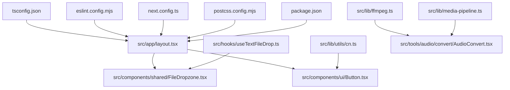
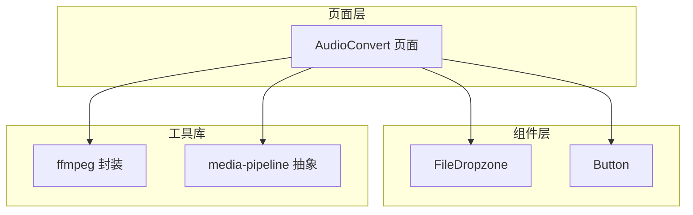
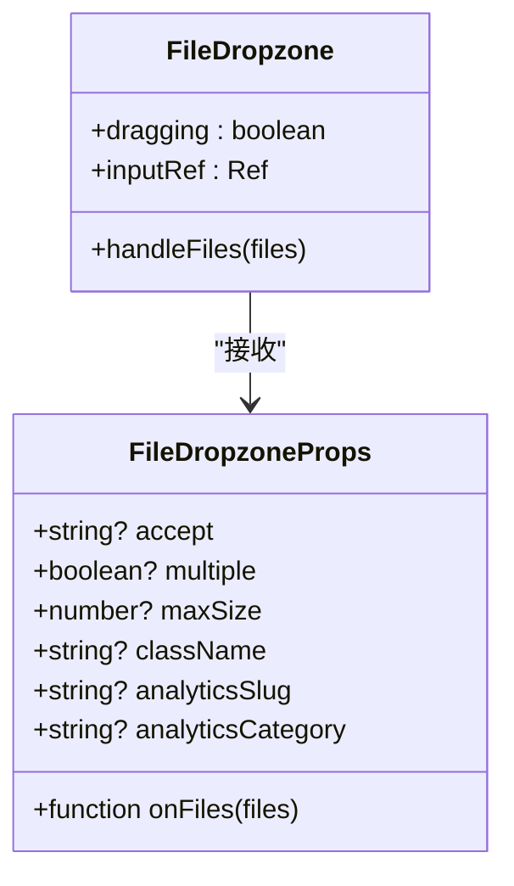
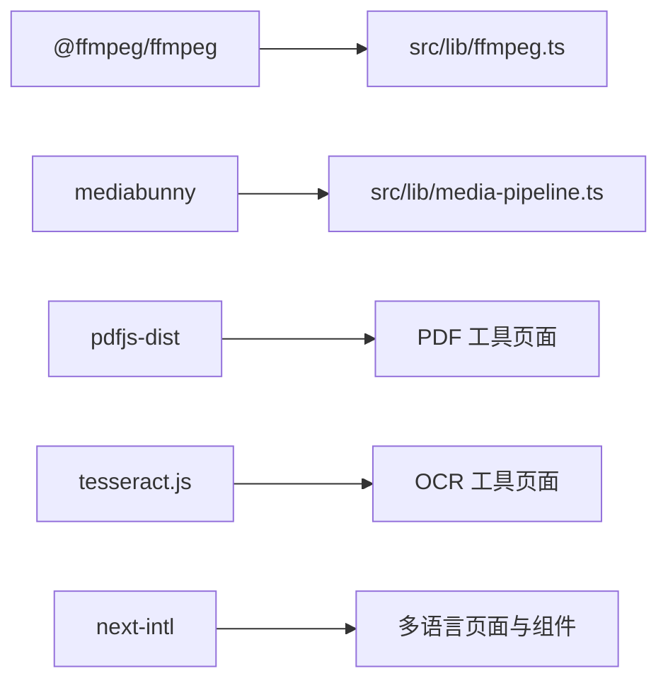

# 代码规范

<cite>
**本文引用的文件**
- [tsconfig.json](file://tsconfig.json)
- [eslint.config.mjs](file://eslint.config.mjs)
- [package.json](file://package.json)
- [next.config.ts](file://next.config.ts)
- [postcss.config.mjs](file://postcss.config.mjs)
- [src/app/layout.tsx](file://src/app/layout.tsx)
- [src/components/shared/FileDropzone.tsx](file://src/components/shared/FileDropzone.tsx)
- [src/components/ui/Button.tsx](file://src/components/ui/Button.tsx)
- [src/hooks/useTextFileDrop.ts](file://src/hooks/useTextFileDrop.ts)
- [src/lib/utils/cn.ts](file://src/lib/utils/cn.ts)
- [src/lib/ffmpeg.ts](file://src/lib/ffmpeg.ts)
- [src/lib/media-pipeline.ts](file://src/lib/media-pipeline.ts)
- [src/tools/audio/convert/AudioConvert.tsx](file://src/tools/audio/convert/AudioConvert.tsx)
</cite>

## 目录
1. [引言](#引言)
2. [项目结构](#项目结构)
3. [核心组件](#核心组件)
4. [架构总览](#架构总览)
5. [详细组件分析](#详细组件分析)
6. [依赖分析](#依赖分析)
7. [性能考虑](#性能考虑)
8. [故障排查指南](#故障排查指南)
9. [结论](#结论)
10. [附录](#附录)

## 引言
本文件为 PrivaDeck 媒体工具箱制定统一的代码规范，覆盖 TypeScript 配置与类型约束、ESLint 规则与自动修复、React 组件编写约定（函数组件命名、Hook 使用、Props 类型）、文件组织与命名约定、注释与文档标准，以及代码格式化与自动化检查流程。目标是提升代码一致性、可维护性与协作效率。

## 项目结构
项目采用 Next.js 应用结构，核心目录与职责如下：
- src/app：应用布局与页面入口，包含全局样式与元数据配置
- src/components：可复用 UI 组件与业务通用组件
- src/lib：工具库、媒体处理逻辑与第三方集成封装
- src/hooks：自定义 Hook
- src/tools：按功能域划分的工具页面与逻辑
- 配置文件：tsconfig.json、eslint.config.mjs、next.config.ts、postcss.config.mjs、package.json

**图表来源**
- [src/app/layout.tsx:1-48](file://src/app/layout.tsx#L1-L48)
- [src/components/shared/FileDropzone.tsx:1-144](file://src/components/shared/FileDropzone.tsx#L1-L144)
- [src/components/ui/Button.tsx:1-42](file://src/components/ui/Button.tsx#L1-L42)
- [src/hooks/useTextFileDrop.ts:1-75](file://src/hooks/useTextFileDrop.ts#L1-L75)
- [src/lib/utils/cn.ts:1-7](file://src/lib/utils/cn.ts#L1-L7)
- [src/lib/ffmpeg.ts:1-144](file://src/lib/ffmpeg.ts#L1-L144)
- [src/lib/media-pipeline.ts:1-105](file://src/lib/media-pipeline.ts#L1-L105)
- [src/tools/audio/convert/AudioConvert.tsx:1-86](file://src/tools/audio/convert/AudioConvert.tsx#L1-L86)
- [tsconfig.json:1-35](file://tsconfig.json#L1-L35)
- [eslint.config.mjs:1-19](file://eslint.config.mjs#L1-L19)
- [next.config.ts:1-30](file://next.config.ts#L1-L30)
- [postcss.config.mjs:1-8](file://postcss.config.mjs#L1-L8)
- [package.json:1-45](file://package.json#L1-L45)

**章节来源**
- [tsconfig.json:1-35](file://tsconfig.json#L1-L35)
- [eslint.config.mjs:1-19](file://eslint.config.mjs#L1-L19)
- [package.json:1-45](file://package.json#L1-L45)
- [next.config.ts:1-30](file://next.config.ts#L1-L30)
- [postcss.config.mjs:1-8](file://postcss.config.mjs#L1-L8)
- [src/app/layout.tsx:1-48](file://src/app/layout.tsx#L1-L48)

## 核心组件
- TypeScript 配置与路径别名：启用严格模式、禁用 emit、使用 bundler 模块解析、启用增量编译，并通过路径映射简化导入
- ESLint 集成：基于 Next.js 推荐配置，保留默认忽略项并允许在构建产物中进行检查
- 构建与导出：静态导出、图片未优化、尾随斜杠、COOP/COEP 头部安全策略
- Tailwind PostCSS：使用官方 PostCSS 插件

**章节来源**
- [tsconfig.json:1-35](file://tsconfig.json#L1-L35)
- [eslint.config.mjs:1-19](file://eslint.config.mjs#L1-L19)
- [next.config.ts:1-30](file://next.config.ts#L1-L30)
- [postcss.config.mjs:1-8](file://postcss.config.mjs#L1-L8)
- [package.json:1-45](file://package.json#L1-L45)

## 架构总览
整体采用“页面即组件”的设计，工具页面通过共享组件与 UI 组件组合实现功能；媒体处理层抽象为 lib 层，既支持 WebCodecs 硬件加速，也提供 FFmpeg 降级方案。

**图表来源**
- [src/tools/audio/convert/AudioConvert.tsx:1-86](file://src/tools/audio/convert/AudioConvert.tsx#L1-L86)
- [src/components/shared/FileDropzone.tsx:1-144](file://src/components/shared/FileDropzone.tsx#L1-L144)
- [src/components/ui/Button.tsx:1-42](file://src/components/ui/Button.tsx#L1-L42)
- [src/lib/ffmpeg.ts:1-144](file://src/lib/ffmpeg.ts#L1-L144)
- [src/lib/media-pipeline.ts:1-105](file://src/lib/media-pipeline.ts#L1-L105)

## 详细组件分析

### TypeScript 配置与类型规范
- 编译选项
  - 目标与库：ES2017、DOM、DOM Iterable、ESNext
  - 严格模式开启、禁止 emit、启用增量编译
  - 模块系统：esnext、bundler 解析、JSON 模块解析
  - JSX：react-jsx、隔离模块
  - 路径别名：@/* 映射到 ./src/*
- 包含范围：类型声明、所有 ts/tsx、Next 类型生成目录、mts
- 排除：node_modules

建议补充：
- 在 tsconfig 中加入 noUncheckedIndexedAccess 以减少索引访问风险
- 对于国际化字符串，建议引入类型安全的翻译键值映射

**章节来源**
- [tsconfig.json:1-35](file://tsconfig.json#L1-L35)

### ESLint 规则与自动修复
- 配置来源：Next.js 官方推荐规则（core-web-vitals、typescript）
- 忽略项：保留默认忽略（.next、out、build、next-env.d.ts），允许对构建产物执行检查
- 自动修复：通过脚本运行 eslint 并自动修复可修复问题

建议补充：
- 在团队内统一编辑器保存时自动触发 ESLint 修复
- 对新增规则进行评审与文档化，避免破坏既有逻辑

**章节来源**
- [eslint.config.mjs:1-19](file://eslint.config.mjs#L1-L19)
- [package.json:5-10](file://package.json#L5-L10)

### React 组件编写规范
- 函数组件命名
  - 页面组件：采用 PascalCase，如 AudioConvert
  - 工具组件：采用 PascalCase，如 FileDropzone、Button
- Hook 使用约定
  - 自定义 Hook 以 use 开头，返回值明确，避免在条件或循环中调用
  - 示例：useTextFileDrop 返回拖拽状态与事件处理器
- Props 类型定义
  - 所有外部输入参数使用接口定义，必要字段与可选字段清晰标注
  - 示例：FileDropzone 的 FileDropzoneProps
- 受控与非受控
  - 页面组件通常受控（useState 管理状态）
  - UI 组件尽量保持无状态或最小状态，通过 props 控制行为

**图表来源**
- [src/components/shared/FileDropzone.tsx:9-17](file://src/components/shared/FileDropzone.tsx#L9-L17)
- [src/components/shared/FileDropzone.tsx:42-50](file://src/components/shared/FileDropzone.tsx#L42-L50)

**章节来源**
- [src/components/shared/FileDropzone.tsx:1-144](file://src/components/shared/FileDropzone.tsx#L1-L144)
- [src/hooks/useTextFileDrop.ts:1-75](file://src/hooks/useTextFileDrop.ts#L1-L75)
- [src/components/ui/Button.tsx:1-42](file://src/components/ui/Button.tsx#L1-L42)

### 文件组织与命名约定
- 组件文件夹结构
  - 共享组件：src/components/shared
  - UI 组件：src/components/ui
  - 工具页面：src/tools/{category}/{tool}
- 工具函数分类
  - 通用工具：src/lib/utils/*
  - 媒体处理：src/lib/ffmpeg.ts、src/lib/media-pipeline.ts
  - 自定义 Hook：src/hooks/*
- 常量定义规范
  - 常量集中放置于 lib 或工具函数附近，避免魔法数
  - 示例：AudioConvert 中的格式常量数组

**章节来源**
- [src/tools/audio/convert/AudioConvert.tsx:1-86](file://src/tools/audio/convert/AudioConvert.tsx#L1-L86)
- [src/lib/ffmpeg.ts:1-144](file://src/lib/ffmpeg.ts#L1-L144)
- [src/lib/media-pipeline.ts:1-105](file://src/lib/media-pipeline.ts#L1-L105)
- [src/lib/utils/cn.ts:1-7](file://src/lib/utils/cn.ts#L1-L7)

### 代码注释与文档编写标准
- JSDoc 注释格式
  - 函数/类/接口：使用 JSDoc 注释描述用途、参数、返回值与异常
  - 错误类型：明确抛出的异常类型与触发条件
- 组件文档要求
  - Props 列表与默认值
  - 行为说明与边界条件
  - 示例用法（通过页面组件展示）

示例参考：
- 媒体管道注释：包含 WebCodecs 支持检测、回退策略与错误类型说明
- FFmpeg 封装注释：包含队列化执行、进度回调与 WORKERFS 挂载说明

**章节来源**
- [src/lib/media-pipeline.ts:1-105](file://src/lib/media-pipeline.ts#L1-L105)
- [src/lib/ffmpeg.ts:1-144](file://src/lib/ffmpeg.ts#L1-L144)

### 代码格式化工具与自动化检查流程
- 格式化与检查
  - ESLint：统一代码风格与潜在问题
  - TypeScript：类型检查与编译前验证
- 自动化流程
  - 脚本：lint、dev、build、start
  - CI/CD：可在流水线中集成 lint 与类型检查步骤

**章节来源**
- [package.json:5-10](file://package.json#L5-L10)
- [eslint.config.mjs:1-19](file://eslint.config.mjs#L1-L19)
- [tsconfig.json:1-35](file://tsconfig.json#L1-L35)

## 依赖分析
- 运行时依赖
  - 媒体处理：@ffmpeg/ffmpeg、mediabunny、pdfjs-dist、tesseract.js
  - UI：lucide-react、clsx、tailwind-merge、next-themes
  - 国际化：next-intl
- 开发依赖
  - TypeScript、ESLint、TailwindCSS

**图表来源**
- [src/lib/ffmpeg.ts:1-144](file://src/lib/ffmpeg.ts#L1-L144)
- [src/lib/media-pipeline.ts:1-105](file://src/lib/media-pipeline.ts#L1-L105)
- [package.json:11-32](file://package.json#L11-L32)

**章节来源**
- [package.json:11-32](file://package.json#L11-L32)

## 性能考虑
- 媒体处理优先级
  - WebCodecs 优先：硬件加速、低延迟
  - FFmpeg 降级：兼容性保障，但注意单线程与内存占用
- 队列化执行
  - FFmpeg 操作串行化，避免并发冲突与资源竞争
- 进度回调与内存管理
  - 进度事件过滤与清理
  - WORKERFS 挂载后及时释放临时文件与目录

**章节来源**
- [src/lib/media-pipeline.ts:1-105](file://src/lib/media-pipeline.ts#L1-L105)
- [src/lib/ffmpeg.ts:1-144](file://src/lib/ffmpeg.ts#L1-L144)

## 故障排查指南
- FFmpeg 加载失败
  - 检查 CDN 可达性与核心资源加载
  - 捕获异常并终止实例，避免状态污染
- 进度回调异常
  - 进度值范围校验（0-1），防止异常百分比
  - 回调设置与清理需原子化
- WebCodecs 不支持
  - 提供降级提示与扩展建议（如 HEVC 扩展）
  - 明确抛出错误类型以便上层捕获

**章节来源**
- [src/lib/ffmpeg.ts:14-39](file://src/lib/ffmpeg.ts#L14-L39)
- [src/lib/ffmpeg.ts:41-58](file://src/lib/ffmpeg.ts#L41-L58)
- [src/lib/media-pipeline.ts:93-105](file://src/lib/media-pipeline.ts#L93-L105)

## 结论
本规范从配置、规则、组件、文件组织、注释与自动化六个维度建立统一标准，确保 PrivaDeck 媒体工具箱在复杂媒体处理场景下仍具备高一致性与可维护性。建议在团队内定期回顾与更新规则，结合实际业务演进持续优化。

## 附录
- 元数据与全局样式
  - 全局 viewport 与 metadata 配置
  - 全局样式引入

**章节来源**
- [src/app/layout.tsx:1-48](file://src/app/layout.tsx#L1-L48)