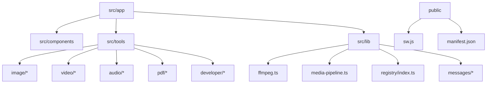
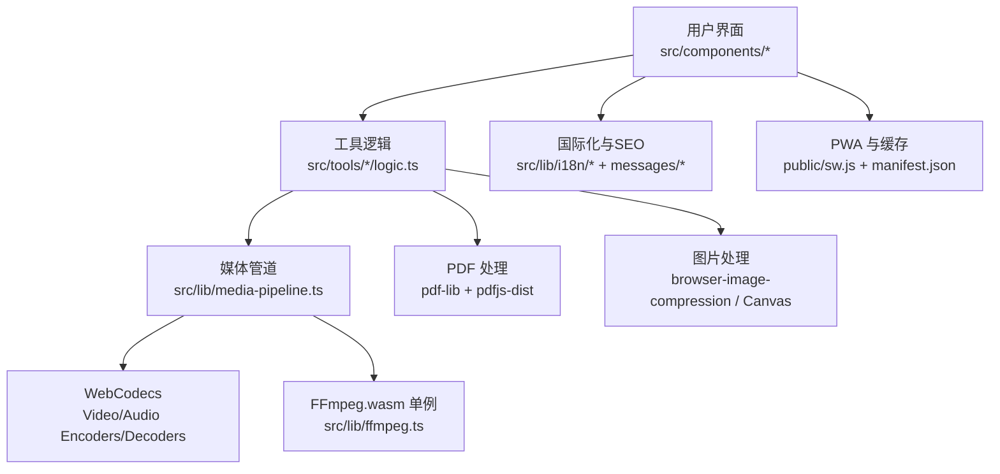
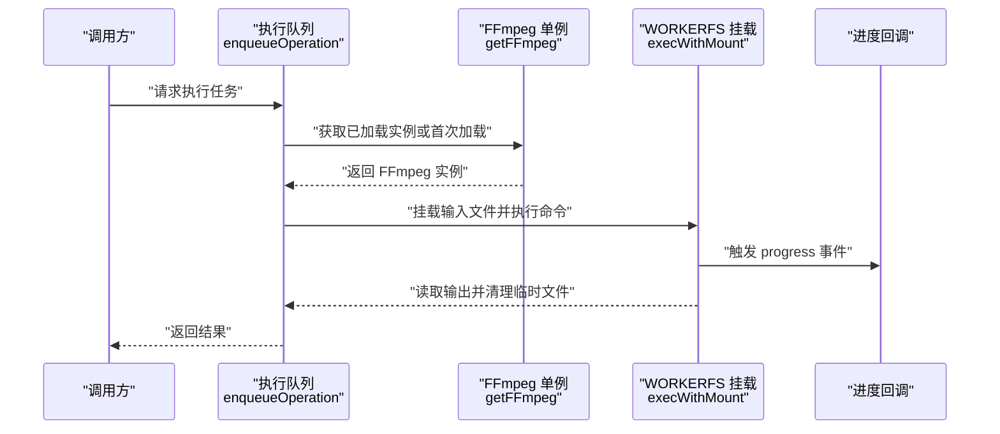
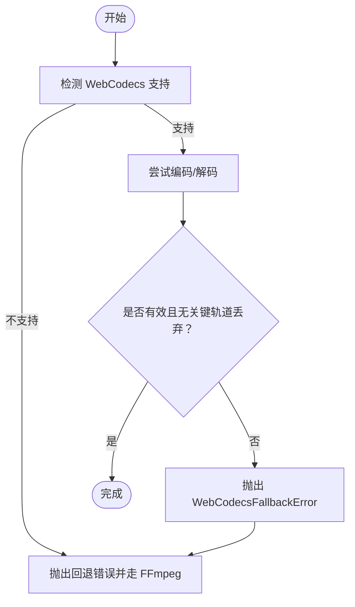
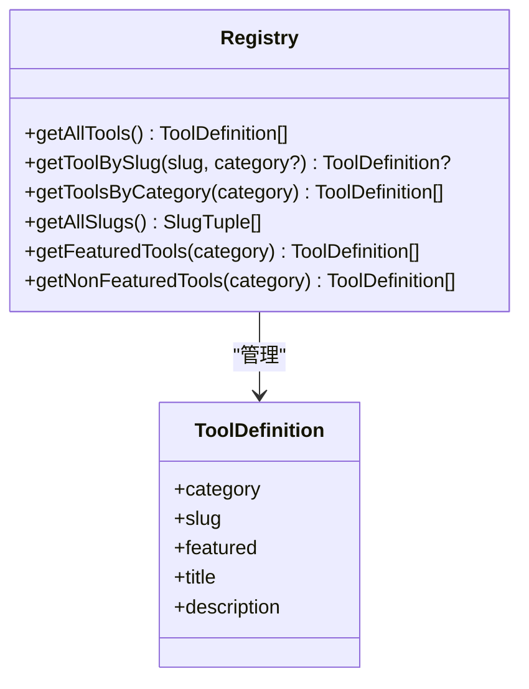
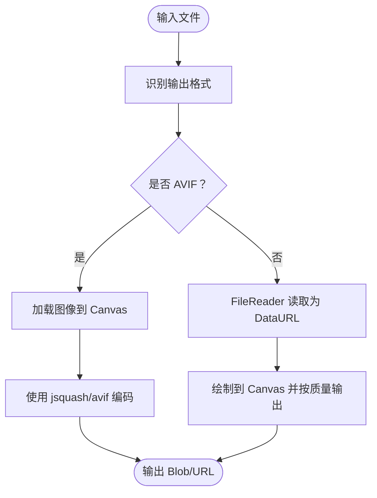
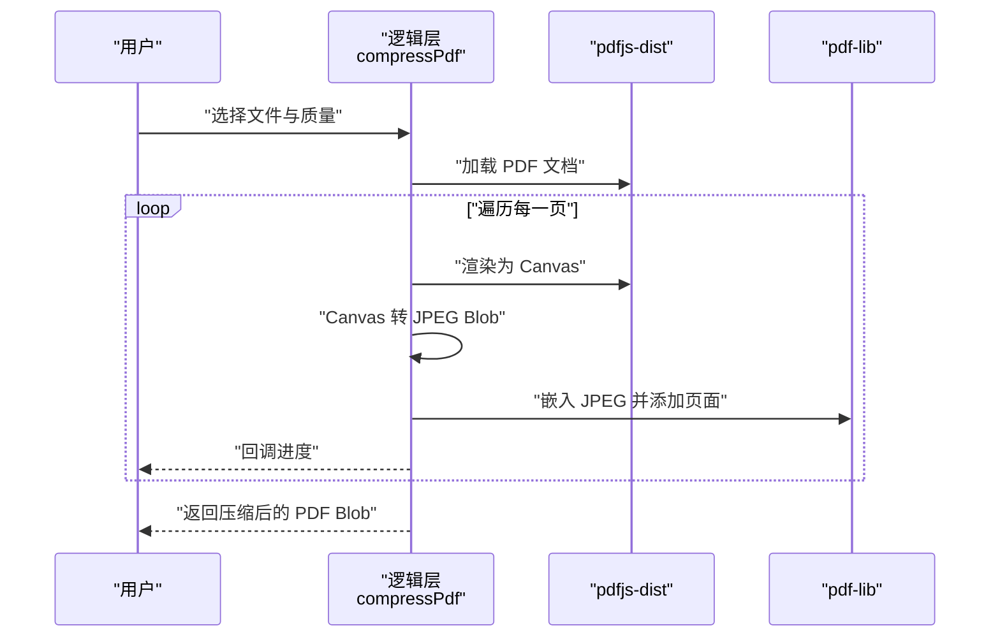
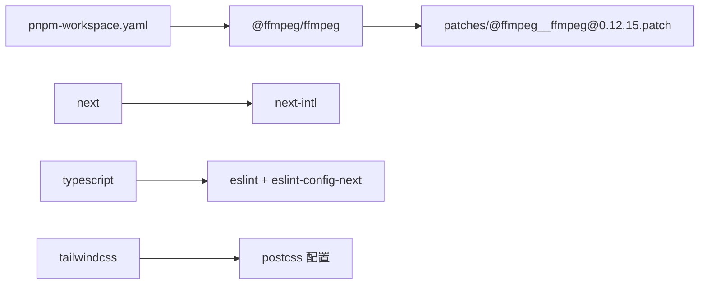

# 开发指南

<cite>
**本文引用的文件**
- [package.json](file://package.json)
- [tsconfig.json](file://tsconfig.json)
- [eslint.config.mjs](file://eslint.config.mjs)
- [next.config.ts](file://next.config.ts)
- [postcss.config.mjs](file://postcss.config.mjs)
- [pnpm-workspace.yaml](file://pnpm-workspace.yaml)
- [patches/@ffmpeg__ffmpeg@0.12.15.patch](file://patches/@ffmpeg__ffmpeg@0.12.15.patch)
- [README.md](file://README.md)
- [src/lib/ffmpeg.ts](file://src/lib/ffmpeg.ts)
- [src/lib/media-pipeline.ts](file://src/lib/media-pipeline.ts)
- [src/lib/registry/index.ts](file://src/lib/registry/index.ts)
- [src/tools/image/format-converter/logic.ts](file://src/tools/image/format-converter/logic.ts)
- [src/tools/pdf/compress/logic.ts](file://src/tools/pdf/compress/logic.ts)
</cite>

## 目录
1. [简介](#简介)
2. [项目结构](#项目结构)
3. [核心组件](#核心组件)
4. [架构总览](#架构总览)
5. [详细组件分析](#详细组件分析)
6. [依赖分析](#依赖分析)
7. [性能考虑](#性能考虑)
8. [故障排除指南](#故障排除指南)
9. [结论](#结论)
10. [附录](#附录)

## 简介
本开发指南面向希望参与 PrivaDeck 媒体工具箱项目的开发者，提供从环境搭建、代码规范、调试与开发工具、贡献流程、测试策略到维护与发布的一站式说明。PrivaDeck 是一个浏览器端多媒体工具箱，强调“零上传、零服务器”，所有处理均在本地完成，支持图片、视频、音频、PDF、开发者工具五大类共约六十个工具，并提供二十余种语言的国际化支持。

## 项目结构
项目采用 Next.js 16 App Router + 静态导出（SSG）模式，结合多语言与 PWA 能力，核心目录组织如下：
- src/app：页面与路由（App Router）
- src/components：布局、共享组件与工具页面外壳
- src/tools：按类别划分的具体工具实现（image、video、audio、pdf、developer）
- src/lib：通用库与基础设施（FFmpeg、媒体管道、国际化、SEO、分析等）
- public：静态资源与 PWA 注册脚本
- messages：多语言翻译文件（21 个 locale）
- patches：对第三方依赖的补丁（如 FFmpeg）

章节来源
- [README.md:55-78](file://README.md#L55-L78)

## 核心组件
- 构建与运行
  - 使用 pnpm 作为包管理器，提供开发、构建、启动与代码检查脚本。
  - Next.js 16，App Router，静态导出（SSG），禁用优化图片以适配静态托管。
- 类型系统与代码规范
  - TypeScript 严格模式，路径别名 @/* 指向 src/*；ESLint 使用 eslint-config-next 的 Core Web Vitals 与 TypeScript 规则。
- 样式与构建管线
  - Tailwind CSS v4，PostCSS 插件；构建时启用 Turbopack（由 pnpm dev 触发）。
- 媒体处理
  - FFmpeg.wasm（通过 @ffmpeg/ffmpeg 单例加载与队列执行）与 WebCodecs（Mediabunny）双轨方案，自动回退。
- 国际化与 SEO
  - next-intl 提供 21 种语言；静态生成页面并输出 sitemap；多语言消息文件集中管理。
- PWA 与安全头
  - PWA 注册脚本与 Service Worker；设置 COOP/COEP 以提升跨源隔离能力。

章节来源
- [package.json:1-45](file://package.json#L1-L45)
- [tsconfig.json:1-35](file://tsconfig.json#L1-L35)
- [eslint.config.mjs:1-19](file://eslint.config.mjs#L1-L19)
- [next.config.ts:1-30](file://next.config.ts#L1-L30)
- [postcss.config.mjs:1-8](file://postcss.config.mjs#L1-L8)
- [README.md:26-34](file://README.md#L26-L34)

## 架构总览
下图展示了浏览器端媒体处理的整体架构：工具逻辑在客户端执行，图片与 PDF 使用浏览器原生 API 或专用库，视频与音频通过 FFmpeg.wasm 或 WebCodecs 实现硬件加速与兼容性回退。

图表来源
- [src/lib/media-pipeline.ts:1-105](file://src/lib/media-pipeline.ts#L1-L105)
- [src/lib/ffmpeg.ts:1-144](file://src/lib/ffmpeg.ts#L1-L144)
- [src/tools/pdf/compress/logic.ts:1-73](file://src/tools/pdf/compress/logic.ts#L1-L73)
- [src/tools/image/format-converter/logic.ts:1-161](file://src/tools/image/format-converter/logic.ts#L1-L161)

章节来源
- [README.md:26-34](file://README.md#L26-L34)

## 详细组件分析

### 组件一：FFmpeg.wasm 加载与执行队列
- 设计要点
  - 单例懒加载，避免重复初始化；失败时主动终止以释放资源。
  - 进度事件统一处理，防止重复监听；支持原子化设置与清理。
  - 通过 WORKERFS 直接挂载输入文件，避免内存复制；执行完成后立即删除 MEMFS 输出以降低峰值内存。
  - 执行序列化（Promise 队列）确保 FFmpeg WASM 单线程约束下的安全性。
- 关键流程

图表来源
- [src/lib/ffmpeg.ts:75-82](file://src/lib/ffmpeg.ts#L75-L82)
- [src/lib/ffmpeg.ts:99-143](file://src/lib/ffmpeg.ts#L99-L143)

章节来源
- [src/lib/ffmpeg.ts:1-144](file://src/lib/ffmpeg.ts#L1-L144)

### 组件二：WebCodecs 媒体管道与回退机制
- 设计要点
  - 通过 WebCodecs 编解码器提供硬件加速；若检测到不支持或不兼容编解码器，则抛出自定义错误并回退至 FFmpeg。
  - 对所有轨道进行校验，避免无声或无画面的静默失败。
  - 针对 Windows + Chromium 推荐安装 HEVC 扩展以获得硬件解码能力。
- 错误类型
  - WebCodecsFallbackError：表示需要回退到 FFmpeg 的场景。
  - UnsupportedVideoCodecError：表示浏览器无法解码的编解码器，属于不可回退的终端错误。

图表来源
- [src/lib/media-pipeline.ts:7-14](file://src/lib/media-pipeline.ts#L7-L14)
- [src/lib/media-pipeline.ts:58-91](file://src/lib/media-pipeline.ts#L58-L91)

章节来源
- [src/lib/media-pipeline.ts:1-105](file://src/lib/media-pipeline.ts#L1-L105)

### 组件三：工具注册表与路由映射
- 设计要点
  - 工具注册表集中导入各工具的元数据与逻辑，按分类与特性排序，便于前端展示与导航。
  - 提供按分类、slug、是否特性工具等查询接口，支撑动态路由与页面渲染。
- 数据模型（简化）
  - ToolDefinition：包含分类、slug、名称、描述、是否特性等字段（实际类型定义位于注册表同目录的 types 文件中）。

图表来源
- [src/lib/registry/index.ts:135-164](file://src/lib/registry/index.ts#L135-L164)

章节来源
- [src/lib/registry/index.ts:1-164](file://src/lib/registry/index.ts#L1-L164)

### 组件四：图片格式转换逻辑
- 设计要点
  - 支持 PNG/JPEG/WEBP/AVIF/ICO 等格式；AVIF 使用 @jsquash/avif 编码；其他格式通过 Canvas.toBlob 输出。
  - 对 ICO 设置最大尺寸限制；计算原始与转换后的文件大小用于对比。
- 流程示意

图表来源
- [src/tools/image/format-converter/logic.ts:75-158](file://src/tools/image/format-converter/logic.ts#L75-L158)

章节来源
- [src/tools/image/format-converter/logic.ts:1-161](file://src/tools/image/format-converter/logic.ts#L1-L161)

### 组件五：PDF 压缩逻辑
- 设计要点
  - 使用 pdfjs-dist 渲染页面为 Canvas，再以指定质量转 JPEG，最后嵌入到 pdf-lib 新文档。
  - 按质量等级调整缩放比例与 JPEG 质量；逐页处理并回调进度。
- 流程示意

图表来源
- [src/tools/pdf/compress/logic.ts:12-66](file://src/tools/pdf/compress/logic.ts#L12-L66)

章节来源
- [src/tools/pdf/compress/logic.ts:1-73](file://src/tools/pdf/compress/logic.ts#L1-L73)

## 依赖分析
- 包管理器与工作区
  - 使用 pnpm；通过 pnpm-workspace.yaml 声明对 @ffmpeg/ffmpeg 的补丁路径，确保与打包器兼容。
- 第三方依赖
  - 媒体处理：@ffmpeg/ffmpeg、pdf-lib、pdfjs-dist、browser-image-compression、@jsquash/avif、tesseract.js、mediabunny。
  - 框架与样式：next、react、next-intl、tailwindcss、lucide-react。
  - 开发工具：typescript、eslint、tailwindcss。
- 补丁说明
  - patches/@ffmpeg__ffmpeg@0.12.15.patch：修正 worker 导入注释以兼容 webpack，避免打包器误解析。

图表来源
- [pnpm-workspace.yaml:1-3](file://pnpm-workspace.yaml#L1-L3)
- [patches/@ffmpeg__ffmpeg@0.12.15.patch:1-14](file://patches/@ffmpeg__ffmpeg@0.12.15.patch#L1-L14)
- [package.json:11-43](file://package.json#L11-L43)

章节来源
- [pnpm-workspace.yaml:1-3](file://pnpm-workspace.yaml#L1-L3)
- [patches/@ffmpeg__ffmpeg@0.12.15.patch:1-14](file://patches/@ffmpeg__ffmpeg@0.12.15.patch#L1-L14)
- [package.json:11-43](file://package.json#L11-L43)

## 性能考虑
- 媒体处理
  - 优先使用 WebCodecs 进行硬件加速；对不支持或不兼容的场景回退至 FFmpeg.wasm。
  - FFmpeg 执行采用 WORKERFS 直接挂载输入文件，避免内存复制；执行后立即删除 MEMFS 输出，降低峰值内存占用。
  - 图片处理使用 Canvas 并按需设置质量参数；PDF 压缩按质量等级调节缩放与 JPEG 质量。
- 构建与运行
  - 使用 pnpm 与 Turbopack 提升开发体验；静态导出（SSG）减少运行时开销。
- 国际化与 SEO
  - 静态生成页面并输出 sitemap，提升 SEO 与首屏性能；多语言消息集中管理，避免重复加载。

章节来源
- [src/lib/media-pipeline.ts:1-105](file://src/lib/media-pipeline.ts#L1-L105)
- [src/lib/ffmpeg.ts:99-143](file://src/lib/ffmpeg.ts#L99-L143)
- [src/tools/image/format-converter/logic.ts:75-158](file://src/tools/image/format-converter/logic.ts#L75-L158)
- [src/tools/pdf/compress/logic.ts:12-66](file://src/tools/pdf/compress/logic.ts#L12-L66)
- [README.md:26-34](file://README.md#L26-L34)

## 故障排除指南
- FFmpeg 加载失败
  - 现象：初始化失败或进度事件异常。
  - 排查：确认 CDN 地址可达；检查补丁是否生效；确保未并发多次加载；失败时会主动终止以释放资源。
  - 参考：[src/lib/ffmpeg.ts:14-39](file://src/lib/ffmpeg.ts#L14-L39)
- WebCodecs 不支持或编解码器不受支持
  - 现象：抛出 WebCodecsFallbackError 或 UnsupportedVideoCodecError。
  - 排查：在 Windows + Chromium 上建议安装 HEVC 扩展；检查目标编解码器是否被浏览器支持。
  - 参考：[src/lib/media-pipeline.ts:32-53](file://src/lib/media-pipeline.ts#L32-L53)
- PWA 与跨源隔离
  - 现象：跨源资源加载受限。
  - 排查：确认已设置 COOP/COEP 头；检查 Service Worker 注册与缓存策略。
  - 参考：[next.config.ts:10-26](file://next.config.ts#L10-L26)
- 依赖冲突与打包问题
  - 现象：打包器误解析 @ffmpeg/ffmpeg 的 worker 导入。
  - 解决：应用补丁，确保注释与打包器兼容。
  - 参考：[patches/@ffmpeg__ffmpeg@0.12.15.patch:1-14](file://patches/@ffmpeg__ffmpeg@0.12.15.patch#L1-L14)

章节来源
- [src/lib/ffmpeg.ts:14-39](file://src/lib/ffmpeg.ts#L14-L39)
- [src/lib/media-pipeline.ts:32-53](file://src/lib/media-pipeline.ts#L32-L53)
- [next.config.ts:10-26](file://next.config.ts#L10-L26)
- [patches/@ffmpeg__ffmpeg@0.12.15.patch:1-14](file://patches/@ffmpeg__ffmpeg@0.12.15.patch#L1-L14)

## 结论
本指南围绕 PrivaDeck 的技术栈、架构设计与开发流程提供了系统性的说明。通过严格的类型与代码规范、完善的媒体处理回退机制、以及清晰的工具注册与国际化体系，项目在保障隐私与性能的同时，也为后续扩展与维护奠定了坚实基础。

## 附录

### 环境搭建与依赖安装
- Node.js 与包管理器
  - 使用 pnpm 作为包管理器；安装依赖后即可启动开发服务器与构建。
- 依赖安装步骤
  - 安装依赖：pnpm install
  - 启动开发服务器（Turbopack）：pnpm dev
  - 构建静态站点：pnpm build
  - 代码检查：pnpm lint
- 构建产物
  - 输出目录：out/，可直接部署到静态托管平台（如 Cloudflare Pages）。

章节来源
- [README.md:35-54](file://README.md#L35-L54)
- [package.json:5-10](file://package.json#L5-L10)

### 代码规范与最佳实践
- TypeScript 配置
  - 严格模式、路径别名 @/*、ESNext 模块解析、Bundler 解析器、跳过库检查、增量编译等。
- ESLint 规则
  - 使用 eslint-config-next 的 Core Web Vitals 与 TypeScript 规则；覆盖默认忽略项，确保源码与类型文件纳入检查。
- 代码格式化
  - 通过 ESLint 与 TypeScript 生态统一风格；建议在编辑器中启用保存时自动格式化。

章节来源
- [tsconfig.json:2-24](file://tsconfig.json#L2-L24)
- [eslint.config.mjs:1-19](file://eslint.config.mjs#L1-L19)

### 调试技巧与开发工具
- 浏览器开发者工具
  - 使用 Network 面板观察 FFmpeg 核心资源加载与进度事件；Console 查看错误堆栈。
- 性能分析
  - 使用 Performance 面板记录媒体处理耗时；Memory 面板监控峰值内存（关注 MEMFS 与 Canvas）。
- 错误排查
  - 针对 WebCodecs：确认编解码器支持与 HEVC 扩展安装；针对 FFmpeg：确认 CDN 可达与补丁生效。

章节来源
- [src/lib/ffmpeg.ts:19-39](file://src/lib/ffmpeg.ts#L19-L39)
- [src/lib/media-pipeline.ts:98-104](file://src/lib/media-pipeline.ts#L98-L104)

### 贡献指南
- 代码提交规范
  - 提交信息遵循约定式提交风格（例如 feat、fix、docs、chore 等前缀）。
- Pull Request 流程
  - 从功能分支提交 PR，关联相关 issue；保持变更最小化并附带说明。
- 代码审查标准
  - 通过 ESLint 与类型检查；确保新增工具符合注册表与国际化规范；提供必要的注释与测试。

章节来源
- [src/lib/registry/index.ts:80-133](file://src/lib/registry/index.ts#L80-L133)
- [README.md:80-84](file://README.md#L80-L84)

### 测试策略与质量保证
- 单元测试
  - 针对纯函数（如解析比特率、格式转换逻辑）编写单元测试，覆盖边界条件与错误路径。
- 集成测试
  - 针对媒体处理流程（图片/视频/PDF）进行端到端验证，确保输出文件可打开且质量达标。
- 质量门禁
  - 通过 ESLint 与 TypeScript 检查；静态导出前后对比构建产物大小与页面数量。

章节来源
- [src/tools/image/format-converter/logic.ts:75-158](file://src/tools/image/format-converter/logic.ts#L75-L158)
- [src/tools/pdf/compress/logic.ts:12-66](file://src/tools/pdf/compress/logic.ts#L12-L66)

### 项目维护与更新
- 依赖升级
  - 定期更新 @ffmpeg/ffmpeg、pdf-lib、pdfjs-dist、browser-image-compression 等媒体相关依赖；应用补丁以适配打包器。
- 安全补丁
  - 关注上游安全公告，及时升级并验证构建与运行。
- 版本发布
  - 使用静态导出（SSG）产物部署至静态托管平台；更新 sitemap 与多语言消息文件。

章节来源
- [pnpm-workspace.yaml:1-3](file://pnpm-workspace.yaml#L1-L3)
- [patches/@ffmpeg__ffmpeg@0.12.15.patch:1-14](file://patches/@ffmpeg__ffmpeg@0.12.15.patch#L1-L14)
- [README.md:53](file://README.md#L53)