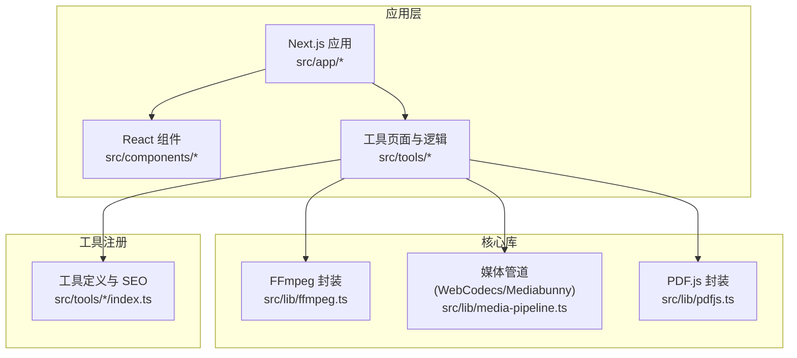
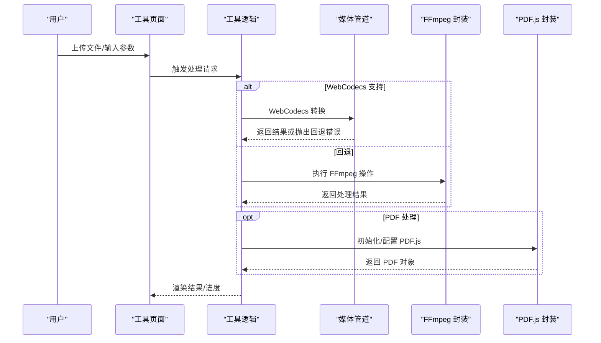
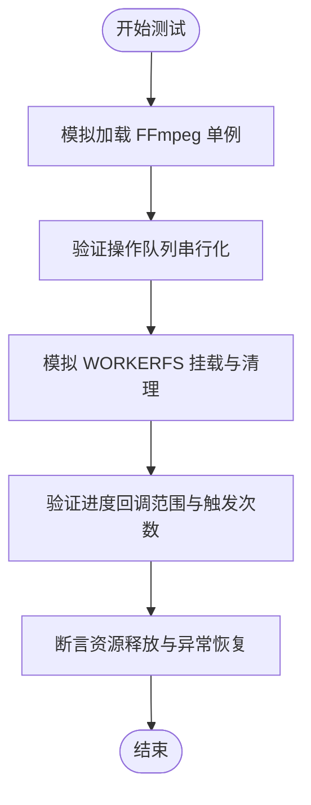
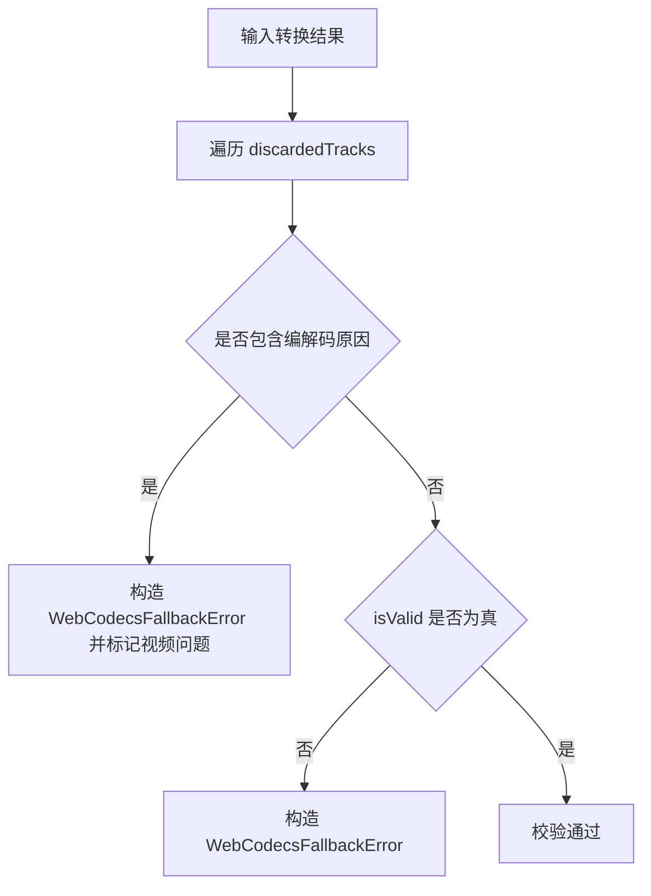
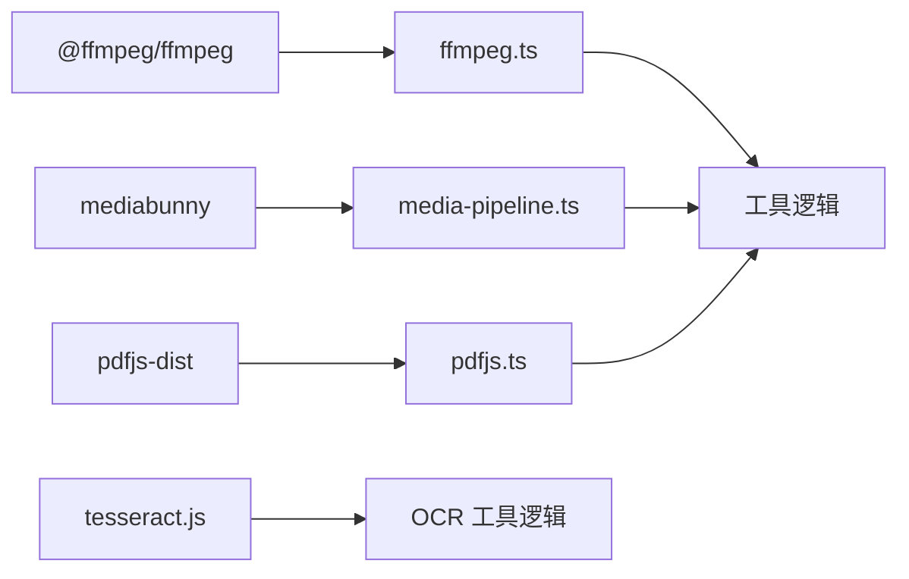

# 测试策略

<cite>
**本文引用的文件**
- [package.json](file://package.json)
- [eslint.config.mjs](file://eslint.config.mjs)
- [src/lib/ffmpeg.ts](file://src/lib/ffmpeg.ts)
- [src/lib/media-pipeline.ts](file://src/lib/media-pipeline.ts)
- [src/lib/pdfjs.ts](file://src/lib/pdfjs.ts)
- [src/tools/developer/regex-tester/index.ts](file://src/tools/developer/regex-tester/index.ts)
</cite>

## 目录
1. [引言](#引言)
2. [项目结构](#项目结构)
3. [核心组件](#核心组件)
4. [架构总览](#架构总览)
5. [详细组件分析](#详细组件分析)
6. [依赖分析](#依赖分析)
7. [性能考虑](#性能考虑)
8. [故障排查指南](#故障排查指南)
9. [结论](#结论)
10. [附录](#附录)

## 引言
本测试策略文档面向 PrivaDeck 媒体工具箱，旨在建立覆盖单元测试、组件测试、集成测试与端到端测试的完整质量保障体系。重点围绕以下方面展开：
- 单元测试框架选择与配置：结合现有 ESLint 配置与 Next.js 技术栈，推荐 Jest 或 Vitest，并明确测试环境设置与模拟对象使用。
- 媒体处理功能测试：针对 FFmpeg、WebCodecs/Mediabunny、PDF.js 等核心能力，制定文件处理、格式转换与性能测试方案。
- 组件测试策略：涵盖 React 组件渲染、用户交互与状态管理测试，确保工具页面与共享组件的可用性与一致性。
- 集成测试设计：验证工具间协作、外部 API 调用与错误处理，保证端到端流程稳定。
- 端到端测试流程：基于用户工作流验证与跨浏览器兼容性测试，确保在不同环境下的一致体验。
- 测试覆盖率与质量门禁：设定可量化的覆盖率门槛与质量门禁标准，持续提升代码质量与稳定性。

## 项目结构
项目采用 Next.js 应用结构，核心业务逻辑集中在 src/lib 与 src/tools 下，前端组件位于 src/components 与 src/app。媒体处理能力通过 FFmpeg、WebCodecs/Mediabunny 与 PDF.js 实现，工具注册与 SEO 元数据由工具定义模块提供。

**图表来源**
- [src/lib/ffmpeg.ts:1-144](file://src/lib/ffmpeg.ts#L1-L144)
- [src/lib/media-pipeline.ts:1-105](file://src/lib/media-pipeline.ts#L1-L105)
- [src/lib/pdfjs.ts:1-16](file://src/lib/pdfjs.ts#L1-L16)
- [src/tools/developer/regex-tester/index.ts:1-36](file://src/tools/developer/regex-tester/index.ts#L1-L36)

**章节来源**
- [package.json:1-45](file://package.json#L1-L45)
- [eslint.config.mjs:1-18](file://eslint.config.mjs#L1-L18)

## 核心组件
- FFmpeg 封装：提供单例加载、进度事件绑定、操作队列与 WORKERFS 挂载执行等能力，支持视频/音频处理与格式转换。
- 媒体管道：基于 WebCodecs 的硬件加速路径，提供降级回退至 FFmpeg 的容错机制与错误类型定义。
- PDF.js 封装：统一 Worker 配置，避免运行时重复初始化。
- 工具定义：每个工具通过独立 index.ts 定义路由、SEO 结构化数据与 FAQ，便于统一注册与测试。

**章节来源**
- [src/lib/ffmpeg.ts:1-144](file://src/lib/ffmpeg.ts#L1-L144)
- [src/lib/media-pipeline.ts:1-105](file://src/lib/media-pipeline.ts#L1-L105)
- [src/lib/pdfjs.ts:1-16](file://src/lib/pdfjs.ts#L1-L16)
- [src/tools/developer/regex-tester/index.ts:1-36](file://src/tools/developer/regex-tester/index.ts#L1-L36)

## 架构总览
媒体处理链路在工具页面触发，经由工具逻辑调用核心库完成处理，最终返回结果供 UI 展示或下载。WebCodecs 作为首选路径，遇不支持场景自动回退至 FFmpeg；PDF.js 用于 PDF 文本与图像提取。

**图表来源**
- [src/lib/media-pipeline.ts:1-105](file://src/lib/media-pipeline.ts#L1-L105)
- [src/lib/ffmpeg.ts:1-144](file://src/lib/ffmpeg.ts#L1-L144)
- [src/lib/pdfjs.ts:1-16](file://src/lib/pdfjs.ts#L1-L16)

## 详细组件分析

### FFmpeg 封装测试策略
- 单元测试要点
  - 加载与缓存：验证单例加载、失败重试与实例复用。
  - 进度事件：断言进度回调在 0-100 区间内触发且仅一次。
  - 操作队列：确保并发调用被串行化，避免挂载点冲突。
  - WORKERFS 挂载：验证输入文件安全命名、只读挂载与清理。
- 模拟对象
  - 使用 jest.fn 或 vitest.fn 模拟 FFmpeg 实例与事件监听器。
  - 使用 Blob 与 ArrayBuffer 模拟文件输入输出。
- 性能测试
  - 基于不同文件大小与编码参数测量处理耗时与内存峰值。
  - 对比串行队列与并发直连的吞吐差异。

**图表来源**
- [src/lib/ffmpeg.ts:75-82](file://src/lib/ffmpeg.ts#L75-L82)
- [src/lib/ffmpeg.ts:99-143](file://src/lib/ffmpeg.ts#L99-L143)

**章节来源**
- [src/lib/ffmpeg.ts:1-144](file://src/lib/ffmpeg.ts#L1-L144)

### 媒体管道测试策略
- 单元测试要点
  - 能力检测：在不同浏览器 UA 下验证 WebCodecs 支持判断。
  - 解析与校验：验证码率字符串解析与转换。
  - 错误类型：断言 WebCodecsFallbackError 与 UnsupportedVideoCodecError 的触发条件与字段。
  - 转换有效性：验证 track 校验与丢弃原因过滤。
- 模拟对象
  - 使用 jsdom 或浏览器沙箱模拟全局 WebCodecs API。
  - 使用伪造的转换结果对象断言校验逻辑。
- 性能测试
  - 在真实设备上对比 WebCodecs 与 FFmpeg 的处理时间与功耗。
  - 针对高分辨率与高码率场景进行压力测试。

**图表来源**
- [src/lib/media-pipeline.ts:59-91](file://src/lib/media-pipeline.ts#L59-L91)

**章节来源**
- [src/lib/media-pipeline.ts:1-105](file://src/lib/media-pipeline.ts#L1-L105)

### PDF.js 封装测试策略
- 单元测试要点
  - 初始化幂等：验证多次调用不会重复配置 Worker。
  - 路径解析：断言 workerSrc 通过 import.meta.url 正确拼接。
- 模拟对象
  - 使用 jsdom 设置全局环境变量以模拟浏览器行为。
- 集成测试
  - 与工具逻辑联调，验证 PDF 文本/图像提取流程。

**章节来源**
- [src/lib/pdfjs.ts:1-16](file://src/lib/pdfjs.ts#L1-L16)

### 工具定义与注册测试策略
- 单元测试要点
  - 工具元数据：验证 slug、category、icon、SEO 结构化数据与 FAQ 列表完整性。
  - 动态导入：断言组件按需加载与错误边界。
- 集成测试
  - 与路由系统联调，验证工具页面可达性与 SEO 内容渲染。

**章节来源**
- [src/tools/developer/regex-tester/index.ts:1-36](file://src/tools/developer/regex-tester/index.ts#L1-L36)

## 依赖分析
- 外部依赖
  - 媒体处理：@ffmpeg/ffmpeg、mediabunny、pdfjs-dist、tesseract.js。
  - 图像处理：browser-image-compression、@jsquash/avif、heic2any。
  - 开发工具：ESLint、TypeScript、TailwindCSS。
- 内部耦合
  - 工具页面依赖核心库实现具体功能；工具定义模块提供统一注册入口。
- 循环依赖风险
  - 当前结构清晰，无明显循环依赖迹象。

**图表来源**
- [package.json:11-32](file://package.json#L11-L32)
- [src/lib/ffmpeg.ts:1-144](file://src/lib/ffmpeg.ts#L1-L144)
- [src/lib/media-pipeline.ts:1-105](file://src/lib/media-pipeline.ts#L1-L105)
- [src/lib/pdfjs.ts:1-16](file://src/lib/pdfjs.ts#L1-L16)

**章节来源**
- [package.json:1-45](file://package.json#L1-L45)

## 性能考虑
- WebCodecs 优先：在支持的浏览器中启用硬件加速，降低 CPU 占用与能耗。
- FFmpeg 队列化：通过 Promise 队列串行化操作，避免并发挂载冲突与内存抖动。
- WORKERFS 挂载：减少内存拷贝，提高大文件处理效率。
- Worker 配置：PDF.js Worker 路径一次性配置，避免重复初始化开销。
- 性能监控：建议在 CI 中记录关键指标（处理耗时、内存峰值、CPU 百分比），并设置阈值告警。

## 故障排查指南
- FFmpeg 加载失败
  - 现象：加载 Promise 拒绝或实例未就绪。
  - 排查：检查 CDN 可达性、WASM 加载权限与网络策略。
  - 处理：捕获异常后终止实例并提示用户重试。
- 进度回调异常
  - 现象：进度值越界或未触发。
  - 排查：确认事件监听绑定与移除时机。
  - 处理：在队列入口与出口统一设置/清除处理器。
- WebCodecs 不支持
  - 现象：抛出 WebCodecsFallbackError 或 UnsupportedVideoCodecError。
  - 排查：检查 UA 字符串与编解码器支持情况。
  - 处理：自动回退至 FFmpeg 并提示用户安装扩展（如 HEVC）。
- PDF.js Worker 未配置
  - 现象：PDF 提取失败或报错。
  - 排查：确认 workerSrc 路径与 import.meta.url 解析。
  - 处理：确保初始化函数仅执行一次。

**章节来源**
- [src/lib/ffmpeg.ts:20-38](file://src/lib/ffmpeg.ts#L20-L38)
- [src/lib/ffmpeg.ts:41-58](file://src/lib/ffmpeg.ts#L41-L58)
- [src/lib/media-pipeline.ts:32-53](file://src/lib/media-pipeline.ts#L32-L53)
- [src/lib/pdfjs.ts:3-13](file://src/lib/pdfjs.ts#L3-L13)

## 结论
通过在现有 Next.js 与 TypeScript 基础上引入完善的测试策略，结合 FFmpeg、WebCodecs/Mediabunny 与 PDF.js 的核心能力，可有效保障媒体工具箱的功能正确性、性能稳定性与用户体验一致性。建议在 CI 中强制执行覆盖率与质量门禁，持续迭代测试用例以覆盖新增工具与边缘场景。

## 附录
- 测试框架选型建议
  - 单元测试：Vitest（默认支持 ES Module 与快照，与现有构建链路契合）。
  - 组件测试：React Testing Library（关注用户行为与可访问性）。
  - 集成测试：Playwright（跨浏览器与真实用户交互）。
- 质量门禁建议
  - 行为覆盖率：核心模块不低于 80%，工具逻辑不低于 70%。
  - 代码覆盖率：整体语句与分支不低于 75%，关键路径不低于 85%。
  - ESLint 与类型检查：全量通过，禁止新增警告级别规则。
- 跨浏览器兼容性
  - 在 Chrome、Firefox、Safari、Edge 上验证 WebCodecs 与 FFmpeg 路径表现。
  - 针对 Windows + Chromium 场景提示 HEVC 扩展安装。