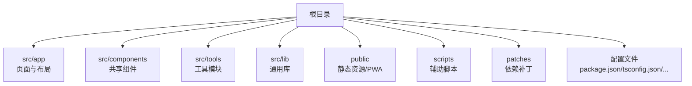
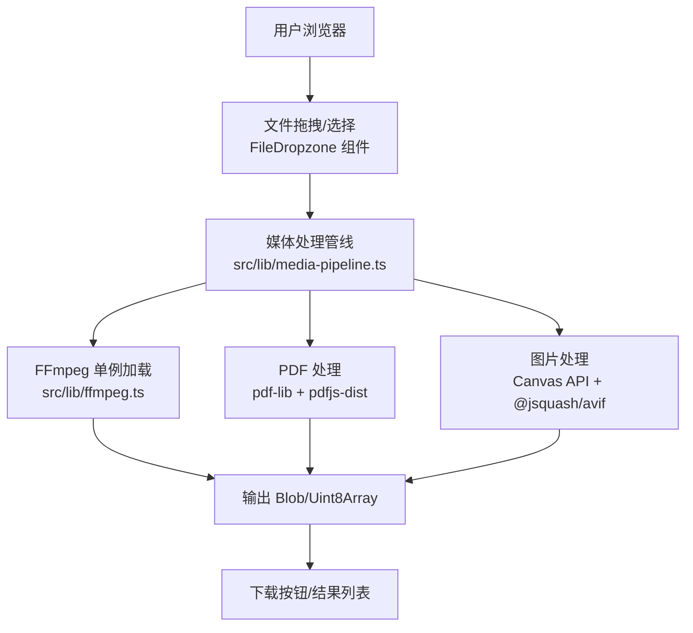
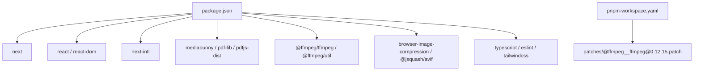

# 环境搭建

<cite>
**本文引用的文件**
- [package.json](file://package.json)
- [pnpm-workspace.yaml](file://pnpm-workspace.yaml)
- [README.md](file://README.md)
- [next.config.ts](file://next.config.ts)
- [tsconfig.json](file://tsconfig.json)
- [eslint.config.mjs](file://eslint.config.mjs)
- [postcss.config.mjs](file://postcss.config.mjs)
- [patches/@ffmpeg__ffmpeg@0.12.15.patch](file://patches/@ffmpeg__ffmpeg@0.12.15.patch)
- [scripts/clean-rsc.mjs](file://scripts/clean-rsc.mjs)
- [src/lib/ffmpeg.ts](file://src/lib/ffmpeg.ts)
- [src/lib/pdfjs.ts](file://src/lib/pdfjs.ts)
- [src/app/layout.tsx](file://src/app/layout.tsx)
- [src/components/shared/FileDropzone.tsx](file://src/components/shared/FileDropzone.tsx)
</cite>

## 目录
1. [简介](#简介)
2. [项目结构](#项目结构)
3. [核心组件](#核心组件)
4. [架构总览](#架构总览)
5. [详细组件分析](#详细组件分析)
6. [依赖分析](#依赖分析)
7. [性能考虑](#性能考虑)
8. [故障排除指南](#故障排除指南)
9. [结论](#结论)
10. [附录](#附录)

## 简介
本指南面向 PrivaDeck 媒体工具箱的本地开发环境搭建，覆盖 Node.js 版本与包管理器选择、依赖安装、TypeScript 与 Next.js 开发服务器配置、浏览器兼容性、开发工具链（VS Code 插件、调试与热重载），以及 Windows/macOS/Linux 的差异与注意事项，并提供常见问题排查方案。

## 项目结构
该项目采用 Next.js App Router + 静态导出（SSG）模式，核心目录与职责概览如下：
- src/app：页面与布局（App Router）
- src/components：共享组件与工具页面壳层
- src/tools：五大类工具模块（图片、视频、音频、PDF、开发者）
- src/lib：通用库（FFmpeg、PDFJS、SEO、国际化等）
- public：静态资源与 PWA 清单
- scripts：辅助脚本（如 RSC 清理）
- patches：对第三方依赖的补丁（如 FFmpeg）

章节来源
- [README.md: 第55行至第78行:55-78](file://README.md#L55-L78)

## 核心组件
- 包管理器与版本要求
  - 推荐使用 pnpm（工作区与补丁支持良好）
  - Node.js 版本建议使用 LTS（当前主流 LTS 为 18.x/20.x/22.x），确保与 TypeScript 5、Next.js 16、Tailwind CSS v4 兼容
- 依赖安装
  - 使用 pnpm 安装：pnpm install
  - 若需应用 FFmpeg 补丁，确保补丁路径正确且已应用
- 开发服务器
  - pnpm dev 启动 Next.js 开发服务器（Turbopack 加速）
  - 访问 http://localhost:3000
- 构建与导出
  - pnpm build 执行静态导出（output: export），产物位于 out/
- 代码质量
  - pnpm lint 运行 ESLint（基于 eslint-config-next/typescript 与 core-web-vitals）

章节来源
- [README.md: 第35行至第51行:35-51](file://README.md#L35-L51)
- [package.json: 第5行至第10行:5-10](file://package.json#L5-L10)
- [pnpm-workspace.yaml: 第1行至第3行:1-3](file://pnpm-workspace.yaml#L1-L3)

## 架构总览
下图展示浏览器端媒体处理的关键链路：用户上传文件 → 浏览器内处理（FFmpeg.wasm、pdf-lib、Canvas API）→ 生成结果并下载。

图表来源
- [src/components/shared/FileDropzone.tsx: 第42行至第76行:42-76](file://src/components/shared/FileDropzone.tsx#L42-L76)
- [src/lib/ffmpeg.ts: 第10行至第39行:10-39](file://src/lib/ffmpeg.ts#L10-L39)
- [src/lib/pdfjs.ts: 第3行至第13行:3-13](file://src/lib/pdfjs.ts#L3-L13)

## 详细组件分析

### TypeScript 与编译配置
- 目标与模块
  - 目标：ES2017
  - 模块：esnext
  - 解析器：bundler
- 关键选项
  - strict 严格模式
  - noEmit 不输出 JS（由 Next.js/TS 编译器处理）
  - isolatedModules 与增量编译提升开发体验
  - JSX：react-jsx
  - 路径别名：@/*
- 与 Next.js 集成
  - 通过 plugins: [{ name: "next" }] 与 Next 类型系统集成

章节来源
- [tsconfig.json: 第2行至第24行:2-24](file://tsconfig.json#L2-L24)

### Next.js 配置与静态导出
- 静态导出
  - output: export，构建后可直接部署到静态托管平台
- 图片优化
  - images: { unoptimized: true }，配合静态导出禁用自动优化
- 跨源策略
  - 设置 COOP/COEP 头以支持 SharedArrayBuffer（多线程加速）
- 国际化
  - 使用 next-intl 插件，结合多语言消息文件

章节来源
- [next.config.ts: 第6行至第27行:6-27](file://next.config.ts#L6-L27)

### ESLint 与代码规范
- 配置来源
  - 基于 eslint-config-next 的 core-web-vitals 与 typescript 规则
  - 自定义忽略项覆盖默认忽略（如 .next、out、build、next-env.d.ts）
- 建议
  - 在编辑器中启用 ESLint 实时检查
  - 提交前执行 pnpm lint

章节来源
- [eslint.config.mjs: 第1行至第18行:1-18](file://eslint.config.mjs#L1-L18)

### PostCSS 与 Tailwind CSS v4
- PostCSS 插件
  - @tailwindcss/postcss：启用 Tailwind 指令
- 建议
  - 保持 tailwindcss 与 @tailwindcss/postcss 版本一致，避免指令冲突

章节来源
- [postcss.config.mjs: 第1行至第7行:1-7](file://postcss.config.mjs#L1-L7)

### FFmpeg 补丁与浏览器兼容
- 补丁作用
  - 修复 FFmpeg.wasm 在特定打包器下的导入行为，确保在 Next.js 静态导出场景下正常加载核心资源
- 兼容性要点
  - SharedArrayBuffer 支持：用于多线程加速；不支持时回退单线程
  - COOP/COEP 头：确保跨源隔离，启用 SAB
- 资源加载
  - FFmpeg 核心脚本与 WASM 通过 CDN 动态加载，首次加载可能较慢

章节来源
- [patches/@ffmpeg__ffmpeg@0.12.15.patch: 第1行至第14行:1-14](file://patches/@ffmpeg__ffmpeg@0.12.15.patch#L1-L14)
- [src/lib/ffmpeg.ts: 第60行至第62行:60-62](file://src/lib/ffmpeg.ts#L60-L62)
- [next.config.ts: 第16行至第25行:16-25](file://next.config.ts#L16-L25)

### RSC 清理脚本
- 用途
  - 清理 out/ 目录中的 .txt 文件与空目录，减少静态导出产物体积
- 使用时机
  - 构建后或清理缓存时运行

章节来源
- [scripts/clean-rsc.mjs: 第1行至第36行:1-36](file://scripts/clean-rsc.mjs#L1-L36)

## 依赖分析
- 运行时依赖
  - Next.js 16、React 19、next-intl、pdf-lib、pdfjs-dist、@ffmpeg/ffmpeg、browser-image-compression、@jsquash/avif 等
- 开发依赖
  - TypeScript 5、ESLint 9、Tailwind CSS v4、相关类型声明
- 工作区与补丁
  - pnpm workspace + patchedDependencies 应用于 @ffmpeg/ffmpeg

图表来源
- [package.json: 第11行至第43行:11-43](file://package.json#L11-L43)
- [pnpm-workspace.yaml: 第1行至第3行:1-3](file://pnpm-workspace.yaml#L1-L3)

章节来源
- [package.json: 第11行至第43行:11-43](file://package.json#L11-L43)
- [pnpm-workspace.yaml: 第1行至第3行:1-3](file://pnpm-workspace.yaml#L1-L3)

## 性能考虑
- 首次加载
  - FFmpeg.wasm 核心脚本与 WASM 体积较大，建议在用户交互时按需触发加载
- 内存与并发
  - FFmpeg WASM 单线程，内部使用 Promise 队列串行执行任务，避免挂载点冲突
  - Canvas 渲染后及时释放内存（如 PDF 压缩后重置画布尺寸）
- 导出体积
  - 使用 clean-rsc.mjs 清理 out/ 中冗余文件，降低部署体积

章节来源
- [src/lib/ffmpeg.ts: 第75行至第82行:75-82](file://src/lib/ffmpeg.ts#L75-L82)
- [src/tools/pdf/compress/logic.ts: 第45行](file://src/tools/pdf/compress/logic.ts#L45)

## 故障排除指南
- pnpm 安装失败或依赖冲突
  - 清理 node_modules/.pnpm 并重新安装
  - 确认 Node.js 版本与依赖兼容（TypeScript 5、Next.js 16、Tailwind v4）
- FFmpeg 加载失败
  - 检查补丁是否生效（patches/@ffmpeg__ffmpeg@0.12.15.patch）
  - 确认网络可达 CDN 地址（核心脚本与 WASM）
  - 若浏览器不支持 SharedArrayBuffer，需移除 COOP/COEP 或降级为单线程
- 静态导出后页面空白
  - 确认 next.config.ts 的 output: export、images.unoptimized: true
  - 构建后检查 out/ 是否存在
- ESLint 报错
  - 使用 pnpm lint 修复或在编辑器中启用 ESLint
- PWA/Manifest 问题
  - 确认 public/ 下的 manifest.json、robots.txt、sw.js 存在
  - 根布局 metadata/viewport 正确配置

章节来源
- [patches/@ffmpeg__ffmpeg@0.12.15.patch: 第1行至第14行:1-14](file://patches/@ffmpeg__ffmpeg@0.12.15.patch#L1-L14)
- [next.config.ts: 第6行至第27行:6-27](file://next.config.ts#L6-L27)
- [eslint.config.mjs: 第1行至第18行:1-18](file://eslint.config.mjs#L1-L18)
- [src/app/layout.tsx: 第10行至第39行:10-39](file://src/app/layout.tsx#L10-L39)

## 结论
本指南提供了 PrivaDeck 媒体工具箱从零搭建开发环境的完整流程：Node.js 与 pnpm 选择、依赖安装、TypeScript 与 Next.js 配置、浏览器兼容性与性能优化、开发工具链与常见问题排查。遵循上述步骤可在 Windows/macOS/Linux 上快速建立稳定高效的本地开发环境。

## 附录

### 开发工具链配置（VS Code）
- 推荐扩展
  - ESLint、TypeScript TSServer、Tailwind CSS IntelliSense、EditorConfig、Prettier
- 调试配置（launch.json）
  - 使用 Edge/Chrome 调试 localhost:3000，启用断点与源码映射
- 热重载
  - pnpm dev 默认启用 Turbopack，修改文件后自动刷新

### 跨平台差异与注意事项
- Windows
  - 注意长路径与权限问题；确保 pnpm 与 Node.js 权限足够
  - FFmpeg CDN 加载可能受代理影响，必要时配置网络
- macOS
  - 默认 Shell 为 zsh；确保 PATH 包含 pnpm 与 Node.js
  - Safari 对 SharedArrayBuffer 支持需满足跨源隔离条件
- Linux
  - 部分发行版需单独安装 pnpm；确认系统时间与证书有效
  - 静态导出后部署到 Nginx/Apache 时注意 MIME 类型与缓存头