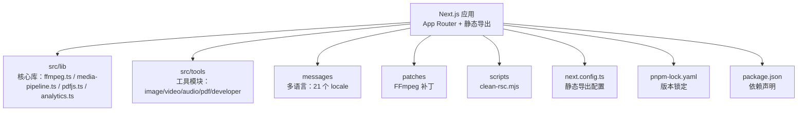
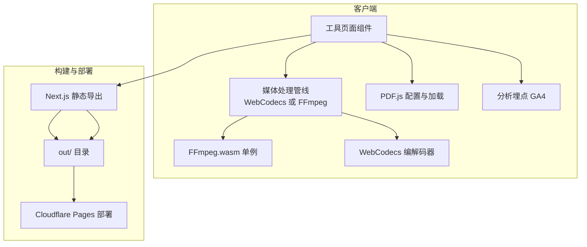
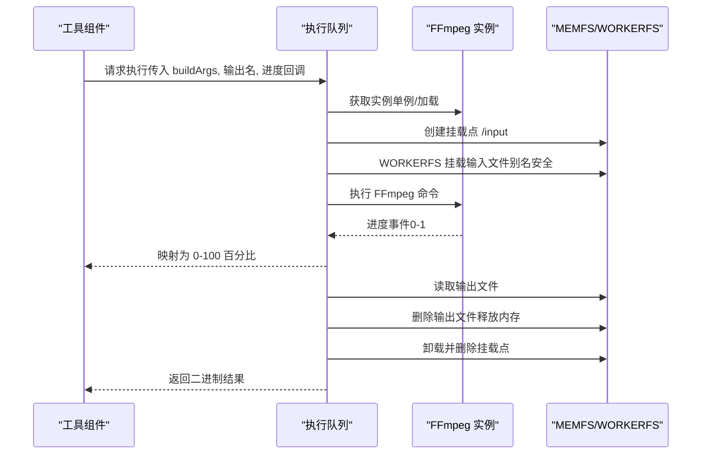
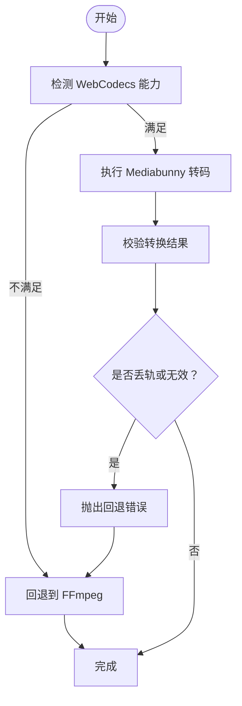
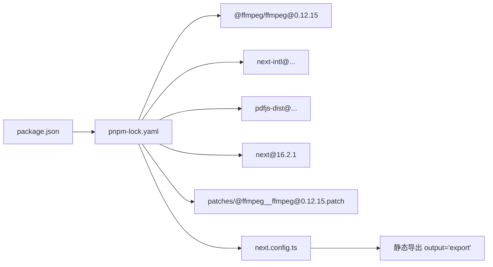

# 维护更新

<cite>
**本文引用的文件**   
- [package.json](file://package.json)
- [pnpm-lock.yaml](file://pnpm-lock.yaml)
- [scripts/clean-rsc.mjs](file://scripts/clean-rsc.mjs)
- [patches/@ffmpeg__ffmpeg@0.12.15.patch](file://patches/@ffmpeg__ffmpeg@0.12.15.patch)
- [src/lib/ffmpeg.ts](file://src/lib/ffmpeg.ts)
- [src/lib/media-pipeline.ts](file://src/lib/media-pipeline.ts)
- [src/lib/pdfjs.ts](file://src/lib/pdfjs.ts)
- [src/lib/analytics.ts](file://src/lib/analytics.ts)
- [next.config.ts](file://next.config.ts)
- [eslint.config.mjs](file://eslint.config.mjs)
- [tsconfig.json](file://tsconfig.json)
- [README.md](file://README.md)
- [CLAUDE.md](file://CLAUDE.md)
- [src/lib/registry/index.ts](file://src/lib/registry/index.ts)
</cite>

## 目录
1. [简介](#简介)
2. [项目结构](#项目结构)
3. [核心组件](#核心组件)
4. [架构总览](#架构总览)
5. [详细组件分析](#详细组件分析)
6. [依赖关系分析](#依赖关系分析)
7. [性能考量](#性能考量)
8. [故障排查指南](#故障排查指南)
9. [结论](#结论)
10. [附录](#附录)

## 简介
本指南面向 PrivaDeck 媒体工具箱的维护与更新工作，聚焦以下方面：
- 依赖包管理策略：版本锁定、安全更新、兼容性检查
- 补丁管理与第三方库集成：FFmpeg 补丁应用、浏览器兼容性处理
- 构建优化与清理流程：RSC 清理脚本、缓存管理
- 版本发布流程：变更日志生成、标签创建、部署准备
- 监控与日志分析：性能指标收集、错误统计
- 安全更新与漏洞修复流程
- 文档同步与国际化更新策略

## 项目结构
项目采用 Next.js App Router + 静态导出（SSG）模式，核心目录与职责如下：
- src/lib：核心库与工具封装（FFmpeg、WebCodecs、PDF.js、分析）
- src/tools：五大工具分类（image/video/audio/pdf/developer）
- messages：多语言翻译（21 个 locale）
- patches：对第三方库的补丁
- scripts：构建辅助脚本（如 RSC 清理）

**图表来源**
- [next.config.ts:1-13](file://next.config.ts#L1-L13)
- [package.json:1-45](file://package.json#L1-L45)
- [pnpm-lock.yaml:1-100](file://pnpm-lock.yaml#L1-L100)

**章节来源**
- [README.md:55-78](file://README.md#L55-L78)
- [CLAUDE.md:54-62](file://CLAUDE.md#L54-L62)

## 核心组件
- FFmpeg.wasm 封装：单例加载、队列串行执行、WORKERFS 挂载、进度回调、内存释放
- WebCodecs 媒体管线：硬件加速替代方案，失败回退至 FFmpeg
- PDF.js 配置：按需设置 worker 路径
- 分析埋点：GA4 事件追踪，参数隐私截断
- 注册表：工具元数据集中注册与查询

**章节来源**
- [src/lib/ffmpeg.ts:1-144](file://src/lib/ffmpeg.ts#L1-L144)
- [src/lib/media-pipeline.ts:1-105](file://src/lib/media-pipeline.ts#L1-L105)
- [src/lib/pdfjs.ts:1-16](file://src/lib/pdfjs.ts#L1-L16)
- [src/lib/analytics.ts:1-138](file://src/lib/analytics.ts#L1-L138)
- [src/lib/registry/index.ts:1-164](file://src/lib/registry/index.ts#L1-L164)

## 架构总览
PrivaDeck 以“浏览器端本地处理”为核心，所有媒体处理逻辑在客户端完成，不上传服务器。构建阶段通过静态导出生成大量页面，部署于 Cloudflare Pages。

**图表来源**
- [next.config.ts:6-10](file://next.config.ts#L6-L10)
- [src/lib/ffmpeg.ts:10-39](file://src/lib/ffmpeg.ts#L10-L39)
- [src/lib/media-pipeline.ts:7-14](file://src/lib/media-pipeline.ts#L7-L14)
- [src/lib/pdfjs.ts:3-13](file://src/lib/pdfjs.ts#L3-L13)
- [src/lib/analytics.ts:106-124](file://src/lib/analytics.ts#L106-L124)

## 详细组件分析

### 组件一：FFmpeg.wasm 管线与补丁
- 单例加载与错误恢复：首次加载失败会终止并抛错，避免状态污染
- 进度回调：统一处理 0-100 的进度映射，防止异常值
- 串行队列：所有操作通过 Promise 队列串行执行，规避并发挂载冲突
- WORKERFS 挂载：直接挂载 File 对象，避免内存复制，提升大文件处理效率
- 补丁应用：对 @ffmpeg/ffmpeg 的 worker 加载逻辑进行打包器兼容性修补

**图表来源**
- [src/lib/ffmpeg.ts:75-82](file://src/lib/ffmpeg.ts#L75-L82)
- [src/lib/ffmpeg.ts:99-143](file://src/lib/ffmpeg.ts#L99-L143)

**章节来源**
- [src/lib/ffmpeg.ts:10-39](file://src/lib/ffmpeg.ts#L10-L39)
- [src/lib/ffmpeg.ts:41-58](file://src/lib/ffmpeg.ts#L41-L58)
- [src/lib/ffmpeg.ts:75-82](file://src/lib/ffmpeg.ts#L75-L82)
- [src/lib/ffmpeg.ts:99-143](file://src/lib/ffmpeg.ts#L99-L143)
- [patches/@ffmpeg__ffmpeg@0.12.15.patch:1-14](file://patches/@ffmpeg__ffmpeg@0.12.15.patch#L1-L14)

### 组件二：WebCodecs 媒体管线与回退策略
- 能力检测：同时具备视频/音频编解码器才视为可用
- 转码校验：若出现编解码器相关丢轨或整体无效，抛出回退错误
- 不支持场景：对 H.265/HEVC、VP9、AV1 等不支持的视频编码，直接判定不可回退
- 建议提示：在 Windows + Chromium 上建议安装 HEVC 扩展以获得硬件解码

**图表来源**
- [src/lib/media-pipeline.ts:7-14](file://src/lib/media-pipeline.ts#L7-L14)
- [src/lib/media-pipeline.ts:59-91](file://src/lib/media-pipeline.ts#L59-L91)
- [src/lib/media-pipeline.ts:48-53](file://src/lib/media-pipeline.ts#L48-L53)

**章节来源**
- [src/lib/media-pipeline.ts:1-105](file://src/lib/media-pipeline.ts#L1-L105)

### 组件三：PDF.js 配置与加载
- 按需配置：仅在首次使用时设置 worker 路径，避免重复初始化
- 资源定位：通过 import.meta.url 解析 worker 资源路径

**章节来源**
- [src/lib/pdfjs.ts:1-16](file://src/lib/pdfjs.ts#L1-L16)

### 组件四：分析埋点（GA4）
- 事件参数接口：针对不同事件定义参数结构，确保类型安全
- 隐私保护：对长字符串（如错误信息、搜索词）进行截断
- 工具级追踪工厂：提供 process_complete/process_error 的便捷方法

**章节来源**
- [src/lib/analytics.ts:11-138](file://src/lib/analytics.ts#L11-L138)

### 组件五：工具注册表
- 集中式注册：所有工具在注册表中导入并集中导出
- 查询接口：按分类、slug、是否特色等维度检索工具

**章节来源**
- [src/lib/registry/index.ts:1-164](file://src/lib/registry/index.ts#L1-L164)

## 依赖关系分析
- 版本锁定：使用 pnpm 锁定文件记录精确版本与补丁哈希
- 补丁机制：通过 lockfile 的 patchedDependencies 字段声明补丁路径与哈希
- 关键依赖：@ffmpeg/ffmpeg、next、next-intl、pdfjs-dist、react 等
- 构建配置：静态导出、图片优化关闭、尾斜杠

**图表来源**
- [package.json:11-32](file://package.json#L11-L32)
- [pnpm-lock.yaml:7-11](file://pnpm-lock.yaml#L7-L11)
- [pnpm-lock.yaml:225-235](file://pnpm-lock.yaml#L225-L235)
- [next.config.ts:6-10](file://next.config.ts#L6-L10)

**章节来源**
- [package.json:1-45](file://package.json#L1-L45)
- [pnpm-lock.yaml:1-100](file://pnpm-lock.yaml#L1-L100)
- [next.config.ts:1-13](file://next.config.ts#L1-L13)

## 性能考量
- FFmpeg 内存优化：WORKERFS 直挂文件，避免两次内存拷贝；读取后立即删除 MEMFS 输出，降低峰值内存
- 串行化执行：Promise 队列保证单线程执行，避免挂载点冲突
- WebCodecs 硬件加速：优先使用原生编解码器，减少 CPU 占用
- 构建优化：静态导出 + Tailwind CSS v4，减少运行时开销

**章节来源**
- [src/lib/ffmpeg.ts:99-143](file://src/lib/ffmpeg.ts#L99-L143)
- [src/lib/media-pipeline.ts:1-105](file://src/lib/media-pipeline.ts#L1-L105)

## 故障排查指南
- FFmpeg 加载失败
  - 现象：加载 core/wasm 失败，抛出异常
  - 排查：确认 CDN 可达性、浏览器跨域策略、COOP/COEP 头
  - 处理：捕获异常后终止实例，重新加载或回退
- 进度异常
  - 现象：进度不在 0-1 范围
  - 排查：检查事件源与映射逻辑
  - 处理：在映射前进行范围校验
- WORKERFS 挂载失败
  - 现象：无法挂载或卸载失败
  - 排查：确认浏览器支持 WORKERFS、文件名安全（使用别名）
  - 处理：捕获异常并清理残留挂载点
- WebCodecs 回退
  - 现象：转换被标记为无效或丢轨
  - 排查：检查源编码是否受支持
  - 处理：抛出回退错误并切换到 FFmpeg
- 构建产物异常
  - 现象：静态导出后页面缺失
  - 排查：检查 next.config.ts 的静态导出配置与输出目录
  - 处理：确认输出目录与部署配置一致

**章节来源**
- [src/lib/ffmpeg.ts:20-36](file://src/lib/ffmpeg.ts#L20-L36)
- [src/lib/ffmpeg.ts:51-58](file://src/lib/ffmpeg.ts#L51-L58)
- [src/lib/ffmpeg.ts:111-141](file://src/lib/ffmpeg.ts#L111-L141)
- [src/lib/media-pipeline.ts:59-91](file://src/lib/media-pipeline.ts#L59-L91)
- [next.config.ts:6-10](file://next.config.ts#L6-L10)

## 结论
本指南提供了 PrivaDeck 在依赖管理、补丁应用、构建优化、发布流程、监控与安全方面的系统化维护策略。通过严格的版本锁定、补丁验证、回退机制与静态导出配置，项目能够在多浏览器环境下稳定运行，并具备良好的扩展性与可维护性。

## 附录

### 依赖包管理策略
- 版本锁定
  - 使用 pnpm 锁定文件记录精确版本与补丁哈希，确保团队与 CI 环境一致性
- 安全更新
  - 定期扫描依赖安全漏洞，优先修复高危问题；更新前在隔离分支验证
- 兼容性检查
  - 在关键浏览器（Chrome、Edge、Firefox、Safari）与操作系统组合上验证功能
- 补丁管理
  - 仅在必要时引入补丁，记录补丁来源与目标版本；通过锁文件哈希校验补丁有效性

**章节来源**
- [pnpm-lock.yaml:7-11](file://pnpm-lock.yaml#L7-L11)
- [patches/@ffmpeg__ffmpeg@0.12.15.patch:1-14](file://patches/@ffmpeg__ffmpeg@0.12.15.patch#L1-L14)

### 第三方库集成与浏览器兼容性
- FFmpeg 补丁应用
  - 通过补丁文件修正打包器导入行为，确保 worker 加载正确
- 浏览器兼容性处理
  - WebCodecs 能力检测与回退策略
  - Windows + Chromium 建议安装 HEVC 扩展

**章节来源**
- [patches/@ffmpeg__ffmpeg@0.12.15.patch:1-14](file://patches/@ffmpeg__ffmpeg@0.12.15.patch#L1-L14)
- [src/lib/media-pipeline.ts:7-14](file://src/lib/media-pipeline.ts#L7-L14)
- [src/lib/media-pipeline.ts:98-104](file://src/lib/media-pipeline.ts#L98-L104)

### 构建优化与清理流程
- 静态导出配置
  - 关闭图片优化、启用尾斜杠、静态导出模式
- RSC 清理脚本
  - 删除 out 目录下 .txt 文件并移除空目录，便于增量构建与缓存清理
- 缓存管理
  - 清理 out 目录与临时缓存，避免历史产物影响新构建

**章节来源**
- [next.config.ts:6-10](file://next.config.ts#L6-L10)
- [scripts/clean-rsc.mjs:1-36](file://scripts/clean-rsc.mjs#L1-L36)

### 版本发布流程
- 变更日志生成
  - 基于提交信息与 PR 描述生成变更摘要
- 标签创建
  - 以语义化版本创建 Git 标签
- 部署准备
  - 在 CI 中执行构建与测试，生成 out/ 静态产物并部署至 Cloudflare Pages

**章节来源**
- [README.md:35-53](file://README.md#L35-L53)
- [CLAUDE.md:13-13](file://CLAUDE.md#L13-L13)

### 监控与日志分析
- 性能指标
  - 使用分析埋点记录处理耗时、错误率等关键指标
- 错误统计
  - 对错误消息进行截断与聚合，避免敏感信息泄露

**章节来源**
- [src/lib/analytics.ts:106-138](file://src/lib/analytics.ts#L106-L138)

### 安全更新与漏洞修复流程
- 依赖扫描
  - 使用 pnpm audit 或第三方工具定期扫描
- 修复策略
  - 优先升级到不受影响版本；若无替代，引入最小化补丁并验证
- 回归测试
  - 在多浏览器与多语言环境下验证修复效果

**章节来源**
- [pnpm-lock.yaml:1-100](file://pnpm-lock.yaml#L1-L100)

### 文档同步与国际化更新策略
- 更新范围
  - 任何涉及 i18n 的内容变更必须同步更新全部 21 个 locale 文件
- 键空间
  - 工具翻译遵循命名空间 pattern：tools.{category}.{slug}.{key}
- 语言建议
  - 英语为源语言；简体中文应完整；其他 locale 可用英文占位但需保持键一致

**章节来源**
- [CLAUDE.md:42-44](file://CLAUDE.md#L42-L44)