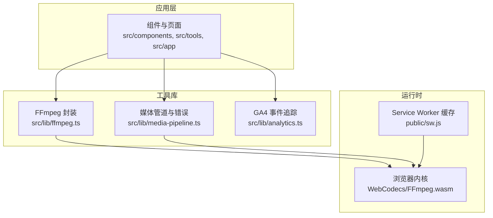
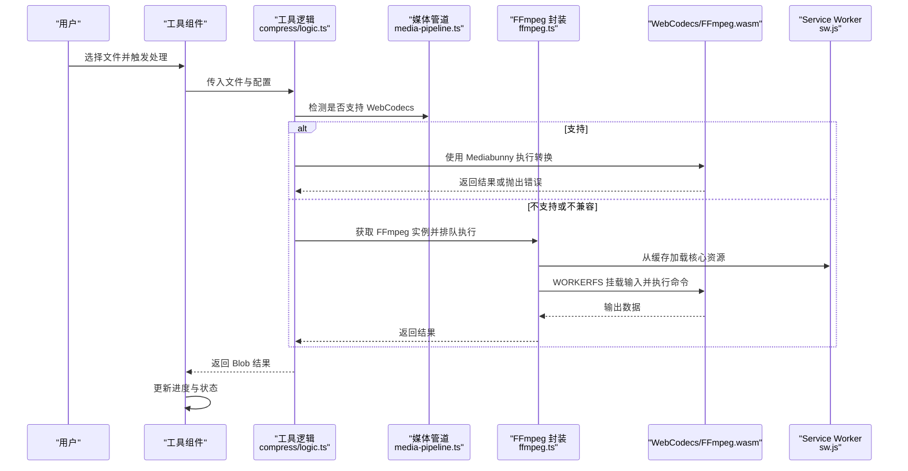
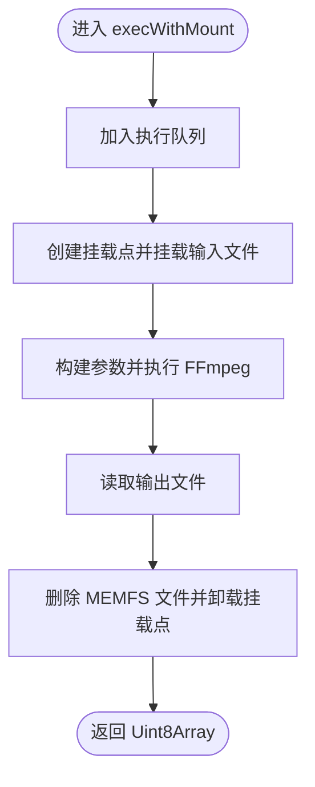
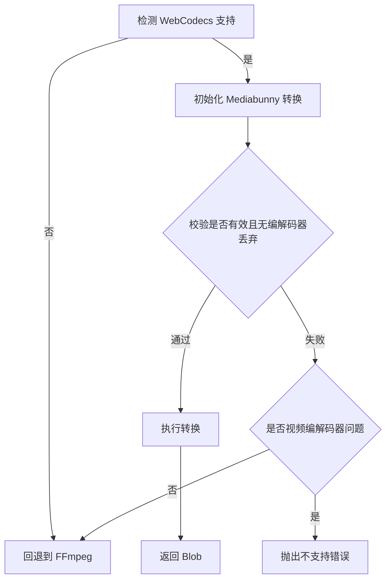
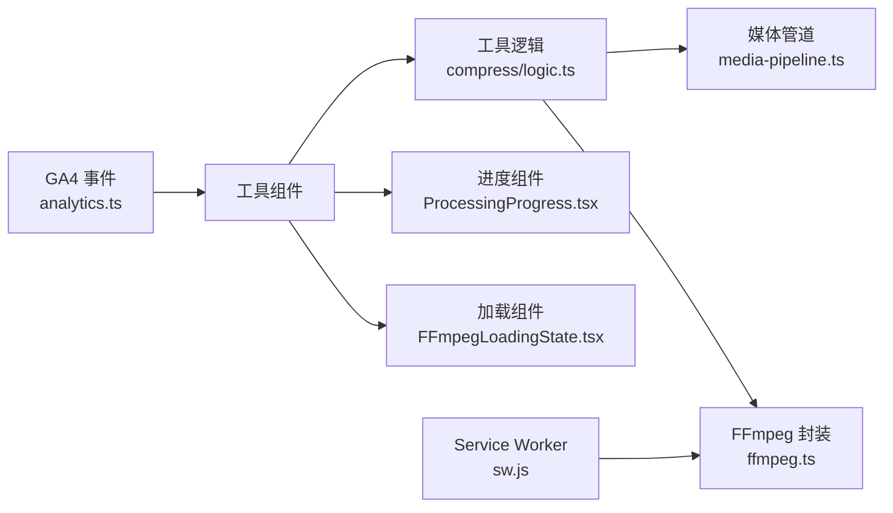
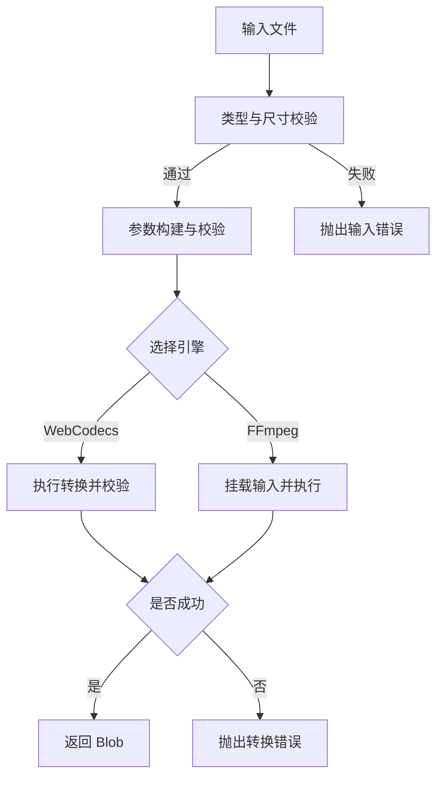

# 调试技巧

<cite>
**本文引用的文件**
- [README.md](file://README.md)
- [package.json](file://package.json)
- [src/lib/ffmpeg.ts](file://src/lib/ffmpeg.ts)
- [src/lib/media-pipeline.ts](file://src/lib/media-pipeline.ts)
- [src/lib/analytics.ts](file://src/lib/analytics.ts)
- [src/components/shared/ProcessingProgress.tsx](file://src/components/shared/ProcessingProgress.tsx)
- [src/components/shared/FFmpegLoadingState.tsx](file://src/components/shared/FFmpegLoadingState.tsx)
- [public/sw.js](file://public/sw.js)
- [src/app/layout.tsx](file://src/app/layout.tsx)
- [src/tools/video/compress/logic.ts](file://src/tools/video/compress/logic.ts)
- [src/tools/image/format-converter/logic.ts](file://src/tools/image/format-converter/logic.ts)
- [src/tools/pdf/compress/logic.ts](file://src/tools/pdf/compress/logic.ts)
</cite>

## 目录
1. [简介](#简介)
2. [项目结构](#项目结构)
3. [核心组件](#核心组件)
4. [架构总览](#架构总览)
5. [详细组件分析](#详细组件分析)
6. [依赖关系分析](#依赖关系分析)
7. [性能考量](#性能考量)
8. [故障排查指南](#故障排查指南)
9. [结论](#结论)
10. [附录](#附录)

## 简介
本指南面向 PrivaDeck 媒体工具箱的调试与优化实践，聚焦以下方面：
- 浏览器开发者工具：网络请求监控、性能分析、内存泄漏检测
- React DevTools：组件树检查、状态调试、性能优化
- 媒体处理流程调试：WebCodecs 与 FFmpeg 执行过程监控
- 常见问题诊断：文件处理失败、格式转换错误、性能瓶颈定位
- 日志记录与错误追踪：用户行为分析与异常上报
- 性能分析工具：Web Vitals 监控与用户体验指标分析

PrivaDeck 全部处理在浏览器端完成，采用 Next.js 16 App Router、TypeScript、Tailwind CSS，并通过 FFmpeg.wasm、pdf-lib + pdfjs、browser-image-compression 等技术栈实现图片、视频、音频、PDF 与开发者工具的本地处理。

章节来源
- [README.md:1-89](file://README.md#L1-L89)

## 项目结构
项目采用按功能域划分的目录组织方式，核心模块如下：
- src/lib：媒体处理与分析工具（FFmpeg 单例、媒体管道、GA4 事件追踪）
- src/tools：各工具的实现，按类别拆分（image、video、audio、pdf、developer）
- src/components：共享组件（进度条、加载状态等）
- public：Service Worker、静态资源与清单
- src/app：Next.js App Router 页面与全局样式

图表来源
- [src/lib/ffmpeg.ts:1-144](file://src/lib/ffmpeg.ts#L1-L144)
- [src/lib/media-pipeline.ts:1-105](file://src/lib/media-pipeline.ts#L1-L105)
- [src/lib/analytics.ts:1-138](file://src/lib/analytics.ts#L1-L138)
- [public/sw.js:1-93](file://public/sw.js#L1-L93)

章节来源
- [README.md:55-78](file://README.md#L55-L78)
- [package.json:11-32](file://package.json#L11-L32)

## 核心组件
- FFmpeg 单例与执行队列：负责懒加载、进度监听、文件挂载与序列化执行，避免并发冲突与内存拷贝。
- 媒体管道：基于 WebCodecs 的硬件加速路径，自动回退至 FFmpeg；对不支持的编解码器进行严格校验与提示。
- 进度与加载状态：统一的进度条与 FFmpeg 加载提示组件，便于用户感知处理状态。
- Service Worker：对 FFmpeg 核心资源进行永久缓存，提升二次加载性能。
- GA4 事件追踪：对上传、下载、复制、搜索、工具处理完成/错误等事件进行采集与隐私保护。

章节来源
- [src/lib/ffmpeg.ts:10-144](file://src/lib/ffmpeg.ts#L10-L144)
- [src/lib/media-pipeline.ts:7-105](file://src/lib/media-pipeline.ts#L7-L105)
- [src/components/shared/ProcessingProgress.tsx:1-47](file://src/components/shared/ProcessingProgress.tsx#L1-L47)
- [src/components/shared/FFmpegLoadingState.tsx:1-20](file://src/components/shared/FFmpegLoadingState.tsx#L1-L20)
- [public/sw.js:1-93](file://public/sw.js#L1-L93)
- [src/lib/analytics.ts:106-137](file://src/lib/analytics.ts#L106-L137)

## 架构总览
下图展示浏览器端媒体处理的关键路径：工具逻辑选择 WebCodecs 或 FFmpeg，通过封装的执行函数完成输入挂载、参数构建与输出读取；Service Worker 缓存 FFmpeg 核心资源；GA4 事件在关键节点上报。

图表来源
- [src/tools/video/compress/logic.ts:85-110](file://src/tools/video/compress/logic.ts#L85-L110)
- [src/lib/media-pipeline.ts:7-14](file://src/lib/media-pipeline.ts#L7-L14)
- [src/lib/ffmpeg.ts:99-143](file://src/lib/ffmpeg.ts#L99-L143)
- [public/sw.js:30-50](file://public/sw.js#L30-L50)

## 详细组件分析

### FFmpeg 封装与执行队列
- 单例懒加载：首次调用时动态加载核心脚本与 WASM，并设置进度事件监听。
- 序列化执行：通过 Promise 队列串行化所有 FFmpeg 操作，避免并发挂载点冲突。
- WORKERFS 挂载：直接将 File 对象映射为只读挂载点，避免两次内存拷贝。
- 进度回调：规范化进度范围（0-100），并在任务完成后清理监听与挂载点。

图表来源
- [src/lib/ffmpeg.ts:99-143](file://src/lib/ffmpeg.ts#L99-L143)

章节来源
- [src/lib/ffmpeg.ts:10-144](file://src/lib/ffmpeg.ts#L10-L144)

### 媒体管道与回退机制
- WebCodecs 支持检测：同时具备视频/音频编码器与解码器才视为可用。
- 转换有效性校验：对被丢弃轨道进行严格检查，若因编解码器导致丢弃则抛出回退错误。
- 回退策略：遇到不支持的视频编解码器（如 H.265/HEVC、VP9、AV1）时不回退至 FFmpeg，避免性能劣化；其他问题（如音频）仍可回退。
- Windows + Chromium 下的 HEVC 扩展建议：根据用户代理判断是否提示安装扩展以启用硬件解码。

图表来源
- [src/lib/media-pipeline.ts:85-105](file://src/lib/media-pipeline.ts#L85-L105)
- [src/tools/video/compress/logic.ts:92-110](file://src/tools/video/compress/logic.ts#L92-L110)

章节来源
- [src/lib/media-pipeline.ts:1-105](file://src/lib/media-pipeline.ts#L1-L105)
- [src/tools/video/compress/logic.ts:85-201](file://src/tools/video/compress/logic.ts#L85-L201)

### 进度与加载状态组件
- ProcessingProgress：显示确定/不确定进度条，支持自定义标签与类名。
- FFmpegLoadingState：在 FFmpeg 核心资源加载期间提供加载指示与提示文案。

章节来源
- [src/components/shared/ProcessingProgress.tsx:1-47](file://src/components/shared/ProcessingProgress.tsx#L1-L47)
- [src/components/shared/FFmpegLoadingState.tsx:1-20](file://src/components/shared/FFmpegLoadingState.tsx#L1-L20)

### Service Worker 与缓存策略
- 永久缓存 FFmpeg 核心资源（URL 包含版本号），减少重复下载。
- HTML 采用网络优先策略，保持内容新鲜；静态资源采用缓存优先策略。
- 激活阶段清理旧缓存，确保磁盘占用可控。

章节来源
- [public/sw.js:1-93](file://public/sw.js#L1-L93)

### GA4 事件追踪
- 统一事件接口：定义文件上传、下载、复制、搜索、相关工具点击、FAQ 展开、主题/语言切换、分享、处理完成/错误等事件参数。
- 隐私保护：对敏感字段进行截断，避免记录文件名等信息。
- 工具级追踪工厂：为每个工具生成处理完成与错误事件的便捷方法。

章节来源
- [src/lib/analytics.ts:11-137](file://src/lib/analytics.ts#L11-L137)

## 依赖关系分析
- 工具逻辑依赖媒体管道与 FFmpeg 封装，实现跨引擎的统一处理接口。
- 组件依赖共享进度与加载状态组件，保证一致的用户反馈。
- Service Worker 依赖浏览器缓存 API，保障 FFmpeg 核心资源的持久化缓存。
- GA4 事件追踪依赖 window.gtag，需在页面中正确注入与初始化。

图表来源
- [src/tools/video/compress/logic.ts:1-257](file://src/tools/video/compress/logic.ts#L1-L257)
- [src/lib/media-pipeline.ts:1-105](file://src/lib/media-pipeline.ts#L1-L105)
- [src/lib/ffmpeg.ts:1-144](file://src/lib/ffmpeg.ts#L1-L144)
- [src/components/shared/ProcessingProgress.tsx:1-47](file://src/components/shared/ProcessingProgress.tsx#L1-L47)
- [src/components/shared/FFmpegLoadingState.tsx:1-20](file://src/components/shared/FFmpegLoadingState.tsx#L1-L20)
- [public/sw.js:1-93](file://public/sw.js#L1-L93)
- [src/lib/analytics.ts:1-138](file://src/lib/analytics.ts#L1-L138)

## 性能考量
- WebCodecs 硬件加速：在支持的浏览器上优先使用硬件编解码，显著降低 CPU 占用与耗时。
- FFmpeg 缓存：通过 Service Worker 永久缓存核心资源，避免二次加载开销。
- 内存管理：WORKERFS 挂载避免全量内存拷贝；读取输出后立即删除 MEMFS 文件，降低峰值内存。
- 进度反馈：通过进度回调与可视化组件提升用户感知，减少无效等待。
- 质量与尺寸平衡：视频压缩通过 CRF、分辨率与帧率控制，结合最大码率限制，兼顾体积与质量。

章节来源
- [src/lib/ffmpeg.ts:99-143](file://src/lib/ffmpeg.ts#L99-L143)
- [public/sw.js:30-50](file://public/sw.js#L30-L50)
- [src/tools/video/compress/logic.ts:68-83](file://src/tools/video/compress/logic.ts#L68-L83)

## 故障排查指南

### 浏览器开发者工具使用
- 网络请求监控
  - 打开“网络”面板，过滤 XHR/Fetch 与 wasm/js 请求，观察 FFmpeg 核心资源加载状态与缓存命中情况。
  - 关注响应头中的缓存策略与状态码，确认 Service Worker 是否正确拦截与缓存。
- 性能分析
  - 使用“性能”面板录制页面交互，观察主线程耗时、垃圾回收与长任务，定位卡顿原因。
  - 对比 WebCodecs 与 FFmpeg 路径的 CPU 占用差异，评估硬件加速效果。
- 内存泄漏检测
  - 使用“内存”面板进行快照对比，重点检查大对象（Canvas、ImageData、Blob）生命周期。
  - 确认转换完成后及时释放 URL 对象与临时 Canvas，避免持续持有引用。

章节来源
- [public/sw.js:30-50](file://public/sw.js#L30-L50)

### React DevTools 高级调试
- 组件树检查
  - 查看工具组件的 props 与 state，确认文件对象、选项配置与进度状态是否正确传递。
  - 检查进度组件与加载组件的状态分支，验证确定/不确定进度的渲染逻辑。
- 状态调试
  - 利用“突出显示更新”功能定位不必要的重渲染，优化组件 memo 化与 key 设计。
  - 在工具逻辑中设置断点，观察 WebCodecs/FFmpeg 路径的选择与回退流程。
- 性能优化
  - 使用 Profiler 分析组件渲染时间，合并频繁更新的状态，减少深层嵌套组件的重渲染。

章节来源
- [src/components/shared/ProcessingProgress.tsx:14-46](file://src/components/shared/ProcessingProgress.tsx#L14-L46)
- [src/tools/video/compress/logic.ts:85-110](file://src/tools/video/compress/logic.ts#L85-L110)

### 媒体处理流程调试
- WebCodecs 路径
  - 若出现“编解码器不支持”或“转换无效”，检查源视频的编解码器类型与目标配置，必要时回退至 FFmpeg。
  - 对于 H.265/HEVC、VP9、AV1 等不支持的视频编解码器，避免回退以防止性能劣化。
- FFmpeg 路径
  - 确认输入文件已通过 WORKERFS 正确挂载，参数构建符合预期，输出文件读取成功。
  - 监控进度回调与内存峰值，确保输出读取后及时清理挂载点与 MEMFS 文件。
- 常见问题定位
  - 输入为空或类型不匹配：在工具逻辑入口处增加类型与尺寸校验。
  - 参数非法：对分辨率、帧率、码率等参数进行边界检查与默认值处理。
  - 输出为空：检查转换执行是否抛错，确认目标缓冲区存在。

图表来源
- [src/tools/video/compress/logic.ts:85-201](file://src/tools/video/compress/logic.ts#L85-L201)
- [src/lib/ffmpeg.ts:99-143](file://src/lib/ffmpeg.ts#L99-L143)

章节来源
- [src/lib/media-pipeline.ts:28-91](file://src/lib/media-pipeline.ts#L28-L91)
- [src/tools/video/compress/logic.ts:85-201](file://src/tools/video/compress/logic.ts#L85-L201)
- [src/lib/ffmpeg.ts:99-143](file://src/lib/ffmpeg.ts#L99-L143)

### 常见问题诊断清单
- 文件处理失败
  - 检查文件大小与类型限制，确认浏览器支持的格式列表。
  - 在工具逻辑中捕获并上报错误，使用 GA4 事件记录错误详情。
- 格式转换错误
  - 对于图片：确认 Canvas 上下文可用与 toBlob 成功回调。
  - 对于 PDF：检查渲染到 Canvas 的步骤与 JPEG 质量参数。
- 性能瓶颈定位
  - 使用性能面板识别长任务与高 CPU 占用阶段，优先优化 WebCodecs 路径或调整 FFmpeg 参数。

章节来源
- [src/tools/image/format-converter/logic.ts:75-158](file://src/tools/image/format-converter/logic.ts#L75-L158)
- [src/tools/pdf/compress/logic.ts:12-66](file://src/tools/pdf/compress/logic.ts#L12-L66)
- [src/lib/analytics.ts:106-137](file://src/lib/analytics.ts#L106-L137)

### 日志记录与错误追踪策略
- 用户行为分析
  - 上传/下载/复制/搜索/相关工具点击/FAQ 展开/主题/语言切换/分享等事件统一上报。
  - 使用工具级追踪工厂记录处理时长与错误，便于定位慢操作与失败场景。
- 异常上报
  - 对错误消息进行隐私截断，避免敏感信息泄露。
  - 在工具逻辑中捕获异常并调用错误事件，结合浏览器日志与性能面板进行交叉验证。

章节来源
- [src/lib/analytics.ts:11-137](file://src/lib/analytics.ts#L11-L137)

### 性能分析工具与用户体验指标
- Web Vitals 监控
  - 使用浏览器内置的 Web Vitals API 或第三方集成，关注 LCP、FID、CLS 等指标。
  - 在工具处理完成后记录“process_complete”事件，统计平均处理时长与成功率。
- 用户体验指标
  - 结合进度反馈与加载状态组件，确保用户在长时间处理中有明确预期。
  - 对于 FFmpeg 首次加载，提供加载提示与缓存命中说明，减少用户困惑。

章节来源
- [src/lib/analytics.ts:128-137](file://src/lib/analytics.ts#L128-L137)
- [src/components/shared/FFmpegLoadingState.tsx:6-19](file://src/components/shared/FFmpegLoadingState.tsx#L6-L19)

## 结论
通过浏览器开发者工具、React DevTools 与媒体处理封装的协同使用，可以高效定位与解决 PrivaDeck 在浏览器端的媒体处理问题。借助 WebCodecs 硬件加速与 FFmpeg 缓存策略，可在保证隐私的前提下获得更优的性能表现。配合 GA4 事件追踪与 Web Vitals 监控，能够持续优化用户体验并快速响应异常。

## 附录
- 快速开始与技术栈参考
  - 开发与构建命令、依赖项与 Next.js 配置可参考根目录文档与包配置。

章节来源
- [README.md:35-53](file://README.md#L35-L53)
- [package.json:5-10](file://package.json#L5-L10)
- [package.json:11-32](file://package.json#L11-L32)