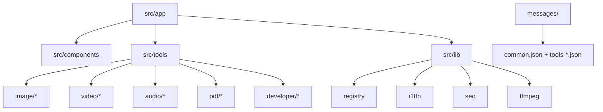
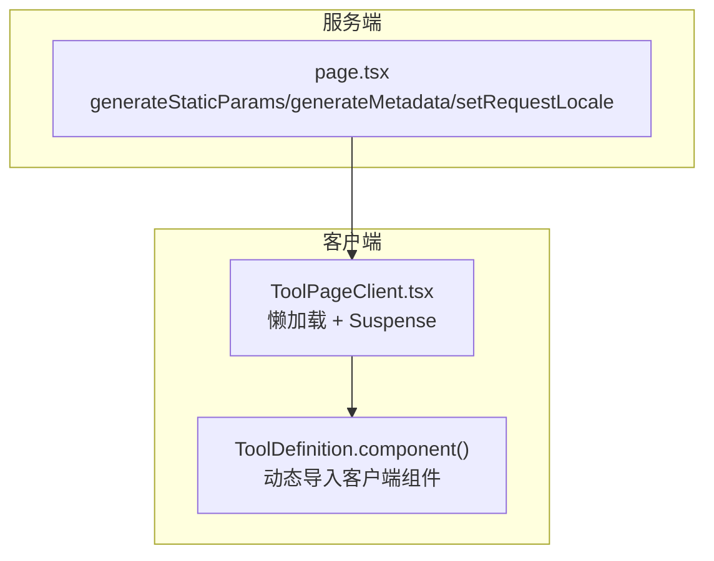
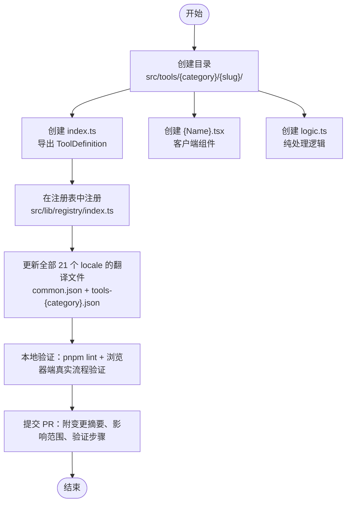
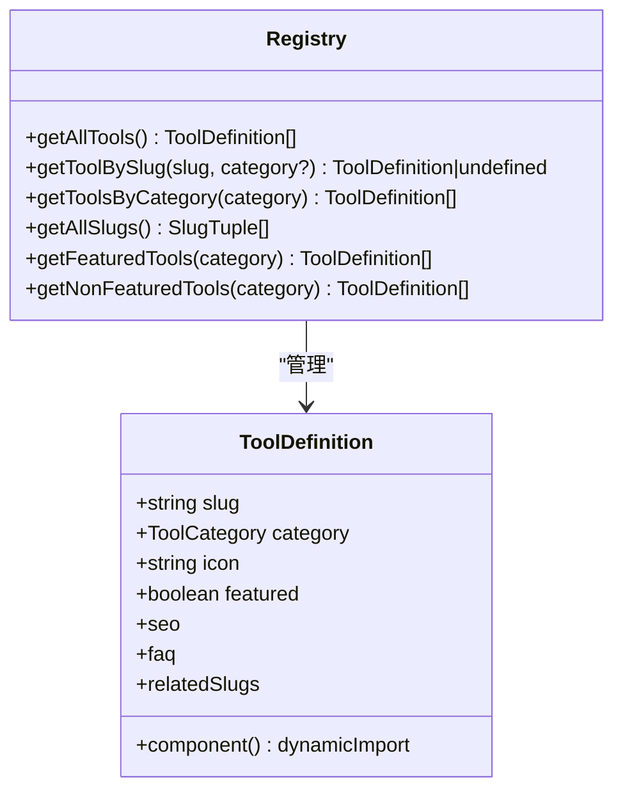
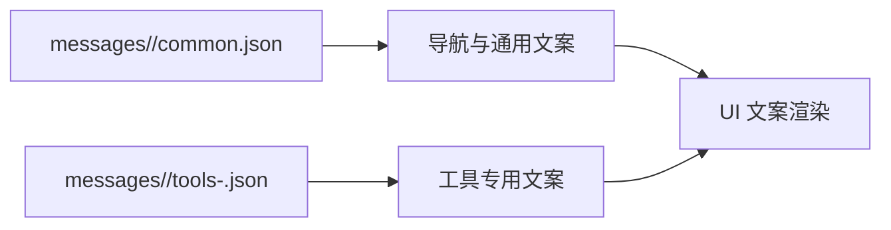
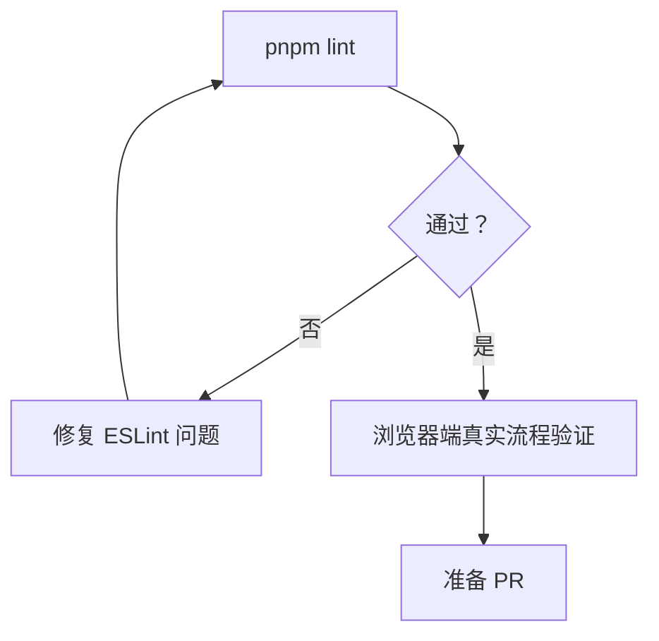
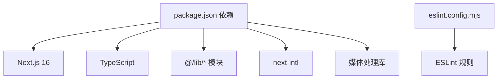
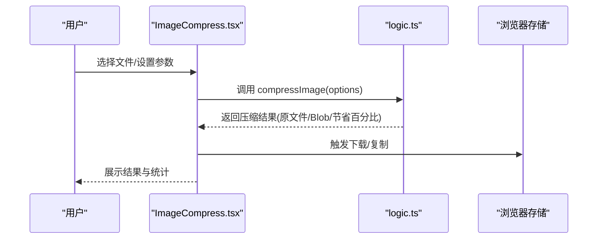

# 贡献指南

<cite>
**本文引用的文件**
- [README.md](file://README.md)
- [AGENTS.md](file://AGENTS.md)
- [CLAUDE.md](file://CLAUDE.md)
- [package.json](file://package.json)
- [eslint.config.mjs](file://eslint.config.mjs)
- [next.config.ts](file://next.config.ts)
- [src/lib/registry/index.ts](file://src/lib/registry/index.ts)
- [src/tools/image/compress/index.ts](file://src/tools/image/compress/index.ts)
- [src/tools/image/compress/logic.ts](file://src/tools/image/compress/logic.ts)
- [src/tools/developer/regex-tester/index.ts](file://src/tools/developer/regex-tester/index.ts)
- [messages/en/common.json](file://messages/en/common.json)
- [messages/en/tools-developer.json](file://messages/en/tools-developer.json)
</cite>

## 目录
1. [简介](#简介)
2. [项目结构](#项目结构)
3. [核心组件](#核心组件)
4. [架构总览](#架构总览)
5. [详细组件分析](#详细组件分析)
6. [依赖分析](#依赖分析)
7. [性能考虑](#性能考虑)
8. [故障排除指南](#故障排除指南)
9. [结论](#结论)
10. [附录](#附录)

## 简介
本指南面向希望为 PrivaDeck 媒体工具箱做出贡献的开发者，覆盖从 Fork 仓库、创建分支、提交代码到发起 Pull Request 的完整流程；明确代码审查标准（代码质量、测试覆盖率、文档完整性）；提供新功能开发指南（工具组件创建、国际化支持、测试用例编写）；说明 Bug 修复流程（问题报告、修复方案讨论、回归测试）；介绍社区参与方式（问题讨论、功能建议、文档改进）；并给出贡献者行为准则与沟通规范，确保开源协作顺畅高效。

## 项目结构
PrivaDeck 是一个基于 Next.js 16 App Router 的浏览器端多媒体工具箱，采用 TypeScript、Tailwind CSS v4、next-intl 国际化与 FFmpeg.wasm 等技术栈。项目采用“按功能域划分”的目录组织方式，核心目录如下：
- src/app：Next.js App Router 页面与布局
- src/components：共享 UI 组件与页面壳
- src/tools：按类别组织的工具模块（image、video、audio、pdf、developer）
- src/lib：工具注册表、SEO、国际化、FFmpeg 加载器等
- messages：21 种语言的翻译文件
- public：静态资源与 PWA 配置

图表来源
- [CLAUDE.md: 第54–62节:54-62](file://CLAUDE.md#L54-L62)
- [README.md: 第55–78节:55-78](file://README.md#L55-L78)

章节来源
- [CLAUDE.md: 第54–62节:54-62](file://CLAUDE.md#L54-L62)
- [README.md: 第55–78节:55-78](file://README.md#L55-L78)

## 核心组件
- 工具注册表：集中管理工具元数据与查询接口，提供按分类、按 slug 查询能力，以及特色工具筛选。
- 工具模块：每个工具包含 ToolDefinition（index.ts）、客户端组件（{Name}.tsx）与纯逻辑（logic.ts）三部分。
- 国际化：基于 next-intl，按 locale 维度维护 common.json 与 tools-*.json，确保所有文案键在全部 21 个 locale 中一致。
- 代码质量：ESLint 配置遵循 next/core-web-vitals 与 next/typescript，结合项目自定义忽略规则。

章节来源
- [src/lib/registry/index.ts: 第1–164节:1-164](file://src/lib/registry/index.ts#L1-L164)
- [AGENTS.md: 第21–28节:21-28](file://AGENTS.md#L21-L28)
- [eslint.config.mjs: 第1–19节:1-19](file://eslint.config.mjs#L1-L19)

## 架构总览
PrivaDeck 强调“零上传、零服务器”，所有媒体处理在浏览器端完成。工具页面由服务端组件负责生成静态参数与元数据，客户端组件通过懒加载与 Suspense 渲染，避免将不可序列化的函数字段从服务端传递到客户端。

图表来源
- [CLAUDE.md: 第30–37节:30-37](file://CLAUDE.md#L30-L37)

章节来源
- [CLAUDE.md: 第30–37节:30-37](file://CLAUDE.md#L30-L37)

## 详细组件分析

### 新增工具开发流程
新增工具需遵循“三文件一注册”原则：
- index.ts：导出 ToolDefinition，包含 slug、category、icon、featured、component 动态导入、SEO 配置、FAQ 键、relatedSlugs
- {Name}.tsx：客户端组件（"use client"），默认导出，使用 useTranslations 获取文案
- logic.ts：纯处理逻辑，不导入 React，仅使用原生 API 或第三方库

图表来源
- [AGENTS.md: 第16–28节:16-28](file://AGENTS.md#L16-L28)
- [CLAUDE.md: 第23–28节:23-28](file://CLAUDE.md#L23-L28)
- [README.md: 第80–85节:80-85](file://README.md#L80-L85)

章节来源
- [AGENTS.md: 第16–28节:16-28](file://AGENTS.md#L16-L28)
- [CLAUDE.md: 第23–28节:23-28](file://CLAUDE.md#L23-L28)
- [README.md: 第80–85节:80-85](file://README.md#L80-L85)

### 工具注册表与查询接口
注册表集中管理工具元数据，提供以下查询能力：
- getAllTools：获取全部工具
- getToolBySlug：按 slug 查询，可选限定 category
- getToolsByCategory：按分类查询
- getAllSlugs：获取全部 slug 与 category 的组合
- getFeaturedTools / getNonFeaturedTools：按是否特色工具筛选

图表来源
- [src/lib/registry/index.ts: 第135–164节:135-164](file://src/lib/registry/index.ts#L135-L164)

章节来源
- [src/lib/registry/index.ts: 第1–164节:1-164](file://src/lib/registry/index.ts#L1-L164)

### 国际化与翻译文件
- 使用 next-intl，支持 21 个 locale，包含地区变体（zh-Hans/zh-Hant、pt-BR/pt-PT）
- 翻译文件位于 messages/{locale}/，分为 common.json（导航与通用文案）与 tools-{category}.json（工具专用文案）
- 任何涉及 i18n 的变更必须一次性更新全部 21 个 locale 文件，确保键一致

图表来源
- [CLAUDE.md: 第38–44节:38-44](file://CLAUDE.md#L38-L44)

章节来源
- [CLAUDE.md: 第38–44节:38-44](file://CLAUDE.md#L38-L44)

### 代码质量与审查标准
- 代码风格：遵循 TypeScript 严格模式与 Next.js 约定，使用 2 空格缩进、双引号、分号、尾随逗号，优先使用 @/ 别名导入
- 命名约定：React 组件文件使用 PascalCase，工具函数使用 camelCase
- 提交信息：遵循现有前缀风格（如 feat(video): ...、refactor(tool): ...、i18n(video): ...）
- 审查要点：提交前至少执行 pnpm lint；涉及媒体处理、导出文件或页面交互的修改，需在浏览器中手动验证真实流程；UI 变更附截图或录屏；若修改工具、翻译或注册表，说明已同步更新相关文件

图表来源
- [AGENTS.md: 第6–11节:6-11](file://AGENTS.md#L6-L11)
- [eslint.config.mjs: 第1–19节:1-19](file://eslint.config.mjs#L1-L19)

章节来源
- [AGENTS.md: 第6–11节:6-11](file://AGENTS.md#L6-L11)
- [eslint.config.mjs: 第1–19节:1-19](file://eslint.config.mjs#L1-L19)

### Bug 修复流程
- 问题报告：在 Issue 中描述复现步骤、期望结果、实际结果、环境信息（浏览器、操作系统）
- 修复方案讨论：在 Issue 中提出修复思路，必要时附设计草图或流程图
- 实施与验证：在修复分支上实现修复，补充最小化测试用例，本地验证通过后提交 PR
- 回归测试：确认修复未引入新的问题，必要时更新相关测试用例与文档

章节来源
- [AGENTS.md: 第33–34节:33-34](file://AGENTS.md#L33-L34)

### 社区参与与沟通规范
- 问题讨论：使用 GitHub Issues，按模板填写信息，便于维护者快速定位
- 功能建议：先在 Discussion 或 Issue 中提出，收集反馈后再实施
- 文档改进：针对 README、CLAUDE.md、AGENTS.md 等文档的改进，直接提交 PR 并说明改动理由
- 行为准则：尊重他人、保持专业、聚焦问题本身，避免人身攻击与无关争论

章节来源
- [AGENTS.md: 第33–34节:33-34](file://AGENTS.md#L33-L34)

## 依赖分析
- 构建与开发：Next.js 16（App Router、SSG 静态导出）、pnpm、TypeScript
- 样式：Tailwind CSS v4
- 国际化：next-intl（21 个 locale）
- 媒体处理：FFmpeg.wasm（视频/音频）、pdf-lib + pdfjs-dist（PDF）、browser-image-compression（图片）
- 代码质量：ESLint（next/core-web-vitals + next/typescript）

图表来源
- [package.json: 第11–32节:11-32](file://package.json#L11-L32)
- [eslint.config.mjs: 第1–19节:1-19](file://eslint.config.mjs#L1-L19)
- [next.config.ts: 第1–13节:1-13](file://next.config.ts#L1-L13)

章节来源
- [package.json: 第11–32节:11-32](file://package.json#L11-L32)
- [eslint.config.mjs: 第1–19节:1-19](file://eslint.config.mjs#L1-L19)
- [next.config.ts: 第1–13节:1-13](file://next.config.ts#L1-L13)

## 性能考虑
- 静态生成：使用 SSG（output: "export"）导出静态站点，提升首屏性能与可访问性
- 懒加载：工具页面客户端组件通过动态导入与 Suspense 渲染，减少初始包体积
- 媒体处理：浏览器端处理需注意内存占用与 CPU 占用，合理设置压缩参数与并发度
- 国际化：按需加载翻译，避免一次性加载全部 locale

章节来源
- [CLAUDE.md: 第7–13节:7-13](file://CLAUDE.md#L7-L13)
- [CLAUDE.md: 第30–37节:30-37](file://CLAUDE.md#L30-L37)

## 故障排除指南
- 本地开发问题：确认 pnpm install 成功，使用 pnpm dev 启动，访问 http://localhost:3000
- 构建失败：执行 pnpm build，检查输出目录 out/ 是否生成；如失败，先执行 pnpm lint 排查
- 代码检查：执行 pnpm lint，根据 ESLint 输出修复问题
- 国际化缺失：若出现文案缺失，检查 messages/<locale>/common.json 与 messages/<locale>/tools-<category>.json 是否包含对应键
- 工具未显示：确认工具已在 src/lib/registry/index.ts 注册，且 translations 已同步更新

章节来源
- [AGENTS.md: 第6–11节:6-11](file://AGENTS.md#L6-L11)
- [CLAUDE.md: 第7–13节:7-13](file://CLAUDE.md#L7-L13)

## 结论
通过遵循本贡献指南，您可以高效地为 PrivaDeck 媒体工具箱贡献高质量的功能与改进。请始终关注隐私优先的设计理念，确保所有处理在浏览器端完成；严格遵守代码质量与国际化规范；在提交 PR 前完成本地验证与代码检查；积极参与社区讨论，共同推动项目发展。

## 附录

### 新功能开发示例：图像压缩工具
- ToolDefinition 定义：参考 image/compress/index.ts
- 客户端组件：参考 image/compress/ImageCompress.tsx（默认导出，使用 useTranslations）
- 纯逻辑：参考 image/compress/logic.ts（导出 compressImage、预设参数等）

图表来源
- [src/tools/image/compress/index.ts: 第3–34节:3-34](file://src/tools/image/compress/index.ts#L3-L34)
- [src/tools/image/compress/logic.ts: 第83–123节:83-123](file://src/tools/image/compress/logic.ts#L83-L123)

章节来源
- [src/tools/image/compress/index.ts: 第3–34节:3-34](file://src/tools/image/compress/index.ts#L3-L34)
- [src/tools/image/compress/logic.ts: 第83–123节:83-123](file://src/tools/image/compress/logic.ts#L83-L123)

### 国际化示例：开发者工具正则表达式测试器
- ToolDefinition 定义：参考 developer/regex-tester/index.ts
- 翻译文件：messages/en/tools-developer.json 中包含该工具的 name、description、metaTitle、metaDescription、keywords、faq 等键

章节来源
- [src/tools/developer/regex-tester/index.ts: 第3–34节:3-34](file://src/tools/developer/regex-tester/index.ts#L3-L34)
- [messages/en/tools-developer.json](file://messages/en/tools-developer.json)