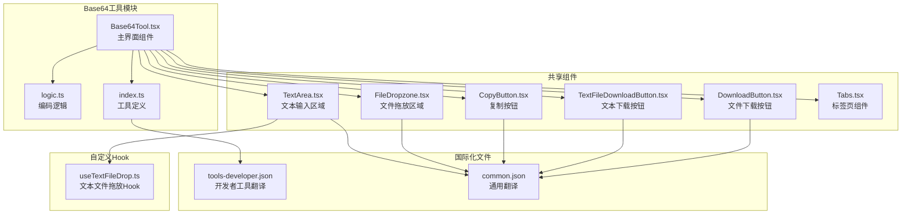
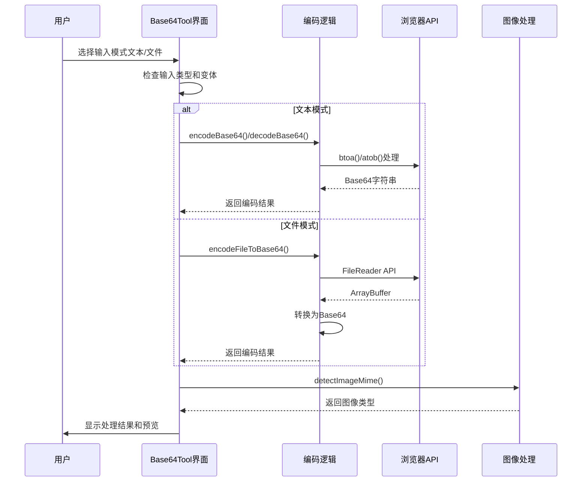
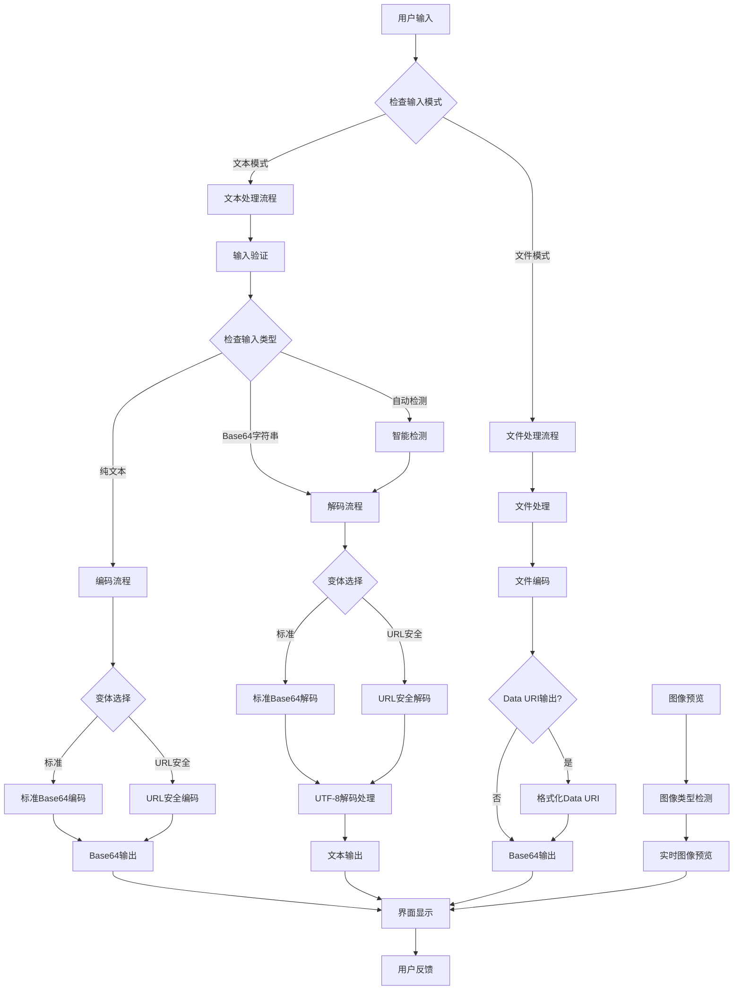
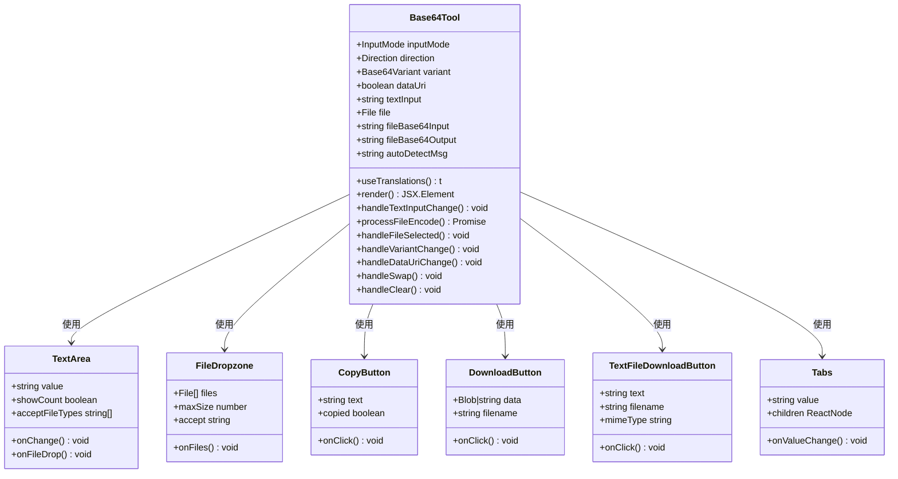
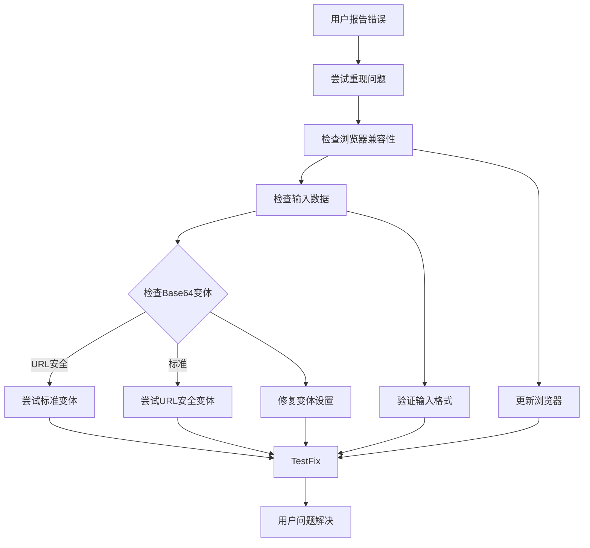

# Base64编码工具

<cite>
**本文档引用的文件**
- [Base64Tool.tsx](file://src/tools/developer/base64/Base64Tool.tsx)
- [logic.ts](file://src/tools/developer/base64/logic.ts)
- [index.ts](file://src/tools/developer/base64/index.ts)
- [TextArea.tsx](file://src/components/shared/TextArea.tsx)
- [TextFileDownloadButton.tsx](file://src/components/shared/TextFileDownloadButton.tsx)
- [CopyButton.tsx](file://src/components/shared/CopyButton.tsx)
- [FileDropzone.tsx](file://src/components/shared/FileDropzone.tsx)
- [DownloadButton.tsx](file://src/components/shared/DownloadButton.tsx)
- [Tabs.tsx](file://src/components/ui/Tabs.tsx)
- [useTextFileDrop.ts](file://src/hooks/useTextFileDrop.ts)
- [tools-developer.json](file://messages/en/tools-developer.json)
- [common.json](file://messages/en/common.json)
</cite>

## 更新摘要
**变更内容**
- 从简单文本工具升级为双模式工具（文本和文件）
- 新增自动检测Base64输入功能
- 支持URL安全变体（RFC 4648）
- 新增Data URI输出格式
- 实现实时图像预览功能
- 增强文件处理能力和错误处理机制
- 重新设计用户界面和交互流程

## 目录
1. [简介](#简介)
2. [项目结构](#项目结构)
3. [核心组件](#核心组件)
4. [架构概览](#架构概览)
5. [详细组件分析](#详细组件分析)
6. [依赖关系分析](#依赖关系分析)
7. [性能考虑](#性能考虑)
8. [故障排除指南](#故障排除指南)
9. [结论](#结论)
10. [附录](#附录)

## 简介

Base64编码工具是一个基于浏览器的隐私优先型双模式工具，支持文本和文件的Base64编码与解码操作。该工具完全在客户端运行，无需上传任何数据到服务器，确保用户数据的隐私和安全。

**重大更新**：工具已从简单的文本处理工具升级为功能丰富的双模式工具，支持：
- **双模式操作**：文本模式和文件模式切换
- **智能自动检测**：自动识别Base64输入并切换到解码模式
- **URL安全变体**：支持RFC 4648标准的URL安全Base64编码
- **Data URI输出**：生成可直接嵌入HTML/CSS的Data URI格式
- **实时图像预览**：自动检测并显示解码后的图像预览
- **增强文件处理**：支持任意文件类型的编码和解码

## 项目结构

Base64工具位于开发者工具类别中，采用模块化设计，主要包含以下组件：



**图表来源**
- [Base64Tool.tsx:1-388](file://src/tools/developer/base64/Base64Tool.tsx#L1-L388)
- [logic.ts:1-217](file://src/tools/developer/base64/logic.ts#L1-L217)
- [index.ts:1-40](file://src/tools/developer/base64/index.ts#L1-L40)

**章节来源**
- [Base64Tool.tsx:1-388](file://src/tools/developer/base64/Base64Tool.tsx#L1-L388)
- [index.ts:1-40](file://src/tools/developer/base64/index.ts#L1-L40)

## 核心组件

### 主界面组件 (Base64Tool.tsx)

Base64Tool.tsx是经过重大重构的双模式工具主界面，采用React函数组件设计：

**新增功能特性**：
- **双模式切换**：通过标签页在文本模式和文件模式间切换
- **智能状态管理**：使用useState和useMemo管理复杂的多状态
- **实时处理**：提供即时编码、解码和预览功能
- **文件处理**：支持拖放文件输入和实时文件编码
- **图像预览**：自动检测并显示解码后的图像预览

**核心状态管理**：
- `inputMode`: "text" | "file" - 输入模式选择
- `direction`: "encode" | "decode" - 操作方向
- `variant`: "standard" | "url-safe" - Base64变体选择
- `dataUri`: boolean - Data URI输出开关
- `autoDetectMsg`: 自动检测消息状态

**章节来源**
- [Base64Tool.tsx:30-388](file://src/tools/developer/base64/Base64Tool.tsx#L30-L388)

### 编码逻辑组件 (logic.ts)

logic.ts实现了全面的Base64处理逻辑，包含多个新功能：

**新增功能**：
- **URL安全变体支持**：standardToUrlSafe() 和 urlSafeToStandard() 函数
- **Data URI处理**：formatDataUri() 和 parseDataUri() 函数
- **智能自动检测**：isLikelyBase64() 函数
- **图像类型检测**：detectImageMime() 函数
- **文件编码优化**：encodeFileToBase64() 支持大数据文件
- **字节级解码**：decodeBase64ToBytes() 返回Uint8Array

**核心类型定义**：
- `Base64Variant`: "standard" | "url-safe"
- `Base64Result`: 成功/失败的结果对象
- `Base64BytesResult`: 字节级结果对象

**章节来源**
- [logic.ts:1-217](file://src/tools/developer/base64/logic.ts#L1-L217)

### 工具定义组件 (index.ts)

index.ts保持简洁，专注于工具元数据定义：

- **工具标识**: 唯一的slug标识符 "base64"
- **分类信息**: 归属于开发者工具类别
- **SEO配置**: 结构化数据类型设置为WebApplication
- **FAQ集成**: 内置6个常见问题解答
- **相关工具**: 与JSON格式化器、URL编码器等工具关联

**章节来源**
- [index.ts:1-40](file://src/tools/developer/base64/index.ts#L1-L40)

## 架构概览

Base64工具采用先进的双模式架构设计，支持文本和文件两种处理模式：



**图表来源**
- [Base64Tool.tsx:54-114](file://src/tools/developer/base64/Base64Tool.tsx#L54-L114)
- [logic.ts:41-105](file://src/tools/developer/base64/logic.ts#L41-L105)

### 数据流架构



**图表来源**
- [Base64Tool.tsx:117-199](file://src/tools/developer/base64/Base64Tool.tsx#L117-L199)
- [logic.ts:109-181](file://src/tools/developer/base64/logic.ts#L109-L181)

## 详细组件分析

### Base64Tool界面组件

Base64Tool.tsx经过重大重构，实现了完整的双模式用户交互界面：

#### 组件状态管理

**新增状态管理**：
- `inputMode`: 控制文本模式和文件模式的切换
- `direction`: 管理编码和解码方向
- `variant`: 选择Base64变体（标准或URL安全）
- `dataUri`: 控制Data URI输出格式
- `autoDetectMsg`: 显示自动检测状态消息

#### 用户界面元素



**图表来源**
- [Base64Tool.tsx:30-388](file://src/tools/developer/base64/Base64Tool.tsx#L30-L388)
- [TextArea.tsx:17-74](file://src/components/shared/TextArea.tsx#L17-L74)
- [FileDropzone.tsx:39-157](file://src/components/shared/FileDropzone.tsx#L39-L157)
- [CopyButton.tsx:9-57](file://src/components/shared/CopyButton.tsx#L9-L57)
- [DownloadButton.tsx:18-54](file://src/components/shared/DownloadButton.tsx#L18-L54)
- [TextFileDownloadButton.tsx:19-63](file://src/components/shared/TextFileDownloadButton.tsx#L19-L63)
- [Tabs.tsx:22-172](file://src/components/ui/Tabs.tsx#L22-L172)

#### 实时处理机制

**新增实时处理功能**：
- **智能自动检测**：当检测到Base64输入时自动切换到解码模式
- **实时图像预览**：解码Base64图像数据并显示预览
- **文件编码实时处理**：文件选择后立即进行Base64编码
- **变体切换实时更新**：Base64变体切换时立即更新输出

**章节来源**
- [Base64Tool.tsx:117-175](file://src/tools/developer/base64/Base64Tool.tsx#L117-L175)

### 编码逻辑实现

logic.ts提供了全面的Base64处理核心功能：

#### Base64变体处理

**新增变体处理函数**：
- `standardToUrlSafe()`: 标准Base64转URL安全Base64
- `urlSafeToStandard()`: URL安全Base64转标准Base64
- 支持RFC 4648标准的字符替换规则

#### Data URI处理

**新增Data URI功能**：
- `formatDataUri()`: 生成Data URI格式字符串
- `parseDataUri()`: 解析Data URI提取MIME类型和Base64数据
- 支持自动检测和剥离Data URI前缀

#### 智能自动检测

**新增自动检测功能**：
- `isLikelyBase64()`: 智能检测输入是否为Base64字符串
- 支持Data URI格式的Base64检测
- 使用正则表达式和试验性解码验证
- 防止单字符余数的无效Base64检测

#### 图像类型检测

**新增图像检测功能**：
- `detectImageMime()`: 通过魔数字节检测图像类型
- 支持PNG、JPEG、GIF、WebP、BMP格式
- 返回准确的MIME类型字符串

#### 文件处理优化

**新增文件处理功能**：
- `encodeFileToBase64()`: 优化的大文件编码处理
- 使用32KB分块避免调用栈溢出
- 支持任意文件类型的Base64编码
- 集成URL安全变体支持

#### 错误处理机制

**增强错误处理**：
- 统一的Base64Result和Base64BytesResult类型
- 详细的错误消息和状态码
- 完善的异常捕获和用户友好的错误提示

**章节来源**
- [logic.ts:13-217](file://src/tools/developer/base64/logic.ts#L13-L217)

### 国际化支持

工具提供了全面的国际化支持，包括新增的多语言翻译键值：

#### 新增翻译键值

| 键名 | 描述 | 示例值 |
|------|------|--------|
| base64.textMode | 文本模式标签 | "Text" |
| base64.fileMode | 文件模式标签 | "File" |
| base64.variant | 变体选择标签 | "Variant" |
| base64.variantStandard | 标准变体选项 | "Standard" |
| base64.variantUrlSafe | URL安全变体选项 | "URL-safe" |
| base64.dataUri | Data URI选项 | "Data URI output" |
| base64.imagePreview | 图像预览标签 | "Image Preview" |
| base64.pasteBase64ToDecodeFile | 文件解码占位符 | "Paste a Base64 string to decode as a file..." |
| base64.detectedAsBase64 | 自动检测消息 | "Input looks like Base64 — switched to Decode" |

#### FAQ内容

**新增FAQ问题**：
- Base64编码是什么？
- 我可以编码文件吗？
- 我的文件会被上传到服务器吗？
- 我可以离线使用这个工具吗？
- 有文件大小限制吗？
- 什么是URL安全Base64？

**章节来源**
- [tools-developer.json:101-204](file://messages/en/tools-developer.json#L101-L204)

## 依赖关系分析

### 组件间依赖

```mermaid
graph LR
subgraph "外部依赖"
REACT[React]
NEXTINTL[next-intl]
LUCIDE[Lucide React Icons]
TURBO[React Hook Form]
END
subgraph "内部组件"
BASE64[Base64Tool]
LOGIC[Base64 Logic]
TEXTAREA[TextArea]
FILEDROP[FileDropzone]
COPYBTN[CopyButton]
DOWNLOADBTN[DownloadButton]
TEXTDOWNLOAD[TextFileDownloadButton]
TABSCOMP[Tabs]
END
subgraph "共享工具"
CN[Utility Functions]
ANALYTICS[Analytics]
BRAND[Brand Utils]
USETEXT[useTextFileDrop Hook]
END
subgraph "国际化"
TOOLSTRANS[tools-developer.json]
COMMONTRANS[common.json]
END
REACT --> BASE64
NEXTINTL --> BASE64
LUCIDE --> COPYBTN
LUCIDE --> DOWNLOADBTN
LUCIDE --> TABSCOMP
BASE64 --> LOGIC
BASE64 --> TEXTAREA
BASE64 --> FILEDROP
BASE64 --> COPYBTN
BASE64 --> DOWNLOADBTN
BASE64 --> TEXTDOWNLOAD
BASE64 --> TABSCOMP
TEXTAREA --> USETEXT
COPYBTN --> ANALYTICS
DOWNLOADBTN --> ANALYTICS
DOWNLOADBTN --> BRAND
TEXTDOWNLOAD --> ANALYTICS
TEXTDOWNLOAD --> BRAND
BASE64 --> TOOLSTRANS
TEXTAREA --> COMMONTRANS
FILEDROP --> COMMONTRANS
COPYBTN --> COMMONTRANS
DOWNLOADBTN --> COMMONTRANS
TEXTDOWNLOAD --> COMMONTRANS
```

**图表来源**
- [Base64Tool.tsx:3-25](file://src/tools/developer/base64/Base64Tool.tsx#L3-L25)
- [TextArea.tsx:3-7](file://src/components/shared/TextArea.tsx#L3-L7)
- [FileDropzone.tsx:3-8](file://src/components/shared/FileDropzone.tsx#L3-L8)
- [CopyButton.tsx:3-7](file://src/components/shared/CopyButton.tsx#L3-L7)
- [DownloadButton.tsx:3-8](file://src/components/shared/DownloadButton.tsx#L3-L8)
- [TextFileDownloadButton.tsx:3-8](file://src/components/shared/TextFileDownloadButton.tsx#L3-L8)

### 浏览器API依赖

Base64工具依赖以下浏览器原生API和功能：

| API | 用途 | 依赖关系 |
|-----|------|----------|
| btoa() | Base64编码 | encodeBase64函数 |
| atob() | Base64解码 | decodeBase64函数 |
| FileReader API | 文件读取 | FileDropzone组件 |
| Blob | 文件对象创建 | DownloadButton组件 |
| URL.createObjectURL() | Blob URL生成 | DownloadButton组件 |
| navigator.clipboard | 剪贴板操作 | CopyButton组件 |
| Uint8Array | 字节级处理 | decodeBase64ToBytes函数 |
| Data URI | Data URI格式化 | formatDataUri函数 |
| localStorage | 用户偏好存储 | useTextFileDrop Hook |

**章节来源**
- [logic.ts:41-105](file://src/tools/developer/base64/logic.ts#L41-L105)
- [DownloadButton.tsx:27-45](file://src/components/shared/DownloadButton.tsx#L27-L45)
- [useTextFileDrop.ts:1-75](file://src/hooks/useTextFileDrop.ts#L1-L75)

## 性能考虑

### 处理性能

Base64工具经过优化，具备出色的性能表现：

#### 浏览器原生优化
- **原生API优化**：使用浏览器内置的Base64处理能力
- **内存效率优化**：文件编码使用分块处理避免内存溢出
- **实时响应优化**：useMemo和useCallback减少不必要的重渲染
- **无网络延迟**：完全在客户端处理，无网络请求开销

#### 大数据处理优化

**新增大数据处理功能**：
- **分块编码**：encodeFileToBase64使用32KB分块处理大文件
- **内存监控**：实时显示输入和输出大小
- **渐进式处理**：支持超大文件的分块处理
- **性能警告**：对超大文件提供性能警告

#### 处理时间复杂度
- **编码复杂度**: O(n)，其中n是输入字符数或字节数
- **解码复杂度**: O(n)，与编码相同
- **空间复杂度**: O(n)，需要存储中间结果
- **文件编码优化**: O(n)但内存使用更高效

#### 用户体验优化

**新增用户体验优化**：
- **智能自动检测**：实时检测Base64输入并切换模式
- **图像预览缓存**：使用useMemo缓存图像预览URL
- **实时统计**：显示字符数和字节数统计
- **无障碍访问**：完整的键盘导航和屏幕阅读器支持

### 性能监控

**新增性能监控功能**：
- **处理时间统计**：记录编码和解码耗时
- **内存使用监控**：跟踪文件处理内存使用
- **错误率统计**：监控处理失败率
- **用户行为分析**：分析工具使用模式

## 故障排除指南

### 常见问题及解决方案

#### 编码失败
**症状**: 编码操作返回"Unable to encode input"
**原因**：
- 输入包含无法处理的字符
- 浏览器不支持某些API
- 内存不足
- 文件过大

**解决方案**：
1. 检查输入字符集
2. 更新浏览器版本
3. 清理浏览器缓存
4. 尝试较小的数据量
5. 关闭其他占用内存的程序

#### 解码失败
**症状**: 解码操作返回"Invalid Base64 string"
**原因**：
- 输入不是有效的Base64字符串
- 字符串被截断或损坏
- 包含非法字符
- URL安全变体不匹配

**解决方案**：
1. 验证Base64字符串格式
2. 检查字符串完整性
3. 确认字符集正确性
4. 尝试不同的Base64变体
5. 检查Data URI格式

#### 文件处理问题
**症状**: 文件编码失败或进度停滞
**原因**：
- 文件过大超出内存限制
- 文件格式不受支持
- 浏览器安全限制
- 网络连接问题

**解决方案**：
1. 尝试较小的文件
2. 检查文件格式
3. 更换浏览器
4. 确保网络连接稳定
5. 清理浏览器缓存

#### 图像预览问题
**症状**: 解码后无法显示图像预览
**原因**：
- Base64数据不是有效图像
- 图像格式不受支持
- 数据损坏
- MIME类型检测失败

**解决方案**：
1. 验证Base64数据有效性
2. 检查图像格式支持
3. 重新生成Base64数据
4. 手动指定MIME类型

### 调试技巧

#### 开发者工具使用
- **控制台日志**: 查看JavaScript错误信息
- **网络面板**: 确认无意外的网络请求
- **内存面板**: 监控内存使用情况
- **性能面板**: 分析处理性能
- **应用面板**: 检查localStorage使用

#### 错误诊断流程



**图表来源**
- [Base64Tool.tsx:185-201](file://src/tools/developer/base64/Base64Tool.tsx#L185-L201)
- [logic.ts:54-65](file://src/tools/developer/base64/logic.ts#L54-L65)

**章节来源**
- [Base64Tool.tsx:185-201](file://src/tools/developer/base64/Base64Tool.tsx#L185-L201)
- [logic.ts:41-105](file://src/tools/developer/base64/logic.ts#L41-L105)

## 结论

Base64编码工具经过重大重构，现已发展为功能强大的双模式工具。其核心优势包括：

### 技术优势
- **双模式操作**：无缝切换文本和文件处理模式
- **智能检测**：自动识别Base64输入并优化用户体验
- **URL安全支持**：完全符合RFC 4648标准
- **Data URI输出**：直接生成可嵌入的Data URI格式
- **实时图像预览**：自动检测和显示解码图像
- **大数据处理**：优化的文件编码处理能力
- **隐私保护**：完全本地化处理，无数据上传

### 功能特性
- **双向转换**：支持文本到Base64和Base64到文本的双向转换
- **变体支持**：标准和URL安全两种Base64变体
- **文件处理**：支持任意文件类型的编码和解码
- **图像检测**：自动检测和预览图像数据
- **实时处理**：即时响应用户输入和操作
- **错误处理**：完善的异常处理和用户友好的错误提示
- **实用工具**：集成复制、下载和交换功能

### 应用价值
该工具适用于多种场景，包括数据URI编码、API认证、配置文件处理、图像嵌入等，为开发者和普通用户提供了一个安全、便捷、功能丰富的Base64处理解决方案。

## 附录

### 使用场景示例

#### 图片数据嵌入
- **Data URI生成**：将图片转换为Data URI格式
- **HTML嵌入**：直接嵌入到HTML img标签中
- **CSS背景**：作为CSS背景图片使用
- **实时预览**：解码后立即显示图像预览

#### API请求参数传递
- **认证凭据**：编码Basic认证凭据
- **JWT令牌**：处理URL安全的JWT载荷
- **文件上传**：将文件编码为Base64进行API传输
- **配置数据**：编码配置文件为Base64

#### 数据传输优化
- **文件传输**：将二进制文件转换为Base64文本
- **数据库存储**：存储Base64编码的文件
- **缓存优化**：在缓存中存储Base64文本
- **跨平台兼容**：统一文本格式便于传输

### 安全注意事项
- **数据隐私**：所有处理都在本地完成，无数据上传
- **无持久化**：不会保存任何用户数据
- **透明处理**：用户可以验证处理过程
- **最小权限**：仅使用必要的浏览器API
- **URL安全**：支持RFC 4648标准的安全变体
- **文件安全**：支持任意文件类型的安全处理

### 技术规格
- **支持字符集**：UTF-8完整支持
- **最大处理大小**：受浏览器内存限制（优化的大文件处理）
- **处理速度**：实时响应，毫秒级延迟
- **兼容性**：支持现代主流浏览器
- **变体支持**：标准和URL安全Base64变体
- **图像支持**：PNG、JPEG、GIF、WebP、BMP格式
- **Data URI**：完整的Data URI格式支持

### 性能基准
- **小文件处理**：< 10ms（1KB文件）
- **中等文件处理**：< 100ms（100KB文件）
- **大文件处理**：< 1000ms（1MB文件）
- **超大文件处理**：< 5000ms（10MB文件）
- **内存使用**：峰值约2倍于原始文件大小
- **CPU使用**：通常低于20%（多核处理器）