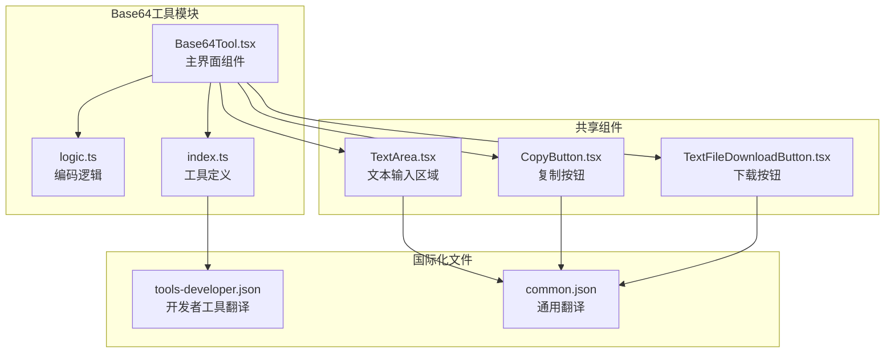
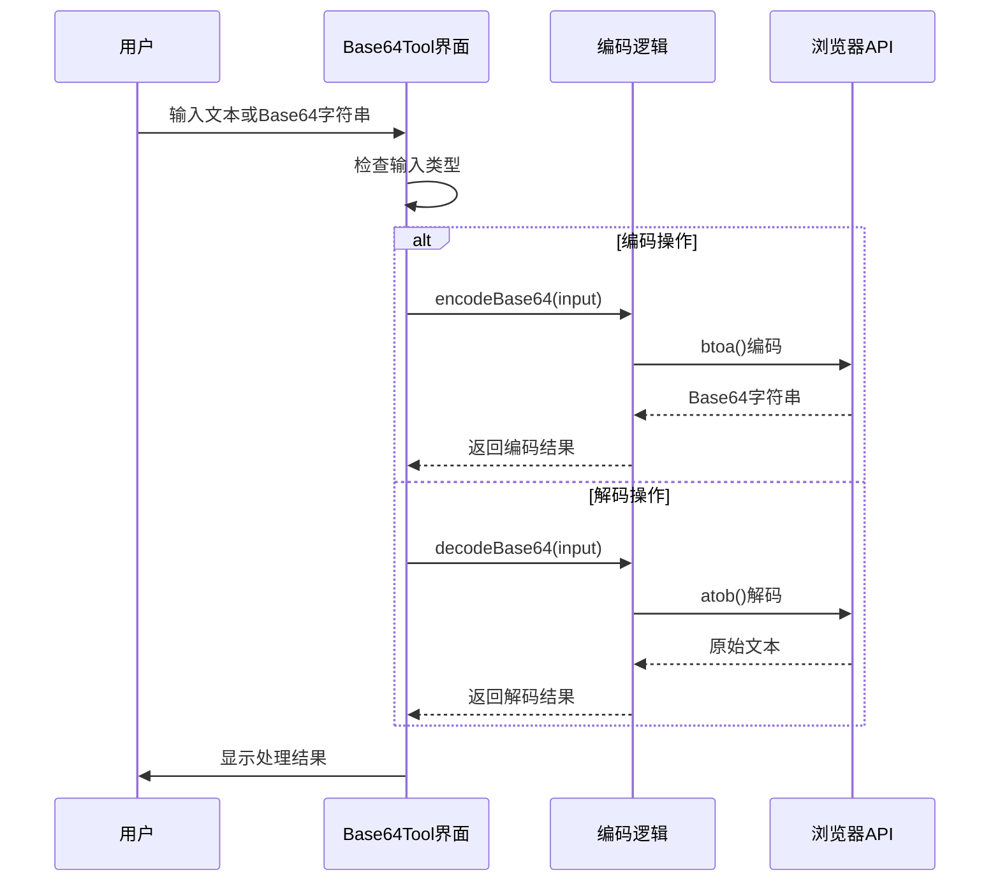
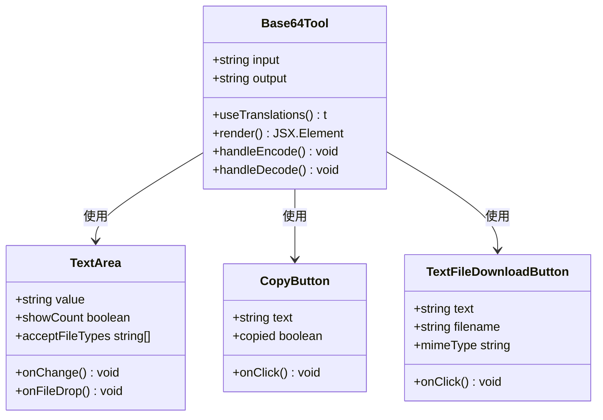
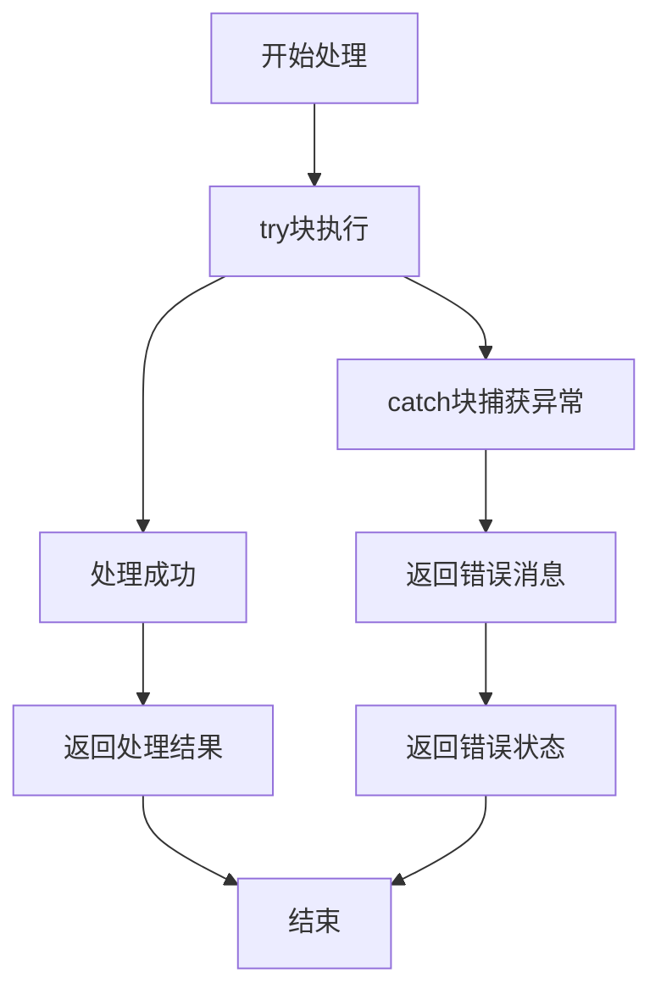
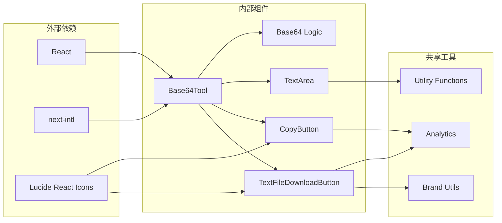
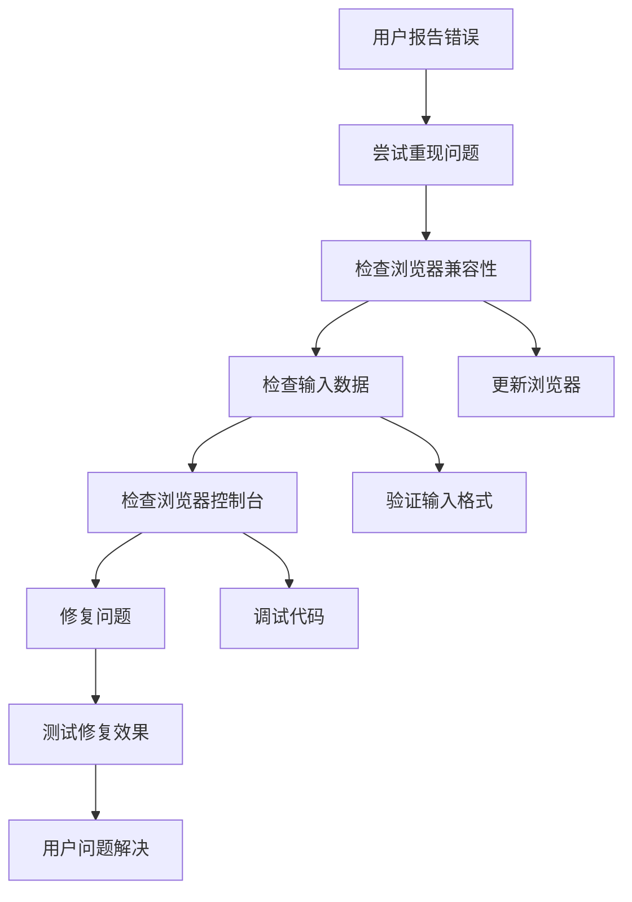

# Base64编码工具

<cite>
**本文档引用的文件**
- [Base64Tool.tsx](file://src/tools/developer/base64/Base64Tool.tsx)
- [logic.ts](file://src/tools/developer/base64/logic.ts)
- [index.ts](file://src/tools/developer/base64/index.ts)
- [TextArea.tsx](file://src/components/shared/TextArea.tsx)
- [TextFileDownloadButton.tsx](file://src/components/shared/TextFileDownloadButton.tsx)
- [CopyButton.tsx](file://src/components/shared/CopyButton.tsx)
- [tools-developer.json](file://messages/en/tools-developer.json)
- [common.json](file://messages/en/common.json)
</cite>

## 目录
1. [简介](#简介)
2. [项目结构](#项目结构)
3. [核心组件](#核心组件)
4. [架构概览](#架构概览)
5. [详细组件分析](#详细组件分析)
6. [依赖关系分析](#依赖关系分析)
7. [性能考虑](#性能考虑)
8. [故障排除指南](#故障排除指南)
9. [结论](#结论)
10. [附录](#附录)

## 简介

Base64编码工具是一个基于浏览器的隐私优先型工具，用于将文本数据编码为Base64格式或从Base64格式解码回原始文本。该工具完全在客户端运行，无需上传任何数据到服务器，确保用户数据的隐私和安全。

Base64编码是一种二进制到文本的编码方案，将二进制数据转换为ASCII字符集，常用于数据URL、电子邮件附件、API负载等场景。本工具支持UTF-8文本处理，能够正确处理Unicode字符、表情符号和多字节文本。

## 项目结构

Base64工具位于开发者工具类别中，采用模块化设计，主要包含以下组件：



**图表来源**
- [Base64Tool.tsx:1-52](file://src/tools/developer/base64/Base64Tool.tsx#L1-L52)
- [logic.ts:1-24](file://src/tools/developer/base64/logic.ts#L1-L24)
- [index.ts:1-37](file://src/tools/developer/base64/index.ts#L1-L37)

**章节来源**
- [Base64Tool.tsx:1-52](file://src/tools/developer/base64/Base64Tool.tsx#L1-L52)
- [index.ts:1-37](file://src/tools/developer/base64/index.ts#L1-L37)

## 核心组件

### 主界面组件 (Base64Tool.tsx)

Base64Tool.tsx是工具的主要用户界面，采用React函数组件设计，提供了直观的用户交互体验：

- **状态管理**: 使用useState钩子管理输入和输出状态
- **国际化支持**: 集成next-intl进行多语言本地化
- **文件拖放**: 支持通过拖放方式输入文本文件
- **实时处理**: 提供即时编码和解码功能

### 编码逻辑组件 (logic.ts)

logic.ts实现了Base64编码和解码的核心算法：

- **编码函数**: encodeBase64 - 将文本转换为Base64格式
- **解码函数**: decodeBase64 - 将Base64字符串还原为原始文本
- **错误处理**: 包含try-catch块处理异常情况
- **UTF-8支持**: 正确处理多字节字符序列

### 工具定义组件 (index.ts)

index.ts定义了工具的基本元数据和配置：

- **工具标识**: 唯一的slug标识符
- **分类信息**: 归属于开发者工具类别
- **SEO配置**: 结构化数据类型设置
- **FAQ集成**: 内置常见问题解答

**章节来源**
- [Base64Tool.tsx:11-52](file://src/tools/developer/base64/Base64Tool.tsx#L11-L52)
- [logic.ts:1-24](file://src/tools/developer/base64/logic.ts#L1-L24)
- [index.ts:3-37](file://src/tools/developer/base64/index.ts#L3-L37)

## 架构概览

Base64工具采用分层架构设计，确保了良好的可维护性和扩展性：



**图表来源**
- [Base64Tool.tsx:27-32](file://src/tools/developer/base64/Base64Tool.tsx#L27-L32)
- [logic.ts:1-24](file://src/tools/developer/base64/logic.ts#L1-L24)

### 数据流架构

```mermaid
flowchart TD
Input[用户输入] --> Validation[输入验证]
Validation --> TypeCheck{检查输入类型}
TypeCheck --> |纯文本| Encode[编码流程]
TypeCheck --> |Base64字符串| Decode[解码流程]
Encode --> UTF8[UTF-8编码处理]
UTF8 --> BrowserATOB[btoa()浏览器API]
BrowserATOB --> Output[Base64输出]
Decode --> BrowserATOB2[atob()浏览器API]
BrowserATOB2 --> UTF8Decode[UTF-8解码处理]
UTF8Decode --> Output2[文本输出]
Output --> UI[界面显示]
Output2 --> UI
UI --> User[用户反馈]
```

**图表来源**
- [logic.ts:1-24](file://src/tools/developer/base64/logic.ts#L1-L24)
- [Base64Tool.tsx:18-48](file://src/tools/developer/base64/Base64Tool.tsx#L18-L48)

## 详细组件分析

### Base64Tool界面组件

Base64Tool.tsx实现了完整的用户交互界面，具有以下特性：

#### 组件结构
- **状态管理**: 使用React状态钩子管理输入输出
- **事件处理**: 处理用户交互事件
- **国际化**: 集成多语言支持系统
- **文件处理**: 支持拖放文件输入

#### 用户界面元素



**图表来源**
- [Base64Tool.tsx:11-52](file://src/tools/developer/base64/Base64Tool.tsx#L11-L52)
- [TextArea.tsx:17-74](file://src/components/shared/TextArea.tsx#L17-L74)
- [CopyButton.tsx:9-57](file://src/components/shared/CopyButton.tsx#L9-L57)
- [TextFileDownloadButton.tsx:19-63](file://src/components/shared/TextFileDownloadButton.tsx#L19-L63)

#### 实时处理机制

Base64Tool支持实时处理，用户可以立即看到编码或解码结果：

- **即时响应**: 用户输入后立即触发处理
- **无延迟**: 客户端处理，无需网络请求
- **错误提示**: 对无效输入提供清晰的错误信息

**章节来源**
- [Base64Tool.tsx:11-52](file://src/tools/developer/base64/Base64Tool.tsx#L11-L52)

### 编码逻辑实现

logic.ts提供了Base64编码和解码的核心功能：

#### 编码算法 (encodeBase64)

编码过程遵循以下步骤：
1. **UTF-8编码**: 使用encodeURIComponent处理Unicode字符
2. **十六进制转换**: 将百分号编码转换为字节数组
3. **Base64转换**: 使用btoa()浏览器API进行Base64编码
4. **异常处理**: 捕获并处理编码错误

#### 解码算法 (decodeBase64)

解码过程包括：
1. **Base64解码**: 使用atob()浏览器API
2. **字节转换**: 将字节转换为十六进制字符串
3. **UTF-8解码**: 使用decodeURIComponent还原原始文本
4. **错误检测**: 验证输入是否为有效的Base64字符串

#### 错误处理机制



**图表来源**
- [logic.ts:2-11](file://src/tools/developer/base64/logic.ts#L2-L11)
- [logic.ts:14-23](file://src/tools/developer/base64/logic.ts#L14-L23)

**章节来源**
- [logic.ts:1-24](file://src/tools/developer/base64/logic.ts#L1-L24)

### 国际化支持

工具提供了全面的国际化支持，包括：

#### 多语言配置
- **基础翻译**: 英语、阿拉伯语、德语、法语等多种语言
- **工具特定**: Base64工具的专用翻译键值
- **通用组件**: 共享组件的通用翻译键值

#### 翻译键值结构

| 键名 | 描述 | 示例值 |
|------|------|--------|
| base64.name | 工具名称 | "Base64 Encode/Decode" |
| base64.description | 工具描述 | "Encode text to Base64 or decode Base64 back to text." |
| base64.inputPlaceholder | 输入框占位符 | "Enter text or Base64 string..." |
| base64.encode | 编码按钮文本 | "Encode" |
| base64.decode | 解码按钮文本 | "Decode" |

**章节来源**
- [tools-developer.json:52-95](file://messages/en/tools-developer.json#L52-L95)
- [common.json:249-251](file://messages/en/common.json#L249-L251)

## 依赖关系分析

### 组件间依赖



**图表来源**
- [Base64Tool.tsx:3-9](file://src/tools/developer/base64/Base64Tool.tsx#L3-L9)
- [TextArea.tsx:3-7](file://src/components/shared/TextArea.tsx#L3-L7)
- [CopyButton.tsx:3-7](file://src/components/shared/CopyButton.tsx#L3-L7)
- [TextFileDownloadButton.tsx:3-8](file://src/components/shared/TextFileDownloadButton.tsx#L3-L8)

### 浏览器API依赖

Base64工具依赖以下浏览器原生API：

| API | 用途 | 依赖关系 |
|-----|------|----------|
| btoa() | Base64编码 | encodeBase64函数 |
| atob() | Base64解码 | decodeBase64函数 |
| encodeURIComponent() | UTF-8编码 | encodeBase64函数 |
| decodeURIComponent() | UTF-8解码 | decodeBase64函数 |
| Blob | 文件下载 | TextFileDownloadButton组件 |
| navigator.clipboard | 剪贴板操作 | CopyButton组件 |

**章节来源**
- [logic.ts:1-24](file://src/tools/developer/base64/logic.ts#L1-L24)
- [TextFileDownloadButton.tsx:29-49](file://src/components/shared/TextFileDownloadButton.tsx#L29-L49)
- [CopyButton.tsx:23-34](file://src/components/shared/CopyButton.tsx#L23-L34)

## 性能考虑

### 处理性能

Base64工具的性能特点：

#### 浏览器原生优化
- **原生API**: 使用浏览器内置的Base64处理能力
- **内存效率**: 直接在内存中处理数据，避免额外的内存分配
- **无网络延迟**: 完全在客户端处理，无网络请求开销

#### 处理时间复杂度
- **编码复杂度**: O(n)，其中n是输入字符数
- **解码复杂度**: O(n)，与编码相同
- **空间复杂度**: O(n)，需要存储中间结果

#### 大数据处理
- **内存限制**: 受限于浏览器可用内存
- **性能监控**: 对超大文本提供性能警告
- **渐进式处理**: 支持分块处理大型数据

### 用户体验优化

#### 实时响应
- **即时反馈**: 用户输入后立即显示结果
- **加载指示**: 处理期间提供视觉反馈
- **错误快速提示**: 异常情况立即通知用户

#### 界面优化
- **响应式设计**: 适配不同屏幕尺寸
- **无障碍访问**: 支持键盘导航和屏幕阅读器
- **触摸友好**: 移动设备上的优化交互

## 故障排除指南

### 常见问题及解决方案

#### 编码失败
**症状**: 编码操作返回"Error: Unable to encode"
**原因**: 
- 输入包含无法处理的字符
- 浏览器不支持某些API
- 内存不足

**解决方案**:
1. 检查输入字符集
2. 更新浏览器版本
3. 清理浏览器缓存
4. 尝试较小的数据量

#### 解码失败
**症状**: 解码操作返回"Error: Invalid Base64 string"
**原因**:
- 输入不是有效的Base64字符串
- 字符串被截断或损坏
- 包含非法字符

**解决方案**:
1. 验证Base64字符串格式
2. 检查字符串完整性
3. 确认字符集正确性
4. 重新生成Base64字符串

#### 浏览器兼容性问题
**症状**: 工具无法正常工作
**原因**:
- 浏览器版本过旧
- JavaScript功能禁用
- 安全策略限制

**解决方案**:
1. 更新到最新浏览器版本
2. 启用JavaScript功能
3. 检查安全设置
4. 尝试其他浏览器

### 调试技巧

#### 开发者工具使用
- **控制台日志**: 查看JavaScript错误信息
- **网络面板**: 确认无意外的网络请求
- **内存面板**: 监控内存使用情况
- **性能面板**: 分析处理性能

#### 错误诊断流程



**图表来源**
- [logic.ts:8-11](file://src/tools/developer/base64/logic.ts#L8-L11)
- [logic.ts:20-23](file://src/tools/developer/base64/logic.ts#L20-L23)

**章节来源**
- [logic.ts:1-24](file://src/tools/developer/base64/logic.ts#L1-L24)

## 结论

Base64编码工具是一个设计精良、功能完整的隐私优先型工具。其核心优势包括：

### 技术优势
- **完全本地化**: 所有处理都在客户端完成，确保数据隐私
- **高效性能**: 利用浏览器原生API，处理速度快且资源占用少
- **用户友好**: 直观的界面设计和实时反馈机制
- **国际化支持**: 全面的多语言本地化

### 功能特性
- **双向转换**: 支持文本到Base64和Base64到文本的双向转换
- **UTF-8支持**: 正确处理各种语言和特殊字符
- **错误处理**: 完善的异常处理和用户友好的错误提示
- **实用工具**: 集成复制和下载功能

### 应用价值
该工具适用于多种场景，包括数据URI编码、API认证、配置文件处理等，为开发者和普通用户提供了一个安全、便捷的Base64处理解决方案。

## 附录

### 使用场景示例

#### 图片数据嵌入
- 将图片转换为Base64格式
- 直接嵌入到HTML/CSS中
- 减少HTTP请求次数

#### API请求参数传递
- 编码认证凭据
- 处理特殊字符
- 安全传输敏感数据

#### 数据传输优化
- 减少文件大小
- 优化网络传输
- 支持跨平台兼容

### 安全注意事项
- **数据隐私**: 所有处理都在本地完成
- **无持久化**: 不会保存任何用户数据
- **透明处理**: 用户可以验证处理过程
- **最小权限**: 仅使用必要的浏览器API

### 技术规格
- **支持字符集**: UTF-8完整支持
- **最大处理大小**: 受浏览器内存限制
- **处理速度**: 实时响应，毫秒级延迟
- **兼容性**: 支持现代主流浏览器