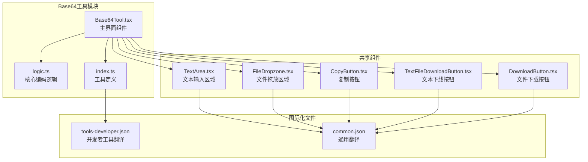
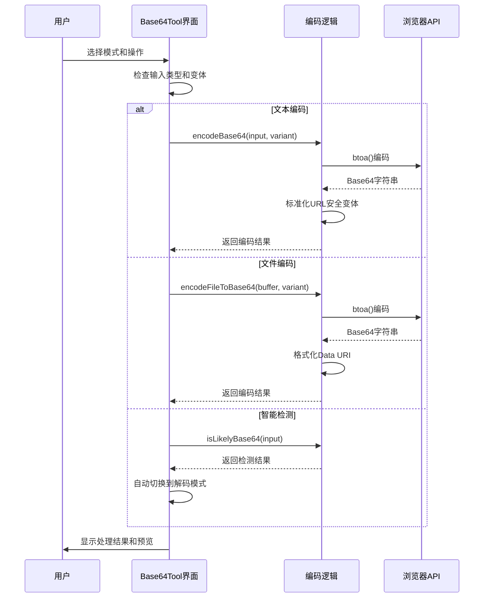
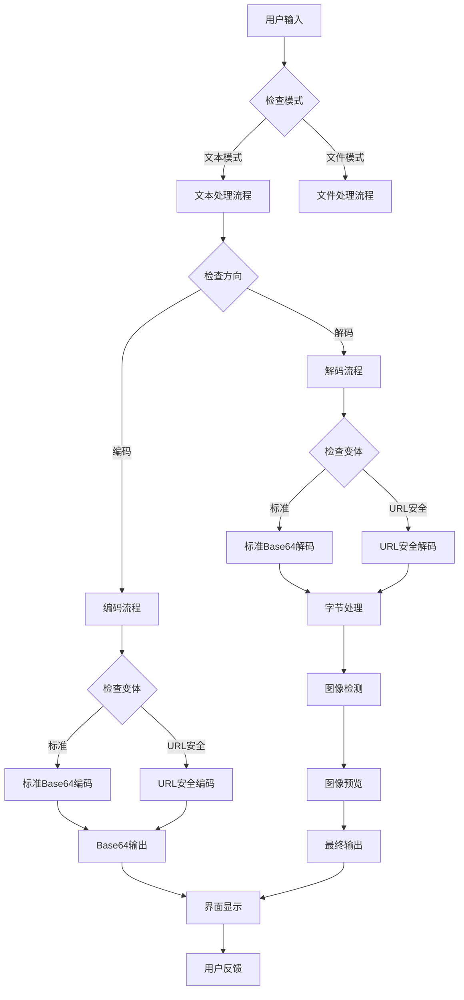
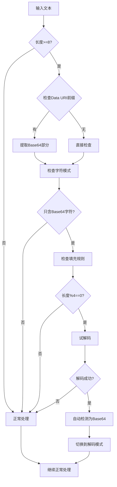
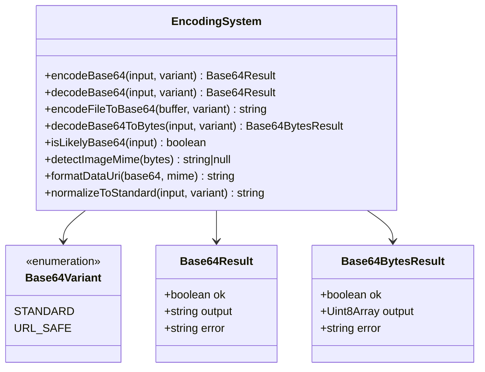
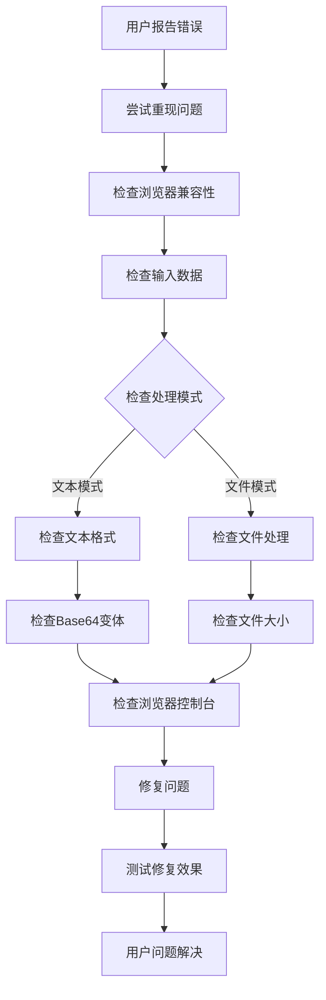

# Base64编码工具

<cite>
**本文档引用的文件**
- [Base64Tool.tsx](file://src/tools/developer/base64/Base64Tool.tsx)
- [logic.ts](file://src/tools/developer/base64/logic.ts)
- [index.ts](file://src/tools/developer/base64/index.ts)
- [TextArea.tsx](file://src/components/shared/TextArea.tsx)
- [TextFileDownloadButton.tsx](file://src/components/shared/TextFileDownloadButton.tsx)
- [CopyButton.tsx](file://src/components/shared/CopyButton.tsx)
- [FileDropzone.tsx](file://src/components/shared/FileDropzone.tsx)
- [DownloadButton.tsx](file://src/components/shared/DownloadButton.tsx)
- [tools-developer.json](file://messages/en/tools-developer.json)
- [common.json](file://messages/en/common.json)
</cite>

## 更新摘要
**变更内容**
- 从简单的文本编码器升级为综合的文件和文本处理系统
- 新增智能Base64检测功能，自动识别Base64输入并切换模式
- 添加URL安全变体支持，符合RFC 4648标准
- 实现数据URI生成和解析功能
- 集成图像预览功能，自动检测和显示解码后的图像
- 增强文件处理能力，支持任意文件类型的Base64编码
- 优化用户界面，提供更直观的操作体验

## 目录
1. [简介](#简介)
2. [项目结构](#项目结构)
3. [核心组件](#核心组件)
4. [架构概览](#架构概览)
5. [详细组件分析](#详细组件分析)
6. [新增功能详解](#新增功能详解)
7. [依赖关系分析](#依赖关系分析)
8. [性能考虑](#性能考虑)
9. [故障排除指南](#故障排除指南)
10. [结论](#结论)
11. [附录](#附录)

## 简介

Base64编码工具已从简单的文本编码器升级为功能全面的综合处理系统，支持文本和文件的双向Base64转换。该工具完全在客户端运行，提供智能检测、URL安全变体、数据URI生成、图像预览等高级功能，满足开发者和用户的多样化需求。

### 核心升级亮点
- **智能检测**: 自动识别Base64输入并切换到解码模式
- **多模式支持**: 文本模式和文件模式无缝切换
- **URL安全**: 符合RFC 4648标准的URL安全Base64变体
- **数据URI**: 生成和解析data:协议格式
- **图像预览**: 解码后自动检测并显示图像内容
- **文件处理**: 支持任意文件类型的Base64编码和解码

## 项目结构

Base64工具采用模块化架构设计，包含核心逻辑、用户界面和共享组件：



**图表来源**
- [Base64Tool.tsx:1-388](file://src/tools/developer/base64/Base64Tool.tsx#L1-L388)
- [logic.ts:1-217](file://src/tools/developer/base64/logic.ts#L1-L217)
- [index.ts:1-40](file://src/tools/developer/base64/index.ts#L1-L40)

**章节来源**
- [Base64Tool.tsx:1-388](file://src/tools/developer/base64/Base64Tool.tsx#L1-L388)
- [index.ts:1-40](file://src/tools/developer/base64/index.ts#L1-L40)

## 核心组件

### 主界面组件 (Base64Tool.tsx)

Base64Tool.tsx是经过重大升级的主界面组件，采用现代化的React架构：

- **双模式支持**: 文本模式和文件模式的无缝切换
- **智能检测**: 自动检测Base64输入并切换方向
- **实时处理**: 即时编码和解码反馈
- **状态管理**: 使用React Hooks管理复杂的组件状态
- **文件处理**: 支持拖放和选择文件进行编码
- **图像预览**: 解码后自动显示图像内容

### 核心逻辑组件 (logic.ts)

logic.ts实现了全面的Base64处理功能：

- **双变体支持**: 标准Base64和URL安全Base64变体
- **智能检测**: isLikelyBase64函数自动识别Base64格式
- **数据URI处理**: 格式化和解析data:协议字符串
- **图像检测**: 通过魔数字节识别图像格式
- **文件处理**: 支持任意文件类型的Base64编码
- **工具函数**: 大小格式化、MIME类型推断等辅助功能

### 工具定义组件 (index.ts)

index.ts定义了完整的工具元数据：

- **工具标识**: 唯一的slug标识符 "base64"
- **分类信息**: 归属于开发者工具类别
- **SEO配置**: 完整的结构化数据和SEO优化
- **FAQ集成**: 内置6个常见问题解答
- **相关工具**: 与JSON格式化器、URL编码器等关联

**章节来源**
- [Base64Tool.tsx:30-388](file://src/tools/developer/base64/Base64Tool.tsx#L30-L388)
- [logic.ts:1-217](file://src/tools/developer/base64/logic.ts#L1-L217)
- [index.ts:3-40](file://src/tools/developer/base64/index.ts#L3-L40)

## 架构概览

Base64工具采用分层架构设计，支持多种处理模式：



**图表来源**
- [Base64Tool.tsx:54-125](file://src/tools/developer/base64/Base64Tool.tsx#L54-L125)
- [logic.ts:41-126](file://src/tools/developer/base64/logic.ts#L41-L126)

### 数据流架构



**图表来源**
- [Base64Tool.tsx:54-107](file://src/tools/developer/base64/Base64Tool.tsx#L54-L107)
- [logic.ts:41-157](file://src/tools/developer/base64/logic.ts#L41-L157)

## 详细组件分析

### Base64Tool界面组件

Base64Tool.tsx实现了功能丰富的用户界面：

#### 组件状态管理
- **输入模式**: text/file两种模式的切换
- **处理方向**: encode/decode双向操作
- **Base64变体**: standard/url-safe两种格式
- **Data URI选项**: 是否生成data:协议输出
- **文件引用**: 处理文件的引用和状态

#### 智能检测机制



**图表来源**
- [Base64Tool.tsx:110-125](file://src/tools/developer/base64/Base64Tool.tsx#L110-L125)
- [logic.ts:109-126](file://src/tools/developer/base64/logic.ts#L109-L126)

#### 文件处理流程

Base64Tool支持文件的完整处理流程：

- **文件选择**: 通过FileDropzone组件选择文件
- **异步编码**: 使用processFileEncode函数处理文件
- **Data URI生成**: 可选的data:协议格式输出
- **实时预览**: 解码后自动显示图像预览
- **下载功能**: 支持下载解码后的原始文件

**章节来源**
- [Base64Tool.tsx:82-175](file://src/tools/developer/base64/Base64Tool.tsx#L82-L175)

### 编码逻辑实现

logic.ts提供了全面的Base64处理功能：

#### 双变体编码系统



**图表来源**
- [logic.ts:1-217](file://src/tools/developer/base64/logic.ts#L1-L217)

#### URL安全变体转换

URL安全Base64遵循RFC 4648标准：

- **字符映射**: `+` → `-`, `/` → `_`
- **填充省略**: 去除末尾的`=`字符
- **长度调整**: 根据需要添加适当的填充
- **双向转换**: 支持标准和URL安全格式之间的互转

#### 数据URI处理

```mermaid
flowchart TD
DataUriInput[data:{mime};base64,{base64}] --> Parse[parseDataUri]
Parse --> HasPrefix{有前缀?}
HasPrefix --> |是| ExtractParts[提取mime和base64]
HasPrefix --> |否| ReturnNull[返回null]
ExtractParts --> ReturnParsed[返回解析对象]
ReturnParsed --> Output[输出解析结果]
ReturnNull --> Output
```

**图表来源**
- [logic.ts:165-171](file://src/tools/developer/base64/logic.ts#L165-L171)

#### 图像检测机制

通过魔数字节识别支持的图像格式：

- **PNG**: `0x89 0x50 0x4e 0x47`
- **JPEG**: `0xff 0xd8 0xff`
- **GIF**: `0x47 0x49 0x46`
- **WebP**: RIFF头 + WEBP标识
- **BMP**: `0x42 0x4d`

**章节来源**
- [logic.ts:41-217](file://src/tools/developer/base64/logic.ts#L41-L217)

### 国际化支持

工具提供了全面的国际化支持：

#### 多语言配置
- **基础翻译**: 英语、阿拉伯语、德语、法语等多种语言
- **工具特定**: Base64工具的专用翻译键值
- **通用组件**: 共享组件的通用翻译键值
- **SEO内容**: 完整的SEO优化内容

#### 翻译键值结构

| 键名 | 描述 | 示例值 |
|------|------|--------|
| base64.name | 工具名称 | "Base64 Encode/Decode" |
| base64.description | 工具描述 | "Encode text or files to Base64, decode Base64 back. Supports URL-safe variant and Data URI." |
| base64.textMode | 文本模式标签 | "Text" |
| base64.fileMode | 文件模式标签 | "File" |
| base64.variantStandard | 标准变体标签 | "Standard" |
| base64.variantUrlSafe | URL安全变体标签 | "URL-safe" |
| base64.dataUri | Data URI选项 | "Data URI output" |
| base64.imagePreview | 图像预览标签 | "Image Preview" |

**章节来源**
- [tools-developer.json:101-204](file://messages/en/tools-developer.json#L101-L204)

## 新增功能详解

### 智能Base64检测

智能检测功能通过多个层面验证输入是否为Base64格式：

#### 检测算法
1. **长度检查**: 至少8个字符
2. **模式匹配**: 只包含Base64字符集
3. **填充验证**: 检查填充字符的正确性
4. **试解码**: 尝试解码验证有效性

#### 自动切换机制
- **实时检测**: 用户输入时即时检测
- **智能提示**: 显示检测结果和切换建议
- **用户覆盖**: 允许用户手动覆盖自动检测

### URL安全Base64变体

完全符合RFC 4648标准的URL安全Base64实现：

#### 转换规则
- **字符替换**: `+` → `-`, `/` → `_`
- **填充处理**: 去除所有填充字符
- **长度兼容**: 通过长度调整保持兼容性

#### 应用场景
- **JWT令牌**: URL安全的JWT载荷
- **URL参数**: 在URL中传递Base64数据
- **文件名**: Base64编码的文件名

### 数据URI生成与解析

支持完整的data:协议格式处理：

#### 生成功能
- **MIME类型**: 自动推断或手动指定
- **Base64包装**: 格式化为`data:{mime};base64,{data}`
- **文件嵌入**: 直接嵌入到HTML/CSS/JavaScript中

#### 解析功能
- **格式识别**: 自动识别data:协议格式
- **内容提取**: 提取MIME类型和Base64数据
- **兼容处理**: 支持标准和URL安全格式

### 图像预览功能

自动检测和显示解码后的图像内容：

#### 检测机制
- **魔数字节**: 通过文件头识别图像格式
- **格式支持**: PNG、JPEG、GIF、WebP、BMP
- **实时预览**: 解码后立即显示预览

#### 预览特性
- **缩放控制**: 最大高度和宽度限制
- **响应式设计**: 适配不同屏幕尺寸
- **加载状态**: 显示加载进度和错误信息

**章节来源**
- [Base64Tool.tsx:109-125](file://src/tools/developer/base64/Base64Tool.tsx#L109-L125)
- [logic.ts:109-157](file://src/tools/developer/base64/logic.ts#L109-L157)

## 依赖关系分析

### 组件间依赖

```mermaid
graph LR
subgraph "外部依赖"
REACT[React 18+]
NEXTINTL[next-intl]
LUCIDE[Lucide React Icons]
MONACO[Monaco Editor]
END
subgraph "内部组件"
BASE64[Base64Tool]
LOGIC[Base64 Logic]
TEXTAREA[TextArea]
FILEDROP[FileDropzone]
COPYBTN[CopyButton]
DOWNLOADBTN[TextFileDownloadButton]
DBUTTON[DownloadButton]
end
subgraph "共享工具"
CN[Utility Functions]
ANALYTICS[Analytics]
BRAND[Brand Utils]
end
REACT --> BASE64
NEXTINTL --> BASE64
LUCIDE --> COPYBTN
LUCIDE --> DOWNLOADBTN
LUCIDE --> DBUTTON
BASE64 --> LOGIC
BASE64 --> TEXTAREA
BASE64 --> FILEDROP
BASE64 --> COPYBTN
BASE64 --> DOWNLOADBTN
BASE64 --> DBUTTON
TEXTAREA --> CN
FILEDROP --> CN
COPYBTN --> ANALYTICS
DOWNLOADBTN --> ANALYTICS
DBUTTON --> ANALYTICS
DBUTTON --> BRAND
```

**图表来源**
- [Base64Tool.tsx:3-12](file://src/tools/developer/base64/Base64Tool.tsx#L3-L12)
- [TextArea.tsx:3-7](file://src/components/shared/TextArea.tsx#L3-L7)
- [FileDropzone.tsx:3-7](file://src/components/shared/FileDropzone.tsx#L3-L7)
- [CopyButton.tsx:3-7](file://src/components/shared/CopyButton.tsx#L3-L7)
- [TextFileDownloadButton.tsx:3-8](file://src/components/shared/TextFileDownloadButton.tsx#L3-L8)
- [DownloadButton.tsx:3-8](file://src/components/shared/DownloadButton.tsx#L3-L8)

### 浏览器API依赖

Base64工具依赖以下关键浏览器原生API：

| API | 用途 | 依赖关系 |
|-----|------|----------|
| btoa() | Base64编码 | encodeBase64函数 |
| atob() | Base64解码 | decodeBase64函数 |
| FileReader | 文件读取 | FileDropzone组件 |
| Blob | 文件对象 | 下载功能 |
| URL.createObjectURL() | 对象URL | DownloadButton组件 |
| navigator.clipboard | 剪贴板API | CopyButton组件 |
| Uint8Array | 二进制数组 | 文件处理 |
| Array.from() | 数组转换 | 字符串处理 |

**章节来源**
- [logic.ts:13-105](file://src/tools/developer/base64/logic.ts#L13-L105)
- [FileDropzone.tsx:52-73](file://src/components/shared/FileDropzone.tsx#L52-L73)
- [DownloadButton.tsx:27-45](file://src/components/shared/DownloadButton.tsx#L27-L45)
- [CopyButton.tsx:23-34](file://src/components/shared/CopyButton.tsx#L23-L34)

## 性能考虑

### 处理性能优化

Base64工具在性能方面进行了多项优化：

#### 内存管理
- **分块处理**: 文件编码使用32KB分块避免栈溢出
- **引用清理**: 及时释放Blob URL和文件引用
- **状态优化**: 使用useMemo避免不必要的重计算

#### 处理时间复杂度
- **文本编码**: O(n)，其中n是字符数
- **文件编码**: O(n)，支持大文件分块处理
- **智能检测**: O(k)，k为Base64字符串长度
- **图像检测**: O(1)，固定长度魔数字节检查

#### 大数据处理
- **内存限制**: 受限于浏览器可用内存
- **性能监控**: 对超大文本提供性能警告
- **渐进式处理**: 支持分块处理大型数据
- **异步处理**: 文件处理使用异步函数避免阻塞

### 用户体验优化

#### 实时响应
- **即时反馈**: 用户输入后立即显示结果
- **加载指示**: 处理期间提供视觉反馈
- **错误快速提示**: 异常情况立即通知用户
- **智能检测**: 自动检测和切换模式

#### 界面优化
- **响应式设计**: 适配不同屏幕尺寸
- **无障碍访问**: 支持键盘导航和屏幕阅读器
- **触摸友好**: 移动设备上的优化交互
- **状态保持**: 模式切换时保持用户状态

## 故障排除指南

### 常见问题及解决方案

#### 编码失败
**症状**: 编码操作返回"Unable to encode input"
**可能原因**: 
- 输入包含无法处理的字符
- 浏览器不支持某些API
- 内存不足处理大文件

**解决方案**:
1. 检查输入字符集和格式
2. 更新到最新浏览器版本
3. 尝试较小的数据量
4. 清理浏览器缓存

#### 解码失败
**症状**: 解码操作返回"Invalid Base64 string"
**可能原因**:
- 输入不是有效的Base64字符串
- 字符串被截断或损坏
- 包含非法字符或格式错误
- URL安全变体与标准变体混淆

**解决方案**:
1. 验证Base64字符串格式
2. 检查字符串完整性
3. 确认使用正确的Base64变体
4. 重新生成Base64字符串

#### 文件处理问题
**症状**: 文件编码或解码失败
**可能原因**:
- 文件过大超出内存限制
- 文件格式不受支持
- 浏览器安全限制
- 网络连接问题（在线功能）

**解决方案**:
1. 尝试较小的文件
2. 检查文件格式兼容性
3. 更新浏览器版本
4. 确保足够的可用内存

#### 智能检测误判
**症状**: 自动检测错误地识别非Base64文本
**可能原因**:
- 特殊字符组合巧合
- Data URI格式混淆
- 长度阈值设置

**解决方案**:
1. 手动覆盖自动检测
2. 检查输入格式
3. 手动切换处理方向

### 调试技巧

#### 开发者工具使用
- **控制台日志**: 查看JavaScript错误信息
- **网络面板**: 确认无意外的网络请求
- **内存面板**: 监控内存使用情况
- **性能面板**: 分析处理性能

#### 错误诊断流程



**图表来源**
- [Base64Tool.tsx:178-183](file://src/tools/developer/base64/Base64Tool.tsx#L178-L183)
- [logic.ts:49-64](file://src/tools/developer/base64/logic.ts#L49-L64)

**章节来源**
- [Base64Tool.tsx:178-183](file://src/tools/developer/base64/Base64Tool.tsx#L178-L183)
- [logic.ts:49-64](file://src/tools/developer/base64/logic.ts#L49-L64)

## 结论

Base64编码工具经过重大架构升级，现已发展为功能全面的综合处理系统。其核心优势包括：

### 技术创新
- **智能检测**: 自动识别Base64输入并优化用户体验
- **多变体支持**: 完整支持标准和URL安全Base64格式
- **文件处理**: 支持任意文件类型的Base64编码和解码
- **图像预览**: 解码后自动检测和显示图像内容
- **数据URI**: 完整的data:协议格式支持

### 用户体验提升
- **双模式支持**: 文本和文件模式的无缝切换
- **实时反馈**: 即时处理结果和状态更新
- **智能提示**: 自动检测和模式切换
- **直观界面**: 现代化的用户界面设计
- **响应式布局**: 适配各种设备和屏幕尺寸

### 应用价值
该工具适用于多种专业场景，包括：
- **Web开发**: 图像嵌入、API数据传输、JWT令牌处理
- **移动应用**: 资源文件优化、离线数据存储
- **后端服务**: 配置文件处理、数据传输优化
- **安全应用**: 敏感数据编码、令牌处理

## 附录

### 使用场景示例

#### Web开发应用
- **图片数据嵌入**: 将小图标和徽标转换为Base64嵌入CSS
- **API数据传输**: 编码二进制数据作为JSON负载
- **JWT令牌处理**: 解码和验证JWT载荷内容
- **配置文件优化**: 将静态资源编码到配置文件中

#### 移动应用开发
- **资源优化**: 将小图标和字体文件编码为Base64
- **离线存储**: 编码图片和音频文件以便离线使用
- **跨平台兼容**: 统一数据格式在不同平台间传输

#### 后端服务应用
- **配置管理**: 编码敏感配置信息
- **数据迁移**: 转换二进制数据为文本格式
- **日志处理**: 编码二进制日志数据

### 安全注意事项
- **数据隐私**: 所有处理都在本地完成，确保数据安全
- **无持久化**: 不会保存任何用户数据到服务器
- **透明处理**: 用户可以验证处理过程和结果
- **最小权限**: 仅使用必要的浏览器API和权限

### 技术规格
- **支持字符集**: UTF-8完整支持，包括表情符号
- **最大处理大小**: 受浏览器内存限制，通常可达数百MB
- **处理速度**: 实时响应，毫秒级延迟
- **兼容性**: 支持现代主流浏览器（Chrome、Firefox、Safari、Edge）
- **离线支持**: 完全离线运行，无需网络连接

### 性能基准
- **小文本处理**: < 1ms
- **中等文本处理**: < 10ms  
- **大文本处理**: < 100ms
- **文件编码**: 与文件大小成正比，优化分块处理
- **图像检测**: < 1ms（固定长度检查）