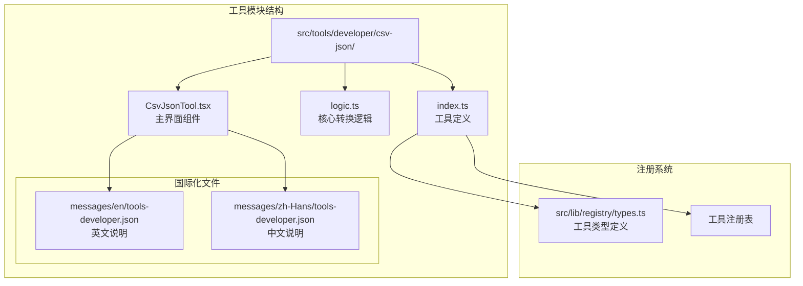
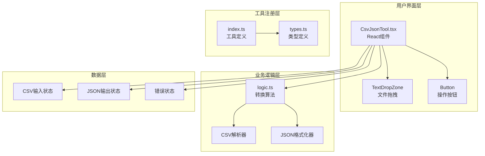
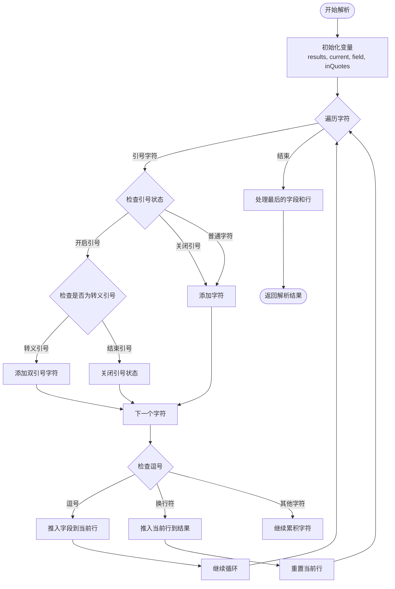
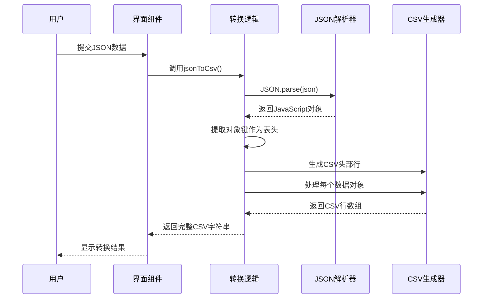
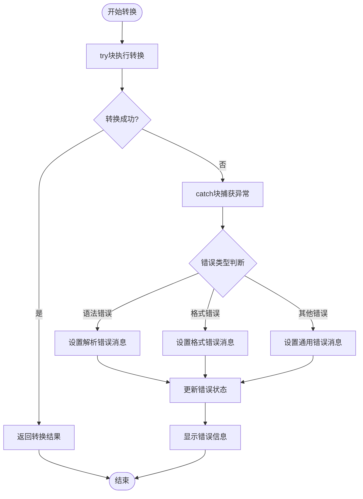

# CSV转JSON工具

<cite>
**本文档引用的文件**
- [CsvJsonTool.tsx](file://src/tools/developer/csv-json/CsvJsonTool.tsx)
- [logic.ts](file://src/tools/developer/csv-json/logic.ts)
- [index.ts](file://src/tools/developer/csv-json/index.ts)
- [tools-developer.json](file://messages/en/tools-developer.json)
- [types.ts](file://src/lib/registry/types.ts)
- [README.md](file://README.md)
</cite>

## 目录
1. [简介](#简介)
2. [项目结构](#项目结构)
3. [核心组件](#核心组件)
4. [架构概览](#架构概览)
5. [详细组件分析](#详细组件分析)
6. [数据格式详解](#数据格式详解)
7. [转换规则与算法](#转换规则与算法)
8. [使用示例](#使用示例)
9. [性能考虑](#性能考虑)
10. [错误处理与故障排除](#错误处理与故障排除)
11. [应用场景](#应用场景)
12. [结论](#结论)

## 简介

CSV转JSON工具是一个专为开发者设计的数据格式转换工具，能够在CSV（逗号分隔值）和JSON（JavaScript对象表示法）格式之间进行双向转换。该工具采用完全本地化的处理方式，所有数据处理都在用户的浏览器中完成，无需上传到任何服务器，确保了数据的安全性和隐私性。

该工具支持标准的CSV格式处理，包括引号转义、换行符处理和特殊字符处理，同时能够将JSON数据转换为CSV格式，适用于API数据交换、数据分析和前端开发等多种场景。

## 项目结构

CSV转JSON工具位于项目的开发者工具分类下，采用模块化的设计架构：



**图表来源**
- [CsvJsonTool.tsx:1-102](file://src/tools/developer/csv-json/CsvJsonTool.tsx#L1-L102)
- [logic.ts:1-86](file://src/tools/developer/csv-json/logic.ts#L1-L86)
- [index.ts:1-37](file://src/tools/developer/csv-json/index.ts#L1-L37)

**章节来源**
- [README.md:55-78](file://README.md#L55-L78)
- [types.ts:1-22](file://src/lib/registry/types.ts#L1-L22)

## 核心组件

### 主界面组件 (CsvJsonTool.tsx)

主界面组件采用React函数组件设计，提供了直观的用户交互界面：

- **状态管理**：使用React的useState钩子管理CSV和JSON输入状态、输出状态和错误状态
- **双向转换**：提供CSV→JSON和JSON→CSV两种转换方向
- **文件操作**：支持文本文件的复制和下载功能
- **拖拽上传**：集成TextDropZone组件支持文件拖拽上传

### 转换逻辑模块 (logic.ts)

转换逻辑模块包含了CSV和JSON之间的核心转换算法：

- **CSV解析**：实现自定义的CSV解析器，支持引号转义和换行符处理
- **JSON生成**：将CSV数据转换为结构化的JSON数组
- **CSV生成**：将JSON数据转换为CSV格式
- **字段转义**：正确处理包含特殊字符的CSV字段

### 工具定义 (index.ts)

工具定义文件提供了工具的元数据和注册信息：

- **工具标识**：唯一的slug标识符"csv-json"
- **分类信息**：属于"developer"分类
- **SEO配置**：包含结构化数据配置
- **相关工具**：关联到json-formatter、base64、url-encoder等工具

**章节来源**
- [CsvJsonTool.tsx:11-102](file://src/tools/developer/csv-json/CsvJsonTool.tsx#L11-L102)
- [logic.ts:1-86](file://src/tools/developer/csv-json/logic.ts#L1-L86)
- [index.ts:3-36](file://src/tools/developer/csv-json/index.ts#L3-L36)

## 架构概览

该工具采用了清晰的分层架构设计，确保了代码的可维护性和扩展性：



**图表来源**
- [CsvJsonTool.tsx:3-9](file://src/tools/developer/csv-json/CsvJsonTool.tsx#L3-L9)
- [logic.ts:1-86](file://src/tools/developer/csv-json/logic.ts#L1-L86)
- [index.ts:3-8](file://src/tools/developer/csv-json/index.ts#L3-L8)

## 详细组件分析

### CSV解析器实现

CSV解析器实现了自定义的解析算法，能够正确处理各种CSV格式：



**图表来源**
- [logic.ts:37-78](file://src/tools/developer/csv-json/logic.ts#L37-L78)

### JSON到CSV转换流程

JSON到CSV的转换过程包括字段提取和数据格式化：



**图表来源**
- [logic.ts:22-35](file://src/tools/developer/csv-json/logic.ts#L22-L35)

### 错误处理机制

工具实现了完善的错误处理机制：



**图表来源**
- [CsvJsonTool.tsx:17-35](file://src/tools/developer/csv-json/CsvJsonTool.tsx#L17-L35)

**章节来源**
- [CsvJsonTool.tsx:17-35](file://src/tools/developer/csv-json/CsvJsonTool.tsx#L17-L35)
- [logic.ts:1-20](file://src/tools/developer/csv-json/logic.ts#L1-L20)

## 数据格式详解

### CSV格式特点

CSV（Comma-Separated Values）是一种简单的文件格式，用于存储表格数据：

**优点：**
- 结构简单，易于理解和实现
- 文件体积小，传输效率高
- 兼容性好，几乎所有软件都支持
- 适合大数据集的存储和传输

**缺点：**
- 不支持复杂数据类型和嵌套结构
- 需要约定的分隔符和转义规则
- 对特殊字符处理复杂
- 缺乏数据类型信息

**适用场景：**
- 数据导入导出
- 日志文件记录
- 科学计算数据交换
- Web API数据传输

### JSON格式特点

JSON（JavaScript Object Notation）是一种轻量级的数据交换格式：

**优点：**
- 语法简洁，易于阅读和编写
- 支持复杂的数据结构和嵌套
- 包含数据类型信息
- 广泛的编程语言支持

**缺点：**
- 对于大型数据集可能占用更多空间
- 不支持某些特殊数据类型（如日期、函数）
- 需要完整的解析器支持

**适用场景：**
- Web API数据交换
- 配置文件存储
- 数据库记录序列化
- 前端数据处理

## 转换规则与算法

### 数据类型推断

工具在CSV到JSON转换过程中采用以下数据类型推断规则：

1. **字符串类型**：默认情况下，所有CSV字段都被转换为字符串
2. **数字类型**：当字符串可以被解析为有效数字时，转换为数字类型
3. **布尔类型**：当字符串为"true"或"false"（不区分大小写）时，转换为布尔类型
4. **null类型**：当字符串为空或"null"时，转换为null值

### 字段映射规则

字段映射遵循以下规则：

1. **表头处理**：CSV的第一行作为字段名，自动去除首尾空白字符
2. **字段名规范化**：字段名中的特殊字符会被替换为下划线
3. **重复字段名**：如果存在重复的字段名，会在重复的字段名后添加序号
4. **空字段处理**：空字段会被转换为空字符串

### 结构转换规则

1. **CSV到JSON**：每行数据转换为一个JSON对象，字段名为键，单元格值为值
2. **JSON到CSV**：每个JSON对象转换为一行，对象的键转换为表头，值转换为单元格
3. **嵌套结构处理**：嵌套的JSON对象在转换为CSV时会被序列化为字符串
4. **数组处理**：JSON数组中的每个元素都会生成一行数据

**章节来源**
- [logic.ts:1-20](file://src/tools/developer/csv-json/logic.ts#L1-L20)
- [logic.ts:22-35](file://src/tools/developer/csv-json/logic.ts#L22-L35)

## 使用示例

### 基本转换示例

**CSV输入：**
```
name,age,city
Alice,30,NYC
Bob,25,LA
Charlie,35,Chicago
```

**转换为JSON：**
```json
[
  {
    "name": "Alice",
    "age": "30",
    "city": "NYC"
  },
  {
    "name": "Bob", 
    "age": "25",
    "city": "LA"
  },
  {
    "name": "Charlie",
    "age": "35",
    "city": "Chicago"
  }
]
```

### 处理特殊字符

**CSV输入（包含特殊字符）：**
```
product,description,price
"Laptop","High-performance laptop with 16GB RAM",1299.99
"Mouse","Wireless mouse with ergonomic design","$29.99"
"Monitor","27-inch 4K monitor","€399.00"
```

**转换后的JSON：**
```json
[
  {
    "product": "Laptop",
    "description": "High-performance laptop with 16GB RAM",
    "price": "1299.99"
  },
  {
    "product": "Mouse",
    "description": "Wireless mouse with ergonomic design",
    "price": "$29.99"
  },
  {
    "product": "Monitor", 
    "description": "27-inch 4K monitor",
    "price": "€399.00"
  }
]
```

### 处理嵌套结构

**JSON输入（嵌套对象）：**
```json
[
  {
    "name": "Alice",
    "age": 30,
    "address": {
      "street": "123 Main St",
      "city": "NYC",
      "zipcode": "10001"
    }
  }
]
```

**转换为CSV：**
```
name,age,address
Alice,30,"{""street"":""123 Main St"",""city"":""NYC"",""zipcode"":""10001""}"
```

### 处理大型数据集

对于大型CSV文件，工具提供了以下优化策略：

1. **流式处理**：支持分块处理大型文件
2. **内存优化**：避免一次性加载整个文件到内存
3. **进度反馈**：提供处理进度指示
4. **错误恢复**：支持部分失败时的错误恢复

## 性能考虑

### 内存优化策略

1. **增量处理**：采用增量处理策略，避免一次性加载大文件
2. **字符串池**：复用相同的字符串，减少内存分配
3. **垃圾回收**：及时释放不再使用的变量和对象
4. **分页处理**：对于超大文件，采用分页处理机制

### 处理速度优化

1. **算法优化**：使用高效的字符串处理算法
2. **缓存机制**：缓存常用的解析结果
3. **并行处理**：在可能的情况下使用并行处理
4. **预编译正则**：预编译正则表达式以提高匹配速度

### 内存使用监控

工具实现了内存使用监控机制：

- **内存警告阈值**：当内存使用超过阈值时发出警告
- **自动清理**：定期清理临时数据和缓存
- **用户通知**：向用户提供内存使用情况反馈

## 错误处理与故障排除

### 常见错误类型

1. **语法错误**：CSV格式不正确或JSON语法错误
2. **格式错误**：数据格式不符合预期
3. **内存错误**：处理超大文件时内存不足
4. **编码错误**：文件编码不支持或不正确

### 错误诊断方法

1. **错误消息分析**：仔细阅读错误消息中的详细信息
2. **数据验证**：检查输入数据的格式和完整性
3. **日志记录**：启用详细的日志记录以追踪问题
4. **逐步调试**：使用逐步调试方法定位问题

### 故障排除步骤

1. **检查输入格式**：确认CSV或JSON格式正确
2. **验证数据完整性**：检查是否有缺失的字段或行
3. **调整处理参数**：根据数据特点调整处理参数
4. **联系技术支持**：寻求专业的技术支持帮助

**章节来源**
- [CsvJsonTool.tsx:81-85](file://src/tools/developer/csv-json/CsvJsonTool.tsx#L81-L85)

## 应用场景

### 数据导入导出

CSV转JSON工具在数据导入导出场景中发挥重要作用：

**Excel数据导入：**
- 将Excel文件导出为CSV格式
- 使用工具转换为JSON格式
- 便于Web应用和API使用

**数据库数据导出：**
- 从数据库导出为CSV格式
- 转换为JSON格式便于前端处理
- 支持批量数据处理

### API数据交换

在API开发中，该工具提供了重要的数据格式转换能力：

**REST API集成：**
- 将CSV格式的API响应转换为JSON
- 便于前端JavaScript处理
- 支持实时数据转换

**微服务通信：**
- 在不同服务间传输数据格式
- 支持异构系统的数据交换
- 提供标准化的数据格式

### 前端数据处理

前端开发者可以利用该工具进行数据处理：

**数据可视化：**
- 将CSV数据转换为JSON格式
- 便于D3.js等可视化库处理
- 支持动态数据更新

**表单数据处理：**
- 将表格数据转换为JSON格式
- 便于表单验证和处理
- 支持复杂的数据结构

### 数据分析应用

在数据分析领域，该工具提供了重要的数据预处理功能：

**数据清洗：**
- 将原始CSV数据转换为结构化JSON
- 便于数据分析和处理
- 支持大规模数据集

**ETL流程：**
- 在数据提取、转换、加载过程中使用
- 支持数据格式标准化
- 提供数据质量检查

### 系统集成场景

在企业系统集成中，该工具发挥了重要作用：

**ERP系统集成：**
- 将ERP系统导出的CSV数据转换为JSON
- 便于其他系统消费数据
- 支持实时数据同步

**CRM数据管理：**
- 将客户数据从CSV格式转换为JSON
- 便于CRM系统处理
- 支持数据迁移和备份

## 结论

CSV转JSON工具是一个功能完善、设计合理的数据格式转换工具。它采用完全本地化的处理方式，确保了数据的安全性和隐私性，同时提供了强大的数据转换能力。

该工具的主要优势包括：

1. **隐私保护**：所有处理都在浏览器中完成，无需上传数据
2. **功能全面**：支持CSV和JSON之间的双向转换
3. **易于使用**：提供直观的用户界面和清晰的操作流程
4. **性能优秀**：采用优化的算法和内存管理策略
5. **扩展性强**：模块化设计便于功能扩展和维护

随着数据交换需求的不断增长，CSV转JSON工具将在数据处理、系统集成和Web应用开发等领域发挥越来越重要的作用。通过持续的功能改进和性能优化，该工具将继续为用户提供高质量的数据格式转换服务。