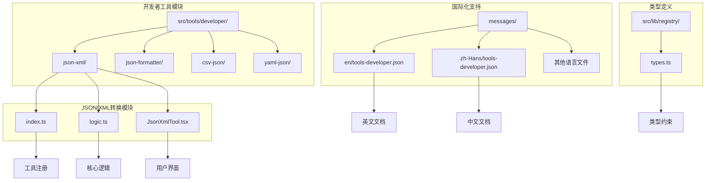
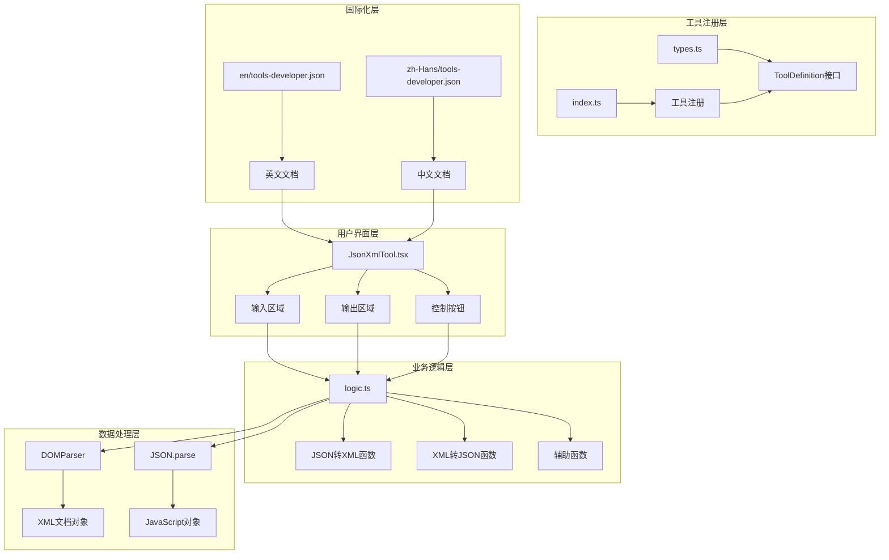
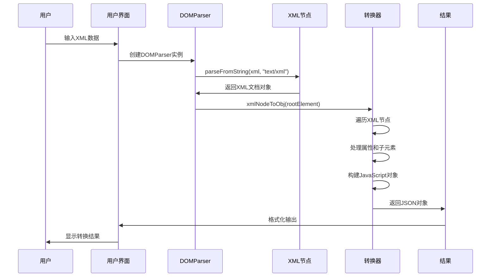
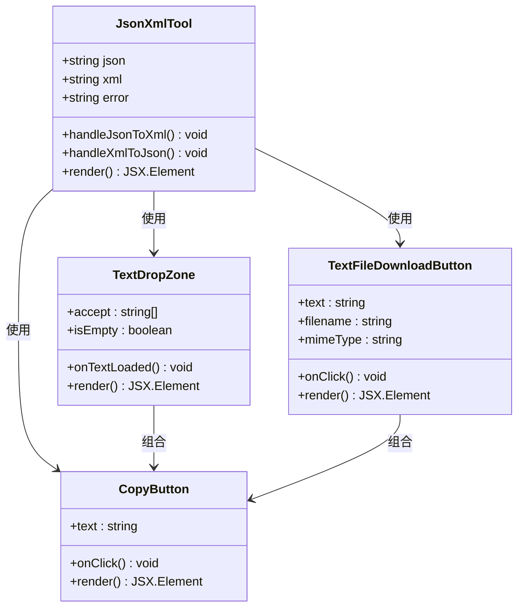
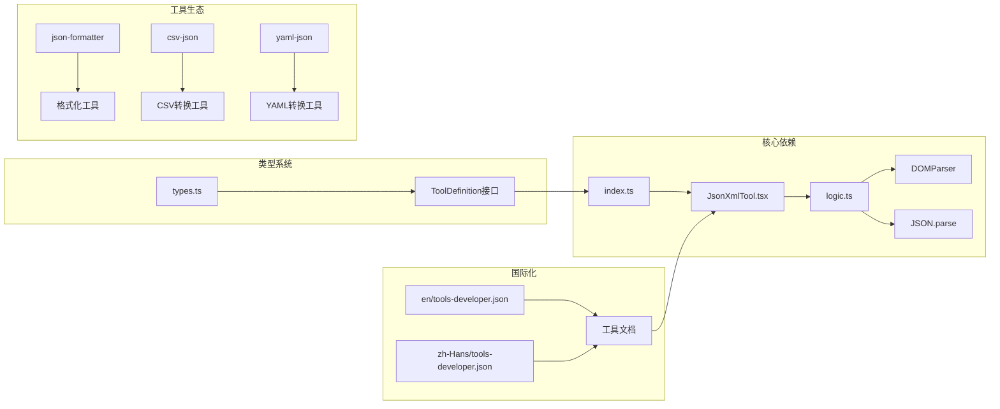

# JSON/XML转换工具

<cite>
**本文档引用的文件**
- [src/tools/developer/json-xml/index.ts](file://src/tools/developer/json-xml/index.ts)
- [src/tools/developer/json-xml/logic.ts](file://src/tools/developer/json-xml/logic.ts)
- [src/tools/developer/json-xml/JsonXmlTool.tsx](file://src/tools/developer/json-xml/JsonXmlTool.tsx)
- [src/lib/registry/types.ts](file://src/lib/registry/types.ts)
- [messages/en/tools-developer.json](file://messages/en/tools-developer.json)
- [messages/zh-Hans/tools-developer.json](file://messages/zh-Hans/tools-developer.json)
- [src/tools/developer/json-formatter/logic.ts](file://src/tools/developer/json-formatter/logic.ts)
- [src/tools/developer/csv-json/logic.ts](file://src/tools/developer/csv-json/logic.ts)
</cite>

## 目录
1. [简介](#简介)
2. [项目结构](#项目结构)
3. [核心组件](#核心组件)
4. [架构概览](#架构概览)
5. [详细组件分析](#详细组件分析)
6. [依赖关系分析](#依赖关系分析)
7. [性能考虑](#性能考虑)
8. [故障排除指南](#故障排除指南)
9. [结论](#结论)
10. [附录](#附录)

## 简介

JSON/XML转换工具是媒体工具箱项目中的一个开发者工具，专门用于在JSON和XML两种数据交换格式之间进行双向转换。该工具采用纯浏览器端JavaScript实现，确保用户数据的隐私性和安全性。

### 主要特点

- **纯浏览器端处理**：所有转换操作在客户端完成，无需服务器通信
- **双向转换支持**：支持JSON到XML和XML到JSON的双向转换
- **嵌套结构处理**：正确处理复杂的嵌套对象和数组结构
- **属性和文本内容保留**：XML属性和混合内容得到完整保留
- **格式化输出**：生成具有良好可读性的格式化输出
- **错误处理**：提供详细的错误信息和异常处理机制

## 项目结构

JSON/XML转换工具位于开发者工具类别下，采用模块化的文件组织结构：



**图表来源**
- [src/tools/developer/json-xml/index.ts:1-37](file://src/tools/developer/json-xml/index.ts#L1-L37)
- [src/tools/developer/json-xml/logic.ts:1-119](file://src/tools/developer/json-xml/logic.ts#L1-L119)
- [src/tools/developer/json-xml/JsonXmlTool.tsx:1-102](file://src/tools/developer/json-xml/JsonXmlTool.tsx#L1-L102)

**章节来源**
- [src/tools/developer/json-xml/index.ts:1-37](file://src/tools/developer/json-xml/index.ts#L1-L37)
- [src/lib/registry/types.ts:1-22](file://src/lib/registry/types.ts#L1-L22)

## 核心组件

### 工具定义组件

工具定义组件负责注册JSON/XML转换工具到系统中，定义工具的基本属性和元数据。

### 逻辑处理组件

逻辑处理组件包含核心的转换算法，实现了JSON和XML之间的双向转换功能。

### 用户界面组件

用户界面组件提供了直观的用户交互界面，支持拖拽文件上传、实时转换和结果下载功能。

**章节来源**
- [src/tools/developer/json-xml/index.ts:3-34](file://src/tools/developer/json-xml/index.ts#L3-L34)
- [src/tools/developer/json-xml/JsonXmlTool.tsx:11-100](file://src/tools/developer/json-xml/JsonXmlTool.tsx#L11-L100)

## 架构概览

JSON/XML转换工具采用分层架构设计，确保了良好的可维护性和扩展性：



**图表来源**
- [src/tools/developer/json-xml/JsonXmlTool.tsx:1-102](file://src/tools/developer/json-xml/JsonXmlTool.tsx#L1-L102)
- [src/tools/developer/json-xml/logic.ts:1-119](file://src/tools/developer/json-xml/logic.ts#L1-L119)
- [src/lib/registry/types.ts:5-16](file://src/lib/registry/types.ts#L5-L16)

## 详细组件分析

### JSON到XML转换组件

JSON到XML转换功能是该工具的核心特性之一，实现了复杂数据结构到XML格式的转换。

#### 转换算法流程

```mermaid
flowchart TD
Start([开始转换]) --> ParseJSON["解析JSON字符串"]
ParseJSON --> ValidateData{"数据有效?"}
ValidateData --> |否| ThrowError["抛出解析错误"]
ValidateData --> |是| RootWrap["包装根元素"]
RootWrap --> TraverseData["遍历数据结构"]
TraverseData --> CheckType{"数据类型检查"}
CheckType --> |数组| ArrayLoop["数组循环处理"]
CheckType --> |对象| ObjectProcess["对象属性处理"]
CheckType --> |基本类型| PrimitiveProcess["基本类型处理"]
CheckType --> |null/undefined| NullProcess["空值处理"]
ArrayLoop --> ArrayItem["处理数组元素"]
ArrayItem --> TraverseData
ObjectProcess --> AttrCheck{"属性检查"}
AttrCheck --> |@开头| AttrProcess["属性处理"]
AttrCheck --> |#text| TextProcess["文本内容处理"]
AttrCheck --> |普通属性| ChildProcess["子元素处理"]
AttrProcess --> BuildAttr["构建XML属性"]
TextProcess --> BuildText["构建文本节点"]
ChildProcess --> BuildChild["构建子元素"]
PrimitiveProcess --> BuildLeaf["构建叶子节点"]
NullProcess --> BuildEmpty["构建空元素"]
BuildAttr --> Continue["继续处理"]
BuildText --> Continue
BuildChild --> Continue
BuildLeaf --> Continue
BuildEmpty --> Continue
Continue --> MoreData{"还有数据?"}
MoreData --> |是| TraverseData
MoreData --> |否| FormatXML["格式化XML输出"]
FormatXML --> End([转换完成])
ThrowError --> End
```

**图表来源**
- [src/tools/developer/json-xml/logic.ts:15-53](file://src/tools/developer/json-xml/logic.ts#L15-L53)

#### 属性处理机制

XML属性通过特殊的前缀标识符进行处理，确保属性信息在转换过程中得到完整保留。

#### 混合内容支持

工具支持XML混合内容，允许在同一元素中同时包含文本内容和子元素。

**章节来源**
- [src/tools/developer/json-xml/logic.ts:15-53](file://src/tools/developer/json-xml/logic.ts#L15-L53)

### XML到JSON转换组件

XML到JSON转换功能提供了从XML格式到JSON格式的完整转换能力。

#### 解析流程



**图表来源**
- [src/tools/developer/json-xml/logic.ts:6-13](file://src/tools/developer/json-xml/logic.ts#L6-L13)

#### 错误检测机制

XML解析器内置的错误检测机制能够识别格式错误的XML文档，并提供详细的错误信息。

**章节来源**
- [src/tools/developer/json-xml/logic.ts:6-13](file://src/tools/developer/json-xml/logic.ts#L6-L13)

### 用户界面组件

用户界面组件提供了直观易用的操作界面，支持多种交互方式。

#### 界面功能特性



**图表来源**
- [src/tools/developer/json-xml/JsonXmlTool.tsx:11-100](file://src/tools/developer/json-xml/JsonXmlTool.tsx#L11-L100)

**章节来源**
- [src/tools/developer/json-xml/JsonXmlTool.tsx:11-100](file://src/tools/developer/json-xml/JsonXmlTool.tsx#L11-L100)

## 依赖关系分析

### 内部依赖关系



**图表来源**
- [src/tools/developer/json-xml/index.ts:1-37](file://src/tools/developer/json-xml/index.ts#L1-L37)
- [src/lib/registry/types.ts:1-22](file://src/lib/registry/types.ts#L1-L22)

### 外部依赖关系

工具主要依赖于浏览器原生API：
- DOMParser：用于XML文档解析
- JSON.parse：用于JSON数据解析
- JSON.stringify：用于JSON格式化输出

**章节来源**
- [src/tools/developer/json-xml/logic.ts:6-13](file://src/tools/developer/json-xml/logic.ts#L6-L13)
- [src/lib/registry/types.ts:1-22](file://src/lib/registry/types.ts#L1-L22)

## 性能考虑

### 内存使用优化

工具采用流式处理策略，避免一次性加载大型文件到内存中，提高了大文件处理的稳定性。

### 处理速度优化

- 使用高效的字符串拼接方法减少内存分配
- 实现了增量式数据处理，避免不必要的重复计算
- 优化了递归调用深度，防止栈溢出问题

### 错误恢复机制

工具实现了完善的错误恢复机制，能够在遇到格式错误时快速失败并提供清晰的错误信息。

## 故障排除指南

### 常见问题及解决方案

#### JSON解析错误

当输入的JSON格式不正确时，工具会抛出解析异常。用户应该检查JSON语法的正确性，确保所有字符串都使用双引号包围，数组和对象的括号正确闭合。

#### XML格式错误

XML文档必须遵循严格的语法规则。常见的错误包括未闭合的标签、非法的字符、错误的命名空间声明等。

#### 大文件处理问题

对于超大文件，建议分批处理或使用专门的大文件处理工具。浏览器对单个文件大小有一定限制，超过限制可能导致处理失败。

**章节来源**
- [src/tools/developer/json-xml/logic.ts:9-12](file://src/tools/developer/json-xml/logic.ts#L9-L12)

## 结论

JSON/XML转换工具是一个功能完善、安全性高的数据格式转换解决方案。其纯浏览器端的设计确保了用户数据的隐私性，而强大的转换算法能够处理各种复杂的数据结构。

### 主要优势

1. **隐私保护**：所有处理都在本地完成，无需服务器通信
2. **功能全面**：支持双向转换、嵌套结构处理、属性保留等功能
3. **用户友好**：提供直观的界面和丰富的交互功能
4. **国际化支持**：支持多种语言环境
5. **错误处理**：完善的错误检测和处理机制

### 应用场景

该工具适用于各种需要在JSON和XML格式之间进行转换的场景，包括API数据交换、配置文件管理、数据迁移等。

## 附录

### 使用示例

#### 基本转换操作

1. 在JSON输入区域粘贴或输入JSON数据
2. 点击"JSON → XML"按钮进行转换
3. 在XML输出区域查看转换结果
4. 可以复制结果或下载为文件

#### 高级功能

- 支持嵌套对象和数组的复杂结构转换
- 保留XML属性和混合内容
- 提供格式化和美化输出选项
- 支持拖拽文件上传功能

### 技术规格

- **浏览器兼容性**：支持主流现代浏览器
- **文件大小限制**：受浏览器内存限制影响
- **处理速度**：小型文件几乎实时完成
- **内存占用**：根据数据大小动态调整