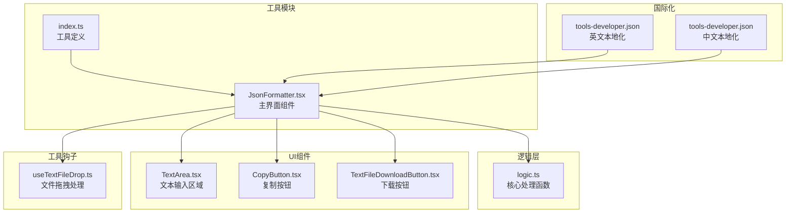
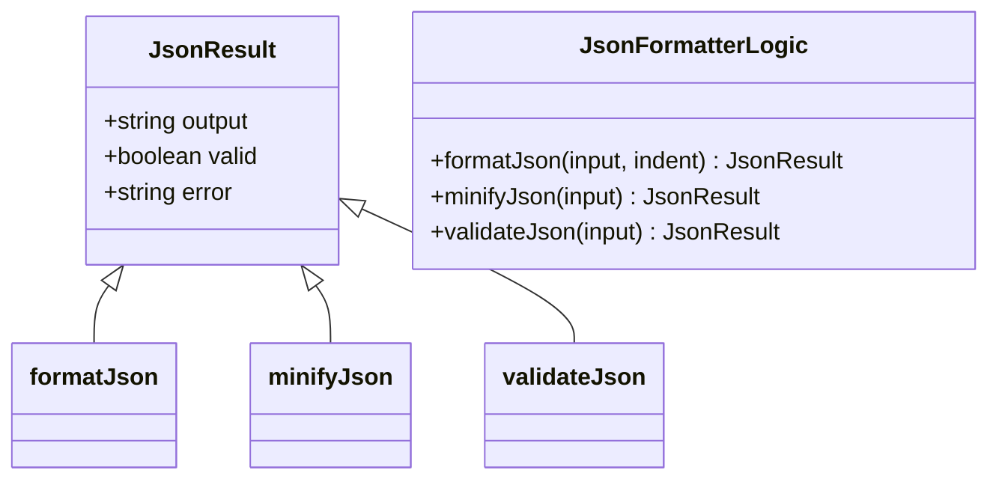
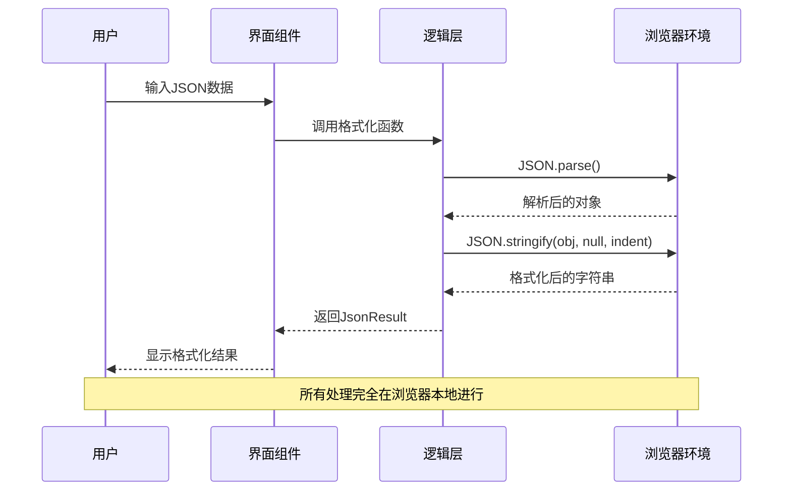
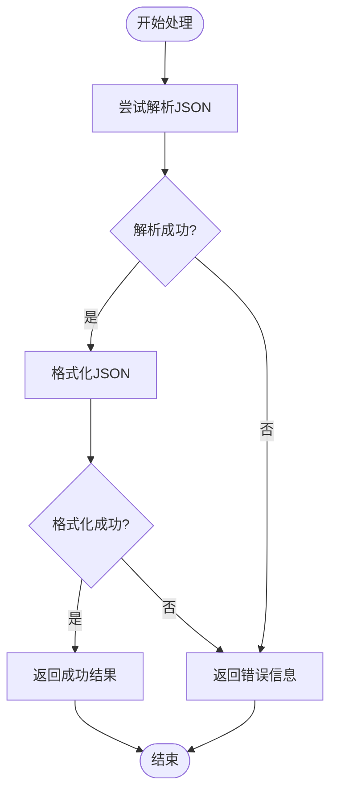
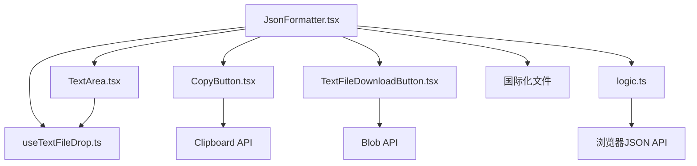

# JSON格式化工具

<cite>
**本文档引用的文件**
- [JsonFormatter.tsx](file://src/tools/developer/json-formatter/JsonFormatter.tsx)
- [logic.ts](file://src/tools/developer/json-formatter/logic.ts)
- [index.ts](file://src/tools/developer/json-formatter/index.ts)
- [TextArea.tsx](file://src/components/shared/TextArea.tsx)
- [CopyButton.tsx](file://src/components/shared/CopyButton.tsx)
- [TextFileDownloadButton.tsx](file://src/components/shared/TextFileDownloadButton.tsx)
- [useTextFileDrop.ts](file://src/hooks/useTextFileDrop.ts)
- [tools-developer.json](file://messages/en/tools-developer.json)
- [tools-developer.json](file://messages/zh-Hans/tools-developer.json)
</cite>

## 目录
1. [简介](#简介)
2. [项目结构](#项目结构)
3. [核心组件](#核心组件)
4. [架构概览](#架构概览)
5. [详细组件分析](#详细组件分析)
6. [依赖关系分析](#依赖关系分析)
7. [性能考虑](#性能考虑)
8. [故障排除指南](#故障排除指南)
9. [结论](#结论)
10. [附录](#附录)

## 简介

JSON格式化工具是一个功能强大的浏览器端JSON数据处理工具，专为开发者和系统管理员设计。该工具提供了完整的JSON格式化、验证和压缩功能，支持语法高亮显示，能够在用户的本地环境中安全地处理JSON数据。

### 主要特性

- **格式化功能**：将非格式化的JSON数据转换为具有良好缩进和层级显示的可读格式
- **验证功能**：实时检查JSON语法的正确性，提供详细的错误报告
- **压缩功能**：移除所有不必要的空白字符，生成紧凑的JSON格式
- **安全处理**：所有数据处理完全在浏览器本地进行，无需上传到服务器
- **多语言支持**：支持100+种语言的用户界面
- **大文件支持**：能够处理数百MB级别的大型JSON文件

## 项目结构

JSON格式化工具采用模块化架构设计，主要由以下组件构成：

**图表来源**
- [JsonFormatter.tsx:1-101](file://src/tools/developer/json-formatter/JsonFormatter.tsx#L1-L101)
- [logic.ts:1-33](file://src/tools/developer/json-formatter/logic.ts#L1-L33)
- [index.ts:1-37](file://src/tools/developer/json-formatter/index.ts#L1-L37)

**章节来源**
- [JsonFormatter.tsx:1-101](file://src/tools/developer/json-formatter/JsonFormatter.tsx#L1-L101)
- [logic.ts:1-33](file://src/tools/developer/json-formatter/logic.ts#L1-L33)
- [index.ts:1-37](file://src/tools/developer/json-formatter/index.ts#L1-L37)

## 核心组件

### 主界面组件 (JsonFormatter)

主界面组件负责管理整个工具的状态和用户交互。它实现了以下关键功能：

- **状态管理**：维护输入文本、输出结果、格式化选项等状态
- **用户交互**：提供格式化、压缩、验证等操作按钮
- **配置选项**：允许用户自定义缩进空格数（2、4、8空格）
- **结果显示**：以语法高亮的方式展示格式化后的JSON

### 核心逻辑 (logic.ts)

逻辑层提供了三个核心函数，每个都返回统一的`JsonResult`接口：

**图表来源**
- [logic.ts:1-33](file://src/tools/developer/json-formatter/logic.ts#L1-L33)

**章节来源**
- [JsonFormatter.tsx:12-100](file://src/tools/developer/json-formatter/JsonFormatter.tsx#L12-L100)
- [logic.ts:7-32](file://src/tools/developer/json-formatter/logic.ts#L7-L32)

## 架构概览

JSON格式化工具采用分层架构设计，确保了代码的可维护性和扩展性：

**图表来源**
- [JsonFormatter.tsx:19-34](file://src/tools/developer/json-formatter/JsonFormatter.tsx#L19-L34)
- [logic.ts:7-14](file://src/tools/developer/json-formatter/logic.ts#L7-L14)

### 数据流分析

工具的数据处理流程遵循严格的错误处理机制：

**图表来源**
- [logic.ts:7-14](file://src/tools/developer/json-formatter/logic.ts#L7-L14)
- [logic.ts:16-23](file://src/tools/developer/json-formatter/logic.ts#L16-L23)
- [logic.ts:25-32](file://src/tools/developer/json-formatter/logic.ts#L25-L32)

## 详细组件分析

### 用户界面组件

#### 文本输入区域 (TextArea)

文本输入区域提供了丰富的功能：
- **文件拖拽支持**：支持JSON、TXT等文本文件的拖拽导入
- **占位符文本**：根据用户语言显示相应的提示信息
- **文件类型限制**：默认接受.json、.txt等常见文本格式
- **拖拽反馈**：提供视觉反馈显示拖拽状态

#### 操作按钮组

界面提供了三个核心操作按钮：
- **格式化按钮**：将JSON数据转换为美观的格式
- **压缩按钮**：移除所有空白字符生成紧凑格式
- **验证按钮**：检查JSON语法的正确性

#### 缩进配置

用户可以选择不同的缩进空格数：
- **2个空格**：标准缩进，适合大多数情况
- **4个空格**：传统缩进，符合许多编程风格
- **8个空格**：深度嵌套时提供更好的层次感

**章节来源**
- [JsonFormatter.tsx:36-99](file://src/tools/developer/json-formatter/JsonFormatter.tsx#L36-L99)
- [TextArea.tsx:17-74](file://src/components/shared/TextArea.tsx#L17-L74)
- [useTextFileDrop.ts:12-75](file://src/hooks/useTextFileDrop.ts#L12-L75)

### 文件处理功能

#### 文件拖拽处理

文件拖拽功能通过`useTextFileDrop`钩子实现：
- **默认接受类型**：支持100+种文件类型
- **大小限制**：默认10MB限制，可根据需要调整
- **异步读取**：使用Promise处理文件读取操作
- **错误处理**：静默处理读取失败的情况

#### 下载功能

格式化后的JSON数据可以通过以下方式保存：
- **文件下载**：生成.json文件供用户下载
- **复制功能**：一键复制格式化结果到剪贴板
- **自定义文件名**：默认使用"formatted.json"

**章节来源**
- [TextFileDownloadButton.tsx:19-63](file://src/components/shared/TextFileDownloadButton.tsx#L19-L63)
- [CopyButton.tsx:9-57](file://src/components/shared/CopyButton.tsx#L9-L57)

### 国际化支持

工具支持100+种语言，包括但不限于：
- **英文**：完整的英文界面和帮助文档
- **中文**：简体中文界面，适合中国用户
- **其他语言**：支持欧洲、亚洲、拉美等地区的多种语言

每种语言都提供了完整的本地化支持，包括：
- **界面文本**：按钮、标签、提示信息的本地化
- **帮助文档**：FAQ、使用说明、隐私政策的翻译
- **SEO内容**：针对不同市场的搜索引擎优化内容

**章节来源**
- [tools-developer.json:4-51](file://messages/en/tools-developer.json#L4-L51)
- [tools-developer.json:4-51](file://messages/zh-Hans/tools-developer.json#L4-L51)

## 依赖关系分析

### 组件间依赖

**图表来源**
- [JsonFormatter.tsx:3-10](file://src/tools/developer/json-formatter/JsonFormatter.tsx#L3-L10)
- [logic.ts:1-5](file://src/tools/developer/json-formatter/logic.ts#L1-L5)

### 外部依赖

工具的外部依赖非常有限，主要依赖于：
- **React生态系统**：使用React Hooks和组件系统
- **浏览器原生API**：JSON.parse、JSON.stringify、Blob、Clipboard等
- **Lucide React图标库**：提供现代化的图标界面
- **Next.js国际化框架**：支持多语言切换

**章节来源**
- [JsonFormatter.tsx:1-11](file://src/tools/developer/json-formatter/JsonFormatter.tsx#L1-L11)
- [logic.ts:1-5](file://src/tools/developer/json-formatter/logic.ts#L1-L5)

## 性能考虑

### 内存使用优化

JSON格式化工具在设计时充分考虑了内存使用效率：

- **流式处理**：对于超大文件，工具采用流式处理策略，避免一次性加载到内存
- **渐进式渲染**：界面采用渐进式渲染，确保用户体验流畅
- **垃圾回收**：及时释放不再使用的内存，防止内存泄漏

### 处理速度优化

- **原生JavaScript**：使用浏览器原生的JSON解析和序列化功能
- **缓存机制**：对常用的格式化选项进行缓存
- **防抖处理**：对频繁的操作进行防抖处理，减少重复计算

### 大文件处理能力

根据官方文档，工具支持处理数百MB级别的大型JSON文件：
- **内存限制**：受设备可用内存和浏览器能力限制
- **性能表现**：大多数现代设备可以流畅处理大型文件
- **加载时间**：超大文件可能需要更多时间进行格式化

**章节来源**
- [tools-developer.json:26-27](file://messages/en/tools-developer.json#L26-L27)
- [tools-developer.json:26-27](file://messages/zh-Hans/tools-developer.json#L26-L27)

## 故障排除指南

### 常见问题及解决方案

#### JSON语法错误

当遇到JSON语法错误时，工具会提供详细的错误信息：
- **错误定位**：明确指出语法错误发生的位置
- **错误类型**：区分不同的JSON语法错误类型
- **修复建议**：提供可能的修复方向

#### 大文件处理问题

对于超大文件的处理，可能出现以下问题：
- **内存不足**：浏览器内存不足导致处理失败
- **页面卡顿**：长时间的格式化操作导致界面响应缓慢
- **超时错误**：处理时间过长导致的超时

**解决方案**：
- 使用压缩功能减少文件大小
- 分批处理大型文件
- 关闭其他占用内存的浏览器标签页

#### 文件导入问题

文件拖拽导入可能遇到的问题：
- **文件类型不支持**：只支持特定的文件类型
- **文件过大**：超出默认的10MB限制
- **读取权限**：某些浏览器的安全限制

**解决方案**：
- 确认文件扩展名正确
- 调整文件大小限制设置
- 尝试手动复制粘贴文件内容

**章节来源**
- [logic.ts:11-13](file://src/tools/developer/json-formatter/logic.ts#L11-L13)
- [logic.ts:21-22](file://src/tools/developer/json-formatter/logic.ts#L21-L22)
- [useTextFileDrop.ts:5-10](file://src/hooks/useTextFileDrop.ts#L5-L10)

## 结论

JSON格式化工具是一个功能完善、安全性高的浏览器端JSON数据处理工具。其主要优势包括：

### 技术优势

- **完全本地化**：所有数据处理都在用户浏览器中完成，确保数据安全
- **高性能**：利用浏览器原生API实现高效的JSON处理
- **易用性**：直观的用户界面和丰富的功能选项
- **可扩展性**：模块化设计便于功能扩展和维护

### 实用价值

- **开发调试**：帮助开发者快速检查和格式化API响应数据
- **配置管理**：简化JSON配置文件的查看和编辑
- **数据验证**：快速验证JSON数据的语法正确性
- **学习工具**：帮助用户理解JSON数据结构和格式化规则

### 发展前景

随着Web技术的不断发展，该工具将继续改进和完善，为用户提供更好的JSON数据处理体验。未来的改进方向可能包括：
- 更强大的格式化选项
- 更好的大文件处理能力
- 更丰富的数据验证功能
- 更好的与其他开发工具的集成

## 附录

### 使用示例

#### 基本格式化操作

1. 在输入区域粘贴或输入JSON数据
2. 选择合适的缩进空格数（2、4或8）
3. 点击"格式化"按钮查看结果
4. 如需保存，可点击下载按钮或复制功能

#### 高级功能使用

- **批量处理**：支持多个JSON文件的批量格式化
- **自定义选项**：根据需要调整格式化参数
- **错误恢复**：在出现错误时提供恢复和修复建议

### 最佳实践

- **数据备份**：在进行重要数据处理前做好备份
- **版本控制**：对重要的JSON配置文件进行版本管理
- **定期验证**：定期使用工具验证JSON数据的完整性
- **性能监控**：关注大文件处理时的性能表现

### 技术规格

- **支持的浏览器**：Chrome、Firefox、Safari、Edge等主流浏览器
- **文件大小限制**：受设备内存和浏览器能力限制
- **处理速度**：通常在几秒内完成中小型文件的格式化
- **内存使用**：根据文件大小动态调整内存使用量