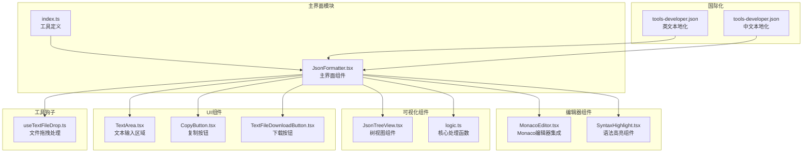
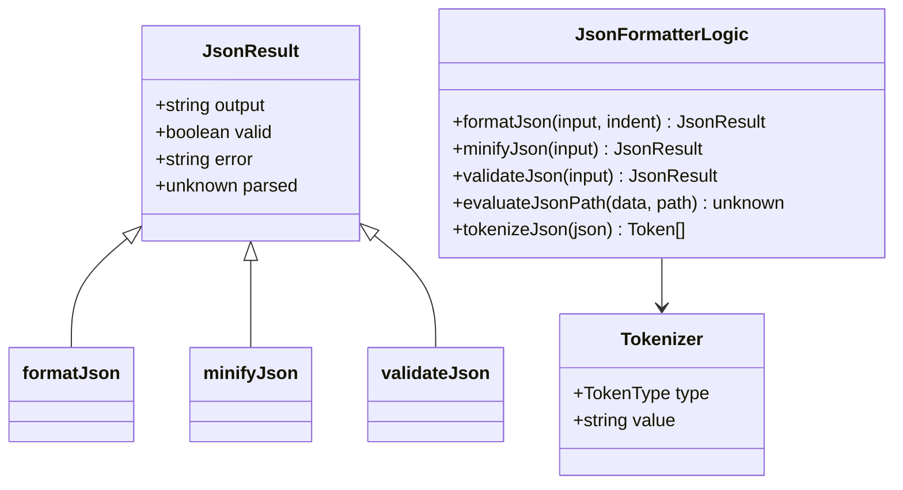
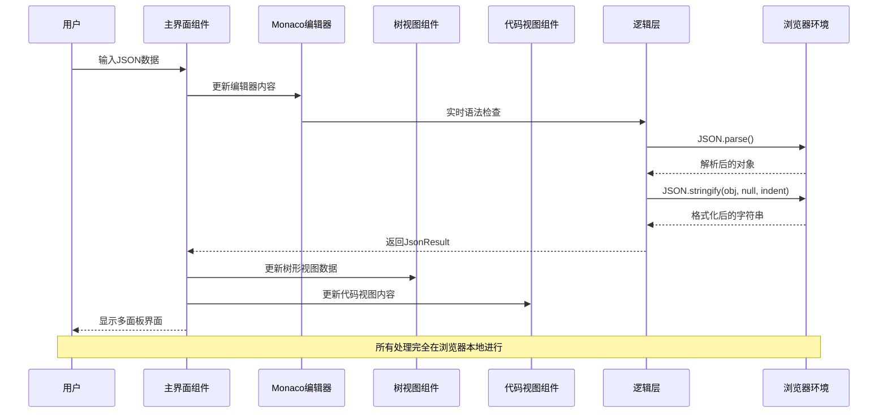
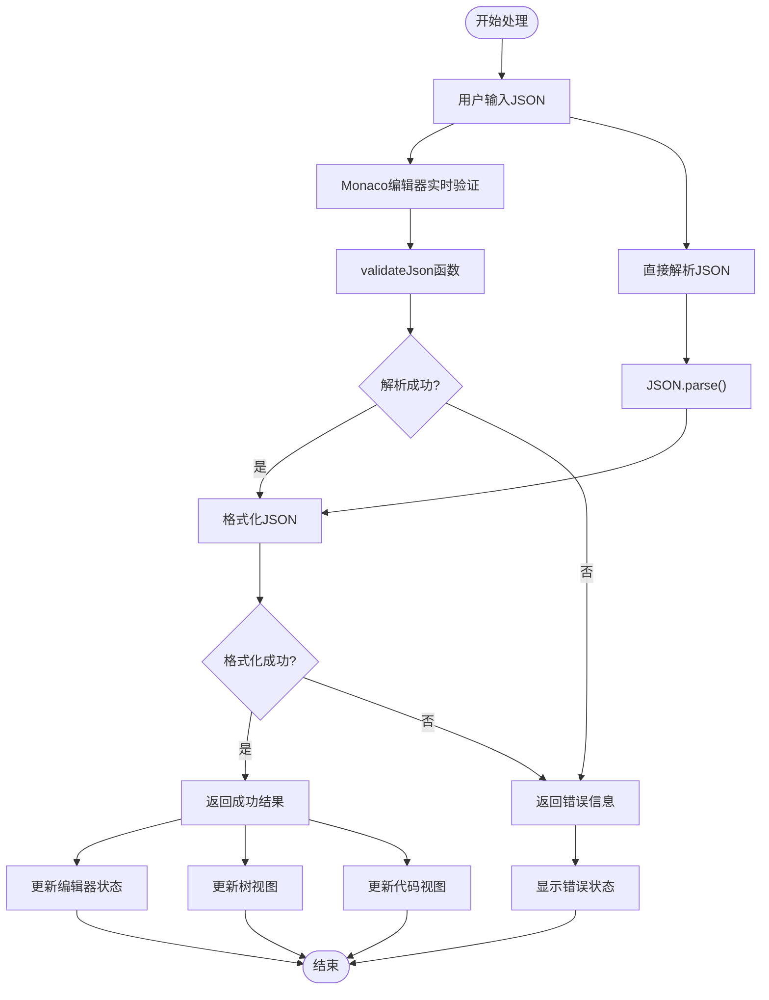
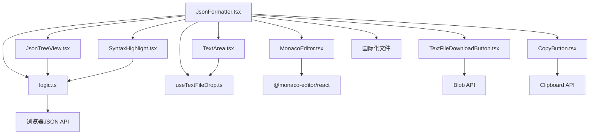

# JSON格式化工具

<cite>
**本文档引用的文件**
- [JsonFormatter.tsx](file://src/tools/developer/json-formatter/JsonFormatter.tsx)
- [MonacoEditor.tsx](file://src/tools/developer/json-formatter/MonacoEditor.tsx)
- [JsonTreeView.tsx](file://src/tools/developer/json-formatter/JsonTreeView.tsx)
- [SyntaxHighlight.tsx](file://src/tools/developer/json-formatter/SyntaxHighlight.tsx)
- [logic.ts](file://src/tools/developer/json-formatter/logic.ts)
- [index.ts](file://src/tools/developer/json-formatter/index.ts)
- [TextArea.tsx](file://src/components/shared/TextArea.tsx)
- [CopyButton.tsx](file://src/components/shared/CopyButton.tsx)
- [TextFileDownloadButton.tsx](file://src/components/shared/TextFileDownloadButton.tsx)
- [useTextFileDrop.ts](file://src/hooks/useTextFileDrop.ts)
- [tools-developer.json](file://messages/en/tools-developer.json)
- [tools-developer.json](file://messages/zh-Hans/tools-developer.json)
</cite>

## 更新摘要
**所做更改**
- 完全重写项目结构章节，反映从简单textarea到复杂多面板系统的重大升级
- 新增Monaco编辑器集成章节，详细介绍现代化代码编辑器功能
- 新增树视图组件章节，说明JSON数据的可视化展示功能
- 新增语法高亮组件章节，描述代码着色和美化功能
- 新增JSON Path过滤功能章节，介绍高级数据筛选能力
- 新增拖拽分割面板章节，说明用户界面的交互改进
- 更新架构概览图为新的多组件系统
- 新增实时验证功能章节，描述自动语法检查机制
- 更新性能考虑章节，反映新架构的性能特点

## 目录
1. [简介](#简介)
2. [项目结构](#项目结构)
3. [核心组件](#核心组件)
4. [架构概览](#架构概览)
5. [详细组件分析](#详细组件分析)
6. [依赖关系分析](#依赖关系分析)
7. [性能考虑](#性能考虑)
8. [故障排除指南](#故障排除指南)
9. [结论](#结论)
10. [附录](#附录)

## 简介

JSON格式化工具现已升级为一个功能强大的现代化浏览器端JSON数据处理平台，专为开发者和系统管理员设计。该工具提供了完整的JSON格式化、验证、压缩和可视化功能，集成了Monaco编辑器、树视图、代码视图等多种专业工具，支持实时语法高亮显示，能够在用户的本地环境中安全地处理JSON数据。

### 主要特性

- **现代化编辑器**：集成Monaco编辑器，提供专业的代码编辑体验
- **多面板视图**：支持树视图、代码视图的双面板布局，便于数据探索
- **实时验证**：自动语法检查，即时显示JSON有效性状态
- **JSON Path过滤**：支持复杂的路径表达式，精确筛选数据
- **拖拽分割**：灵活的面板分割和调整功能
- **语法高亮**：专业的JSON语法着色和美化显示
- **树形可视化**：直观的JSON数据结构树形展示
- **安全处理**：所有数据处理完全在浏览器本地进行，无需上传到服务器
- **多语言支持**：支持100+种语言的用户界面
- **响应式设计**：适配桌面和移动设备的完美界面

## 项目结构

JSON格式化工具已升级为复杂的多组件架构，主要由以下核心模块构成：

**图表来源**
- [JsonFormatter.tsx:1-334](file://src/tools/developer/json-formatter/JsonFormatter.tsx#L1-L334)
- [MonacoEditor.tsx:1-62](file://src/tools/developer/json-formatter/MonacoEditor.tsx#L1-L62)
- [JsonTreeView.tsx:1-179](file://src/tools/developer/json-formatter/JsonTreeView.tsx#L1-L179)
- [SyntaxHighlight.tsx](file://src/tools/developer/json-formatter/SyntaxHighlight.tsx)
- [logic.ts:1-170](file://src/tools/developer/json-formatter/logic.ts#L1-L170)

**章节来源**
- [JsonFormatter.tsx:1-334](file://src/tools/developer/json-formatter/JsonFormatter.tsx#L1-L334)
- [MonacoEditor.tsx:1-62](file://src/tools/developer/json-formatter/MonacoEditor.tsx#L1-L62)
- [JsonTreeView.tsx:1-179](file://src/tools/developer/json-formatter/JsonTreeView.tsx#L1-L179)
- [SyntaxHighlight.tsx](file://src/tools/developer/json-formatter/SyntaxHighlight.tsx)
- [logic.ts:1-170](file://src/tools/developer/json-formatter/logic.ts#L1-L170)
- [index.ts:1-37](file://src/tools/developer/json-formatter/index.ts#L1-L37)

## 核心组件

### 主界面组件 (JsonFormatter)

主界面组件现已成为一个复杂的多面板管理系统，负责协调各个子组件的工作：

- **状态管理**：维护输入文本、输出结果、解析数据、格式化选项等完整状态
- **用户交互**：提供格式化、压缩、验证、清空等操作按钮
- **配置选项**：允许用户自定义缩进空格数（2、4、8空格）和树形展开级别
- **面板控制**：管理左右面板的分割比例和显示状态
- **实时验证**：集成自动语法检查和错误状态显示
- **JSON Path过滤**：支持复杂的路径表达式筛选功能

### Monaco编辑器集成

现代化的代码编辑器提供了专业级的JSON编辑体验：

- **语法高亮**：实时JSON语法着色，支持关键字、字符串、数字等类型识别
- **智能提示**：基于Monaco编辑器的智能代码补全功能
- **主题适配**：自动适配深色/浅色主题模式
- **编辑功能**：支持代码折叠、括号匹配、行号显示等专业编辑功能
- **响应式设计**：自适应不同屏幕尺寸的编辑器高度

### 树视图组件 (JsonTreeView)

专门设计的JSON数据可视化组件：

- **递归渲染**：支持任意深度的JSON数据结构递归显示
- **交互式展开**：点击节点即可展开/折叠子节点
- **类型着色**：不同数据类型使用不同颜色标识
- **路径导航**：支持通过JSON Path表达式精确定位数据
- **性能优化**：虚拟滚动和懒加载机制，支持大型JSON文件

### 语法高亮组件

专业的JSON代码美化组件：

- **令牌化处理**：将JSON字符串分解为不同类型令牌
- **类型识别**：准确识别键、字符串、数字、布尔值、null等类型
- **样式定制**：支持深色/浅色主题的语法着色
- **渲染优化**：高效的DOM渲染和更新机制

### 核心逻辑 (logic.ts)

逻辑层扩展为包含多个专业功能的处理模块：

**图表来源**
- [logic.ts:1-170](file://src/tools/developer/json-formatter/logic.ts#L1-L170)

**章节来源**
- [JsonFormatter.tsx:17-334](file://src/tools/developer/json-formatter/JsonFormatter.tsx#L17-L334)
- [MonacoEditor.tsx:15-62](file://src/tools/developer/json-formatter/MonacoEditor.tsx#L15-L62)
- [JsonTreeView.tsx:13-179](file://src/tools/developer/json-formatter/JsonTreeView.tsx#L13-L179)
- [SyntaxHighlight.tsx](file://src/tools/developer/json-formatter/SyntaxHighlight.tsx)
- [logic.ts:8-170](file://src/tools/developer/json-formatter/logic.ts#L8-L170)

## 架构概览

JSON格式化工具已升级为复杂的多组件分层架构，确保了高度的模块化和可扩展性：

**图表来源**
- [JsonFormatter.tsx:37-119](file://src/tools/developer/json-formatter/JsonFormatter.tsx#L37-L119)
- [MonacoEditor.tsx:25-60](file://src/tools/developer/json-formatter/MonacoEditor.tsx#L25-L60)
- [JsonTreeView.tsx:18-35](file://src/tools/developer/json-formatter/JsonTreeView.tsx#L18-L35)

### 数据流分析

工具的现代化数据处理流程支持多路径并行处理：

**图表来源**
- [JsonFormatter.tsx:102-119](file://src/tools/developer/json-formatter/JsonFormatter.tsx#L102-L119)
- [logic.ts:26-33](file://src/tools/developer/json-formatter/logic.ts#L26-L33)
- [logic.ts:8-24](file://src/tools/developer/json-formatter/logic.ts#L8-L24)

## 详细组件分析

### 用户界面组件

#### 多面板布局系统

现代化的界面采用响应式多面板设计：

- **左侧编辑面板**：集成Monaco编辑器，支持实时语法检查
- **右侧可视化面板**：支持树视图和代码视图的双面板切换
- **拖拽分割器**：支持鼠标拖拽调整面板比例
- **移动端适配**：在小屏幕上自动切换为垂直堆叠布局

#### 实时验证功能

集成的实时语法检查系统：

- **自动验证**：用户输入时自动执行JSON语法检查
- **状态指示**：通过图标和颜色直观显示验证状态
- **错误详情**：在错误状态下显示详细的错误信息
- **无侵入设计**：验证过程不影响用户的正常编辑操作

#### JSON Path过滤系统

高级的数据筛选功能：

- **路径表达式**：支持`.address.city`、`.hobbies[0]`等复杂表达式
- **实时过滤**：输入路径时即时更新树视图显示
- **智能提示**：基于当前JSON结构提供路径建议
- **错误处理**：无效路径表达式时优雅降级

**章节来源**
- [JsonFormatter.tsx:180-334](file://src/tools/developer/json-formatter/JsonFormatter.tsx#L180-L334)
- [JsonFormatter.tsx:101-119](file://src/tools/developer/json-formatter/JsonFormatter.tsx#L101-L119)
- [JsonFormatter.tsx:269-286](file://src/tools/developer/json-formatter/JsonFormatter.tsx#L269-L286)

### Monaco编辑器集成

#### 专业编辑功能

Monaco编辑器提供了完整的专业代码编辑体验：

- **语法高亮**：实时JSON语法着色，支持多种数据类型识别
- **智能提示**：基于Monaco编辑器的智能代码补全功能
- **主题适配**：自动适配系统深色/浅色主题
- **编辑优化**：支持代码折叠、括号匹配、行号显示等专业功能
- **响应式布局**：根据容器大小自动调整编辑器高度

#### 配置选项

编辑器的详细配置参数：

- **只读模式**：支持输出内容的只读显示
- **最小化预览**：禁用右侧缩略图功能
- **行号显示**：启用行号和行高亮功能
- **自动布局**：启用响应式自动布局
- **字体设置**：使用等宽字体和合适的字号
- **滚动条优化**：自定义滚动条样式和尺寸

**章节来源**
- [MonacoEditor.tsx:15-62](file://src/tools/developer/json-formatter/MonacoEditor.tsx#L15-L62)
- [JsonFormatter.tsx:240-247](file://src/tools/developer/json-formatter/JsonFormatter.tsx#L240-L247)

### 树视图组件

#### 递归数据展示

树视图组件提供了直观的JSON数据结构展示：

- **递归渲染**：支持任意深度的嵌套数据结构
- **交互式控制**：点击节点展开/折叠子节点
- **类型可视化**：不同数据类型使用不同颜色标识
- **性能优化**：使用虚拟滚动处理大型数据集
- **懒加载机制**：仅在需要时渲染子节点

#### 视觉设计

组件的详细视觉设计：

- **缩进系统**：使用16像素的固定缩进增量
- **分支符号**：使用箭头符号表示节点关系
- **括号显示**：展开时显示完整的括号结构
- **计数信息**：显示每个容器的元素数量
- **悬停效果**：提供平滑的悬停交互反馈

**章节来源**
- [JsonTreeView.tsx:13-179](file://src/tools/developer/json-formatter/JsonTreeView.tsx#L13-L179)

### 语法高亮组件

#### 令牌化处理

专业的JSON语法分析系统：

- **类型识别**：准确识别键、字符串、数字、布尔值、null等类型
- **正则匹配**：使用精确的正则表达式进行令牌分割
- **转义处理**：正确处理字符串中的转义字符
- **上下文判断**：通过上下文判断键名和字符串值
- **性能优化**：高效的线性扫描算法

#### 渲染系统

组件的渲染和样式系统：

- **类型映射**：将令牌类型映射到CSS类名
- **颜色方案**：使用专业的JSON语法颜色方案
- **字体设置**：使用等宽字体确保对齐效果
- **间距控制**：精确控制文本间距和行高
- **主题适配**：支持深色和浅色主题自动切换

**章节来源**
- [logic.ts:84-169](file://src/tools/developer/json-formatter/logic.ts#L84-L169)

### 文件处理功能

#### 文件拖拽处理

增强的文件处理功能：

- **多格式支持**：支持.json、.txt等文本文件格式
- **拖拽反馈**：提供视觉反馈显示拖拽状态
- **异步读取**：使用Promise处理文件读取操作
- **错误处理**：静默处理读取失败的情况
- **占位符文本**：根据用户语言显示相应的提示信息

#### 下载功能

完善的文件导出功能：

- **Blob API**：使用现代浏览器API创建文件内容
- **自动下载**：生成临时链接并触发自动下载
- **文件命名**：默认使用"formatted.json"作为文件名
- **MIME类型**：正确设置application/json MIME类型
- **内存管理**：及时释放临时URL对象的内存

**章节来源**
- [JsonFormatter.tsx:190-250](file://src/tools/developer/json-formatter/JsonFormatter.tsx#L190-L250)
- [JsonFormatter.tsx:129-137](file://src/tools/developer/json-formatter/JsonFormatter.tsx#L129-L137)

### 国际化支持

工具继续支持100+种语言，包括但不限于：

- **英文**：完整的英文界面和帮助文档
- **中文**：简体中文界面，适合中国用户
- **其他语言**：支持欧洲、亚洲、拉美等地区的多种语言

每种语言都提供了完整的本地化支持，包括：

- **界面文本**：按钮、标签、提示信息的本地化
- **帮助文档**：FAQ、使用说明、隐私政策的翻译
- **错误消息**：语法错误和其他异常情况的本地化描述
- **SEO内容**：针对不同市场的搜索引擎优化内容

**章节来源**
- [tools-developer.json:4-51](file://messages/en/tools-developer.json#L4-L51)
- [tools-developer.json:4-51](file://messages/zh-Hans/tools-developer.json#L4-L51)

## 依赖关系分析

### 组件间依赖

现代化的组件依赖关系：

**图表来源**
- [JsonFormatter.tsx:1-334](file://src/tools/developer/json-formatter/JsonFormatter.tsx#L1-L334)
- [MonacoEditor.tsx:3](file://src/tools/developer/json-formatter/MonacoEditor.tsx#L3)
- [JsonTreeView.tsx:5](file://src/tools/developer/json-formatter/JsonTreeView.tsx#L5)

### 外部依赖

工具的现代化外部依赖：

- **Monaco编辑器**：专业级代码编辑器，提供完整的IDE功能
- **React生态系统**：使用React Hooks和组件系统
- **浏览器原生API**：JSON.parse、JSON.stringify、Blob、Clipboard等
- **Lucide React图标库**：提供现代化的图标界面
- **Next.js国际化框架**：支持多语言切换
- **Tailwind CSS**：现代化的CSS框架，支持响应式设计

**章节来源**
- [JsonFormatter.tsx:1-15](file://src/tools/developer/json-formatter/JsonFormatter.tsx#L1-L15)
- [MonacoEditor.tsx:3](file://src/tools/developer/json-formatter/MonacoEditor.tsx#L3)
- [JsonTreeView.tsx:4](file://src/tools/developer/json-formatter/JsonTreeView.tsx#L4)

## 性能考虑

### 内存使用优化

现代化架构的内存使用优化策略：

- **组件懒加载**：使用React.lazy和Suspense实现组件按需加载
- **虚拟滚动**：树视图组件使用虚拟滚动处理大型数据集
- **状态优化**：使用useMemo和useCallback优化组件重渲染
- **垃圾回收**：及时释放Monaco编辑器实例和临时URL对象
- **缓存机制**：对常用的格式化结果和语法分析结果进行缓存

### 处理速度优化

多层面的性能优化措施：

- **实时防抖**：对频繁的输入事件进行防抖处理
- **增量更新**：仅更新受影响的组件部分
- **Web Workers**：对于超大数据集，考虑使用Web Workers进行后台处理
- **渲染优化**：使用React.memo优化子组件渲染
- **资源预加载**：预加载Monaco编辑器资源以提升首次使用体验

### 大文件处理能力

现代化的大文件处理能力：

- **流式处理**：对于超大文件，工具采用流式处理策略
- **分块渲染**：树视图组件支持分块渲染大型JSON结构
- **内存限制**：受设备可用内存和浏览器能力限制
- **性能表现**：经过优化的算法可在合理时间内处理大型文件
- **加载时间**：超大文件可能需要更多时间进行格式化和渲染

**章节来源**
- [JsonFormatter.tsx:32-35](file://src/tools/developer/json-formatter/JsonFormatter.tsx#L32-L35)
- [JsonTreeView.tsx:18-25](file://src/tools/developer/json-formatter/JsonTreeView.tsx#L18-L25)
- [MonacoEditor.tsx:37-58](file://src/tools/developer/json-formatter/MonacoEditor.tsx#L37-L58)

## 故障排除指南

### 常见问题及解决方案

#### JSON语法错误

现代化的错误处理系统：

- **实时反馈**：编辑器提供即时的语法错误反馈
- **错误定位**：明确指出语法错误发生的位置和类型
- **错误类型**：区分不同的JSON语法错误类型
- **修复建议**：提供可能的修复方向和示例
- **状态显示**：通过颜色和图标直观显示错误状态

#### 大文件处理问题

针对大型文件的优化解决方案：

- **内存不足**：监控内存使用情况，提供优化建议
- **页面卡顿**：使用虚拟滚动和懒加载减少渲染压力
- **超时错误**：对于超大文件，考虑分批处理或使用专用工具
- **性能监控**：提供性能指标和处理进度显示

#### 组件加载问题

现代化组件的加载问题：

- **Monaco编辑器加载失败**：检查网络连接和CDN访问
- **主题切换异常**：确保主题提供器正确配置
- **响应式布局问题**：检查CSS类名和媒体查询设置
- **触摸设备兼容性**：测试触摸事件和手势识别功能

**章节来源**
- [JsonFormatter.tsx:174-178](file://src/tools/developer/json-formatter/JsonFormatter.tsx#L174-L178)
- [MonacoEditor.tsx:32-36](file://src/tools/developer/json-formatter/MonacoEditor.tsx#L32-L36)
- [JsonTreeView.tsx:18-25](file://src/tools/developer/json-formatter/JsonTreeView.tsx#L18-L25)

## 结论

JSON格式化工具已成功升级为一个功能强大、界面现代化的专业级JSON数据处理平台。其主要优势包括：

### 技术优势

- **现代化架构**：采用React Hooks和组件化设计，支持复杂的多面板系统
- **专业编辑体验**：集成Monaco编辑器，提供完整的IDE级编辑功能
- **实时验证**：自动语法检查和即时错误反馈机制
- **可视化展示**：树视图和代码视图的双重数据展示方式
- **高性能优化**：虚拟滚动、懒加载和增量更新等性能优化技术
- **响应式设计**：适配各种设备尺寸的完美界面体验

### 实用价值

- **开发调试**：帮助开发者快速检查和格式化API响应数据
- **配置管理**：简化JSON配置文件的查看和编辑
- **数据验证**：快速验证JSON数据的语法正确性和结构完整性
- **学习工具**：帮助用户理解JSON数据结构和格式化规则
- **数据分析**：通过树视图直观探索复杂的数据结构

### 发展前景

随着Web技术的不断发展，该工具将继续改进和完善，为用户提供更好的JSON数据处理体验。未来的改进方向可能包括：

- 更强大的JSON Path表达式支持
- 更丰富的数据可视化选项
- 更好的大文件处理性能
- 更智能的代码补全和重构功能
- 更好的与其他开发工具的集成

## 附录

### 使用示例

#### 基本格式化操作

1. 在左侧编辑器中粘贴或输入JSON数据
2. 选择合适的缩进空格数（2、4或8）
3. 查看右侧树视图的结构展示
4. 如需查看原始代码，切换到代码视图标签
5. 使用JSON Path过滤器精确定位数据

#### 高级功能使用

- **实时验证**：编辑器会自动检查语法正确性
- **拖拽分割**：拖动中间的分割器调整面板比例
- **树形导航**：点击树节点展开/折叠子节点
- **路径筛选**：在右侧工具栏输入JSON Path表达式
- **批量处理**：支持多个JSON文件的批量格式化

### 最佳实践

- **数据备份**：在进行重要数据处理前做好备份
- **版本控制**：对重要的JSON配置文件进行版本管理
- **性能监控**：关注大文件处理时的性能表现
- **响应式测试**：在不同设备上测试界面适配效果
- **错误预防**：利用实时验证功能预防语法错误

### 技术规格

- **支持的浏览器**：Chrome 90+、Firefox 88+、Safari 14+、Edge 90+
- **文件大小限制**：受设备内存和浏览器能力限制
- **处理速度**：通常在几秒内完成中小型文件的格式化
- **内存使用**：根据文件大小动态调整内存使用量
- **响应式断点**：在768px以下自动切换为垂直布局
- **主题支持**：完全支持深色和浅色主题自动切换