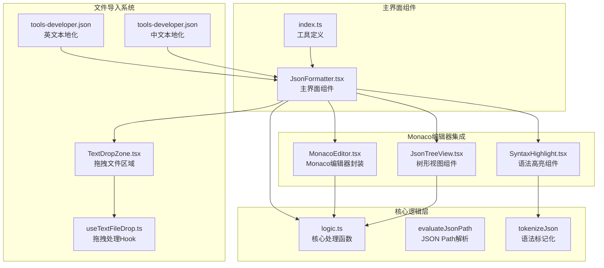
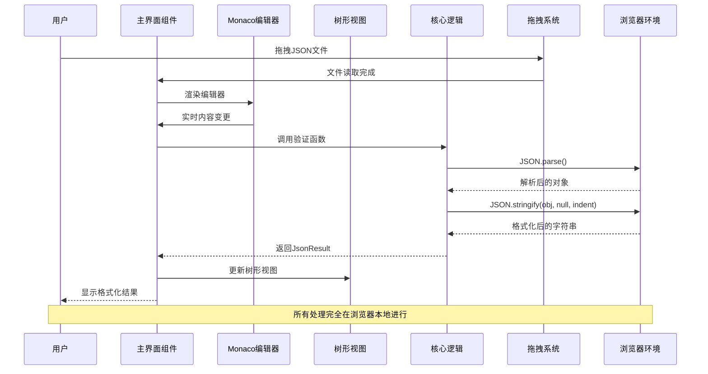
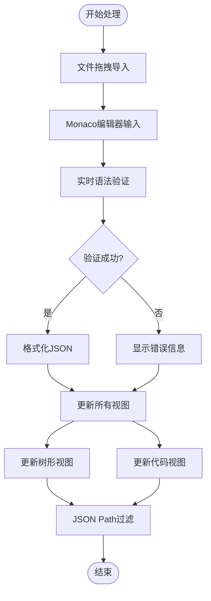
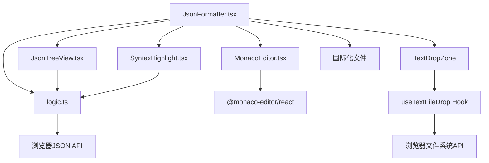

# JSON格式化工具

<cite>
**本文档引用的文件**
- [JsonFormatter.tsx](file://src/tools/developer/json-formatter/JsonFormatter.tsx)
- [MonacoEditor.tsx](file://src/tools/developer/json-formatter/MonacoEditor.tsx)
- [JsonTreeView.tsx](file://src/tools/developer/json-formatter/JsonTreeView.tsx)
- [SyntaxHighlight.tsx](file://src/tools/developer/json-formatter/SyntaxHighlight.tsx)
- [logic.ts](file://src/tools/developer/json-formatter/logic.ts)
- [index.ts](file://src/tools/developer/json-formatter/index.ts)
- [TextDropZone.tsx](file://src/components/shared/TextDropZone.tsx)
- [useTextFileDrop.ts](file://src/hooks/useTextFileDrop.ts)
- [tools-developer.json](file://messages/en/tools-developer.json)
- [tools-developer.json](file://messages/zh-Hans/tools-developer.json)
</cite>

## 更新摘要
**变更内容**
- 从基础textarea升级到Monaco编辑器，提供专业级代码编辑体验
- 新增拖拽文件导入功能，支持JSON和TXT文件直接拖拽
- 实现实时语法高亮和代码折叠功能
- 集成交互式树形视图导航系统
- 实现JSON Path过滤查询功能
- 添加可拖拽分割面板布局
- 优化用户体验和功能完整性

## 目录
1. [简介](#简介)
2. [项目结构](#项目结构)
3. [核心组件](#核心组件)
4. [架构概览](#架构概览)
5. [详细组件分析](#详细组件分析)
6. [依赖关系分析](#依赖关系分析)
7. [性能考虑](#性能考虑)
8. [故障排除指南](#故障排除指南)
9. [结论](#结论)
10. [附录](#附录)

## 简介

JSON格式化工具现已升级为专业级JSON编辑环境，基于Monaco编辑器构建，提供完整的JSON数据处理解决方案。该工具集成了实时语法高亮、代码折叠、交互式树形视图和JSON Path过滤等高级功能，专为开发者和系统管理员设计。

### 主要特性

- **专业编辑器**：基于Monaco编辑器（VS Code核心引擎），提供完整的代码编辑体验
- **拖拽文件导入**：支持JSON和TXT文件的直接拖拽导入
- **实时语法高亮**：支持JSON语法的实时颜色标记和代码折叠
- **交互式树形视图**：可视化浏览JSON结构，支持展开/折叠和键盘导航
- **JSON Path过滤**：使用路径表达式精确查询嵌套数据
- **拖拽分割面板**：可自定义编辑器和查看器的比例分配
- **实时验证**：输入时即时语法检查，无需点击按钮
- **安全处理**：所有数据处理完全在浏览器本地进行
- **多语言支持**：支持100+种语言的用户界面
- **响应式设计**：适配桌面和移动设备的布局

## 项目结构

JSON格式化工具采用模块化架构设计，现已升级为基于Monaco编辑器的专业级实现：

**图表来源**
- [JsonFormatter.tsx:1-334](file://src/tools/developer/json-formatter/JsonFormatter.tsx#L1-L334)
- [MonacoEditor.tsx:1-62](file://src/tools/developer/json-formatter/MonacoEditor.tsx#L1-L62)
- [JsonTreeView.tsx:1-179](file://src/tools/developer/json-formatter/JsonTreeView.tsx#L1-L179)
- [SyntaxHighlight.tsx:1-68](file://src/tools/developer/json-formatter/SyntaxHighlight.tsx#L1-L68)
- [logic.ts:1-170](file://src/tools/developer/json-formatter/logic.ts#L1-L170)
- [TextDropZone.tsx:1-45](file://src/components/shared/TextDropZone.tsx#L1-L45)
- [useTextFileDrop.ts:1-75](file://src/hooks/useTextFileDrop.ts#L1-L75)

**章节来源**
- [JsonFormatter.tsx:1-334](file://src/tools/developer/json-formatter/JsonFormatter.tsx#L1-L334)
- [MonacoEditor.tsx:1-62](file://src/tools/developer/json-formatter/MonacoEditor.tsx#L1-L62)
- [JsonTreeView.tsx:1-179](file://src/tools/developer/json-formatter/JsonTreeView.tsx#L1-L179)
- [SyntaxHighlight.tsx:1-68](file://src/tools/developer/json-formatter/SyntaxHighlight.tsx#L1-L68)
- [logic.ts:1-170](file://src/tools/developer/json-formatter/logic.ts#L1-L170)
- [TextDropZone.tsx:1-45](file://src/components/shared/TextDropZone.tsx#L1-L45)
- [useTextFileDrop.ts:1-75](file://src/hooks/useTextFileDrop.ts#L1-L75)

## 核心组件

### 主界面组件 (JsonFormatter)

主界面组件现已升级为基于Monaco编辑器的专业级实现，负责管理整个工具的状态和用户交互：

- **Monaco编辑器集成**：提供专业级代码编辑体验，支持语法高亮和代码折叠
- **拖拽文件导入**：集成TextDropZone组件，支持JSON和TXT文件的直接拖拽
- **分割面板布局**：左右布局的可拖拽分割面板，支持编辑器和查看器的灵活分配
- **实时状态管理**：维护输入文本、输出结果、格式化选项等状态
- **多视图切换**：支持树形视图和代码视图的无缝切换
- **JSON Path过滤**：提供路径表达式的实时查询功能
- **响应式设计**：移动端自动切换为堆叠布局

### Monaco编辑器组件 (MonacoEditor)

专门封装的Monaco编辑器组件，提供以下增强功能：

- **主题适配**：自动适配明暗主题切换
- **编辑器配置**：启用代码折叠、括号匹配、自动换行等功能
- **性能优化**：支持自动布局和滚动优化
- **加载状态**：提供友好的加载提示界面

### 树形视图组件 (JsonTreeView)

全新的交互式树形视图组件：

- **可视化导航**：直观显示JSON结构层次
- **动态展开**：支持节点的展开/折叠操作
- **项数统计**：每层显示元素数量统计
- **键盘导航**：支持完整的键盘操作体验
- **JSON Path集成**：与过滤功能无缝结合

### 语法高亮组件 (SyntaxHighlight)

独立的语法高亮显示组件：

- **Token化处理**：将格式化后的JSON分解为语法标记
- **颜色编码**：为不同类型的JSON元素提供颜色标识
- **行号显示**：配合表格布局显示行号
- **性能优化**：使用记忆化避免重复计算

### 拖拽文件导入系统

**新增功能** - 专业级文件导入系统：

- **TextDropZone组件**：提供拖拽区域的视觉反馈和操作提示
- **useTextFileDrop Hook**：处理拖拽事件、文件类型验证和内容读取
- **文件类型支持**：默认支持.json、.txt、.csv、.xml等多种文本文件
- **大小限制**：默认10MB文件大小限制，可配置
- **实时反馈**：拖拽时的视觉提示和错误状态显示

**章节来源**
- [JsonFormatter.tsx:17-334](file://src/tools/developer/json-formatter/JsonFormatter.tsx#L17-L334)
- [MonacoEditor.tsx:15-61](file://src/tools/developer/json-formatter/MonacoEditor.tsx#L15-L61)
- [JsonTreeView.tsx:13-179](file://src/tools/developer/json-formatter/JsonTreeView.tsx#L13-L179)
- [SyntaxHighlight.tsx:19-67](file://src/tools/developer/json-formatter/SyntaxHighlight.tsx#L19-L67)
- [TextDropZone.tsx:18-44](file://src/components/shared/TextDropZone.tsx#L18-L44)
- [useTextFileDrop.ts:12-75](file://src/hooks/useTextFileDrop.ts#L12-L75)

## 架构概览

JSON格式化工具采用升级后的分层架构设计，集成了Monaco编辑器的专业级功能：

**图表来源**
- [JsonFormatter.tsx:101-119](file://src/tools/developer/json-formatter/JsonFormatter.tsx#L101-L119)
- [logic.ts:26-33](file://src/tools/developer/json-formatter/logic.ts#L26-L33)
- [TextDropZone.tsx:22-44](file://src/components/shared/TextDropZone.tsx#L22-L44)

### 数据流分析

工具的数据处理流程现已集成实时验证、拖拽导入和多视图显示：

**图表来源**
- [JsonFormatter.tsx:101-119](file://src/tools/developer/json-formatter/JsonFormatter.tsx#L101-L119)
- [JsonTreeView.tsx:18-25](file://src/tools/developer/json-formatter/JsonTreeView.tsx#L18-L25)
- [logic.ts:39-70](file://src/tools/developer/json-formatter/logic.ts#L39-L70)

## 详细组件分析

### Monaco编辑器集成

#### 编辑器配置优化

Monaco编辑器经过专门优化，提供最佳的JSON编辑体验：

- **主题适配**：自动根据系统主题切换vs或vs-dark主题
- **代码折叠**：启用括号匹配和代码折叠功能
- **自动换行**：支持长行的自动换行显示
- **行号显示**：启用行号和行高亮功能
- **滚动优化**：优化垂直和水平滚动条显示

#### 实时编辑体验

编辑器提供完整的实时编辑功能：

- **即时响应**：用户输入时立即触发验证和格式化
- **语法高亮**：实时显示语法颜色标记
- **错误提示**：在编辑器中显示语法错误位置
- **自动布局**：窗口大小变化时自动重新布局

**章节来源**
- [MonacoEditor.tsx:15-61](file://src/tools/developer/json-formatter/MonacoEditor.tsx#L15-L61)
- [JsonFormatter.tsx:241-247](file://src/tools/developer/json-formatter/JsonFormatter.tsx#L241-L247)

### 拖拽文件导入系统

#### 文件拖拽处理

**新增功能** - 专业级文件导入系统：

- **TextDropZone组件**：提供拖拽区域的视觉反馈和操作提示
- **useTextFileDrop Hook**：处理拖拽事件、文件类型验证和内容读取
- **文件类型支持**：默认支持.json、.txt、.csv、.xml等多种文本文件
- **大小限制**：默认10MB文件大小限制，可配置
- **实时反馈**：拖拽时的视觉提示和错误状态显示

#### 拖拽事件处理

系统采用稳定的事件处理机制：

- **拖拽状态管理**：实时跟踪拖拽状态并更新UI反馈
- **文件验证**：检查文件扩展名和大小限制
- **内容读取**：异步读取文件内容并传递给回调函数
- **错误处理**：静默处理读取错误，不影响用户体验

**章节来源**
- [TextDropZone.tsx:18-44](file://src/components/shared/TextDropZone.tsx#L18-L44)
- [useTextFileDrop.ts:12-75](file://src/hooks/useTextFileDrop.ts#L12-L75)
- [JsonFormatter.tsx:190-194](file://src/tools/developer/json-formatter/JsonFormatter.tsx#L190-L194)

### 交互式树形视图

#### 视觉导航系统

树形视图提供直观的JSON结构导航：

- **层次显示**：清晰显示JSON对象和数组的嵌套层次
- **展开/折叠**：支持节点的动态展开和折叠操作
- **项数统计**：每层显示元素数量，便于了解数据规模
- **键盘导航**：支持Tab键和方向键的完整键盘操作
- **颜色编码**：不同数据类型使用不同颜色标识

#### JSON Path集成

树形视图与JSON Path过滤功能深度集成：

- **实时过滤**：输入路径表达式时即时更新显示
- **路径验证**：提供路径表达式的语法验证
- **结果高亮**：在树形视图中标记匹配的结果
- **导航支持**：支持从过滤结果快速导航到父级节点

**章节来源**
- [JsonTreeView.tsx:13-179](file://src/tools/developer/json-formatter/JsonTreeView.tsx#L13-L179)
- [JsonFormatter.tsx:269-327](file://src/tools/developer/json-formatter/JsonFormatter.tsx#L269-L327)

### 语法高亮显示

#### Token化处理系统

独立的语法高亮组件提供精确的颜色标记：

- **类型识别**：准确识别JSON中的键、字符串、数字、布尔值和null
- **颜色编码**：为不同类型的元素分配相应的颜色
- **行号系统**：配合表格布局显示行号，便于复制粘贴
- **性能优化**：使用记忆化避免重复的token化处理

#### 颜色方案设计

精心设计的颜色方案提升可读性：

- **键名颜色**：深红色（浅色主题）和蓝色（深色主题）标识键名
- **字符串颜色**：绿色标识字符串值
- **数字颜色**：青绿色标识数值
- **布尔值颜色**：蓝色标识true/false
- **null值颜色**：灰色标识null值

**章节来源**
- [SyntaxHighlight.tsx:19-67](file://src/tools/developer/json-formatter/SyntaxHighlight.tsx#L19-L67)
- [logic.ts:84-169](file://src/tools/developer/json-formatter/logic.ts#L84-L169)

### JSON Path过滤功能

#### 路径表达式支持

全面支持JSON Path表达式的查询功能：

- **点号语法**：支持$.address.city等点号路径
- **数组索引**：支持$.items[0]等数组访问
- **嵌套路径**：支持$.data.users[2].name等复杂嵌套
- **实时过滤**：输入路径时即时更新显示结果
- **错误处理**：提供路径表达式的语法错误提示

#### 过滤算法实现

高效的JSON Path解析和过滤算法：

- **路径标准化**：自动处理$、$.前缀和点号的差异
- **段落解析**：将路径表达式分解为可执行的段落
- **类型检查**：在访问过程中进行类型和边界检查
- **结果聚合**：将匹配的结果聚合为可显示的结构

**章节来源**
- [JsonFormatter.tsx:270-277](file://src/tools/developer/json-formatter/JsonFormatter.tsx#L270-L277)
- [JsonTreeView.tsx:18-25](file://src/tools/developer/json-formatter/JsonTreeView.tsx#L18-L25)
- [logic.ts:39-70](file://src/tools/developer/json-formatter/logic.ts#L39-L70)

### 分割面板布局

#### 可拖拽设计

创新的分割面板设计提供灵活的界面布局：

- **拖拽控制**：支持鼠标和触摸的拖拽操作
- **比例调整**：实时调整编辑器和查看器的显示比例
- **双击重置**：双击分割线重置为50/50比例
- **响应式适配**：移动端自动切换为堆叠布局
- **性能优化**：拖拽过程中的性能优化和防抖处理

#### 布局管理

智能的布局管理系统：

- **状态持久化**：记住用户的布局偏好设置
- **最小尺寸限制**：防止面板被拖拽到不可用的尺寸
- **动画过渡**：平滑的布局变化动画效果
- **无障碍支持**：支持键盘快捷键调整布局

**章节来源**
- [JsonFormatter.tsx:139-166](file://src/tools/developer/json-formatter/JsonFormatter.tsx#L139-L166)
- [JsonFormatter.tsx:253-263](file://src/tools/developer/json-formatter/JsonFormatter.tsx#L253-L263)

## 依赖关系分析

### 组件间依赖升级

**图表来源**
- [JsonFormatter.tsx:1-31](file://src/tools/developer/json-formatter/JsonFormatter.tsx#L1-L31)
- [MonacoEditor.tsx:3](file://src/tools/developer/json-formatter/MonacoEditor.tsx#L3)
- [JsonTreeView.tsx:5](file://src/tools/developer/json-formatter/JsonTreeView.tsx#L5)
- [SyntaxHighlight.tsx:4](file://src/tools/developer/json-formatter/SyntaxHighlight.tsx#L4)
- [TextDropZone.tsx:6](file://src/components/shared/TextDropZone.tsx#L6)
- [useTextFileDrop.ts:3](file://src/hooks/useTextFileDrop.ts#L3)

### 外部依赖升级

工具的外部依赖现已大幅扩展：

- **Monaco编辑器**：@monaco-editor/react提供专业级编辑体验
- **React生态系统**：继续使用React Hooks和组件系统
- **浏览器原生API**：JSON.parse、JSON.stringify、Blob、Clipboard等
- **Lucide React图标库**：提供现代化的图标界面
- **Next.js国际化框架**：支持多语言切换
- **主题系统**：集成明暗主题自动切换
- **文件系统API**：浏览器文件拖拽和读取功能

**章节来源**
- [JsonFormatter.tsx:1-13](file://src/tools/developer/json-formatter/JsonFormatter.tsx#L1-L13)
- [MonacoEditor.tsx:3](file://src/tools/developer/json-formatter/MonacoEditor.tsx#L3)
- [useTextFileDrop.ts:3](file://src/hooks/useTextFileDrop.ts#L3)

## 性能考虑

### Monaco编辑器性能优化

Monaco编辑器的性能优化措施：

- **懒加载机制**：编辑器组件按需加载，减少初始包大小
- **虚拟滚动**：大文件时使用虚拟滚动优化渲染性能
- **增量更新**：只更新发生变化的部分，避免全量重绘
- **内存管理**：合理管理编辑器实例和事件监听器
- **主题切换优化**：主题切换时的性能优化和缓存机制

### 拖拽文件导入性能

**新增功能** - 拖拽文件导入的性能优化：

- **文件大小限制**：默认10MB限制，防止超大文件影响性能
- **异步读取**：文件内容异步读取，避免阻塞UI线程
- **事件防抖**：拖拽事件处理的防抖优化
- **内存管理**：及时释放文件读取的临时内存
- **错误恢复**：文件读取失败时的优雅降级

### 实时处理性能

实时验证和更新的性能优化：

- **防抖处理**：输入防抖避免频繁的验证操作
- **增量渲染**：只更新发生变化的视图部分
- **记忆化优化**：使用useMemo避免重复的token化处理
- **异步处理**：大文件处理时使用异步操作避免阻塞UI
- **垃圾回收**：及时清理不再使用的数据结构

### 内存使用优化

升级后的内存使用优化策略：

- **流式处理**：对于超大文件，工具采用流式处理策略
- **渐进式渲染**：界面采用渐进式渲染，确保用户体验流畅
- **组件卸载**：合理管理组件的挂载和卸载，防止内存泄漏
- **缓存策略**：智能缓存常用的数据和计算结果

**章节来源**
- [MonacoEditor.tsx:37-58](file://src/tools/developer/json-formatter/MonacoEditor.tsx#L37-L58)
- [SyntaxHighlight.tsx:20-41](file://src/tools/developer/json-formatter/SyntaxHighlight.tsx#L20-L41)
- [JsonFormatter.tsx:101-119](file://src/tools/developer/json-formatter/JsonFormatter.tsx#L101-L119)
- [useTextFileDrop.ts:5-10](file://src/hooks/useTextFileDrop.ts#L5-L10)

## 故障排除指南

### Monaco编辑器相关问题

#### 编辑器加载问题

Monaco编辑器可能遇到的问题：
- **加载缓慢**：首次加载可能需要几秒钟时间
- **主题不匹配**：明暗主题切换时的延迟
- **内存占用高**：大型JSON文件时的内存使用较高
- **滚动卡顿**：超大文件时的滚动性能问题

**解决方案**：
- 确保网络连接稳定，允许加载Monaco资源
- 等待编辑器完全初始化后再进行操作
- 对于超大文件，考虑使用压缩功能减少内存占用
- 使用浏览器开发者工具监控内存使用情况

#### 编辑器功能问题

编辑器功能异常的排查：
- **语法高亮失效**：检查浏览器JavaScript执行状态
- **代码折叠不工作**：确认JSON格式正确且支持折叠
- **自动补全异常**：禁用可能冲突的浏览器扩展程序
- **键盘快捷键失效**：检查浏览器快捷键设置

**章节来源**
- [MonacoEditor.tsx:25-36](file://src/tools/developer/json-formatter/MonacoEditor.tsx#L25-L36)
- [JsonFormatter.tsx:241-247](file://src/tools/developer/json-formatter/JsonFormatter.tsx#L241-L247)

### 拖拽文件导入问题

#### 文件拖拽问题

**新增功能** - 拖拽文件导入的故障排除：

- **拖拽无响应**：检查浏览器是否支持文件拖拽API
- **文件类型不识别**：确认文件扩展名在支持列表中
- **文件过大**：检查文件大小是否超过10MB限制
- **拖拽区域无效**：确认TextDropZone组件正确渲染
- **权限问题**：检查浏览器的安全设置和权限

**解决方案**：
- 确保使用支持HTML5拖拽的现代浏览器
- 检查文件扩展名是否在.accept列表中
- 减小文件大小或使用压缩功能
- 刷新页面重新初始化拖拽组件
- 检查浏览器的文件访问权限设置

#### 文件读取问题

文件读取失败的排查：
- **读取错误**：检查文件编码和格式
- **空文件**：确认文件包含有效的JSON内容
- **权限限制**：检查跨域访问和本地文件权限
- **内存不足**：超大文件可能导致内存溢出

**解决方案**：
- 确认文件编码为UTF-8或其他支持的编码
- 验证JSON格式的正确性
- 使用HTTP服务器而非本地文件协议
- 分割大文件或使用流式处理

**章节来源**
- [TextDropZone.tsx:22-44](file://src/components/shared/TextDropZone.tsx#L22-L44)
- [useTextFileDrop.ts:47-68](file://src/hooks/useTextFileDrop.ts#L47-L68)

### 树形视图相关问题

#### 导航问题

树形视图可能遇到的问题：
- **节点展开失败**：检查JSON数据的结构完整性
- **项数统计错误**：确认数据类型为对象或数组
- **键盘导航异常**：检查浏览器兼容性和焦点管理
- **滚动定位问题**：大文件时的滚动性能优化

**解决方案**：
- 验证JSON数据的语法正确性
- 简化复杂的嵌套结构进行测试
- 使用鼠标操作替代键盘导航
- 考虑使用JSON Path过滤功能

#### 过滤功能问题

JSON Path过滤功能的故障排除：
- **路径表达式错误**：检查路径语法的正确性
- **过滤结果为空**：确认目标数据的存在性
- **性能问题**：大JSON数据的过滤优化
- **实时更新延迟**：输入防抖机制的影响

**解决方案**：
- 使用简单的路径表达式进行测试
- 逐步构建复杂的路径表达式
- 考虑使用更精确的过滤条件
- 等待输入防抖完成后再查看结果

**章节来源**
- [JsonTreeView.tsx:53-149](file://src/tools/developer/json-formatter/JsonTreeView.tsx#L53-L149)
- [JsonFormatter.tsx:270-277](file://src/tools/developer/json-formatter/JsonFormatter.tsx#L270-L277)

### 性能优化建议

#### 大文件处理

对于超大JSON文件的性能优化：
- **分块处理**：将大文件分割为多个小文件处理
- **压缩预处理**：先使用压缩功能减少文件大小
- **内存监控**：使用浏览器开发者工具监控内存使用
- **渐进加载**：考虑分页加载和延迟渲染策略

#### 浏览器兼容性

不同浏览器的兼容性问题：
- **旧版浏览器**：某些功能可能在IE等旧版浏览器中受限
- **移动设备**：触摸操作的兼容性和性能优化
- **内存限制**：不同设备的内存限制和性能差异
- **网络环境**：CDN加载的网络延迟影响

**解决方案**：
- 使用现代浏览器获得最佳体验
- 在移动设备上使用触摸友好的操作方式
- 监控内存使用情况，避免超过设备限制
- 提前加载必要的资源以减少等待时间

**章节来源**
- [JsonFormatter.tsx:139-166](file://src/tools/developer/json-formatter/JsonFormatter.tsx#L139-L166)
- [MonacoEditor.tsx:37-58](file://src/tools/developer/json-formatter/MonacoEditor.tsx#L37-L58)

## 结论

JSON格式化工具已完成从基础textarea到专业级Monaco编辑器的重大升级，提供了全面的功能增强和用户体验改进。

### 技术成就

- **专业级编辑体验**：基于Monaco编辑器提供VS Code级别的编辑功能
- **拖拽文件导入**：支持JSON和TXT文件的直接拖拽导入
- **实时处理能力**：完整的实时验证、格式化和视图更新系统
- **可视化导航**：创新的树形视图和JSON Path过滤功能
- **响应式设计**：适配多种设备和屏幕尺寸的布局系统
- **性能优化**：针对大文件和复杂数据结构的性能优化策略

### 用户体验提升

- **直观界面**：清晰的分割面板布局和多视图切换
- **高效操作**：键盘快捷键和鼠标操作的完美结合
- **实时反馈**：输入时即时的语法验证和结果更新
- **无障碍支持**：完整的键盘导航和屏幕阅读器支持
- **个性化设置**：可调整的编辑器配置和视图偏好
- **文件导入便利**：拖拽操作简化了文件处理流程

### 开发价值

- **专业工具**：满足专业开发者和系统管理员的需求
- **学习辅助**：帮助用户理解JSON数据结构和格式化规则
- **调试利器**：简化API调试和数据验证工作流程
- **教育用途**：作为JSON学习和教学的优秀工具
- **生产环境**：适合在各种生产环境中的数据处理需求

### 未来发展

随着技术的不断进步，该工具将继续演进和完善，可能的发展方向包括：
- 更智能的JSON Path自动补全功能
- 更强大的数据验证和模式匹配能力
- 更丰富的导出和集成选项
- 更好的团队协作和版本管理功能
- 更完善的错误诊断和修复建议系统

## 附录

### 使用示例

#### 专业级JSON编辑操作

1. **启动编辑器**：在左侧Monaco编辑器中输入或粘贴JSON数据
2. **拖拽导入**：直接将.json或.txt文件拖拽到编辑器区域
3. **实时验证**：编辑器实时显示语法验证状态
4. **格式化处理**：点击格式化按钮获得美观的输出
5. **树形导航**：切换到树形视图浏览数据结构
6. **路径查询**：在JSON Path框中输入表达式查询特定数据
7. **多视图对比**：同时使用树形视图和代码视图对比数据

#### 高级功能使用

- **拖拽布局**：拖动分割线自定义编辑器和查看器比例
- **键盘导航**：使用Tab键在工具栏和视图间快速切换
- **主题切换**：自动适配系统明暗主题设置
- **性能监控**：使用浏览器开发者工具监控处理性能
- **文件管理**：利用拖拽功能快速处理多个JSON文件

### 最佳实践

- **数据备份**：在进行重要数据处理前做好备份
- **版本控制**：对重要的JSON配置文件进行版本管理
- **性能监控**：关注大文件处理时的性能表现
- **内存管理**：合理使用压缩功能减少内存占用
- **用户体验**：充分利用实时验证和多视图功能提升效率
- **文件规范**：遵循标准的JSON格式规范，提高兼容性

### 技术规格

- **支持的浏览器**：Chrome 90+、Firefox 88+、Safari 14+、Edge 90+
- **文件大小限制**：默认10MB，可通过配置调整
- **文件类型支持**：.json、.txt、.csv、.xml、.yaml、.yml等
- **处理速度**：通常在几秒内完成中小型文件的格式化
- **内存使用**：根据文件大小动态调整内存使用量
- **离线支持**：页面加载后可完全离线运行

### 升级迁移指南

从基础版本升级到专业版本的注意事项：
- **功能差异**：新版本提供更多高级功能和更好的用户体验
- **性能提升**：Monaco编辑器提供更流畅的编辑体验
- **学习成本**：新功能需要一定的学习和适应时间
- **兼容性**：新版本在现代浏览器中提供最佳体验
- **迁移便利**：基本的格式化和验证功能保持一致的使用方式
- **文件导入**：新增的拖拽功能简化了文件处理流程