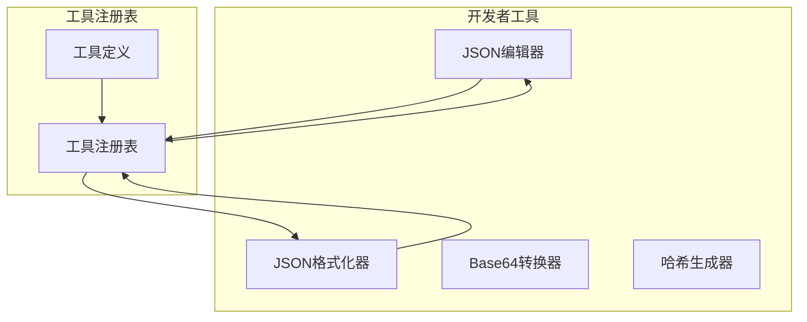
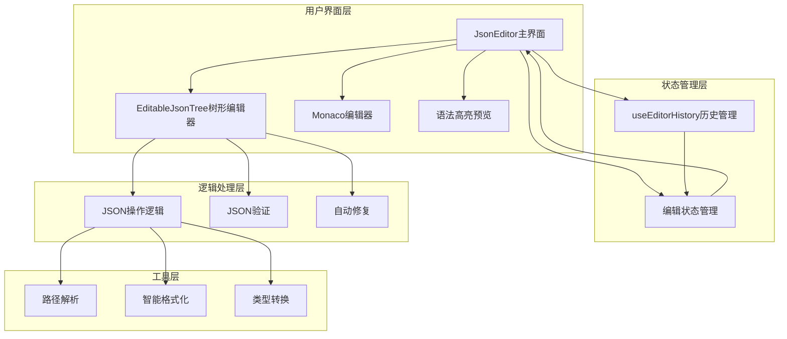
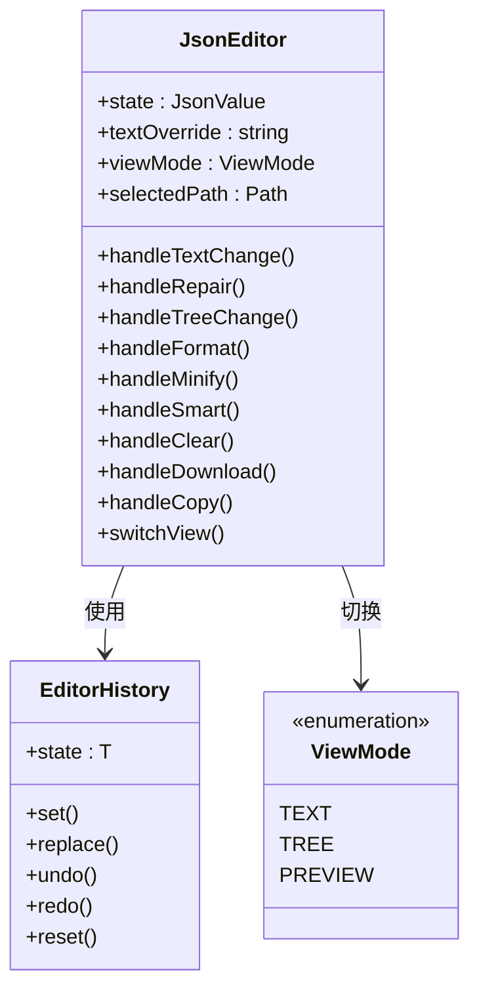
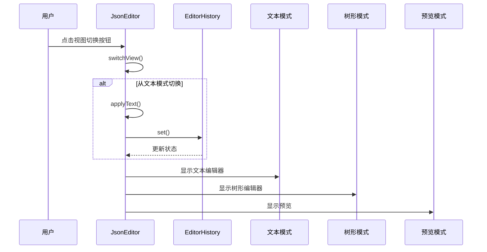
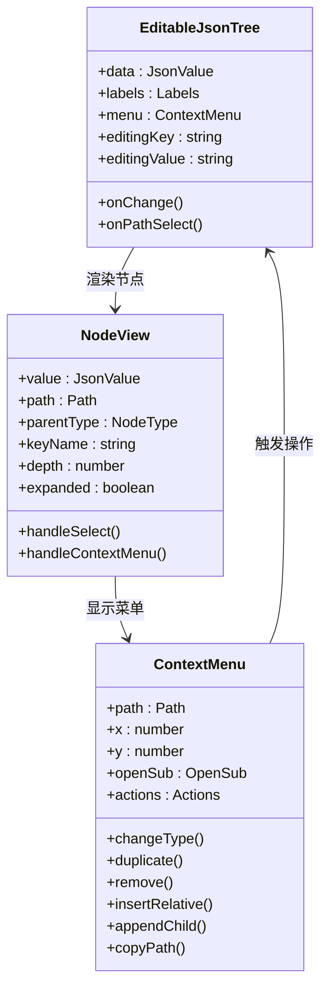
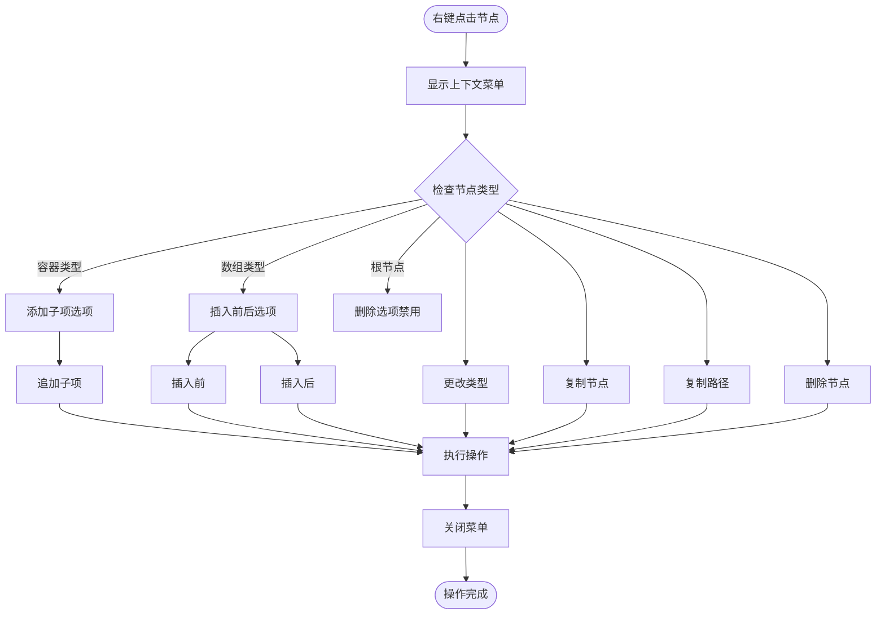
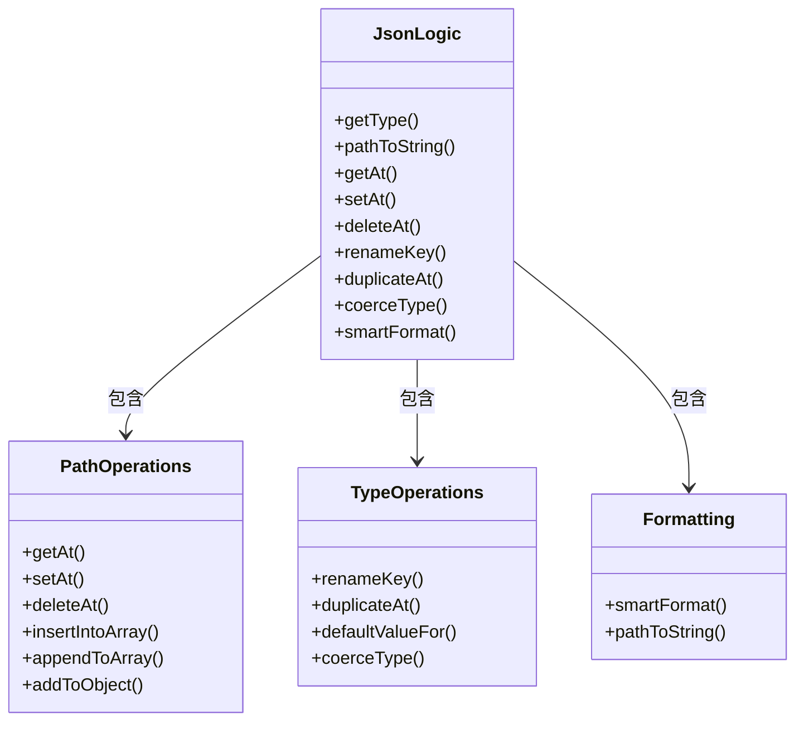
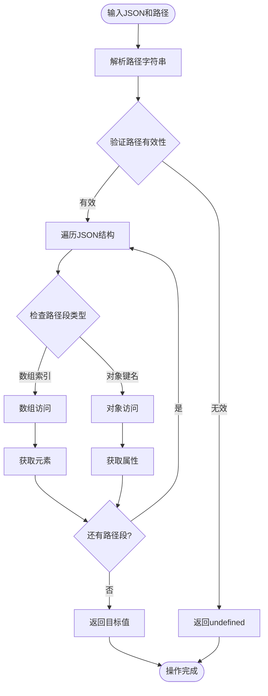
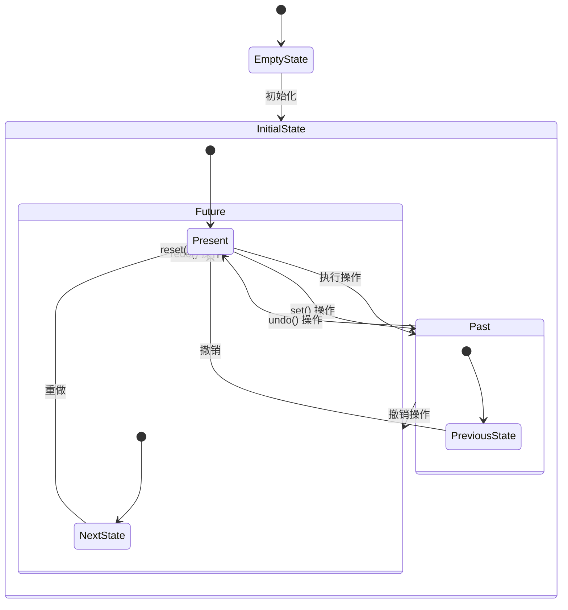

# JSON编辑器

<cite>
**本文档引用的文件**
- [README.md](file://README.md)
- [package.json](file://package.json)
- [JsonEditor.tsx](file://src/tools/developer/json-editor/JsonEditor.tsx)
- [EditableJsonTree.tsx](file://src/tools/developer/json-editor/EditableJsonTree.tsx)
- [logic.ts](file://src/tools/developer/json-editor/logic.ts)
- [useEditorHistory.ts](file://src/tools/developer/json-editor/useEditorHistory.ts)
- [index.ts](file://src/tools/developer/json-editor/index.ts)
- [tools-developer.json](file://messages/en/tools-developer.json)
- [index.ts](file://src/lib/registry/index.ts)
</cite>

## 更新摘要
**变更内容**
- 新增自动修复功能的详细说明和实现分析
- 完善撤销/重做系统的架构和使用指南
- 增强树形编辑器组件的功能特性和交互设计
- 补充智能格式化算法的技术细节
- 详细说明类型转换机制和应用场景
- 更新国际化支持和多语言功能

## 目录
1. [简介](#简介)
2. [项目结构](#项目结构)
3. [核心组件](#核心组件)
4. [架构概览](#架构概览)
5. [详细组件分析](#详细组件分析)
6. [依赖关系分析](#依赖关系分析)
7. [性能考虑](#性能考虑)
8. [故障排除指南](#故障排除指南)
9. [结论](#结论)

## 简介

JSON编辑器是PrivaDeck多媒体工具箱中的一个强大工具，允许用户在浏览器中可视化地编辑JSON数据。该工具提供了三种不同的视图模式：文本编辑模式、树形结构编辑模式和预览模式，支持实时验证、自动修复、撤销/重做功能，并且完全在本地运行，确保用户数据的隐私和安全。

**主要功能特性**
- **三视图模式切换**：文本编辑、树形结构、预览模式无缝切换
- **智能自动修复**：使用jsonrepair库修复常见JSON语法错误
- **完整的撤销/重做系统**：50步历史记录，支持键盘快捷键
- **树形可视化编辑**：直观的JSON结构编辑体验
- **智能格式化**：根据内容长度自动调整格式风格
- **类型转换**：支持字符串、数字、布尔值、空值、对象、数组间的转换
- **路径复制**：一键复制JSON路径，便于调试和引用

## 项目结构

JSON编辑器位于开发者工具类别下，与JSON格式化器紧密配合，共同提供完整的JSON处理解决方案：



**图表来源**
- [index.ts:116-135](file://src/lib/registry/index.ts#L116-L135)
- [index.ts:3-18](file://src/tools/developer/json-editor/index.ts#L3-L18)

**章节来源**
- [README.md:16-25](file://README.md#L16-L25)
- [package.json:11-35](file://package.json#L11-L35)

## 核心组件

JSON编辑器由以下核心组件构成：

### 主要组件
- **JsonEditor**: 主界面组件，管理状态和视图切换
- **EditableJsonTree**: 可编辑的树形结构组件
- **useEditorHistory**: 编辑历史管理钩子
- **逻辑层**: JSON操作和类型转换功能

### 关键特性
- 三视图模式切换（文本/树形/预览）
- 实时JSON验证和自动修复
- 撤销/重做历史记录
- 键盘快捷键支持
- 路径复制和选择功能

**章节来源**
- [JsonEditor.tsx:33-425](file://src/tools/developer/json-editor/JsonEditor.tsx#L33-L425)
- [EditableJsonTree.tsx:49-205](file://src/tools/developer/json-editor/EditableJsonTree.tsx#L49-L205)
- [useEditorHistory.ts:24-71](file://src/tools/developer/json-editor/useEditorHistory.ts#L24-L71)

## 架构概览

JSON编辑器采用模块化架构设计，每个组件都有明确的职责分工：



**图表来源**
- [JsonEditor.tsx:33-396](file://src/tools/developer/json-editor/JsonEditor.tsx#L33-L396)
- [EditableJsonTree.tsx:49-414](file://src/tools/developer/json-editor/EditableJsonTree.tsx#L49-L414)
- [logic.ts:7-216](file://src/tools/developer/json-editor/logic.ts#L7-L216)

## 详细组件分析

### JsonEditor 主组件

JsonEditor是整个编辑器的核心，负责协调各个子组件的工作：



**图表来源**
- [JsonEditor.tsx:33-425](file://src/tools/developer/json-editor/JsonEditor.tsx#L33-L425)
- [useEditorHistory.ts:7-71](file://src/tools/developer/json-editor/useEditorHistory.ts#L7-L71)

#### 视图切换机制



**图表来源**
- [JsonEditor.tsx:158-190](file://src/tools/developer/json-editor/JsonEditor.tsx#L158-L190)

**章节来源**
- [JsonEditor.tsx:33-396](file://src/tools/developer/json-editor/JsonEditor.tsx#L33-L396)

### EditableJsonTree 树形编辑器

树形编辑器提供了直观的JSON结构编辑体验：



**图表来源**
- [EditableJsonTree.tsx:49-414](file://src/tools/developer/json-editor/EditableJsonTree.tsx#L49-L414)
- [EditableJsonTree.tsx:524-745](file://src/tools/developer/json-editor/EditableJsonTree.tsx#L524-L745)

#### 上下文菜单功能



**图表来源**
- [EditableJsonTree.tsx:524-745](file://src/tools/developer/json-editor/EditableJsonTree.tsx#L524-L745)

**章节来源**
- [EditableJsonTree.tsx:49-771](file://src/tools/developer/json-editor/EditableJsonTree.tsx#L49-L771)

### 逻辑处理层

逻辑层提供了JSON操作的核心功能：



**图表来源**
- [logic.ts:7-216](file://src/tools/developer/json-editor/logic.ts#L7-L216)

#### JSON路径操作



**图表来源**
- [logic.ts:34-47](file://src/tools/developer/json-editor/logic.ts#L34-L47)

**章节来源**
- [logic.ts:1-216](file://src/tools/developer/json-editor/logic.ts#L1-L216)

### 历史管理

编辑历史管理提供了强大的撤销/重做功能：



**图表来源**
- [useEditorHistory.ts:18-71](file://src/tools/developer/json-editor/useEditorHistory.ts#L18-L71)

**章节来源**
- [useEditorHistory.ts:1-72](file://src/tools/developer/json-editor/useEditorHistory.ts#L1-L72)

## 依赖关系分析

JSON编辑器的依赖关系清晰明确，遵循单一职责原则：

```mermaid
graph TB
subgraph "外部依赖"
JSONREPAIR[jsonrepair]
MONACOEDITOR[@monaco-editor/react]
LUCIDEREACT[lucide-react]
NEXTINTL[next-intl]
end
subgraph "内部模块"
JSONEDITOR[JsonEditor]
EDITABLETREE[EditableJsonTree]
LOGIC[logic]
HISTORY[useEditorHistory]
COMPONENTS[UI组件]
end
subgraph "工具注册"
REGISTRY[index.ts]
DEFINITION[工具定义]
end
JSONEDITOR --> JSONREPAIR
JSONEDITOR --> MONACOEDITOR
JSONEDITOR --> LUCIDEREACT
JSONEDITOR --> NEXTINTL
JSONEDITOR --> EDITABLETREE
JSONEDITOR --> HISTORY
JSONEDITOR --> COMPONENTS
EDITABLETREE --> LOGIC
EDITABLETREE --> COMPONENTS
REGISTRY --> DEFINITION
REGISTRY --> JSONEDITOR
```

**图表来源**
- [package.json:11-35](file://package.json#L11-L35)
- [JsonEditor.tsx:1-26](file://src/tools/developer/json-editor/JsonEditor.tsx#L1-L26)
- [index.ts:1-66](file://src/lib/registry/index.ts#L1-L66)

**章节来源**
- [package.json:1-48](file://package.json#L1-L48)
- [index.ts:1-166](file://src/lib/registry/index.ts#L1-L166)

## 性能考虑

### 内存优化策略

1. **浅拷贝优化**: 使用浅拷贝避免深层克隆的性能开销
2. **虚拟滚动**: 对于大型JSON文档，考虑实现虚拟滚动
3. **延迟加载**: Monaco编辑器按需加载以减少初始内存占用

### 渲染优化

1. **状态分离**: 将编辑状态和UI状态分离，避免不必要的重渲染
2. **记忆化**: 使用useMemo和useCallback优化昂贵的计算
3. **条件渲染**: 根据视图模式动态渲染组件

### 数据处理优化

1. **增量更新**: 只更新受影响的节点而不是整个树
2. **批量操作**: 支持批量修改以减少状态更新次数
3. **智能格式化**: 智能格式化算法平衡可读性和性能

## 故障排除指南

### 常见问题及解决方案

#### JSON解析错误
- **症状**: 编辑器显示红色错误提示
- **原因**: JSON语法不正确或包含尾随逗号
- **解决**: 使用自动修复功能或手动修正语法错误

#### 视图切换问题
- **症状**: 无法从文本模式切换到树形模式
- **原因**: 文本包含无效JSON
- **解决**: 修复JSON语法或使用自动修复功能

#### 性能问题
- **症状**: 大型JSON文档响应缓慢
- **原因**: DOM节点过多导致渲染性能下降
- **解决**: 使用智能格式化功能或考虑分页加载

#### 浏览器兼容性
- **症状**: 某些浏览器功能异常
- **原因**: ES6+特性支持差异
- **解决**: 确保使用现代浏览器或添加polyfill

**章节来源**
- [JsonEditor.tsx:214-227](file://src/tools/developer/json-editor/JsonEditor.tsx#L214-L227)
- [JsonEditor.tsx:158-170](file://src/tools/developer/json-editor/JsonEditor.tsx#L158-L170)

## 结论

JSON编辑器是一个功能完整、性能优异的浏览器端JSON处理工具。它通过模块化的设计、清晰的架构和丰富的功能特性，为开发者提供了高效的JSON编辑体验。

### 主要优势

1. **完全本地化**: 所有处理都在浏览器中进行，确保数据隐私
2. **多视图支持**: 提供文本、树形和预览三种编辑模式
3. **智能功能**: 自动修复、智能格式化、实时验证等高级特性
4. **用户体验**: 直观的界面设计和流畅的操作体验
5. **扩展性**: 模块化的架构便于功能扩展和维护

### 技术亮点

- 采用React Hooks实现状态管理
- 使用Monaco Editor提供专业级代码编辑体验
- 实现了完整的JSON操作逻辑层
- 提供了完善的撤销/重做机制
- 支持键盘快捷键提高操作效率

JSON编辑器不仅满足了基本的JSON编辑需求，还通过创新的功能设计和优秀的用户体验，成为了开发者工具箱中的重要组成部分。