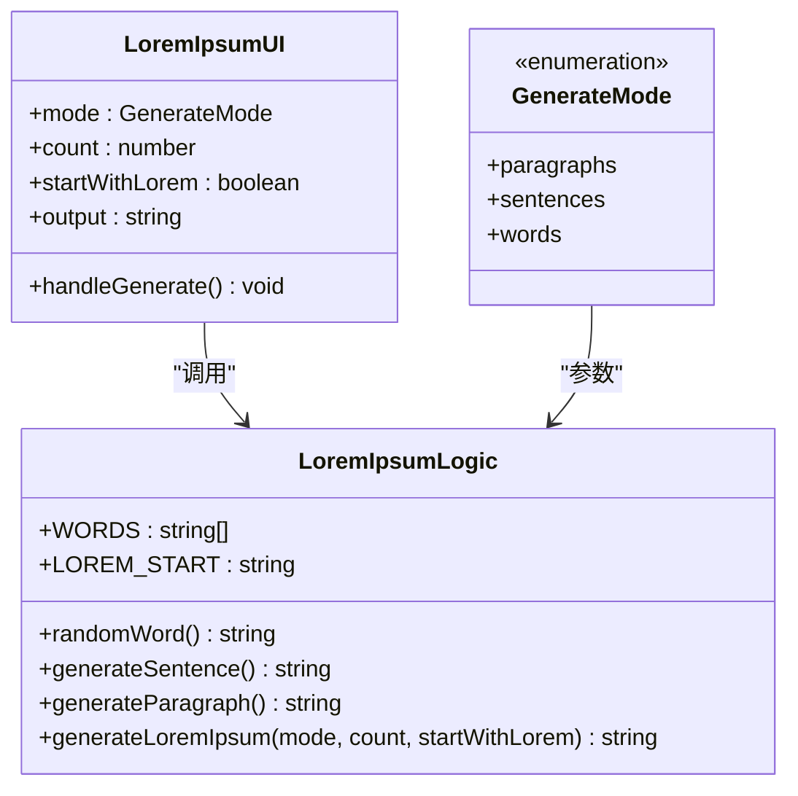
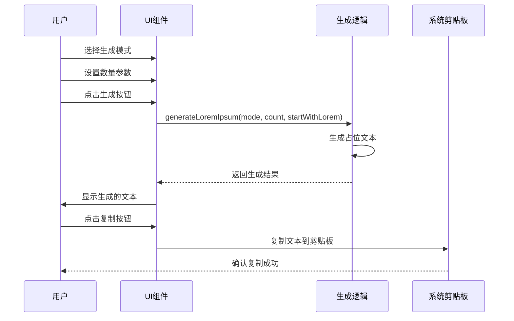
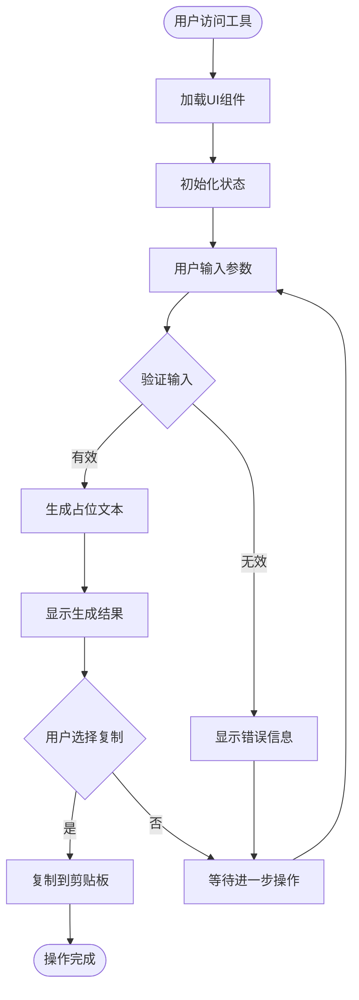
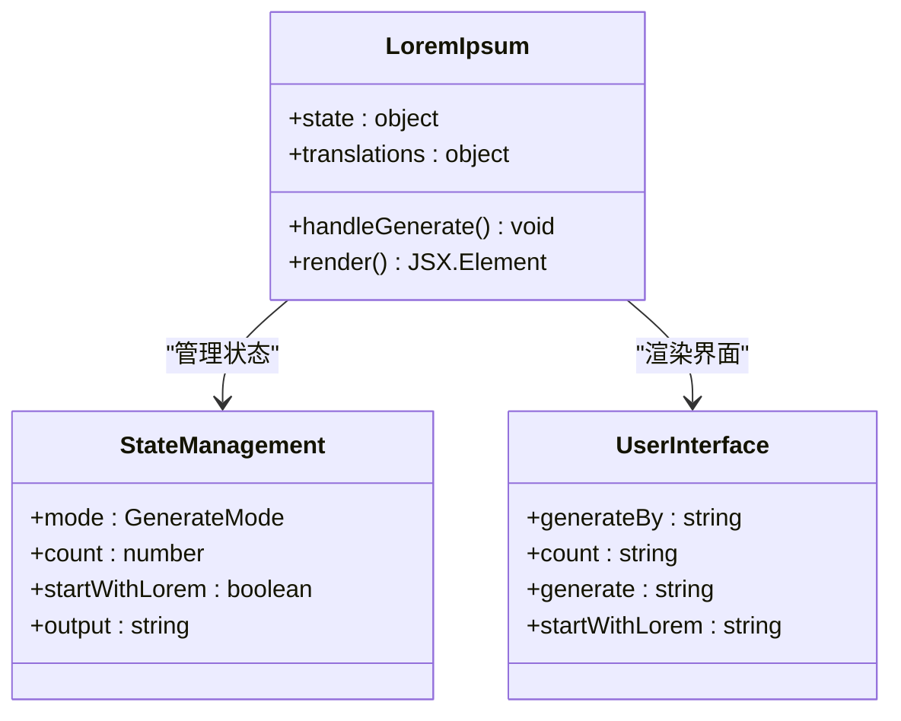
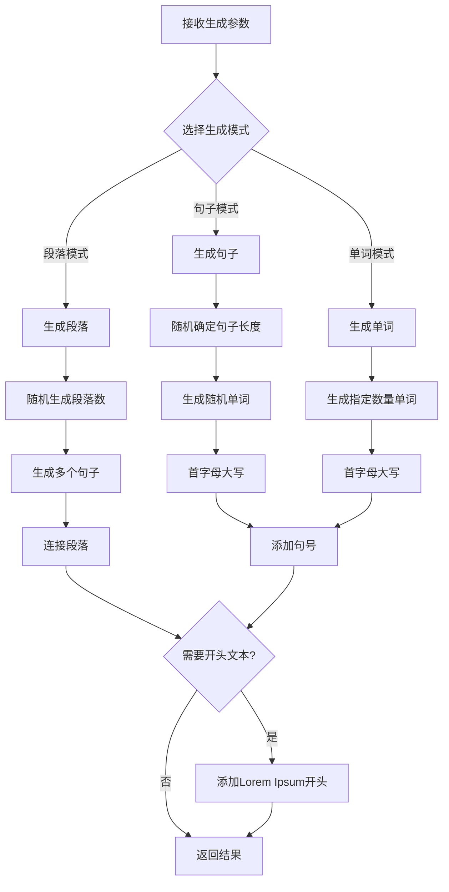
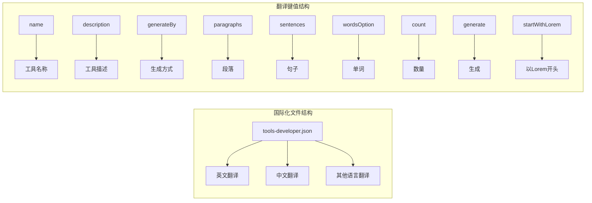
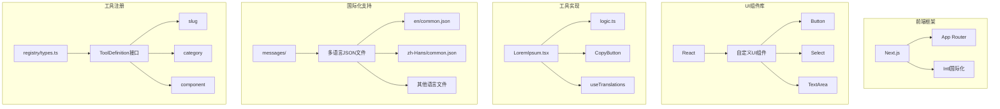

# Lorem Ipsum占位符工具

<cite>
**本文档引用的文件**
- [src/tools/developer/lorem-ipsum/LoremIpsum.tsx](file://src/tools/developer/lorem-ipsum/LoremIpsum.tsx)
- [src/tools/developer/lorem-ipsum/logic.ts](file://src/tools/developer/lorem-ipsum/logic.ts)
- [src/tools/developer/lorem-ipsum/index.ts](file://src/tools/developer/lorem-ipsum/index.ts)
- [src/app/[locale]/tools/[category]/[slug]/page.tsx](file://src/app/[locale]/tools/[category]/[slug]/page.tsx)
- [src/app/[locale]/tools/[category]/[slug]/ToolPageClient.tsx](file://src/app/[locale]/tools/[category]/[slug]/ToolPageClient.tsx)
- [src/lib/registry/types.ts](file://src/lib/registry/types.ts)
- [messages/en/tools-developer.json](file://messages/en/tools-developer.json)
- [messages/zh-Hans/tools-developer.json](file://messages/zh-Hans/tools-developer.json)
</cite>

## 目录
1. [简介](#简介)
2. [项目结构](#项目结构)
3. [核心组件](#核心组件)
4. [架构概览](#架构概览)
5. [详细组件分析](#详细组件分析)
6. [依赖关系分析](#依赖关系分析)
7. [性能考虑](#性能考虑)
8. [故障排除指南](#故障排除指南)
9. [结论](#结论)
10. [附录](#附录)

## 简介

Lorem Ipsum占位符工具是一个专为设计师、开发者和内容创作者设计的占位文本生成器。该工具基于经典的Lorem Ipsum拉丁文占位文本，为各种设计和开发场景提供灵活的占位内容生成解决方案。

### 历史背景与拉丁文来源

Lorem Ipsum起源于古罗马时期，最初是印刷业中用来填充版面空白的拉丁文片段。这种传统延续至今，成为设计和出版行业中的标准实践。该工具使用经典的Lorem Ipsum词汇池，确保生成的文本具有真实的排版效果和视觉吸引力。

### 在设计中的作用

Lorem Ipsum占位符在用户体验设计中发挥着重要作用：
- **布局测试**：验证页面结构和响应式设计
- **字体排版**：测试不同字体和字号的显示效果
- **原型制作**：为界面原型提供真实的文本内容
- **内容填充**：为设计稿和演示文稿提供占位文本

## 项目结构

Lorem Ipsum工具位于媒体工具箱项目的开发者工具类别中，采用模块化架构设计：

```mermaid
graph TB
subgraph "工具目录结构"
A[src/tools/developer/lorem-ipsum/] --> B[LoremIpsum.tsx]
A --> C[logic.ts]
A --> D[index.ts]
E[src/app/[locale]/tools/] --> F[工具页面路由]
F --> G[page.tsx]
F --> H[ToolPageClient.tsx]
I[src/lib/registry/] --> J[types.ts]
end
subgraph "国际化支持"
K[messages/en/] --> L[tools-developer.json]
M[messages/zh-Hans/] --> N[tools-developer.json]
end
B --> C
G --> H
H --> B
```

**图表来源**
- [src/tools/developer/lorem-ipsum/LoremIpsum.tsx:1-78](file://src/tools/developer/lorem-ipsum/LoremIpsum.tsx#L1-L78)
- [src/app/[locale]/tools/[category]/[slug]/page.tsx](file://src/app/[locale]/tools/[category]/[slug]/page.tsx#L1-L109)

**章节来源**
- [src/tools/developer/lorem-ipsum/LoremIpsum.tsx:1-78](file://src/tools/developer/lorem-ipsum/LoremIpsum.tsx#L1-L78)
- [src/tools/developer/lorem-ipsum/logic.ts:1-67](file://src/tools/developer/lorem-ipsum/logic.ts#L1-L67)
- [src/tools/developer/lorem-ipsum/index.ts:1-36](file://src/tools/developer/lorem-ipsum/index.ts#L1-L36)

## 核心组件

### 主要功能特性

Lorem Ipsum工具提供以下核心功能：

1. **多模式生成**：支持按段落、句子或单词数量生成占位文本
2. **灵活控制**：可调节生成数量和自定义选项
3. **经典格式**：遵循标准Lorem Ipsum文本格式
4. **即时生成**：点击即得的快速生成体验
5. **一键复制**：便捷的文本复制功能

### 数据结构设计

工具使用简洁高效的数据结构来管理生成逻辑：



**图表来源**
- [src/tools/developer/lorem-ipsum/logic.ts:37-66](file://src/tools/developer/lorem-ipsum/logic.ts#L37-L66)
- [src/tools/developer/lorem-ipsum/LoremIpsum.tsx:10-19](file://src/tools/developer/lorem-ipsum/LoremIpsum.tsx#L10-L19)

**章节来源**
- [src/tools/developer/lorem-ipsum/logic.ts:1-67](file://src/tools/developer/lorem-ipsum/logic.ts#L1-L67)
- [src/tools/developer/lorem-ipsum/LoremIpsum.tsx:1-78](file://src/tools/developer/lorem-ipsum/LoremIpsum.tsx#L1-L78)

## 架构概览

### 系统架构设计

Lorem Ipsum工具采用前后端分离的架构模式，结合了现代React开发的最佳实践：



**图表来源**
- [src/tools/developer/lorem-ipsum/LoremIpsum.tsx:17-19](file://src/tools/developer/lorem-ipsum/LoremIpsum.tsx#L17-L19)
- [src/tools/developer/lorem-ipsum/logic.ts:39-66](file://src/tools/developer/lorem-ipsum/logic.ts#L39-L66)

### 组件交互流程

工具的组件交互遵循清晰的单向数据流原则：



**图表来源**
- [src/tools/developer/lorem-ipsum/LoremIpsum.tsx:42-49](file://src/tools/developer/lorem-ipsum/LoremIpsum.tsx#L42-L49)
- [src/tools/developer/lorem-ipsum/logic.ts:39-66](file://src/tools/developer/lorem-ipsum/logic.ts#L39-L66)

**章节来源**
- [src/app/[locale]/tools/[category]/[slug]/page.tsx](file://src/app/[locale]/tools/[category]/[slug]/page.tsx#L33-L108)
- [src/app/[locale]/tools/[category]/[slug]/ToolPageClient.tsx](file://src/app/[locale]/tools/[category]/[slug]/ToolPageClient.tsx#L29-L58)

## 详细组件分析

### UI组件分析

#### LoremIpsum.tsx组件

UI组件采用现代化的React Hooks模式，实现了完整的用户交互功能：



**图表来源**
- [src/tools/developer/lorem-ipsum/LoremIpsum.tsx:10-77](file://src/tools/developer/lorem-ipsum/LoremIpsum.tsx#L10-L77)

组件的关键特性包括：

1. **状态管理**：使用useState Hook管理生成模式、数量和输出内容
2. **国际化支持**：通过useTranslations Hook实现多语言界面
3. **用户交互**：提供直观的表单控件和即时反馈
4. **响应式设计**：适配不同屏幕尺寸的设备

#### 生成逻辑分析

##### 文本生成算法

生成逻辑基于精心设计的算法，确保生成的文本具有自然的语言特征：



**图表来源**
- [src/tools/developer/lorem-ipsum/logic.ts:25-66](file://src/tools/developer/lorem-ipsum/logic.ts#L25-L66)

**章节来源**
- [src/tools/developer/lorem-ipsum/LoremIpsum.tsx:1-78](file://src/tools/developer/lorem-ipsum/LoremIpsum.tsx#L1-L78)
- [src/tools/developer/lorem-ipsum/logic.ts:1-67](file://src/tools/developer/lorem-ipsum/logic.ts#L1-L67)

### 工具定义与注册

#### 工具元数据配置

工具通过标准化的配置对象定义其属性和行为：

| 属性 | 类型 | 描述 | 示例值 |
|------|------|------|--------|
| slug | string | 工具唯一标识符 | "lorem-ipsum" |
| category | ToolCategory | 工具分类 | "developer" |
| icon | string | 工具图标名称 | "FileText" |
| component | Function | 动态导入组件的函数 | () => import("./LoremIpsum") |
| seo | Object | SEO配置 | { structuredDataType: "WebApplication" } |
| faq | Array | 常见问题列表 | 包含5个FAQ条目 |
| relatedSlugs | Array | 相关工具slug列表 | ["word-counter", "case-converter"] |

#### 国际化配置

工具支持多语言界面，通过JSON文件定义翻译键值：



**图表来源**
- [src/tools/developer/lorem-ipsum/index.ts:3-35](file://src/tools/developer/lorem-ipsum/index.ts#L3-L35)
- [messages/en/tools-developer.json:758-800](file://messages/en/tools-developer.json#L758-L800)
- [messages/zh-Hans/tools-developer.json:758-800](file://messages/zh-Hans/tools-developer.json#L758-L800)

**章节来源**
- [src/tools/developer/lorem-ipsum/index.ts:1-36](file://src/tools/developer/lorem-ipsum/index.ts#L1-L36)
- [messages/en/tools-developer.json:758-800](file://messages/en/tools-developer.json#L758-L800)
- [messages/zh-Hans/tools-developer.json:758-800](file://messages/zh-Hans/tools-developer.json#L758-L800)

## 依赖关系分析

### 技术栈依赖

Lorem Ipsum工具构建于现代Web技术栈之上，具有清晰的依赖关系：



**图表来源**
- [src/lib/registry/types.ts:5-16](file://src/lib/registry/types.ts#L5-L16)
- [src/app/[locale]/tools/[category]/[slug]/page.tsx](file://src/app/[locale]/tools/[category]/[slug]/page.tsx#L1-L109)

### 组件耦合度分析

工具采用松耦合的设计模式，各组件职责明确：

| 组件 | 耦合度 | 说明 | 改进建议 |
|------|--------|------|----------|
| UI组件 | 低 | 仅依赖生成逻辑函数 | 保持现有设计 |
| 生成逻辑 | 低 | 纯函数设计，无外部依赖 | 可考虑模块化 |
| 工具定义 | 低 | 静态配置，无运行时依赖 | 维持现状 |
| 国际化 | 中等 | 依赖翻译文件结构 | 可考虑动态加载 |

**章节来源**
- [src/lib/registry/types.ts:1-22](file://src/lib/registry/types.ts#L1-L22)
- [src/app/[locale]/tools/[category]/[slug]/ToolPageClient.tsx](file://src/app/[locale]/tools/[category]/[slug]/ToolPageClient.tsx#L29-L58)

## 性能考虑

### 生成性能优化

Lorem Ipsum工具在性能方面采用了多项优化策略：

1. **纯函数设计**：生成逻辑使用纯函数，避免副作用影响
2. **内存优化**：词汇表和固定文本使用常量定义，减少内存分配
3. **即时渲染**：UI组件使用React Hooks，实现高效的重新渲染
4. **懒加载**：工具组件采用动态导入，减少初始加载时间

### 内存使用分析

工具的内存使用模式具有以下特点：

- **词汇表缓存**：WORDS数组在模块范围内缓存，避免重复创建
- **状态管理**：使用useState Hook管理少量状态变量
- **组件卸载**：组件卸载时自动清理相关资源

### 加载性能

工具的加载性能表现优秀：

- **代码分割**：工具组件按需加载，减少主包体积
- **静态生成**：工具页面支持静态生成，提升首屏加载速度
- **缓存策略**：国际化消息文件支持浏览器缓存

## 故障排除指南

### 常见问题诊断

#### 生成异常问题

| 问题症状 | 可能原因 | 解决方案 |
|----------|----------|----------|
| 生成为空文本 | 参数验证失败 | 检查数量参数范围（1-100） |
| 文本格式异常 | 生成模式选择错误 | 确认选择正确的生成模式 |
| 复制功能失效 | 浏览器权限问题 | 检查剪贴板访问权限 |
| 页面加载缓慢 | 网络连接问题 | 刷新页面或检查网络状态 |

#### 用户界面问题

| 问题症状 | 可能原因 | 解决方案 |
|----------|----------|----------|
| 界面显示异常 | CSS样式冲突 | 刷新页面或清除浏览器缓存 |
| 语言显示错误 | 国际化配置问题 | 检查浏览器语言设置 |
| 表单控件无响应 | JavaScript错误 | 刷新页面或检查浏览器控制台 |

### 调试技巧

1. **浏览器开发者工具**：检查网络请求和JavaScript错误
2. **控制台日志**：查看组件生命周期和状态变化
3. **性能监控**：使用性能面板分析渲染性能
4. **网络面板**：检查国际化文件的加载情况

**章节来源**
- [src/tools/developer/lorem-ipsum/LoremIpsum.tsx:42-49](file://src/tools/developer/lorem-ipsum/LoremIpsum.tsx#L42-L49)

## 结论

Lorem Ipsum占位符工具是一个设计精良、功能完善的文本生成解决方案。它成功地将传统的Lorem Ipsum概念与现代Web技术相结合，为设计师和开发者提供了高效、可靠的占位文本生成工具。

### 主要优势

1. **简洁易用**：直观的用户界面和简单的操作流程
2. **功能完善**：支持多种生成模式和自定义选项
3. **性能优异**：高效的算法实现和优化的用户体验
4. **国际化支持**：全面的多语言界面支持
5. **技术先进**：基于现代React和Next.js技术栈

### 应用价值

该工具在以下场景中具有重要价值：

- **网站设计**：为网页布局测试和原型制作提供占位内容
- **字体排版**：验证不同字体和排版效果的显示质量
- **交互原型**：为用户界面原型提供真实的文本内容
- **内容创作**：为内容填充和草稿制作提供便利

## 附录

### 使用示例

#### 基础使用场景

1. **网站布局测试**
   - 选择"段落"模式，设置数量为3
   - 点击"生成"按钮获取占位文本
   - 将文本粘贴到网页设计中测试布局效果

2. **字体排版验证**
   - 选择"句子"模式，设置数量为10
   - 启用"以Lorem开头"选项
   - 复制文本到设计软件中验证字体显示

3. **原型制作**
   - 选择"单词"模式，设置数量为50
   - 禁用"以Lorem开头"选项
   - 生成的文本适合用于界面原型的内容填充

#### 高级应用场景

1. **多语言内容测试**
   - 切换到不同语言界面
   - 生成相应语言的占位文本
   - 测试多语言界面的布局和显示效果

2. **响应式设计验证**
   - 在不同屏幕尺寸下生成文本
   - 测试文本在移动端和桌面端的显示效果
   - 验证断点处的布局变化

### 最佳实践

1. **合理设置数量**：根据具体需求选择合适的文本长度
2. **选择合适模式**：根据使用场景选择最合适的生成模式
3. **利用自定义选项**：根据需要启用或禁用特定功能
4. **及时复制内容**：生成后立即复制文本到剪贴板
5. **定期更新工具**：关注工具的更新和改进

### 技术规格

| 规格参数 | 数值 | 说明 |
|----------|------|------|
| 支持语言 | 15+ | 英语、中文、德语、法语等 |
| 最大生成数量 | 100 | 单次生成的最大文本数量 |
| 生成模式 | 3种 | 段落、句子、单词 |
| 文件大小限制 | 无限制 | 生成的文本大小不受限制 |
| 浏览器兼容性 | 现代浏览器 | 支持Chrome、Firefox、Safari等 |