# Markdown预览工具

<cite>
**本文档引用的文件**
- [MarkdownPreview.tsx](file://src/tools/developer/markdown-preview/MarkdownPreview.tsx)
- [logic.ts](file://src/tools/developer/markdown-preview/logic.ts)
- [index.ts](file://src/tools/developer/markdown-preview/index.ts)
- [README.md](file://README.md)
- [package.json](file://package.json)
- [ToolPageShell.tsx](file://src/components/tool/ToolPageShell.tsx)
- [TextDropZone.tsx](file://src/components/shared/TextDropZone.tsx)
- [CopyButton.tsx](file://src/components/shared/CopyButton.tsx)
- [useTextFileDrop.ts](file://src/hooks/useTextFileDrop.ts)
- [types.ts](file://src/lib/registry/types.ts)
</cite>

## 目录
1. [简介](#简介)
2. [项目结构](#项目结构)
3. [核心组件](#核心组件)
4. [架构概览](#架构概览)
5. [详细组件分析](#详细组件分析)
6. [Markdown语法支持与渲染规则](#markdown语法支持与渲染规则)
7. [扩展功能支持](#扩展功能支持)
8. [使用示例](#使用示例)
9. [应用场景](#应用场景)
10. [样式定制与主题](#样式定制与主题)
11. [性能考虑](#性能考虑)
12. [故障排除指南](#故障排除指南)
13. [结论](#结论)

## 简介

Markdown预览工具是PrivaDeck多媒体工具箱中的一个核心组件，专门用于实时预览Markdown文档的渲染效果。该工具采用纯前端实现，确保所有文件处理都在本地浏览器中完成，实现了真正的隐私保护和零服务器依赖。

该工具提供了直观的双栏界面设计，左侧为Markdown编辑区域，右侧为实时预览区域，支持拖拽文件导入、一键复制HTML代码等功能。通过内置的安全过滤机制，有效防止XSS攻击和其他安全威胁。

## 项目结构

PrivaDeck采用模块化的Next.js应用程序架构，Markdown预览工具位于开发者工具分类下：

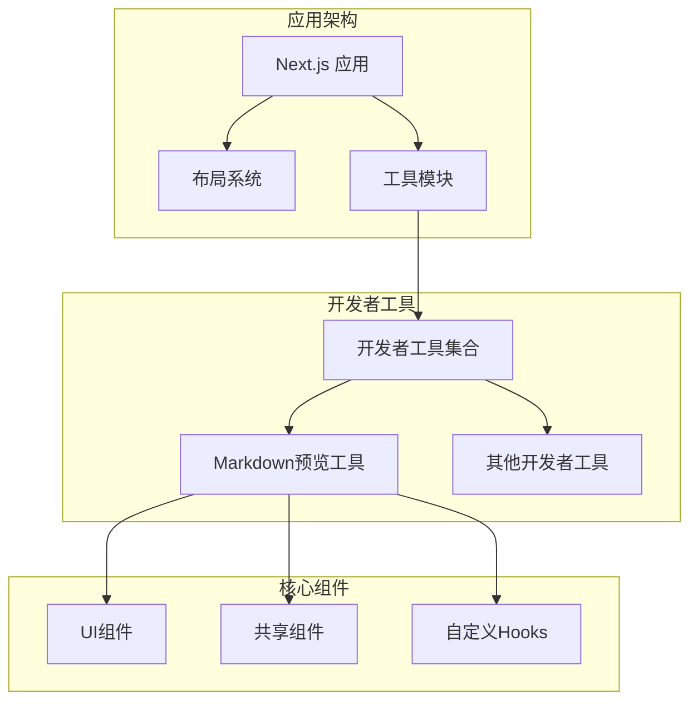
```mermaid
graph TB
subgraph "应用架构"
App[Next.js 应用]
Layout[布局系统]
Tools[工具模块]
end
subgraph "开发者工具"
DevTools[开发者工具集合]
MarkdownPreview[Markdown预览工具]
OtherDevTools[其他开发者工具]
end
subgraph "核心组件"
UIComponents[UI组件]
SharedComponents[共享组件]
Hooks[自定义Hooks]
end
App --> Layout
App --> Tools
Tools --> DevTools
DevTools --> MarkdownPreview
DevTools --> OtherDevTools
MarkdownPreview --> UIComponents
MarkdownPreview --> SharedComponents
MarkdownPreview --> Hooks
```

**图表来源**
- [README.md:55-78](file://README.md#L55-L78)
- [package.json:11-32](file://package.json#L11-L32)

**章节来源**
- [README.md:16-25](file://README.md#L16-L25)
- [README.md:55-78](file://README.md#L55-L78)

## 核心组件

Markdown预览工具由三个主要组件构成，每个组件都有明确的职责分工：

### 主要组件架构

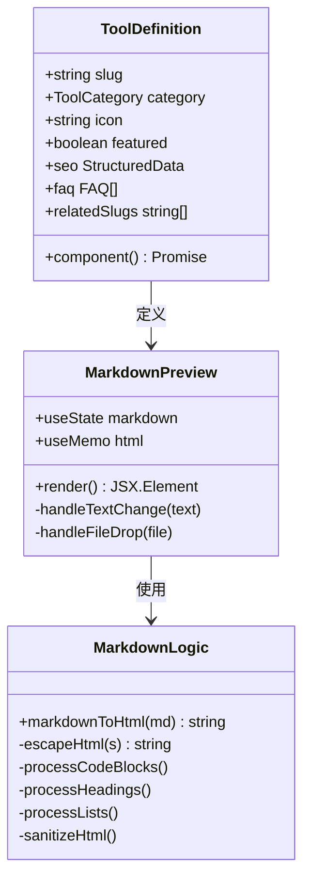
```mermaid
classDiagram
class MarkdownPreview {
+useState markdown
+useMemo html
+render() JSX.Element
-handleTextChange(text)
-handleFileDrop(file)
}
class MarkdownLogic {
+markdownToHtml(md) string
-escapeHtml(s) string
-processCodeBlocks()
-processHeadings()
-processLists()
-sanitizeHtml()
}
class ToolDefinition {
+string slug
+ToolCategory category
+string icon
+boolean featured
+component() Promise
+seo StructuredData
+faq FAQ[]
+relatedSlugs string[]
}
MarkdownPreview --> MarkdownLogic : 使用
ToolDefinition --> MarkdownPreview : 定义
```

**图表来源**
- [MarkdownPreview.tsx:9-45](file://src/tools/developer/markdown-preview/MarkdownPreview.tsx#L9-L45)
- [logic.ts:9-75](file://src/tools/developer/markdown-preview/logic.ts#L9-L75)
- [index.ts:3-34](file://src/tools/developer/markdown-preview/index.ts#L3-L34)

### 组件交互流程

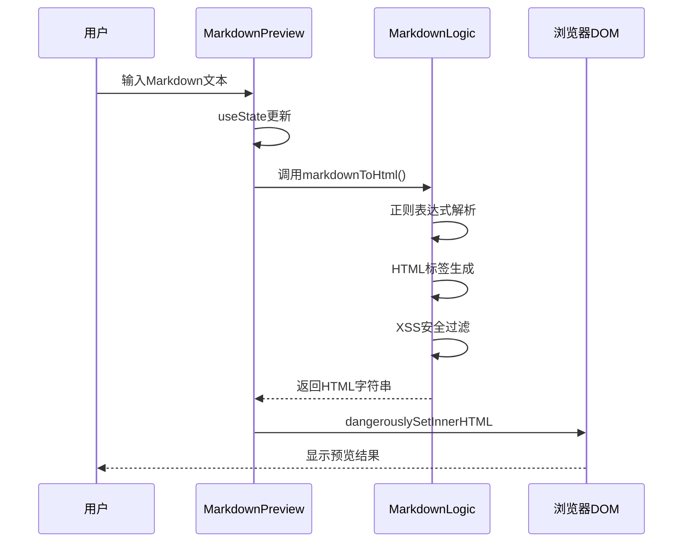
```mermaid
sequenceDiagram
participant User as 用户
participant Preview as MarkdownPreview
participant Logic as MarkdownLogic
participant DOM as 浏览器DOM
User->>Preview : 输入Markdown文本
Preview->>Preview : useState更新
Preview->>Logic : 调用markdownToHtml()
Logic->>Logic : 正则表达式解析
Logic->>Logic : HTML标签生成
Logic->>Logic : XSS安全过滤
Logic-->>Preview : 返回HTML字符串
Preview->>DOM : dangerouslySetInnerHTML
DOM-->>User : 显示预览结果
```

**图表来源**
- [MarkdownPreview.tsx:13](file://src/tools/developer/markdown-preview/MarkdownPreview.tsx#L13)
- [logic.ts:9-75](file://src/tools/developer/markdown-preview/logic.ts#L9-L75)

**章节来源**
- [MarkdownPreview.tsx:1-46](file://src/tools/developer/markdown-preview/MarkdownPreview.tsx#L1-L46)
- [logic.ts:1-76](file://src/tools/developer/markdown-preview/logic.ts#L1-L76)
- [index.ts:1-37](file://src/tools/developer/markdown-preview/index.ts#L1-L37)

## 架构概览

### 整体系统架构

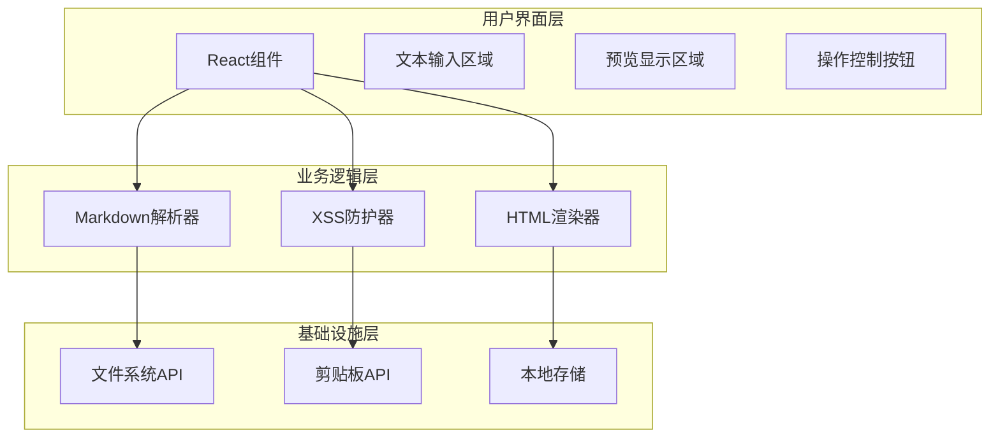
```mermaid
graph TB
subgraph "用户界面层"
UI[React组件]
Input[文本输入区域]
Preview[预览显示区域]
Controls[操作控制按钮]
end
subgraph "业务逻辑层"
Parser[Markdown解析器]
Sanitizer[XSS防护器]
Renderer[HTML渲染器]
end
subgraph "基础设施层"
FileSystem[文件系统API]
Clipboard[剪贴板API]
Storage[本地存储]
end
UI --> Parser
UI --> Sanitizer
UI --> Renderer
Parser --> FileSystem
Sanitizer --> Clipboard
Renderer --> Storage
```

**图表来源**
- [MarkdownPreview.tsx:15-44](file://src/tools/developer/markdown-preview/MarkdownPreview.tsx#L15-L44)
- [logic.ts:67-75](file://src/tools/developer/markdown-preview/logic.ts#L67-L75)

### 数据流架构

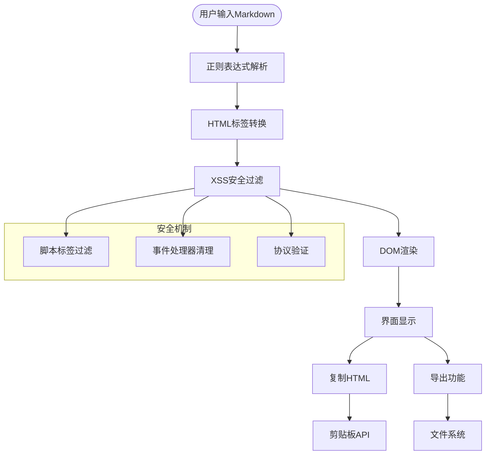
```mermaid
flowchart TD
Start([用户输入Markdown]) --> Parse[正则表达式解析]
Parse --> Transform[HTML标签转换]
Transform --> Sanitize[XSS安全过滤]
Sanitize --> Render[DOM渲染]
Render --> Display[界面显示]
Display --> Copy[复制HTML]
Copy --> Clipboard[剪贴板API]
Display --> Export[导出功能]
Export --> FileSystem[文件系统]
subgraph "安全机制"
XSS[脚本标签过滤]
Events[事件处理器清理]
Protocols[协议验证]
end
Sanitize --> XSS
Sanitize --> Events
Sanitize --> Protocols
```

**图表来源**
- [logic.ts:9-75](file://src/tools/developer/markdown-preview/logic.ts#L9-L75)
- [CopyButton.tsx:23-34](file://src/components/shared/CopyButton.tsx#L23-L34)

**章节来源**
- [MarkdownPreview.tsx:37-40](file://src/tools/developer/markdown-preview/MarkdownPreview.tsx#L37-L40)
- [logic.ts:67-75](file://src/tools/developer/markdown-preview/logic.ts#L67-L75)

## 详细组件分析

### MarkdownPreview组件

MarkdownPreview组件是整个工具的核心界面组件，采用了响应式设计和现代化的用户体验。

#### 组件特性

- **双栏布局设计**：左侧编辑区，右侧预览区，支持不同屏幕尺寸的自适应
- **拖拽文件支持**：通过TextDropZone组件实现文件拖拽导入
- **实时预览**：使用useMemo优化性能，避免不必要的重新计算
- **安全防护**：内置XSS攻击防护机制

#### 界面交互设计

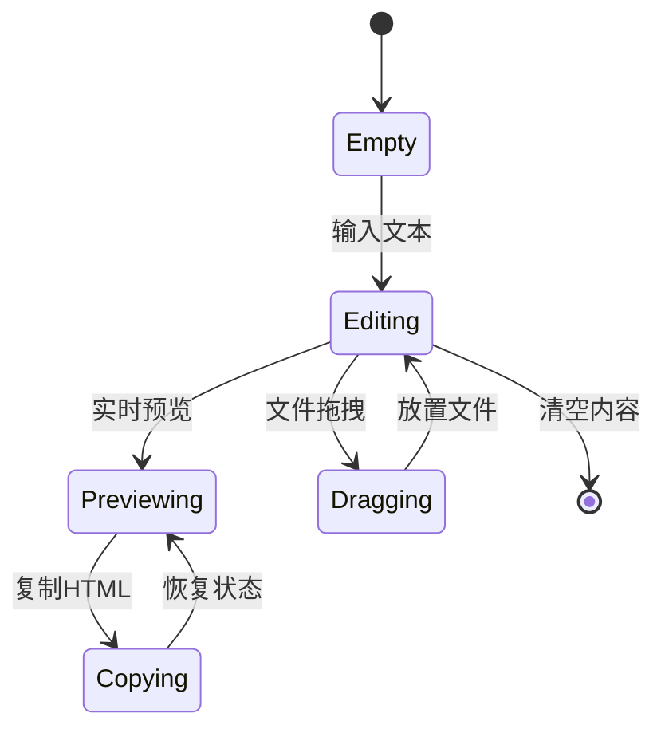
```mermaid
stateDiagram-v2
[*] --> Empty
Empty --> Editing : 输入文本
Editing --> Previewing : 实时预览
Previewing --> Copying : 复制HTML
Copying --> Previewing : 恢复状态
Editing --> Dragging : 文件拖拽
Dragging --> Editing : 放置文件
Editing --> [*] : 清空内容
```

**图表来源**
- [MarkdownPreview.tsx:17-42](file://src/tools/developer/markdown-preview/MarkdownPreview.tsx#L17-L42)

**章节来源**
- [MarkdownPreview.tsx:9-45](file://src/tools/developer/markdown-preview/MarkdownPreview.tsx#L9-L45)

### Markdown解析逻辑

Markdown解析逻辑通过精心设计的正则表达式实现，支持多种Markdown语法元素的转换。

#### 解析流程

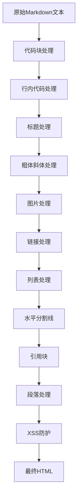
```mermaid
flowchart TD
Input[原始Markdown文本] --> CodeBlocks[代码块处理]
CodeBlocks --> InlineCode[行内代码处理]
InlineCode --> Headings[标题处理]
Headings --> BoldItalic[粗体斜体处理]
BoldItalic --> Images[图片处理]
Images --> Links[链接处理]
Links --> Lists[列表处理]
Lists --> HR[水平分割线]
HR --> Blockquotes[引用块]
Blockquotes --> Paragraphs[段落处理]
Paragraphs --> Sanitize[XSS防护]
Sanitize --> Output[最终HTML]
```

**图表来源**
- [logic.ts:12-65](file://src/tools/developer/markdown-preview/logic.ts#L12-L65)

#### 安全过滤机制

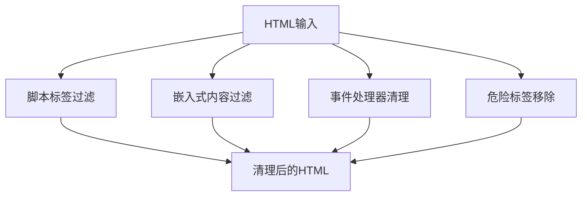
```mermaid
flowchart TD
HTML[HTML输入] --> Script[脚本标签过滤]
HTML --> Iframe[嵌入式内容过滤]
HTML --> Events[事件处理器清理]
HTML --> Dangerous[危险标签移除]
Script --> Cleaned[清理后的HTML]
Iframe --> Cleaned
Events --> Cleaned
Dangerous --> Cleaned
```

**图表来源**
- [logic.ts:67-72](file://src/tools/developer/markdown-preview/logic.ts#L67-L72)

**章节来源**
- [logic.ts:9-76](file://src/tools/developer/markdown-preview/logic.ts#L9-L76)

### 工具定义配置

工具定义配置文件提供了完整的工具元数据和SEO信息。

#### 配置结构

| 属性名 | 类型 | 描述 | 示例 |
|--------|------|------|------|
| slug | string | 工具唯一标识符 | "markdown-preview" |
| category | ToolCategory | 工具分类 | "developer" |
| icon | string | Lucide图标名称 | "BookOpen" |
| featured | boolean | 是否显示在特色工具中 | false |
| component | function | 动态组件加载器 | () => import("./MarkdownPreview") |
| seo | object | SEO结构化数据 | { structuredDataType: "WebApplication" } |
| faq | array | 常见问题数组 | [{questionKey, answerKey}] |
| relatedSlugs | array | 相关工具标识符 | ["json-formatter", "csv-json"] |

**章节来源**
- [index.ts:3-34](file://src/tools/developer/markdown-preview/index.ts#L3-L34)
- [types.ts:5-16](file://src/lib/registry/types.ts#L5-L16)

## Markdown语法支持与渲染规则

### 基础语法支持

该工具支持标准Markdown语法的所有核心元素，通过精确的正则表达式匹配实现高质量的渲染效果。

#### 标题系统

支持从H1到H6的完整标题层次结构，每种标题都有对应的HTML标签映射：

| Markdown语法 | HTML输出 | 示例 |
|-------------|----------|------|
| `# 一级标题` | `<h1>一级标题</h1>` | `# 标题内容` |
| `## 二级标题` | `<h2>二级标题</h2>` | `## 标题内容` |
| `### 三级标题` | `<h3>三级标题</h3>` | `### 标题内容` |
| `#### 四级标题` | `<h4>四级标题</h4>` | `#### 标题内容` |
| `##### 五级标题` | `<h5>五级标题</h5>` | `##### 标题内容` |
| `###### 六级标题` | `<h6>六级标题</h6>` | `###### 标题内容` |

#### 文本格式化

提供完整的文本格式化支持，包括粗体、斜体和粗斜体组合：

| Markdown语法 | HTML输出 | 说明 |
|-------------|----------|------|
| `**粗体**` | `<strong>粗体</strong>` | 粗体文本 |
| `*斜体*` | `<em>斜体</em>` | 斜体文本 |
| `***粗斜体***` | `<strong><em>粗斜体</em></strong>` | 粗斜体组合 |

#### 列表系统

支持有序列表和无序列表的嵌套处理：

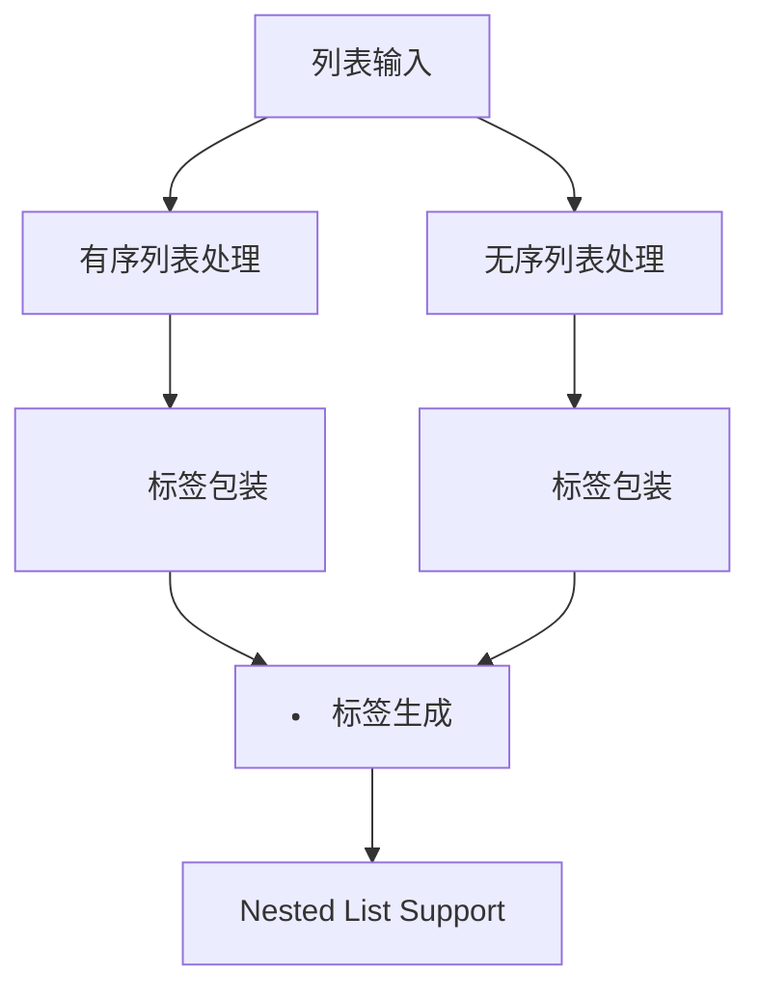
```mermaid
flowchart TD
ListInput[列表输入] --> OrderedList[有序列表处理]
ListInput --> UnorderedList[无序列表处理]
OrderedList --> OL[<ol>标签包装]
UnorderedList --> UL[<ul>标签包装]
OL --> LI[<li>标签生成]
UL --> LI
LI --> Nested[Nested List Support]
```

**图表来源**
- [logic.ts:49-56](file://src/tools/developer/markdown-preview/logic.ts#L49-L56)

#### 链接和图片处理

链接和图片处理遵循标准Markdown规范，同时实施严格的安全检查：

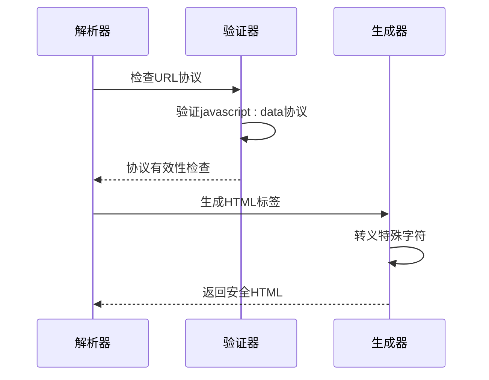
```mermaid
sequenceDiagram
participant Parser as 解析器
participant Validator as 验证器
participant Generator as 生成器
Parser->>Validator : 检查URL协议
Validator->>Validator : 验证javascript : data协议
Validator-->>Parser : 协议有效性检查
Parser->>Generator : 生成HTML标签
Generator->>Generator : 转义特殊字符
Generator-->>Parser : 返回安全HTML
```

**图表来源**
- [logic.ts:33-48](file://src/tools/developer/markdown-preview/logic.ts#L33-L48)

**章节来源**
- [logic.ts:19-65](file://src/tools/developer/markdown-preview/logic.ts#L19-L65)

### 高级语法支持

#### 代码块处理

支持带语言标识的代码块和行内代码的高亮显示：

| Markdown语法 | HTML输出 | 说明 |
|-------------|----------|------|
| ```javascript<br/>console.log('Hello');<br/>``` | `<pre><code class="language-javascript">...</code></pre>` | 带语言标识的代码块 |
| `console.log('Hello')` | `<code>console.log('Hello')</code>` | 行内代码 |

#### 引用块和水平分割线

提供专业的文档排版支持：

- 引用块：`> 引用内容` → `<blockquote>引用内容</blockquote>`
- 水平分割线：`---` → `<hr />`

**章节来源**
- [logic.ts:12-18](file://src/tools/developer/markdown-preview/logic.ts#L12-L18)
- [logic.ts:57-65](file://src/tools/developer/markdown-preview/logic.ts#L57-L65)

## 扩展功能支持

### 安全防护机制

该工具实施了多层次的安全防护措施，确保用户输入的安全性：

#### XSS攻击防护

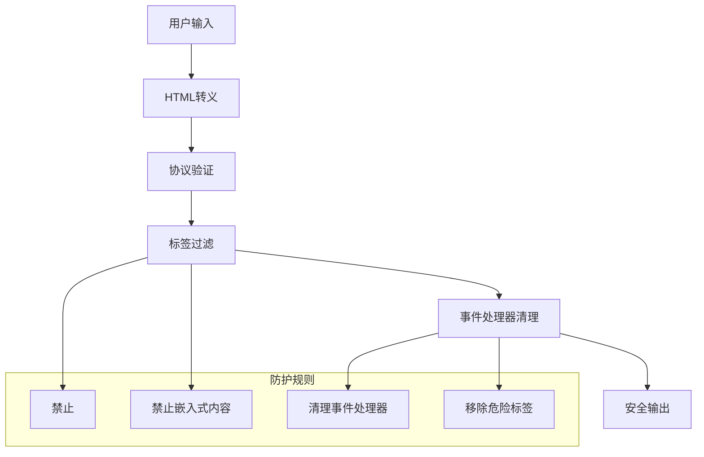
```mermaid
flowchart TD
Input[用户输入] --> Escape[HTML转义]
Escape --> Validate[协议验证]
Validate --> Filter[标签过滤]
Filter --> Sanitize[事件处理器清理]
Sanitize --> SafeOutput[安全输出]
subgraph "防护规则"
Script[禁止<script>标签]
Iframe[禁止嵌入式内容]
Event[清理事件处理器]
Dangerous[移除危险标签]
end
Filter --> Script
Filter --> Iframe
Sanitize --> Event
Sanitize --> Dangerous
```

**图表来源**
- [logic.ts:1-7](file://src/tools/developer/markdown-preview/logic.ts#L1-L7)
- [logic.ts:67-72](file://src/tools/developer/markdown-preview/logic.ts#L67-L72)

#### URL安全验证

对所有外部链接进行协议验证，防止恶意协议执行：

- 禁止协议：`javascript:`, `data:`
- 允许协议：`http:`, `https:`, `mailto:`

**章节来源**
- [logic.ts:37-46](file://src/tools/developer/markdown-preview/logic.ts#L37-L46)

### 文件导入功能

#### 拖拽文件支持

通过TextDropZone组件实现直观的文件拖拽导入功能：

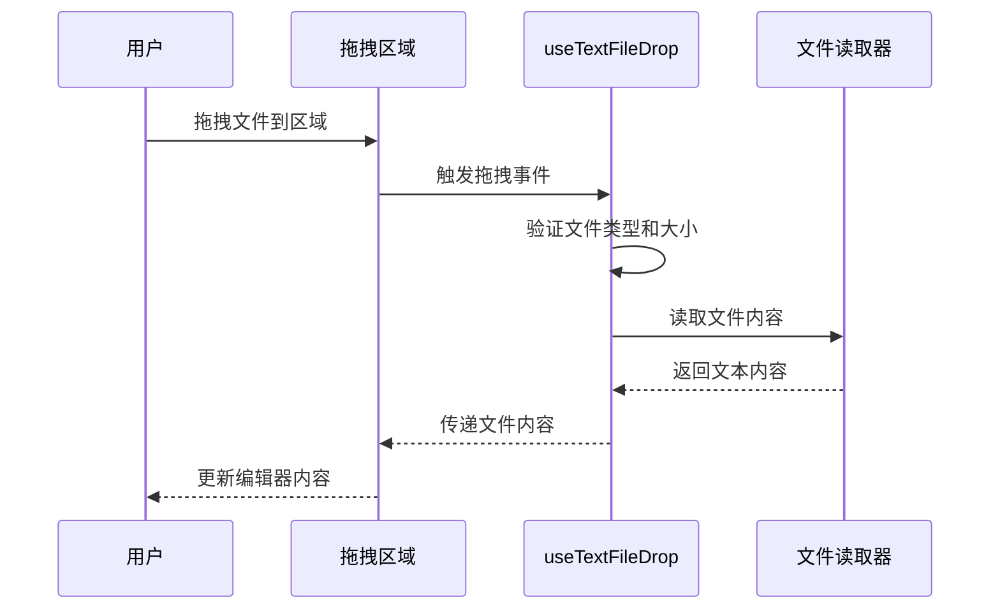
```mermaid
sequenceDiagram
participant User as 用户
participant DropZone as 拖拽区域
participant Hook as useTextFileDrop
participant FileReader as 文件读取器
User->>DropZone : 拖拽文件到区域
DropZone->>Hook : 触发拖拽事件
Hook->>Hook : 验证文件类型和大小
Hook->>FileReader : 读取文件内容
FileReader-->>Hook : 返回文本内容
Hook-->>DropZone : 传递文件内容
DropZone-->>User : 更新编辑器内容
```

**图表来源**
- [TextDropZone.tsx:22-42](file://src/components/shared/TextDropZone.tsx#L22-L42)
- [useTextFileDrop.ts:47-68](file://src/hooks/useTextFileDrop.ts#L47-L68)

#### 支持的文件格式

| 文件类型 | 扩展名 | 用途 |
|---------|--------|------|
| Markdown文档 | `.md`, `.markdown` | 主要输入格式 |
| 纯文本 | `.txt` | 简单文本输入 |
| JSON | `.json` | 结构化数据 |
| CSV | `.csv` | 数据表格 |
| XML | `.xml` | 标记语言 |

**章节来源**
- [TextDropZone.tsx:20](file://src/components/shared/TextDropZone.tsx#L20)
- [useTextFileDrop.ts:6-10](file://src/hooks/useTextFileDrop.ts#L6-L10)

### 复制和导出功能

#### HTML代码复制

CopyButton组件提供一键复制HTML代码的功能：

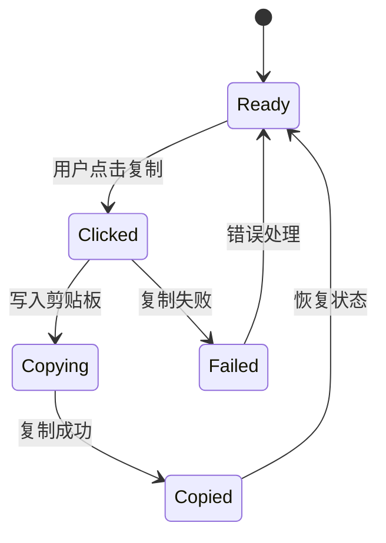
```mermaid
stateDiagram-v2
[*] --> Ready
Ready --> Clicked : 用户点击复制
Clicked --> Copying : 写入剪贴板
Copying --> Copied : 复制成功
Copied --> Ready : 恢复状态
Clicked --> Failed : 复制失败
Failed --> Ready : 错误处理
```

**图表来源**
- [CopyButton.tsx:23-34](file://src/components/shared/CopyButton.tsx#L23-L34)

#### 分析追踪

集成Google Analytics事件追踪，记录用户行为：

- 事件名称：`copy_click`
- 参数：`tool_slug`, `tool_category`

**章节来源**
- [CopyButton.tsx:31-33](file://src/components/shared/CopyButton.tsx#L31-L33)

## 使用示例

### 编写技术文档

#### API文档模板

```markdown
# API参考文档

## 用户管理接口

### 获取用户列表

**请求方法**: `GET`
**请求地址**: `/api/users`

**请求参数**:

| 参数名 | 类型 | 必填 | 描述 |
|-------|------|------|------|
| page | number | 否 | 页码，默认1 |
| limit | number | 否 | 每页数量，默认10 |

**响应示例**:

```json
{
  "users": [],
  "total": 0,
  "page": 1
}
```

**错误码**:

- `401`: 未授权
- `403`: 权限不足
- `500`: 服务器错误
```

#### 配置文件示例

```yaml
# 应用配置文件

server:
  host: localhost
  port: 3000
  ssl: false

database:
  host: db.example.com
  port: 5432
  name: myapp
  credentials:
    username: admin
    password: secret

logging:
  level: info
  file: logs/app.log
```

### 创建博客文章

#### 技术博客模板

```markdown
# 如何使用PrivaDeck构建现代化Web应用

## 引言

PrivaDeck是一个基于React和Next.js构建的多媒体处理工具箱，专注于隐私保护和用户体验。

## 核心特性

### 隐私优先设计

- 所有处理都在浏览器端完成
- 零服务器依赖
- 数据不离开用户设备

### 多语言支持

工具支持21种语言，包括：
- 中文（简体和繁体）
- 英语、法语、德语
- 日语、韩语、俄语
- 西班牙语、葡萄牙语等

## 快速开始

### 安装依赖

```bash
pnpm install
```

### 启动开发服务器

```bash
pnpm dev
```

### 构建生产版本

```bash
pnpm build
```

## 实际应用场景

### 技术文档编写

- API文档生成
- 用户手册制作
- 开发者指南

### 内容创作

- 博客文章编辑
- 学术论文写作
- 项目报告

### 协作编辑

- 团队文档共享
- 代码注释管理
- 设计文档协作
```

### 准备README文件

#### 项目README模板

```markdown
# 项目名称

[]()
[]()

## 🌟 简介

简要描述项目的核心价值和主要功能。

## 🔧 特性

- **隐私保护**：所有处理在本地完成
- **多语言支持**：支持21种语言
- **离线可用**：PWA支持
- **高性能**：基于WebAssembly

## 🚀 快速开始

### 安装

```bash
npm install
```

### 运行

```bash
npm start
```

### 构建

```bash
npm run build
```

## 📚 使用示例

### 基础用法

```javascript
// 示例代码
```

### 高级配置

```yaml
# 配置示例
```

## 🤝 贡献

欢迎提交Issue和Pull Request。

## 📄 许可证

MIT License
```

## 应用场景

### 技术文档编写

#### 开发者文档

Markdown预览工具特别适合技术文档的编写和维护：

- **API文档**：实时预览接口文档格式
- **架构文档**：清晰展示技术架构图
- **开发指南**：标准化开发流程文档
- **测试文档**：详细测试用例说明

#### 产品文档

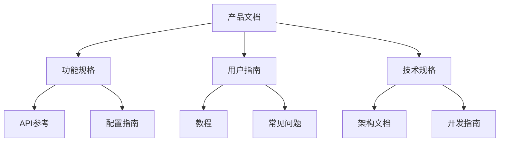
```mermaid
flowchart TD
ProductDoc[产品文档] --> FeatureSpec[功能规格]
ProductDoc --> UserGuide[用户指南]
ProductDoc --> TechSpec[技术规格]
FeatureSpec --> APIRef[API参考]
FeatureSpec --> ConfigGuide[配置指南]
UserGuide --> Tutorial[教程]
UserGuide --> FAQ[常见问题]
TechSpec --> ArchDoc[架构文档]
TechSpec --> DevGuide[开发指南]
```

### 知识库建设

#### 企业知识库

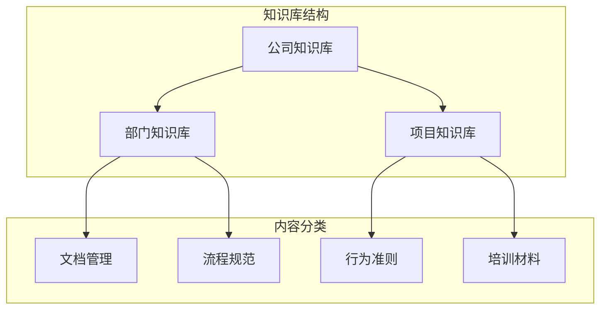
```mermaid
graph TB
subgraph "知识库结构"
Company[公司知识库]
Department[部门知识库]
Project[项目知识库]
end
subgraph "内容分类"
Docs[文档管理]
Procedures[流程规范]
Guidelines[行为准则]
Training[培训材料]
end
Company --> Department
Company --> Project
Department --> Docs
Department --> Procedures
Project --> Guidelines
Project --> Training
```

#### 学习管理系统

- **课程资料**：课件、讲义、作业
- **学习进度**：跟踪和评估
- **资源库**：视频、文档、链接
- **讨论区**：问答和交流

### 协作编辑

#### 团队协作

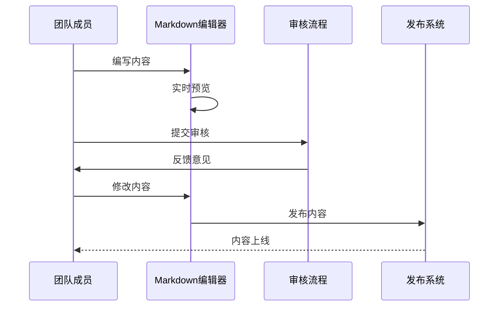
```mermaid
sequenceDiagram
participant Team as 团队成员
participant Editor as Markdown编辑器
participant Review as 审核流程
participant Publish as 发布系统
Team->>Editor : 编写内容
Editor->>Editor : 实时预览
Team->>Review : 提交审核
Review->>Team : 反馈意见
Team->>Editor : 修改内容
Editor->>Publish : 发布内容
Publish-->>Team : 内容上线
```

**图表来源**
- [MarkdownPreview.tsx:20](file://src/tools/developer/markdown-preview/MarkdownPreview.tsx#L20)

## 样式定制与主题

### 主题系统

PrivaDeck采用现代化的主题系统，支持明暗主题自动切换：

#### 主题配置

| 配置项 | 默认值 | 说明 |
|--------|--------|------|
| 主题模式 | 系统跟随 | 支持自动、浅色、深色 |
| 字体大小 | 16px | 可调节的文本大小 |
| 行宽限制 | 80字符 | 优化阅读体验 |
| 代码高亮 | GitHub风格 | 基于Prism.js |

#### 样式定制选项

```css
/* 主题变量 */
:root {
  --background: 0 0% 100%;
  --foreground: 0 0% 3.9%;
  --card: 0 0% 100%;
  --card-foreground: 0 0% 3.9%;
  --popover: 0 0% 100%;
  --popover-foreground: 0 0% 3.9%;
  --primary: 0 0% 9%;
  --primary-foreground: 0 0% 98%;
  --secondary: 0 0% 95%;
  --secondary-foreground: 0 0% 10%;
  --muted: 0 0% 95%;
  --muted-foreground: 0 0% 45%;
  --accent: 0 0% 95%;
  --accent-foreground: 0 0% 10%;
  --destructive: 0 0% 98%;
  --destructive-foreground: 0 0% 98%;
  --border: 0 0% 89.8%;
  --input: 0 0% 89.8%;
  --ring: 0 0% 9%;
}

.dark {
  --background: 0 0% 3.9%;
  --foreground: 0 0% 98%;
  --card: 0 0% 3.9%;
  --card-foreground: 0 0% 98%;
  --popover: 0 0% 3.9%;
  --popover-foreground: 0 0% 98%;
  --primary: 0 0% 98%;
  --primary-foreground: 0 0% 9%;
  --secondary: 0 0% 15%;
  --secondary-foreground: 0 0% 98%;
  --muted: 0 0% 15%;
  --muted-foreground: 0 0% 65%;
  --accent: 0 0% 15%;
  --accent-foreground: 0 0% 98%;
  --destructive: 0 0% 98%;
  --destructive-foreground: 0 0% 98%;
  --border: 0 0% 15%;
  --input: 0 0% 15%;
  --ring: 0 0% 83.1%;
}
```

### 预览样式优化

#### Prose样式系统

预览区域使用Prose样式系统，提供专业的文档阅读体验：

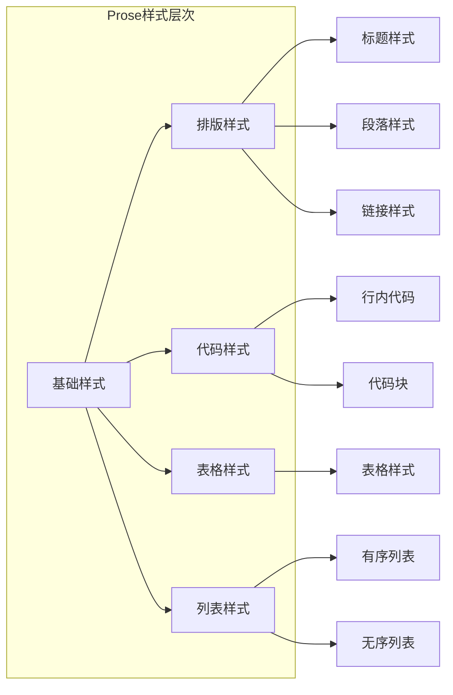
```mermaid
graph LR
subgraph "Prose样式层次"
Base[基础样式]
Typography[排版样式]
Code[代码样式]
Tables[表格样式]
Lists[列表样式]
end
Base --> Typography
Base --> Code
Base --> Tables
Base --> Lists
Typography --> Headings[标题样式]
Typography --> Paragraphs[段落样式]
Typography --> Links[链接样式]
Code --> InlineCode[行内代码]
Code --> BlockCode[代码块]
Tables --> TableStyles[表格样式]
Lists --> OrderedList[有序列表]
Lists --> UnorderedList[无序列表]
```

**图表来源**
- [MarkdownPreview.tsx:37-40](file://src/tools/developer/markdown-preview/MarkdownPreview.tsx#L37-L40)

## 性能考虑

### 优化策略

#### 渲染性能优化

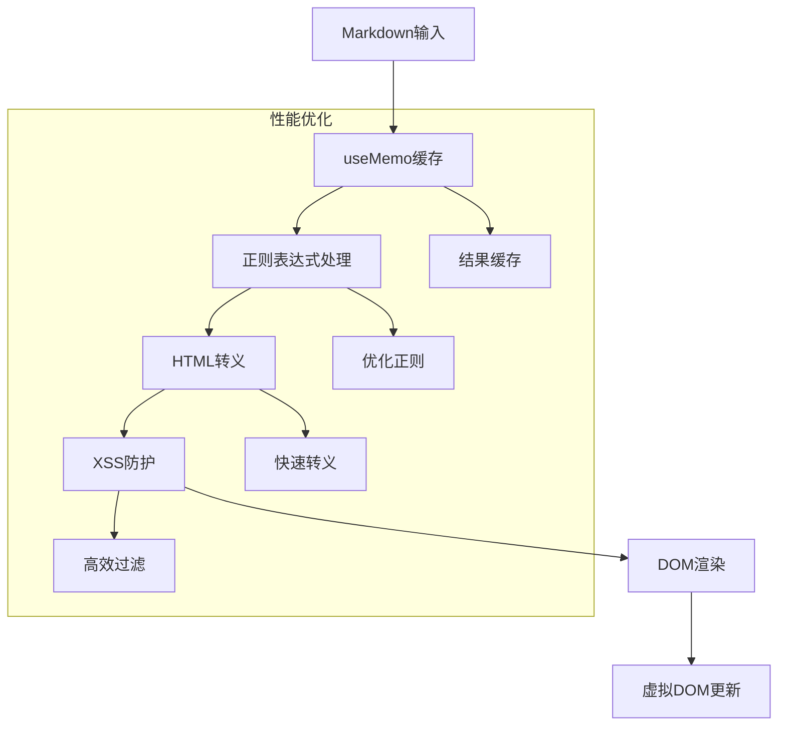
```mermaid
flowchart TD
Input[Markdown输入] --> Memo[useMemo缓存]
Memo --> Regex[正则表达式处理]
Regex --> Escape[HTML转义]
Escape --> Sanitize[XSS防护]
Sanitize --> Render[DOM渲染]
subgraph "性能优化"
Memo --> Cache[结果缓存]
Regex --> Optimized[优化正则]
Escape --> FastEscape[快速转义]
Sanitize --> EfficientFilter[高效过滤]
end
Render --> VirtualDOM[虚拟DOM更新]
```

**图表来源**
- [MarkdownPreview.tsx:13](file://src/tools/developer/markdown-preview/MarkdownPreview.tsx#L13)

#### 内存管理

- **及时释放**：组件卸载时清理状态
- **批量更新**：合并多个状态更新
- **懒加载**：按需加载组件和资源

### 加载性能

#### 资源优化

| 优化策略 | 实现方式 | 性能收益 |
|---------|---------|---------|
| 代码分割 | 动态导入组件 | 减少初始包大小 |
| 延迟加载 | 懒加载工具组件 | 提升首屏速度 |
| 压缩资源 | Gzip/Brotli压缩 | 减少传输时间 |
| 缓存策略 | HTTP缓存头设置 | 重复访问更快 |

## 故障排除指南

### 常见问题解决

#### 渲染问题

| 问题症状 | 可能原因 | 解决方案 |
|---------|---------|---------|
| 预览空白 | Markdown语法错误 | 检查语法格式 |
| 标签显示异常 | HTML被过滤 | 检查是否包含危险标签 |
| 图片不显示 | URL协议不安全 | 使用HTTPS链接 |
| 链接无法点击 | 外链被阻止 | 检查目标网站可访问性 |

#### 性能问题

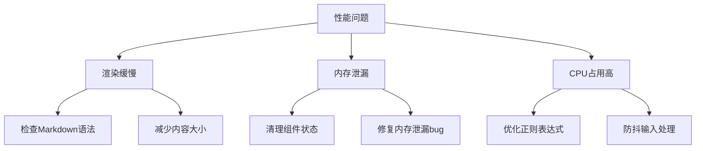
```mermaid
flowchart TD
PerformanceIssue[性能问题] --> SlowRender[渲染缓慢]
PerformanceIssue --> MemoryLeak[内存泄漏]
PerformanceIssue --> HighCPU[CPU占用高]
SlowRender --> CheckSyntax[检查Markdown语法]
SlowRender --> ReduceContent[减少内容大小]
MemoryLeak --> CleanupState[清理组件状态]
MemoryLeak --> FixBugs[修复内存泄漏bug]
HighCPU --> OptimizeRegex[优化正则表达式]
HighCPU --> DebounceInput[防抖输入处理]
```

**图表来源**
- [logic.ts:1-7](file://src/tools/developer/markdown-preview/logic.ts#L1-L7)

#### 安全相关问题

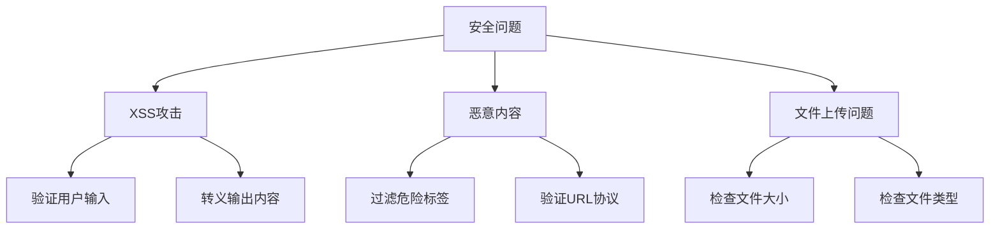
```mermaid
flowchart TD
SecurityIssue[安全问题] --> XSSAttack[XSS攻击]
SecurityIssue --> MaliciousContent[恶意内容]
SecurityIssue --> FileUpload[文件上传问题]
XSSAttack --> ValidateInput[验证用户输入]
XSSAttack --> EscapeOutput[转义输出内容]
MaliciousContent --> FilterTags[过滤危险标签]
MaliciousContent --> ValidateURL[验证URL协议]
FileUpload --> CheckFileSize[检查文件大小]
FileUpload --> CheckFileType[检查文件类型]
```

**图表来源**
- [logic.ts:37-46](file://src/tools/developer/markdown-preview/logic.ts#L37-L46)

### 调试技巧

#### 开发者工具使用

1. **浏览器开发者工具**
   - 使用Elements面板检查生成的HTML
   - 使用Console查看JavaScript错误
   - 使用Network面板监控资源加载

2. **性能分析**
   - 使用Performance面板分析渲染性能
   - 使用Memory面板检测内存泄漏
   - 使用Coverage面板识别未使用的代码

3. **调试技巧**
   - 在关键位置添加console.log输出
   - 使用React DevTools检查组件状态
   - 利用Source Maps定位源代码位置

**章节来源**
- [logic.ts:67-75](file://src/tools/developer/markdown-preview/logic.ts#L67-L75)

## 结论

Markdown预览工具作为PrivaDeck多媒体工具箱的重要组成部分，展现了现代Web应用的最佳实践。通过纯前端实现、强大的安全防护机制和优雅的用户界面设计，该工具为内容创作者提供了专业而可靠的Markdown编辑体验。

### 核心优势

1. **隐私保护**：所有处理都在本地完成，确保用户数据安全
2. **性能卓越**：优化的渲染算法和缓存机制
3. **安全性强**：多层次的安全防护措施
4. **易用性强**：直观的界面设计和丰富的功能
5. **可扩展性**：模块化的架构设计

### 未来发展方向

- **增强语法支持**：支持更多Markdown扩展语法
- **协作功能**：实现实时协作编辑
- **主题系统**：提供更多自定义选项
- **插件生态**：构建开放的插件系统
- **移动端优化**：提升移动设备使用体验

该工具不仅满足了当前的使用需求，更为未来的功能扩展奠定了坚实的基础，是内容创作和文档管理的理想选择。