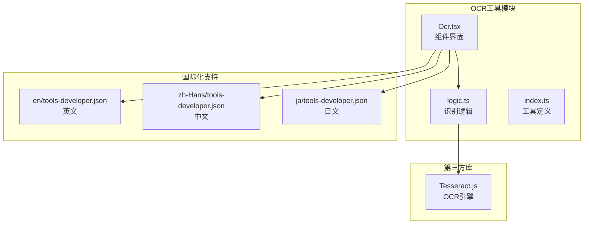
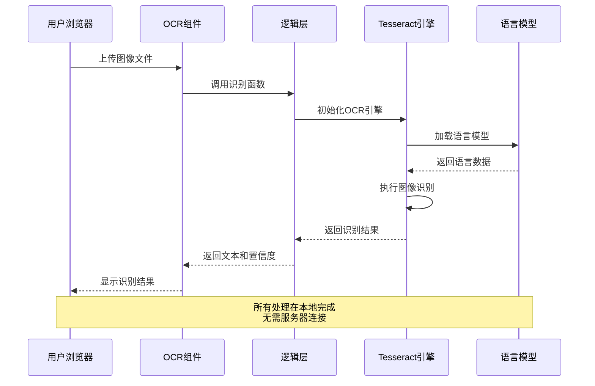
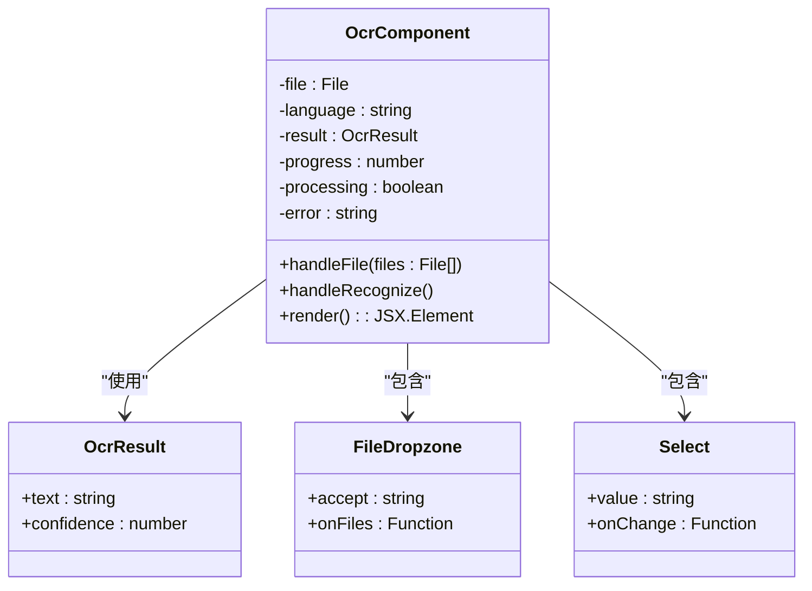
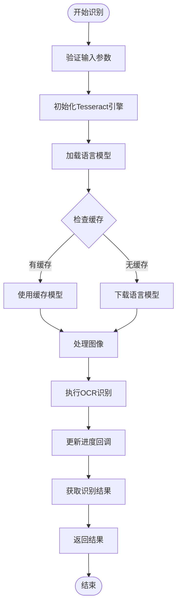
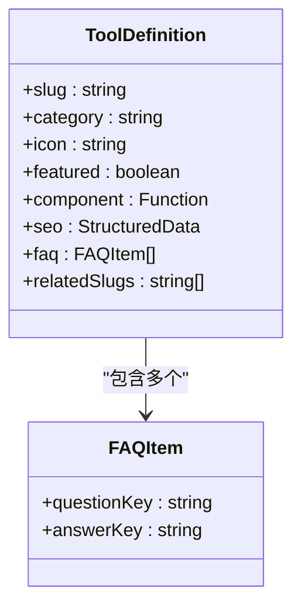
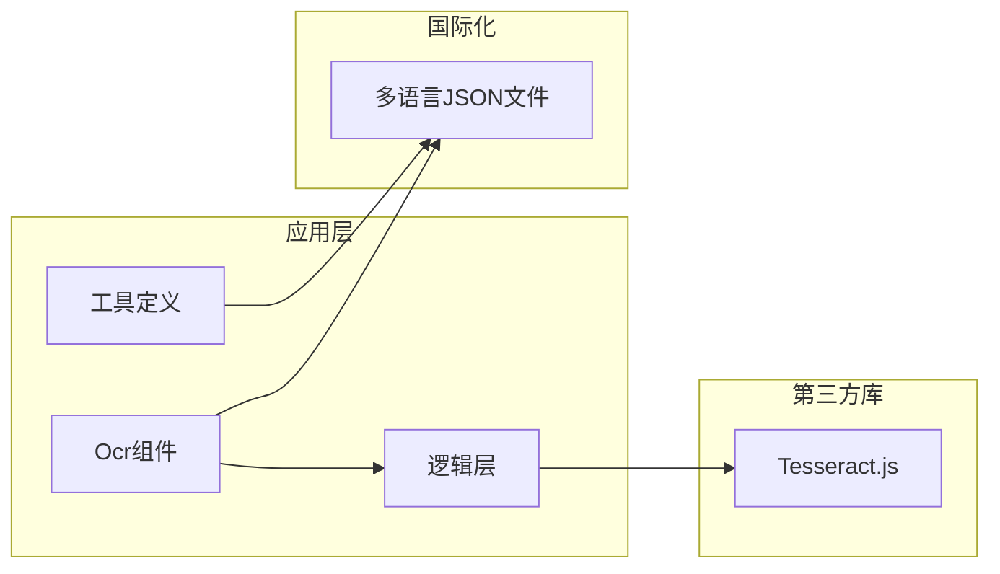

# OCR文字识别工具

<cite>
**本文档引用的文件**
- [Ocr.tsx](file://src/tools/developer/ocr/Ocr.tsx)
- [logic.ts](file://src/tools/developer/ocr/logic.ts)
- [index.ts](file://src/tools/developer/ocr/index.ts)
- [tools-developer.json (英文)](file://messages/en/tools-developer.json)
- [tools-developer.json (中文)](file://messages/zh-Hans/tools-developer.json)
- [tools-developer.json (日文)](file://messages/ja/tools-developer.json)
</cite>

## 目录
1. [简介](#简介)
2. [项目结构](#项目结构)
3. [核心组件](#核心组件)
4. [架构概览](#架构概览)
5. [详细组件分析](#详细组件分析)
6. [依赖关系分析](#依赖关系分析)
7. [性能考虑](#性能考虑)
8. [故障排除指南](#故障排除指南)
9. [结论](#结论)
10. [附录](#附录)

## 简介

OCR文字识别工具是一个基于Tesseract.js的光学字符识别解决方案，能够在浏览器端完全本地化地处理图像文字识别任务。该工具支持12种以上语言，包括英语、中文（简体/繁体）、日语、韩语、西班牙语、法语、德语等主流语言，为用户提供安全、高效的文本提取服务。

该工具的核心优势在于完全本地化处理，所有图像数据和识别过程都在用户浏览器中完成，无需上传到任何服务器，确保了数据隐私和安全。同时，工具提供了直观的用户界面，支持拖拽上传、实时进度显示和结果导出等功能。

## 项目结构

OCR工具采用模块化设计，主要包含以下核心文件：

**图表来源**
- [Ocr.tsx:1-90](file://src/tools/developer/ocr/Ocr.tsx#L1-L90)
- [logic.ts:1-41](file://src/tools/developer/ocr/logic.ts#L1-L41)
- [index.ts:1-37](file://src/tools/developer/ocr/index.ts#L1-L37)

**章节来源**
- [Ocr.tsx:1-90](file://src/tools/developer/ocr/Ocr.tsx#L1-L90)
- [logic.ts:1-41](file://src/tools/developer/ocr/logic.ts#L1-L41)
- [index.ts:1-37](file://src/tools/developer/ocr/index.ts#L1-L37)

## 核心组件

### OCR识别引擎

工具基于Tesseract.js实现OCR功能，这是一个强大的开源OCR引擎，支持多种图像格式和语言识别。核心识别功能由`recognizeText`函数提供，支持实时进度反馈和结果导出。

### 语言支持系统

工具内置了完整的多语言支持系统，当前支持12种语言：
- 英语 (eng)
- 简体中文 (chi_sim)
- 繁体中文 (chi_tra)
- 日语 (jpn)
- 韩语 (kor)
- 西班牙语 (spa)
- 法语 (fra)
- 德语 (deu)
- 葡萄牙语 (por)
- 阿拉伯语 (ara)
- 俄语 (rus)
- 北印度语 (hin)

### 用户界面组件

界面采用现代化的React设计，提供直观的用户体验：
- 文件拖拽上传区域
- 实时进度显示
- 语言选择下拉菜单
- 结果文本编辑区域
- 复制和导出功能

**章节来源**
- [logic.ts:8-21](file://src/tools/developer/ocr/logic.ts#L8-L21)
- [Ocr.tsx:54-86](file://src/tools/developer/ocr/Ocr.tsx#L54-L86)

## 架构概览

OCR工具采用客户端本地化处理架构，确保数据安全和隐私保护：

**图表来源**
- [Ocr.tsx:28-42](file://src/tools/developer/ocr/Ocr.tsx#L28-L42)
- [logic.ts:23-40](file://src/tools/developer/ocr/logic.ts#L23-L40)

该架构确保了以下特性：
- **完全本地化**：所有处理在用户浏览器中完成
- **隐私保护**：图像和识别结果不会离开用户设备
- **离线支持**：语言模型缓存后可离线使用
- **实时反馈**：进度状态和结果即时显示

## 详细组件分析

### OCR组件 (Ocr.tsx)

OCR组件是用户交互的主要界面，负责处理用户输入和展示识别结果：

**图表来源**
- [Ocr.tsx:12-89](file://src/tools/developer/ocr/Ocr.tsx#L12-L89)

组件功能包括：
- 文件上传和预览
- 语言选择和配置
- 识别流程控制
- 结果展示和导出

**章节来源**
- [Ocr.tsx:1-90](file://src/tools/developer/ocr/Ocr.tsx#L1-L90)

### OCR逻辑层 (logic.ts)

逻辑层封装了OCR识别的核心功能，提供简洁的API接口：

**图表来源**
- [logic.ts:23-40](file://src/tools/developer/ocr/logic.ts#L23-L40)

核心功能：
- 图像识别处理
- 进度状态监控
- 结果数据格式化
- 错误处理机制

**章节来源**
- [logic.ts:1-41](file://src/tools/developer/ocr/logic.ts#L1-L41)

### 工具定义 (index.ts)

工具定义文件描述了OCR工具的元数据和配置：

**图表来源**
- [index.ts:3-36](file://src/tools/developer/ocr/index.ts#L3-L36)

**章节来源**
- [index.ts:1-37](file://src/tools/developer/ocr/index.ts#L1-L37)

## 依赖关系分析

OCR工具的依赖关系相对简单，主要依赖于Tesseract.js OCR引擎：

**图表来源**
- [Ocr.tsx:1-10](file://src/tools/developer/ocr/Ocr.tsx#L1-L10)
- [logic.ts:1-1](file://src/tools/developer/ocr/logic.ts#L1-L1)
- [index.ts:1-1](file://src/tools/developer/ocr/index.ts#L1-L1)

**章节来源**
- [Ocr.tsx:1-10](file://src/tools/developer/ocr/Ocr.tsx#L1-L10)
- [logic.ts:1-1](file://src/tools/developer/ocr/logic.ts#L1-L1)
- [index.ts:1-1](file://src/tools/developer/ocr/index.ts#L1-L1)

## 性能考虑

### 识别性能

OCR识别性能受多种因素影响：
- **图像质量**：分辨率越高、对比度越好，识别准确率越高
- **语言复杂度**：不同语言的识别难度和性能表现不同
- **处理负载**：浏览器性能和可用内存影响处理速度
- **模型大小**：语言模型文件大小影响加载时间

### 优化策略

1. **模型缓存**：语言模型下载后缓存在本地，后续识别更快
2. **进度反馈**：实时显示识别进度，提升用户体验
3. **资源管理**：及时释放图像URL对象，避免内存泄漏
4. **错误处理**：优雅处理识别失败情况，提供用户指导

## 故障排除指南

### 常见问题及解决方案

**问题1：识别结果不准确**
- 检查图像清晰度和对比度
- 确认选择了正确的语言选项
- 尝试调整图像角度和光照条件

**问题2：识别速度慢**
- 减少图像尺寸或质量
- 关闭其他占用CPU的浏览器标签
- 确保浏览器支持WebAssembly

**问题3：语言模型加载失败**
- 检查网络连接状态
- 清除浏览器缓存后重试
- 确认浏览器支持必要的API

**问题4：内存使用过高**
- 关闭不必要的浏览器标签
- 重启浏览器进程
- 尝试在性能更好的设备上使用

**章节来源**
- [tools-developer.json (英文):154-165](file://messages/en/tools-developer.json#L154-L165)
- [tools-developer.json (中文):154-165](file://messages/zh-Hans/tools-developer.json#L154-L165)
- [tools-developer.json (日文):154-165](file://messages/ja/tools-developer.json#L154-L165)

## 结论

OCR文字识别工具提供了一个强大、安全、易用的图像文字识别解决方案。通过采用客户端本地化处理架构，工具确保了用户数据的隐私和安全，同时提供了丰富的功能和良好的用户体验。

工具的主要优势包括：
- **完全本地化处理**：数据隐私和安全得到保障
- **多语言支持**：覆盖全球主要语言需求
- **用户友好界面**：直观的操作流程和实时反馈
- **跨平台兼容**：支持多种操作系统和浏览器
- **离线能力**：语言模型缓存后可离线使用

对于文档数字化、信息提取和内容检索等应用场景，该工具提供了可靠的解决方案，能够有效提升工作效率和准确性。

## 附录

### 使用示例

**处理扫描文档**：
1. 上传扫描的文档图像
2. 选择文档语言
3. 点击识别按钮
4. 复制或导出识别结果

**提取截图文字**：
1. 截取包含文字的屏幕截图
2. 上传截图文件
3. 选择相应语言
4. 获取识别文本

**多语言支持**：
- 自动语言检测功能
- 支持混合语言文本
- 语言模型动态加载

### 集成建议

**与PDF处理集成**：
- 先将PDF页面转换为图像
- 使用OCR工具提取文字
- 将结果整合到PDF中

**与数据挖掘集成**：
- 批量处理图像文件
- 提取结构化数据
- 与数据库系统对接

**与机器学习集成**：
- 作为预处理步骤
- 提供训练数据
- 支持后续分析任务