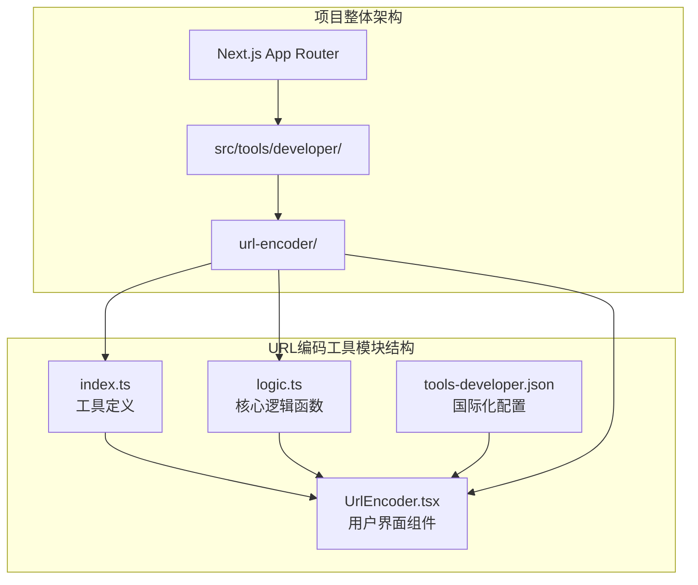
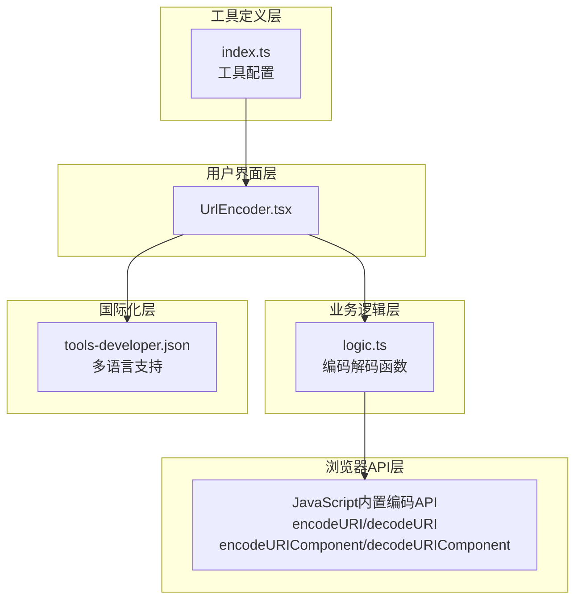
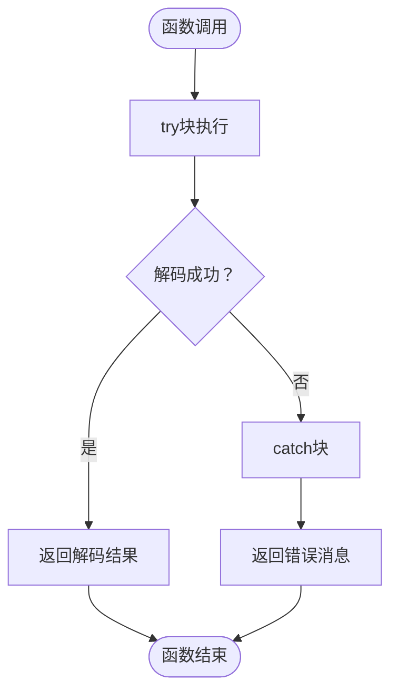
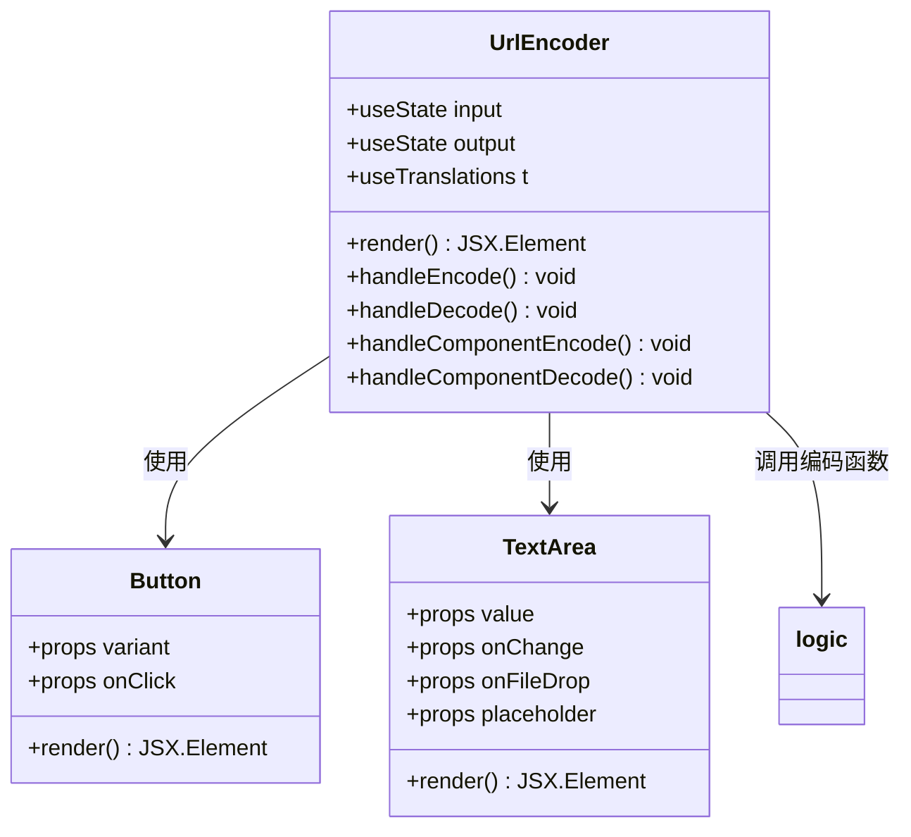
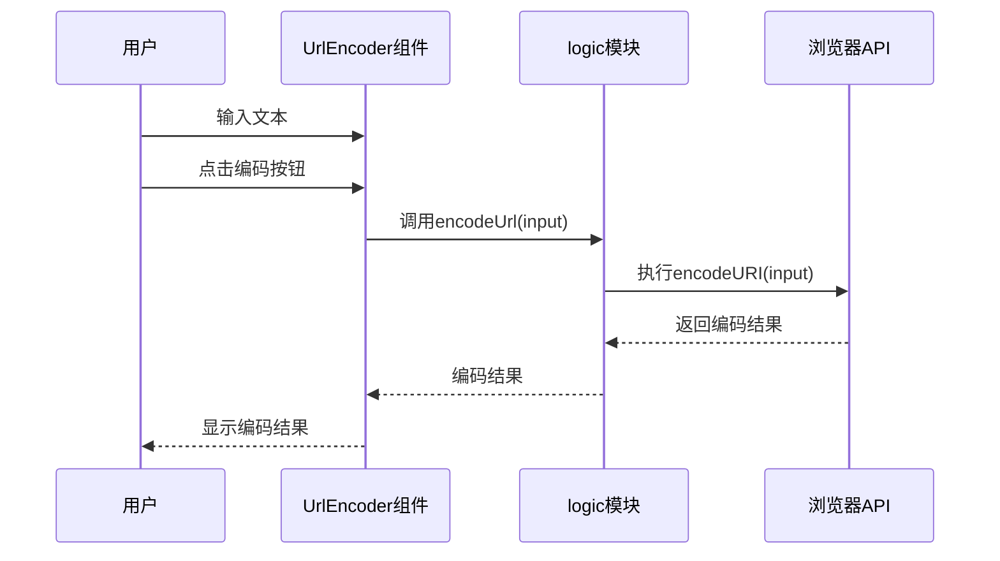
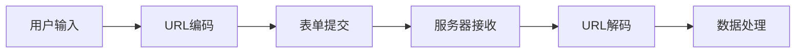
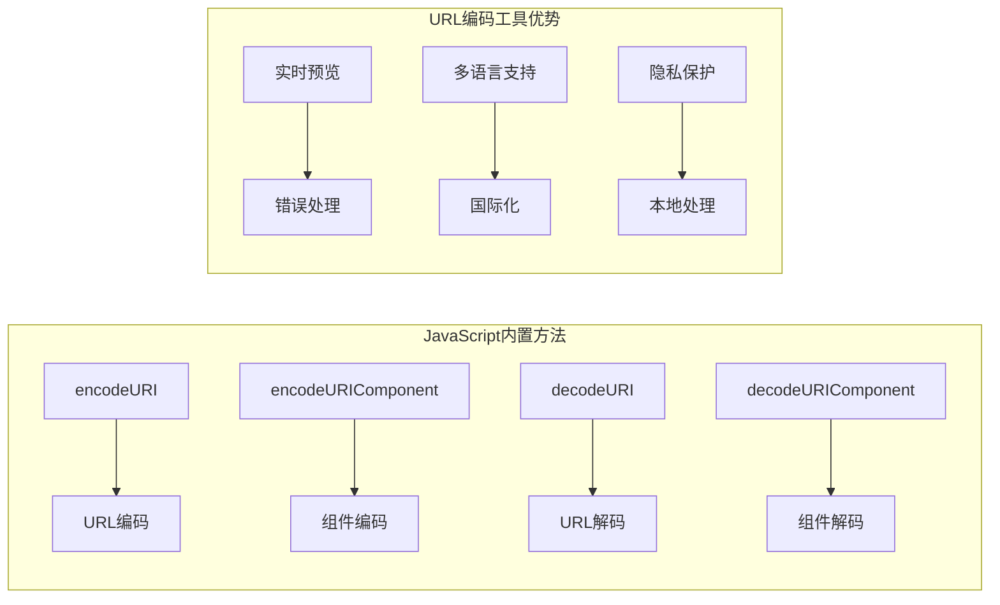
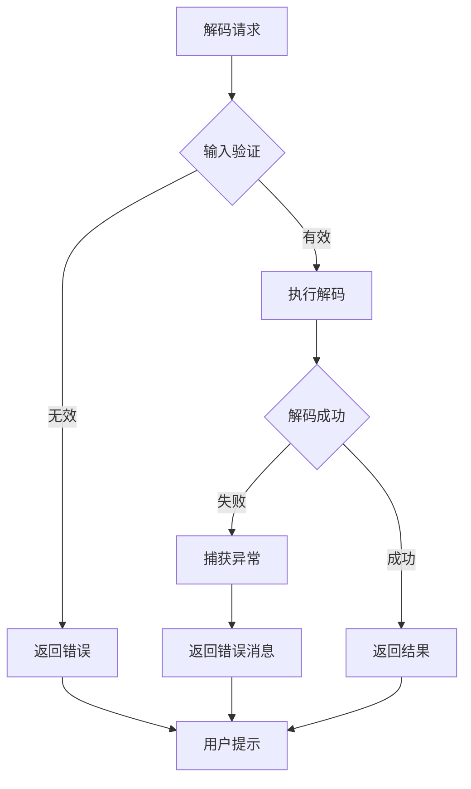

# URL编码工具

<cite>
**本文档中引用的文件**
- [index.ts](file://src/tools/developer/url-encoder/index.ts)
- [logic.ts](file://src/tools/developer/url-encoder/logic.ts)
- [UrlEncoder.tsx](file://src/tools/developer/url-encoder/UrlEncoder.tsx)
- [tools-developer.json](file://messages/zh-Hans/tools-developer.json)
- [README.md](file://README.md)
</cite>

## 目录
1. [简介](#简介)
2. [项目结构](#项目结构)
3. [核心组件](#核心组件)
4. [架构概览](#架构概览)
5. [详细组件分析](#详细组件分析)
6. [编码标准与规范](#编码标准与规范)
7. [使用场景与应用](#使用场景与应用)
8. [与其他编码工具的对比](#与其他编码工具的对比)
9. [性能考虑](#性能考虑)
10. [故障排除指南](#故障排除指南)
11. [结论](#结论)

## 简介

URL编码工具是PrivaDeck项目中的一个重要开发者工具，专门用于处理URL中的特殊字符编码和解码。该工具基于RFC 3986标准，提供了完整的URL编码解决方案，支持百分号编码和Unicode转义处理，确保在Web开发中URL的安全使用。

PrivaDeck是一个隐私优先的浏览器端工具箱，所有文件处理均在本地完成，零上传、零服务器。该项目包含60个工具，覆盖图片、视频、音频、PDF、开发者五大分类，支持21种语言，采用Next.js 16框架构建。

## 项目结构

URL编码工具位于开发者工具分类下，采用模块化设计，包含以下核心文件：



**图表来源**
- [index.ts:1-37](file://src/tools/developer/url-encoder/index.ts#L1-L37)
- [UrlEncoder.tsx:1-61](file://src/tools/developer/url-encoder/UrlEncoder.tsx#L1-L61)

**章节来源**
- [README.md:55-78](file://README.md#L55-L78)

## 核心组件

URL编码工具由三个主要组件构成：

### 1. 工具定义模块
负责工具的元数据配置、SEO设置和FAQ配置。

### 2. 核心逻辑模块
提供四种基础编码解码函数：
- `encodeUrl()`: 完整URL编码
- `decodeUrl()`: 完整URL解码  
- `encodeUrlComponent()`: URL组件编码
- `decodeUrlComponent()`: URL组件解码

### 3. 用户界面组件
基于React的客户端组件，提供直观的用户界面和实时反馈。

**章节来源**
- [index.ts:1-37](file://src/tools/developer/url-encoder/index.ts#L1-L37)
- [logic.ts:1-32](file://src/tools/developer/url-encoder/logic.ts#L1-L32)
- [UrlEncoder.tsx:1-61](file://src/tools/developer/url-encoder/UrlEncoder.tsx#L1-L61)

## 架构概览

URL编码工具采用分层架构设计，确保代码的可维护性和扩展性：



**图表来源**
- [UrlEncoder.tsx:9-14](file://src/tools/developer/url-encoder/UrlEncoder.tsx#L9-L14)
- [logic.ts:1-32](file://src/tools/developer/url-encoder/logic.ts#L1-L32)

## 详细组件分析

### 核心逻辑函数分析

#### 编码函数实现


**图表来源**
- [logic.ts:1-7](file://src/tools/developer/url-encoder/logic.ts#L1-L7)

#### 解码函数实现



**图表来源**
- [logic.ts:9-15](file://src/tools/developer/url-encoder/logic.ts#L9-L15)

**章节来源**
- [logic.ts:1-32](file://src/tools/developer/url-encoder/logic.ts#L1-L32)

### 用户界面组件分析

#### 组件架构设计



**图表来源**
- [UrlEncoder.tsx:16-60](file://src/tools/developer/url-encoder/UrlEncoder.tsx#L16-L60)

#### 用户交互流程



**图表来源**
- [UrlEncoder.tsx:32-41](file://src/tools/developer/url-encoder/UrlEncoder.tsx#L32-L41)
- [logic.ts:1-7](file://src/tools/developer/url-encoder/logic.ts#L1-L7)

**章节来源**
- [UrlEncoder.tsx:1-61](file://src/tools/developer/url-encoder/UrlEncoder.tsx#L1-L61)

## 编码标准与规范

### RFC 3986标准详解

URL编码严格遵循RFC 3986标准，该标准定义了统一资源标识符的语法和编码规则。

#### 保留字符分类

根据RFC 3986，URL中的字符分为以下几类：

| 字符类别 | 示例 | 说明 |
|---------|------|------|
| **不安全字符** | ` ` `"` `#` `$` `%` `&` `'` `(` `)` | 可能导致URL解析歧义的字符 |
| **保留字符** | `:` `/` `?` `#` `[` `]` `@` `!` `$` `&` `'` `(` `)` `*` `+` `,` `;` `=` | 用于分隔URL的不同部分 |
| **安全字符** | `A-Z` `a-z` `0-9` `-` `_` `.` `~` | 默认不需要编码的字符 |

#### 编码级别对比

| 编码级别 | 函数 | 适用场景 | 编码范围 |
|---------|------|----------|----------|
| **完整URL编码** | `encodeURI()` | 整个URL地址 | 保留结构字符 |
| **URL组件编码** | `encodeURIComponent()` | 查询参数、路径段 | 所有字符 |
| **完整URL解码** | `decodeURI()` | 解码完整URL | 结构字符保留 |
| **URL组件解码** | `decodeURIComponent()` | 解码参数值 | 所有字符 |

#### UTF-8编码处理

URL编码工具正确处理UTF-8字符，包括：
- 中文字符（如：你好世界）
- 日文字符（如：こんにちは）
- 韩文字符（如：안녕하세요）
- 表情符号（如：😀😃😄）
- 其他Unicode字符

**章节来源**
- [logic.ts:1-32](file://src/tools/developer/url-encoder/logic.ts#L1-L32)

## 使用场景与应用

### Web开发应用场景

#### 1. 查询参数构建
```javascript
// 错误做法 - 直接拼接
const url = "https://api.example.com/search?q=你好世界&category=技术";

// 正确做法 - 使用URL编码
const searchTerm = "你好世界";
const encodedTerm = encodeURIComponent(searchTerm);
const url = `https://api.example.com/search?q=${encodedTerm}&category=技术`;
```

#### 2. API调用
```javascript
// 处理包含特殊字符的API参数
const params = {
  name: "张三",
  email: "zhang.san@example.com",
  message: "Hello 世界!"
};

const queryString = Object.entries(params)
  .map(([key, value]) => `${key}=${encodeURIComponent(value)}`)
  .join('&');
```

#### 3. 表单提交


### SEO优化应用

#### 1. URL规范化
- 统一URL格式，避免重复内容
- 处理特殊字符，确保搜索引擎友好
- 保持URL简洁，提升用户体验

#### 2. 跨平台兼容性
- 确保URL在不同浏览器中的兼容性
- 处理不同操作系统下的字符编码差异
- 支持国际化域名（IDN）

#### 3. 国际化支持
```javascript
// 处理多语言URL
const translations = {
  zh: "https://example.com/产品/手机",
  en: "https://example.com/products/phone",
  ja: "https://example.com/製品/携帯電話"
};

// 自动根据用户语言选择合适的URL
const userLang = navigator.language;
const encodedURL = encodeURIComponent(translations[userLang]);
```

**章节来源**
- [tools-developer.json:121-142](file://messages/zh-Hans/tools-developer.json#L121-L142)

## 与其他编码工具的对比

### 与HTML编码对比

| 特性 | URL编码 | HTML编码 | Base64编码 |
|------|---------|----------|------------|
| **目的** | URL安全传输 | HTML内容显示 | 数据二进制编码 |
| **字符集** | ASCII + 百分号 | HTML特殊字符 | 64个字符集 |
| **应用场景** | 网址参数 | HTML标签内容 | 数据传输 |
| **可读性** | 部分可读 | 完全可读 | 不可读 |
| **体积** | 增加15-30% | 增加20-40% | 增加33% |

### 与JavaScript编码对比



### 与Python编码对比

| Python方法 | URL编码 | Base64 | JSON |
|------------|---------|--------|------|
| **urllib.parse.quote** | ✅ | ❌ | ❌ |
| **urllib.parse.quote_plus** | ✅ | ❌ | ❌ |
| **base64.b64encode** | ❌ | ✅ | ❌ |
| **json.dumps** | ❌ | ❌ | ✅ |

**章节来源**
- [tools-developer.json:130-132](file://messages/zh-Hans/tools-developer.json#L130-L132)

## 性能考虑

### 浏览器兼容性

URL编码工具基于JavaScript原生API，具有以下性能特点：

#### 1. 内存效率
- 使用原生字符串处理，避免额外的DOM操作
- 实时编码，无需中间缓冲区
- 错误处理采用异常机制，减少分支判断

#### 2. 处理速度
- 基于浏览器内置的V8引擎优化
- 支持大文本处理（理论上无上限）
- 实时反馈，用户体验流畅

#### 3. 资源占用
- 无外部依赖，减少HTTP请求
- 代码体积小，加载速度快
- 本地处理，无网络延迟

### 优化建议

1. **批量处理**：对于大量数据，考虑分批处理以避免长时间阻塞
2. **缓存策略**：对相同输入的编码结果进行缓存
3. **防抖处理**：在实时预览场景中使用防抖减少频繁计算

## 故障排除指南

### 常见问题及解决方案

#### 1. 编码错误处理


#### 2. 解码错误处理



#### 3. 错误类型对照

| 错误类型 | 触发条件 | 解决方案 |
|----------|----------|----------|
| **无效编码** | 输入包含非法字符 | 检查输入格式，使用正确的编码函数 |
| **解码失败** | 输入不是有效的编码字符串 | 验证编码来源，检查编码完整性 |
| **内存不足** | 处理超大文本 | 分批处理或使用流式处理 |
| **浏览器兼容** | 旧版浏览器不支持 | 提供降级方案或提示升级 |

**章节来源**
- [logic.ts:1-32](file://src/tools/developer/url-encoder/logic.ts#L1-L32)

## 结论

URL编码工具作为PrivaDeck项目的重要组成部分，展现了现代Web开发中隐私保护和用户体验的最佳实践。该工具不仅提供了完整的URL编码解码功能，更重要的是体现了以下核心价值：

### 技术优势

1. **隐私优先**：所有处理均在浏览器本地完成，数据永不离开用户设备
2. **标准化实现**：严格遵循RFC 3986标准，确保编码的正确性和一致性
3. **多语言支持**：支持21种语言，体现全球化设计理念
4. **实时反馈**：提供即时的编码解码结果，提升用户体验

### 应用价值

1. **Web开发必备**：解决URL编码这一Web开发的基础问题
2. **SEO优化工具**：帮助开发者构建搜索引擎友好的URL结构
3. **国际化支持**：正确处理多语言字符，支持全球化应用
4. **隐私保护**：符合现代Web应用对数据隐私的要求

### 发展前景

随着Web应用的不断发展，URL编码工具将继续演进，可能的方向包括：
- 更智能的编码建议
- 批量处理功能
- 编码历史记录
- 与其他开发工具的集成

URL编码工具不仅是PrivaDeck项目的技术亮点，更是现代Web开发工具箱中不可或缺的重要组件。