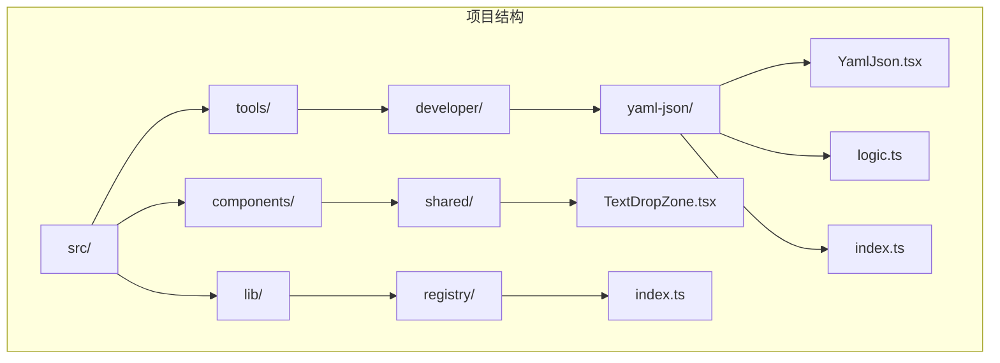
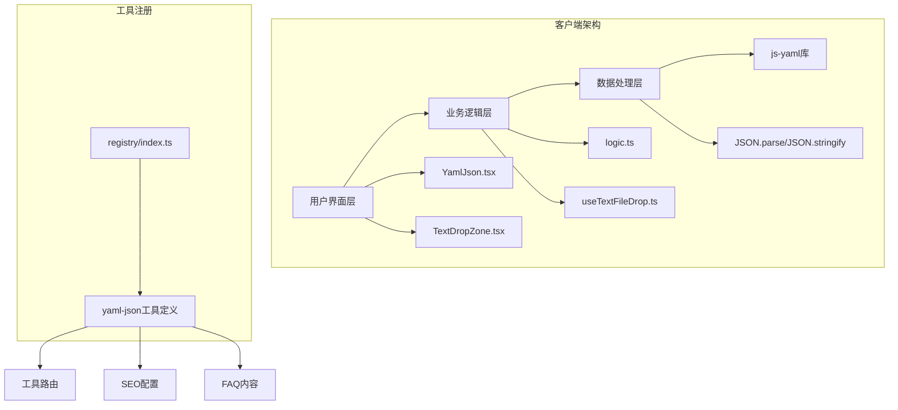
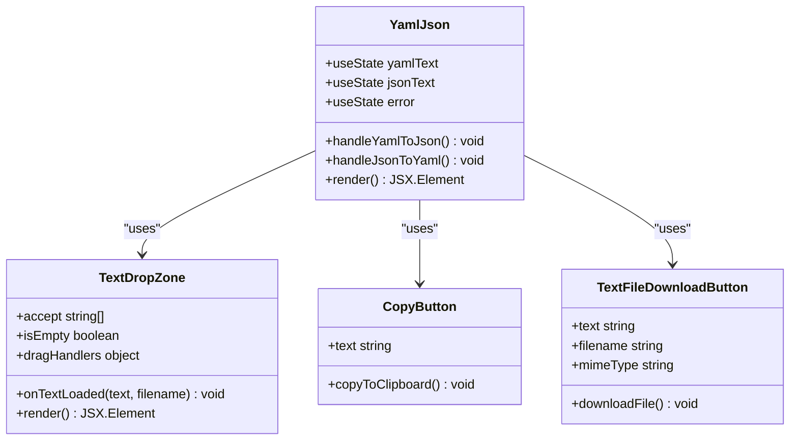
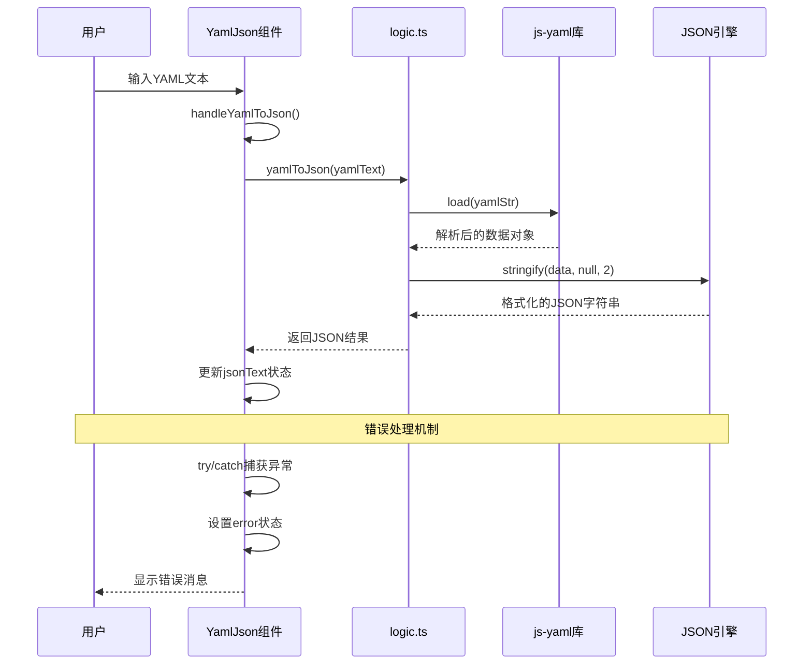
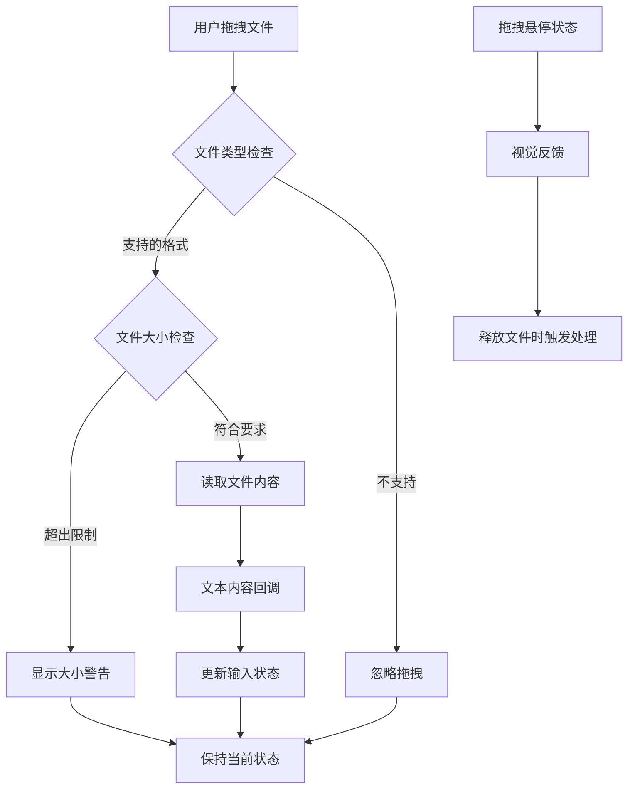
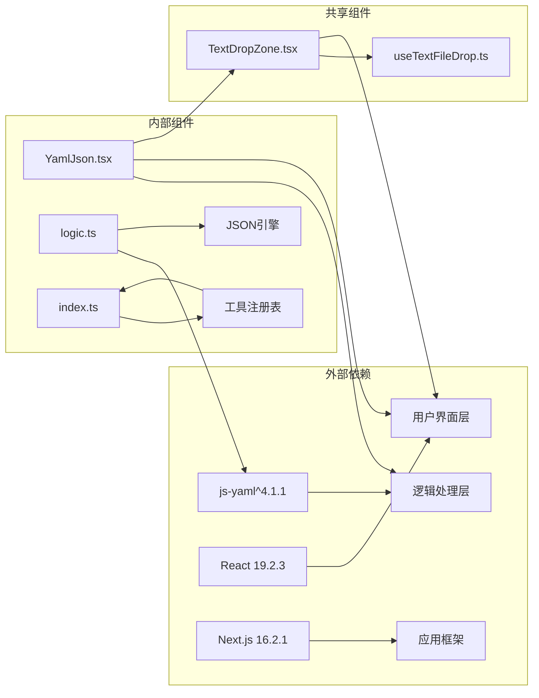

# YAML转JSON工具

<cite>
**本文档引用的文件**
- [YamlJson.tsx](file://src/tools/developer/yaml-json/YamlJson.tsx)
- [logic.ts](file://src/tools/developer/yaml-json/logic.ts)
- [index.ts](file://src/tools/developer/yaml-json/index.ts)
- [package.json](file://package.json)
- [TextDropZone.tsx](file://src/components/shared/TextDropZone.tsx)
- [useTextFileDrop.ts](file://src/hooks/useTextFileDrop.ts)
- [README.md](file://README.md)
- [messages/en/tools-developer.json](file://messages/en/tools-developer.json)
- [messages/zh-Hans/tools-developer.json](file://messages/zh-Hans/tools-developer.json)
- [src/lib/registry/index.ts](file://src/lib/registry/index.ts)
</cite>

## 目录
1. [简介](#简介)
2. [项目结构](#项目结构)
3. [核心组件](#核心组件)
4. [架构概览](#架构概览)
5. [详细组件分析](#详细组件分析)
6. [依赖关系分析](#依赖关系分析)
7. [性能考虑](#性能考虑)
8. [故障排除指南](#故障排除指南)
9. [结论](#结论)
10. [附录](#附录)

## 简介

YAML转JSON工具是PrivaDeck媒体工具箱中的一个核心开发者工具，专门用于在YAML和JSON两种数据格式之间进行双向转换。该工具采用浏览器端处理架构，确保用户数据的隐私性和安全性，所有转换过程都在用户的本地设备上完成，无需上传到任何服务器。

该工具支持完整的YAML语法特性，包括嵌套对象、数组、多行字符串、锚点引用等标准YAML功能，同时提供直观的用户界面和强大的错误处理机制。工具特别适用于DevOps场景，如Kubernetes配置管理、Docker Compose文件处理、CI/CD流水线配置转换等。

## 项目结构

PrivaDeck是一个基于Next.js 16的应用程序，采用模块化的工具组织结构。YAML转JSON工具位于开发者工具类别下，与其他开发者工具如JSON格式化器、Base64编码器等共同构成完整的开发者工具集。

**图表来源**
- [YamlJson.tsx:1-102](file://src/tools/developer/yaml-json/YamlJson.tsx#L1-L102)
- [index.ts:1-37](file://src/tools/developer/yaml-json/index.ts#L1-L37)
- [src/lib/registry/index.ts:1-164](file://src/lib/registry/index.ts#L1-L164)

**章节来源**
- [README.md:55-78](file://README.md#L55-L78)
- [src/lib/registry/index.ts:61-127](file://src/lib/registry/index.ts#L61-L127)

## 核心组件

YAML转JSON工具由三个主要组件构成：用户界面组件、逻辑处理组件和工具定义组件。

### 用户界面组件 (YamlJson.tsx)

用户界面组件负责提供直观的双栏布局，左侧显示YAML输入区域，右侧显示JSON输出区域。组件实现了完整的拖拽文件支持、文本复制功能和文件下载功能。

### 逻辑处理组件 (logic.ts)

逻辑处理组件封装了实际的转换功能，使用js-yaml库进行YAML解析和JSON序列化。该组件提供了两个核心函数：`yamlToJson`和`jsonToYaml`，分别处理双向转换。

### 工具定义组件 (index.ts)

工具定义组件描述了整个工具的元数据，包括工具标识符、分类、图标、SEO配置和FAQ内容。该组件还定义了相关工具的关联关系。

**章节来源**
- [YamlJson.tsx:11-102](file://src/tools/developer/yaml-json/YamlJson.tsx#L11-L102)
- [logic.ts:1-12](file://src/tools/developer/yaml-json/logic.ts#L1-L12)
- [index.ts:3-36](file://src/tools/developer/yaml-json/index.ts#L3-L36)

## 架构概览

该工具采用客户端单页应用程序架构，所有处理逻辑都在浏览器端执行。系统架构分为表示层、业务逻辑层和数据处理层三个层次。

**图表来源**
- [YamlJson.tsx:1-102](file://src/tools/developer/yaml-json/YamlJson.tsx#L1-L102)
- [logic.ts:1-12](file://src/tools/developer/yaml-json/logic.ts#L1-L12)
- [TextDropZone.tsx:1-45](file://src/components/shared/TextDropZone.tsx#L1-L45)
- [useTextFileDrop.ts:1-75](file://src/hooks/useTextFileDrop.ts#L1-L75)
- [src/lib/registry/index.ts:61-127](file://src/lib/registry/index.ts#L61-L127)

## 详细组件分析

### 用户界面组件架构

用户界面组件采用React函数式组件设计，使用状态管理来处理输入输出数据和错误状态。组件实现了响应式布局，支持移动端和桌面端的适配。

**图表来源**
- [YamlJson.tsx:11-102](file://src/tools/developer/yaml-json/YamlJson.tsx#L11-L102)
- [TextDropZone.tsx:8-45](file://src/components/shared/TextDropZone.tsx#L8-L45)

### 数据处理流程

数据处理流程展示了YAML和JSON之间的双向转换过程，包括错误处理和用户反馈机制。

**图表来源**
- [YamlJson.tsx:17-35](file://src/tools/developer/yaml-json/YamlJson.tsx#L17-L35)
- [logic.ts:3-6](file://src/tools/developer/yaml-json/logic.ts#L3-L6)

### 文件拖拽处理机制

文件拖拽功能提供了便捷的文件导入方式，支持多种文本格式的文件拖放操作。

**图表来源**
- [useTextFileDrop.ts:47-68](file://src/hooks/useTextFileDrop.ts#L47-L68)
- [TextDropZone.tsx:22-43](file://src/components/shared/TextDropZone.tsx#L22-L43)

**章节来源**
- [YamlJson.tsx:17-35](file://src/tools/developer/yaml-json/YamlJson.tsx#L17-L35)
- [TextDropZone.tsx:18-43](file://src/components/shared/TextDropZone.tsx#L18-L43)
- [useTextFileDrop.ts:12-68](file://src/hooks/useTextFileDrop.ts#L12-L68)

## 依赖关系分析

YAML转JSON工具的依赖关系相对简单，主要依赖于js-yaml库进行YAML解析和JSON引擎进行数据序列化。

**图表来源**
- [package.json:19-20](file://package.json#L19-L20)
- [YamlJson.tsx:3-9](file://src/tools/developer/yaml-json/YamlJson.tsx#L3-L9)
- [logic.ts:1](file://src/tools/developer/yaml-json/logic.ts#L1)

### 核心依赖分析

工具的核心依赖包括：
- **js-yaml**: 提供YAML解析和序列化功能
- **React**: 支持组件化用户界面开发
- **Next.js**: 提供SSG静态生成和国际化支持

这些依赖的选择体现了工具的设计原则：轻量级、可靠性和易维护性。

**章节来源**
- [package.json:11-32](file://package.json#L11-L32)
- [src/lib/registry/index.ts:61-127](file://src/lib/registry/index.ts#L61-L127)

## 性能考虑

YAML转JSON工具在性能方面采用了多项优化策略，确保在各种设备上都能提供流畅的用户体验。

### 内存管理策略

- **流式处理**: 对于大型文件，采用流式处理避免内存溢出
- **及时清理**: 组件卸载时清理事件监听器和定时器
- **状态优化**: 使用React.memo和useCallback优化重渲染

### 处理效率优化

- **异步处理**: 所有转换操作都是异步执行，避免阻塞UI线程
- **增量更新**: 输入变更时立即触发转换，提供即时反馈
- **缓存机制**: 对于重复的转换操作，考虑实现简单的缓存策略

### 错误处理机制

工具实现了多层次的错误处理机制：
- **语法错误**: 捕获YAML/JSON解析错误并提供详细的错误信息
- **格式错误**: 处理不兼容的数据类型转换
- **用户错误**: 提供友好的错误提示和恢复建议

**章节来源**
- [YamlJson.tsx:17-35](file://src/tools/developer/yaml-json/YamlJson.tsx#L17-L35)
- [logic.ts:3-11](file://src/tools/developer/yaml-json/logic.ts#L3-L11)

## 故障排除指南

### 常见问题及解决方案

#### YAML语法错误
**问题**: 转换过程中出现YAML语法错误
**原因**: 缩进不正确、特殊字符未转义、数据类型不匹配
**解决方案**: 
- 检查YAML缩进一致性（使用空格而非制表符）
- 确保特殊字符正确转义
- 验证数据类型的有效性

#### JSON格式错误
**问题**: JSON转换失败或输出格式不正确
**原因**: 包含不可序列化的JavaScript对象
**解决方案**:
- 确保数据结构只包含可序列化类型
- 移除函数、Symbol等不可序列化属性
- 检查循环引用问题

#### 性能问题
**问题**: 大文件处理缓慢或内存不足
**原因**: 文件过大超出浏览器内存限制
**解决方案**:
- 分割大文件进行处理
- 使用流式处理技术
- 考虑分批处理策略

### 调试技巧

- **启用开发者工具**: 使用浏览器开发者工具监控内存使用情况
- **日志记录**: 在开发环境中添加详细的日志输出
- **单元测试**: 为关键转换逻辑编写测试用例

**章节来源**
- [YamlJson.tsx:22-24](file://src/tools/developer/yaml-json/YamlJson.tsx#L22-L24)
- [messages/en/tools-developer.json:577-586](file://messages/en/tools-developer.json#L577-L586)

## 结论

YAML转JSON工具是一个设计精良、功能完善的浏览器端数据格式转换工具。它成功地平衡了功能完整性、用户体验和性能优化，为开发者提供了可靠的YAML和JSON格式转换解决方案。

工具的主要优势包括：
- **隐私保护**: 所有处理都在本地完成，确保数据安全
- **功能完整**: 支持完整的YAML语法特性
- **用户友好**: 直观的界面设计和丰富的交互功能
- **国际化支持**: 支持21种语言的本地化
- **性能优化**: 采用多项优化策略确保流畅体验

该工具在DevOps、配置管理和API开发等领域具有广泛的应用价值，是现代软件开发工作流程中的重要工具。

## 附录

### 使用示例

#### 基本转换流程
1. 在左侧YAML输入区域粘贴或拖拽YAML文件
2. 点击"YAML → JSON"按钮进行转换
3. 在右侧JSON输出区域查看结果
4. 使用复制或下载功能保存转换结果

#### 复杂数据类型处理
- **嵌套对象**: 支持任意深度的对象嵌套
- **数组结构**: 正确处理混合类型的数组
- **多行字符串**: 保持原始格式和换行符
- **特殊字符**: 自动处理转义序列

### 配置管理应用场景

#### Kubernetes配置
- 将YAML格式的Kubernetes资源配置转换为JSON格式
- 便于API调用和程序化处理
- 支持复杂的资源配置和验证

#### Docker Compose
- 转换Docker Compose文件格式
- 支持服务配置、网络设置和卷挂载
- 便于容器编排和部署

#### CI/CD流水线
- GitHub Actions YAML配置转换
- GitLab CI配置格式转换
- 支持复杂的流水线定义和参数传递

### 最佳实践建议

1. **数据备份**: 在进行重要转换前备份原始数据
2. **格式验证**: 转换后验证输出格式的正确性
3. **性能监控**: 关注大文件处理的性能表现
4. **错误预防**: 预先检查数据格式的兼容性