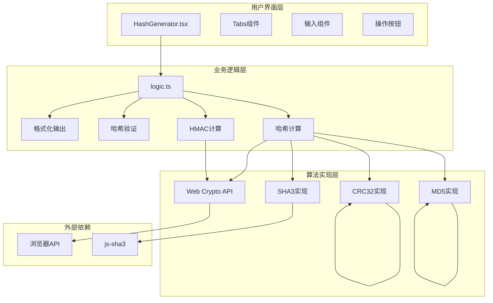
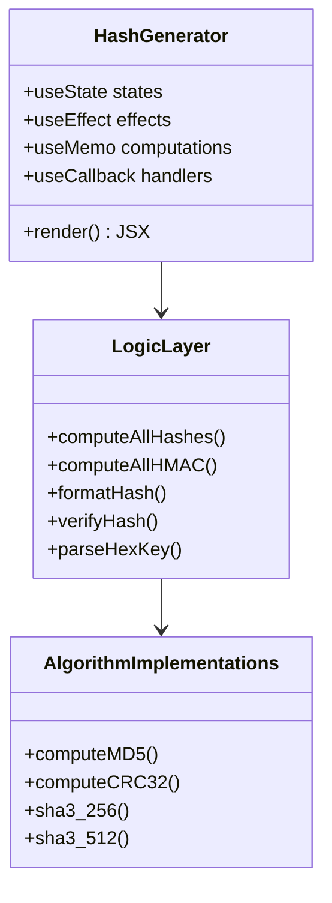
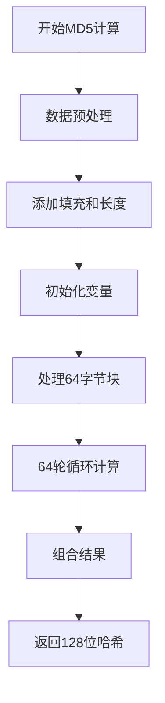
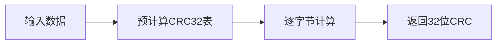
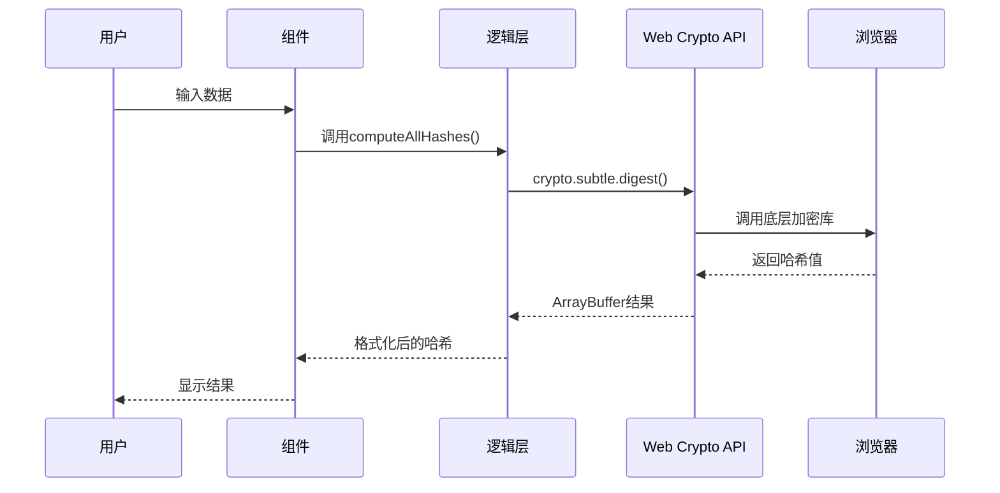
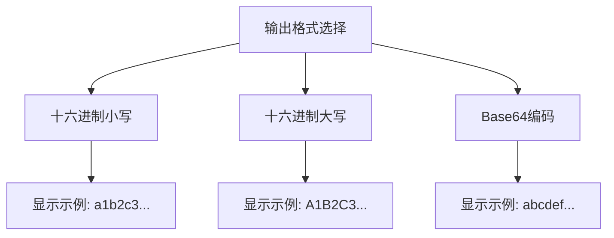

# 哈希生成工具

<cite>
**本文引用的文件**
- [HashGenerator.tsx](file://src/tools/developer/hash-generator/HashGenerator.tsx)
- [logic.ts](file://src/tools/developer/hash-generator/logic.ts)
- [index.ts](file://src/tools/developer/hash-generator/index.ts)
- [md5.ts](file://src/tools/developer/hash-generator/md5.ts)
- [crc32.ts](file://src/tools/developer/hash-generator/crc32.ts)
- [package.json](file://package.json)
</cite>

## 更新摘要
**变更内容**
- 新增MD5和CRC32哈希算法支持，扩展了原有的哈希生成功能
- 新增纯JavaScript加密库，支持MD5和CRC32算法的浏览器端实现
- 扩展算法支持列表，现在包含8种不同的哈希算法
- 更新算法安全性分析和最佳实践指南

## 目录
1. [简介](#简介)
2. [新架构概览](#新架构概览)
3. [支持的算法与功能](#支持的算法与功能)
4. [核心组件分析](#核心组件分析)
5. [算法实现详解](#算法实现详解)
6. [用户界面设计](#用户界面设计)
7. [性能优化策略](#性能优化策略)
8. [安全考虑](#安全考虑)
9. [使用场景与最佳实践](#使用场景与最佳实践)
10. [故障排查指南](#故障排查指南)

## 简介
哈希生成工具是一个功能强大的在线哈希计算工具，现已升级为支持多种加密算法的综合解决方案。该工具提供MD5、SHA-1、SHA-256、SHA-512、SHA3-256、SHA3-512、CRC32等八种算法的实时计算能力，支持HMAC认证、批量文件处理、哈希验证和多种输出格式。所有计算均在浏览器端完成，确保数据隐私和离线可用性。

## 新架构概览
工具采用现代化的模块化架构，集成了多种算法实现和用户交互功能：

**图表来源**
- [HashGenerator.tsx:26-515](file://src/tools/developer/hash-generator/HashGenerator.tsx#L26-L515)
- [logic.ts:41-167](file://src/tools/developer/hash-generator/logic.ts#L41-L167)

## 支持的算法与功能

### 加密算法支持
工具支持以下八种加密算法，每种算法都有其特定的应用场景：

| 算法 | 输出长度 | 主要用途 | 安全性等级 |
|------|----------|----------|------------|
| MD5 | 128位 | 文件校验、快速校验 | 低（已不安全） |
| SHA-1 | 160位 | 数字签名、证书 | 中（存在碰撞风险） |
| SHA-256 | 256位 | 密码存储、数字签名 | 高 |
| SHA-384 | 384位 | 高安全性场景 | 非常高 |
| SHA-512 | 512位 | 最高安全性需求 | 非常高 |
| SHA3-256 | 256位 | 新一代SHA3算法 | 高 |
| SHA3-512 | 512位 | 新一代SHA3算法 | 非常高 |
| CRC32 | 32位 | 数据校验、错误检测 | 低（仅用于校验） |

### 核心功能特性
- **实时哈希计算**：文本输入时自动计算，支持150ms防抖延迟
- **批量文件处理**：支持多文件同时处理，显示进度条
- **HMAC认证**：支持密钥认证的哈希计算
- **哈希验证**：自动比对预期哈希值
- **多种输出格式**：十六进制（大小写）、Base64
- **复制全部功能**：一键复制所有计算结果

**章节来源**
- [logic.ts:9-35](file://src/tools/developer/hash-generator/logic.ts#L9-L35)
- [HashGenerator.tsx:212-227](file://src/tools/developer/hash-generator/HashGenerator.tsx#L212-L227)

## 核心组件分析

### 主要组件架构
工具采用React Hooks和现代前端开发模式，主要组件包括：

**图表来源**
- [HashGenerator.tsx:26-515](file://src/tools/developer/hash-generator/HashGenerator.tsx#L26-L515)
- [logic.ts:64-167](file://src/tools/developer/hash-generator/logic.ts#L64-L167)

### 状态管理设计
组件使用多个useState钩子管理复杂的状态：

- **输入状态**：`inputMode`、`text`、`files`
- **计算模式**：`computeMode`、`hmacKey`、`hmacKeyFormat`
- **输出状态**：`outputFormat`、`rawResults`、`fileResults`
- **处理状态**：`processing`、`fileProgress`、`error`
- **验证状态**：`expectedHash`
- **交互状态**：`debounceRef`、`copiedAll`

**章节来源**
- [HashGenerator.tsx:29-56](file://src/tools/developer/hash-generator/HashGenerator.tsx#L29-L56)

## 算法实现详解

### 纯JavaScript算法实现
对于浏览器Web Crypto API不支持的算法，工具提供了纯JavaScript实现：

#### MD5算法实现

**图表来源**
- [md5.ts:7-89](file://src/tools/developer/hash-generator/md5.ts#L7-L89)

#### CRC32算法实现
使用预计算查找表优化性能：

**图表来源**
- [crc32.ts:6-27](file://src/tools/developer/hash-generator/crc32.ts#L6-L27)

### Web Crypto API集成
对于SHA系列算法，工具直接使用浏览器原生API：

**图表来源**
- [logic.ts:59-61](file://src/tools/developer/hash-generator/logic.ts#L59-L61)

**章节来源**
- [md5.ts:1-94](file://src/tools/developer/hash-generator/md5.ts#L1-L94)
- [crc32.ts:1-28](file://src/tools/developer/hash-generator/crc32.ts#L1-L28)
- [logic.ts:41-62](file://src/tools/developer/hash-generator/logic.ts#L41-L62)

## 用户界面设计

### 交互模式设计
工具提供两种主要输入模式：

#### 文本模式
- 实时哈希计算，支持150ms防抖延迟
- 支持拖拽文件到文本区域
- 自动检测输入变化并更新结果

#### 文件模式
- 支持单个和批量文件处理
- 实时进度显示，支持大文件处理
- 文件列表显示，包含文件大小信息

### 输出格式选项
用户可以选择三种输出格式：

**图表来源**
- [HashGenerator.tsx:360-385](file://src/tools/developer/hash-generator/HashGenerator.tsx#L360-L385)

### 高级功能界面
#### HMAC模式
- 秘密密钥输入框
- 支持UTF-8和Hex格式密钥
- 自动密钥格式检测

#### 哈希验证
- 预期哈希值输入
- 实时匹配结果显示
- 成功/失败状态指示

**章节来源**
- [HashGenerator.tsx:230-263](file://src/tools/developer/hash-generator/HashGenerator.tsx#L230-L263)
- [HashGenerator.tsx:480-512](file://src/tools/developer/hash-generator/HashGenerator.tsx#L480-L512)

## 性能优化策略

### 实时计算优化
- **防抖机制**：150ms延迟避免频繁计算
- **并行处理**：Promise.all同时计算所有算法
- **内存管理**：及时清理定时器和事件监听器

### 大文件处理优化
- **分步读取**：FileReader进度回调
- **增量显示**：逐步更新处理进度
- **错误恢复**：单个文件失败不影响整体流程

### 算法选择优化
- **原生API优先**：SHA算法使用Web Crypto API
- **JavaScript实现**：MD5、CRC32、SHA3使用优化实现
- **硬件加速**：充分利用浏览器硬件加密支持

**章节来源**
- [HashGenerator.tsx:61-85](file://src/tools/developer/hash-generator/HashGenerator.tsx#L61-L85)
- [HashGenerator.tsx:101-131](file://src/tools/developer/hash-generator/HashGenerator.tsx#L101-L131)

## 安全考虑

### 算法安全性分析
不同算法的安全性等级和适用场景：

| 算法 | 安全性等级 | 推荐用途 | 不推荐用途 |
|------|------------|----------|------------|
| MD5 | 低 | 文件校验、快速校验 | 密码存储、数字签名 |
| SHA-1 | 中 | 旧系统兼容 | 新系统开发 |
| SHA-256 | 高 | 密码存储、数字签名 | - |
| SHA-384 | 非常高 | 高安全性需求 | - |
| SHA-512 | 非常高 | 最高安全性需求 | - |
| SHA3-256 | 高 | 新一代应用 | - |
| SHA3-512 | 非常高 | 新一代应用 | - |
| CRC32 | 低 | 数据校验 | 安全应用 |

### 安全最佳实践
- **密码存储**：使用专用密码学算法（bcrypt、scrypt、Argon2）
- **HMAC使用**：为API认证和数据完整性保护
- **密钥管理**：HMAC密钥应妥善保管，定期轮换
- **算法选择**：根据安全需求选择合适的算法

**章节来源**
- [tools-developer.json:428-433](file://messages/en/tools-developer.json#L428-L433)

## 使用场景与最佳实践

### 常见应用场景
1. **文件完整性验证**
   - 下载后比对官方提供的哈希值
   - 软件发布包验证
   - 数据传输完整性检查

2. **内容去重**
   - 基于哈希值识别重复文件
   - 存储空间优化
   - 数据同步去重

3. **API认证**
   - HMAC签名生成
   - 请求完整性验证
   - 防重放攻击

4. **数字签名**
   - 文档完整性保护
   - 软件发布验证
   - 合同电子签名

### 算法选择指南
- **一般文件校验**：SHA-256或SHA-512
- **高安全性需求**：SHA-384或SHA-512
- **向后兼容**：SHA-1（仅限兼容性）
- **快速校验**：MD5（仅限非安全场景）
- **数据校验**：CRC32（仅限错误检测）

**章节来源**
- [tools-developer.json:481-488](file://messages/en/tools-developer.json#L481-L488)

## 故障排查指南

### 常见问题及解决方案

#### 计算问题
- **"无法计算"或空白结果**：检查输入是否有效（文本非空或已选择文件）
- **"处理中"按钮不可用**：确认计算流程未处于并发状态
- **算法计算失败**：检查浏览器是否支持相应算法

#### 文件处理问题
- **大文件处理缓慢**：检查系统内存和浏览器性能
- **文件读取失败**：确认文件权限和浏览器支持
- **批量处理中断**：单个文件失败不影响其他文件

#### 输出格式问题
- **哈希值格式异常**：检查输出格式设置
- **Base64解码错误**：确认使用正确的解码方法
- **十六进制大小写问题**：根据需要调整格式设置

### 性能优化建议
- **实时计算**：合理设置防抖延迟时间
- **批量处理**：分批处理大文件集合
- **内存管理**：及时释放不再使用的数据
- **缓存策略**：复用计算结果减少重复计算

**章节来源**
- [HashGenerator.tsx:350-355](file://src/tools/developer/hash-generator/HashGenerator.tsx#L350-L355)
- [tools-developer.json:426-427](file://messages/en/tools-developer.json#L426-L427)