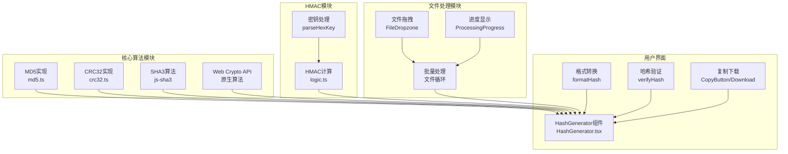
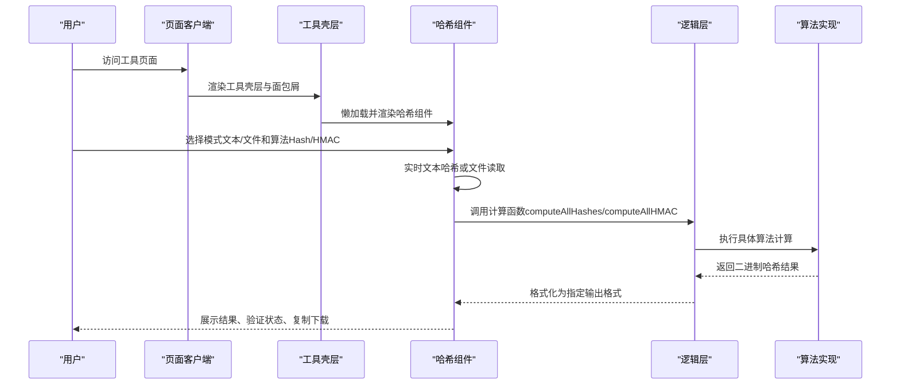
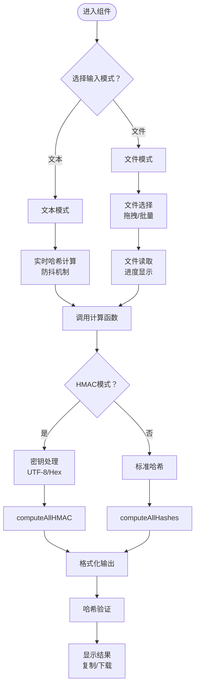
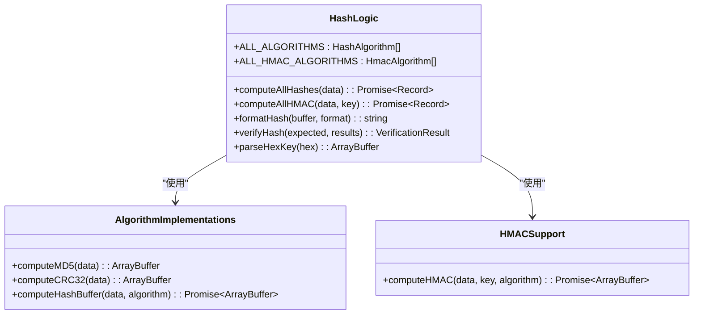
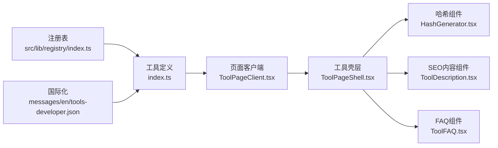
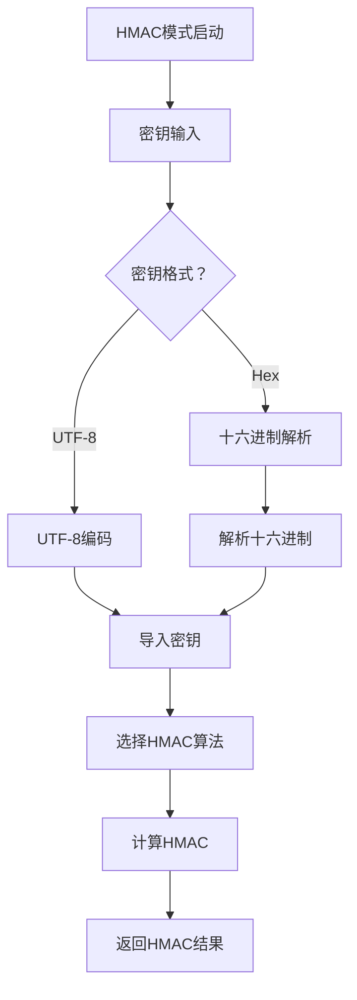
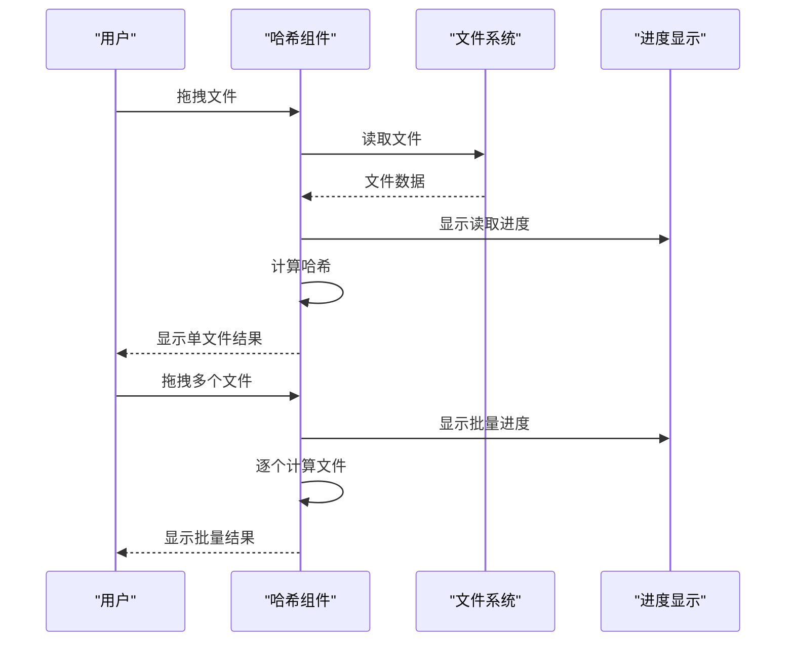
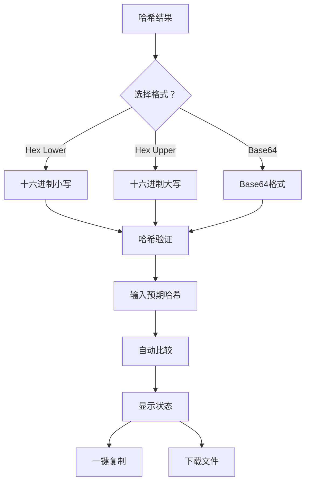
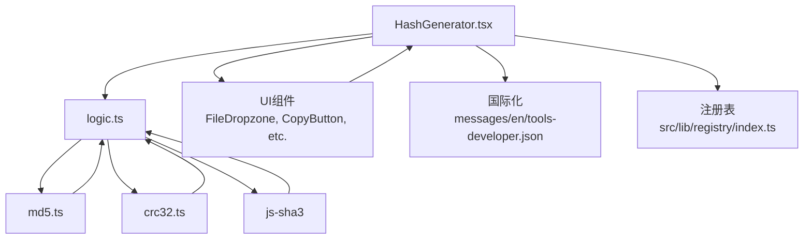

# 哈希生成工具

<cite>
**本文引用的文件**
- [README.md](file://README.md)
- [src/tools/developer/hash-generator/HashGenerator.tsx](file://src/tools/developer/hash-generator/HashGenerator.tsx)
- [src/tools/developer/hash-generator/logic.ts](file://src/tools/developer/hash-generator/logic.ts)
- [src/tools/developer/hash-generator/index.ts](file://src/tools/developer/hash-generator/index.ts)
- [src/tools/developer/hash-generator/md5.ts](file://src/tools/developer/hash-generator/md5.ts)
- [src/tools/developer/hash-generator/crc32.ts](file://src/tools/developer/hash-generator/crc32.ts)
- [messages/en/tools-developer.json](file://messages/en/tools-developer.json)
- [src/lib/registry/index.ts](file://src/lib/registry/index.ts)
- [src/components/tool/ToolPageShell.tsx](file://src/components/tool/ToolPageShell.tsx)
- [src/app/[locale]/tools/[category]/[slug]/ToolPageClient.tsx](file://src/app/[locale]/tools/[category]/[slug]/ToolPageClient.tsx)
- [src/components/tool/ToolDescription.tsx](file://src/components/tool/ToolDescription.tsx)
- [src/components/tool/ToolFAQ.tsx](file://src/components/tool/ToolFAQ.tsx)
- [package.json](file://package.json)
</cite>

## 更新摘要
**变更内容**
- 从简单的文本哈希计算器重构为复杂的多算法加密工具
- 新增MD5、CRC32、SHA3-256、SHA3-512等算法支持
- 新增HMAC模式、文件上传、批量处理等功能
- 实现实时文本哈希计算和哈希验证功能
- 支持多种输出格式（十六进制、Base64）和一键复制下载

## 目录
1. [简介](#简介)
2. [项目结构](#项目结构)
3. [核心组件](#核心组件)
4. [架构总览](#架构总览)
5. [详细组件分析](#详细组件分析)
6. [算法支持矩阵](#算法支持矩阵)
7. [HMAC认证功能](#hmac认证功能)
8. [文件处理功能](#文件处理功能)
9. [输出格式与验证](#输出格式与验证)
10. [依赖关系分析](#依赖关系分析)
11. [性能考量](#性能考量)
12. [故障排查指南](#故障排查指南)
13. [结论](#结论)
14. [附录](#附录)

## 简介
**更新** 哈希生成工具已从简单的文本哈希计算器重构为功能完整的多算法加密工具。现支持8种哈希算法（MD5、CRC32、SHA-1、SHA-256、SHA-384、SHA-512、SHA3-256、SHA3-512），提供实时文本哈希计算、HMAC认证、文件批量处理、哈希验证和多种输出格式支持。所有计算均在浏览器端完成，确保数据隐私和离线可用性。

## 项目结构
**更新** 哈希生成工具采用模块化架构，包含核心算法实现、HMAC支持、文件处理和用户界面组件：

- **核心算法模块**：MD5、CRC32纯JavaScript实现，SHA-3算法使用js-sha3库
- **HMAC支持**：基于Web Crypto API的密钥哈希认证
- **文件处理**：文件拖拽、批量处理、进度显示
- **用户界面**：实时哈希计算、哈希验证、输出格式切换

**图表来源**
- [src/tools/developer/hash-generator/md5.ts:1-94](file://src/tools/developer/hash-generator/md5.ts#L1-L94)
- [src/tools/developer/hash-generator/crc32.ts:1-28](file://src/tools/developer/hash-generator/crc32.ts#L1-L28)
- [src/tools/developer/hash-generator/logic.ts:1-167](file://src/tools/developer/hash-generator/logic.ts#L1-L167)
- [src/tools/developer/hash-generator/HashGenerator.tsx:1-543](file://src/tools/developer/hash-generator/HashGenerator.tsx#L1-L543)

**章节来源**
- [src/tools/developer/hash-generator/index.ts:1-48](file://src/tools/developer/hash-generator/index.ts#L1-L48)
- [src/lib/registry/index.ts:115-133](file://src/lib/registry/index.ts#L115-L133)

## 核心组件
**更新** 哈希生成工具包含以下核心组件：

- **工具定义（index.ts）**
  - 指定工具slug、分类、图标、SEO结构化数据、FAQ列表与关联工具
  - 作为注册表的一部分被全局加载与路由解析使用
- **客户端组件（HashGenerator.tsx）**
  - 提供"文本/文件"双模式输入和"Hash/HMAC"双模式计算
  - 实现实时文本哈希计算、文件批量处理、哈希验证功能
  - 支持多种输出格式（十六进制、Base64）和一键复制下载
- **逻辑层（logic.ts）**
  - 定义8种支持的算法集合和类型别名
  - 实现HMAC密钥处理、哈希格式化、哈希验证功能
  - 使用Web Crypto API和第三方库进行加密运算

**章节来源**
- [src/tools/developer/hash-generator/index.ts:1-48](file://src/tools/developer/hash-generator/index.ts#L1-L48)
- [src/tools/developer/hash-generator/HashGenerator.tsx:26-515](file://src/tools/developer/hash-generator/HashGenerator.tsx#L26-L515)
- [src/tools/developer/hash-generator/logic.ts:9-167](file://src/tools/developer/hash-generator/logic.ts#L9-L167)

## 架构总览
**更新** 从页面加载到复杂哈希计算的端到端流程：

**图表来源**
- [src/app/[locale]/tools/[category]/[slug]/ToolPageClient.tsx:29-58](file://src/app/[locale]/tools/[category]/[slug]/ToolPageClient.tsx#L29-L58)
- [src/components/tool/ToolPageShell.tsx:15-52](file://src/components/tool/ToolPageShell.tsx#L15-L52)
- [src/tools/developer/hash-generator/HashGenerator.tsx:61-131](file://src/tools/developer/hash-generator/HashGenerator.tsx#L61-L131)
- [src/tools/developer/hash-generator/logic.ts:64-105](file://src/tools/developer/hash-generator/logic.ts#L64-L105)

## 详细组件分析

### 客户端组件（HashGenerator）
**更新** 哈希组件现包含以下主要功能：

- **输入模式与数据准备**
  - 文本模式：实时文本哈希计算，支持防抖机制
  - 文件模式：文件拖拽、批量处理、进度显示
- **计算模式**
  - Hash模式：计算标准哈希值
  - HMAC模式：使用密钥进行认证哈希计算
- **密钥处理**
  - 支持UTF-8文本密钥和十六进制密钥格式
  - 自动密钥解析和验证
- **输出展示**
  - 多种输出格式（十六进制大小写、Base64）
  - 哈希验证结果显示
  - 一键复制所有哈希值和下载功能

**图表来源**
- [src/tools/developer/hash-generator/HashGenerator.tsx:61-131](file://src/tools/developer/hash-generator/HashGenerator.tsx#L61-L131)
- [src/tools/developer/hash-generator/HashGenerator.tsx:136-170](file://src/tools/developer/hash-generator/HashGenerator.tsx#L136-L170)
- [src/tools/developer/hash-generator/logic.ts:64-105](file://src/tools/developer/hash-generator/logic.ts#L64-L105)

**章节来源**
- [src/tools/developer/hash-generator/HashGenerator.tsx:26-515](file://src/tools/developer/hash-generator/HashGenerator.tsx#L26-L515)

### 逻辑层（logic）
**更新** 逻辑层现包含以下核心功能：

- **算法枚举与类型**
  - HashAlgorithm类型：MD5、CRC32、SHA-1、SHA-256、SHA-384、SHA-512、SHA3-256、SHA3-512
  - OutputFormat类型：hex-lower、hex-upper、base64
  - HMAC算法支持：SHA-1、SHA-256、SHA-384、SHA-512
- **算法实现**
  - MD5：纯JavaScript实现（RFC 1321）
  - CRC32：纯JavaScript实现
  - SHA3：使用js-sha3库
  - 其他：使用Web Crypto API
- **HMAC功能**
  - 密钥导入和验证
  - 多算法HMAC计算
  - 密钥格式处理（UTF-8、十六进制）
- **格式化与验证**
  - 多种输出格式转换
  - 哈希值验证和匹配
  - 错误处理和边界情况

**图表来源**
- [src/tools/developer/hash-generator/logic.ts:9-35](file://src/tools/developer/hash-generator/logic.ts#L9-L35)
- [src/tools/developer/hash-generator/logic.ts:41-105](file://src/tools/developer/hash-generator/logic.ts#L41-L105)
- [src/tools/developer/hash-generator/logic.ts:111-146](file://src/tools/developer/hash-generator/logic.ts#L111-L146)

**章节来源**
- [src/tools/developer/hash-generator/logic.ts:1-167](file://src/tools/developer/hash-generator/logic.ts#L1-L167)

### 工具定义与页面集成
**更新** 工具定义现包含更丰富的功能信息：

- **工具定义**
  - 包含SEO结构化数据、图标、是否置顶展示、FAQ列表与关联工具
  - 支持8种算法的详细描述和功能卡片
- **国际化支持**
  - 完整的英文翻译，包含算法说明、使用方法、FAQ等
  - 支持多语言环境下的工具描述
- **页面集成**
  - 注册表集中管理工具元数据，按分类与特性排序
  - 页面客户端根据slug动态懒加载对应组件
- **SEO内容**
  - 详细的SEO内容，包含简介、使用方法、特性、用例、隐私说明

**图表来源**
- [src/lib/registry/index.ts:115-133](file://src/lib/registry/index.ts#L115-L133)
- [src/app/[locale]/tools/[category]/[slug]/ToolPageClient.tsx:29-58](file://src/app/[locale]/tools/[category]/[slug]/ToolPageClient.tsx#L29-L58)
- [src/components/tool/ToolPageShell.tsx:15-52](file://src/components/tool/ToolPageShell.tsx#L15-L52)
- [messages/en/tools-developer.json:388-489](file://messages/en/tools-developer.json#L388-L489)

**章节来源**
- [src/tools/developer/hash-generator/index.ts:1-48](file://src/tools/developer/hash-generator/index.ts#L1-L48)
- [messages/en/tools-developer.json:388-489](file://messages/en/tools-developer.json#L388-L489)

## 算法支持矩阵
**新增** 哈希生成工具现支持8种不同的哈希算法，每种算法都有特定的应用场景和安全强度：

| 算法名称 | 算法类型 | 输出长度 | 安全强度 | 主要用途 | 推荐场景 |
|---------|---------|---------|---------|---------|---------|
| MD5 | 哈希 | 128位 | 弱 | 文件校验、快速校验 | 非安全场景，仅文件完整性 |
| CRC32 | 校验 | 32位 | 低 | 网络传输、数据校验 | 快速错误检测 |
| SHA-1 | 哈希 | 160位 | 弱 | 旧系统兼容 | 不推荐用于安全用途 |
| SHA-256 | 哈希 | 256位 | 中高 | 一般安全、证书 | 推荐用于一般安全用途 |
| SHA-384 | 哈希 | 384位 | 高 | 高安全要求 | 金融、政府系统 |
| SHA-512 | 哈希 | 512位 | 高 | 最高安全级别 | 顶级安全应用 |
| SHA3-256 | 哈希 | 256位 | 高 | 新一代算法 | 未来标准算法 |
| SHA3-512 | 哈希 | 512位 | 高 | 新一代算法 | 最高安全级别 |

**章节来源**
- [src/tools/developer/hash-generator/logic.ts:9-30](file://src/tools/developer/hash-generator/logic.ts#L9-L30)
- [messages/en/tools-developer.json:419](file://messages/en/tools-developer.json#L419)

## HMAC认证功能
**新增** HMAC（基于哈希的消息认证码）功能提供了基于密钥的哈希认证：

- **密钥支持**
  - UTF-8文本密钥：直接使用文本作为密钥
  - 十六进制密钥：支持十六进制格式的密钥输入
  - 自动密钥解析：自动识别和解析不同格式的密钥
- **算法支持**
  - SHA-1 HMAC：传统但较弱的安全级别
  - SHA-256 HMAC：推荐的一般安全级别
  - SHA-384 HMAC：高安全级别
  - SHA-512 HMAC：最高安全级别
- **应用场景**
  - API认证和授权
  - 数据完整性验证
  - 消息认证和防篡改
  - 数字签名的基础

**图表来源**
- [src/tools/developer/hash-generator/HashGenerator.tsx:230-263](file://src/tools/developer/hash-generator/HashGenerator.tsx#L230-L263)
- [src/tools/developer/hash-generator/logic.ts:79-105](file://src/tools/developer/hash-generator/logic.ts#L79-L105)
- [src/tools/developer/hash-generator/logic.ts:160-166](file://src/tools/developer/hash-generator/logic.ts#L160-L166)

**章节来源**
- [src/tools/developer/hash-generator/HashGenerator.tsx:230-263](file://src/tools/developer/hash-generator/HashGenerator.tsx#L230-L263)
- [src/tools/developer/hash-generator/logic.ts:79-105](file://src/tools/developer/hash-generator/logic.ts#L79-L105)

## 文件处理功能
**新增** 文件处理功能支持多种文件操作和批量处理：

- **文件拖拽**
  - 支持单文件和多文件拖拽
  - 文件预览显示文件名和大小
  - 实时文件状态更新
- **批量处理**
  - 支持多个文件的同时处理
  - 逐文件进度显示
  - 分别显示每个文件的哈希结果
- **进度监控**
  - 文件读取进度显示
  - 计算进度指示
  - 总体处理状态反馈
- **内存管理**
  - 大文件分块处理
  - 内存使用监控
  - 错误处理和恢复

**图表来源**
- [src/tools/developer/hash-generator/HashGenerator.tsx:302-348](file://src/tools/developer/hash-generator/HashGenerator.tsx#L302-L348)
- [src/tools/developer/hash-generator/HashGenerator.tsx:90-131](file://src/tools/developer/hash-generator/HashGenerator.tsx#L90-L131)

**章节来源**
- [src/tools/developer/hash-generator/HashGenerator.tsx:302-348](file://src/tools/developer/hash-generator/HashGenerator.tsx#L302-L348)
- [src/tools/developer/hash-generator/HashGenerator.tsx:90-131](file://src/tools/developer/hash-generator/HashGenerator.tsx#L90-L131)

## 输出格式与验证
**更新** 输出格式和验证功能提供了灵活的结果展示和质量控制：

- **输出格式**
  - 十六进制小写：标准格式，便于阅读
  - 十六进制大写：标准化格式
  - Base64：二进制数据的文本表示
- **哈希验证**
  - 实时验证：输入预期哈希值自动验证
  - 算法匹配：自动识别匹配的算法
  - 状态指示：清晰的匹配/不匹配状态
- **批量操作**
  - 复制所有哈希值
  - 下载为文本文件
  - 逐算法复制功能

**图表来源**
- [src/tools/developer/hash-generator/logic.ts:111-128](file://src/tools/developer/hash-generator/logic.ts#L111-L128)
- [src/tools/developer/hash-generator/logic.ts:134-146](file://src/tools/developer/hash-generator/logic.ts#L134-L146)
- [src/tools/developer/hash-generator/HashGenerator.tsx:173-202](file://src/tools/developer/hash-generator/HashGenerator.tsx#L173-L202)

**章节来源**
- [src/tools/developer/hash-generator/logic.ts:111-146](file://src/tools/developer/hash-generator/logic.ts#L111-L146)
- [src/tools/developer/hash-generator/HashGenerator.tsx:173-202](file://src/tools/developer/hash-generator/HashGenerator.tsx#L173-L202)

## 依赖关系分析
**更新** 依赖关系现包含更多外部库和内部模块：

- **核心依赖**
  - js-sha3：SHA3算法实现
  - lucide-react：图标库
  - next-intl：国际化支持
- **组件依赖**
  - FileDropzone：文件拖拽组件
  - ProcessingProgress：进度显示组件
  - CopyButton：复制功能组件
  - TextFileDownloadButton：下载功能组件
- **内部模块**
  - md5.ts：MD5算法实现
  - crc32.ts：CRC32算法实现
  - logic.ts：核心逻辑实现
- **数据流**
  - 输入（文本/文件）→ 防抖处理 → 算法计算 → 格式化输出 → 用户界面

**图表来源**
- [src/tools/developer/hash-generator/HashGenerator.tsx:14-21](file://src/tools/developer/hash-generator/HashGenerator.tsx#L14-L21)
- [src/tools/developer/hash-generator/logic.ts:1-3](file://src/tools/developer/hash-generator/logic.ts#L1-L3)
- [package.json:20-33](file://package.json#L20-L33)

**章节来源**
- [src/tools/developer/hash-generator/HashGenerator.tsx:14-21](file://src/tools/developer/hash-generator/HashGenerator.tsx#L14-L21)
- [src/tools/developer/hash-generator/logic.ts:1-3](file://src/tools/developer/hash-generator/logic.ts#L1-L3)
- [package.json:20-33](file://package.json#L20-L33)

## 性能考量
**更新** 性能优化现包含多个方面：

- **算法优化**
  - 并行计算：Promise.all同时计算多个算法
  - 纯JavaScript实现：MD5、CRC32无需网络请求
  - SHA3库：经过优化的js-sha3实现
- **内存管理**
  - 文件分块读取：避免大文件内存溢出
  - 防抖机制：减少实时文本计算的性能开销
  - 进度回调：及时释放中间结果
- **用户体验**
  - 实时反馈：防抖延迟150ms平衡响应性和性能
  - 进度显示：让用户了解处理状态
  - 错误处理：优雅降级和恢复
- **浏览器优化**
  - Web Crypto API：利用硬件加速
  - TypedArray：高效的二进制数据处理
  - 内存池：复用缓冲区减少分配

**章节来源**
- [src/tools/developer/hash-generator/logic.ts:67-73](file://src/tools/developer/hash-generator/logic.ts#L67-L73)
- [src/tools/developer/hash-generator/HashGenerator.tsx:61-85](file://src/tools/developer/hash-generator/HashGenerator.tsx#L61-L85)
- [src/tools/developer/hash-generator/HashGenerator.tsx:521-534](file://src/tools/developer/hash-generator/HashGenerator.tsx#L521-L534)

## 故障排查指南
**更新** 故障排查指南现包含更多常见问题：

- **算法相关问题**
  - "算法不支持"：检查算法是否在支持列表中
  - "MD5计算失败"：确认浏览器支持Web Crypto API
  - "SHA3计算错误"：检查js-sha3库是否正确加载
- **HMAC相关问题**
  - "密钥格式错误"：确认密钥格式（UTF-8或十六进制）
  - "HMAC计算失败"：检查密钥长度和算法兼容性
  - "密钥解析失败"：验证十六进制字符串的有效性
- **文件处理问题**
  - "文件读取失败"：检查文件大小和浏览器限制
  - "进度显示异常"：确认FileReader事件监听正常
  - "批量处理超时"：考虑分批处理大文件
- **性能问题**
  - "计算缓慢"：检查算法选择和文件大小
  - "内存不足"：使用分块处理或清理缓存
  - "实时计算卡顿"：调整防抖延迟设置
- **本地隐私与离线**
  - 工具明确标注"仅本地处理"，数据不会上传至服务器
  - 页面加载后可离线使用，适合在无网络环境下进行哈希计算

**章节来源**
- [src/tools/developer/hash-generator/HashGenerator.tsx:351-355](file://src/tools/developer/hash-generator/HashGenerator.tsx#L351-L355)
- [src/tools/developer/hash-generator/logic.ts:160-166](file://src/tools/developer/hash-generator/logic.ts#L160-L166)
- [messages/en/tools-developer.json:422-423](file://messages/en/tools-developer.json#L422-L423)

## 结论
**更新** 哈希生成工具已发展为功能完整的多算法加密工具，具备以下优势：

- **全面的算法支持**：8种哈希算法满足不同安全需求
- **强大的HMAC功能**：支持基于密钥的认证哈希
- **高效的文件处理**：支持批量文件处理和进度监控
- **优秀的用户体验**：实时计算、多种输出格式、一键复制下载
- **严格的安全保障**：100%本地处理，数据隐私保护
- **灵活的使用场景**：从文件完整性校验到API认证等多种应用

建议在需要高安全强度的密码学用途中优先选择SHA-256或更高版本算法，对于一般用途可选择SHA-256或SHA-384。

## 附录

### 支持的算法与输出格式
**更新** 完整的算法支持矩阵：

- **标准哈希算法**
  - MD5：128位，快速但不安全
  - SHA-1：160位，已不推荐使用
  - SHA-256：256位，推荐用于一般安全
  - SHA-384：384位，高安全级别
  - SHA-512：512位，最高安全级别
- **现代哈希算法**
  - SHA3-256：256位，新一代算法
  - SHA3-512：512位，新一代算法
- **校验算法**
  - CRC32：32位，快速错误检测
- **输出格式**
  - 十六进制小写/大写
  - Base64编码

**章节来源**
- [src/tools/developer/hash-generator/logic.ts:9-30](file://src/tools/developer/hash-generator/logic.ts#L9-L30)
- [src/tools/developer/hash-generator/logic.ts:19](file://src/tools/developer/hash-generator/logic.ts#L19)
- [src/tools/developer/hash-generator/logic.ts:111-128](file://src/tools/developer/hash-generator/logic.ts#L111-L128)

### 输入类型与使用场景
**更新** 详细的使用场景说明：

- **输入类型**
  - 文本：适合短消息、配置片段、API请求体等
  - 文件：适合大体量数据、软件包、媒体文件、日志文件等
- **场景示例**
  - 文件完整性校验：下载后比对官方提供的哈希值
  - 内容去重：基于哈希判断重复文件
  - API认证：使用HMAC进行请求签名
  - 数据完整性验证：验证传输数据的完整性
  - 密码存储：使用专用密码学算法（如bcrypt）
  - 区块链技术：区块头哈希用于链接区块
  - 数据去重：基于内容哈希识别重复数据
- **批量处理**
  - 多文件同步处理
  - 进度监控和状态反馈
  - 结果汇总和导出

**章节来源**
- [src/tools/developer/hash-generator/HashGenerator.tsx:292-328](file://src/tools/developer/hash-generator/HashGenerator.tsx#L292-L328)
- [src/tools/developer/hash-generator/HashGenerator.tsx:480-512](file://src/tools/developer/hash-generator/HashGenerator.tsx#L480-L512)
- [messages/en/tools-developer.json:481-483](file://messages/en/tools-developer.json#L481-L483)

### 实际应用案例
**更新** 丰富的实际应用案例：

- **文件校验**
  - 软件发布：验证下载文件的完整性
  - 系统维护：检查关键文件是否被篡改
  - 数据备份：验证备份数据的准确性
- **API认证**
  - 请求签名：使用HMAC保护API请求
  - 令牌生成：基于时间的动态令牌
  - 权限验证：验证用户身份和权限
- **密码存储**
  - 密码哈希：使用专用密码学算法
  - 盐值添加：防止彩虹表攻击
  - 成本参数：适应硬件性能变化
- **区块链技术**
  - 区块头哈希：链接区块形成区块链
  - 交易验证：验证交易数据的完整性
  - 挖矿算法：工作量证明的基础
- **数据去重**
  - 存储优化：识别和删除重复数据
  - 传输优化：避免重复传输相同数据
  - 版本控制：识别文件的变更内容
- **安全审计**
  - 日志完整性：验证日志文件未被篡改
  - 配置检查：验证系统配置的正确性
  - 合规验证：满足安全标准和法规要求

**章节来源**
- [messages/en/tools-developer.json:481-483](file://messages/en/tools-developer.json#L481-L483)
- [messages/en/tools-developer.json:428-429](file://messages/en/tools-developer.json#L428-L429)

### 算法选择与安全最佳实践
**更新** 详细的算法选择指南：

- **算法选择原则**
  - 安全需求：根据安全级别选择合适的算法
  - 性能考虑：平衡安全性和计算效率
  - 兼容性：考虑现有系统的支持情况
  - 标准化：遵循行业标准和最佳实践
- **安全强度对比**
  - MD5：不推荐用于任何安全用途
  - SHA-1：已不安全，仅用于兼容性
  - SHA-256：推荐用于一般安全需求
  - SHA-384：高安全级别，适合重要数据
  - SHA-512：最高安全级别，适合顶级安全
  - SHA3系列：新一代算法，具有更好的安全性
- **最佳实践**
  - 仅在浏览器端进行哈希计算，避免上传原始数据
  - 对于密码存储，请使用专门的密码学库与合适的目标成本参数
  - 对大文件进行分块处理时，需评估内存与性能影响
  - 使用HMAC进行消息认证时，选择强密钥和适当算法
  - 定期更新算法和密钥，适应安全威胁的变化
  - 实施适当的错误处理和日志记录
- **HMAC使用指南**
  - 密钥长度：至少128位，推荐256位以上
  - 密钥随机性：使用密码学安全的随机数生成器
  - 密钥管理：安全存储和轮换密钥
  - 算法选择：优先使用SHA-256或更高版本
  - 应用场景：API认证、消息完整性验证、数字签名

**章节来源**
- [messages/en/tools-developer.json:428-429](file://messages/en/tools-developer.json#L428-L429)
- [messages/en/tools-developer.json:430-431](file://messages/en/tools-developer.json#L430-L431)
- [src/tools/developer/hash-generator/logic.ts:160-166](file://src/tools/developer/hash-generator/logic.ts#L160-L166)