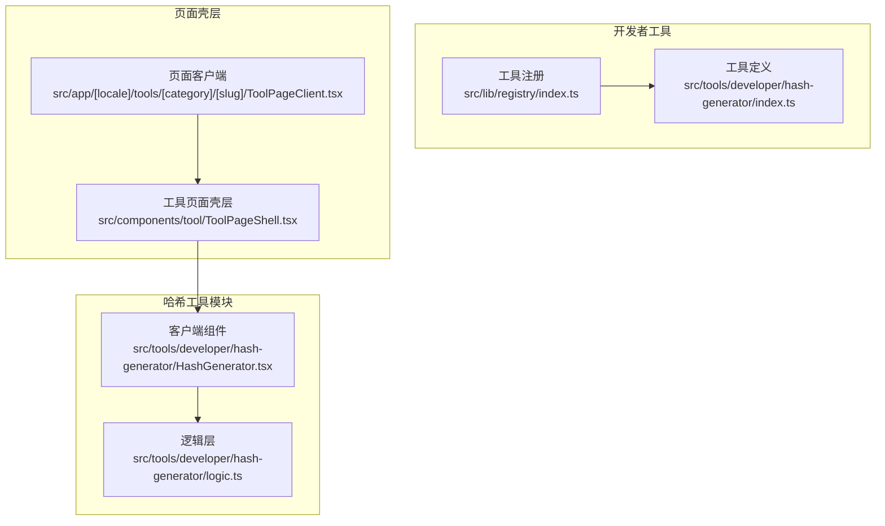
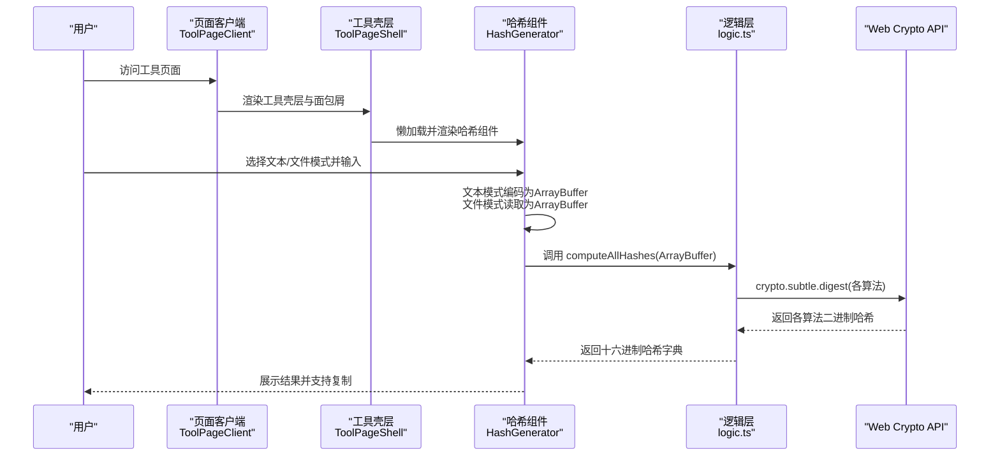
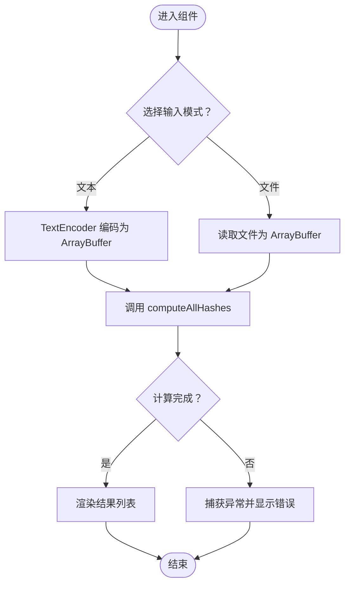
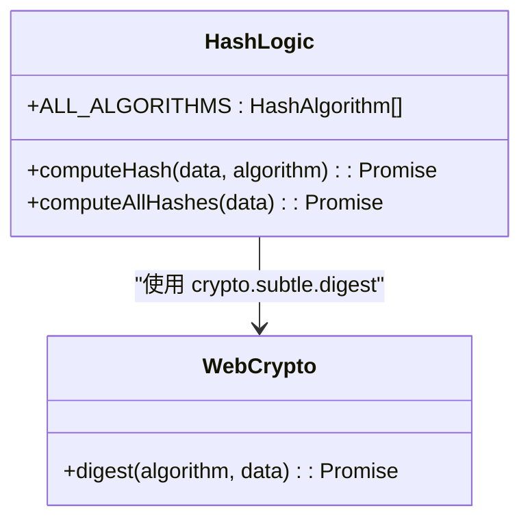
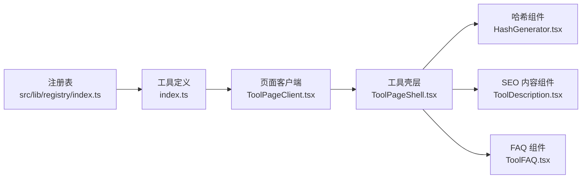
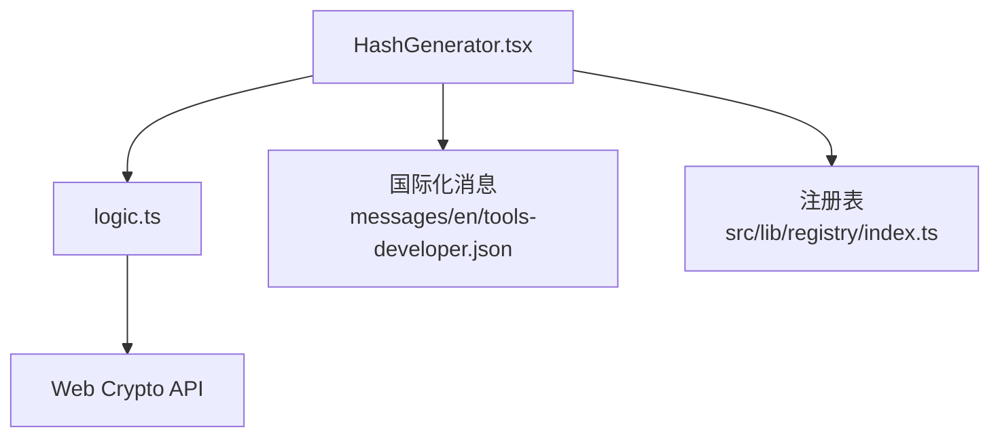

# 哈希生成工具

<cite>
**本文引用的文件**
- [README.md](file://README.md)
- [src/tools/developer/hash-generator/HashGenerator.tsx](file://src/tools/developer/hash-generator/HashGenerator.tsx)
- [src/tools/developer/hash-generator/logic.ts](file://src/tools/developer/hash-generator/logic.ts)
- [src/tools/developer/hash-generator/index.ts](file://src/tools/developer/hash-generator/index.ts)
- [messages/en/tools-developer.json](file://messages/en/tools-developer.json)
- [src/lib/registry/index.ts](file://src/lib/registry/index.ts)
- [src/components/tool/ToolPageShell.tsx](file://src/components/tool/ToolPageShell.tsx)
- [src/app/[locale]/tools/[category]/[slug]/ToolPageClient.tsx](file://src/app/[locale]/tools/[category]/[slug]/ToolPageClient.tsx)
- [src/components/tool/ToolDescription.tsx](file://src/components/tool/ToolDescription.tsx)
- [src/components/tool/ToolFAQ.tsx](file://src/components/tool/ToolFAQ.tsx)
</cite>

## 目录
1. [简介](#简介)
2. [项目结构](#项目结构)
3. [核心组件](#核心组件)
4. [架构总览](#架构总览)
5. [详细组件分析](#详细组件分析)
6. [依赖关系分析](#依赖关系分析)
7. [性能考量](#性能考量)
8. [故障排查指南](#故障排查指南)
9. [结论](#结论)
10. [附录](#附录)

## 简介
本工具提供多种哈希算法的在线计算能力，当前支持 SHA-1、SHA-256、SHA-384 和 SHA-512。用户可通过“文本”或“文件”两种输入模式获取对应的十六进制哈希值，并可一键复制结果。该工具完全在浏览器端运行，使用 Web Crypto API 进行加密运算，确保数据隐私与离线可用性。

## 项目结构
哈希生成工具位于开发者工具分类下，采用“定义 + 组件 + 逻辑”的模块化组织方式：
- 工具定义：声明元数据、图标、SEO 结构化数据、FAQ、关联工具等
- 客户端组件：负责 UI 交互、输入处理、调用逻辑层并渲染结果
- 逻辑层：封装哈希计算的具体实现，统一使用浏览器原生 API

图表来源
- [src/lib/registry/index.ts:115-133](file://src/lib/registry/index.ts#L115-L133)
- [src/tools/developer/hash-generator/index.ts:3-34](file://src/tools/developer/hash-generator/index.ts#L3-L34)
- [src/app/[locale]/tools/[category]/[slug]/ToolPageClient.tsx:29-58](file://src/app/[locale]/tools/[category]/[slug]/ToolPageClient.tsx#L29-L58)
- [src/components/tool/ToolPageShell.tsx:15-52](file://src/components/tool/ToolPageShell.tsx#L15-L52)
- [src/tools/developer/hash-generator/HashGenerator.tsx:12-127](file://src/tools/developer/hash-generator/HashGenerator.tsx#L12-L127)
- [src/tools/developer/hash-generator/logic.ts:10-34](file://src/tools/developer/hash-generator/logic.ts#L10-L34)

章节来源
- [README.md:16-25](file://README.md#L16-L25)
- [src/lib/registry/index.ts:115-133](file://src/lib/registry/index.ts#L115-L133)
- [src/tools/developer/hash-generator/index.ts:3-34](file://src/tools/developer/hash-generator/index.ts#L3-L34)

## 核心组件
- 工具定义（index.ts）
  - 指定工具 slug、分类、图标、SEO 结构化数据、FAQ 列表与关联工具
  - 作为注册表的一部分被全局加载与路由解析使用
- 客户端组件（HashGenerator.tsx）
  - 提供“文本/文件”双模式输入
  - 文本模式将字符串编码为 ArrayBuffer；文件模式读取文件为 ArrayBuffer
  - 调用逻辑层一次性计算多种哈希算法并展示结果
  - 支持错误提示与处理中状态
- 逻辑层（logic.ts）
  - 定义支持的算法集合与类型别名
  - 使用 Web Crypto API 的 crypto.subtle.digest 执行哈希
  - 将二进制结果映射为十六进制字符串

章节来源
- [src/tools/developer/hash-generator/index.ts:3-34](file://src/tools/developer/hash-generator/index.ts#L3-L34)
- [src/tools/developer/hash-generator/HashGenerator.tsx:12-127](file://src/tools/developer/hash-generator/HashGenerator.tsx#L12-L127)
- [src/tools/developer/hash-generator/logic.ts:10-34](file://src/tools/developer/hash-generator/logic.ts#L10-L34)

## 架构总览
从页面加载到哈希计算的端到端流程如下：

图表来源
- [src/app/[locale]/tools/[category]/[slug]/ToolPageClient.tsx:29-58](file://src/app/[locale]/tools/[category]/[slug]/ToolPageClient.tsx#L29-L58)
- [src/components/tool/ToolPageShell.tsx:15-52](file://src/components/tool/ToolPageShell.tsx#L15-L52)
- [src/tools/developer/hash-generator/HashGenerator.tsx:23-43](file://src/tools/developer/hash-generator/HashGenerator.tsx#L23-L43)
- [src/tools/developer/hash-generator/logic.ts:19-34](file://src/tools/developer/hash-generator/logic.ts#L19-L34)

## 详细组件分析

### 客户端组件（HashGenerator）
- 输入模式与数据准备
  - 文本模式：通过 TextEncoder 将字符串编码为 UTF-8 字节缓冲区
  - 文件模式：读取单个文件为 ArrayBuffer
- 计算流程
  - 调用 computeAllHashes 并等待 Promise 并行完成
  - 将结果映射为 UI 可读的键值对列表
- 错误处理
  - 捕获异常并显示错误信息
  - 处理中状态禁用按钮，避免重复触发
- 输出展示
  - 每种算法一行，包含算法名称、十六进制哈希与一键复制按钮

图表来源
- [src/tools/developer/hash-generator/HashGenerator.tsx:23-43](file://src/tools/developer/hash-generator/HashGenerator.tsx#L23-L43)
- [src/tools/developer/hash-generator/logic.ts:19-34](file://src/tools/developer/hash-generator/logic.ts#L19-L34)

章节来源
- [src/tools/developer/hash-generator/HashGenerator.tsx:12-127](file://src/tools/developer/hash-generator/HashGenerator.tsx#L12-L127)

### 逻辑层（logic）
- 算法枚举与类型
  - HashAlgorithm 类型限定为 SHA-1、SHA-256、SHA-384、SHA-512
  - ALL_ALGORITHMS 用于遍历计算
- 单算法计算
  - 使用 crypto.subtle.digest 执行哈希
  - 将 ArrayBuffer 转换为字节数组并映射为两位十六进制字符串
- 并行计算
  - 对四种算法并发执行，汇总为记录对象

图表来源
- [src/tools/developer/hash-generator/logic.ts:1-8](file://src/tools/developer/hash-generator/logic.ts#L1-L8)
- [src/tools/developer/hash-generator/logic.ts:10-17](file://src/tools/developer/hash-generator/logic.ts#L10-L17)
- [src/tools/developer/hash-generator/logic.ts:19-34](file://src/tools/developer/hash-generator/logic.ts#L19-L34)

章节来源
- [src/tools/developer/hash-generator/logic.ts:1-35](file://src/tools/developer/hash-generator/logic.ts#L1-L35)

### 工具定义与页面集成
- 工具定义
  - 包含 SEO 结构化数据、图标、是否置顶展示、FAQ 列表与关联工具
- 注册与路由
  - 注册表集中管理工具元数据，按分类与特性排序
  - 页面客户端根据 slug 动态懒加载对应组件
- 页面壳层与 SEO 内容
  - 壳层提供隐私指示、工具标题与描述区域
  - SEO 内容组件按段落动态渲染“简介/使用方法/特性/用例/隐私”等

图表来源
- [src/lib/registry/index.ts:115-133](file://src/lib/registry/index.ts#L115-L133)
- [src/app/[locale]/tools/[category]/[slug]/ToolPageClient.tsx:29-58](file://src/app/[locale]/tools/[category]/[slug]/ToolPageClient.tsx#L29-L58)
- [src/components/tool/ToolPageShell.tsx:15-52](file://src/components/tool/ToolPageShell.tsx#L15-L52)
- [src/components/tool/ToolDescription.tsx:21-45](file://src/components/tool/ToolDescription.tsx#L21-L45)
- [src/components/tool/ToolFAQ.tsx:12-50](file://src/components/tool/ToolFAQ.tsx#L12-L50)

章节来源
- [src/tools/developer/hash-generator/index.ts:3-34](file://src/tools/developer/hash-generator/index.ts#L3-L34)
- [src/lib/registry/index.ts:115-133](file://src/lib/registry/index.ts#L115-L133)
- [src/app/[locale]/tools/[category]/[slug]/ToolPageClient.tsx:29-58](file://src/app/[locale]/tools/[category]/[slug]/ToolPageClient.tsx#L29-L58)
- [src/components/tool/ToolPageShell.tsx:15-52](file://src/components/tool/ToolPageShell.tsx#L15-L52)
- [src/components/tool/ToolDescription.tsx:21-45](file://src/components/tool/ToolDescription.tsx#L21-L45)
- [src/components/tool/ToolFAQ.tsx:12-50](file://src/components/tool/ToolFAQ.tsx#L12-L50)

## 依赖关系分析
- 组件耦合
  - 客户端组件仅依赖逻辑层导出的计算函数，保持高内聚低耦合
- 外部依赖
  - Web Crypto API：浏览器原生加密接口，保证性能与安全性
- 数据流
  - 输入（文本/文件）→ ArrayBuffer → 并行哈希计算 → 十六进制字符串结果

图表来源
- [src/tools/developer/hash-generator/HashGenerator.tsx:8](file://src/tools/developer/hash-generator/HashGenerator.tsx#L8)
- [src/tools/developer/hash-generator/logic.ts:14](file://src/tools/developer/hash-generator/logic.ts#L14)
- [messages/en/tools-developer.json:280-325](file://messages/en/tools-developer.json#L280-L325)
- [src/lib/registry/index.ts:35](file://src/lib/registry/index.ts#L35)

章节来源
- [src/tools/developer/hash-generator/HashGenerator.tsx:8](file://src/tools/developer/hash-generator/HashGenerator.tsx#L8)
- [src/tools/developer/hash-generator/logic.ts:14](file://src/tools/developer/hash-generator/logic.ts#L14)
- [messages/en/tools-developer.json:280-325](file://messages/en/tools-developer.json#L280-L325)
- [src/lib/registry/index.ts:35](file://src/lib/registry/index.ts#L35)

## 性能考量
- 并行计算
  - 使用 Promise.all 对四种算法同时执行，显著降低总耗时
- 浏览器原生加速
  - Web Crypto API 可利用硬件加速与优化实现，提升吞吐量
- 内存与大文件
  - 文件读取采用 ArrayBuffer，内存占用与文件大小线性相关
  - 建议在设备内存充足且浏览器支持的情况下处理大型文件
- UI 响应
  - 处理中禁用按钮与骨架屏提升用户体验，避免重复提交

章节来源
- [src/tools/developer/hash-generator/logic.ts:28-33](file://src/tools/developer/hash-generator/logic.ts#L28-L33)
- [src/tools/developer/hash-generator/HashGenerator.tsx:23-43](file://src/tools/developer/hash-generator/HashGenerator.tsx#L23-L43)

## 故障排查指南
- 常见问题
  - “无法计算”或空白结果：检查输入是否有效（文本非空或已选择文件）
  - “处理中”按钮不可用：确认计算流程未处于并发状态
  - “错误提示”出现：查看控制台错误信息，通常由文件读取或权限限制导致
- 本地隐私与离线
  - 工具明确标注“仅本地处理”，数据不会上传至服务器
  - 页面加载后可离线使用，适合在无网络环境下进行哈希计算

章节来源
- [src/tools/developer/hash-generator/HashGenerator.tsx:95-99](file://src/tools/developer/hash-generator/HashGenerator.tsx#L95-L99)
- [messages/en/tools-developer.json:296-298](file://messages/en/tools-developer.json#L296-L298)
- [messages/en/tools-developer.json:299-301](file://messages/en/tools-developer.json#L299-L301)

## 结论
哈希生成工具以简洁的 UI 与强大的浏览器原生能力结合，实现了多算法并行哈希计算。其隐私优先的设计与离线可用性，使其适用于文件完整性校验、内容去重、安全审计等多种场景。建议在需要更高安全强度的密码学用途中优先选择 SHA-256 或更高版本算法。

## 附录

### 支持的算法与输出格式
- 算法
  - SHA-1、SHA-256、SHA-384、SHA-512
- 输出格式
  - 十六进制字符串（小写）

章节来源
- [src/tools/developer/hash-generator/logic.ts:1-8](file://src/tools/developer/hash-generator/logic.ts#L1-L8)
- [src/tools/developer/hash-generator/logic.ts:16](file://src/tools/developer/hash-generator/logic.ts#L16)

### 输入类型与使用场景
- 输入类型
  - 文本：适合短消息、配置片段等
  - 文件：适合大体量数据、软件包、媒体文件等
- 场景示例
  - 文件完整性校验：下载后比对官方提供的哈希值
  - 内容去重：基于哈希判断重复文件
  - 安全审计：检测文件是否被篡改

章节来源
- [src/tools/developer/hash-generator/HashGenerator.tsx:28-36](file://src/tools/developer/hash-generator/HashGenerator.tsx#L28-L36)
- [messages/en/tools-developer.json:317-319](file://messages/en/tools-developer.json#L317-L319)

### 实际应用案例
- 文件校验
  - 下载完成后生成哈希并与发布方提供的哈希进行比对
- 密码存储（概念性说明）
  - 建议使用专用密码散列函数（例如 bcrypt、scrypt、Argon2），而非通用哈希算法
- 区块链技术
  - 区块头哈希用于链接区块，确保链式完整性
- 数据去重
  - 基于内容哈希识别重复数据，节省存储空间

章节来源
- [messages/en/tools-developer.json:317-319](file://messages/en/tools-developer.json#L317-L319)

### 算法选择与安全最佳实践
- 算法选择
  - SHA-1：不推荐用于安全敏感场景（存在碰撞风险）
  - SHA-256/384/512：推荐用于一般安全需求与完整性校验
- 最佳实践
  - 仅在浏览器端进行哈希计算，避免上传原始数据
  - 对于密码存储，请使用专门的密码学库与合适的目标成本参数
  - 对大文件进行分块处理时，需评估内存与性能影响

章节来源
- [messages/en/tools-developer.json:292-294](file://messages/en/tools-developer.json#L292-L294)
- [messages/en/tools-developer.json:320-323](file://messages/en/tools-developer.json#L320-L323)