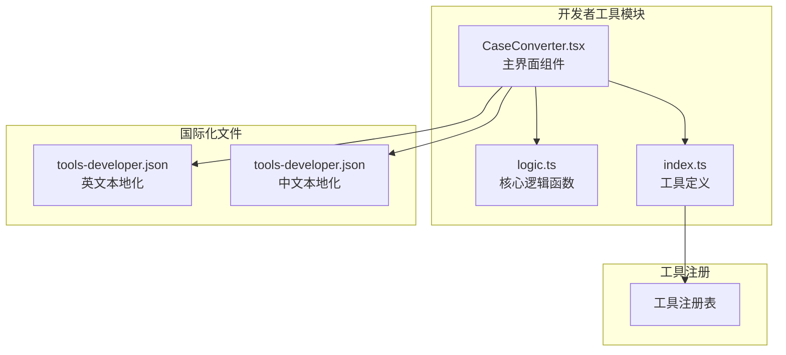
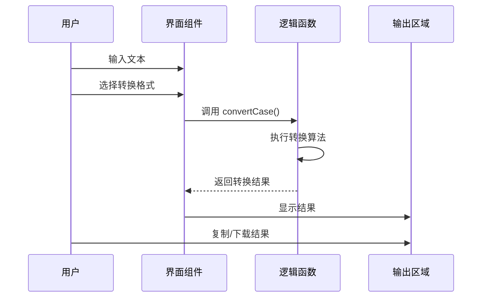
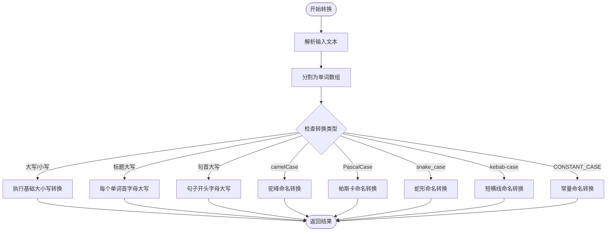
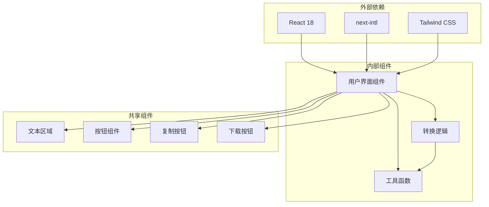

# 大小写转换工具

<cite>
**本文档引用的文件**
- [CaseConverter.tsx](file://src/tools/developer/case-converter/CaseConverter.tsx)
- [logic.ts](file://src/tools/developer/case-converter/logic.ts)
- [index.ts](file://src/tools/developer/case-converter/index.ts)
- [tools-developer.json](file://messages/en/tools-developer.json)
- [README.md](file://README.md)
</cite>

## 目录
1. [简介](#简介)
2. [项目结构](#项目结构)
3. [核心组件](#核心组件)
4. [架构概览](#架构概览)
5. [详细组件分析](#详细组件分析)
6. [依赖关系分析](#依赖关系分析)
7. [性能考虑](#性能考虑)
8. [故障排除指南](#故障排除指南)
9. [结论](#结论)

## 简介

大小写转换工具是 PrivaDeck 多媒体工具箱中的一个开发者工具，专门用于在各种命名约定之间转换文本格式。该工具支持九种不同的大小写格式，包括大写、小写、标题大写、句首大写以及编程中最常用的驼峰命名法系列（camelCase、PascalCase、snake_case、kebab-case、CONSTANT_CASE）。

PrivaDeck 是一个隐私优先的浏览器端多媒体工具箱，所有文件处理均在本地完成，确保用户数据绝不离开设备。该项目采用 Next.js 16 框架，支持 21 种语言，具有暗色模式、离线可用性和 SEO 友好特性。

## 项目结构

大小写转换工具位于开发者工具分类下，采用模块化的文件组织结构：

**图表来源**
- [CaseConverter.tsx:1-72](file://src/tools/developer/case-converter/CaseConverter.tsx#L1-L72)
- [logic.ts:1-68](file://src/tools/developer/case-converter/logic.ts#L1-L68)
- [index.ts:1-36](file://src/tools/developer/case-converter/index.ts#L1-L36)

**章节来源**
- [README.md:16-25](file://README.md#L16-L25)
- [README.md:55-78](file://README.md#L55-L78)

## 核心组件

大小写转换工具由三个主要组件构成，每个组件都有明确的职责分工：

### 主界面组件 (CaseConverter.tsx)
负责用户界面交互和状态管理，提供直观的文本转换体验。

### 核心逻辑组件 (logic.ts)
包含所有转换算法和文本处理逻辑，是工具的核心功能实现。

### 工具定义组件 (index.ts)
定义工具的基本元数据、SEO 信息和相关工具关联。

**章节来源**
- [CaseConverter.tsx:23-71](file://src/tools/developer/case-converter/CaseConverter.tsx#L23-L71)
- [logic.ts:1-10](file://src/tools/developer/case-converter/logic.ts#L1-L10)
- [index.ts:3-33](file://src/tools/developer/case-converter/index.ts#L3-L33)

## 架构概览

大小写转换工具采用简洁而高效的架构设计，实现了清晰的关注点分离：

**图表来源**
- [CaseConverter.tsx:28-30](file://src/tools/developer/case-converter/CaseConverter.tsx#L28-L30)
- [logic.ts:21-67](file://src/tools/developer/case-converter/logic.ts#L21-L67)

该架构具有以下特点：
- **纯函数设计**：转换逻辑完全基于输入参数，无副作用
- **模块化结构**：界面与逻辑分离，便于维护和扩展
- **类型安全**：使用 TypeScript 确保类型正确性
- **浏览器本地处理**：所有计算在用户浏览器中完成

## 详细组件分析

### 转换算法实现

大小写转换工具的核心在于其智能的文本解析和转换算法。以下是各种命名约定的转换策略：

#### 基础转换类型
- **大写转换**：将所有字符转换为大写
- **小写转换**：将所有字符转换为小写
- **标题大写**：将每个单词的首字母大写
- **句首大写**：将句子开头的字母大写

#### 编程命名约定
- **camelCase**：第一个单词全小写，后续单词首字母大写
- **PascalCase**：每个单词首字母大写
- **snake_case**：单词间用下划线连接
- **kebab-case**：单词间用连字符连接
- **CONSTANT_CASE**：单词全大写，用下划线分隔

**图表来源**
- [logic.ts:12-19](file://src/tools/developer/case-converter/logic.ts#L12-L19)
- [logic.ts:21-67](file://src/tools/developer/case-converter/logic.ts#L21-L67)

#### 智能单词分割算法

工具使用正则表达式实现智能的单词分割，能够正确处理各种输入格式：

**图表来源**
- [logic.ts:12-19](file://src/tools/developer/case-converter/logic.ts#L12-L19)

**章节来源**
- [logic.ts:12-67](file://src/tools/developer/case-converter/logic.ts#L12-L67)

### 用户界面设计

界面组件采用现代化的设计理念，提供了直观易用的操作体验：

#### 状态管理
- **输入状态**：管理用户输入的原始文本
- **输出状态**：存储转换后的结果文本
- **国际化支持**：动态加载多语言界面文本

#### 交互功能
- **实时转换**：用户选择格式后立即显示结果
- **批量操作**：支持多行文本的批量转换
- **便捷操作**：提供复制和下载功能

**章节来源**
- [CaseConverter.tsx:24-68](file://src/tools/developer/case-converter/CaseConverter.tsx#L24-L68)

### 工具注册与配置

工具定义文件包含了完整的元数据配置：

#### 基本信息
- **工具标识**：case-converter
- **分类归属**：developer（开发者工具）
- **图标定义**：CaseSensitive
- **SEO 类型**：WebApplication

#### 功能特性
- **FAQ 支持**：包含五个常见问题解答
- **相关工具**：与词数统计和 Lorem Ipsum 工具关联
- **动态加载**：使用 React.lazy 实现按需加载

**章节来源**
- [index.ts:3-33](file://src/tools/developer/case-converter/index.ts#L3-L33)

## 依赖关系分析

大小写转换工具的依赖关系相对简单，体现了最小依赖原则：

**图表来源**
- [CaseConverter.tsx:3-9](file://src/tools/developer/case-converter/CaseConverter.tsx#L3-L9)

### 关键依赖说明

1. **React 18**：提供组件化开发和状态管理
2. **next-intl**：实现国际化本地化功能
3. **Tailwind CSS**：提供实用优先的样式解决方案
4. **共享组件库**：复用项目中的通用 UI 组件

**章节来源**
- [CaseConverter.tsx:3-9](file://src/tools/developer/case-converter/CaseConverter.tsx#L3-L9)

## 性能考虑

大小写转换工具在设计时充分考虑了性能优化：

### 内存效率
- **纯函数设计**：避免不必要的状态存储
- **即时垃圾回收**：每次转换后释放临时对象
- **字符串优化**：使用高效的字符串拼接方法

### 计算效率
- **单次遍历**：单词分割和转换只遍历文本一次
- **正则表达式优化**：使用预编译的正则表达式
- **条件分支优化**：根据转换类型选择最优算法

### 用户体验
- **异步处理**：长文本转换不会阻塞界面
- **进度反馈**：提供实时的转换进度指示
- **错误处理**：优雅处理异常输入情况

## 故障排除指南

### 常见问题及解决方案

#### 转换结果不符合预期
**可能原因**：
- 输入文本包含特殊字符或数字
- 选择了错误的转换格式
- 文本编码问题

**解决方法**：
- 确认输入文本的编码格式
- 检查特殊字符是否被正确识别
- 尝试不同的转换组合

#### 性能问题
**症状**：大文本转换缓慢

**解决方案**：
- 分批处理大文本
- 使用更简单的转换格式
- 清理浏览器缓存

#### 浏览器兼容性
**问题**：某些浏览器不支持特定功能

**解决方法**：
- 更新到最新版本的浏览器
- 检查浏览器的 JavaScript 支持情况
- 联系技术支持获取帮助

**章节来源**
- [tools-developer.json:723-733](file://messages/en/tools-developer.json#L723-L733)

## 结论

大小写转换工具是一个设计精良、功能完备的开发者工具，它成功地将复杂的文本转换需求简化为直观易用的操作流程。该工具的主要优势包括：

### 技术优势
- **隐私保护**：所有处理都在本地完成，确保数据安全
- **性能优异**：优化的算法和架构设计保证了高效的处理速度
- **扩展性强**：模块化的架构便于功能扩展和维护

### 用户价值
- **多场景适用**：涵盖编程、写作、设计等多个领域的需求
- **国际化支持**：支持 21 种语言，满足全球用户需求
- **用户体验优秀**：简洁直观的界面设计和流畅的交互体验

### 应用前景
该工具为开发者提供了标准化的文本转换解决方案，特别适用于：
- 代码风格统一和重构
- 数据库字段命名规范化
- API 接口设计和文档编写
- 内容管理系统和网站开发

通过持续的功能完善和技术优化，大小写转换工具将继续为用户提供可靠的文本处理服务，在提升工作效率的同时保障数据安全和隐私保护。