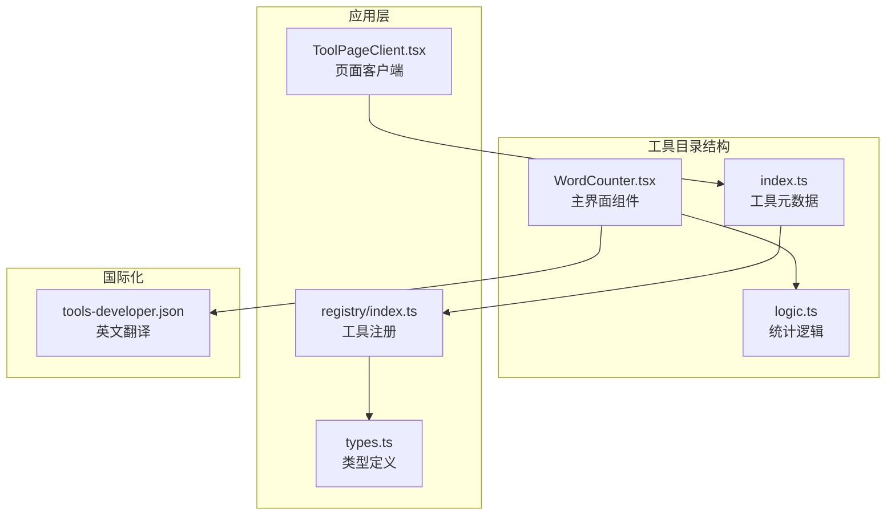
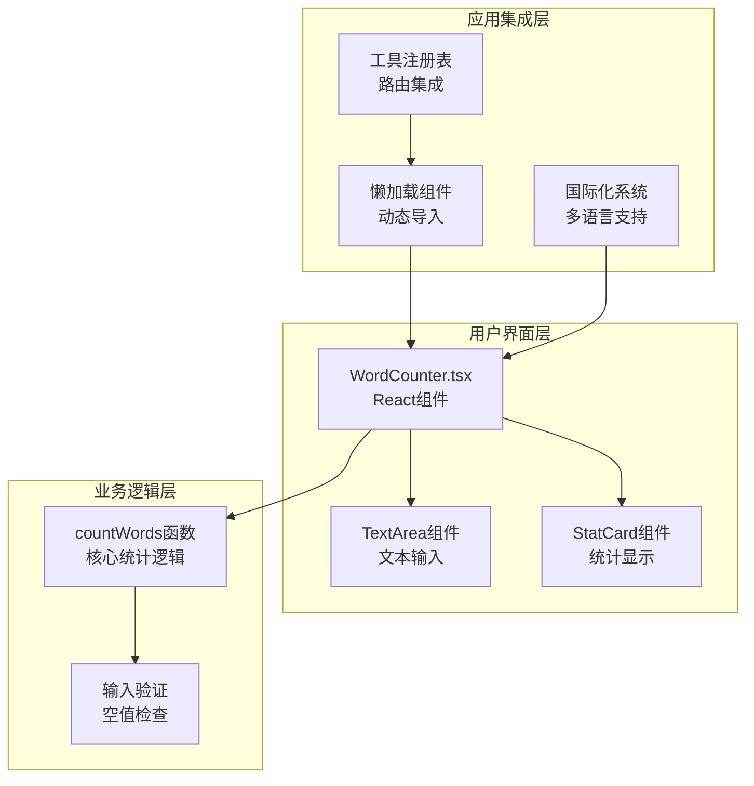
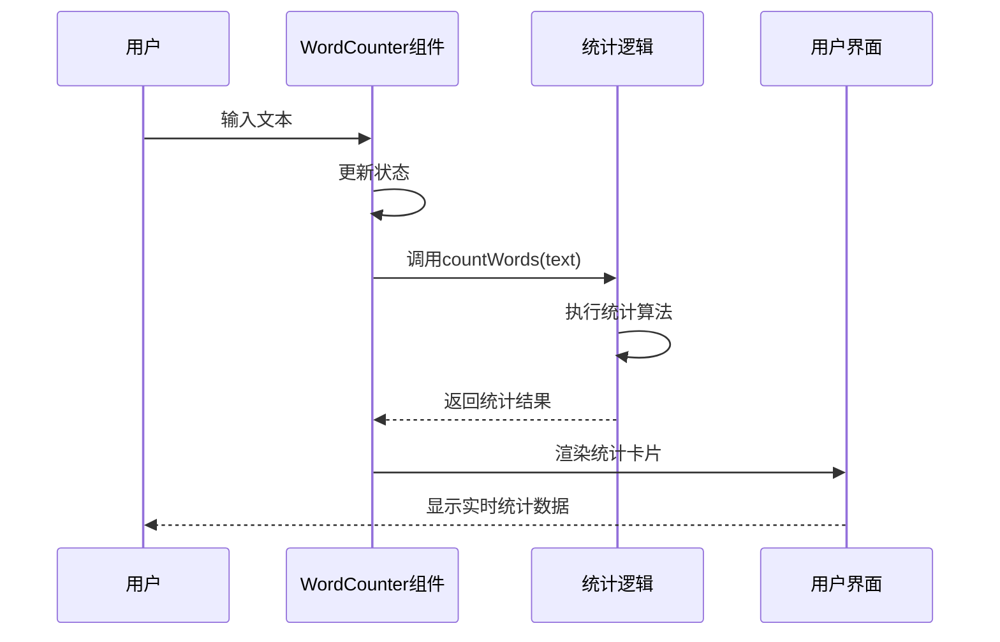
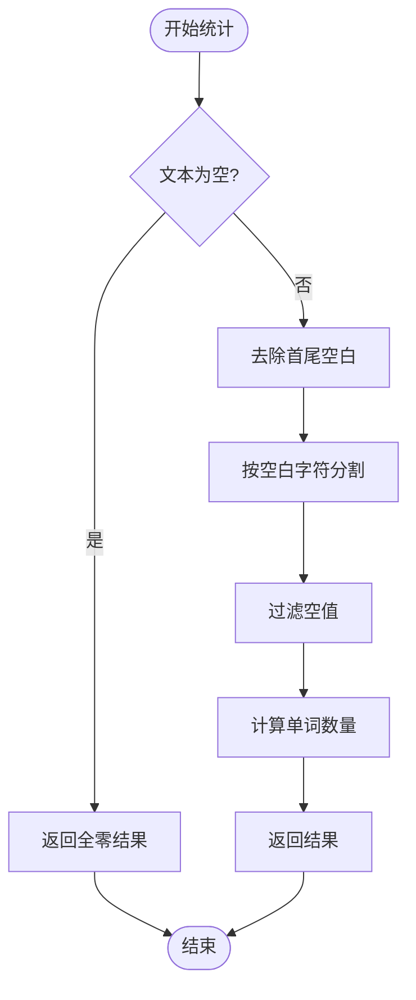
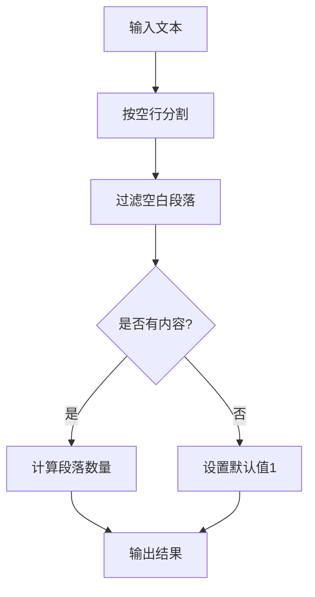
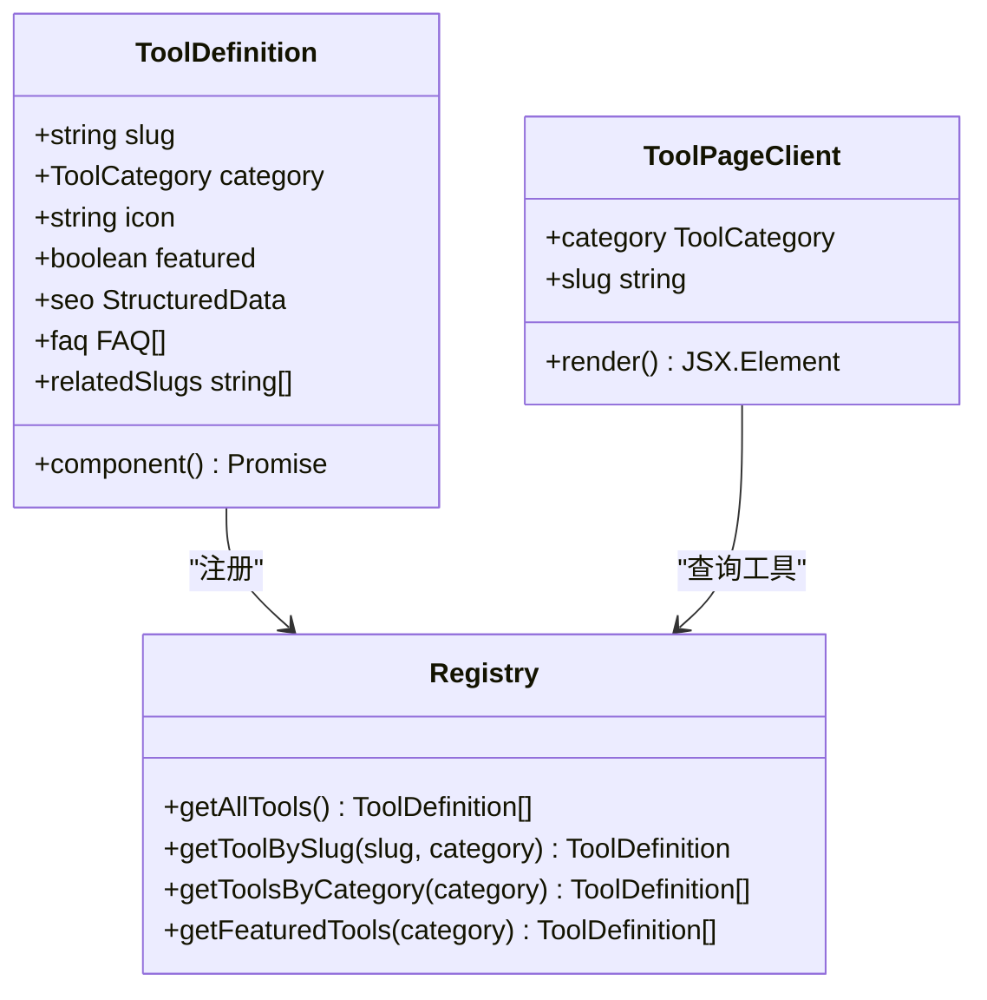
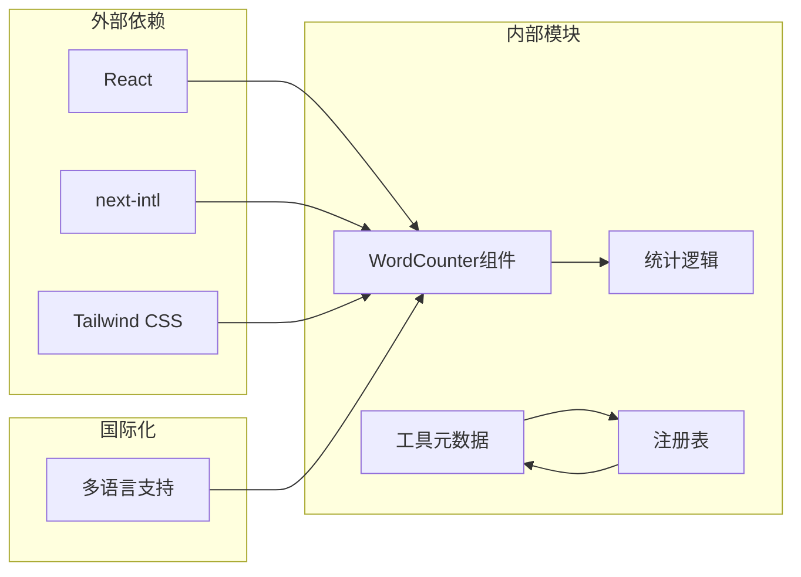

# 字数统计工具

<cite>
**本文档引用的文件**
- [WordCounter.tsx](file://src/tools/developer/word-counter/WordCounter.tsx)
- [logic.ts](file://src/tools/developer/word-counter/logic.ts)
- [index.ts](file://src/tools/developer/word-counter/index.ts)
- [ToolPageClient.tsx](file://src/app/[locale]/tools/[category]/[slug]/ToolPageClient.tsx)
- [index.ts](file://src/lib/registry/index.ts)
- [types.ts](file://src/lib/registry/types.ts)
- [tools-developer.json](file://messages/en/tools-developer.json)
</cite>

## 目录
1. [简介](#简介)
2. [项目结构](#项目结构)
3. [核心组件](#核心组件)
4. [架构概览](#架构概览)
5. [详细组件分析](#详细组件分析)
6. [依赖关系分析](#依赖关系分析)
7. [性能考虑](#性能考虑)
8. [故障排除指南](#故障排除指南)
9. [结论](#结论)
10. [附录](#附录)

## 简介

字数统计工具是一个基于浏览器的实时文本分析工具，能够即时计算文本的各种统计指标。该工具专注于提供准确的字数统计、字符计数、句子分析和段落识别功能，同时估算阅读时间。

该工具采用纯前端实现，所有处理都在用户的浏览器中完成，确保了数据隐私和离线使用能力。工具支持多种文本处理场景，包括学术写作、内容创作、技术文档编写等。

## 项目结构

字数统计工具位于项目的开发者工具类别下，采用模块化设计，主要包含以下组件：

**图表来源**
- [WordCounter.tsx:1-45](file://src/tools/developer/word-counter/WordCounter.tsx#L1-L45)
- [logic.ts:1-22](file://src/tools/developer/word-counter/logic.ts#L1-L22)
- [index.ts:1-28](file://src/tools/developer/word-counter/index.ts#L1-L28)

**章节来源**
- [WordCounter.tsx:1-45](file://src/tools/developer/word-counter/WordCounter.tsx#L1-L45)
- [index.ts:1-28](file://src/tools/developer/word-counter/index.ts#L1-L28)
- [ToolPageClient.tsx:1-59](file://src/app/[locale]/tools/[category]/[slug]/ToolPageClient.tsx#L1-L59)

## 核心组件

### 统计结果接口定义

工具的核心数据结构是 `WordCountResult` 接口，定义了所有统计指标：

| 指标名称 | 数据类型 | 描述 | 计算方式 |
|---------|---------|------|----------|
| words | number | 单词数量 | 去除空白后按空格分割并过滤空值 |
| characters | number | 字符总数 | 文本长度（包含空白字符） |
| sentences | number | 句子数量 | 按句号、问号、感叹号分割 |
| paragraphs | number | 段落数量 | 按空行分割 |
| readingTimeMinutes | number | 阅读时间（分钟） | 基于200字/分钟的平均阅读速度 |

### 主要统计算法

工具实现了四种核心统计算法：

1. **单词计数算法**：使用正则表达式 `/\\s+/` 按空白字符分割文本
2. **字符计数算法**：直接使用字符串长度属性
3. **句子分割算法**：使用正则表达式 `/[.!?]+/` 按标点符号分割
4. **段落分割算法**：使用正则表达式 `/\\n\\s*\\n/` 按空行分割

**章节来源**
- [logic.ts:1-22](file://src/tools/developer/word-counter/logic.ts#L1-L22)

## 架构概览

字数统计工具采用分层架构设计，确保了良好的可维护性和扩展性：

**图表来源**
- [WordCounter.tsx:8-35](file://src/tools/developer/word-counter/WordCounter.tsx#L8-L35)
- [ToolPageClient.tsx:29-58](file://src/app/[locale]/tools/[category]/[slug]/ToolPageClient.tsx#L29-L58)
- [index.ts:139-147](file://src/lib/registry/index.ts#L139-L147)

## 详细组件分析

### WordCounter 主组件

主组件负责管理状态和渲染用户界面，采用 React Hooks 实现响应式更新：

**图表来源**
- [WordCounter.tsx:9-11](file://src/tools/developer/word-counter/WordCounter.tsx#L9-L11)
- [logic.ts:9-21](file://src/tools/developer/word-counter/logic.ts#L9-L21)

### 统计算法实现

#### 单词计数算法

单词计数使用正则表达式分割策略，能够准确处理多种空白字符：

**图表来源**
- [logic.ts:10-12](file://src/tools/developer/word-counter/logic.ts#L10-L12)
- [logic.ts:15](file://src/tools/developer/word-counter/logic.ts#L15)

#### 句子分割算法

句子分割基于标点符号识别，支持多种结束标点：

| 标点符号 | 作用 | 处理方式 |
|---------|------|----------|
| 句号 (.) | 陈述句结束 | 作为分割标志 |
| 问号 (?) | 疑问句结束 | 作为分割标志 |
| 感叹号 (!) | 感叹句结束 | 作为分割标志 |

#### 段落识别算法

段落识别通过空行分割实现，能够处理复杂的文档格式：

**图表来源**
- [logic.ts:17](file://src/tools/developer/word-counter/logic.ts#L17)

### 工具注册与路由集成

工具通过注册表系统集成到应用程序中，支持动态懒加载和路由导航：

**图表来源**
- [types.ts:5-16](file://src/lib/registry/types.ts#L5-L16)
- [index.ts:139-147](file://src/lib/registry/index.ts#L139-L147)
- [ToolPageClient.tsx:29-42](file://src/app/[locale]/tools/[category]/[slug]/ToolPageClient.tsx#L29-L42)

**章节来源**
- [index.ts:3-25](file://src/tools/developer/word-counter/index.ts#L3-L25)
- [types.ts:1-22](file://src/lib/registry/types.ts#L1-L22)
- [ToolPageClient.tsx:11-58](file://src/app/[locale]/tools/[category]/[slug]/ToolPageClient.tsx#L11-L58)

## 依赖关系分析

字数统计工具的依赖关系相对简单，主要依赖于 React 生态系统和工具注册表系统：

**图表来源**
- [WordCounter.tsx:3-6](file://src/tools/developer/word-counter/WordCounter.tsx#L3-L6)
- [index.ts:4-62](file://src/lib/registry/index.ts#L4-L62)

**章节来源**
- [index.ts:1-164](file://src/lib/registry/index.ts#L1-L164)

## 性能考虑

### 浏览器本地处理优势

字数统计工具采用纯前端实现，具有以下性能优势：

1. **无网络延迟**：所有计算在本地完成，无需服务器往返
2. **内存效率**：使用流式处理，避免大文本的内存峰值
3. **响应式更新**：实时计算，用户体验流畅
4. **离线可用**：完全依赖浏览器功能，支持离线使用

### 优化策略

1. **懒加载组件**：使用 React.lazy 和 Suspense 减少初始包大小
2. **缓存机制**：实现组件实例缓存，避免重复渲染
3. **防抖处理**：对于大量文本输入，可考虑添加防抖机制
4. **虚拟化支持**：对于超长文本，可考虑实现虚拟滚动

## 故障排除指南

### 常见问题及解决方案

| 问题类型 | 症状 | 可能原因 | 解决方案 |
|---------|------|----------|----------|
| 统计不准确 | 单词数异常 | 特殊字符处理 | 检查正则表达式配置 |
| 性能问题 | 输入卡顿 | 大文本处理 | 实现防抖或分批处理 |
| 界面显示异常 | 统计卡片不更新 | 状态管理问题 | 检查useState Hook使用 |
| 国际化错误 | 文案显示异常 | 语言包缺失 | 验证i18n配置 |

### 调试建议

1. **开发工具**：使用浏览器开发者工具监控性能
2. **日志记录**：添加必要的调试信息
3. **单元测试**：为统计逻辑编写测试用例
4. **性能监控**：监控内存使用和执行时间

**章节来源**
- [logic.ts:9-21](file://src/tools/developer/word-counter/logic.ts#L9-L21)

## 结论

字数统计工具是一个设计精良的文本分析工具，具有以下特点：

1. **准确性**：实现了标准的文本统计算法
2. **隐私性**：完全在本地处理，保护用户数据
3. **易用性**：提供直观的用户界面和实时反馈
4. **可扩展性**：模块化设计便于功能扩展

该工具适用于各种文本分析场景，从简单的个人写作到专业的文档审查都能胜任。其纯前端架构确保了最佳的隐私保护和性能表现。

## 附录

### 使用示例

#### 基本使用流程
1. 在文本区域输入或粘贴内容
2. 实时查看统计结果
3. 根据需要调整写作策略

#### 应用场景
- **博客写作**：监控文章长度和阅读时间
- **学术论文**：检查字数限制符合性
- **商业报告**：估算阅读时间和内容密度
- **内容营销**：优化社交媒体文案长度

### 功能特性

| 特性 | 描述 | 技术实现 |
|------|------|----------|
| 实时统计 | 输入即更新 | React Hooks + 正则表达式 |
| 多语言支持 | 国际化界面 | next-intl + JSON配置 |
| 懒加载 | 动态组件加载 | React.lazy + 缓存机制 |
| 隐私保护 | 本地处理 | 浏览器JavaScript执行 |

**章节来源**
- [tools-developer.json:659-706](file://messages/en/tools-developer.json#L659-L706)