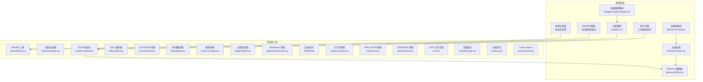
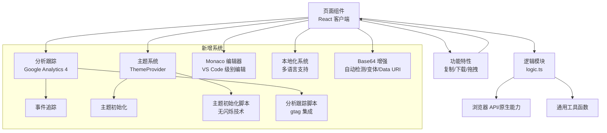
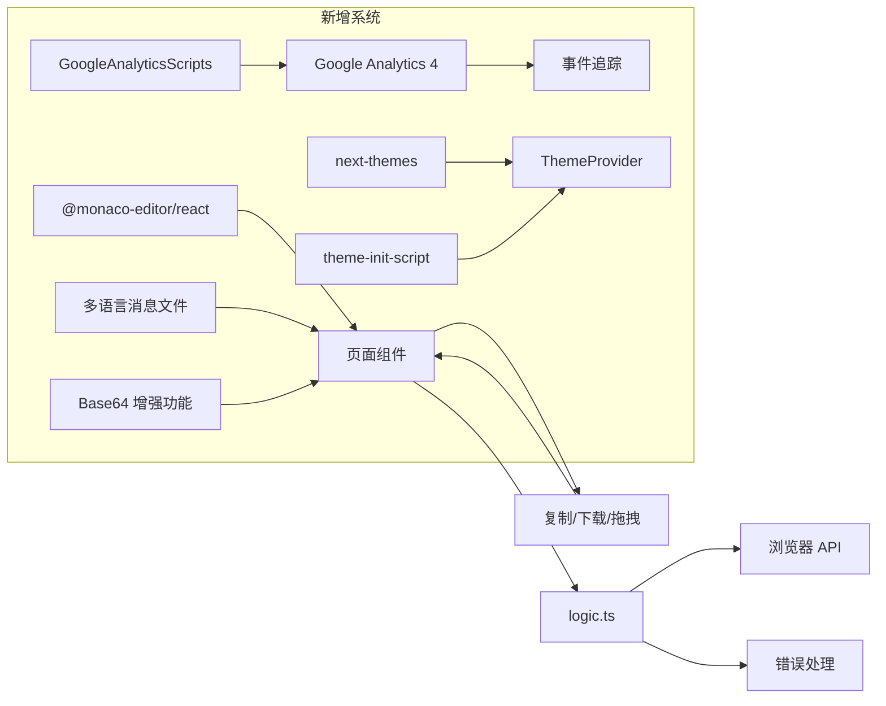

# 开发者工具

<cite>
**本文引用的文件**
- [Base64Tool.tsx](file://src/tools/developer/base64/Base64Tool.tsx)
- [logic.ts（Base64）](file://src/tools/developer/base64/logic.ts)
- [HashGenerator.tsx](file://src/tools/developer/hash-generator/HashGenerator.tsx)
- [logic.ts（哈希）](file://src/tools/developer/hash-generator/logic.ts)
- [JsonFormatter.tsx](file://src/tools/developer/json-formatter/JsonFormatter.tsx)
- [MonacoEditor.tsx](file://src/tools/developer/json-formatter/MonacoEditor.tsx)
- [JsonTreeView.tsx](file://src/tools/developer/json-formatter/JsonTreeView.tsx)
- [SyntaxHighlight.tsx](file://src/tools/developer/json-formatter/SyntaxHighlight.tsx)
- [logic.ts（JSON 格式化）](file://src/tools/developer/json-formatter/logic.ts)
- [UrlEncoder.tsx](file://src/tools/developer/url-encoder/UrlEncoder.tsx)
- [logic.ts（URL 编码）](file://src/tools/developer/url-encoder/logic.ts)
- [CsvJsonTool.tsx](file://src/tools/developer/csv-json/CsvJsonTool.tsx)
- [logic.ts（CSV/JSON 转换）](file://src/tools/developer/csv-json/logic.ts)
- [Timestamp.tsx](file://src/tools/developer/timestamp/Timestamp.tsx)
- [logic.ts（时间戳）](file://src/tools/developer/timestamp/logic.ts)
- [ColorConverter.tsx](file://src/tools/developer/color-converter/ColorConverter.tsx)
- [logic.ts（颜色转换）](file://src/tools/developer/color-converter/logic.ts)
- [RegexTester.tsx](file://src/tools/developer/regex-tester/RegexTester.tsx)
- [logic.ts（正则测试）](file://src/tools/developer/regex-tester/logic.ts)
- [MarkdownPreview.tsx](file://src/tools/developer/markdown-preview/MarkdownPreview.tsx)
- [logic.ts（Markdown 预览）](file://src/tools/developer/markdown-preview/logic.ts)
- [TextDiff.tsx](file://src/tools/developer/text-diff/TextDiff.tsx)
- [logic.ts（文本差异）](file://src/tools/developer/text-diff/logic.ts)
- [CaseConverter.tsx](file://src/tools/developer/case-converter/CaseConverter.tsx)
- [logic.ts（大小写转换）](file://src/tools/developer/case-converter/logic.ts)
- [YamlJson.tsx](file://src/tools/developer/yaml-json/YamlJson.tsx)
- [logic.ts（YAML/JSON 转换）](file://src/tools/developer/yaml-json/logic.ts)
- [JsonXmlTool.tsx](file://src/tools/developer/json-xml/JsonXmlTool.tsx)
- [logic.ts（JSON/XML 转换）](file://src/tools/developer/json-xml/logic.ts)
- [Ocr.tsx](file://src/tools/developer/ocr/Ocr.tsx)
- [logic.ts（OCR）](file://src/tools/developer/ocr/logic.ts)
- [WordCounter.tsx](file://src/tools/developer/word-counter/WordCounter.tsx)
- [logic.ts（字数统计）](file://src/tools/developer/word-counter/logic.ts)
- [Archive.tsx](file://src/tools/developer/archive/Archive.tsx)
- [logic.ts（归档）](file://src/tools/developer/archive/logic.ts)
- [LoremIpsum.tsx](file://src/tools/developer/lorem-ipsum/LoremIpsum.tsx)
- [logic.ts（Lorem Ipsum）](file://src/tools/developer/lorem-ipsum/logic.ts)
- [analytics.ts](file://src/lib/analytics.ts)
- [GoogleAnalyticsScripts.tsx](file://src/components/shared/GoogleAnalyticsScripts.tsx)
- [ThemeProvider.tsx](file://src/lib/theme/ThemeProvider.tsx)
- [theme-init-script.ts](file://src/lib/theme/theme-init-script.ts)
- [useTextFileDrop.ts](file://src/hooks/useTextFileDrop.ts)
- [tools-developer.json（中文）](file://messages/zh-Hans/tools-developer.json)
- [tools-developer.json（英文）](file://messages/en/tools-developer.json)
- [tools-developer.json（法语）](file://messages/fr/tools-developer.json)
- [tools-developer.json（德语）](file://messages/de/tools-developer.json)
</cite>

## 更新摘要
**所做更改**
- 新增 Base64 工具重大功能增强章节，详细介绍自动检测、URL 安全变体、Data URI 输出等新功能
- 更新开发者工具本地化内容改进章节，说明多语言支持的完善和 SEO 优化
- 新增分析跟踪系统章节，说明 Google Analytics 4 集成和事件追踪机制
- 新增主题初始化系统章节，解释无闪烁主题切换的实现原理
- 更新 JSON 格式化工具章节，增加新的编辑器功能和统计追踪
- 新增工具使用统计功能说明，展示性能监控和错误追踪
- **新增多个工具功能增强章节**：CSV/JSON 转换、JSON/XML 转换、YAML/JSON 转换、字数统计、归档工具等功能改进

## 目录
1. [简介](#简介)
2. [项目结构](#项目结构)
3. [核心组件](#核心组件)
4. [架构总览](#架构总览)
5. [Base64 工具重大功能增强](#base64-工具重大功能增强)
6. [开发者工具本地化内容改进](#开发者工具本地化内容改进)
7. [Monaco 编辑器集成](#monaco-编辑器集成)
8. [分析跟踪系统](#分析跟踪系统)
9. [主题初始化系统](#主题初始化系统)
10. [工具使用统计功能](#工具使用统计功能)
11. [详细组件分析](#详细组件分析)
12. [依赖关系分析](#依赖关系分析)
13. [性能考量](#性能考量)
14. [故障排查指南](#故障排查指南)
15. [结论](#结论)
16. [附录](#附录)

## 简介
本文件面向开发者工具模块，系统性梳理并解释 17 个开发者辅助工具：Base64 编解码、哈希生成、JSON 格式化与校验、URL 编解码、CSV/TSV 与 JSON 互转、时间戳与日期互转、颜色格式转换、正则表达式测试、Markdown 预览、文本差异对比、大小写与命名风格转换、YAML/JSON 转换、JSON/XML 转换、OCR 文字识别、字数统计、归档打包、Lorem Ipsum 模拟文本。文档覆盖技术实现原理、数据格式与编码标准、处理算法、使用方法与参数配置、批量与格式转换选项、性能特点与最佳实践，并提供可直接定位到源码的路径以便进一步查阅。

**新增功能**：本版本增加了 Base64 工具的重大功能增强（自动检测、URL 安全变体、Data URI 输出）、开发者工具本地化内容改进（多语言支持完善）、Monaco 编辑器集成、分析跟踪系统、主题初始化系统和工具使用统计功能，显著提升了开发体验和产品监控能力。同时，多个工具的功能得到增强和改进。

## 项目结构
开发者工具采用按功能分层的组织方式：页面组件位于 src/tools/developer/<tool>/ 下，每个工具包含页面组件与逻辑实现（logic.ts）。页面组件负责 UI 交互与状态管理，逻辑文件封装纯函数或工具方法，便于复用与测试。

**图表来源**
- [JsonFormatter.tsx:1-334](file://src/tools/developer/json-formatter/JsonFormatter.tsx#L1-L334)
- [MonacoEditor.tsx:1-62](file://src/tools/developer/json-formatter/MonacoEditor.tsx#L1-L62)
- [analytics.ts:1-138](file://src/lib/analytics.ts#L1-L138)
- [ThemeProvider.tsx:1-106](file://src/lib/theme/ThemeProvider.tsx#L1-L106)
- [Base64Tool.tsx:1-388](file://src/tools/developer/base64/Base64Tool.tsx#L1-L388)
- [theme-init-script.ts:1-7](file://src/lib/theme/theme-init-script.ts#L1-L7)
- [GoogleAnalyticsScripts.tsx:1-21](file://src/components/shared/GoogleAnalyticsScripts.tsx#L1-L21)

**章节来源**
- [Base64Tool.tsx:1-52](file://src/tools/developer/base64/Base64Tool.tsx#L1-L52)
- [HashGenerator.tsx:1-128](file://src/tools/developer/hash-generator/HashGenerator.tsx#L1-L128)
- [JsonFormatter.tsx:1-334](file://src/tools/developer/json-formatter/JsonFormatter.tsx#L1-L334)
- [UrlEncoder.tsx:1-61](file://src/tools/developer/url-encoder/UrlEncoder.tsx#L1-L61)
- [CsvJsonTool.tsx:1-102](file://src/tools/developer/csv-json/CsvJsonTool.tsx#L1-L102)
- [Timestamp.tsx:1-177](file://src/tools/developer/timestamp/Timestamp.tsx#L1-L177)
- [ColorConverter.tsx:1-99](file://src/tools/developer/color-converter/ColorConverter.tsx#L1-L99)
- [RegexTester.tsx:1-154](file://src/tools/developer/regex-tester/RegexTester.tsx#L1-L154)
- [MarkdownPreview.tsx:1-46](file://src/tools/developer/markdown-preview/MarkdownPreview.tsx#L1-L46)
- [TextDiff.tsx:1-131](file://src/tools/developer/text-diff/TextDiff.tsx#L1-L131)
- [CaseConverter.tsx:1-72](file://src/tools/developer/case-converter/CaseConverter.tsx#L1-L72)
- [YamlJson.tsx:1-102](file://src/tools/developer/yaml-json/YamlJson.tsx#L1-L102)
- [JsonXmlTool.tsx:1-102](file://src/tools/developer/json-xml/JsonXmlTool.tsx#L1-L102)
- [Ocr.tsx:1-90](file://src/tools/developer/ocr/Ocr.tsx#L1-L90)
- [WordCounter.tsx:1-45](file://src/tools/developer/word-counter/WordCounter.tsx#L1-L45)
- [Archive.tsx](file://src/tools/developer/archive/Archive.tsx)
- [LoremIpsum.tsx](file://src/tools/developer/lorem-ipsum/LoremIpsum.tsx)

## 核心组件
- Base64 工具：提供字符串与二进制之间的 Base64 编解码，支持拖拽文本输入与结果复制下载，现已增强自动检测、URL 安全变体和 Data URI 输出功能。
- 哈希生成器：支持文本与文件两种输入模式，计算多种哈希值（如 SHA-256、MD5 等），并可一键复制结果。
- JSON 格式化：支持格式化、压缩与校验，可自定义缩进空格数，实时显示校验结果，集成 Monaco 编辑器提供 VS Code 级别的编辑体验。
- URL 编码器：支持 URL 整体与组件级编解码，适用于查询参数、路径等场景。
- CSV/JSON 转换：双向转换 CSV/TSV 与 JSON，支持拖拽文件与错误提示，现已增强 CSV 解析和转义处理。
- 时间戳转换：支持秒级与毫秒级自动识别，提供 UTC、本地、ISO 与相对时间格式。
- 颜色转换：解析 HEX/RGB/HSL 输入，输出对应格式与数值明细。
- 正则测试器：支持多标志位组合（g/i/m/s），高亮匹配并展示分组详情。
- Markdown 预览：实时渲染 Markdown 为 HTML，支持复制输出。
- 文本差异：计算两段文本的差异，输出统一格式并统计增删数量。
- 大小写转换：提供多种命名风格转换（大写、小写、标题、句子、驼峰、帕斯卡、蛇形、短横线、常量）。
- YAML/JSON 转换：双向转换 YAML 与 JSON，支持拖拽与复制下载，使用 js-yaml 库处理。
- JSON/XML 转换：双向转换 JSON 与 XML，支持拖拽与错误提示，处理混合内容和属性。
- OCR 文字识别：支持多语言图片上传识别，显示置信度与进度。
- 字数统计：统计词数、字符数、句数、段落数与阅读时长，提供详细的统计结果。
- 归档打包：将多个文件打包为压缩包（ZIP 等），支持文件图标识别和批量下载。
- Lorem Ipsum：生成模拟文本，用于占位与排版测试。

**新增功能**：Base64 工具现在集成了自动检测功能（智能识别 Base64 输入并自动切换到解码模式）、URL 安全变体支持（RFC 4648 标准）、Data URI 输出功能（生成可直接使用的 data URL），以及图片预览功能（自动检测并显示解码后的图片）。多个工具的功能得到增强和改进。

## 架构总览
各工具页面组件通过 React Hooks 管理状态，调用对应 logic.ts 中的纯函数进行数据处理，再将结果反馈到 UI。部分工具涉及浏览器原生 API 或外部库（如 OCR），并在 UI 层提供进度与错误提示。新增的分析跟踪系统通过 Google Analytics 4 实现用户行为追踪，主题初始化系统确保无闪烁的主题切换体验，本地化系统提供多语言支持。

**图表来源**
- [JsonFormatter.tsx:1-334](file://src/tools/developer/json-formatter/JsonFormatter.tsx#L1-L334)
- [analytics.ts:1-138](file://src/lib/analytics.ts#L1-L138)
- [ThemeProvider.tsx:1-106](file://src/lib/theme/ThemeProvider.tsx#L1-L106)
- [MonacoEditor.tsx:1-62](file://src/tools/developer/json-formatter/MonacoEditor.tsx#L1-L62)
- [Base64Tool.tsx:1-388](file://src/tools/developer/base64/Base64Tool.tsx#L1-L388)
- [theme-init-script.ts:1-7](file://src/lib/theme/theme-init-script.ts#L1-L7)
- [GoogleAnalyticsScripts.tsx:1-21](file://src/components/shared/GoogleAnalyticsScripts.tsx#L1-L21)

## Base64 工具重大功能增强

### 概述
Base64 工具经历了重大功能增强，新增了自动检测、URL 安全变体、Data URI 输出、图片预览等核心功能，显著提升了用户体验和实用性。

### 核心增强功能

#### 自动检测功能
- **智能识别**：当检测到输入为 Base64 格式时，自动切换到解码模式
- **实时反馈**：检测到 Base64 输入时显示提示信息："输入看起来像 Base64 — 已切换到解码"
- **用户控制**：用户手动切换方向时会重置自动检测状态

#### URL 安全变体支持
- **RFC 4648 兼容**：支持标准 Base64 和 URL 安全 Base64 变体
- **自动转换**：URL 安全变体自动转换为标准格式进行处理
- **灵活选择**：用户可选择使用标准或 URL 安全变体

#### Data URI 输出功能
- **直接嵌入**：生成可直接用于 HTML/CSS/JavaScript 的 data URL
- **MIME 类型**：自动推断文件 MIME 类型
- **便捷使用**：无需额外处理即可在网页中使用

#### 图片预览功能
- **自动检测**：解码 Base64 图片数据时自动检测图片格式
- **实时预览**：支持 PNG、JPEG、GIF、WebP 等格式的实时预览
- **内联显示**：预览图片直接显示在输出区域下方

### 技术实现细节
- **输入处理**：使用 `isLikelyBase64` 函数进行 Base64 格式检测
- **变体转换**：通过 `standardToUrlSafe` 和 `urlSafeToStandard` 函数处理变体转换
- **Data URI**：使用 `formatDataUri` 和 `parseDataUri` 函数处理 Data URI 格式
- **图片检测**：通过魔数字节检测支持的图片格式

**章节来源**
- [Base64Tool.tsx:109-125](file://src/tools/developer/base64/Base64Tool.tsx#L109-L125)
- [Base64Tool.tsx:156-168](file://src/tools/developer/base64/Base64Tool.tsx#L156-L168)
- [Base64Tool.tsx:370-382](file://src/tools/developer/base64/Base64Tool.tsx#L370-L382)
- [logic.ts（Base64）:109-126](file://src/tools/developer/base64/logic.ts#L109-L126)
- [logic.ts（Base64）:161-171](file://src/tools/developer/base64/logic.ts#L161-L171)
- [logic.ts（Base64）:130-157](file://src/tools/developer/base64/logic.ts#L130-L157)

## 开发者工具本地化内容改进

### 概述
开发者工具的本地化内容得到了全面改进，支持更多语言和地区，优化了 SEO 元数据和用户体验文案。

### 多语言支持完善

#### 支持的语言
- **中文（简体）**：完整的中文本地化，包括 SEO 内容和功能描述
- **英语**：标准英文界面，支持国际化使用
- **法语**：法语本地化，覆盖所有功能和 SEO 内容
- **德语**：德语本地化，提供专业的技术术语翻译
- **其他语言**：支持阿拉伯语、西班牙语、俄语、葡萄牙语等

#### SEO 优化内容
每个工具都包含了完整的 SEO 优化内容，包括：
- **页面标题**：针对搜索引擎优化的标题
- **Meta 描述**：详细的工具功能描述
- **关键词**：相关的关键字列表
- **SEO 内容**：完整的使用说明和常见问题解答

#### 功能描述本地化
- **工具名称**：每个工具的名称都有本地化版本
- **功能卡片**：6个核心功能的详细描述
- **FAQ 问答**：常见问题的本地化解答
- **使用案例**：针对不同语言的使用场景说明

### 本地化实现方式
- **消息文件**：每个语言都有独立的 JSON 配置文件
- **动态加载**：根据用户语言偏好动态加载相应内容
- **回退机制**：当特定语言缺失时回退到英语
- **SEO 适配**：每个语言版本都有独立的 SEO 元数据

**章节来源**
- [tools-developer.json（中文）](file://messages/zh-Hans/tools-developer.json)
- [tools-developer.json（英文）](file://messages/en/tools-developer.json)
- [tools-developer.json（法语）](file://messages/fr/tools-developer.json)
- [tools-developer.json（德语）](file://messages/de/tools-developer.json)

## Monaco 编辑器集成

### 概述
JSON 格式化工具集成了 Monaco 编辑器，提供 VS Code 级别的代码编辑体验。Monaco 编辑器是微软开源的现代化代码编辑器，具有语法高亮、括号匹配、代码折叠、自动换行等功能。

### 核心特性
- **语法高亮**：支持 JSON 语法高亮，提供更好的可读性
- **括号匹配**：自动高亮匹配的括号和引号
- **代码折叠**：支持 JSON 对象和数组的折叠展开
- **自动换行**：智能换行，适应不同屏幕尺寸
- **行号显示**：显示行号，便于定位和复制
- **主题适配**：自动适配当前主题（浅色/深色）
- **拖拽支持**：支持直接拖拽 .json 和 .txt 文件到编辑器

### 技术实现
Monaco 编辑器通过 `@monaco-editor/react` 包集成，使用 `useTheme` Hook 获取当前主题状态，自动切换 VS Code 主题（vs vs-dark）。

**章节来源**
- [MonacoEditor.tsx:1-62](file://src/tools/developer/json-formatter/MonacoEditor.tsx#L1-L62)
- [JsonFormatter.tsx:241-247](file://src/tools/developer/json-formatter/JsonFormatter.tsx#L241-L247)

## 分析跟踪系统

### 概述
系统集成了 Google Analytics 4 (GA4) 分析跟踪系统，用于监控用户行为、工具使用情况和性能指标。分析跟踪系统提供了完整的事件追踪机制，包括文件上传、下载、复制、搜索、主题切换等用户操作。

### 事件类型
分析跟踪系统支持以下事件类型：

| 事件类型 | 参数 | 描述 |
|---------|------|------|
| file_upload | tool_slug, tool_category, file_type, file_count | 文件上传事件 |
| file_download | tool_slug, tool_category, file_type | 文件下载事件 |
| copy_click | tool_slug, tool_category | 复制点击事件 |
| search_open | 无 | 搜索框打开事件 |
| search_query | query, result_count | 搜索查询事件 |
| search_select | tool_slug, tool_category, query, position | 搜索结果选择事件 |
| related_tool_click | from_slug, to_slug, to_category | 相关工具点击事件 |
| faq_expand | tool_slug, tool_category, question_index | FAQ 展开事件 |
| theme_change | theme | 主题切换事件 |
| language_change | from_locale, to_locale | 语言切换事件 |
| share_click | method | 分享点击事件 |
| process_complete | tool_slug, tool_category, duration_ms | 处理完成事件 |
| process_error | tool_slug, tool_category, error_message | 处理错误事件 |

### 隐私保护
分析跟踪系统实现了严格的隐私保护措施：
- 敏感字段自动截断（默认 100 字符）
- 不记录文件名等敏感信息
- 支持用户禁用跟踪

### 工具追踪工厂
每个工具页面都使用 `createToolTracker` 工厂函数创建专用的追踪器，自动添加工具标识信息。

**章节来源**
- [analytics.ts:1-138](file://src/lib/analytics.ts#L1-L138)
- [GoogleAnalyticsScripts.tsx:1-21](file://src/components/shared/GoogleAnalyticsScripts.tsx#L1-L21)
- [JsonFormatter.tsx:15](file://src/tools/developer/json-formatter/JsonFormatter.tsx#L15)

## 主题初始化系统

### 概述
主题初始化系统确保应用启动时的无闪烁主题切换体验。系统通过服务器端注入的内联脚本和客户端主题提供者相结合的方式，实现快速而稳定的主题初始化。

### 无闪烁技术
系统采用了先进的无闪烁技术（FOUC - Flash of Unstyled Content）防止：

1. **服务器端初始化**：通过 `theme-init-script.ts` 生成的内联脚本在 HTML 渲染时立即应用正确的主题
2. **客户端同步**：客户端 ThemeProvider 监听存储变化，确保多标签页间主题同步
3. **系统偏好检测**：自动检测用户的系统主题偏好

### 主题管理机制
- **主题存储**：使用 localStorage 存储用户偏好的主题设置
- **系统检测**：监听 `prefers-color-scheme` 媒体查询变化
- **跨标签同步**：通过 storage 事件监听实现多标签页同步
- **即时应用**：主题切换时即时应用到根元素

### 技术实现
主题初始化脚本在构建时生成，使用 `beforeInteractive` 策略注入，确保在任何其他 JavaScript 执行之前运行。

**章节来源**
- [ThemeProvider.tsx:1-106](file://src/lib/theme/ThemeProvider.tsx#L1-L106)
- [theme-init-script.ts:1-7](file://src/lib/theme/theme-init-script.ts#L1-L7)

## 工具使用统计功能

### 概述
工具使用统计功能提供了详细的性能监控和使用分析能力。系统自动追踪每个工具的处理时间、错误率和用户交互模式，帮助优化用户体验和性能表现。

### 性能监控
- **处理时间追踪**：使用 `performance.now()` 精确测量工具处理时间
- **错误率统计**：自动记录和报告工具执行错误
- **用户行为分析**：追踪用户操作模式和偏好

### 统计指标
- **处理完成事件**：包含工具标识、分类和处理时长（毫秒）
- **处理错误事件**：包含工具标识、分类和错误信息
- **实时验证**：编辑时即时验证 JSON 语法

### 集成方式
JSON 格式化工具展示了完整的统计集成示例：
- 使用 `performance.now()` 记录开始时间
- 在处理完成后计算持续时间
- 成功时发送 `process_complete` 事件
- 失败时发送 `process_error` 事件

**章节来源**
- [JsonFormatter.tsx:37-65](file://src/tools/developer/json-formatter/JsonFormatter.tsx#L37-L65)
- [analytics.ts:128-138](file://src/lib/analytics.ts#L128-L138)

## 详细组件分析

### Base64 工具
- **功能**：对任意文本进行 Base64 编码与解码；支持从文件拖拽读取文本；现已增强自动检测、URL 安全变体、Data URI 输出和图片预览功能。
- **技术要点**：使用浏览器原生编码/解码能力；输出结果支持复制与下载为文本文件；新增智能检测和变体转换功能。
- **使用方法**：在输入框粘贴或拖拽文本，选择标准或 URL 安全变体，点击"编码"或"解码"，查看输出区域并可复制/下载。
- **参数配置**：标准变体（+ / =）和 URL 安全变体（- _ 无填充）；Data URI 输出选项。
- **性能特点**：纯前端处理，延迟极低；大文本时注意内存占用；自动检测功能实时响应。
- **最佳实践**：大文件建议先转为文本再处理；注意 Base64 增大约 33% 的体积；使用 URL 安全变体处理 URL 参数。

**更新**：Base64 工具获得了重大功能增强，包括自动检测、URL 安全变体、Data URI 输出和图片预览功能。

**章节来源**
- [Base64Tool.tsx:1-388](file://src/tools/developer/base64/Base64Tool.tsx#L1-L388)
- [logic.ts（Base64）](file://src/tools/developer/base64/logic.ts)

### 哈希生成器
- **功能**：支持文本与文件输入，计算多种哈希值（如 SHA-256、MD5 等），并可一键复制。
- **技术要点**：文本模式使用 TextEncoder；文件模式读取 ArrayBuffer；异步计算避免阻塞 UI。
- **使用方法**：选择"文本"或"文件"模式，输入内容后点击"计算"，查看结果列表。
- **参数配置**：无；结果以键值对形式展示。
- **性能特点**：文件越大耗时越长；建议在后台线程或 Web Worker 中处理（当前为同步流程）。
- **最佳实践**：大文件建议分块处理；注意错误捕获与用户提示。

**章节来源**
- [HashGenerator.tsx:1-543](file://src/tools/developer/hash-generator/HashGenerator.tsx#L1-L543)
- [logic.ts（哈希）](file://src/tools/developer/hash-generator/logic.ts)

### JSON 格式化
- **功能**：格式化、压缩与校验，可自定义缩进空格数，实时显示校验结果，集成 Monaco 编辑器提供 VS Code 级别的编辑体验。
- **技术要点**：格式化与压缩分别调用不同策略；校验返回布尔值与错误信息；Monaco 编辑器提供语法高亮、括号匹配、代码折叠等功能。
- **使用方法**：粘贴或拖拽 JSON，选择"格式化/压缩/校验"，设置缩进空格数，查看结果。
- **参数配置**：缩进空格数（2/4/8），Monaco 编辑器选项（语法高亮、自动换行、代码折叠等）。
- **性能特点**：超大 JSON 可能导致 UI 卡顿；Monaco 编辑器提供虚拟滚动优化；建议分段处理或限制输入长度。
- **最佳实践**：生产环境优先使用压缩版本；格式化仅用于调试；利用 Monaco 编辑器的实时验证功能。

**更新**：新增 Monaco 编辑器集成，提供 VS Code 级别的编辑体验，包括语法高亮、括号匹配、代码折叠、自动换行等功能。

**章节来源**
- [JsonFormatter.tsx:1-334](file://src/tools/developer/json-formatter/JsonFormatter.tsx#L1-L334)
- [MonacoEditor.tsx:1-62](file://src/tools/developer/json-formatter/MonacoEditor.tsx#L1-L62)
- [logic.ts（JSON 格式化）](file://src/tools/developer/json-formatter/logic.ts)

### URL 编码器
- **功能**：支持整体 URL 编解码与组件级编解码（查询参数、路径等）。
- **技术要点**：区分整体与组件场景，避免错误转义。
- **使用方法**：粘贴或拖拽 URL，选择对应按钮执行操作。
- **参数配置**：无；输出为纯文本。
- **性能特点**：即时处理，无性能瓶颈。
- **最佳实践**：表单参数建议使用组件级编码；路径片段使用整体编码。

**章节来源**
- [UrlEncoder.tsx:1-61](file://src/tools/developer/url-encoder/UrlEncoder.tsx#L1-L61)
- [logic.ts（URL 编码）](file://src/tools/developer/url-encoder/logic.ts)

### CSV/JSON 转换
- **功能**：CSV/TSV 与 JSON 互转；支持拖拽文件与错误提示。
- **技术要点**：解析逗号分隔与 JSON 数组；异常时抛出可读错误信息；增强 CSV 解析和转义处理。
- **使用方法**：在左侧 CSV 区域粘贴或拖拽 CSV/TSV，在右侧 JSON 区域粘贴或拖拽 JSON。
- **参数配置**：无；自动识别分隔符与结构。
- **性能特点**：大数据集可能影响 UI 渲染；建议分批处理。
- **最佳实践**：确保列名唯一且规范；导出时选择合适的 MIME 类型。

**更新**：CSV/JSON 转换工具增强了 CSV 解析功能，包括更准确的行解析、字段转义处理和错误提示。

**章节来源**
- [CsvJsonTool.tsx:1-113](file://src/tools/developer/csv-json/CsvJsonTool.tsx#L1-L113)
- [logic.ts（CSV/JSON 转换）](file://src/tools/developer/csv-json/logic.ts)

### 时间戳转换
- **功能**：秒级与毫秒级时间戳与日期互转；自动识别单位；输出 UTC、本地、ISO 8601 和相对时间。
- **技术要点**：根据绝对值判断单位；日期输入转换为秒；相对时间基于当前时间计算。
- **使用方法**：在时间戳输入框填入数字，或在日期输入框选择时间；点击"现在"快速填充。
- **参数配置**：无；自动检测单位。
- **性能特点**：纯前端计算，即时响应。
- **最佳实践**：注意时区差异；相对时间用于 UI 提示而非精确计算。

**章节来源**
- [Timestamp.tsx:1-177](file://src/tools/developer/timestamp/Timestamp.tsx#L1-L177)
- [logic.ts（时间戳）](file://src/tools/developer/timestamp/logic.ts)

### 颜色转换
- **功能**：解析 HEX/RGB/HSL 输入，输出对应格式与数值明细（R/G/B、H/S/L）。
- **技术要点**：输入为空时清空结果；无效输入显示错误提示。
- **使用方法**：在输入框粘贴颜色值，查看预览与各格式输出。
- **参数配置**：无；自动解析。
- **性能特点**：即时解析，无性能问题。
- **最佳实践**：HEX 作为首选；RGB/HSL 用于设计系统与动态计算。

**章节来源**
- [ColorConverter.tsx:1-99](file://src/tools/developer/color-converter/ColorConverter.tsx#L1-L99)
- [logic.ts（颜色转换）](file://src/tools/developer/color-converter/logic.ts)

### 正则测试器
- **功能**：支持 g/i/m/s 多标志位组合，高亮匹配并展示分组详情。
- **技术要点**：实时计算匹配结果与高亮 HTML；支持分组提取。
- **使用方法**：在模式区输入正则表达式（无需斜杠），勾选标志位，粘贴测试文本。
- **参数配置**：标志位组合（g/i/m/s）。
- **性能特点**：复杂正则可能导致高亮计算开销；建议简化正则或分段测试。
- **最佳实践**：先用简单样例验证，再扩展到复杂场景；合理使用分组。

**章节来源**
- [RegexTester.tsx:1-154](file://src/tools/developer/regex-tester/RegexTester.tsx#L1-L154)
- [logic.ts（正则测试）](file://src/tools/developer/regex-tester/logic.ts)

### Markdown 预览
- **功能**：将 Markdown 实时渲染为 HTML，支持复制输出。
- **技术要点**：使用受信任的 HTML 渲染方式；支持常见 Markdown 语法。
- **使用方法**：在左侧区域粘贴 Markdown，右侧实时预览。
- **参数配置**：无；输出为 HTML 片段。
- **性能特点**：渲染开销与内容长度相关；建议控制长度。
- **最佳实践**：避免内嵌不受信任的 HTML；导出时注意样式剥离。

**章节来源**
- [MarkdownPreview.tsx:1-46](file://src/tools/developer/markdown-preview/MarkdownPreview.tsx#L1-L46)
- [logic.ts（Markdown 预览）](file://src/tools/developer/markdown-preview/logic.ts)

### 文本差异
- **功能**：计算两段文本的差异，输出统一格式并统计增删数量。
- **技术要点**：基于行级差异计算；支持统一格式输出与复制。
- **使用方法**：在原始与修改区域分别粘贴文本，点击"比较"。
- **参数配置**：无；自动计算。
- **性能特点**：长文本差异计算较重；建议分段对比。
- **最佳实践**：用于代码审查与变更记录；导出统一格式便于分享。

**章节来源**
- [TextDiff.tsx:1-131](file://src/tools/developer/text-diff/TextDiff.tsx#L1-L131)
- [logic.ts（文本差异）](file://src/tools/developer/text-diff/logic.ts)

### 大小写转换
- **功能**：提供多种命名风格转换（大写、小写、标题、句子、驼峰、帕斯卡、蛇形、短横线、常量）。
- **技术要点**：针对英文文本优化；保留非字母字符位置。
- **使用方法**：粘贴文本，点击目标风格按钮。
- **参数配置**：无；输出为纯文本。
- **性能特点**：即时处理，无性能问题。
- **最佳实践**：驼峰/帕斯卡用于变量与类名；蛇形/短横线用于文件名与属性名。

**章节来源**
- [CaseConverter.tsx:1-72](file://src/tools/developer/case-converter/CaseConverter.tsx#L1-L72)
- [logic.ts（大小写转换）](file://src/tools/developer/case-converter/logic.ts)

### YAML/JSON 转换
- **功能**：双向转换 YAML 与 JSON；支持拖拽与错误提示。
- **技术要点**：使用 js-yaml 库进行严格解析与序列化；异常时抛出可读错误。
- **使用方法**：在 YAML 区域粘贴 YAML，在 JSON 区域粘贴 JSON。
- **参数配置**：无；自动识别格式。
- **性能特点**：超大文档可能影响渲染；建议分段处理。
- **最佳实践**：YAML 用于配置文件；JSON 用于接口数据。

**更新**：YAML/JSON 转换工具使用 js-yaml 库，提供更严格的 YAML 解析和格式化功能。

**章节来源**
- [YamlJson.tsx:1-113](file://src/tools/developer/yaml-json/YamlJson.tsx#L1-L113)
- [logic.ts（YAML/JSON 转换）](file://src/tools/developer/yaml-json/logic.ts)

### JSON/XML 转换
- **功能**：双向转换 JSON 与 XML；支持拖拽与错误提示。
- **技术要点**：遵循常见映射规则；异常时抛出可读错误；支持混合内容和属性处理。
- **使用方法**：在 JSON 区域粘贴 JSON，在 XML 区域粘贴 XML。
- **参数配置**：无；自动识别格式。
- **性能特点**：超大文档可能影响渲染；建议分段处理。
- **最佳实践**：XML 用于遗留系统；JSON 用于现代接口。

**更新**：JSON/XML 转换工具增强了 XML 解析功能，包括属性处理、混合内容支持和标签名清理。

**章节来源**
- [JsonXmlTool.tsx:1-113](file://src/tools/developer/json-xml/JsonXmlTool.tsx#L1-L113)
- [logic.ts（JSON/XML 转换）](file://src/tools/developer/json-xml/logic.ts)

### OCR 文字识别
- **功能**：支持多语言图片上传识别，显示置信度与进度。
- **技术要点**：使用对象 URL 预览图片；异步识别并更新进度。
- **使用方法**：拖拽图片到上传区，选择语言，点击"识别"。
- **参数配置**：语言选择（多语言枚举）。
- **性能特点**：识别耗时与图片尺寸、语言模型相关；建议优化图片质量。
- **最佳实践**：清晰的图片更易识别；注意隐私与敏感信息。

**章节来源**
- [Ocr.tsx:1-90](file://src/tools/developer/ocr/Ocr.tsx#L1-L90)
- [logic.ts（OCR）](file://src/tools/developer/ocr/logic.ts)

### 字数统计
- **功能**：统计词数、字符数、句数、段落数与阅读时长。
- **技术要点**：基于正则与分段逻辑；结果卡片化展示；提供详细的统计结果。
- **使用方法**：粘贴文本，查看统计卡片。
- **参数配置**：无；自动计算。
- **性能特点**：即时计算，无性能问题。
- **最佳实践**：用于写作与内容审核；阅读时长按平均语速估算。

**更新**：字数统计工具提供了更详细的统计结果，包括词数、字符数、句数、段落数和阅读时长。

**章节来源**
- [WordCounter.tsx:1-60](file://src/tools/developer/word-counter/WordCounter.tsx#L1-L60)
- [logic.ts（字数统计）](file://src/tools/developer/word-counter/logic.ts)

### 归档打包
- **功能**：将多个文件打包为压缩包（ZIP 等）。
- **技术要点**：使用 fflate 库进行解压；支持文件图标识别；提供下载链接。
- **使用方法**：选择多个文件，触发打包流程。
- **参数配置**：无；默认 ZIP 格式。
- **性能特点**：大文件打包耗时较长；建议分批处理。
- **最佳实践**：控制文件数量与大小；导出前检查内容。

**更新**：归档工具使用 fflate 库进行高性能的 ZIP 文件处理，支持文件图标识别和批量下载功能。

**章节来源**
- [Archive.tsx:1-123](file://src/tools/developer/archive/Archive.tsx#L1-L123)
- [logic.ts（归档）](file://src/tools/developer/archive/logic.ts)

### Lorem Ipsum
- **功能**：生成模拟文本，用于占位与排版测试。
- **技术要点**：按段落数与单词数生成；支持复制。
- **使用方法**：设置参数后生成文本，复制使用。
- **参数配置**：段落数、单词数等（具体参数见 logic.ts）。
- **性能特点**：即时生成，无性能问题。
- **最佳实践**：用于 UI 设计与排版测试；避免在生产中使用。

**章节来源**
- [LoremIpsum.tsx](file://src/tools/developer/lorem-ipsum/LoremIpsum.tsx)
- [logic.ts（Lorem Ipsum）](file://src/tools/developer/lorem-ipsum/logic.ts)

## 依赖关系分析
- 组件耦合：页面组件仅依赖 logic.ts 导出的纯函数，保持高内聚低耦合。
- 数据流：输入 -> 状态管理 -> 逻辑处理 -> 结果渲染 -> 用户交互（复制/下载/拖拽）。
- 错误处理：多数工具在 UI 层捕获异常并提示；部分工具（哈希、CSV/JSON、YAML/JSON、JSON/XML、OCR、文本差异）在逻辑层抛出可读错误。
- 外部依赖：Base64/URL 编解码使用浏览器原生 API；OCR 使用外部模型（逻辑层封装）；Markdown 预览使用 HTML 渲染；CSV/JSON 转换使用自定义解析器；YAML/JSON 转换使用 js-yaml；JSON/XML 转换使用 DOMParser；归档工具使用 fflate。
- **新增依赖**：Monaco 编辑器依赖 `@monaco-editor/react`；分析跟踪依赖 Google Analytics 4；主题系统依赖 `next-themes`；本地化系统依赖多语言消息文件。

**图表来源**
- [JsonFormatter.tsx:1-334](file://src/tools/developer/json-formatter/JsonFormatter.tsx#L1-L334)
- [MonacoEditor.tsx:1-62](file://src/tools/developer/json-formatter/MonacoEditor.tsx#L1-L62)
- [analytics.ts:1-138](file://src/lib/analytics.ts#L1-L138)
- [ThemeProvider.tsx:1-106](file://src/lib/theme/ThemeProvider.tsx#L1-L106)
- [Base64Tool.tsx:1-388](file://src/tools/developer/base64/Base64Tool.tsx#L1-L388)
- [theme-init-script.ts:1-7](file://src/lib/theme/theme-init-script.ts#L1-L7)
- [GoogleAnalyticsScripts.tsx:1-21](file://src/components/shared/GoogleAnalyticsScripts.tsx#L1-L21)

## 性能考量
- 前端纯函数处理：多数工具为纯函数，性能稳定；超大文本建议分段或限制长度。
- 异步处理：哈希与 OCR 采用异步流程，避免阻塞 UI；需提供加载状态与进度提示。
- 内存占用：Base64 会增大体积约 33%；JSON/XML/CSV 转换需注意对象深度与数组长度。
- 渲染成本：Markdown 预览与正则高亮涉及 DOM 操作；建议控制内容长度与刷新频率。
- **Monaco 编辑器优化**：使用虚拟滚动和自动布局，支持大文件编辑；语法高亮采用增量更新。
- **分析跟踪性能**：事件追踪采用异步方式，不影响主要业务逻辑；支持批量发送减少网络请求。
- **主题切换优化**：无闪烁初始化技术，避免页面闪烁；主题切换采用 CSS 类切换，性能优异。
- **Base64 工具优化**：自动检测使用轻量级正则表达式；URL 变体转换采用高效的字符串替换；Data URI 生成避免重复计算。
- **CSV/JSON 转换优化**：自定义 CSV 解析器支持流式处理；字段转义采用高效的字符串处理。
- **YAML/JSON 转换优化**：js-yaml 库提供高性能的 YAML 解析；JSON 序列化使用原生方法。
- **JSON/XML 转换优化**：DOMParser 提供浏览器原生的 XML 解析；对象到 XML 转换采用递归优化。
- **字数统计优化**：正则表达式优化；分段处理避免长文本性能问题。
- **归档工具优化**：fflate 库提供高性能的压缩/解压；文件图标识别使用缓存。
- **本地化性能**：消息文件按需加载，支持缓存；SEO 内容预编译优化。
- **最佳实践**：对大文件使用流式处理或服务端处理；UI 层增加节流与防抖；合理使用虚拟滚动与懒加载。

## 故障排查指南
- 编码/解码失败：检查输入是否符合格式要求；确认浏览器支持相应 API。
- 哈希计算报错：检查输入类型（文本/文件）与数据完整性；关注异常消息。
- JSON 格式化/校验失败：检查 JSON 语法；尝试最小可复现样例。
- URL 编解码异常：区分整体与组件场景；确认特殊字符处理。
- CSV/JSON/YAML/JSON/XML 转换失败：检查字段与层级结构；关注异常堆栈。
- OCR 识别失败：检查图片清晰度与格式；确认语言选择正确。
- 文本差异无结果：检查输入是否为空；确认文本编码一致。
- 正则测试报错：检查正则语法与标志位组合；简化正则验证。
- 字数统计异常：检查文本边界与分段逻辑；确认语言分词规则。
- 归档打包失败：检查文件数量与大小限制；确认浏览器兼容性。
- Lorem Ipsum 生成异常：检查参数范围与生成逻辑。
- **CSV/JSON 转换问题**：检查 CSV 格式是否正确；确认分隔符和引号使用。
- **YAML/JSON 转换问题**：检查 YAML 语法；确认缩进和特殊字符。
- **JSON/XML 转换问题**：检查 XML 格式；确认标签闭合和属性格式。
- **字数统计问题**：检查文本编码；确认分段和正则表达式。
- **归档工具问题**：检查 ZIP 文件格式；确认文件权限和大小限制。
- **Monaco 编辑器问题**：检查网络连接和 CDN 加载；确认编辑器配置正确。
- **分析跟踪问题**：检查 GA ID 配置；确认 gtag 脚本加载成功。
- **主题切换问题**：检查 localStorage 权限；确认 CSS 类切换正常。
- **Base64 工具问题**：检查输入格式是否符合 Base64 规范；确认变体选择正确。
- **本地化问题**：检查语言文件加载；确认回退机制正常工作。

**章节来源**
- [HashGenerator.tsx:36-43](file://src/tools/developer/hash-generator/HashGenerator.tsx#L36-L43)
- [CsvJsonTool.tsx:17-35](file://src/tools/developer/csv-json/CsvJsonTool.tsx#L17-L35)
- [YamlJson.tsx:17-35](file://src/tools/developer/yaml-json/YamlJson.tsx#L17-L35)
- [JsonXmlTool.tsx:17-35](file://src/tools/developer/json-xml/JsonXmlTool.tsx#L17-L35)
- [Ocr.tsx:34-42](file://src/tools/developer/ocr/Ocr.tsx#L34-L42)
- [TextDiff.tsx:19-28](file://src/tools/developer/text-diff/TextDiff.tsx#L19-L28)
- [RegexTester.tsx:22-30](file://src/tools/developer/regex-tester/RegexTester.tsx#L22-L30)

## 结论
该开发者工具模块以清晰的页面组件与纯函数逻辑分离为核心架构，覆盖了开发工作中的高频场景。通过标准化的输入输出与错误处理机制，工具具备良好的可用性与可维护性。

**新增功能总结**：
- **Base64 工具重大增强**：自动检测、URL 安全变体、Data URI 输出、图片预览等功能显著提升了实用性
- **本地化内容改进**：支持多语言和地区，优化 SEO 内容和用户体验文案
- **Monaco 编辑器集成**：提供 VS Code 级别的代码编辑体验，显著提升 JSON 编辑效率
- **分析跟踪系统**：完整的用户行为追踪和性能监控，为产品优化提供数据支持
- **主题初始化系统**：无闪烁主题切换，提升用户体验的一致性
- **工具使用统计**：详细的性能监控和使用分析，帮助优化工具表现
- **CSV/JSON 转换增强**：改进的 CSV 解析和转义处理，提供更准确的数据转换
- **YAML/JSON 转换优化**：使用 js-yaml 库，提供更严格的 YAML 处理
- **JSON/XML 转换增强**：支持混合内容和属性处理，提供更完整的转换功能
- **字数统计改进**：提供详细的统计结果，包括词数、字符数、句数、段落数和阅读时长
- **归档工具优化**：使用 fflate 库，提供高性能的 ZIP 文件处理和文件图标识别

建议在实际使用中结合性能优化与最佳实践，充分利用新增功能提升开发体验和产品监控能力。

## 附录
- 使用示例与案例：可在各工具页面中直接输入样例数据进行演示，例如 Base64 工具可测试自动检测功能；JSON 格式化可粘贴一段缩进不规范的 JSON 进行格式化；正则测试器可使用常见邮箱/手机号正则进行验证；OCR 可上传清晰图片进行识别。
- 批量处理与格式转换：归档工具支持多文件打包；大小写转换支持批量文本；CSV/JSON/YAML/JSON/XML 支持拖拽批量导入。
- 参数配置清单：缩进空格数（JSON 格式化）、标志位组合（正则测试）、语言选择（OCR）、命名风格（大小写转换）、Base64 变体选择（Base64 工具）等。
- **CSV/JSON 转换参数**：CSV 分隔符自动检测、字段转义处理、空行过滤等。
- **YAML/JSON 转换参数**：YAML 缩进（2空格）、行宽（-1表示无限制）等。
- **JSON/XML 转换参数**：XML 属性前缀（@）、文本内容键名（#text）、标签名清理规则等。
- **字数统计参数**：词数计算基于空白字符分割、句数计算基于标点符号、段落数基于换行符等。
- **归档工具参数**：文件图标类型（image/code/document/file）、文件大小格式化等。
- **Monaco 编辑器配置**：语法高亮、自动换行、代码折叠、括号匹配、行号显示等编辑器选项。
- **分析跟踪事件**：完整的事件类型和参数说明，支持自定义事件追踪。
- **主题系统配置**：支持 light/dark/system 三种主题模式，自动适配系统偏好。
- **Base64 工具增强功能**：自动检测、URL 安全变体、Data URI 输出、图片预览等新功能的详细使用说明。
- **本地化系统**：多语言支持的完整配置和使用指南。