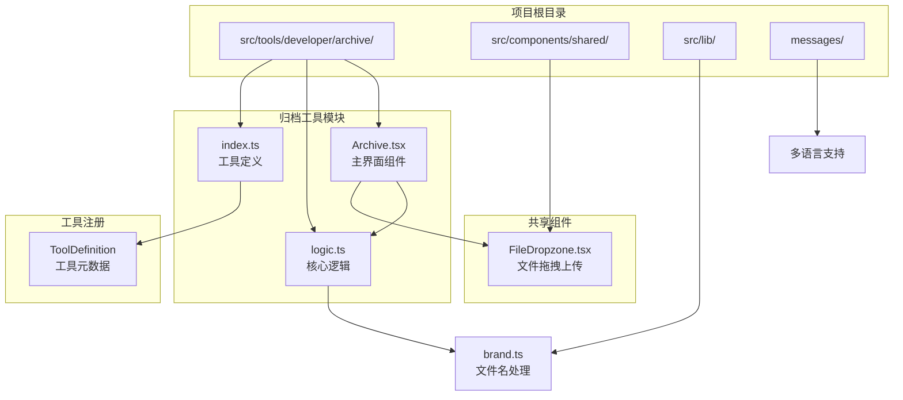
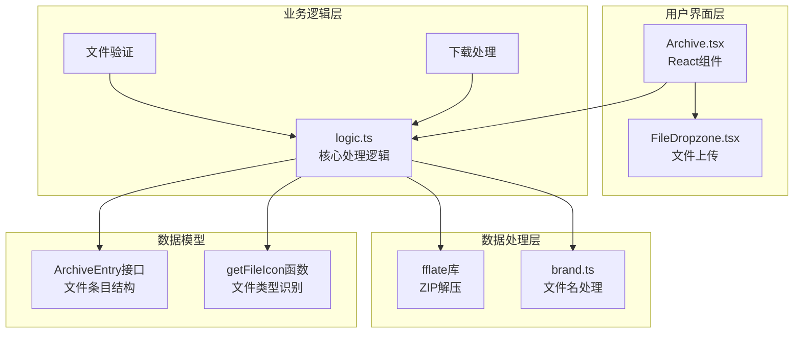
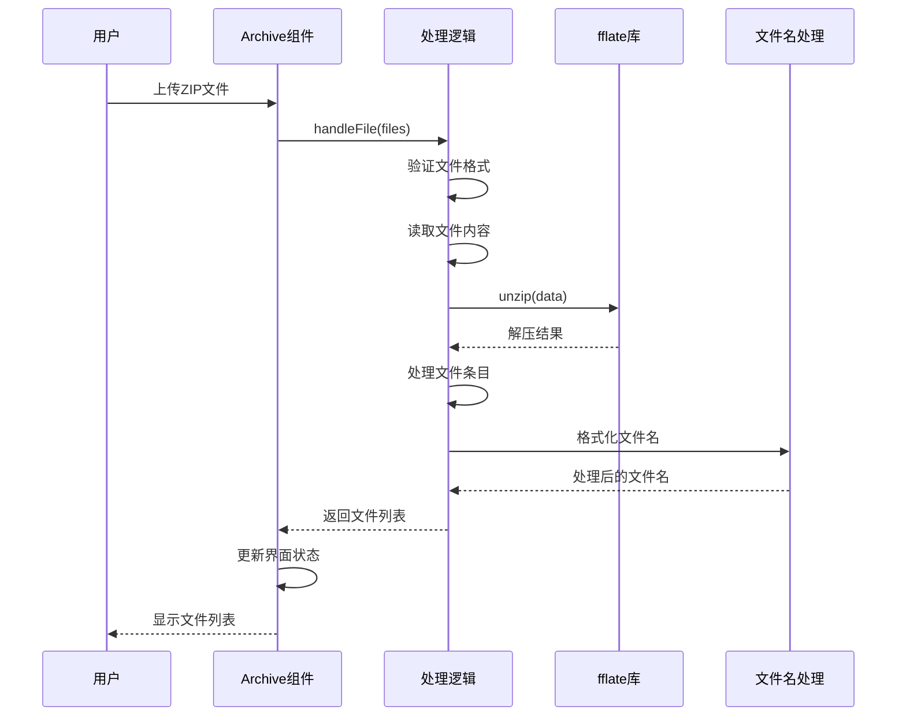
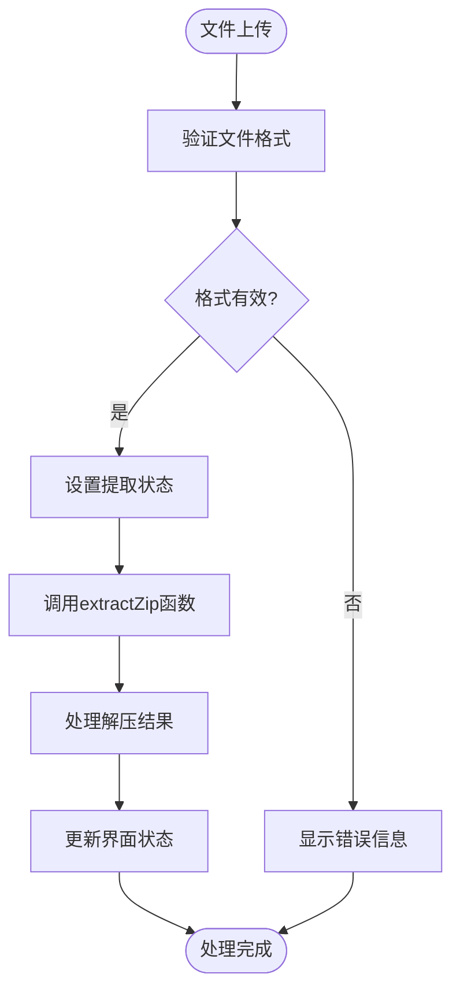
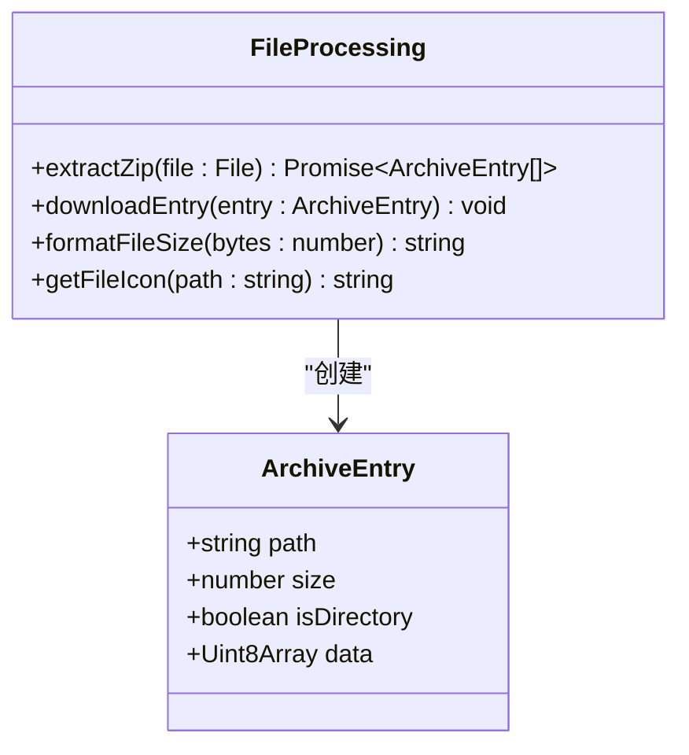
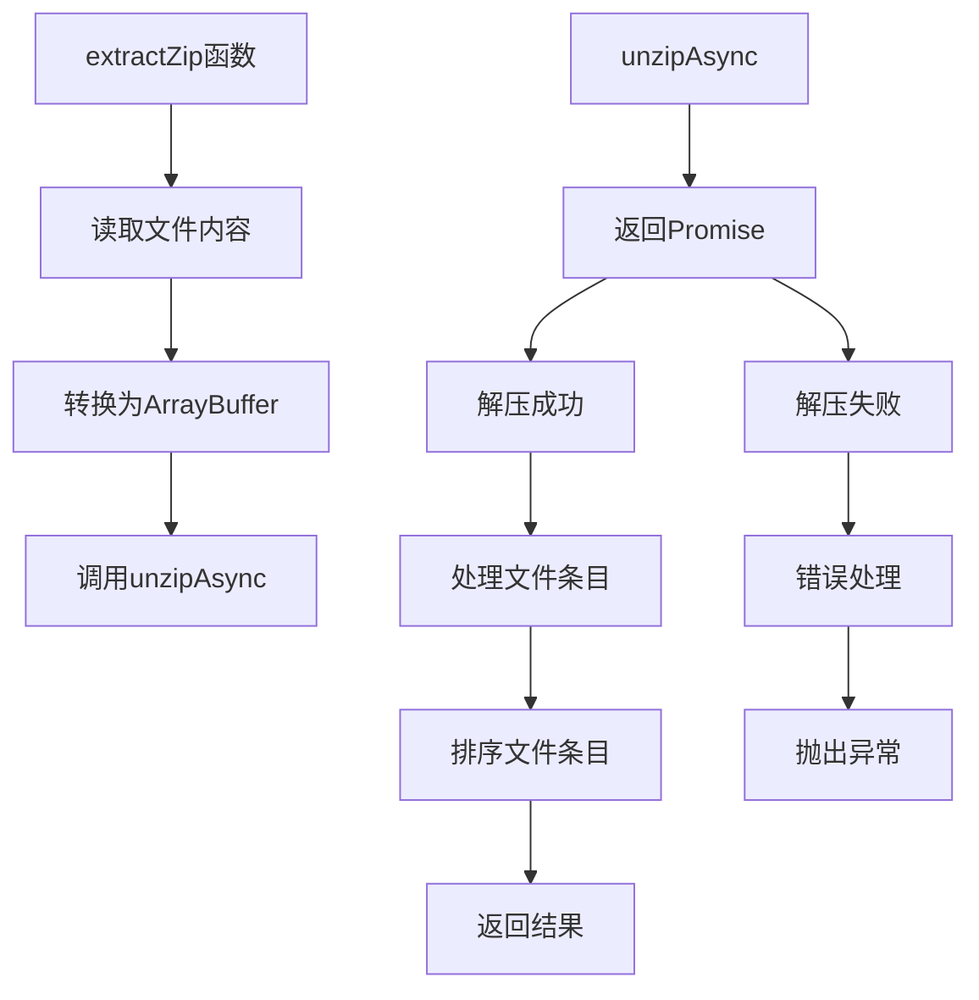
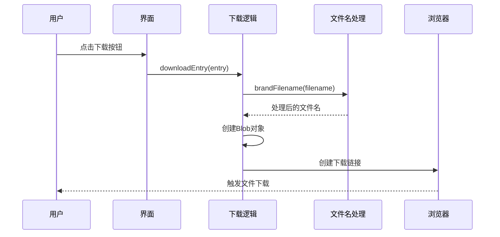
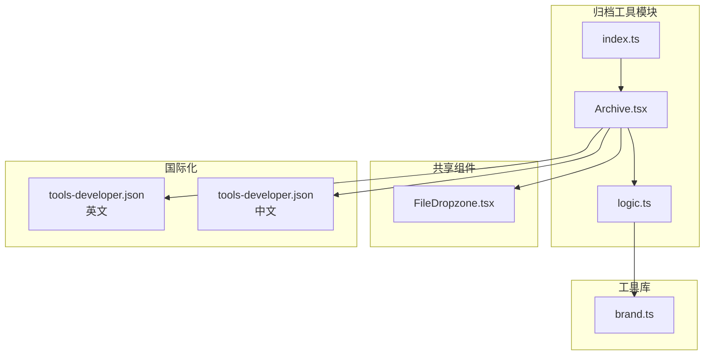
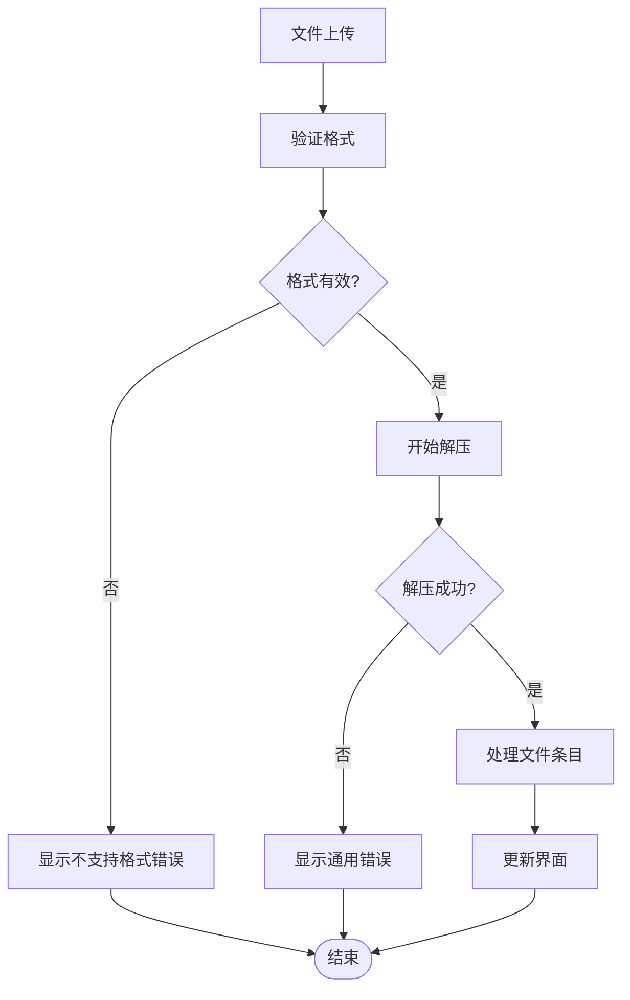

# 归档压缩工具

<cite>
**本文档引用的文件**
- [Archive.tsx](file://src/tools/developer/archive/Archive.tsx)
- [logic.ts](file://src/tools/developer/archive/logic.ts)
- [index.ts](file://src/tools/developer/archive/index.ts)
- [FileDropzone.tsx](file://src/components/shared/FileDropzone.tsx)
- [brand.ts](file://src/lib/brand.ts)
- [package.json](file://package.json)
- [README.md](file://README.md)
- [tools-developer.json (英文)](file://messages/en/tools-developer.json)
- [tools-developer.json (中文)](file://messages/zh-Hans/tools-developer.json)
</cite>

## 目录
1. [简介](#简介)
2. [项目结构](#项目结构)
3. [核心组件](#核心组件)
4. [架构概览](#架构概览)
5. [详细组件分析](#详细组件分析)
6. [依赖关系分析](#依赖关系分析)
7. [性能考虑](#性能考虑)
8. [故障排除指南](#故障排除指南)
9. [结论](#结论)
10. [附录](#附录)

## 简介

归档压缩工具是媒体工具箱项目中的一个核心功能模块，专门用于在浏览器端处理压缩文件。该项目采用隐私优先的设计理念，所有文件处理均在本地完成，确保用户数据的安全性和隐私保护。

该工具专注于ZIP格式的解压和预览功能，基于高效的fflate库实现高性能的解压缩操作。工具提供了直观的用户界面，支持文件列表浏览、目录结构查看、单文件下载等功能，为用户提供便捷的压缩包管理体验。

## 项目结构

媒体工具箱采用模块化的项目结构，归档压缩工具位于开发者工具类别下：



**图表来源**
- [Archive.tsx:1-117](file://src/tools/developer/archive/Archive.tsx#L1-L117)
- [logic.ts:1-66](file://src/tools/developer/archive/logic.ts#L1-L66)
- [index.ts:1-37](file://src/tools/developer/archive/index.ts#L1-L37)

**章节来源**
- [README.md:55-78](file://README.md#L55-L78)
- [package.json:1-45](file://package.json#L1-L45)

## 核心组件

### 主界面组件 (Archive.tsx)

Archive.tsx是归档工具的主界面组件，负责处理用户交互和界面展示。该组件实现了完整的文件处理流程，从文件上传到结果显示的全过程。

主要功能特性：
- 文件拖拽上传支持
- ZIP文件解压和预览
- 文件列表展示和目录结构查看
- 单文件下载功能
- 错误处理和状态管理

### 核心逻辑模块 (logic.ts)

logic.ts包含了归档工具的核心处理逻辑，基于fflate库实现高效的ZIP文件解压缩功能。

关键功能：
- 异步ZIP文件解压
- 文件条目结构化处理
- 文件大小格式化
- 文件类型识别和图标显示
- 单文件下载功能

### 工具定义 (index.ts)

index.ts定义了归档工具的元数据信息，包括工具标识、分类、图标、SEO配置等。

**章节来源**
- [Archive.tsx:15-117](file://src/tools/developer/archive/Archive.tsx#L15-L117)
- [logic.ts:20-66](file://src/tools/developer/archive/logic.ts#L20-L66)
- [index.ts:3-36](file://src/tools/developer/archive/index.ts#L3-L36)

## 架构概览

归档压缩工具采用了清晰的分层架构设计，确保了代码的可维护性和扩展性：



**图表来源**
- [Archive.tsx:1-117](file://src/tools/developer/archive/Archive.tsx#L1-L117)
- [logic.ts:1-66](file://src/tools/developer/archive/logic.ts#L1-L66)
- [FileDropzone.tsx:1-144](file://src/components/shared/FileDropzone.tsx#L1-L144)

### 数据流处理

归档工具的数据流处理遵循严格的异步处理模式：



**图表来源**
- [Archive.tsx:22-38](file://src/tools/developer/archive/Archive.tsx#L22-L38)
- [logic.ts:20-36](file://src/tools/developer/archive/logic.ts#L20-L36)

**章节来源**
- [Archive.tsx:1-117](file://src/tools/developer/archive/Archive.tsx#L1-L117)
- [logic.ts:1-66](file://src/tools/developer/archive/logic.ts#L1-L66)

## 详细组件分析

### 文件处理组件 (Archive.tsx)

Archive.tsx组件实现了完整的文件处理生命周期管理：

#### 状态管理
组件使用React状态管理文件处理的不同阶段：
- `entries`: 存储解压后的文件条目列表
- `extracting`: 处理状态指示器
- `error`: 错误信息存储
- `file`: 当前处理的文件对象

#### 文件处理流程


**图表来源**
- [Archive.tsx:22-38](file://src/tools/developer/archive/Archive.tsx#L22-L38)

#### 文件类型识别
组件实现了智能的文件类型识别功能，根据文件扩展名自动分配相应的图标：
- 图片文件：蓝色图标
- 代码文件：绿色图标  
- 文档文件：默认图标
- 目录：黄色文件夹图标

**章节来源**
- [Archive.tsx:15-117](file://src/tools/developer/archive/Archive.tsx#L15-L117)

### 核心处理逻辑 (logic.ts)

logic.ts模块提供了归档工具的核心功能实现：

#### ArchiveEntry接口设计


**图表来源**
- [logic.ts:4-9](file://src/tools/developer/archive/logic.ts#L4-L9)

#### 异步解压实现
解压功能基于Promise封装，确保异步操作的可靠性和错误处理：



**图表来源**
- [logic.ts:11-36](file://src/tools/developer/archive/logic.ts#L11-L36)

**章节来源**
- [logic.ts:1-66](file://src/tools/developer/archive/logic.ts#L1-L66)

### 文件下载功能

下载功能实现了单文件下载的完整流程，确保用户可以精确控制需要的文件：

#### 下载流程


**图表来源**
- [logic.ts:38-47](file://src/tools/developer/archive/logic.ts#L38-L47)
- [brand.ts:3-6](file://src/lib/brand.ts#L3-L6)

**章节来源**
- [logic.ts:38-47](file://src/tools/developer/archive/logic.ts#L38-L47)
- [brand.ts:1-7](file://src/lib/brand.ts#L1-L7)

## 依赖关系分析

### 外部依赖

归档压缩工具依赖于以下关键外部库：

```mermaid
graph LR
subgraph "核心依赖"
FFLATE[fflate@0.8.2<br/>ZIP解压库]
NEXT_INTL[next-intl@4.8.3<br/>国际化支持]
LUCIDE_REACT[lucide-react@0.577.0<br/>图标库]
end
subgraph "项目内部依赖"
FILEDROPZONE[FileDropzone.tsx<br/>文件上传组件]
BRAND[brand.ts<br/>文件名处理]
ARCHIVE[Archive.tsx<br/>主界面组件]
LOGIC[logic.ts<br/>核心逻辑]
end
ARCHIVE --> LOGIC
ARCHIVE --> FILEDROPZONE
LOGIC --> FFLATE
LOGIC --> BRAND
ARCHIVE --> NEXT_INTL
ARCHIVE --> LUCIDE_REACT
```

**图表来源**
- [package.json:11-32](file://package.json#L11-L32)
- [Archive.tsx:1-13](file://src/tools/developer/archive/Archive.tsx#L1-L13)

### 内部模块依赖

项目内部模块之间的依赖关系清晰明确：



**图表来源**
- [index.ts:1-37](file://src/tools/developer/archive/index.ts#L1-L37)
- [Archive.tsx:1-20](file://src/tools/developer/archive/Archive.tsx#L1-L20)

**章节来源**
- [package.json:1-45](file://package.json#L1-L45)
- [index.ts:1-37](file://src/tools/developer/archive/index.ts#L1-L37)

## 性能考虑

### 解压性能优化

归档工具在性能方面采用了多项优化策略：

#### 内存管理
- 使用ArrayBuffer进行高效的数据处理
- 及时释放Blob URL资源避免内存泄漏
- 异步处理避免阻塞主线程

#### 文件处理策略
- 基于fflate库实现高性能解压
- 按需加载和处理文件内容
- 支持大文件处理但受设备内存限制

### 用户体验优化

#### 加载状态管理
- 提供实时的处理状态反馈
- 支持拖拽上传提升用户体验
- 即时的错误提示和处理

#### 界面响应性
- 文件列表的懒加载显示
- 目录层级的递进式展开
- 文件大小的动态格式化

## 故障排除指南

### 常见问题及解决方案

#### 不支持的文件格式
**问题描述**：尝试处理非ZIP格式的压缩文件
**解决方法**：当前版本仅支持ZIP格式，其他格式暂不支持

#### 文件过大导致处理失败
**问题描述**：大文件解压时出现内存不足错误
**解决方法**：
- 检查设备可用内存
- 分割大文件为多个小文件
- 关闭其他占用内存的应用程序

#### 解压过程中的异常
**问题描述**：解压过程中出现未知错误
**解决方法**：
- 验证ZIP文件的完整性
- 尝试重新下载或获取文件
- 检查文件是否被其他程序占用

### 错误处理机制

归档工具实现了完善的错误处理机制：



**图表来源**
- [Archive.tsx:30-37](file://src/tools/developer/archive/Archive.tsx#L30-L37)

**章节来源**
- [Archive.tsx:18-38](file://src/tools/developer/archive/Archive.tsx#L18-L38)

## 结论

归档压缩工具作为媒体工具箱的重要组成部分，展现了现代Web应用在隐私保护和用户体验方面的最佳实践。该工具通过以下特点实现了优秀的功能表现：

### 技术优势
- **隐私优先**：所有处理在浏览器本地完成，确保数据安全
- **性能高效**：基于fflate库实现高性能的ZIP解压功能
- **用户体验**：直观的界面设计和流畅的交互体验
- **可扩展性**：模块化的架构设计便于功能扩展

### 应用价值
该工具为用户提供了便捷的压缩包管理解决方案，支持文件预览、目录浏览、单文件下载等核心功能，满足了日常工作中对压缩文件处理的各种需求。

### 发展前景
随着Web技术的不断发展，归档工具可以在以下方面进一步完善：
- 支持更多压缩格式（TAR、GZIP、BZIP2等）
- 增强批量处理和分卷压缩功能
- 优化大文件处理的性能表现
- 扩展加密和安全功能

## 附录

### 使用示例

#### 基本文件预览
1. 访问归档工具页面
2. 将ZIP文件拖拽到上传区域
3. 查看解压后的文件列表
4. 浏览目录结构和文件信息

#### 单文件下载
1. 在文件列表中选择目标文件
2. 点击文件右侧的下载按钮
3. 文件自动保存到本地设备

#### 目录导航
1. 点击文件夹图标展开目录
2. 使用缩进显示层级关系
3. 通过面包屑导航返回上级目录

### 配置选项

#### 文件格式支持
- **当前支持**：ZIP格式
- **计划支持**：TAR、GZIP、BZIP2等格式

#### 性能配置
- **内存限制**：受设备可用内存限制
- **文件大小**：理论上支持任意大小文件
- **处理速度**：基于fflate库的高性能实现

### 集成指南

#### 开发者集成
```typescript
// 导入归档工具
import Archive from '@/tools/developer/archive/Archive';

// 在应用中使用
<Archive />

// 获取文件处理结果
const entries = await extractZip(file);
```

#### 自定义扩展
- 可扩展支持更多压缩格式
- 可添加批量处理功能
- 可集成加密和解密功能
- 可添加进度监控和错误恢复机制

**章节来源**
- [tools-developer.json (英文):189-231](file://messages/en/tools-developer.json#L189-L231)
- [tools-developer.json (中文):189-231](file://messages/zh-Hans/tools-developer.json#L189-L231)