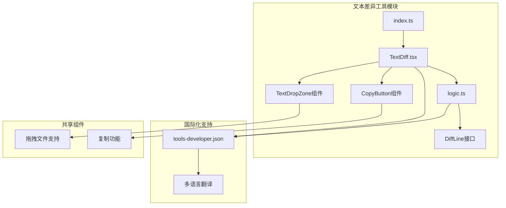
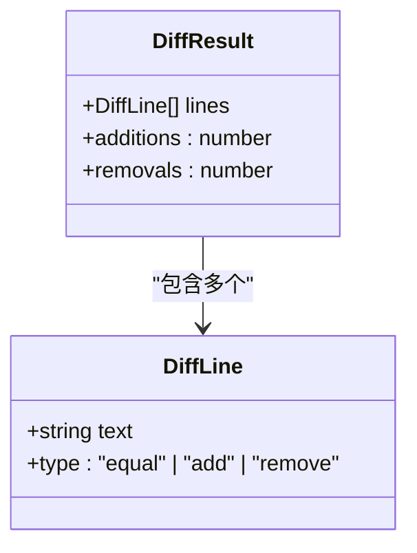
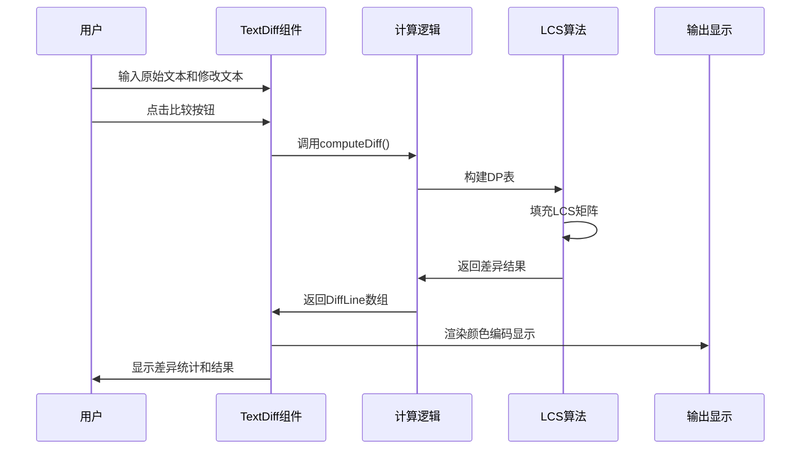
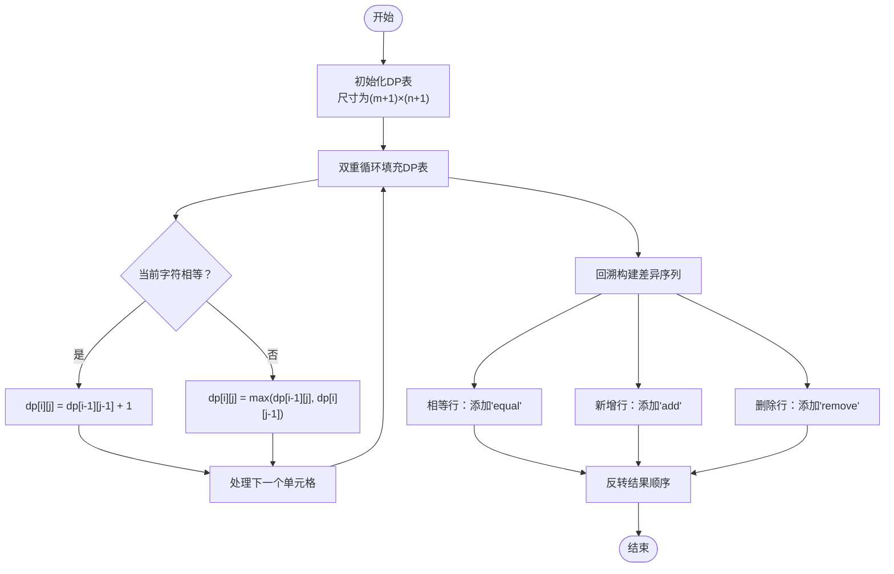
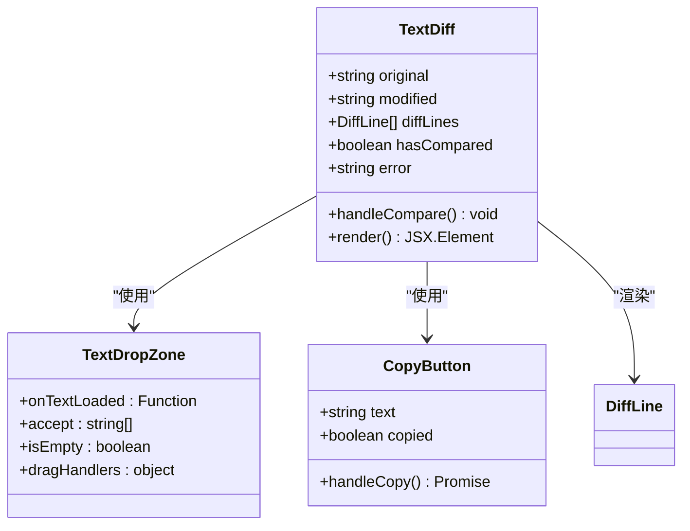
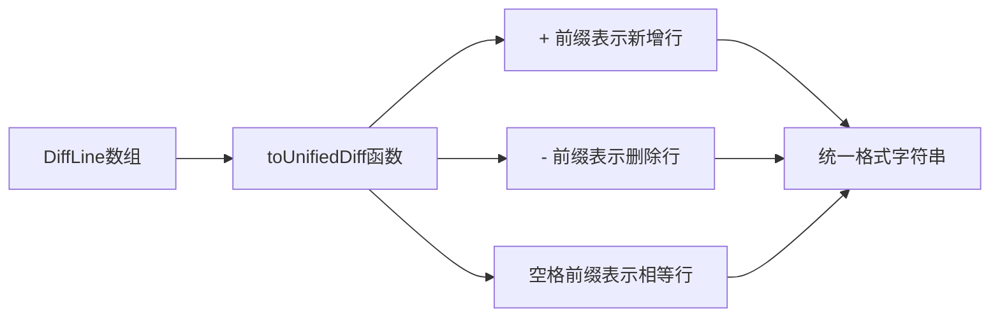
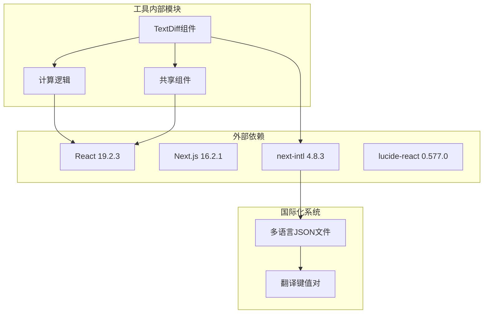
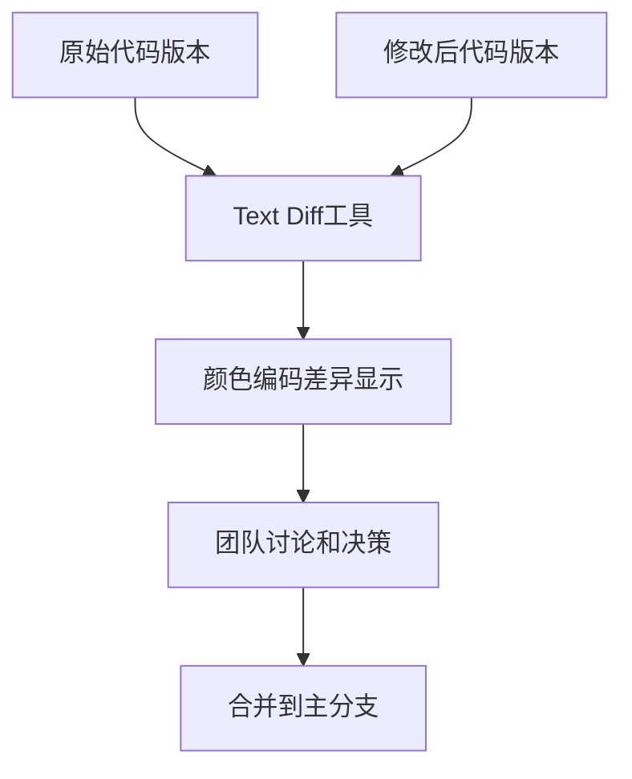

# 文本差异工具

<cite>
**本文档引用的文件**
- [src/tools/developer/text-diff/index.ts](file://src/tools/developer/text-diff/index.ts)
- [src/tools/developer/text-diff/logic.ts](file://src/tools/developer/text-diff/logic.ts)
- [src/tools/developer/text-diff/TextDiff.tsx](file://src/tools/developer/text-diff/TextDiff.tsx)
- [messages/en/tools-developer.json](file://messages/en/tools-developer.json)
- [src/components/shared/TextDropZone.tsx](file://src/components/shared/TextDropZone.tsx)
- [src/components/shared/CopyButton.tsx](file://src/components/shared/CopyButton.tsx)
- [package.json](file://package.json)
</cite>

## 目录
1. [简介](#简介)
2. [项目结构](#项目结构)
3. [核心组件](#核心组件)
4. [架构概览](#架构概览)
5. [详细组件分析](#详细组件分析)
6. [依赖分析](#依赖分析)
7. [性能考虑](#性能考虑)
8. [故障排除指南](#故障排除指南)
9. [结论](#结论)
10. [附录](#附录)

## 简介

文本差异工具是一个基于浏览器的在线文本比较工具，专门用于对比两个文本版本之间的差异。该工具实现了经典的最长公共子序列（LCS）算法，能够准确识别文本中的新增、删除和未更改行，并提供直观的颜色编码显示。

该工具的核心价值在于：
- **隐私保护**：所有处理都在浏览器本地完成，无需上传任何数据到服务器
- **算法精确性**：使用标准的LCS算法确保差异检测的准确性
- **用户友好**：提供实时预览、颜色编码和统一格式输出
- **多语言支持**：支持12种语言的界面本地化

## 项目结构

文本差异工具位于开发者工具模块中，采用清晰的分层架构：

**图表来源**
- [src/tools/developer/text-diff/index.ts:1-37](file://src/tools/developer/text-diff/index.ts#L1-L37)
- [src/tools/developer/text-diff/TextDiff.tsx:1-131](file://src/tools/developer/text-diff/TextDiff.tsx#L1-L131)
- [src/tools/developer/text-diff/logic.ts:1-75](file://src/tools/developer/text-diff/logic.ts#L1-L75)

**章节来源**
- [src/tools/developer/text-diff/index.ts:1-37](file://src/tools/developer/text-diff/index.ts#L1-L37)
- [src/tools/developer/text-diff/TextDiff.tsx:1-131](file://src/tools/developer/text-diff/TextDiff.tsx#L1-L131)
- [src/tools/developer/text-diff/logic.ts:1-75](file://src/tools/developer/text-diff/logic.ts#L1-L75)

## 核心组件

### DiffLine 接口定义

**图表来源**
- [src/tools/developer/text-diff/logic.ts:1-4](file://src/tools/developer/text-diff/logic.ts#L1-L4)

### 主要功能模块

1. **computeDiff 函数**：实现LCS算法的核心逻辑
2. **toUnifiedDiff 函数**：生成统一格式的差异输出
3. **TextDiff 组件**：提供用户界面和交互功能
4. **工具注册系统**：集成到整体工具框架中

**章节来源**
- [src/tools/developer/text-diff/logic.ts:6-75](file://src/tools/developer/text-diff/logic.ts#L6-L75)
- [src/tools/developer/text-diff/TextDiff.tsx:10-131](file://src/tools/developer/text-diff/TextDiff.tsx#L10-L131)

## 架构概览

文本差异工具采用客户端单页应用架构，所有计算都在浏览器中完成：

**图表来源**
- [src/tools/developer/text-diff/TextDiff.tsx:19-28](file://src/tools/developer/text-diff/TextDiff.tsx#L19-L28)
- [src/tools/developer/text-diff/logic.ts:9-56](file://src/tools/developer/text-diff/logic.ts#L9-L56)

## 详细组件分析

### LCS算法实现

文本差异工具使用经典的最长公共子序列（Longest Common Subsequence）算法来识别文本差异：

#### 算法复杂度分析
- **时间复杂度**：O(m×n)，其中m和n分别是两个文本的行数
- **空间复杂度**：O(m×n)，用于存储动态规划表
- **内存限制**：当m×n超过5,000,000时抛出错误，防止内存溢出

#### 动态规划表构建过程

**图表来源**
- [src/tools/developer/text-diff/logic.ts:21-55](file://src/tools/developer/text-diff/logic.ts#L21-L55)

#### 差异类型识别

工具支持三种基本差异类型：

1. **相等（Equal）**：两文本中完全相同的行
2. **新增（Add）**：仅存在于修改文本中的行
3. **删除（Remove）**：仅存在于原始文本中的行

**章节来源**
- [src/tools/developer/text-diff/logic.ts:1-56](file://src/tools/developer/text-diff/logic.ts#L1-L56)

### 用户界面组件

#### TextDiff 主组件

**图表来源**
- [src/tools/developer/text-diff/TextDiff.tsx:10-131](file://src/tools/developer/text-diff/TextDiff.tsx#L10-L131)
- [src/components/shared/TextDropZone.tsx:22-44](file://src/components/shared/TextDropZone.tsx#L22-L44)
- [src/components/shared/CopyButton.tsx:9-57](file://src/components/shared/CopyButton.tsx#L9-L57)

#### 颜色编码显示系统

| 差异类型 | 颜色方案 | CSS类名 |
|---------|---------|--------|
| 新增（Add） | 绿色背景，深绿色文字 | `bg-green-100 text-green-800 dark:bg-green-950 dark:text-green-300` |
| 删除（Remove） | 红色背景，深红色文字 | `bg-red-100 text-red-800 dark:bg-red-950 dark:text-red-300` |
| 相等（Equal） | 灰色文字，柔和显示 | `text-muted-foreground` |

**章节来源**
- [src/tools/developer/text-diff/TextDiff.tsx:107-125](file://src/tools/developer/text-diff/TextDiff.tsx#L107-L125)

### 统一差异格式输出

工具提供统一格式的差异输出，便于与其他工具集成：

**图表来源**
- [src/tools/developer/text-diff/logic.ts:61-74](file://src/tools/developer/text-diff/logic.ts#L61-L74)

**章节来源**
- [src/tools/developer/text-diff/logic.ts:58-75](file://src/tools/developer/text-diff/logic.ts#L58-L75)

## 依赖分析

### 核心依赖关系

**图表来源**
- [package.json:11-32](file://package.json#L11-L32)
- [src/tools/developer/text-diff/TextDiff.tsx:1-10](file://src/tools/developer/text-diff/TextDiff.tsx#L1-L10)

### 开发工具链

| 依赖类型 | 包名称 | 版本 | 用途 |
|---------|-------|------|------|
| 运行时依赖 | react | 19.2.3 | 用户界面框架 |
| 运行时依赖 | next | 16.2.1 | Web应用框架 |
| 运行时依赖 | next-intl | 4.8.3 | 国际化支持 |
| 开发依赖 | typescript | ^5 | 类型检查 |
| 开发依赖 | eslint | ^9 | 代码质量 |
| 开发依赖 | tailwindcss | ^4 | 样式框架 |

**章节来源**
- [package.json:11-45](file://package.json#L11-L45)

## 性能考虑

### 内存管理策略

1. **输入大小限制**：当两个文本的行数乘积超过5,000,000时抛出错误
2. **动态规划表优化**：使用二维数组存储中间结果
3. **渐进式渲染**：大文本通过虚拟滚动优化显示性能

### 算法优化技术

1. **早期终止**：对于空输入快速返回
2. **内存复用**：重用数组实例减少垃圾回收
3. **原地更新**：避免不必要的数据拷贝

### 用户体验优化

1. **实时预览**：输入变化时即时更新差异显示
2. **加载状态**：长文本处理时显示进度指示
3. **错误处理**：友好的错误消息和恢复机制

## 故障排除指南

### 常见问题及解决方案

#### 1. 内存不足错误
**症状**：比较大型文本时出现内存错误
**原因**：输入文本过大导致DP表内存超限
**解决方案**：
- 分割大文件进行多次比较
- 使用外部差异工具处理超大文件
- 清理不需要的文本内容

#### 2. 性能缓慢问题
**症状**：大文本比较响应时间过长
**原因**：O(m×n)算法的时间复杂度
**解决方案**：
- 优化文本结构，减少不必要的行
- 使用增量比较只比较变化部分
- 考虑使用更高效的算法变体

#### 3. 显示异常问题
**症状**：差异显示不正确或颜色异常
**原因**：CSS样式冲突或浏览器兼容性问题
**解决方案**：
- 检查自定义CSS覆盖
- 更新浏览器版本
- 清除浏览器缓存

**章节来源**
- [src/tools/developer/text-diff/logic.ts:16-19](file://src/tools/developer/text-diff/logic.ts#L16-L19)
- [src/tools/developer/text-diff/TextDiff.tsx:79-83](file://src/tools/developer/text-diff/TextDiff.tsx#L79-L83)

## 结论

文本差异工具是一个功能完整、设计良好的浏览器端文本比较解决方案。其核心优势包括：

1. **算法准确性**：基于标准LCS算法，确保差异检测的精确性
2. **隐私保护**：完全本地处理，无数据外传风险
3. **用户体验**：直观的颜色编码和实时反馈
4. **可扩展性**：模块化设计便于功能扩展

该工具适用于多种场景，从简单的代码审查到复杂的配置文件比较，都能提供可靠的差异分析能力。

## 附录

### 使用示例场景

#### 1. 代码审查流程

#### 2. 配置文件比较
- 开发环境配置与生产环境配置对比
- 数据库迁移脚本前后版本对比
- 容器编排文件变更追踪

#### 3. 版本控制集成
- 本地代码变更预览
- 提交前差异确认
- 合并冲突解决辅助

### 扩展功能建议

1. **忽略空白字符选项**：支持忽略多余空格和制表符
2. **大小写敏感性控制**：可配置是否区分大小写
3. **批量文件比较**：支持同时比较多个文件对
4. **正则表达式过滤**：按模式过滤特定类型的差异
5. **差异统计报告**：生成详细的差异分析报告