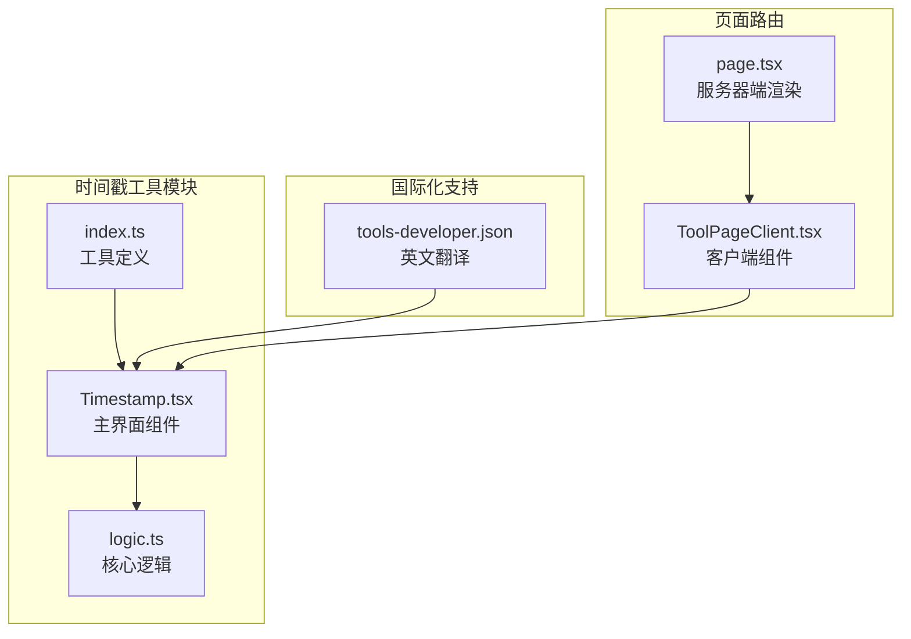
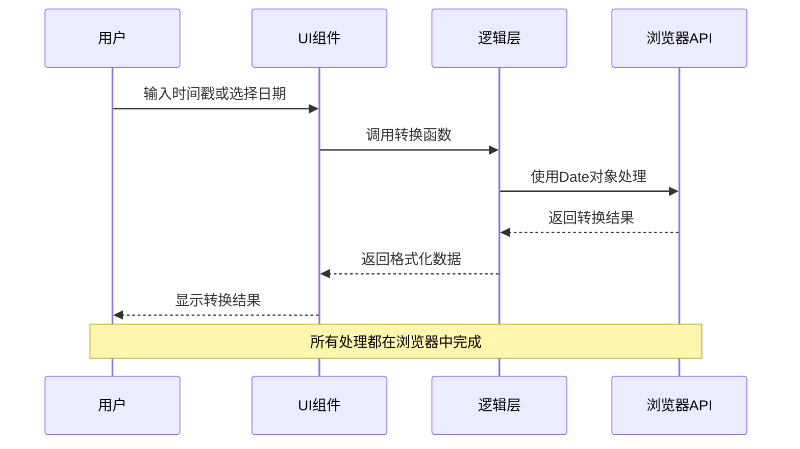
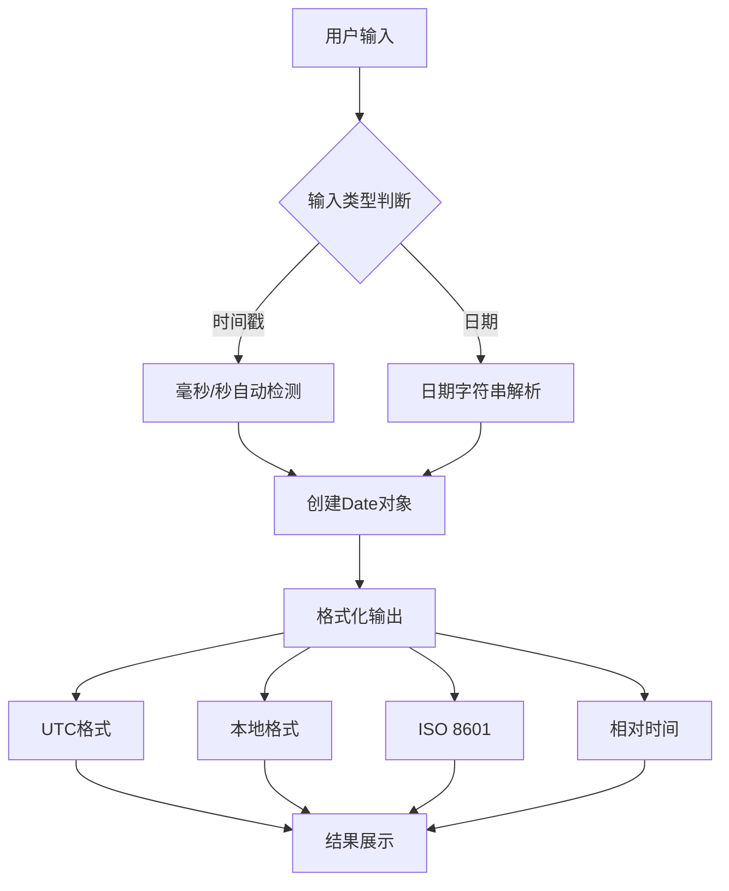
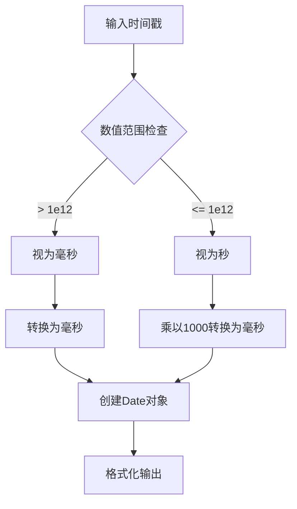
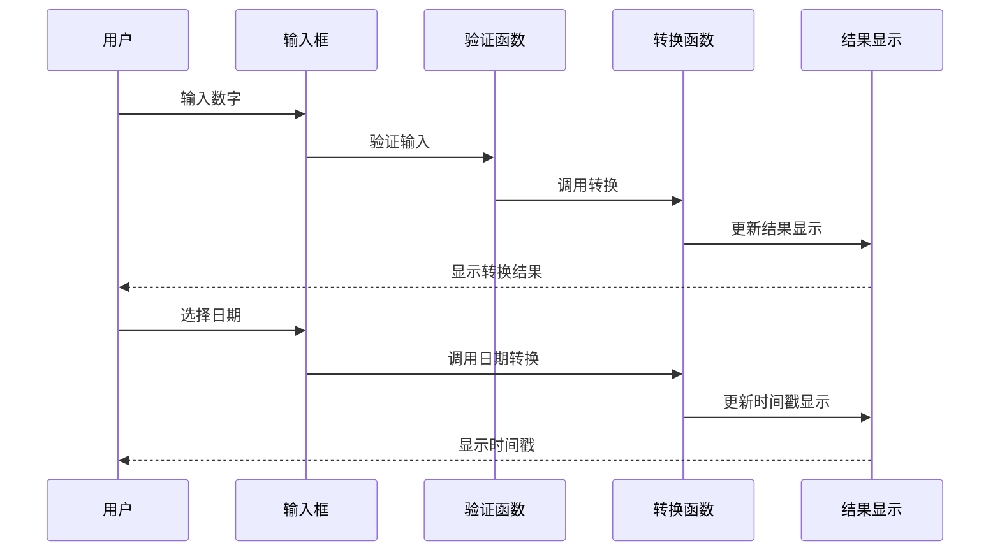
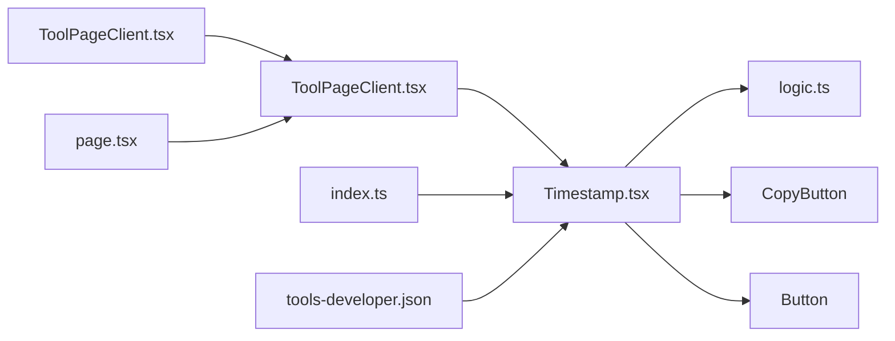

# 时间戳工具

<cite>
**本文档引用的文件**
- [Timestamp.tsx](file://src/tools/developer/timestamp/Timestamp.tsx)
- [logic.ts](file://src/tools/developer/timestamp/logic.ts)
- [index.ts](file://src/tools/developer/timestamp/index.ts)
- [tools-developer.json](file://messages/en/tools-developer.json)
- [ToolPageClient.tsx](file://src/app/[locale]/tools/[category]/[slug]/ToolPageClient.tsx)
- [page.tsx](file://src/app/[locale]/tools/[category]/[slug]/page.tsx)
</cite>

## 目录
1. [简介](#简介)
2. [项目结构](#项目结构)
3. [核心组件](#核心组件)
4. [架构概览](#架构概览)
5. [详细组件分析](#详细组件分析)
6. [依赖关系分析](#依赖关系分析)
7. [性能考虑](#性能考虑)
8. [故障排除指南](#故障排除指南)
9. [结论](#结论)
10. [附录](#附录)

## 简介

时间戳工具是一个功能强大的在线Unix时间戳转换器，允许用户在Unix时间戳、UTC时间戳和本地时间戳之间进行双向转换。该工具提供了直观的用户界面，支持实时转换、毫秒级精度处理和多种时间格式显示。

### 主要特性
- **双向转换**：支持Unix时间戳与人类可读日期之间的相互转换
- **多格式显示**：同时显示UTC时间、本地时间、ISO 8601格式和相对时间
- **毫秒精度**：自动检测并处理毫秒级Unix时间戳
- **实时更新**：输入变化时即时显示转换结果
- **浏览器本地处理**：所有计算都在用户浏览器中完成，无需网络传输

## 项目结构

时间戳工具位于开发者工具类别下，采用模块化设计，包含UI组件、业务逻辑和国际化支持。

**图表来源**
- [Timestamp.tsx:1-177](file://src/tools/developer/timestamp/Timestamp.tsx#L1-L177)
- [logic.ts:1-67](file://src/tools/developer/timestamp/logic.ts#L1-L67)
- [index.ts:1-37](file://src/tools/developer/timestamp/index.ts#L1-L37)

**章节来源**
- [Timestamp.tsx:1-177](file://src/tools/developer/timestamp/Timestamp.tsx#L1-L177)
- [logic.ts:1-67](file://src/tools/developer/timestamp/logic.ts#L1-L67)
- [index.ts:1-37](file://src/tools/developer/timestamp/index.ts#L1-L37)

## 核心组件

### 主界面组件 (Timestamp.tsx)

主界面组件负责用户交互和结果显示，实现了以下核心功能：

- **状态管理**：维护时间戳输入、日期输入、转换结果等状态
- **实时转换**：输入变化时自动触发转换逻辑
- **错误处理**：提供友好的错误提示信息
- **一键复制**：支持快速复制转换结果

### 业务逻辑组件 (logic.ts)

业务逻辑组件封装了所有时间转换算法，提供三个核心函数：

- `timestampToDate()`: Unix时间戳转日期
- `dateToTimestamp()`: 日期转Unix时间戳
- `nowTimestamp()`: 获取当前时间戳

### 工具定义 (index.ts)

工具定义文件描述了时间戳工具的元数据，包括：
- 工具标识符和分类
- 图标配置
- SEO设置
- 常见问题配置

**章节来源**
- [Timestamp.tsx:9-177](file://src/tools/developer/timestamp/Timestamp.tsx#L9-L177)
- [logic.ts:1-67](file://src/tools/developer/timestamp/logic.ts#L1-L67)
- [index.ts:1-37](file://src/tools/developer/timestamp/index.ts#L1-L37)

## 架构概览

时间戳工具采用前后端分离的架构设计，结合了现代React Hooks模式和浏览器原生API。

**图表来源**
- [Timestamp.tsx:27-103](file://src/tools/developer/timestamp/Timestamp.tsx#L27-L103)
- [logic.ts:9-42](file://src/tools/developer/timestamp/logic.ts#L9-L42)

### 数据流图

**图表来源**
- [Timestamp.tsx:53-103](file://src/tools/developer/timestamp/Timestamp.tsx#L53-L103)
- [logic.ts:9-22](file://src/tools/developer/timestamp/logic.ts#L9-L22)

## 详细组件分析

### 时间戳转换算法

时间戳转换是整个工具的核心功能，采用了智能的精度检测机制。

#### 自动精度检测

**图表来源**
- [Timestamp.tsx:66-68](file://src/tools/developer/timestamp/Timestamp.tsx#L66-L68)
- [logic.ts:9-11](file://src/tools/developer/timestamp/logic.ts#L9-L11)

#### 相对时间计算

相对时间功能提供了人性化的时间显示，支持多种时间单位：

| 时间单位 | 范围 | 示例 |
|---------|------|------|
| 秒 | 0-59 | 30 seconds ago |
| 分钟 | 1-59 | 5 minutes ago |
| 小时 | 1-23 | 2 hours ago |
| 天 | 1-29 | 1 day ago |
| 月 | 1-11 | 6 months ago |
| 年 | 1+ | 2 years ago |

**章节来源**
- [Timestamp.tsx:27-46](file://src/tools/developer/timestamp/Timestamp.tsx#L27-L46)
- [logic.ts:44-66](file://src/tools/developer/timestamp/logic.ts#L44-L66)

### 用户界面设计

#### 实时输入处理

界面采用受控组件模式，实现了以下输入处理流程：

**图表来源**
- [Timestamp.tsx:53-103](file://src/tools/developer/timestamp/Timestamp.tsx#L53-L103)

#### 错误处理机制

工具实现了多层次的错误处理：

1. **输入验证**：检查数字格式和有效性
2. **日期解析**：验证日期字符串格式
3. **边界检查**：防止无效的时间值
4. **用户反馈**：提供清晰的错误消息

**章节来源**
- [Timestamp.tsx:61-82](file://src/tools/developer/timestamp/Timestamp.tsx#L61-L82)
- [logic.ts:12-14](file://src/tools/developer/timestamp/logic.ts#L12-L14)

### 国际化支持

时间戳工具支持多语言界面，主要包含以下功能：

- **界面文本**：所有用户可见的文本都支持国际化
- **占位符文本**：输入框的提示文本可本地化
- **错误消息**：错误提示信息支持多语言
- **FAQ内容**：常见问题解答支持多语言版本

**章节来源**
- [tools-developer.json:513-562](file://messages/en/tools-developer.json#L513-L562)

## 依赖关系分析

### 组件间依赖

**图表来源**
- [ToolPageClient.tsx:29-58](file://src/app/[locale]/tools/[category]/[slug]/ToolPageClient.tsx#L29-L58)
- [page.tsx:33-108](file://src/app/[locale]/tools/[category]/[slug]/page.tsx#L33-L108)

### 外部依赖

时间戳工具的外部依赖非常有限，主要依赖于：

- **React Hooks**：useState、useEffect、useCallback
- **Next.js国际化**：next-intl用于多语言支持
- **浏览器原生API**：Date对象用于时间处理
- **自定义UI组件**：CopyButton、Button等

**章节来源**
- [Timestamp.tsx:3-7](file://src/tools/developer/timestamp/Timestamp.tsx#L3-L7)
- [ToolPageClient.tsx:3-9](file://src/app/[locale]/tools/[category]/[slug]/ToolPageClient.tsx#L3-L9)

## 性能考虑

### 浏览器本地处理优势

时间戳工具采用纯前端实现，具有以下性能优势：

- **零网络延迟**：所有计算在用户浏览器中完成
- **无服务器负载**：不需要后端服务器处理请求
- **离线可用**：页面加载后可完全离线使用
- **内存效率**：只在需要时创建和销毁DOM元素

### 优化策略

1. **懒加载组件**：使用React.lazy按需加载工具组件
2. **状态缓存**：避免重复计算相同的结果
3. **防抖处理**：减少频繁输入导致的重复计算
4. **虚拟滚动**：对于大量历史记录使用虚拟化技术

## 故障排除指南

### 常见问题及解决方案

#### 时间戳格式错误

**问题**：输入的时间戳格式不正确
**解决方法**：
- 确认输入的是纯数字
- 检查是否包含多余的空格或字符
- 验证时间戳是否在合理范围内

#### 日期解析失败

**问题**：日期字符串无法被正确解析
**解决方法**：
- 使用标准的ISO 8601格式：YYYY-MM-DDTHH:mm:ss
- 确保日期字符串符合JavaScript Date构造函数要求
- 检查时区设置是否正确

#### 浏览器兼容性问题

**问题**：某些浏览器不支持特定功能
**解决方法**：
- 确保使用现代浏览器版本
- 检查浏览器的JavaScript支持情况
- 考虑使用polyfill增强兼容性

**章节来源**
- [Timestamp.tsx:61-82](file://src/tools/developer/timestamp/Timestamp.tsx#L61-L82)
- [logic.ts:12-14](file://src/tools/developer/timestamp/logic.ts#L12-L14)

## 结论

时间戳工具是一个设计精良的在线时间转换工具，具有以下突出特点：

### 技术优势
- **纯前端实现**：确保用户隐私和数据安全
- **实时响应**：提供即时的用户体验
- **多格式支持**：满足不同场景的需求
- **国际化支持**：面向全球用户的本地化体验

### 应用价值
- **开发调试**：快速转换API响应时间戳
- **日志分析**：将Unix时间戳转换为可读格式
- **数据同步**：统一不同系统的时区表示
- **系统监控**：实时显示系统时间状态

该工具通过简洁的界面设计和强大的功能实现，为用户提供了高效便捷的时间戳转换解决方案。

## 附录

### 使用示例

#### 基本转换操作
1. 在"Unix时间戳"输入框中输入时间戳
2. 观察下方显示的UTC、本地时间和ISO 8601格式
3. 使用"设置为现在"按钮获取当前时间戳
4. 通过日期选择器输入具体时间获取对应的时间戳

#### 高级功能
- **毫秒精度**：自动检测并处理毫秒级时间戳
- **相对时间**：显示"几分钟前"、"几小时前"等人性化时间
- **批量转换**：支持连续进行多次转换操作
- **结果复制**：一键复制任何格式的转换结果

### 开发者信息

#### 扩展建议
- 添加更多时间格式支持（RFC 2822等）
- 实现批量转换功能
- 增加时区选择器
- 提供历史记录功能

#### 维护要点
- 定期测试不同浏览器的兼容性
- 更新国际化翻译文件
- 优化性能表现
- 加强错误处理机制