# 时间戳工具

<cite>
**本文档引用的文件**
- [Timestamp.tsx](file://src/tools/developer/timestamp/Timestamp.tsx)
- [logic.ts](file://src/tools/developer/timestamp/logic.ts)
- [constants.ts](file://src/tools/developer/timestamp/constants.ts)
- [index.ts](file://src/tools/developer/timestamp/index.ts)
- [NowCard.tsx](file://src/tools/developer/timestamp/components/NowCard.tsx)
- [TimezoneSelector.tsx](file://src/tools/developer/timestamp/components/TimezoneSelector.tsx)
- [PresetButtons.tsx](file://src/tools/developer/timestamp/components/PresetButtons.tsx)
- [SingleTab.tsx](file://src/tools/developer/timestamp/tabs/SingleTab.tsx)
- [BatchTab.tsx](file://src/tools/developer/timestamp/tabs/BatchTab.tsx)
- [CodeTab.tsx](file://src/tools/developer/timestamp/tabs/CodeTab.tsx)
- [JwtTab.tsx](file://src/tools/developer/timestamp/tabs/JwtTab.tsx)
- [tools-developer.json](file://messages/en/tools-developer.json)
- [ToolPageClient.tsx](file://src/app/[locale]/tools/[category]/[slug]/ToolPageClient.tsx)
- [page.tsx](file://src/app/[locale]/tools/[category]/[slug]/page.tsx)
</cite>

## 更新摘要
**所做更改**
- 新增综合时间戳转换功能，支持秒、毫秒、微秒、纳秒级精度
- 新增完整的时区支持系统，包含本地时区检测和时区偏移计算
- 新增批量转换功能，支持多行输入和CSV导出
- 新增代码片段生成器，支持Python、JavaScript、Go、Bash、SQL
- 新增JWT解码功能，支持解析JWT载荷和时间戳声明
- 重构用户界面为多标签页架构，提升用户体验
- 增强相对时间计算和预设时间按钮功能

## 目录
1. [简介](#简介)
2. [项目结构](#项目结构)
3. [核心组件](#核心组件)
4. [架构概览](#架构概览)
5. [详细组件分析](#详细组件分析)
6. [新增功能详解](#新增功能详解)
7. [依赖关系分析](#依赖关系分析)
8. [性能考虑](#性能考虑)
9. [故障排除指南](#故障排除指南)
10. [结论](#结论)
11. [附录](#附录)

## 简介

时间戳工具是一个功能强大的在线时间戳转换器，现已升级为综合性的多格式时间处理工具。该工具支持Unix时间戳、UTC时间戳、本地时间戳以及多种时间格式的双向转换，具备毫秒级、微秒级和纳秒级精度处理能力。

### 主要特性
- **综合时间戳转换**：支持秒、毫秒、微秒、纳秒级精度的双向转换
- **多格式显示**：同时显示UTC时间、本地时间、ISO 8601、RFC 2822等多种格式
- **智能时区支持**：完整的时区选择系统，支持本地时区检测和偏移计算
- **批量处理**：支持多行输入的时间戳批量转换和CSV导出
- **代码生成**：自动生成多种编程语言的时间戳处理代码片段
- **JWT解码**：解析JWT令牌的载荷和时间戳声明（iat、nbf、exp）
- **相对时间**：人性化的时间显示，支持多种时间单位
- **预设时间**：提供常用时间预设和快捷操作按钮
- **实时更新**：输入变化时即时显示转换结果
- **浏览器本地处理**：所有计算都在用户浏览器中完成，无需网络传输

## 项目结构

时间戳工具采用模块化设计，包含主界面组件、业务逻辑层、组件库和国际化支持，现已扩展为多标签页架构。

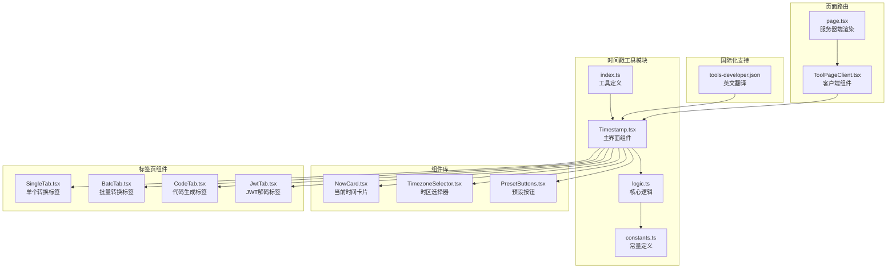

**图表来源**
- [Timestamp.tsx:1-60](file://src/tools/developer/timestamp/Timestamp.tsx#L1-L60)
- [logic.ts:1-462](file://src/tools/developer/timestamp/logic.ts#L1-L462)
- [constants.ts:1-74](file://src/tools/developer/timestamp/constants.ts#L1-L74)

**章节来源**
- [Timestamp.tsx:1-60](file://src/tools/developer/timestamp/Timestamp.tsx#L1-L60)
- [logic.ts:1-462](file://src/tools/developer/timestamp/logic.ts#L1-L462)
- [constants.ts:1-74](file://src/tools/developer/timestamp/constants.ts#L1-L74)

## 核心组件

### 主界面组件 (Timestamp.tsx)

主界面组件负责整体布局和状态管理，现已重构为多标签页架构：

- **状态管理**：维护时区设置、主时间戳、活动标签页、批量转换状态、JWT令牌等状态
- **时区管理**：集成时区选择器，支持本地时区检测和自定义时区
- **标签页导航**：提供单个转换、批量转换、代码生成、JWT解码四个标签页
- **实时更新**：当前时间卡片每秒自动更新
- **一键使用**：支持将当前时间直接应用到单个转换标签

### 业务逻辑组件 (logic.ts)

业务逻辑组件大幅扩展，包含以下核心功能：

- **多精度转换**：支持s/ms/us/ns四种时间精度的自动检测和转换
- **格式化输出**：提供UTC、本地时间、ISO 8601、RFC 2822、相对时间等多种格式
- **批量处理**：支持多行输入的时间戳批量转换和CSV导出
- **JWT解析**：解析JWT令牌的载荷和时间戳声明
- **代码生成**：生成多种编程语言的时间戳处理代码片段
- **时区处理**：完整的时区偏移计算和格式化支持

### 工具定义 (index.ts)

工具定义文件描述了时间戳工具的元数据，包括：
- 工具标识符和分类
- 图标配置
- SEO设置
- 常见问题配置
- 相关工具推荐

**章节来源**
- [Timestamp.tsx:14-59](file://src/tools/developer/timestamp/Timestamp.tsx#L14-L59)
- [logic.ts:184-223](file://src/tools/developer/timestamp/logic.ts#L184-L223)
- [index.ts:3-41](file://src/tools/developer/timestamp/index.ts#L3-L41)

## 架构概览

时间戳工具采用现代化的React Hooks架构，结合多标签页设计和浏览器原生API。

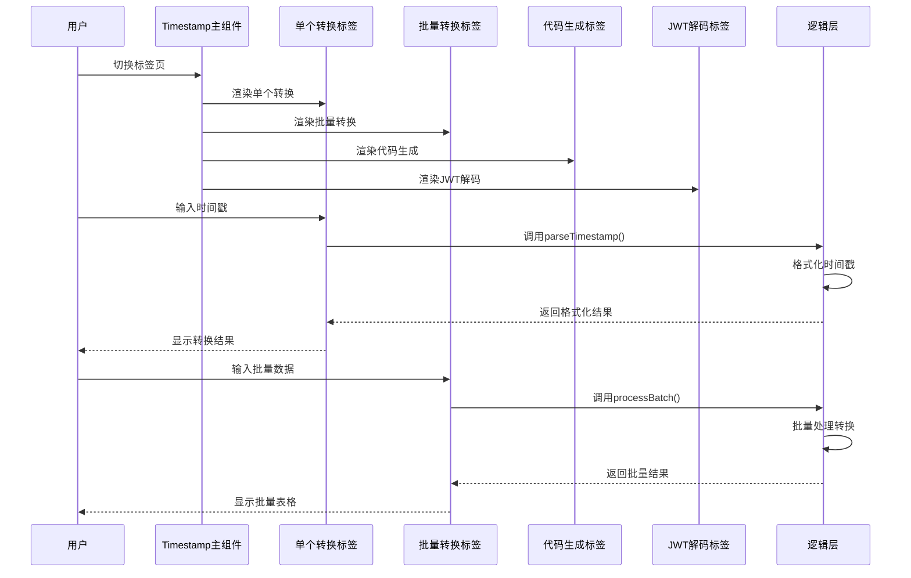

**图表来源**
- [Timestamp.tsx:36-56](file://src/tools/developer/timestamp/Timestamp.tsx#L36-L56)
- [SingleTab.tsx:122-161](file://src/tools/developer/timestamp/tabs/SingleTab.tsx#L122-L161)
- [BatchTab.tsx:40-42](file://src/tools/developer/timestamp/tabs/BatchTab.tsx#L40-L42)

### 数据流图

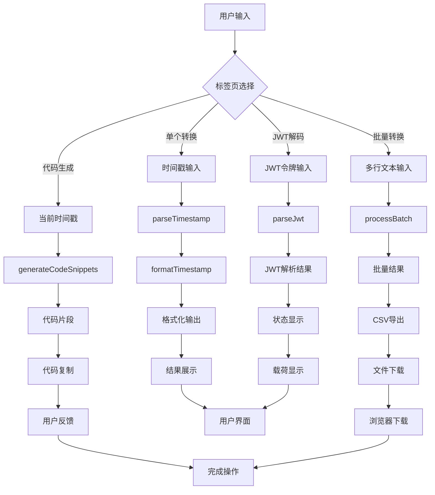

**图表来源**
- [SingleTab.tsx:122-161](file://src/tools/developer/timestamp/tabs/SingleTab.tsx#L122-L161)
- [BatchTab.tsx:40-42](file://src/tools/developer/timestamp/tabs/BatchTab.tsx#L40-L42)
- [CodeTab.tsx:21-25](file://src/tools/developer/timestamp/tabs/CodeTab.tsx#L21-L25)
- [JwtTab.tsx:20-23](file://src/tools/developer/timestamp/tabs/JwtTab.tsx#L20-L23)

## 详细组件分析

### 时间戳转换算法

时间戳转换算法已升级为支持多精度处理的智能系统。

#### 多精度自动检测

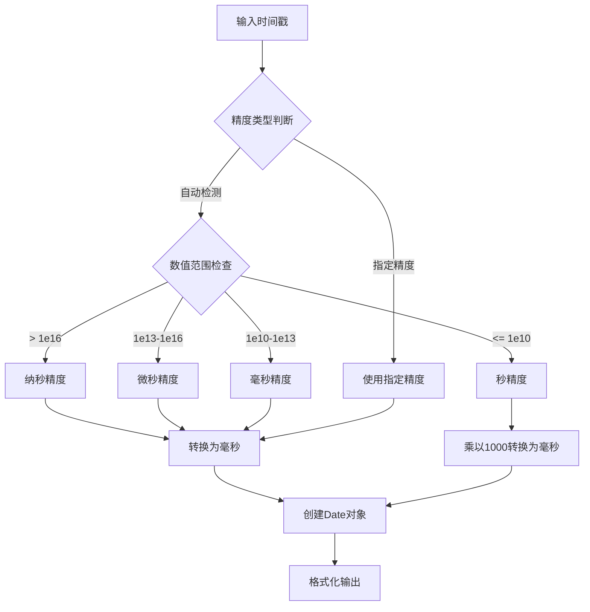

**图表来源**
- [logic.ts:62-89](file://src/tools/developer/timestamp/logic.ts#L62-L89)
- [constants.ts:68-74](file://src/tools/developer/timestamp/constants.ts#L68-L74)

#### 相对时间计算

相对时间功能提供了更加丰富的人性化时间显示：

| 时间单位 | 范围 | 示例 | 语言支持 |
|---------|------|------|----------|
| 秒 | 0-59 | 30 秒前 | Intl.RelativeTimeFormat |
| 分钟 | 1-59 | 5 分钟前 | Intl.RelativeTimeFormat |
| 小时 | 1-23 | 2 小时前 | Intl.RelativeTimeFormat |
| 天 | 1-29 | 1 天前 | Intl.RelativeTimeFormat |
| 月 | 1-11 | 6 个月前 | Intl.RelativeTimeFormat |
| 年 | 1+ | 2 年前 | Intl.RelativeTimeFormat |
| 降级方案 | 所有范围 | 30s ago, 5m ago | 传统字符串拼接 |

**章节来源**
- [logic.ts:33-52](file://src/tools/developer/timestamp/logic.ts#L33-L52)
- [SingleTab.tsx:214-238](file://src/tools/developer/timestamp/tabs/SingleTab.tsx#L214-L238)

### 用户界面设计

#### 多标签页架构

界面采用现代化的标签页设计，提供四种不同的使用场景：

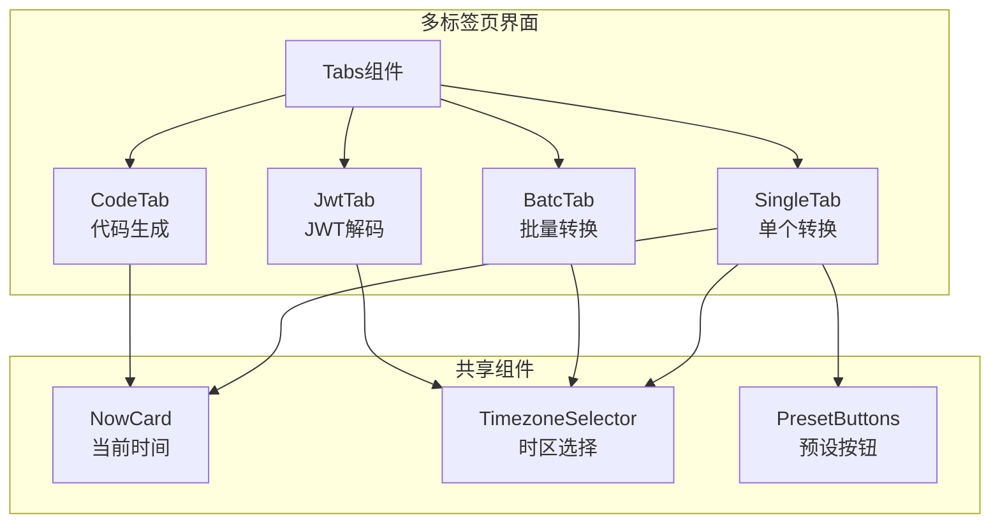

**图表来源**
- [Timestamp.tsx:27-56](file://src/tools/developer/timestamp/Timestamp.tsx#L27-L56)
- [SingleTab.tsx:99-211](file://src/tools/developer/timestamp/tabs/SingleTab.tsx#L99-L211)

#### 实时输入处理

界面采用受控组件模式，实现了智能化的输入处理流程：

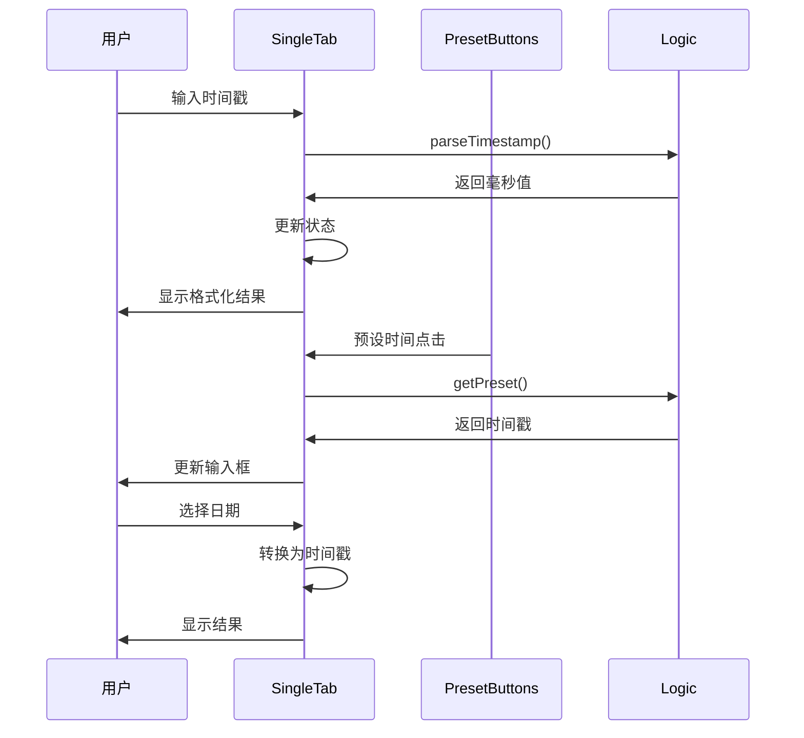

**图表来源**
- [SingleTab.tsx:122-161](file://src/tools/developer/timestamp/tabs/SingleTab.tsx#L122-L161)
- [PresetButtons.tsx:30-70](file://src/tools/developer/timestamp/components/PresetButtons.tsx#L30-L70)

#### 错误处理机制

工具实现了多层次的错误处理机制：

1. **输入验证**：检查数字格式、有效性和范围
2. **日期解析**：验证日期字符串格式和时区兼容性
3. **批量处理**：逐行处理并记录错误信息
4. **JWT解析**：验证令牌结构和载荷格式
5. **用户反馈**：提供清晰的错误消息和状态指示

**章节来源**
- [SingleTab.tsx:129-152](file://src/tools/developer/timestamp/tabs/SingleTab.tsx#L129-L152)
- [BatchTab.tsx:303-326](file://src/tools/developer/timestamp/logic.ts#L303-L326)
- [JwtTab.tsx:39-47](file://src/tools/developer/timestamp/tabs/JwtTab.tsx#L39-L47)

### 国际化支持

时间戳工具支持多语言界面，现已扩展支持新增功能的国际化：

- **界面文本**：所有用户可见的文本都支持国际化
- **占位符文本**：输入框的提示文本可本地化
- **错误消息**：错误提示信息支持多语言
- **FAQ内容**：常见问题解答支持多语言版本
- **代码片段**：代码注释和说明支持多语言

**章节来源**
- [tools-developer.json:513-562](file://messages/en/tools-developer.json#L513-L562)

## 新增功能详解

### 综合时间戳转换

新增的综合时间戳转换功能支持多种精度级别的处理：

#### 精度级别支持

| 精度单位 | 数值范围 | 转换因子 | 示例用途 |
|---------|----------|----------|----------|
| 秒 (s) | 0-9999999999 | ×1000 | 标准Unix时间戳 |
| 毫秒 (ms) | 0-9999999999999 | ×1 | 精确到毫秒 |
| 微秒 (us) | 0-9999999999999999 | ÷1000 | 高精度科学计算 |
| 纳秒 (ns) | 0-999999999999999999 | ÷1000000 | 超高精度测量 |

#### 自动精度检测算法

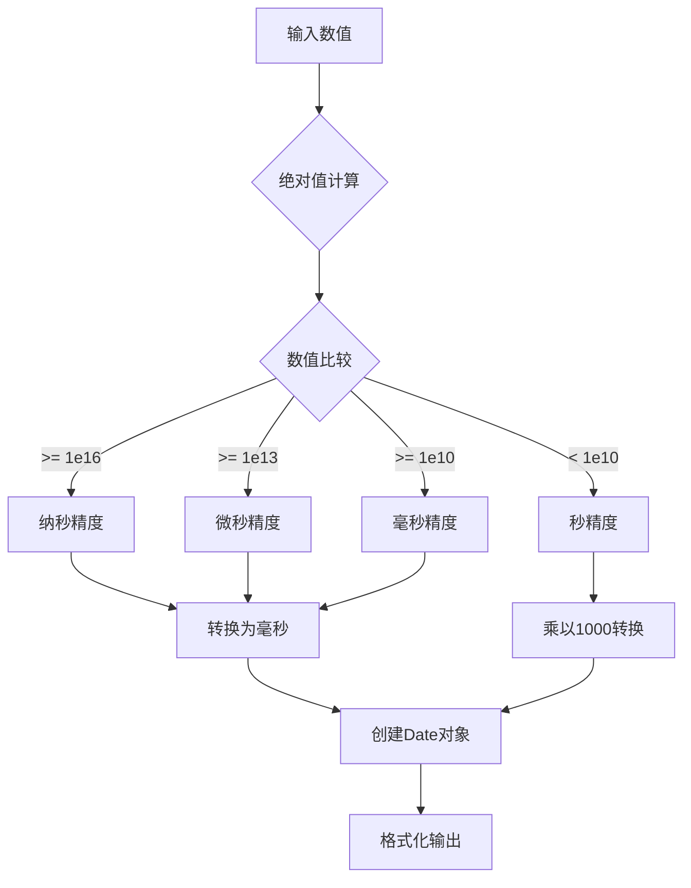

**图表来源**
- [logic.ts:72-89](file://src/tools/developer/timestamp/logic.ts#L72-L89)

### 时区支持系统

全新的时区支持系统提供了完整的时区处理能力：

#### 时区选择器功能

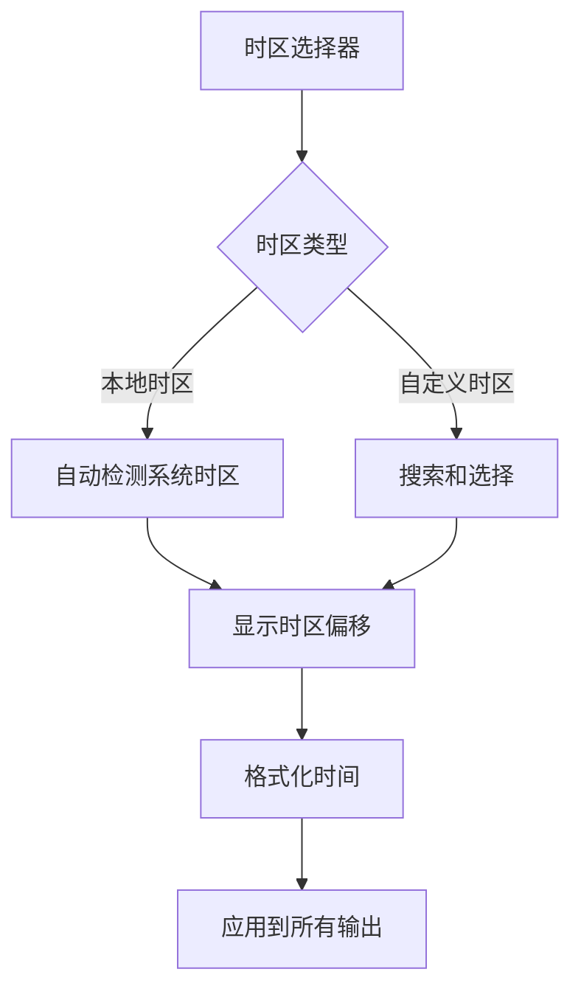

**图表来源**
- [TimezoneSelector.tsx:67-170](file://src/tools/developer/timestamp/components/TimezoneSelector.tsx#L67-L170)
- [logic.ts:91-97](file://src/tools/developer/timestamp/logic.ts#L91-L97)

#### 时区偏移计算

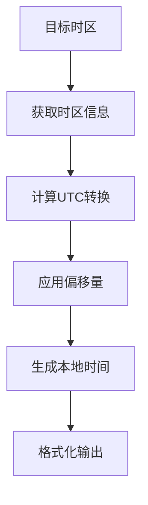

**图表来源**
- [TimezoneSelector.tsx:22-59](file://src/tools/developer/timestamp/components/TimezoneSelector.tsx#L22-L59)
- [logic.ts:261-284](file://src/tools/developer/timestamp/logic.ts#L261-L284)

### 批量转换功能

批量转换功能支持多行输入的时间戳批量处理：

#### 批量处理流程

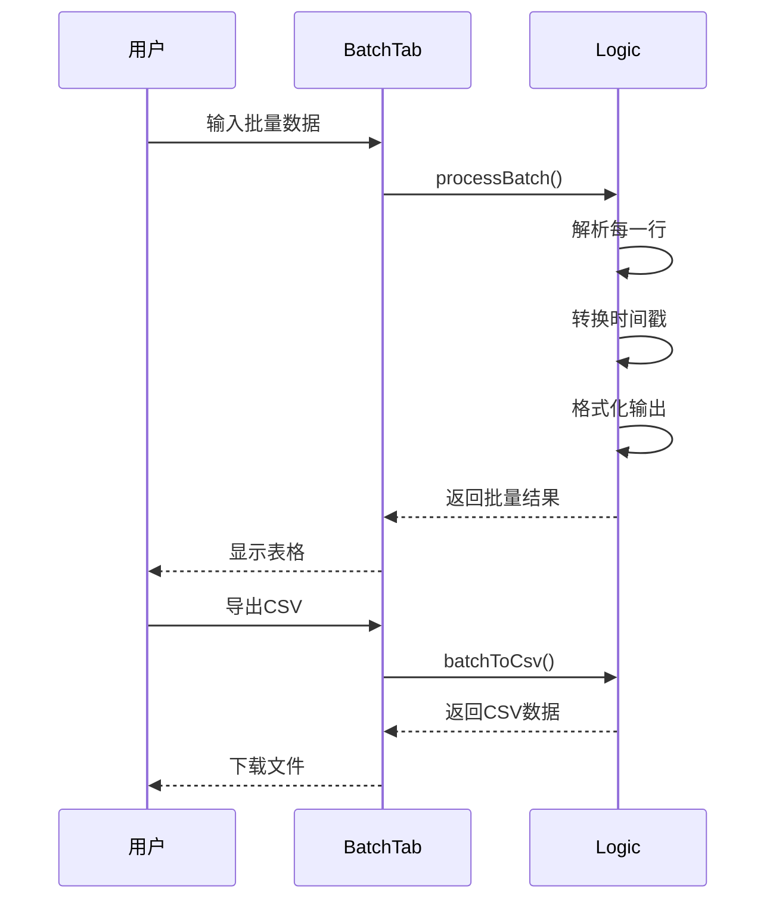

**图表来源**
- [BatchTab.tsx:40-60](file://src/tools/developer/timestamp/tabs/BatchTab.tsx#L40-L60)
- [logic.ts:297-351](file://src/tools/developer/timestamp/logic.ts#L297-L351)

#### CSV导出格式

批量转换结果支持标准CSV格式导出，包含以下字段：

| 字段名 | 描述 | 示例值 |
|--------|------|--------|
| input | 原始输入内容 | "2023-12-01 12:00:00" |
| ok | 转换是否成功 | true/false |
| timestamp_s | 秒级时间戳 | 1701436800 |
| timestamp_ms | 毫秒级时间戳 | 1701436800000 |
| utc | UTC时间格式 | "2023-12-01T12:00:00.000Z" |
| local | 本地时间格式 | "2023-12-01 19:00:00 GMT+0800" |
| iso | ISO 8601格式 | "2023-12-01T12:00:00.000Z" |
| error | 错误信息 | "Invalid date" |

**章节来源**
- [BatchTab.tsx:48-60](file://src/tools/developer/timestamp/tabs/BatchTab.tsx#L48-L60)
- [logic.ts:335-351](file://src/tools/developer/timestamp/logic.ts#L335-L351)

### 代码生成器

代码生成器支持多种编程语言的时间戳处理代码：

#### 支持的语言和格式

| 语言 | 生成的代码片段 | 用途 |
|------|----------------|------|
| Python | datetime.fromtimestamp() | Python时间处理 |
| JavaScript | new Date().toISOString() | Web前端处理 |
| Go | time.Unix().UTC() | Go语言处理 |
| Bash | date -u -d @timestamp | Linux/macOS命令行 |
| SQL | to_timestamp()/FROM_UNIXTIME() | 数据库查询 |

#### 代码生成流程

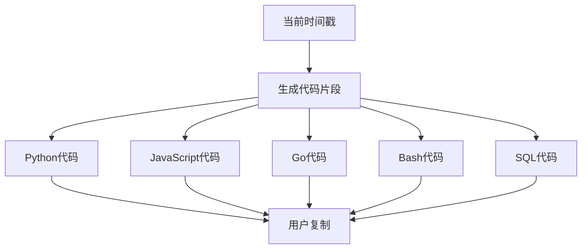

**图表来源**
- [CodeTab.tsx:17-25](file://src/tools/developer/timestamp/tabs/CodeTab.tsx#L17-L25)
- [logic.ts:419-461](file://src/tools/developer/timestamp/logic.ts#L419-L461)

### JWT解码功能

JWT解码功能支持解析JWT令牌的载荷和时间戳声明：

#### JWT解析流程

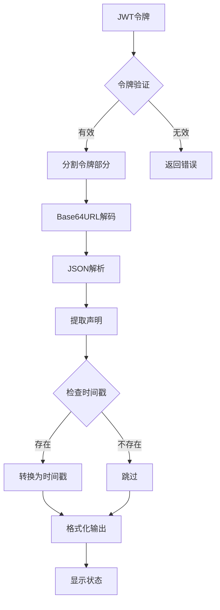

**图表来源**
- [JwtTab.tsx:20-23](file://src/tools/developer/timestamp/tabs/JwtTab.tsx#L20-L23)
- [logic.ts:382-417](file://src/tools/developer/timestamp/logic.ts#L382-L417)

#### 支持的JWT声明

| 声明 | 类型 | 描述 | 状态显示 |
|------|------|------|----------|
| iat | number | 发布时间 | 不适用 |
| nbf | number | 生效时间 | 未生效/有效 |
| exp | number | 过期时间 | 有效/已过期 |

**章节来源**
- [JwtTab.tsx:88-115](file://src/tools/developer/timestamp/tabs/JwtTab.tsx#L88-L115)
- [logic.ts:353-365](file://src/tools/developer/timestamp/logic.ts#L353-L365)

## 依赖关系分析

### 组件间依赖

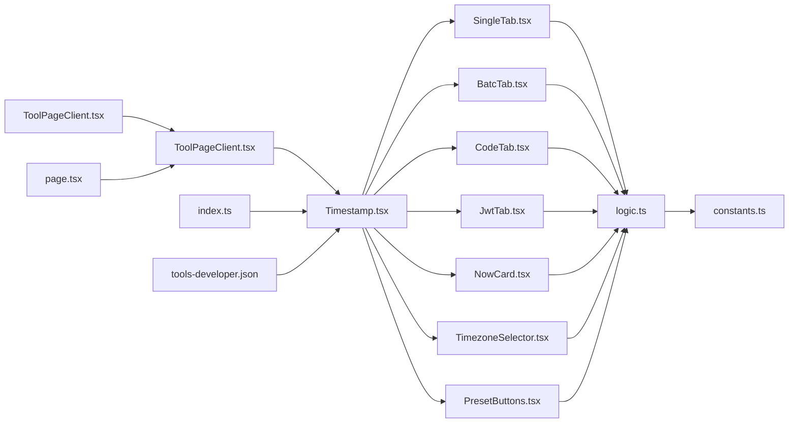

**图表来源**
- [Timestamp.tsx:14-59](file://src/tools/developer/timestamp/Timestamp.tsx#L14-L59)
- [SingleTab.tsx:99-211](file://src/tools/developer/timestamp/tabs/SingleTab.tsx#L99-L211)

### 外部依赖

时间戳工具的外部依赖包括：

- **React Hooks**：useState、useEffect、useMemo、useCallback
- **Next.js国际化**：next-intl用于多语言支持
- **浏览器原生API**：Intl.DateTimeFormat、Intl.RelativeTimeFormat、Blob
- **Lucide图标库**：提供现代化的图标组件
- **自定义UI组件**：Tabs、Select、Button等

**章节来源**
- [Timestamp.tsx:3-7](file://src/tools/developer/timestamp/Timestamp.tsx#L3-L7)
- [ToolPageClient.tsx:3-9](file://src/app/[locale]/tools/[category]/[slug]/ToolPageClient.tsx#L3-L9)

## 性能考虑

### 浏览器本地处理优势

时间戳工具采用纯前端实现，具有以下性能优势：

- **零网络延迟**：所有计算在用户浏览器中完成
- **无服务器负载**：不需要后端服务器处理请求
- **离线可用**：页面加载后可完全离线使用
- **内存效率**：只在需要时创建和销毁DOM元素

### 优化策略

1. **懒加载组件**：使用React.lazy按需加载工具组件
2. **状态缓存**：避免重复计算相同的结果
3. **防抖处理**：减少频繁输入导致的重复计算
4. **虚拟滚动**：对于大量历史记录使用虚拟化技术
5. **批量处理限制**：限制批量转换的最大行数防止内存溢出
6. **时区列表缓存**：缓存时区列表避免重复获取

**章节来源**
- [constants.ts:66](file://src/tools/developer/timestamp/constants.ts#L66)
- [TimezoneSelector.tsx:82-92](file://src/tools/developer/timestamp/components/TimezoneSelector.tsx#L82-L92)

## 故障排除指南

### 常见问题及解决方案

#### 时间戳格式错误

**问题**：输入的时间戳格式不正确
**解决方法**：
- 确认输入的是纯数字
- 检查是否包含多余的空格或字符
- 验证时间戳是否在合理范围内
- 选择正确的精度单位

#### 日期解析失败

**问题**：日期字符串无法被正确解析
**解决方法**：
- 使用标准的ISO 8601格式：YYYY-MM-DDTHH:mm:ss
- 确保日期字符串符合JavaScript Date构造函数要求
- 检查时区设置是否正确
- 验证时区名称是否有效

#### 批量转换超时

**问题**：批量转换处理大量数据时超时
**解决方法**：
- 减少单次批量转换的数据量
- 使用更简单的输入格式
- 分批处理大数据集
- 检查浏览器性能和内存使用

#### JWT解码失败

**问题**：JWT令牌无法正确解析
**解决方法**：
- 确认JWT令牌格式正确（三部分用点分隔）
- 检查Base64URL编码是否有效
- 验证JWT声明格式
- 确认令牌未被篡改

#### 时区显示异常

**问题**：时区选择器显示不正确
**解决方法**：
- 检查浏览器的Intl支持
- 验证时区名称是否正确
- 尝试刷新页面重新加载时区数据
- 使用本地时区选项

**章节来源**
- [SingleTab.tsx:129-152](file://src/tools/developer/timestamp/tabs/SingleTab.tsx#L129-L152)
- [BatchTab.tsx:303-326](file://src/tools/developer/timestamp/logic.ts#L303-L326)
- [JwtTab.tsx:39-47](file://src/tools/developer/timestamp/tabs/JwtTab.tsx#L39-L47)

## 结论

时间戳工具经过重大升级，现已发展为功能全面的综合性时间处理工具。新版本通过以下改进提升了用户体验和技术能力：

### 技术优势
- **多精度支持**：支持秒、毫秒、微秒、纳秒级精度处理
- **完整时区系统**：提供本地时区检测和自定义时区支持
- **批量处理能力**：支持大规模数据的时间戳批量转换
- **代码生成器**：提供多种编程语言的代码片段
- **JWT解码功能**：支持JWT令牌的完整解析
- **多标签页架构**：提供更好的用户体验和功能组织
- **纯前端实现**：确保用户隐私和数据安全
- **实时响应**：提供即时的用户体验

### 应用价值
- **开发调试**：快速转换API响应时间戳和调试信息
- **批量数据处理**：处理大量时间戳数据的转换需求
- **跨语言开发**：提供多种编程语言的时间戳处理方案
- **安全审计**：解析JWT令牌进行安全分析
- **系统监控**：统一不同系统的时区表示和时间格式
- **数据分析**：提供标准化的时间戳格式便于数据处理

该工具通过现代化的界面设计、强大的功能实现和完善的错误处理机制，为用户提供了高效便捷的综合时间戳处理解决方案。

## 附录

### 使用示例

#### 基本转换操作
1. 在"Unix时间戳"输入框中输入时间戳
2. 选择合适的精度单位（秒/毫秒/微秒/纳秒）
3. 查看下方显示的UTC、本地时间和ISO 8601格式
4. 使用"设置为现在"按钮获取当前时间戳
5. 通过日期选择器输入具体时间获取对应的时间戳

#### 批量转换操作
1. 切换到"批量转换"标签页
2. 选择批量模式（自动/时间戳/日期）
3. 输入多行数据（每行一个时间戳或日期）
4. 点击"转换"按钮处理数据
5. 使用"下载CSV"按钮导出结果

#### 代码生成操作
1. 切换到"代码生成"标签页
2. 选择目标编程语言
3. 复制生成的代码片段到项目中
4. 根据需要调整代码参数

#### JWT解码操作
1. 切换到"JWT解码"标签页
2. 粘贴JWT令牌到输入框
3. 查看令牌的状态（有效/未生效/已过期）
4. 浏览载荷内容和时间戳声明

### 开发者信息

#### 扩展建议
- 添加更多时间格式支持（RFC 2822等）
- 实现历史记录功能
- 增加导入CSV文件功能
- 提供自定义格式模板
- 添加批量转换进度显示

#### 维护要点
- 定期测试不同浏览器的兼容性
- 更新国际化翻译文件
- 优化性能表现
- 加强错误处理机制
- 监控时区数据的准确性
- 确保JWT解析的安全性