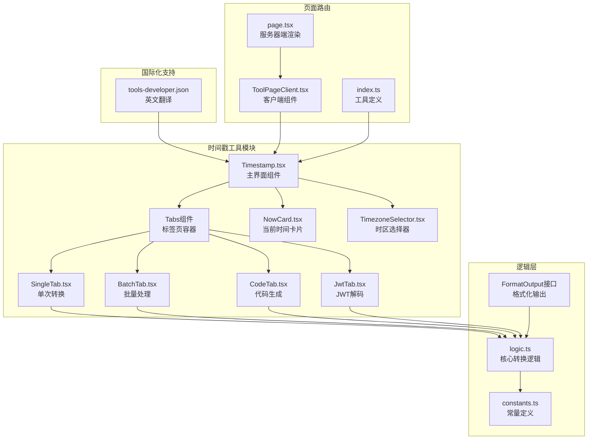
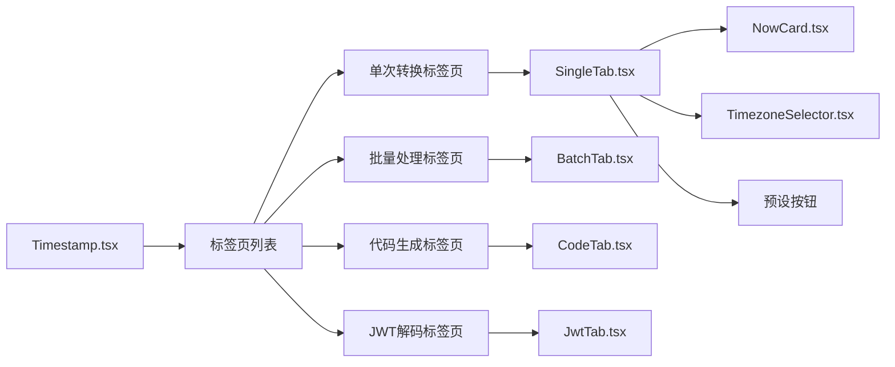
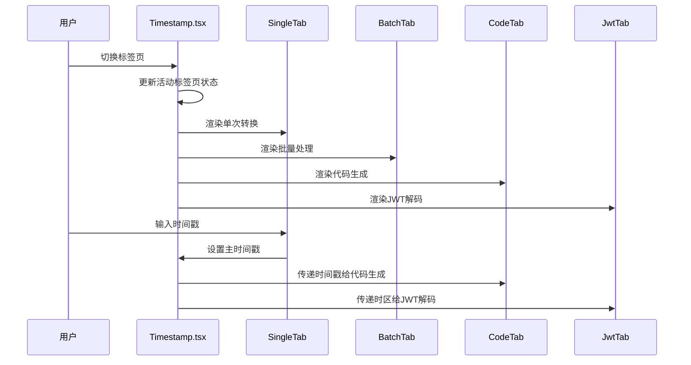
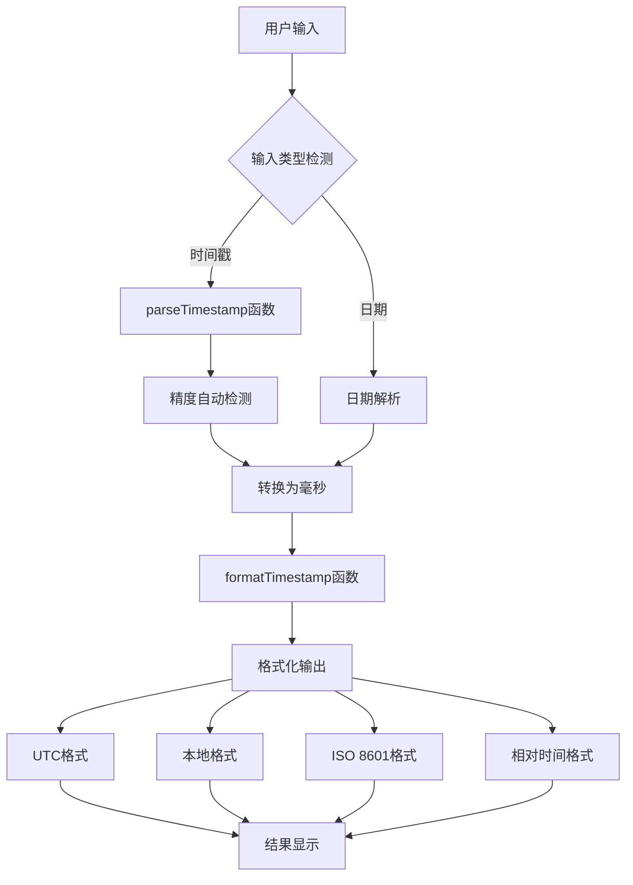
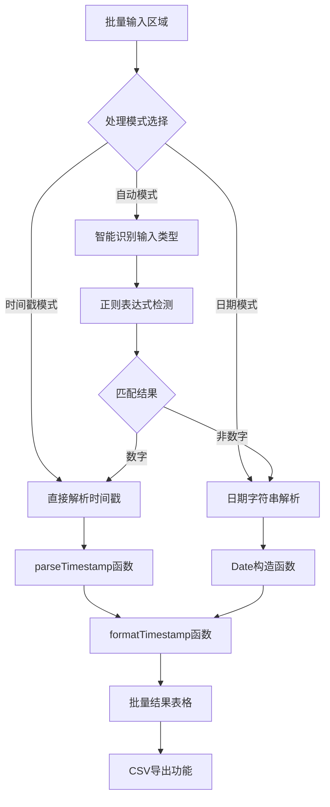
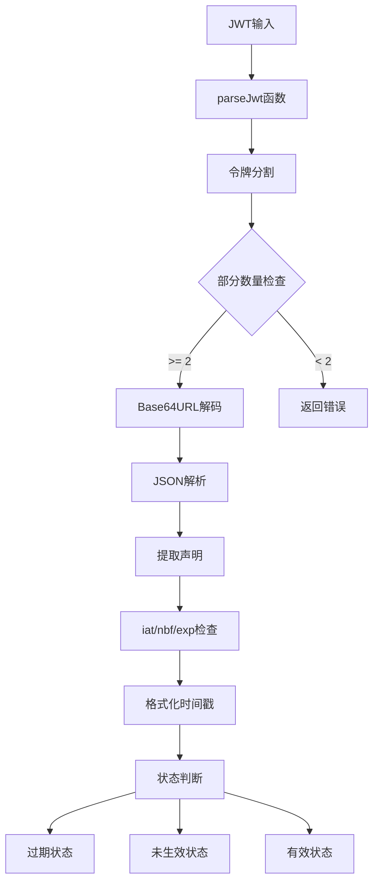
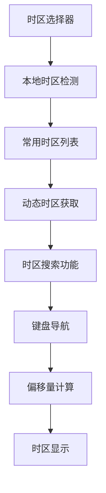
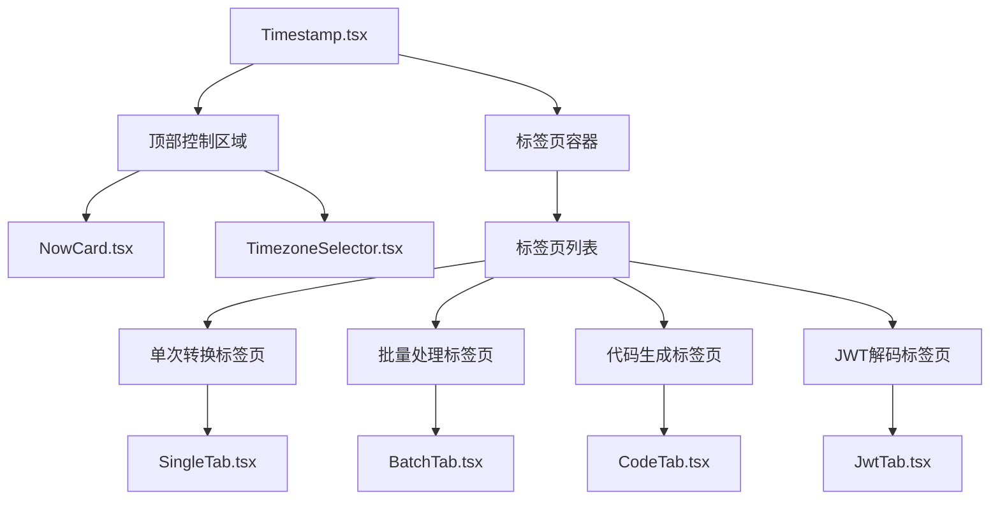
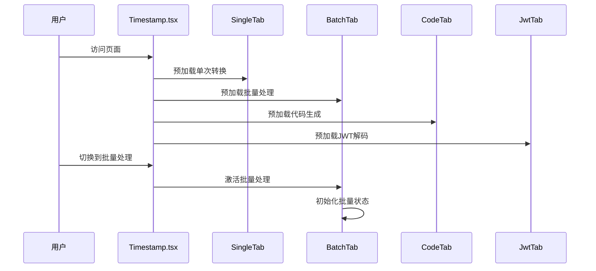

# 时间戳工具

<cite>
**本文档引用的文件**
- [Timestamp.tsx](file://src/tools/developer/timestamp/Timestamp.tsx)
- [SingleTab.tsx](file://src/tools/developer/timestamp/tabs/SingleTab.tsx)
- [BatchTab.tsx](file://src/tools/developer/timestamp/tabs/BatchTab.tsx)
- [CodeTab.tsx](file://src/tools/developer/timestamp/tabs/CodeTab.tsx)
- [JwtTab.tsx](file://src/tools/developer/timestamp/tabs/JwtTab.tsx)
- [NowCard.tsx](file://src/tools/developer/timestamp/components/NowCard.tsx)
- [TimezoneSelector.tsx](file://src/tools/developer/timestamp/components/TimezoneSelector.tsx)
- [logic.ts](file://src/tools/developer/timestamp/logic.ts)
- [constants.ts](file://src/tools/developer/timestamp/constants.ts)
- [index.ts](file://src/tools/developer/timestamp/index.ts)
- [tools-developer.json](file://messages/en/tools-developer.json)
- [ToolPageClient.tsx](file://src/app/[locale]/tools/[category]/[slug]/ToolPageClient.tsx)
- [page.tsx](file://src/app/[locale]/tools/[category]/[slug]/page.tsx)
</cite>

## 更新摘要
**所做更改**
- 从单一界面重构为模块化标签页架构
- 新增批量处理功能，支持批量时间戳转换和CSV导出
- 新增代码生成功能，提供多种编程语言的时间戳代码片段
- 新增JWT解码功能，支持JWT载荷和声明的解析
- 重新设计用户界面，采用现代化的标签页布局
- 增强时区选择器功能，支持搜索和键盘导航
- 优化单次转换功能，支持多种时间单位和预设选项

## 目录
1. [简介](#简介)
2. [架构概览](#架构概览)
3. [模块化标签页架构](#模块化标签页架构)
4. [核心功能详解](#核心功能详解)
5. [批量处理功能](#批量处理功能)
6. [代码生成功能](#代码生成功能)
7. [JWT解码功能](#jwt解码功能)
8. [时区处理机制](#时区处理机制)
9. [用户界面设计](#用户界面设计)
10. [性能优化策略](#性能优化策略)
11. [使用示例](#使用示例)
12. [应用场景](#应用场景)
13. [故障排除指南](#故障排除指南)
14. [总结](#总结)

## 简介

时间戳工具是一个功能强大的在线Unix时间戳转换器，现已重构为模块化标签页架构。该工具支持在Unix时间戳、UTC时间戳和本地时间戳之间进行双向转换，提供实时转换、毫秒级精度处理和多种时间格式显示。

### 主要特性
- **模块化标签页架构**：采用现代化的标签页设计，支持四种独立功能模块
- **批量处理**：支持批量时间戳转换，最多可处理5000行数据并导出为CSV
- **代码生成**：自动生成Python、JavaScript、Go、Bash、SQL等多种语言的时间戳代码
- **JWT解码**：解析JWT令牌，显示载荷和声明信息，包括过期状态
- **多格式显示**：同时显示UTC时间、本地时间、ISO 8601格式和相对时间
- **毫秒精度**：自动检测并处理毫秒级Unix时间戳
- **实时更新**：输入变化时即时显示转换结果
- **浏览器本地处理**：所有计算都在用户浏览器中完成，无需网络传输

## 架构概览

时间戳工具采用模块化的标签页架构设计，结合了现代React Hooks模式和浏览器原生API。



**图表来源**
- [Timestamp.tsx:14-59](file://src/tools/developer/timestamp/Timestamp.tsx#L14-L59)
- [SingleTab.tsx:99-211](file://src/tools/developer/timestamp/tabs/SingleTab.tsx#L99-L211)
- [BatchTab.tsx:21-157](file://src/tools/developer/timestamp/tabs/BatchTab.tsx#L21-L157)
- [CodeTab.tsx:17-66](file://src/tools/developer/timestamp/tabs/CodeTab.tsx#L17-L66)
- [JwtTab.tsx:9-140](file://src/tools/developer/timestamp/tabs/JwtTab.tsx#L9-L140)

## 模块化标签页架构

### 标签页组织结构

时间戳工具现在采用四个主要标签页模块，每个模块专注于特定的功能领域：



**图表来源**
- [Timestamp.tsx:36-56](file://src/tools/developer/timestamp/Timestamp.tsx#L36-L56)
- [SingleTab.tsx:99-211](file://src/tools/developer/timestamp/tabs/SingleTab.tsx#L99-L211)

### 状态管理架构



**图表来源**
- [Timestamp.tsx:14-25](file://src/tools/developer/timestamp/Timestamp.tsx#L14-L25)
- [Timestamp.tsx:16-20](file://src/tools/developer/timestamp/Timestamp.tsx#L16-L20)

## 核心功能详解

### 单次转换功能

单次转换标签页提供了最基础的时间戳转换功能，支持多种时间单位和预设选项。

#### 支持的时间单位

| 单位 | 数值范围 | 描述 | 示例 |
|------|----------|------|------|
| 秒(s) | 1e0 - 1e10 | 标准Unix时间戳 | 1640995200 |
| 毫秒(ms) | 1e3 - 1e13 | 毫秒级精度 | 1640995200000 |
| 微秒(us) | 1e6 - 1e16 | 微秒级精度 | 1640995200000000 |
| 纳秒(ns) | 1e9 - 1e19 | 纳秒级精度 | 1640995200000000000 |

#### 预设时间选项

| 预设名称 | 描述 | UTC时间示例 |
|----------|------|-------------|
| 现在(now) | 当前时间 | 2024-01-01 12:00:00 UTC |
| 今天(today) | 今日开始 | 2024-01-01 00:00:00 UTC |
| 昨天(yesterday) | 昨日开始 | 2023-12-31 00:00:00 UTC |
| 明天(tomorrow) | 明日开始 | 2024-01-02 00:00:00 UTC |
| 月初(monthStart) | 本月第一天 | 2024-01-01 00:00:00 UTC |
| 年初(yearStart) | 今年第一天 | 2024-01-01 00:00:00 UTC |

**章节来源**
- [SingleTab.tsx:25-31](file://src/tools/developer/timestamp/tabs/SingleTab.tsx#L25-L31)
- [SingleTab.tsx:225-230](file://src/tools/developer/timestamp/tabs/SingleTab.tsx#L225-L230)
- [SingleTab.tsx:228-259](file://src/tools/developer/timestamp/tabs/SingleTab.tsx#L228-L259)

### 实时转换机制



**图表来源**
- [SingleTab.tsx:122-152](file://src/tools/developer/timestamp/tabs/SingleTab.tsx#L122-L152)
- [logic.ts:62-89](file://src/tools/developer/timestamp/logic.ts#L62-L89)

## 批量处理功能

### 批量处理工作流程

批量处理功能允许用户一次性处理多个时间戳或日期，支持三种处理模式：



**图表来源**
- [BatchTab.tsx:297-326](file://src/tools/developer/timestamp/logic.ts#L297-L326)
- [BatchTab.tsx:40-46](file://src/tools/developer/timestamp/tabs/BatchTab.tsx#L40-L46)

### 批量处理配置选项

| 配置项 | 可选值 | 默认值 | 描述 |
|--------|--------|--------|------|
| 处理模式 | auto, timestamp, date | auto | 自动识别或强制指定输入类型 |
| 时间单位 | auto, s, ms, us, ns | auto | 指定时间戳单位（仅在时间戳模式有效） |
| 最大行数 | 1-5000 | 5000 | 批量处理的最大行数限制 |

### CSV导出格式

批量处理结果可以导出为CSV格式，包含以下列：

| 列名 | 数据类型 | 描述 |
|------|----------|------|
| input | string | 原始输入内容 |
| ok | boolean | 转换是否成功 |
| timestamp_s | number | 秒级时间戳 |
| timestamp_ms | number | 毫秒级时间戳 |
| utc | string | UTC时间格式 |
| local | string | 本地时间格式 |
| iso | string | ISO 8601格式 |
| error | string | 错误信息（如有） |

**章节来源**
- [BatchTab.tsx:12-17](file://src/tools/developer/timestamp/tabs/BatchTab.tsx#L12-L17)
- [BatchTab.tsx:335-351](file://src/tools/developer/timestamp/logic.ts#L335-L351)

## 代码生成功能

### 多语言代码生成

代码生成功能根据当前时间戳自动生成各种编程语言的时间戳处理代码：

```mermaid
graph TB
A[当前时间戳] --> B[generateCodeSnippets函数]
B --> C[Python代码]
B --> D[JavaScript代码]
B --> E[Go代码]
B --> F[Bash代码]
B --> G[SQL代码]
C --> H[datetime.fromtimestamp]
D --> I[new Date(ts * 1000)]
E --> J[time.Unix(ts, 0).UTC()]
F --> K[date -u -d @ts]
G --> L[to_timestamp/ts]
```

**图表来源**
- [CodeTab.tsx:17-25](file://src/tools/developer/timestamp/tabs/CodeTab.tsx#L17-L25)
- [logic.ts:419-461](file://src/tools/developer/timestamp/logic.ts#L419-L461)

### 支持的编程语言

#### Python代码示例
```python
from datetime import datetime, timezone

ts = 1640995200
dt = datetime.fromtimestamp(ts, tz=timezone.utc)
print(dt.isoformat())
```

#### JavaScript代码示例
```javascript
const ts = 1640995200;
const date = new Date(ts * 1000);
console.log(date.toISOString());
```

#### Go代码示例
```go
package main

import (
    "fmt"
    "time"
)

func main() {
    ts := int64(1640995200)
    t := time.Unix(ts, 0).UTC()
    fmt.Println(t.Format(time.RFC3339))
}
```

#### Bash代码示例
```bash
# GNU date (Linux)
date -u -d @1640995200 +"%Y-%m-%dT%H:%M:%SZ"

# BSD date (macOS)
date -u -r 1640995200 +"%Y-%m-%dT%H:%M:%SZ"
```

#### SQL代码示例
```sql
-- PostgreSQL
SELECT to_timestamp(1640995200);

-- MySQL
SELECT FROM_UNIXTIME(1640995200);

-- SQLite
SELECT datetime(1640995200, 'unixepoch');
```

**章节来源**
- [CodeTab.tsx:9-15](file://src/tools/developer/timestamp/tabs/CodeTab.tsx#L9-L15)
- [logic.ts:419-461](file://src/tools/developer/timestamp/logic.ts#L419-L461)

## JWT解码功能

### JWT解析流程

JWT解码功能支持解析JWT令牌，提取载荷和声明信息：



**图表来源**
- [JwtTab.tsx:20-23](file://src/tools/developer/timestamp/tabs/JwtTab.tsx#L20-L23)
- [logic.ts:382-417](file://src/tools/developer/timestamp/logic.ts#L382-L417)

### JWT声明支持

| 声明名称 | 类型 | 描述 | 示例值 |
|----------|------|------|--------|
| iat | number | 发布时间（Unix时间戳） | 1640995200 |
| nbf | number | 生效时间（Unix时间戳） | 1640995200 |
| exp | number | 过期时间（Unix时间戳） | 1640998800 |

### JWT状态指示器

| 状态 | 图标 | 颜色 | 描述 |
|------|------|------|------|
| 过期 | ⚠️ | 红色 | 令牌已过期 |
| 未生效 | ⏰ | 橙色 | 令牌尚未生效 |
| 有效 | ✅ | 绿色 | 令牌有效且未过期 |

**章节来源**
- [JwtTab.tsx:88-115](file://src/tools/developer/timestamp/tabs/JwtTab.tsx#L88-L115)
- [logic.ts:353-365](file://src/tools/developer/timestamp/logic.ts#L353-L365)

## 时区处理机制

### 时区选择器功能

时区选择器提供了完整的时区管理功能，支持搜索、键盘导航和偏移量显示：



**图表来源**
- [TimezoneSelector.tsx:9-20](file://src/tools/developer/timestamp/components/TimezoneSelector.tsx#L9-L20)
- [TimezoneSelector.tsx:22-59](file://src/tools/developer/timestamp/components/TimezoneSelector.tsx#L22-L59)

### 时区偏移量计算

时区偏移量通过以下方式计算：
1. 获取当前日期的时区信息
2. 解析时区部件（年、月、日、时、分、秒）
3. 计算UTC时间差
4. 格式化为UTC±HH:MM格式

### 支持的时区范围

工具内置了全球主要时区列表，包括：
- UTC（协调世界时）
- 北美时区：America/New_York, America/Los_Angeles等
- 欧洲时区：Europe/London, Europe/Paris等
- 亚洲时区：Asia/Shanghai, Asia/Tokyo等
- 澳大利亚时区：Australia/Sydney等

**章节来源**
- [TimezoneSelector.tsx:67-92](file://src/tools/developer/timestamp/components/TimezoneSelector.tsx#L67-L92)
- [constants.ts:1-62](file://src/tools/developer/timestamp/constants.ts#L1-L62)

## 用户界面设计

### 现代化标签页布局

时间戳工具采用了现代化的标签页设计，提供清晰的功能分区：



**图表来源**
- [Timestamp.tsx:27-56](file://src/tools/developer/timestamp/Timestamp.tsx#L27-L56)
- [NowCard.tsx:8-51](file://src/tools/developer/timestamp/components/NowCard.tsx#L8-L51)

### 响应式设计

界面采用响应式设计，适配不同屏幕尺寸：

| 屏幕尺寸 | 布局模式 | 特性 |
|----------|----------|------|
| 移动设备 (<768px) | 单列布局 | 标签页垂直排列，紧凑设计 |
| 平板设备 (768-1024px) | 双列布局 | 控制面板网格布局，标签页水平排列 |
| 桌面设备 (>1024px) | 三列布局 | 控制面板网格布局，标签页水平排列 |

### 交互设计原则

1. **即时反馈**：所有用户操作都有即时视觉反馈
2. **一致性**：各标签页保持一致的设计语言和交互模式
3. **可访问性**：支持键盘导航和屏幕阅读器
4. **错误处理**：提供清晰的错误提示和恢复选项

**章节来源**
- [Timestamp.tsx:29-34](file://src/tools/developer/timestamp/Timestamp.tsx#L29-L34)
- [SingleTab.tsx:164-211](file://src/tools/developer/timestamp/tabs/SingleTab.tsx#L164-L211)

## 性能优化策略

### 懒加载机制

时间戳工具采用了智能的懒加载策略：



**图表来源**
- [Timestamp.tsx:8-11](file://src/tools/developer/timestamp/Timestamp.tsx#L8-L11)
- [BatchTab.tsx:19](file://src/tools/developer/timestamp/tabs/BatchTab.tsx#L19)

### 内存管理优化

1. **状态清理**：组件卸载时自动清理定时器和事件监听器
2. **防抖处理**：输入处理采用防抖机制，减少重复计算
3. **虚拟化表格**：批量处理结果表格支持虚拟化，提升大数据集性能
4. **缓存策略**：常用计算结果进行缓存，避免重复计算

### 浏览器兼容性

工具针对不同浏览器进行了优化：
- **现代浏览器**：充分利用Intl API和现代JavaScript特性
- **旧版浏览器**：提供降级方案和polyfill支持
- **移动浏览器**：优化触摸交互和响应速度

## 使用示例

### 基本转换操作

1. **单次转换**
   - 在"Unix时间戳"输入框中输入时间戳
   - 选择时间单位（秒/毫秒/微秒/纳秒）
   - 查看UTC、本地时间和ISO 8601格式
   - 使用"设置为现在"按钮获取当前时间戳

2. **批量处理**
   - 选择批量处理标签页
   - 选择处理模式（自动/时间戳/日期）
   - 输入或粘贴时间数据
   - 点击"转换"按钮查看结果
   - 导出CSV文件

3. **代码生成**
   - 选择代码生成标签页
   - 选择目标编程语言
   - 复制生成的代码片段

4. **JWT解码**
   - 选择JWT解码标签页
   - 粘贴JWT令牌
   - 查看载荷和声明信息
   - 检查令牌状态

### 高级功能示例

#### 批量处理示例
```
输入数据：
1640995200
2022-01-01 12:00:00
1640995200000

输出结果：
秒级时间戳: 1640995200
毫秒级时间戳: 1640995200000
UTC格式: Sat Jan 01 2022 12:00:00 GMT+0000 (UTC)
本地格式: 2022-01-01 12:00:00 GMT+0000
```

#### 代码生成示例
```python
# Python代码
from datetime import datetime, timezone

ts = 1640995200
dt = datetime.fromtimestamp(ts, tz=timezone.utc)
print(dt.isoformat())
```

**章节来源**
- [SingleTab.tsx:122-152](file://src/tools/developer/timestamp/tabs/SingleTab.tsx#L122-L152)
- [BatchTab.tsx:40-46](file://src/tools/developer/timestamp/tabs/BatchTab.tsx#L40-L46)
- [CodeTab.tsx:21-25](file://src/tools/developer/timestamp/tabs/CodeTab.tsx#L21-L25)

## 应用场景

### 开发调试场景

1. **API响应时间戳解析**
   - 解析API返回的Unix时间戳
   - 转换为可读的日期格式
   - 验证时间戳的准确性

2. **日志分析**
   - 将日志中的时间戳转换为本地时间
   - 分析时间间隔和性能指标
   - 生成时间序列报告

3. **数据库时间字段处理**
   - 转换数据库存储的时间戳
   - 统一不同系统的时区表示
   - 导出标准化的数据格式

### 系统监控场景

1. **分布式系统时间同步**
   - 检查系统间的时间偏差
   - 验证NTP同步状态
   - 诊断时钟漂移问题

2. **性能监控**
   - 分析请求处理时间
   - 计算服务响应延迟
   - 生成性能基准数据

3. **故障排查**
   - 解析错误日志中的时间戳
   - 确定事件发生顺序
   - 追踪问题发生时间

### 数据分析场景

1. **时间序列分析**
   - 转换CSV文件中的时间戳
   - 导出标准化格式数据
   - 准备分析工具的数据源

2. **数据清洗**
   - 识别和修复无效时间戳
   - 统一时区格式
   - 处理时区转换

3. **报表生成**
   - 创建时间维度的统计报表
   - 生成业务指标报告
   - 导出分析结果

### Web开发场景

1. **前端开发**
   - 调试JavaScript时间戳
   - 验证API响应格式
   - 测试时区处理逻辑

2. **后端开发**
   - 验证数据库时间字段
   - 调试时间相关的业务逻辑
   - 测试跨时区功能

3. **DevOps运维**
   - 分析系统日志时间戳
   - 监控服务运行状态
   - 调试部署问题

## 故障排除指南

### 常见问题及解决方案

#### 时间戳格式错误

**问题**：输入的时间戳格式不正确
**解决方法**：
- 确认输入的是纯数字
- 检查是否包含多余的空格或字符
- 验证时间戳是否在合理范围内
- 选择正确的单位（秒/毫秒/微秒/纳秒）

#### 日期解析失败

**问题**：日期字符串无法被正确解析
**解决方法**：
- 使用标准的ISO 8601格式：YYYY-MM-DDTHH:mm:ss
- 确保日期字符串符合JavaScript Date构造函数要求
- 检查时区设置是否正确
- 验证日期的有效性（如闰年、月份天数等）

#### 批量处理超时

**问题**：批量处理大量数据时响应缓慢
**解决方法**：
- 减少批量数据量（建议不超过5000行）
- 选择合适的处理模式
- 清理不必要的空白行
- 使用更高效的输入格式

#### JWT解码失败

**问题**：JWT令牌无法正确解析
**解决方法**：
- 确认JWT令牌格式正确（包含三个点分隔的部分）
- 检查Base64URL编码是否有效
- 验证JWT结构完整性
- 确认令牌未被截断或修改

#### 时区显示异常

**问题**：时区显示不正确或偏移量错误
**解决方法**：
- 检查浏览器的时区设置
- 确认选择的时区名称正确
- 验证夏令时设置
- 尝试刷新页面重新加载时区数据

**章节来源**
- [SingleTab.tsx:129-135](file://src/tools/developer/timestamp/tabs/SingleTab.tsx#L129-L135)
- [BatchTab.tsx:310-323](file://src/tools/developer/timestamp/logic.ts#L310-L323)
- [JwtTab.tsx:39-47](file://src/tools/developer/timestamp/tabs/JwtTab.tsx#L39-L47)

## 总结

时间戳工具经过重构后，从单一界面发展为功能完善的模块化标签页架构。新版本不仅保持了原有的核心功能，还大幅增强了实用性和用户体验。

### 技术改进

1. **架构升级**：模块化设计提高了代码的可维护性和扩展性
2. **功能增强**：新增批量处理、代码生成、JWT解码三大核心功能
3. **性能优化**：懒加载和状态管理优化提升了响应速度
4. **用户体验**：现代化的标签页设计和响应式布局改善了使用体验

### 应用价值

- **开发调试**：提供全面的时间戳处理能力，支持多种编程语言
- **数据分析**：批量处理功能适合大规模数据转换和分析
- **系统监控**：JWT解码功能支持现代认证系统的调试和验证
- **代码生成**：自动生成多语言代码，提高开发效率

### 未来发展方向

1. **功能扩展**：考虑添加更多时间格式支持和转换选项
2. **性能提升**：进一步优化大数据集处理能力和内存使用
3. **集成能力**：增强与其他开发工具和平台的集成能力
4. **用户体验**：持续改进界面设计和交互体验

该工具通过精心设计的模块化架构和丰富的功能特性，为用户提供了高效、便捷、可靠的时间戳处理解决方案，满足了从个人开发者到企业用户的多样化需求。