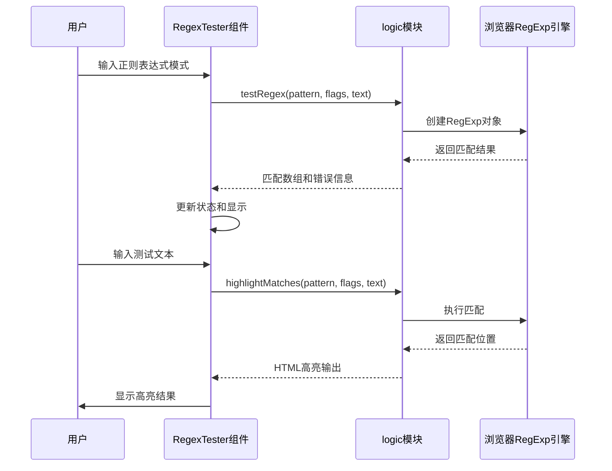
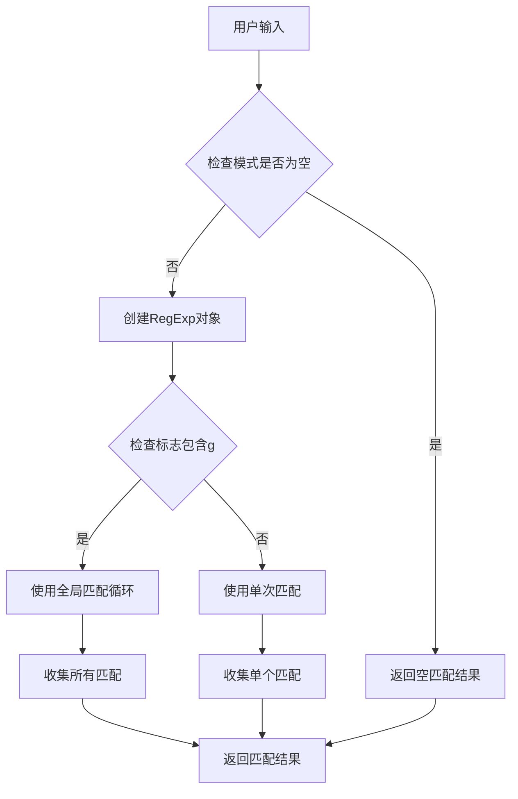
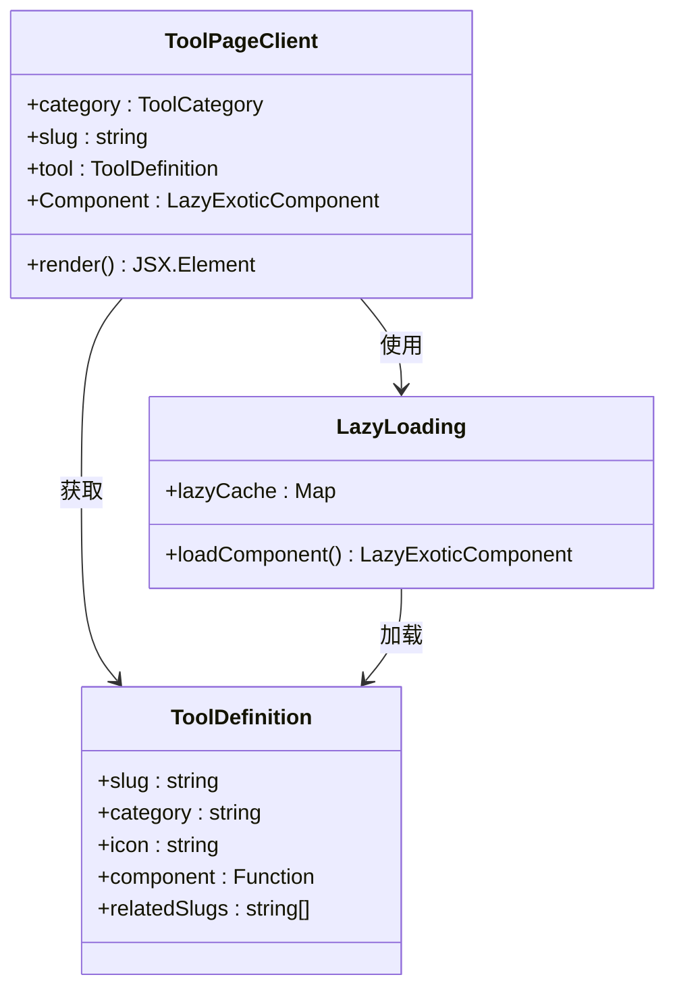
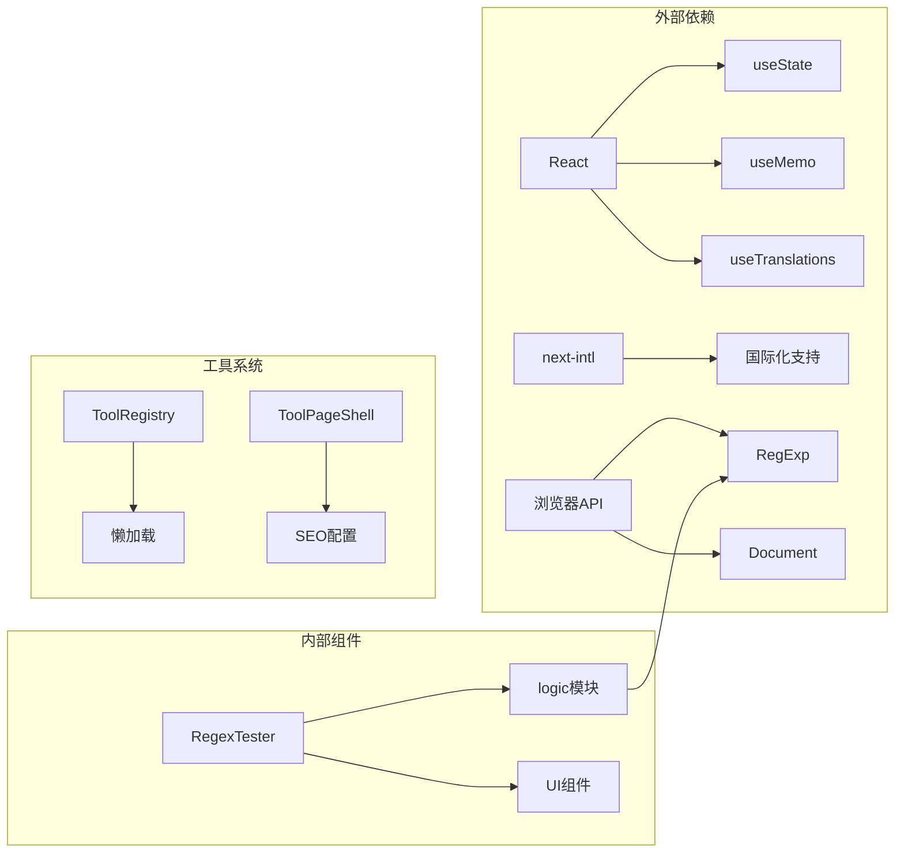

# 正则表达式测试工具

<cite>
**本文档引用的文件**
- [RegexTester.tsx](file://src/tools/developer/regex-tester/RegexTester.tsx)
- [logic.ts](file://src/tools/developer/regex-tester/logic.ts)
- [index.ts](file://src/tools/developer/regex-tester/index.ts)
- [ToolPageClient.tsx](file://src/app/[locale]/tools/[category]/[slug]/ToolPageClient.tsx)
- [tools-developer.json](file://messages/en/tools-developer.json)
- [tools-developer.json](file://messages/zh-Hans/tools-developer.json)
</cite>

## 目录
1. [简介](#简介)
2. [项目结构](#项目结构)
3. [核心组件](#核心组件)
4. [架构概览](#架构概览)
5. [详细组件分析](#详细组件分析)
6. [依赖关系分析](#依赖关系分析)
7. [性能考虑](#性能考虑)
8. [故障排除指南](#故障排除指南)
9. [结论](#结论)

## 简介

正则表达式测试工具是一个基于浏览器的在线正则表达式调试和验证工具。该工具允许用户实时测试正则表达式模式，查看匹配结果，分析捕获组，并提供详细的匹配信息。工具完全在浏览器中运行，确保用户数据的隐私和安全。

该工具支持多种正则表达式标志（g、i、m、s），提供实时的匹配高亮显示，支持命名捕获组，并且具有完整的错误处理机制。所有处理都在用户的浏览器中完成，无需将数据上传到任何服务器。

## 项目结构

正则表达式测试工具位于媒体工具箱项目中的开发者工具类别下，采用模块化的设计结构：

```mermaid
graph TB
subgraph "工具模块结构"
A[src/tools/developer/regex-tester/] --> B[RegexTester.tsx]
A --> C[logic.ts]
A --> D[index.ts]
E[src/app/[locale]/tools/] --> F[ToolPageClient.tsx]
G[messages/] --> H[tools-developer.json]
end
subgraph "核心功能"
B --> I[用户界面组件]
C --> J[正则表达式逻辑]
D --> K[工具定义配置]
F --> L[页面客户端渲染]
H --> M[国际化支持]
end
```

**图表来源**
- [RegexTester.tsx:1-154](file://src/tools/developer/regex-tester/RegexTester.tsx#L1-L154)
- [logic.ts:1-84](file://src/tools/developer/regex-tester/logic.ts#L1-L84)
- [index.ts:1-37](file://src/tools/developer/regex-tester/index.ts#L1-L37)

**章节来源**
- [RegexTester.tsx:1-154](file://src/tools/developer/regex-tester/RegexTester.tsx#L1-L154)
- [logic.ts:1-84](file://src/tools/developer/regex-tester/logic.ts#L1-L84)
- [index.ts:1-37](file://src/tools/developer/regex-tester/index.ts#L1-L37)

## 核心组件

### 用户界面组件

RegexTester.tsx 是工具的主要用户界面组件，负责处理用户输入、显示匹配结果和提供交互功能。该组件包含以下主要功能：

- **模式输入**：用户可以输入正则表达式模式
- **标志控制**：支持全局(g)、不区分大小写(i)、多行(m)、dotAll(s)标志
- **测试文本**：用户可以输入或粘贴要测试的文本
- **实时高亮**：匹配结果在输入时实时高亮显示
- **匹配详情**：显示详细的匹配信息，包括索引位置和捕获组

### 逻辑处理组件

logic.ts 提供了核心的正则表达式处理功能，包含两个主要函数：

- **testRegex**：执行正则表达式匹配并返回结果
- **highlightMatches**：生成带有高亮标记的HTML输出

### 工具定义组件

index.ts 定义了工具的基本信息、SEO配置和相关工具链接。

**章节来源**
- [RegexTester.tsx:16-153](file://src/tools/developer/regex-tester/RegexTester.tsx#L16-L153)
- [logic.ts:7-84](file://src/tools/developer/regex-tester/logic.ts#L7-L84)
- [index.ts:3-36](file://src/tools/developer/regex-tester/index.ts#L3-L36)

## 架构概览

正则表达式测试工具采用React组件架构，结合浏览器原生的JavaScript正则表达式引擎：



**图表来源**
- [RegexTester.tsx:22-30](file://src/tools/developer/regex-tester/RegexTester.tsx#L22-L30)
- [logic.ts:7-46](file://src/tools/developer/regex-tester/logic.ts#L7-L46)

## 详细组件分析

### RegexTester 组件分析

RegexTester.tsx 是一个完整的React客户端组件，实现了以下功能：

#### 状态管理
- **pattern**：存储正则表达式模式
- **flags**：存储正则表达式标志组合
- **text**：存储测试文本

#### 核心功能实现



**图表来源**
- [logic.ts:11-45](file://src/tools/developer/regex-tester/logic.ts#L11-L45)

#### 错误处理机制

组件实现了完善的错误处理，包括：
- 正则表达式语法错误捕获
- 空模式输入的优雅处理
- 零宽度匹配的无限循环防护

**章节来源**
- [RegexTester.tsx:16-153](file://src/tools/developer/regex-tester/RegexTester.tsx#L16-L153)
- [logic.ts:7-46](file://src/tools/developer/regex-tester/logic.ts#L7-L46)

### logic 模块分析

logic.ts 模块提供了两个核心函数，都基于浏览器原生的RegExp引擎：

#### testRegex 函数
该函数负责执行正则表达式匹配，支持两种模式：

1. **全局匹配模式**（flags包含'g'）
   - 使用while循环遍历所有匹配
   - 处理零宽度匹配的无限循环问题
   - 收集所有匹配的详细信息

2. **单次匹配模式**（默认）
   - 使用exec方法进行单次匹配
   - 返回第一个匹配结果

#### highlightMatches 函数
该函数生成带有HTML高亮标记的输出：
- 转义HTML特殊字符防止XSS攻击
- 使用mark标签高亮匹配部分
- 处理边界情况和错误状态

**章节来源**
- [logic.ts:7-84](file://src/tools/developer/regex-tester/logic.ts#L7-L84)

### 页面渲染架构

ToolPageClient.tsx 实现了工具的页面渲染架构：



**图表来源**
- [ToolPageClient.tsx:29-58](file://src/app/[locale]/tools/[category]/[slug]/ToolPageClient.tsx#L29-L58)
- [index.ts:3-36](file://src/tools/developer/regex-tester/index.ts#L3-L36)

**章节来源**
- [ToolPageClient.tsx:29-58](file://src/app/[locale]/tools/[category]/[slug]/ToolPageClient.tsx#L29-L58)

## 依赖关系分析

正则表达式测试工具的依赖关系相对简单，主要依赖于React和浏览器原生API：



**图表来源**
- [RegexTester.tsx:3-7](file://src/tools/developer/regex-tester/RegexTester.tsx#L3-L7)
- [ToolPageClient.tsx:3-9](file://src/app/[locale]/tools/[category]/[slug]/ToolPageClient.tsx#L3-L9)

### 内部依赖关系

工具的内部依赖关系清晰明确：
- RegexTester 组件依赖 logic 模块进行核心逻辑处理
- index.ts 文件提供工具的元数据和配置
- ToolPageClient.tsx 负责页面的整体渲染和懒加载

**章节来源**
- [RegexTester.tsx:3-7](file://src/tools/developer/regex-tester/RegexTester.tsx#L3-L7)
- [index.ts:3-8](file://src/tools/developer/regex-tester/index.ts#L3-L8)

## 性能考虑

正则表达式测试工具在性能方面采用了多项优化策略：

### 1. 懒加载机制
- 使用 React.lazy 和 Suspense 实现组件懒加载
- 通过缓存机制避免重复加载相同的组件
- 减少初始页面加载时间

### 2. 计算优化
- 使用 useMemo 避免不必要的重新计算
- 实现了零宽度匹配的无限循环防护
- 优化了高亮处理的算法效率

### 3. 内存管理
- 及时清理不再使用的组件实例
- 避免内存泄漏的资源管理
- 合理的错误状态处理

### 4. 浏览器优化
- 直接使用浏览器原生的RegExp引擎
- 利用浏览器的JavaScript引擎优化
- 减少跨浏览器兼容性检查开销

## 故障排除指南

### 常见问题及解决方案

#### 1. 正则表达式语法错误
**症状**：工具显示错误消息，匹配结果为空
**解决方法**：
- 检查正则表达式语法是否正确
- 确认特殊字符是否正确转义
- 验证括号和方括号是否正确闭合

#### 2. 匹配结果不完整
**症状**：某些匹配项没有被找到
**解决方法**：
- 检查是否启用了全局匹配标志(g)
- 确认文本中是否存在零宽度匹配
- 验证正则表达式模式是否正确

#### 3. 性能问题
**症状**：大文本处理缓慢
**解决方法**：
- 考虑简化正则表达式模式
- 避免使用过于复杂的量词组合
- 分批处理超长文本

#### 4. 高亮显示异常
**症状**：匹配文本高亮不正确
**解决方法**：
- 检查HTML转义是否正确
- 验证正则表达式是否包含特殊字符
- 确认标志设置是否正确

**章节来源**
- [logic.ts:40-45](file://src/tools/developer/regex-tester/logic.ts#L40-L45)
- [RegexTester.tsx:89-93](file://src/tools/developer/regex-tester/RegexTester.tsx#L89-L93)

## 结论

正则表达式测试工具是一个设计精良、功能完整的在线调试工具。它成功地结合了现代Web技术的最佳实践：

### 主要优势
- **隐私保护**：所有处理都在浏览器中完成，用户数据完全私密
- **实时反馈**：提供即时的匹配结果和高亮显示
- **用户友好**：简洁直观的界面设计，易于使用
- **功能完整**：支持多种正则表达式特性，包括命名捕获组

### 技术特点
- 采用React Hooks实现高效的组件状态管理
- 使用浏览器原生API确保性能和兼容性
- 实现了完善的错误处理和边界情况处理
- 通过懒加载优化页面性能

### 应用价值
该工具对于开发者、数据分析师和内容创作者都具有重要价值，可以帮助他们：
- 快速测试和调试正则表达式
- 学习和理解正则表达式语法
- 进行文本数据的提取和验证
- 开发和维护基于正则表达式的应用

通过持续的优化和改进，这个工具将继续为用户提供更好的正则表达式开发体验。